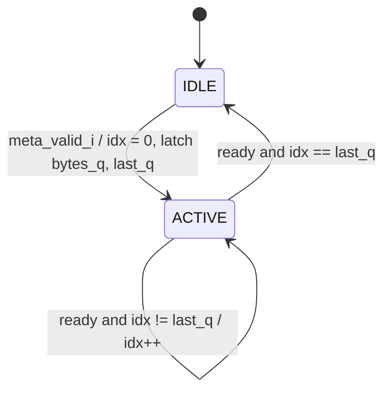

# cxp_app_image_header

Inputs chosen from the tree: RTL `src/rtl/app/cxp_app_image_header.sv` (+ child `cxp_app_marker_seq.sv`, packages `cxp_pkg.sv`, `cxp_util_pkg.sv`); unit TB `src/tb_unit/app/cxp_app_image_header/`; integration TBs `src/tb_unit/top/cxp_stream_top/` and `src/tb_unit/top/cxp_device_top/`; spec JIIA CXP-001-2015 v1.1.1 (`docs/spec/CXP-001-2015.pdf`) §8.5, §9.2, §9.3, §9.4.6.1–9.4.6.2 (Table 38), §9.4.7.1–9.4.7.2 (Table 40); regression `make -C src/tb_unit`; output `docs/design/modules/app/cxp_app_image_header.md`.

Emits one CXP image header per 1-cycle trigger pulse, as a burst of 32-bit words under valid/ready. Each word carries one byte replicated in all four lanes. This module only lays the frame metadata out as a byte vector; the shared `cxp_app_marker_seq` latches the vector and sends it (`docs/design/modules/app/cxp_app_marker_seq.md`).

| Field | Rect word (RTL idx) | Arb word (RTL idx) | Byte source |
|---|---|---|---|
| Stream marker | 1 (0) | 1 (0) | 4×K28.3 = 0x7C, kmask 0xF (added by `cxp_app_marker_seq`) |
| Header type | 2 (1): 0x01 | 2 (1): 0x03 | `HDR_TYPE_REC` / `HDR_TYPE_ARB` |
| StreamID | 3 (2) | 3 (2) | `meta_i.streamid` (8 bit) |
| SourceTag [15:8], [7:0] | 4–5 (3–4) | 4–5 (3–4) | `meta_i.sourcetag` |
| Xsize, Xoffs (24 bit each) | 6–8, 9–11 (5–10) | — | `meta_i.xsize`, `meta_i.xoffs` |
| Ysize, Yoffs (24 bit each) | 12–14, 15–17 (11–16) | 6–8, 9–11 (5–10) | `meta_i.ysize`, `meta_i.yoffs` |
| DsizeL (24 bit, 32-bit words per line) | 18–20 (17–19) | — | `dsizel_words(meta_i.xsize, meta_i.pixfmt)` |
| PixelF, TapG (16 bit each) | 21–22, 23–24 (20–23) | 12–13, 14–15 (11–14) | `meta_i.pixfmt`, `meta_i.tapg` |
| Flags | 25 (24) | 16 (15) | `meta_i.flags`, all 8 bits |

Multi-byte fields go MSB first. Every word after the marker has kmask 0. The header is 25 words (rectangular) or 16 words (arbitrary), chosen by `meta_i.arbitrary`.

Source: `src/rtl/app/cxp_app_image_header.sv`. There is one instance, `cxp_app_stream.cxp_app_image_header_i`, with `meta_valid_i = pix_frame_start_i` and `meta_i` = the `cxp_app_stream` `meta_i`. In `cxp_interface_top` that pulse is `pk_word_valid & pk_word_sof & sel_word_ready_pix`, i.e. the accept of a frame's first packed word (`cxp_interface_top.sv:327`). The metadata is one `cxp_pkg::cxp_meta_t`, `sel_meta`: the TPG's `meta_o` or the `ext_meta_*` ports packed into the struct (StreamID truncated to `[7:0]` there), selected by `cfg_use_tpg`. The top then sets `sel_meta.arbitrary` from `cfg_arbitrary`, in TPG mode sets `sel_meta.streamid` from `cfg_streamid` (the Image1StreamID register), and a non-zero `cfg_pixfmt_reg` overrides PixelF (`cxp_interface_top.sv:479-505`). The output feeds the top-priority input of the `cxp_app_stream` merger. From there it goes through the DsizeP chopper, `cxp_cdc_stream_fifo` (app→tx) and `cxp_tx_stream_pkt`, which carries it as stream-packet payload (§8.5, Table 19).

Spec clauses: Table 38 and Table 40 (layout), §9.2 (K28.3 marker), §9.3 (StreamID 0–255). The §9.4.6.1/§9.4.7.1 transmission rules (header before the first line; line-scan repeat every 200 ms) are the pulse source's job.

## Interface

| Name | Default | Meaning |
|---|---|---|
| `RECT_WORDS` (localparam) | 25 | Rectangular header length (Table 38); also `p_MAX_WORDS` of the `cxp_app_marker_seq` instance |
| `ARB_WORDS` (localparam) | 16 | Arbitrary header length (Table 40) |
| `IDX_W` (localparam) | 5 | `$clog2(25)`, the width of `last_idx`. Equals `idx_w(25)` in `cxp_app_marker_seq`. No module parameters. |

| Name | Dir | Width | Description |
|---|---|---|---|
| `app_clk` | in | 1 | Only clock |
| `app_rst_n` | in | 1 | Active-low. Asserts asynchronously; the caller synchronises deassertion |
| `meta_i` | in | `cxp_meta_t` (177) | Frame metadata and header form. Every field is sampled only in the latch cycle. `arbitrary`: 0 = rectangular, 1 = arbitrary. `streamid`: 8 bit. `xsize`, `xoffs`, `dsizeL`: rectangular only. `ysize`, `yoffs`, `pixfmt`, `tapg`, `flags`, `sourcetag`: both forms. `dsizeL` is 16 bit; word 18 (DsizeL[23:16]) is 0 |
| `meta_valid_i` | in | 1 | Trigger (`cxp_app_marker_seq.start_i`). Sampled only while idle |
| `m_word_data_o` | out | 32 | `rep4(byte)` while active, else 0 |
| `m_word_kmask_o` | out | 4 | 0xF on the marker word, else 0 |
| `m_word_valid_o` | out | 1 | `cxp_app_marker_seq.active_q` |
| `m_word_ready_i` | in | 1 | The word is accepted when `m_word_valid_o & m_word_ready_i` |

The separate `cfg_arbitrary_i` and `meta_*_i` ports and the unused `m_word_kchar_o` output are gone; the form now travels in `meta_i.arbitrary`, and StreamID is 8 bits in the struct, so there is no upper byte to drop.

Notes:
- **Reset:** asserts asynchronously and clears the child's `active_q`, `word_idx_q`, `last_q` and `bytes_q`. The port comment here still says "sync-deassert reset" (`cxp_app_image_header.sv:64`) and omits the asynchronous assert; the child's port comment is correct (Minor 1).
- **Clocks:** one domain, `app_clk`, with no internal crossing. In `cxp_interface_top`, `cfg.arbitrary` and `cfg.pixfmt` are `rx_clk` inputs. With `p_ASYNC_CLOCKS` = 1 they reach `app_clk` through one `cxp_cdc_bus` handshake, as one coherent snapshot; with 0 the clocks are one clock. The `ext_meta_*` ports (in `cxp_device_top`, the `s_meta_i` struct) still have no stated domain and no synchroniser. Every field is sampled only in the latch cycle (Open question 3).
- **Output timing:** `m_word_valid_o` is a register. Data and kmask are a 25-way mux of the child's registers (`word_idx_q`, `bytes_q`). No path runs from `m_word_ready_i` or `meta_i` to any output.
- **Stall:** `m_word_ready_i = 0` holds `word_idx_q`, so every output holds. There is no timeout.
- **Comments vs code:** `meta_valid_i` "1-cycle SOF pulse" — a held level re-triggers (How it works). The header says flags are "interlacing, bits 1:0" — bits 7:2 pass through (Minor 2). The header claims the §9.4 text says "27 words" (`cxp_app_image_header.sv:48-51`); the v1.1.1 text never does, and the 27 comes from `docs/design/cxp_camera_ip_modules.md` §2.3 (Minor 1).

## How it works

1. **Byte vector** (combinational, `cxp_app_image_header.sv:103-133`): from `meta_i` one `always_comb` fills `hdr_bytes[24:1]` in Table 38 order (rectangular) or `hdr_bytes[15:1]` in Table 40 order (arbitrary, upper bytes 0), and sets `last_idx` to 24 or 15 from `meta_i.arbitrary`. The vector follows `meta_i` every cycle; only its value in the latch cycle is used.
2. **Latch** (in `cxp_app_marker_seq`, `!active_q & meta_valid_i`): `bytes_q` ← `{hdr_bytes, K28_3}`, `last_q` ← `last_idx`, `word_idx_q` ← 0, `active_q` ← 1. `m_word_ready_i` is ignored in this cycle.
3. **Walk** (`active_q & m_word_ready_i`): `word_idx_q` increments. At `last_q` it clears `active_q` and `word_idx_q`.
4. **Word select**: `m_word_data_o = rep4(bytes_q[word_idx_q])`; idx 0 is K28.3 with kmask 0xF.

The FSM is implicit, inside `cxp_app_marker_seq`: `active_q` plus the counter.

| State | Next | Condition |
|---|---|---|
| IDLE (`active_q = 0`) | ACTIVE, idx 0 | `meta_valid_i` |
| ACTIVE, idx k | ACTIVE, idx k+1 | `m_word_ready_i & k != last_q` |
| ACTIVE, idx `last_q` | IDLE | `m_word_ready_i` |



Same-cycle rules:
- A pulse while `active_q = 1`, including the cycle that accepts the last word, is dropped, not queued, and `bytes_q` is untouched (`cxp_app_marker_seq.sv:95-107`).
- A pulse held high re-latches in the first cycle with `active_q = 0`. With ready = 1 that gives one header every 26 (rect) or 17 (arb) cycles.
- `meta_i` changes after the latch cycle do not affect the header in flight.

Latency and throughput:
- 1 cycle from the pulse to word 0: in the unit VCD the pulse is sampled at 60 ns and K28.3 is accepted at the 70 ns edge.
- A header is 25 or 16 accepted words; with ready = 1, `active_q` is high for exactly that many cycles.
- Pulses must be at least 26 (rect) or 17 (arb) cycles apart, which leaves at least 1 bubble between headers. Peak rate is 25/26 or 16/17 words per cycle.
- Nothing wraps: idx ≤ 24 in a 5-bit register.

Invariants by construction, not asserted: `m_word_valid_o == active_q`; kmask ∈ {0x0, 0xF}, with 0xF only at idx 0; `word_idx_q ≤ last_q`; `bytes_q` constant while active; outputs stable while valid & !ready.

## Arbiter integration

- **Priority:** the `cxp_app_stream` merger is combinational: header > line marker > skid-buffered pixel (`cxp_app_stream.sv:205-226`). `m_word_ready_i` = `merge_ready` = FIFO not full, with no register in between. Nothing preempts the header.
- **Packetisation:** the merger has no notion of frames. The DsizeP chopper cuts packets anywhere, so a header can straddle packets or start mid-packet (integration test_12_chopper_residual_across_frame_boundary).
- **What the header preempts:** the line marker and the skid pixel, at any word boundary and unconditionally. The only thing keeping frame order is the pulse source: a pulse that coincides with the accept of the first pixel finds the skid empty or firing. `cxp_interface_top` gates the pulse by `ready`, so the product path is safe.
- **Pulse-ahead contract:** the `cxp_app_stream` port comment says the pulse comes "one cycle BEFORE the first pixel word". Under that contract, if the FIFO back-pressures while the skid still holds the previous frame's last pixel, the new header overtakes that pixel. Probe (not in repo): 12 frames with wire back-pressure put frame 11's header one word early; line markers reorder the same way → Medium 1.
- **Held pulse:** if `pix_frame_start_i` stays high while the first pixel is not accepted, the generator re-latches after every header, and the skid can only fire in the single cycle between two headers. The integration TB's `_push_one_word` holds the pulse this way. Probe (not in repo): 524 headers for 9 frames, and the source never advanced (livelock) → Medium 1.
- **Side-band:** `suppress_stream_i` (§8.7), the arbiter's `m_abort_i` and `stream_ctrl_reset_i` act in `tx_clk` after the FIFO and never reach this module. After a TestMode abandon or an arbiter drop, `cxp_tx_stream_pkt` discards FIFO words up to the next chopper SOP, which need not align with a header. Probe on `cxp_interface_top` at HEAD (not in repo): the TPG was stopped with a 6-of-8-word packet open; 514 cycles later the arbiter watchdog dropped it; on restart the first 2 merged words of the next image, its K28.3 and type 0x01 words, were discarded, so that image reached the host without a header marker (`docs/design/modules/app/cxp_app_stream.md` Critical 1, Open question 2).

## Verification

Tools: Verilator 5.046 with cocotb 2.0.1. No bound SVA covers this module or `cxp_app_marker_seq`. `src/sva/cxp_sva.sv` binds the stream FIFO and packet framer checkers, which run in the `cxp_app_stream` bench. No coverage is collected: the module registers no FSM with `fsm_coverage`.

### Unit TB — `src/tb_unit/app/cxp_app_image_header/test_cxp_app_image_header.py`

- **Wrapper and bring-up:** `tb_cxp_app_image_header_top` keeps the old per-field ports (no `_i`/`_o` suffix: `cfg_arbitrary`, 16-bit `meta_streamid`, `meta_sourcetag` …) and packs them into one `cxp_meta_t` for `meta_i`, taking `meta_streamid[7:0]`. It adds a `TESTCASE` byte. The clock is 10 ns. `reset()` zeroes the inputs with `m_word_ready = 1`, holds reset for 4 edges, then releases it for 2. The internal signals in the waves below (`active_q`, `word_idx_q`) live in `cxp_app_image_header_i.cxp_app_marker_seq_i`.
- **Helpers:**
  - `kick_off`: sets `cfg_arbitrary`, drives the metadata, and holds `meta_valid = 1` for exactly one sampled edge. The metadata is **not** cleared afterwards.
  - `collect_words(n, pattern)`: drives `m_word_ready` from a repeating 0/1 pattern and records data/kmask on each edge where valid & ready (4096-cycle no-progress timeout).
- **Checkers:**
  - `check_byte_replication`: length, then each word equals `rep4` of the expected byte.
  - `check_kmask`: word 0 has kmask 0xF; every other word has 0.
- **Golden model:** `expected_rect_words` / `expected_arb_words` encode the Table 38/40 order; DsizeL comes from `cxp_protocol.stream.dsizel`.

| Test | Stimulus | Expect |
|---|---|---|
| test_01_rect_header_content | default Meta, rect, ready 1 | 25 words byte-exact, marker kmask |
| test_02_arb_header_content | distinct Meta, arb, ready 1 | 16 words byte-exact, marker kmask |
| test_03_byte_replication_majority_vote | as rect; Python flips lane 1 bit 0 | majority vote recovers each byte |
| test_04_streamid_passthrough | 6 rect headers, StreamID 0x0000…0xFFFF | word 2 lane 3 = StreamID[7:0] |
| test_05_header_gating_no_meta_valid | metadata driven, no pulse, 64 cycles | valid never 1 |
| test_06_meta_valid_pulse_during_active_dropped | 2nd pulse at word 7 | header 1 intact; no 2nd header |
| test_07_backpressure | ready 1,0,0,0 repeating | 25 words intact |
| test_08_back_to_back_headers | 3 rect headers, SourceTag 0x1111/2222/3333 | all 3 byte-exact |

#### test_01_rect_header_content
- *Stimulus*: default Meta (StreamID 0x0001, SourceTag 0x1234, Xsize 0x012345, Ysize 0x067890, Xoffs 0x10, Yoffs 0x20, PixelF 0x0101, TapG 0x1111, Flags 0x02), `cfg_arbitrary = 0`. One pulse, sampled on the 3rd edge after reset release. Ready = 1; 25 words captured.
- *Checks*: `check_byte_replication` against `expected_rect_words`; `check_kmask`.
- *Proves*: the latch branch; the rectangular byte vector idx 1–24, including DsizeL = 0x0048D2 (words); marker kmask at idx 0 only; the 1-cycle latency. The inputs stay driven, so it cannot tell a latch from a combinational pass-through.

```wavedrom
{"signal":[
  {"name":"app_clk","wave":"p.....|..."},
  {"name":"meta_valid","wave":"010...|..."},
  {"name":"m_word_ready","wave":"1.....|..."},
  {"name":"active_q","wave":"0.1...|..0"},
  {"name":"word_idx_q","wave":"=..===|===","data":["0","1","2","3","23","24","0"]},
  {"name":"m_word_kmask","wave":"=.==..|...","data":["0","F","0"]},
  {"name":"m_word_data","wave":"=.====|===","data":["0","4×7C","4×01","4×01","4×12","4×11","4×02","0"],"node":"........a."}
]}
```
`a`: the 25th word is accepted and the checkers run.

#### test_02_arb_header_content
- *Stimulus*: Meta with every field distinct and non-zero (StreamID 0x0042, SourceTag 0xCAFE, Xsize 0xABCDEF, Ysize 0x123456, Xoffs 0x010101, Yoffs 0x020202, DsizeL 0xBEEF, PixelF 0x0102, TapG 0x2222, Flags 0x01), `cfg_arbitrary = 1`, ready = 1; 16 words captured.
- *Checks*: `check_byte_replication` against `expected_arb_words`; `check_kmask`.
- *Proves*: the arbitrary byte vector; Xsize/Xoffs/DsizeL are absent. **The capture stops at 16 words and nothing checks that valid drops afterwards. A wrong arbitrary `last_idx` (e.g. 24) would still pass, because idx 16–24 would come after the capture window.**

#### test_03_byte_replication_majority_vote
- *Stimulus*: as test_01_rect_header_content.
- *Checks*: for each of the 25 captured words, Python XORs 0x100 (lane 1, bit 0) and majority-votes each bit (≥ 3 of 4); the result must equal the expected byte.
- *Proves*: nothing beyond test_01_rect_header_content. The corruption is applied to the captured value, not injected into the DUT, and only lane 1 bit 0 is ever flipped. It shows a host-side property of the 4× code.

#### test_04_streamid_passthrough
- *Stimulus*: six rectangular headers with StreamID 0x0000, 0x0001, 0x0042, 0x00FF, 0xAA00 and 0xFFFF, other fields default, ready = 1. After each capture, 1 extra edge.
- *Checks*: word 2 bits [31:24] == StreamID[7:0].
- *Proves*: StreamID reaches word 2, and a re-latch across 6 headers. Lanes 0–2 are not checked. **The `[7:0]` truncation (0xAA00 → 0x00, 0xFFFF → 0xFF) now happens in the wrapper, which packs `meta_streamid[7:0]` into the 8-bit `cxp_meta_t.streamid`; the DUT never sees the upper byte.**

#### test_05_header_gating_no_meta_valid
- *Stimulus*: default Meta driven, `meta_valid = 0`, ready = 1, for 64 cycles after reset.
- *Checks*: `m_word_valid == 0` in `ReadOnly` on every cycle.
- *Proves*: IDLE holds without a pulse, and there is no self-start after reset.

#### test_06_meta_valid_pulse_during_active_dropped
- *Stimulus*: header 1 with SourceTag 0xAAAA, ready = 1. A forked task drives a pulse with SourceTag 0x5555, which is sampled on the edge that accepts word 7 (from the VCD). The metadata returns to header 1's values the next cycle.
- *Checks*: `check_byte_replication` against header 1; `check_kmask`; then 8 cycles of `m_word_valid == 0` (in `ReadOnly`).
- *Proves*: the `!active_q` gate on the latch: no restart and no queued header. **The second pulse differs only in SourceTag, whose words (idx 3–4) have already gone out when it lands. A bug that re-latched `bytes_q` without restarting would also pass.**

```wavedrom
{"signal":[
  {"name":"app_clk","wave":"p.|....|..|."},
  {"name":"meta_valid","wave":"10|.10.|..|.","node":"....a......."},
  {"name":"meta_sourcetag","wave":"=.|.==.|..|.","data":["AAAA","5555","AAAA"]},
  {"name":"active_q","wave":"01|....|.0|.","node":"...........b"},
  {"name":"word_idx_q","wave":"=.|====|==|.","data":["0","6","7","8","9","24","0"]}
]}
```
`a`: the second pulse is sampled at idx 7 and ignored. `b`: the end of the 8-cycle watch; valid is still 0.

#### test_07_backpressure
- *Stimulus*: default Meta, rectangular. Ready follows 1, 0, 0, 0 from the first capture edge. Word 0 is accepted without a stall; words 1–24 each stall for 3 cycles (97 edges in total).
- *Checks*: `check_byte_replication`; `check_kmask`.
- *Proves*: the index advances only on `active_q & m_word_ready_i`, and the outputs hold during a stall. The marker word is never stalled, and arbitrary mode is never stalled.

```wavedrom
{"signal":[
  {"name":"app_clk","wave":"p.........|."},
  {"name":"meta_valid","wave":"10........|."},
  {"name":"m_word_ready","wave":"1.0..10..1|."},
  {"name":"active_q","wave":"01........|."},
  {"name":"word_idx_q","wave":"=.=...=...|=","data":["0","1","2","24"]},
  {"name":"m_word_data","wave":"===...=...|=","data":["0","4×7C","4×01","4×01","4×02"],"node":".....a.....b"}
]}
```
`a`: word 1 is accepted after 3 stall cycles. `b`: the last word is accepted and the checkers run.

#### test_08_back_to_back_headers
- *Stimulus*: three rectangular headers (SourceTag 0x1111, 0x2222, 0x3333), ready = 1. Each pulse is sampled 2 edges after the previous header's last accept.
- *Checks*: `check_byte_replication` for each of the 3 headers.
- *Proves*: ACTIVE idx 24 → IDLE → latch, and a per-header re-latch of `bytes_q`. **The docstring says the pulse comes "the cycle after the last word", but it arrives one cycle later than the earliest slot the RTL accepts. The minimum gap is never exercised, and neither is a pulse in the last-accept cycle (which is dropped).**

```wavedrom
{"signal":[
  {"name":"app_clk","wave":"p......."},
  {"name":"meta_valid","wave":"0..10...","node":"..ab...."},
  {"name":"meta_sourcetag","wave":"=..=....","data":["1111","2222"]},
  {"name":"active_q","wave":"1.0.1..."},
  {"name":"word_idx_q","wave":"===..==.","data":["23","24","0","1","2"]},
  {"name":"m_word_data","wave":"===.===.","data":["4×11","4×02","0","4×7C","4×01","4×01"]}
]}
```
`a`: the earliest cycle the RTL would accept a pulse (unused). `b`: the test's pulse. The checks run after all three captures.

### Integration TB — `src/tb_unit/top/cxp_stream_top/test_cxp_stream_top.py`

12 tests on the real module inside the real `cxp_app_stream` (line-marker generator, FIFO with `p_FIFO_DEPTH = 256`, `cxp_tx_stream_pkt`), with the bound FIFO and framer SVA active.
- **Wrapper and clocks:** `tb_cxp_stream_top` selects between a TPG → packer source (8×4 Mono8, ready-gated same-cycle pulses, metadata from the TPG's `meta_o`) and Python-driven `ext_*` ports packed into a `cxp_meta_t` (`pix_sel = 1`); `st_meta.arbitrary` comes from the wrapper's `cfg_arbitrary`. `app_clk` is 10 ns, `tx_clk` 8 ns. DsizeP = 11, fed to both `cfg_dsizeP_i` and `cfg_dsizeP_tx_i`; `suppress_stream_i`, `stream_ctrl_reset_i` and `m_abort_i` are tied to 0.
- **Checks:** `check_packet_framing` checks every packet's envelope and CRC; the payload is then compared with `expected_frame_words()` = 25 header words + 4 × (2 marker + 2 pixel words) = 41 words/frame.
- **Golden choices:** the golden header uses DsizeL = 2 (words, Table 38). SourceTag is a parameter of the golden: on the TPG path test_02_full_frame_decode expects 0 on the first image and 1 on the second (the TPG counts images, `docs/design/modules/app/cxp_app_tpg.md`); the ext-driven tests hold `ext_meta_sourcetag` at 0 and expect 0.
- **Not listed:** test_01_packet_framing (envelope only) and test_06_skid_line_marker_lead (line markers only).

| Test | Checks |
|---|---|
| test_02_full_frame_decode | TPG path: first 82 payload words (2 frames, both headers) = golden |
| test_03_kmask_passthrough | every payload kmask ∈ {0, 0xF}; ≥ 5 marker words; ≥ 1 data word |
| test_04_skid_same_cycle_pulse_first_marker | packet 0 payload word 0 = 4×K28.3, kmask 0xF |
| test_05_skid_same_cycle_full_frame_decode | 41 words of 1 frame = golden |
| test_07_skid_holds_under_backpressure | packet 0 payload word 0 = K28.3 after a 200-cycle wire stall |
| test_08_skid_both_pulse_conventions_equivalent | same-cycle frame = pulse-ahead frame = golden |
| test_09_skid_bursty_producer | 2 idle cycles between pixel words; frame = golden |
| test_10_skid_back_to_back_frames | 82 words = golden × 2; 10 K28.3 markers |
| test_11_skid_idle_no_packets | no pulse → 0 packets in 1500 cycles |
| test_12_chopper_residual_across_frame_boundary | frame-2 header at merged word 41, packet offset 8 |

#### test_02_full_frame_decode
- *Stimulus*: TPG free-running (`cfg_run = 1`); 8000 `tx_clk` cycles captured with `m_ready = 1`.
- *Checks*: framing and CRC of every packet (≥ 10 packets); the first 82 payload words (data + kmask) against `expected_frame_words() * 2`.
- *Proves*: the header precedes the line marker and pixels, with TPG metadata. The next frame's header follows without a gap. Its golden expects SourceTag 0 in the second header too, which the TPG no longer sends (it sends 1), so the test now fails at merged word 45. In this run the FIFO back-pressured the header for 32 cycles (idx 20–24), late in the capture and outside the 82-word compare window, so only the envelope/CRC checks cover it.

#### test_03_kmask_passthrough
- *Stimulus*: TPG free-running, 4000 cycles.
- *Checks*: framing for every packet; every payload kmask is 0 or 0xF; count of 0xF ≥ Y_SIZE + 1 = 5; at least one kmask-0 word.
- *Proves*: the header's kmask 0xF survives the FIFO and the framer. It is loose: losing the header marker would still pass, because line markers alone exceed the count.

#### test_04_skid_same_cycle_pulse_first_marker
- *Stimulus*: `pix_sel = 1`. One frame with `frame_start = line_start = 1` on the first pixel's cycle, which is accepted immediately (skid empty), then 3 flush words. `m_ready = 1`.
- *Checks*: packet 0 payload word 0 is `rep4(K28.3)` with kmask 0xF.
- *Proves*: header > skid priority. The first pixel is parked in the skid while the header (25 words) and line marker (2 words) go ahead.

```wavedrom
{"signal":[
  {"name":"app_clk","wave":"p..|....."},
  {"name":"pix_frame_start, line_start","wave":"10.|....."},
  {"name":"pix_word_valid","wave":"1..|....."},
  {"name":"pix_word_ready","wave":"10.|...1."},
  {"name":"hdr_word_valid (active_q)","wave":"01.|.0..."},
  {"name":"line_word_valid","wave":"01.|...0."},
  {"name":"pix_d_valid_q","wave":"01.|....."},
  {"name":"merge_kmask","wave":"===|.==..","data":["0","F","0","F","0"]},
  {"name":"merge_data","wave":"x==|=====","data":["4×7C","4×01","4×00","4×7C","4×02","03020100","07060504"],"node":".a......."}
]}
```
`a`: this word becomes packet 0's payload word 0 on the wire, where the check runs after the FIFO and framer.

#### test_05_skid_same_cycle_full_frame_decode
- *Stimulus*: as the previous test.
- *Checks*: framing for 4 packets; 41 payload words = golden.
- *Proves*: header content through the full pipeline with ext metadata, plus the same-cycle convention.

#### test_07_skid_holds_under_backpressure
- *Stimulus*: as test_04_skid_same_cycle_pulse_first_marker, with `m_ready = 0` for the first 200 `tx_clk` cycles.
- *Checks*: packet 0 payload word 0 = K28.3, kmask 0xF.
- *Proves*: ordering holds when the wire stalls. **The docstring says the FIFO fills while the skid is occupied, but 44 words never fill a 256-deep FIFO. In this run `merge_ready` never dropped, so neither this module nor the skid saw back-pressure.**

#### test_08_skid_both_pulse_conventions_equivalent
- *Stimulus*: bring-up, one same-cycle frame; then a fresh bring-up and one pulse-ahead frame (pulse on a `valid = 0` cycle, data on the next). `m_ready = 1`.
- *Checks*: each 41-word payload = golden, and the two are equal.
- *Proves*: both pulse timings latch the header before the first pixel reaches the merger when the skid is empty. Back-pressure at the boundary is not covered (Medium 1).

#### test_09_skid_bursty_producer
- *Stimulus*: same-cycle frame with 2 idle cycles after every pixel word.
- *Checks*: 41 payload words = golden.
- *Proves*: the header is unaffected by source gaps.

#### test_10_skid_back_to_back_frames
- *Stimulus*: two same-cycle frames with no gap, then one flush; `m_ready = 1`.
- *Checks*: 82 payload words = golden × 2; exactly 10 K28.3 markers.
- *Proves*: frame 2's pulse is accepted after frame 1's last pixel with no lost or duplicated header. The skid is empty or firing at the pulse, so the Medium 1 hazard is not reached.

#### test_11_skid_idle_no_packets
- *Stimulus*: `pix_sel = 1`, metadata driven, no pixels or pulses, 1500 cycles.
- *Checks*: 0 packets.
- *Proves*: no header without a pulse at integration level.

#### test_12_chopper_residual_across_frame_boundary
- *Stimulus*: two back-to-back same-cycle frames, then one flush.
- *Checks*: ≥ 8 packets; framing; ≥ 10 markers; the 6th marker (frame 2 header) is at merged word 41 and packet offset 41 mod 11 = 8, not 0.
- *Proves*: header placement is independent of packet boundaries. This asserts a design decision that §8.5 permits but does not require.

### Integration TB — `src/tb_unit/top/cxp_device_top/test_cxp_device_top.py`

`cxp_device_top` (the IP with its register file) built with `p_ASYNC_CLOCKS = 1`, TPG 16×8 maximum, FIFO 256, clocks `rx_clk` 10 ns, `tx_clk` 8 ns, `app_clk` 12 ns. The host model (`src/verif/common/cxp_host.py`) splits the downlink with the golden `cxp_protocol` reassembler in the device's wire format (`cxp_protocol.DEVICE`, which names the byte-DsizeL deviation as the quirk `dsizel_bytes`).

#### test_04_stream
- *Stimulus*: Width = 12 and Height = 6 written over the uplink; `cfg_run = 1`; wait for three image headers.
- *Checks*: image 1 (the second) has Xsize 12 and Ysize 6, and 6 lines of 3 words; no CRC, tag or DsizeP error in the reassembler.
- *Proves*: the rectangular header is found and parsed from the wire across three unrelated clocks, and its Xsize/Ysize follow the registers. It does not compare StreamID, SourceTag, offsets, PixelF, TapG, Flags or DsizeL.

### Other

- **`src/tb_unit/top/cxp_interface_top` test_02_stream_from_tpg**: the full top; checks only the stream-packet type word, not the header.
- **`cxp_app_pixel_ingress`**: its `m_meta_*` outputs are labelled "for cxp_app_image_header" but land on unconsumed `ing_meta_*` wires in `cxp_interface_top` (`cxp_interface_top.sv:216-224`).
- **`src/emu/cxp/image/reconstruct.py`, `src/emu/cxp/sim/virtual_camera.py`**: mirror the RTL layout (DsizeL in words); not independent.
- **`src/emu/cxp/parser/stream_parser.py`**: host-side decoder. Majority-votes bytes and decodes sizes, offsets and PixelF. Ignores DsizeL, SourceTag, TapG and Flags.
- **`src/verif/uvm/scoreboards/stream_scoreboard.py`**: decodes the header and cites stale RTL line numbers (`cxp_app_image_header.sv:151-176`, `:180-197`); not run for this document.
- **`src/emu/bridge/`**: instantiates the module in the full top; not run.

### Running

```
make -C src/tb_unit/app/cxp_app_image_header                                           # unit TB, Verilator
make -C src/tb_unit/app/cxp_app_image_header COCOTB_TEST_FILTER=test_07_backpressure   # one test
make -C src/tb_unit/top/cxp_stream_top                                                 # integration TB
make -C src/tb_unit/top/cxp_device_top WAVES=0                                         # three-clock device TB
make -C src/tb_unit                                                                # full regression + report
```

Results from 2026-09-19 at commit `9604050` (RTL, SVA and TB files differ from the commit only in line endings), Verilator 5.046: `cxp_app_image_header` 8/8, `cxp_app_stream` 12/12, `cxp_interface_top` 13/13, `cxp_device_top` 7/7 pass. The unit and `cxp_app_stream` results are unchanged from before the header generator moved onto `cxp_app_marker_seq`. Full regression not re-run.

### Not covered in-tree

- **Reset mid-header:** untested. No item, because the only instance shares `app_rst_n` with the merger and the FIFO write side.
- **Pulse high at reset release:** untested. No item, because every in-tree source is a reset-low register.
- **Pulse held as a level:** untested. It currently re-triggers every 26/17 cycles, and livelocks `cxp_app_stream` (probe) → Medium 1.
- **Minimum 26-cycle spacing, and a pulse in the last-accept cycle (dropped):** untested → Medium 2.
- **`meta_i`, including `meta_i.arbitrary`, changing after the latch:** untested; the inputs are always held → Medium 2.
- **Arbitrary header length, arbitrary mode under stall, and arbitrary mode through `cxp_app_stream`:** untested → Medium 2.
- **Frame-boundary pulse with FIFO back-pressure, and the pulse-ahead convention under back-pressure:** untested → Medium 1.
- **Counter wrap:** not possible (idx ≤ 24 of 31). No item.
- **Indefinite stall:** holds forever, by design. No item, because FIFO back-pressure is the only source.
- **Multi-clock:** covered for the FIFO crossing (10/8 ns) and, in `cxp_device_top`, for the whole device at 12/8/10 ns with `p_ASYNC_CLOCKS = 1`. The domain of the `ext_meta_*` ports is open (Open question 3).
- **End-to-end header decode:** `cxp_device_top` test_04_stream checks Xsize and Ysize only; the other fields are never compared on the wire → Medium 2.
- **Spec-derived SourceTag increment:** checked at the source by `cxp_app_tpg` test_13_sourcetag_and_offsets (0, 1, 2, preset, wrap); never compared on the wire → Medium 2.
- **Flags bits 7:2:** untested → Minor 2. DsizeL > 0xFFFF: test_09_dsizel_words.
- **Line-scan 200 ms header repeat (§9.4.6.1):** no source implements it → Open question 1.
- **X on metadata at the latch:** would reach the header. No item, because the sources are reset.

## Known issues and recommendations

### Critical

None.

### Medium

1. **Frame order and liveness in `cxp_app_stream` rely on a ready-gated pulse** (Arbiter integration). The stream_top's documented pulse-ahead contract reorders words under back-pressure, and a held pulse livelocks it. *Fix:* in `cxp_app_stream`, qualify the pulse to one per frame (latch a `frame_pending` flag, clear it on the accept of the pulse-carrying pixel), and forbid the header from preempting a skid word that predates the pulse. Alternatively, redefine the contract as "pulse only on the accept cycle", fix the port and header comments, and make `_push_one_word` drop `fs`/`ls` after the first attempt. Add a test with FIFO back-pressure at a frame boundary for both conventions. *Effort:* 0.5 day.
2. **Missing tests:** minimum pulse spacing and a pulse in the last-accept cycle; a held pulse; `meta_i` (including `arbitrary`) changed after the latch; valid dropping after word 16 in arbitrary mode; arbitrary mode under stall and through `cxp_app_stream`; every header field decoded from the wire (extend `cxp_device_top` test_04_stream beyond Xsize/Ysize). *Effort:* 1 day.

### Minor

1. **Comments:** remove the "27 words" claim (`cxp_app_image_header.sv:48-51`) and cite v1.1.1 Tables 38/40. Fix the `app_rst_n` port comment (line 64). The unit-TB docstring says the wrapper "only renames the ports"; it now also packs them into `cxp_meta_t` and truncates StreamID. Fix the stale `cxp_app_image_header.sv:151-176` line citations in `stream_scoreboard.py`. *Effort:* 15 min.
2. **Flags bits 7:2 are "reserved, set to 0"** (Tables 38/40) but pass through unmasked. *Fix:* send `{6'b0, meta_i.flags[1:0]}`, or document the caller's obligation. *Effort:* 10 min.
4. **SVA to add:** the sequencer properties listed in `docs/design/modules/app/cxp_app_marker_seq.md` (Minor 3), plus `last_idx ∈ {15, 24}` and `meta_valid_i && !m_word_valid_o |=> m_word_valid_o` here. *Effort:* 1 h.
5. **Unit-TB hygiene:**
   - test_03_byte_replication_majority_vote corrupts Python copies of one lane/bit; either inject per-lane faults or rename it.
   - test_04_streamid_passthrough checks lane 3 only, and its truncation cases now test the wrapper.
   - The drop test's second pulse should differ in not-yet-sent fields (e.g. TapG).
   - test_02_arb_header_content should check that valid drops.
   - test_07_skid_holds_under_backpressure should fill the FIFO (> 256 words).
   - Drop or wire the unconsumed `cxp_app_pixel_ingress` `m_meta_*` outputs (`ing_meta_*` in `cxp_interface_top`).

   *Effort:* 1 h.

### Open questions

1. **Designer:** which block issues the line-scan repeat header (at least every 200 ms, or once per line, §9.4.6.1/§9.4.7.1)? Nothing in the tree generates extra pulses.
2. **Designer:** after a §8.7 TestMode abandon or an arbiter drop, `cxp_tx_stream_pkt` resumes at the next chopper SOP, which can fall mid-header or mid-frame (the probe above lost a header marker this way). Should streaming restart at the next image header?
3. **Designer / integrator:** `cfg_arbitrary` and `cfg_pixfmt_reg` are now `rx_clk` inputs with a synchronised crossing. Which clock domain drives `ext_meta_*` (`cxp_device_top.s_meta_i`)? If it is not `app_clk`, it needs a frame-boundary shadow register or a synchroniser.
4. **Verification:** is the `cxp_app_stream` contract "pulse on the accept cycle" (the product) or "pulse one cycle ahead" (its comments)? The Medium 1 fix and the integration driver depend on the answer.

No repository files other than this document were changed.
