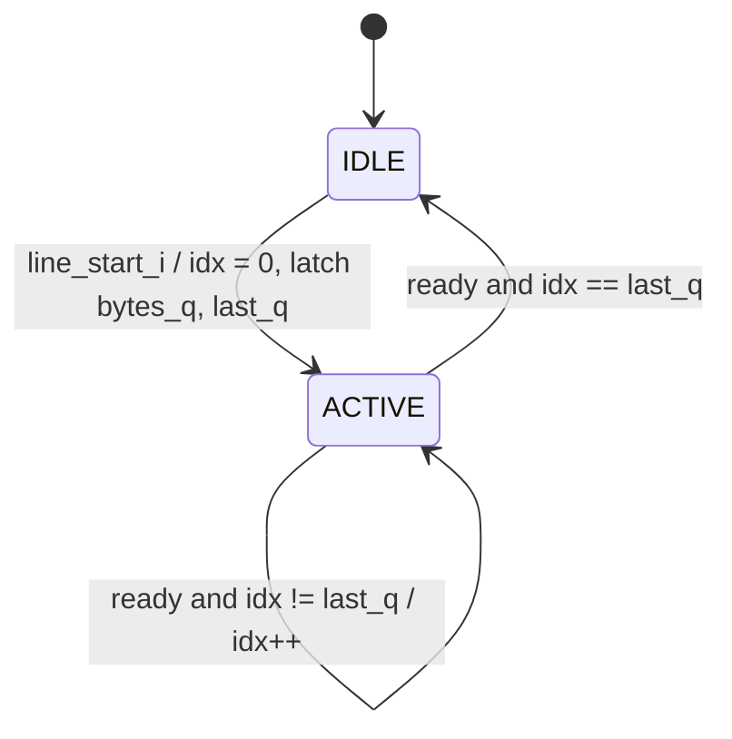

# cxp_app_line_marker

Inputs chosen from the tree: RTL `src/rtl/app/cxp_app_line_marker.sv` (+ child `cxp_app_marker_seq.sv`, packages `cxp_pkg.sv`, `cxp_util_pkg.sv`); unit TB `src/tb_unit/app/cxp_app_line_marker/`; integration TBs `src/tb_unit/top/cxp_stream_top/` and `src/tb_unit/top/cxp_device_top/`; spec JIIA CXP-001-2015 v1.1.1 (`docs/spec/CXP-001-2015.pdf`) §8.2.2.1, §9.2, §9.4, §9.4.2, §9.4.6.1, §9.4.6.3 (Table 39), §9.4.7–9.4.7.1, §9.4.7.3 (Table 41); regression `make -C src/tb_unit`; output `docs/design/modules/app/cxp_app_line_marker.md`.

Emits one CXP line marker per 1-cycle `line_start_i` pulse, as a burst of 32-bit words under valid/ready. Each word carries one byte replicated in all four lanes. This module only builds the byte vector; the shared `cxp_app_marker_seq` latches it and sends it (`docs/design/modules/app/cxp_app_marker_seq.md`).

| Field | Rect word (RTL idx) | Arb word (RTL idx) | Byte source |
|---|---|---|---|
| Stream marker | 1 (0) | 1 (0) | 4×K28.3 = 0x7C, kmask 0xF (added by `cxp_app_marker_seq`) |
| Line-marker type | 2 (1): 0x02 | 2 (1): 0x04 | `LINE_TYPE_RECT` / `LINE_TYPE_ARB` |
| Xsize (24 bit) | — | 3–5 (2–4) | `meta_i.xsize` |
| Xoffs (24 bit) | — | 6–8 (5–7) | `meta_i.xoffs` |
| DsizeL (24 bit, 32-bit words per line) | — | 9–11 (8–10) | `dsizel_words(meta_i.xsize, meta_i.pixfmt)` |

Multi-byte fields go MSB first. Every word after the marker has kmask 0. A marker is 2 words (rectangular) or 11 words (arbitrary), chosen by `meta_i.arbitrary`.

Source: `src/rtl/app/cxp_app_line_marker.sv`. There is one instance, `cxp_app_stream.cxp_app_line_marker_i`. It is wired `line_start_i = pix_line_start_i` and receives the same `cxp_meta_t` as `cxp_app_image_header` (`cxp_app_stream` `meta_i`); it reads only `arbitrary`, `xsize`, `xoffs` and `dsizeL` from it. In `cxp_interface_top` the pulse is `pk_word_valid & pk_word_sol & sel_word_ready_pix`, the accept of a line's first packed word (`cxp_interface_top.sv:328`). The metadata is `sel_meta`: the TPG's `meta_o` or the `ext_meta_*` ports, with `arbitrary` set from `cfg_arbitrary` (`cxp_interface_top.sv:479-505`). The output feeds the middle-priority input of the `cxp_app_stream` merger, and from there the DsizeP chopper, `cxp_cdc_stream_fifo` (app→tx) and `cxp_tx_stream_pkt`.

Spec clauses: Table 39 and Table 41 (layout), §9.2 (the K28.3 stream marker), §8.2.2.1 (4× duplication). The "line marker before each line" rule (§9.4.6.1/§9.4.7.1) is the pulse source's job.

## Interface

| Name | Default | Meaning |
|---|---|---|
| `RECT_WORDS` (localparam) | 2 | Table 39 length |
| `ARB_WORDS` (localparam) | 11 | Table 41 length |
| `IDX_W` (localparam) | 4 | `$clog2(11)`, the width of `last_idx`. Equals `idx_w(11)` in `cxp_app_marker_seq`, whose `p_MAX_WORDS` is `ARB_WORDS`. No module parameters. |

| Name | Dir | Width | Description |
|---|---|---|---|
| `app_clk` | in | 1 | Only clock |
| `app_rst_n` | in | 1 | Active-low. Asserts asynchronously; the caller synchronises deassertion |
| `meta_i` | in | `cxp_meta_t` (177) | Frame metadata and form. Only these fields are used, sampled in the latch cycle: `arbitrary` (0 = Table 39, 1 = Table 41), and for the arbitrary form `xsize`, `xoffs` (24 bit) and `dsizeL` (16 bit; word 9, DsizeL[23:16], is 0). The unused fields are waived in `src/rtl/cxp_ip.vlt` |
| `line_start_i` | in | 1 | Trigger (`cxp_app_marker_seq.start_i`). Sampled only while idle |
| `m_word_data_o` | out | 32 | `rep4(byte)` while active, else 0 |
| `m_word_kmask_o` | out | 4 | 0xF on the marker word, else 0 |
| `m_word_valid_o` | out | 1 | `cxp_app_marker_seq.active_q` |
| `m_word_ready_i` | in | 1 | The word is accepted when `m_word_valid_o & m_word_ready_i` |

The separate `cfg_arbitrary_i`, `line_xsize_i`, `line_xoffs_i` and `line_dsizeL_i` ports are gone; the form and the three fields travel in `meta_i`.

Notes:
- **Reset:** asserts asynchronously and clears the child's `active_q`, `word_idx_q`, `last_q` and `bytes_q`. The port comment here still says "sync-deassert reset" (`cxp_app_line_marker.sv:43`) and omits the asynchronous assert; the child's comment is correct (Minor 1).
- **Clocks:** one domain, `app_clk`, with no internal crossing. At the `cxp_interface_top` boundary `cfg_arbitrary` is an `rx_clk` input that reaches `app_clk` through a `cxp_cdc_bus` handshake when `p_ASYNC_CLOCKS` = 1. The `ext_meta_*` ports still have no stated domain and no synchroniser. Every field is sampled only in the latch cycle (Open question 3).
- **Output timing:** `m_word_valid_o` is a register. Data and kmask are an 11-way mux of the child's registers. No input, including `m_word_ready_i`, has a combinational path to an output.
- **Stall:** `m_word_ready_i = 0` holds `word_idx_q`, so every output holds. There is no timeout.
- **Comments vs code:** `line_start_i` is commented "1-cycle SOL pulse", but a held level re-triggers (How it works). The drop of a pulse during a marker is now described in `cxp_app_marker_seq` as plain behaviour; the earlier comment that claimed a spec requirement for it went with the old latch. The header cites "§9.4 arbitrary form" (`cxp_app_line_marker.sv:16`) instead of §9.4.7.3 / Table 41 (Minor 1).

## How it works

1. **Byte vector** (combinational, `cxp_app_line_marker.sv:77-91`): rectangular sets `line_bytes[1]` = 0x02 (the rest 0) and `last_idx` = 1; arbitrary fills `line_bytes[10:1]` in Table 41 order and sets `last_idx` = 10. The choice follows `meta_i.arbitrary` every cycle; only the latch-cycle value is used.
2. **Latch** (in `cxp_app_marker_seq`, `!active_q & line_start_i`): `bytes_q` ← `{line_bytes, K28_3}`, `last_q` ← `last_idx`, `word_idx_q` ← 0, `active_q` ← 1. `m_word_ready_i` is ignored in this cycle.
3. **Walk** (`active_q & m_word_ready_i`): `word_idx_q` increments. At `last_q` it clears `active_q` and `word_idx_q`.
4. **Word select**: `m_word_data_o = rep4(bytes_q[word_idx_q])`; idx 0 is K28.3 with kmask 0xF. idx 11–15 are unreachable.

The FSM is implicit, inside `cxp_app_marker_seq`: `active_q` plus the counter.

| State | Next | Condition |
|---|---|---|
| IDLE (`active_q = 0`) | ACTIVE, idx 0 | `line_start_i` |
| ACTIVE, idx k | ACTIVE, idx k+1 | `m_word_ready_i & k != last_q` |
| ACTIVE, idx `last_q` | IDLE | `m_word_ready_i` |



Same-cycle rules:
- A pulse while `active_q = 1`, including the cycle that accepts the last word, is dropped, not queued, and `bytes_q` is untouched (`cxp_app_marker_seq.sv:95-107`).
- A pulse held high re-latches in the first cycle with `active_q = 0`. With ready = 1 that gives one marker every 3 (rect) or 12 (arb) cycles.
- `meta_i` changes after the latch do not affect the marker in flight.

Latency and throughput:
- 1 cycle from the pulse to word 0: in the unit VCD the pulse is sampled at the 60 ns edge and K28.3 is accepted at 70 ns.
- A marker is 2 or 11 accepted words; with ready = 1, `active_q` is high for exactly that many cycles.
- Pulses must be at least 3 (rect) or 12 (arb) cycles apart, which leaves 1 bubble between markers.
- Nothing wraps: idx ≤ 10 in a 4-bit register.

Invariants by construction, not asserted: `m_word_valid_o == active_q`; kmask ∈ {0x0, 0xF}, with 0xF only at idx 0; data = 0 while idle; `word_idx_q ≤ last_q`; `bytes_q` constant while active; outputs stable while valid & !ready.

## Arbiter integration

- **Priority:** the `cxp_app_stream` merger is combinational: header > line marker > skid-buffered pixel (`cxp_app_stream.sv:205-226`). `m_word_ready_i = merge_ready & ~hdr_word_valid`, where `merge_ready` is "FIFO not full", with no register in between.
- **What preempts the marker:** only the header. On line 0, `pix_frame_start_i` and `pix_line_start_i` arrive together and both latch. The marker then waits at idx 0 for the 25 header words; every ext-path integration test shows exactly 25 such stall cycles per frame. With a ready-gated pulse the header cannot land mid-marker: the skid holds the line's first pixel for the whole marker, so no new word, and so no new pulse, is accepted.
- **What the marker preempts:** the skid pixel, unconditionally. With a ready-gated same-cycle pulse (`cxp_interface_top`, the TB's TPG path), the skid is empty or firing at the latch, so the only word overtaken is the line's own first pixel. The same argument makes a dropped pulse unreachable, because `pix_word_ready_o = 0` while the marker is active.
- **Pulse-ahead contract:** the `cxp_app_stream` port comment says the pulse comes "one cycle BEFORE the first pixel word". Under that contract, if the FIFO is full in the lead cycle, the skid still holds the previous line's last pixel and the marker overtakes it. Probe (not in repo): an 80-line frame with the wire stalled and then 1-in-3 put 23 of 80 line markers one word early → Medium 1.
- **Held pulse:** a source that holds `ls` until its pixel is accepted (the integration TB's `_push_one_word`) re-latches the marker in the single idle cycle after each marker. That is also the only cycle in which the skid can fire. Probe (not in repo), same stimulus: 740 line markers were emitted and the source never got past line 57 (livelock) → Medium 1.
- **Side-band:** `suppress_stream_i` (§8.7), the arbiter's `m_abort_i` and `stream_ctrl_reset_i` act in `tx_clk` after the FIFO and never reach this module. After a TestMode abandon or an arbiter drop, `cxp_tx_stream_pkt` discards FIFO words up to the next chopper SOP, which can fall mid-marker or mid-line → Open question 4.

## Verification

Tools: Verilator 5.046 with cocotb 2.0.1. No bound SVA covers this module or `cxp_app_marker_seq`; `src/sva/cxp_sva.sv` binds the stream FIFO and framer checkers, which run in the `cxp_app_stream` bench. No coverage is collected: the module registers no FSM with `fsm_coverage`, and there is no functional coverage.

### Unit TB — `src/tb_unit/app/cxp_app_line_marker/test_cxp_app_line_marker.py`

- **Wrapper and bring-up:** `tb_cxp_app_line_marker_top` keeps the old ports (`cfg_arbitrary`, `line_xsize`, `line_xoffs`, `line_pixfmt`, no `_i`/`_o` suffix) and builds a `cxp_meta_t` from them with every other field 0. It adds a `TESTCASE` byte. The internal signals in the waves below (`active_q`, `word_idx_q`) live in `cxp_app_line_marker_i.cxp_app_marker_seq_i`. The clock is 10 ns. `reset()` zeroes the inputs with `m_word_ready = 1`, holds reset for 4 edges, then releases it for 2.
- **Helpers:**
  - `kick_off`: sets `cfg_arbitrary` and the metadata, then holds `line_start = 1` for exactly one sampled edge. The metadata stays driven afterwards.
  - `collect_words(n, pattern)`: drives `m_word_ready` from a repeating pattern and records data/kmask on each edge where valid & ready (4096-cycle no-progress timeout).
- **Checkers:**
  - `check_byte_replication`: the length, then each word equals `rep4` of the expected byte.
  - `check_kmask`: word 0 has kmask 0xF; every other word has 0.
- **Golden model:** `expected_rect_words` / `expected_arb_words` encode the Table 39/41 order; DsizeL comes from `cxp_protocol.stream.dsizel`.

| Test | Stimulus | Expect |
|---|---|---|
| test_01_rect_marker_content | default LineCfg, rect, ready 1 | 2 words: 4×7C (kmask F), 4×02 |
| test_02_arb_marker_content | 3 arb markers, distinct / minimal / all-FF fields | 11 words byte-exact, each |
| test_03_byte_replication_majority_vote | default LineCfg, arb; Python flips lane 2 bit 7 | majority vote recovers each byte |
| test_04_no_emission_without_line_start | metadata driven, no pulse, 64 cycles | valid never 1 |
| test_05_line_start_during_emission_dropped | 2nd pulse at word idx 4, other metadata | marker 1 intact; no 2nd marker |
| test_06_backpressure | arb, ready 1,0,0,0 repeating | 11 words intact |
| test_07_back_to_back_markers | 3 arb markers, distinct fields | all 3 byte-exact |

#### test_01_rect_marker_content
- *Stimulus*: `cfg_arbitrary = 0`, default LineCfg (Xsize 0x012345, Xoffs 0x10, PixelF Mono8; none of them are used in rect mode). One pulse, sampled at the 60 ns edge (3rd edge after reset release). Ready = 1; 2 words captured, at 70 and 80 ns.
- *Checks*: `check_byte_replication` against `[K28.3, 0x02]`; `check_kmask`.
- *Proves*: the latch branch; the rectangular byte vector (idx 1 → `LINE_TYPE_RECT`); marker kmask at idx 0 only; the 1-cycle latency. This is the only unit test of rectangular mode. **The capture stops at word 2 and nothing checks that valid drops afterwards, so a wrong rectangular `last_idx` would pass here.** The integration golden does bound it.

```wavedrom
{"signal":[
  {"name":"app_clk","wave":"p...."},
  {"name":"line_start","wave":"010.."},
  {"name":"m_word_ready","wave":"1...."},
  {"name":"active_q","wave":"0.1.0"},
  {"name":"word_idx_q","wave":"=..==","data":["0","1","0"]},
  {"name":"m_word_kmask","wave":"=.==.","data":["0","F","0"]},
  {"name":"m_word_data","wave":"=.===","data":["0","4×7C","4×02","0"],"node":"...a."}
]}
```
`a`: the 2nd word is accepted at 80 ns and the checkers run.

#### test_02_arb_marker_content
- *Stimulus*: `cfg_arbitrary = 1`, three markers: (Xsize 0xABCDEF, Xoffs 0x010203, Mono8), (0x000001, 0x000000, Mono12) and (0xFFFFFF, 0xFFFFFF, 0xFFFF). Ready = 1. Each pulse is sampled 2 edges after the previous marker's last accept; 11 words are captured per marker.
- *Checks*: for each marker, `check_byte_replication` against `expected_arb_words`, then `check_kmask`.
- *Proves*: the arbitrary byte vector idx 1–10, including MSB-first order (all bytes distinct in marker 1); idx 8 held at 0x00 between 0xFF neighbours (marker 3); a re-latch of `bytes_q` per marker. Valid dropping after the last marker is not checked here (test_05_line_start_during_emission_dropped checks it).

#### test_03_byte_replication_majority_vote
- *Stimulus*: default LineCfg, arbitrary, ready = 1; 11 words captured.
- *Checks*: for each captured word, Python XORs 0x0080_0000 (lane 2, bit 7) and majority-votes each bit (≥ 3 of 4); the result must equal the expected byte.
- *Proves*: nothing beyond test_02_arb_marker_content. The fault is applied to the captured value, not injected into the DUT, and only one lane/bit is ever flipped. It shows a host-side property of the §8.2.2.1 duplication.

#### test_04_no_emission_without_line_start
- *Stimulus*: default LineCfg driven, `cfg_arbitrary = 0`, `line_start = 0`, ready = 1, for 64 cycles after reset.
- *Checks*: `m_word_valid == 0` in `ReadOnly` on every cycle.
- *Proves*: IDLE holds without a pulse, and there is no self-start after reset.

#### test_05_line_start_during_emission_dropped
- *Stimulus*: marker 1 is arbitrary, with Xsize 0xAAAAAA, Xoffs 0xBBBBBB, Mono10; ready = 1. A forked task drives a pulse with (0x111111, 0x222222, 0x3333). From the VCD, it is sampled on the edge that accepts idx 4 (Xsize[7:0]). The metadata returns to marker 1's values the next cycle.
- *Checks*: `check_byte_replication` against marker 1; `check_kmask`; then 8 cycles of `m_word_valid == 0` (in `ReadOnly`).
- *Proves*: the `!active_q` gate on the latch: no restart and no queued marker. `bytes_q` is not re-latched; otherwise idx 5–10 would carry 0x22/0x33. In the pulse cycle the inputs differ from `bytes_q`, so word idx 4 is shown to come from the latch and not from the inputs (one cycle, one byte). Valid drops after 11 words (arbitrary `last_idx = 10`). Every field repeats one byte value, so byte order is not checked here.

```wavedrom
{"signal":[
  {"name":"app_clk","wave":"p.|..|..|."},
  {"name":"line_start","wave":"10|10|..|.","node":"...a......"},
  {"name":"line_xsize","wave":"=.|==|..|.","data":["AAAAAA","111111","AAAAAA"]},
  {"name":"active_q","wave":"01|..|.0|.","node":".........b"},
  {"name":"word_idx_q","wave":"=.|==|==|.","data":["0","4","5","10","0"]},
  {"name":"m_word_data","wave":"==|==|==|.","data":["0","4×7C","4×AA","4×BB","4×CC","0"]}
]}
```
`a`: the second pulse is sampled at idx 4 and ignored; the accepted word is 4×AA, not 4×11. `b`: the end of the 8-cycle watch; valid is still 0.

#### test_06_backpressure
- *Stimulus*: default LineCfg, arbitrary. Ready follows 1, 0, 0, 0 from the first capture edge. Word 0 is accepted without a stall; words 1–10 each stall for 3 cycles (41 edges in total).
- *Checks*: `check_byte_replication`; `check_kmask`.
- *Proves*: the index advances only on `active_q & m_word_ready_i`, and the outputs hold during a stall. The K28.3 word is never stalled here, and rectangular mode is never stalled.

```wavedrom
{"signal":[
  {"name":"app_clk","wave":"p......|.."},
  {"name":"line_start","wave":"10.....|.."},
  {"name":"m_word_ready","wave":"1.0..10|1."},
  {"name":"active_q","wave":"01.....|.0"},
  {"name":"word_idx_q","wave":"=.=...=|==","data":["0","1","2","10","0"]},
  {"name":"m_word_data","wave":"===...=|==","data":["0","4×7C","4×04","4×01","4×67","0"],"node":".....a..b."}
]}
```
`a`: word 1 is accepted after 3 stall cycles. `b`: the last word is accepted and the checkers run.

#### test_07_back_to_back_markers
- *Stimulus*: three arbitrary markers (Xsize/Xoffs/PixelF = 0x100000/0x200000/Mono12, 0x300000/0x400000/Mono10 and 0x500000/0x600000/Mono14), ready = 1. Each pulse is sampled 2 edges after the previous marker's last accept.
- *Checks*: `check_byte_replication` and `check_kmask` for each marker.
- *Proves*: ACTIVE idx 10 → IDLE → latch, and a per-marker re-latch of `bytes_q`. **"Back-to-back" leaves 2 idle cycles, but the RTL accepts a pulse one cycle earlier. The minimum gap is never exercised, and neither is a pulse in the last-accept cycle (which is dropped).** Only the top bytes of Xsize and Xoffs differ; idx 3, 4, 6, 7 and 8 are 0x00 in every marker, so a swap among them would pass.

```wavedrom
{"signal":[
  {"name":"app_clk","wave":"p......"},
  {"name":"line_start","wave":"0..10..","node":"..ab..."},
  {"name":"line_xsize","wave":"=..=...","data":["100000","300000"]},
  {"name":"active_q","wave":"1.0.1.."},
  {"name":"word_idx_q","wave":"===..==","data":["9","10","0","1","2"]},
  {"name":"m_word_data","wave":"===.===","data":["4×12","4×34","0","4×7C","4×04","4×30"]}
]}
```
`a`: the earliest cycle the RTL would accept a pulse (unused). `b`: the test's pulse. The checks run after all three captures.

### Integration TB — `src/tb_unit/top/cxp_stream_top/test_cxp_stream_top.py`

12 tests on the real module inside the real `cxp_app_stream` (image-header generator, FIFO with `p_FIFO_DEPTH = 256`, `cxp_tx_stream_pkt`), with the bound FIFO and framer SVA active.
- **Wrapper and clocks:** `tb_cxp_stream_top` selects between a TPG → packer source (8×4 Mono8, ready-gated same-cycle pulses, TPG `meta_o`) and Python-driven `ext_*` ports packed into a `cxp_meta_t` (`pix_sel = 1`); the wrapper's `cfg_arbitrary` sets `meta_i.arbitrary`. `app_clk` is 10 ns, `tx_clk` 8 ns. DsizeP = 11 on both DsizeP inputs; `suppress_stream_i`, `stream_ctrl_reset_i` and `m_abort_i` are tied to 0; **`cfg_arbitrary = 0` in every test**.
- **Checks:** `check_packet_framing` checks every packet's envelope and CRC; the payload is then compared with `expected_frame_words()` = 25 header words + 4 × (2 marker + 2 pixel words) = 41 words/frame.
- **Slot activity (from the VCD):** no test drops a pulse or latches with a stale skid word. FIFO back-pressure reaches the marker only in test_02_full_frame_decode (21 cycles). No listed test asserts a design decision specific to this module.
- **Not listed:** test_01_packet_framing (envelope only); test_04_skid_same_cycle_pulse_first_marker and test_07_skid_holds_under_backpressure (header word 0 only; the latter never back-pressures the marker); test_12_chopper_residual_across_frame_boundary (header placement; line markers are only counted).

| Test | Checks |
|---|---|
| test_02_full_frame_decode | TPG path: first 82 payload words (8 line markers) = golden |
| test_03_kmask_passthrough | every payload kmask ∈ {0, 0xF}; ≥ 5 marker words |
| test_05_skid_same_cycle_full_frame_decode | ext path: 41 words = golden; the header preempts line 0's marker |
| test_06_skid_line_marker_lead | 5 K28.3 per frame; each line marker → 4×02 → that line's first pixel |
| test_08_skid_both_pulse_conventions_equivalent | same-cycle and pulse-ahead frames both = golden |
| test_09_skid_bursty_producer | 2 idle cycles after each pixel word; frame = golden |
| test_10_skid_back_to_back_frames | 82 words = golden × 2; 10 K28.3 |
| test_11_skid_idle_no_packets | no pulse → 0 packets |

#### test_02_full_frame_decode
- *Stimulus*: TPG free-running (`cfg_run = 1`); `line_start` is the packer's SOL accept. 8000 `tx_clk` cycles captured with `m_ready = 1`; 453 markers latched.
- *Checks*: framing and CRC of every packet (≥ 10 packets); the first 82 payload words (data + kmask) against `expected_frame_words() * 2`.
- *Proves*: Table 39 content and kmask after the FIFO and framer. Exactly 2 words sit between the previous line's last pixel and the next pixel, which bounds the rectangular `last_idx = 1`. Order holds under the gated contract. The FIFO stalled markers #389–#438 (idx 0/1, up to 5 cycles each), outside the compare window, so only the envelope/CRC checks cover them.

#### test_03_kmask_passthrough
- *Stimulus*: TPG free-running, 4000 cycles (229 markers latched).
- *Checks*: framing for every packet; every payload kmask is 0 or 0xF; count of 0xF ≥ 5; at least one kmask-0 word.
- *Proves*: the marker's kmask 0xF survives the FIFO and the framer. It is loose: losing every line marker would still pass, because the header markers alone exceed the count.

#### test_05_skid_same_cycle_full_frame_decode
- *Stimulus*: `pix_sel = 1`. One frame via `drive_ext_frame_same_cycle_pulse`: `ls = 1` on every line's first pixel, plus `fs` on line 0, each accepted on the first try. Then 3 flush words; `m_ready = 1`.
- *Checks*: framing for 4 packets; 41 payload words = golden.
- *Proves*: header > line-marker priority. Both latch on line 0's pulse, and the marker waits 25 cycles at idx 0 with `line_word_ready = 0` while K28.3 holds. The first pixel stays parked in the skid.

```wavedrom
{"signal":[
  {"name":"app_clk","wave":"p..|...."},
  {"name":"pix_frame_start, pix_line_start","wave":"10.|...."},
  {"name":"pix_word_ready","wave":"10.|..1."},
  {"name":"hdr_word_valid","wave":"01.|.0.."},
  {"name":"line_word_valid","wave":"01.|..0."},
  {"name":"line_word_ready","wave":"0..|.1.0"},
  {"name":"word_idx_q","wave":"=..|..==","data":["0","1","0"]},
  {"name":"merge_kmask","wave":"===|.==.","data":["0","F","0","F","0"]},
  {"name":"merge_data","wave":"x==|====","data":["4×7C","4×01","4×00","4×7C","4×02","03020100"],"node":".....a.."}
]}
```
`a`: the line marker's K28.3 becomes merged word 25, right after the last header word. It is compared with the golden after the FIFO and framer.

#### test_06_skid_line_marker_lead
- *Stimulus*: as the previous test.
- *Checks*: framing for 4 packets; exactly 5 K28.3 words (kmask 0xF, byte 0x7C) in the 41 words; for each of the 4 line markers, the next word is 4×02 with kmask 0, and the word after that is the line's first pixel.
- *Proves*: the marker precedes each line's first pixel when `ls` coincides with that pixel's accept. The skid fires the previous line's last pixel in the latch cycle, so the marker overtakes only its own line's first pixel. A line costs 4 cycles (2 marker + 2 pixel words) with no bubble.

```wavedrom
{"signal":[
  {"name":"app_clk","wave":"p......"},
  {"name":"pix_line_start","wave":"010..10"},
  {"name":"pix_word_ready","wave":"1.0.1.0"},
  {"name":"line_word_valid","wave":"0.1.0.1"},
  {"name":"word_idx_q","wave":"=..==..","data":["0","1","0"]},
  {"name":"merge_kmask","wave":"=.==..=","data":["0","F","0","F"]},
  {"name":"merge_data","wave":"=======","data":["03020100","07060504","4×7C","4×02","04030201","08070605","4×7C"],"node":"..a.b.."}
]}
```
`a`: line 1's marker, after line 0's last pixel 0x07060504. `b`: line 1's first pixel; the check asserts it is 2 words after `a`.

#### test_08_skid_both_pulse_conventions_equivalent
- *Stimulus*: a fresh bring-up and one same-cycle frame; then a fresh bring-up and one pulse-ahead frame. In the pulse-ahead frame, `ls` (plus `fs` on line 0) comes alone on a `valid = 0` cycle, ungated, and the word follows on the next cycle. `m_ready = 1`.
- *Checks*: each 41-word payload = golden, and the two are equal.
- *Proves*: the pulse-ahead latch gives the same order when the skid fires in the lead cycle (every latch in this run). A full FIFO in the lead cycle is not covered (Medium 1).

#### test_09_skid_bursty_producer
- *Stimulus*: a same-cycle frame with 2 idle cycles (`valid = 0`, `ls = 0`) after every pixel word.
- *Checks*: 41 payload words = golden.
- *Proves*: a latch with the skid already empty (not firing) gives the same order.

#### test_10_skid_back_to_back_frames
- *Stimulus*: two same-cycle frames with no gap, then one flush; `m_ready = 1`.
- *Checks*: 82 payload words = golden × 2; exactly 10 K28.3 markers.
- *Proves*: at the frame boundary, frame 2's line-0 marker latches together with the header and waits behind it, with no lost or duplicated marker.

#### test_11_skid_idle_no_packets
- *Stimulus*: `pix_sel = 1`, metadata driven, no pixels or pulses, 1500 `tx_clk` cycles.
- *Checks*: 0 packets.
- *Proves*: no marker without a pulse at integration level.

### Other

- **`src/tb_unit/top/cxp_interface_top` test_02_stream_from_tpg**: the full top with `cfg_arbitrary = 0`; checks only the packet type word, not the line markers.
- **`src/tb_unit/top/cxp_device_top` test_04_stream**: the whole device at 12/8/10 ns with `p_ASYNC_CLOCKS = 1`. The golden `cxp_protocol` reassembler must find a rectangular line marker before each line; the test checks 6 lines of 3 words for a 12×6 image. Arbitrary markers are not driven.
- **`src/verif/` test_arbitrary_image**: the only arbitrary-mode run through the full top. `stream_scoreboard.py` decodes Table 41 but requires every row's Xsize/Xoffs/DsizeL to equal row 0's, which asserts the frame-constant design. It sizes lines by ⌈Xsize/4⌉ and ignores DsizeL units, and its `cxp_app_line_marker.sv:82-92 (spec table 40)` citation is stale. Not run for this document.
- **`src/emu/cxp/parser/stream_parser.py`**: host-side decoder. It drops rectangular markers and skips the 11 arbitrary words without decoding them.
- **`src/emu/cxp/image/reconstruct.py`, `src/emu/cxp/sim/virtual_camera.py`**: build the Table 39 marker for the Python sim (rectangular only); they mirror the RTL and are not independent.
- **`src/emu/bridge/`**: instantiates the module in the full top, with `+arbitrary=` as a plusarg; not run.

### Running

```
make -C src/tb_unit/app/cxp_app_line_marker                                           # unit TB, Verilator
make -C src/tb_unit/app/cxp_app_line_marker COCOTB_TEST_FILTER=test_06_backpressure   # one test
make -C src/tb_unit/top/cxp_stream_top                                                # integration TB
make -C src/tb_unit/top/cxp_device_top WAVES=0                                        # three-clock device TB
make -C src/tb_unit                                                               # full regression + report
```

Results from 2026-09-19 at commit `9604050` (RTL, SVA and TB files differ from the commit only in line endings), Verilator 5.046: `cxp_app_line_marker` 7/7, `cxp_app_stream` 12/12, `cxp_interface_top` 13/13, `cxp_device_top` 7/7 pass. The unit and `cxp_app_stream` results are unchanged from before the marker moved onto `cxp_app_marker_seq`. Full regression not re-run.

### Not covered in-tree

- **Reset mid-marker:** untested. No item, because the only instance shares `app_rst_n` with the merger and the FIFO write side.
- **Pulse high at reset release:** untested; it latches on the first edge. No item, because every in-tree source is a reset-low register.
- **Pulse held as a level:** untested at unit level. It re-triggers every 3/12 cycles, and livelocks `cxp_app_stream` (probe) → Medium 1.
- **Minimum 3/12-cycle spacing, and a pulse in the last-accept cycle (dropped):** untested → Medium 2.
- **`meta_i`, including `meta_i.arbitrary`, changing during a marker:** only one cycle at idx 4 → Medium 2.
- **Rectangular length at unit level, rectangular mode under a FIFO stall, and switching rect↔arb between markers:** untested (the integration golden bounds the length) → Medium 2.
- **Arbitrary mode through `cxp_app_stream` or higher:** none in `src/tb_unit`. Rectangular markers are parsed from the wire only by `cxp_device_top` test_04_stream → Critical 1, Medium 2.
- **Line-boundary pulse with FIFO back-pressure, in either convention:** untested → Medium 1.
- **`cfg_arbitrary` toggled mid-frame:** untested; it currently mixes a rectangular header with arbitrary markers, or the reverse, because each generator latches `meta_i.arbitrary` at its own pulse → Medium 3.
- **Per-line Xsize/Xoffs/DsizeL (the purpose of Table 41):** not testable, because no in-tree source produces per-line values → Open question 2.
- **Counter wrap:** not possible (idx ≤ 10 of 15). No item.
- **Indefinite stall:** holds forever, by design. No item, because FIFO back-pressure is the only source.
- **Multi-clock:** the module is single-domain; the FIFO crossing is covered at 10/8 ns, and the whole device at 12/8/10 ns in `cxp_device_top`. The domain of the `ext_meta_*` ports at the top is open (Open question 3).
- **§8.7 abandon mid-marker:** untested → Open question 4.
- **X on metadata at the latch:** would reach the marker. No item, because the sources are reset.

## Known issues and recommendations

### Critical

None.

### Medium

1. **Line order and liveness in `cxp_app_stream` rely on a ready-gated `line_start`** (Arbiter integration). The documented pulse-ahead contract reorders words under back-pressure, and a held pulse livelocks. *Fix:* in `cxp_app_stream`, let a skid word loaded before the pulse drain ahead of `line_word_valid`, and accept at most one pulse per accepted SOL word (a `line_pending_q` flag). Alternatively, make "pulse only on the accept cycle" the contract, fix the port and header comments, and make `_push_one_word` drop `ls` after the first attempt. Add a line-boundary test with FIFO back-pressure for both conventions. *Effort:* 0.5 day, shared with the header path.
2. **Missing tests:**
   - unit: valid dropping after word 2 in rectangular mode; rectangular mode under stall; rect↔arb switching; a pulse at the minimum gap and in the last-accept cycle; a held pulse; metadata changed for the whole marker.
   - integration: arbitrary mode; a marker under FIFO back-pressure inside the compare window; one marker decoded from the `cxp_interface_top` wire (extend test_02).

   *Effort:* 1 day.
3. **`meta_i.arbitrary` is latched per line here but per frame by the header generator**, so a mid-frame change of `cfg_arbitrary` yields a mixed-form frame, which violates §9.4.6.1/§9.4.7.1. Moving both generators onto one `cxp_meta_t` did not change this: each still latches at its own pulse. *Fix:* in `cxp_app_stream`, register `meta_i.arbitrary` on the accepted `pix_frame_start_i` and feed the registered copy to the line-marker generator. *Effort:* 1 h.

### Minor

1. **Comments:**
   - Fix the `app_rst_n` port comment (line 43).
   - Cite §9.4.7.3 / Table 41 in the header (line 16).
   - Fix the stale citation in `stream_scoreboard.py`.

   Resolved: the claim that the spec requires the in-flight marker to complete went away with the old latch; the unit-TB docstring now maps its v1.0 citations to §9.4.6.3 / Table 39 and §9.4.7.3 / Table 41; the `tb_cxp_stream_top` header now describes the TPG path as same-cycle, accept-gated pulses. *Effort:* 10 min.
3. **SVA to add:** the sequencer properties in `docs/design/modules/app/cxp_app_marker_seq.md` (Minor 3), plus `last_idx ∈ {1, 10}` here and a cover on `line_start_i && m_word_valid_o` (drop). *Effort:* 1 h.
4. **Unit-TB hygiene:**
   - test_03_byte_replication_majority_vote corrupts a Python copy of one lane/bit; inject per-lane faults or rename it.
   - Rename test_07_back_to_back_markers, or make it back-to-back, and give idx 3/4/6/7 distinct non-zero bytes.
   - Give the drop test's marker 1 distinct bytes per field.

   *Effort:* 1 h.

### Open questions

2. **Designer:** is arbitrary mode meant to carry per-line Xsize/Xoffs/DsizeL ("of this line", Table 41)? If yes, which block supplies them, with what timing relative to the line's first accepted word? If no, document `cfg_arbitrary` as "arbitrary format for rectangular images", which §9.4.7 does not recommend.
3. **Designer / integrator:** `cfg_arbitrary` is now an `rx_clk` input with a synchronised crossing. Which clock domain drives `ext_meta_*` (`cxp_device_top.s_meta_i`)? If it is not `app_clk`, it needs a frame-boundary shadow register or a synchroniser.
4. **Designer:** after a §8.7 TestMode abandon or an arbiter drop, `cxp_tx_stream_pkt` resumes at the next chopper SOP, which can fall mid-marker or mid-line. Should streaming restart at the next line marker or image header?
5. **Verification:** which `cxp_app_stream` pulse contract is normative: "pulse on the accept cycle" (the product and the TPG path) or "pulse one cycle ahead" (its comments and `drive_ext_frame_pulse_ahead`)? The Medium 1 fix depends on the answer.

No repository files other than this document were changed.
