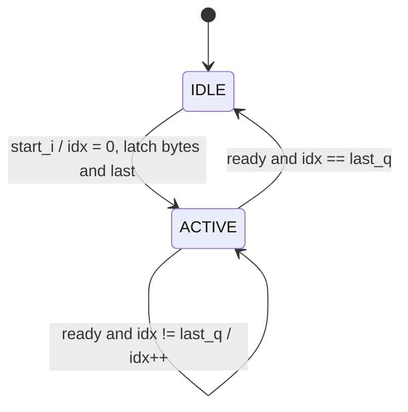

# cxp_app_marker_seq

Inputs chosen from the tree: RTL `src/rtl/app/cxp_app_marker_seq.sv` (+ `cxp_pkg.sv`, `cxp_util_pkg.sv`); callers `src/rtl/app/cxp_app_image_header.sv` and `src/rtl/app/cxp_app_line_marker.sv`; unit TBs `src/tb_unit/app/cxp_app_image_header/` and `src/tb_unit/app/cxp_app_line_marker/` (the module has no TB of its own); integration TBs `src/tb_unit/top/cxp_stream_top/`, `src/tb_unit/top/cxp_interface_top/`, `src/tb_unit/top/cxp_device_top/`; spec JIIA CXP-001-2015 v1.1.1 (`docs/spec/CXP-001-2015.pdf`) §8.2.2.1, §9.2, §9.4 (Tables 38–41); regression `make -C src/tb_unit`; output `docs/design/modules/app/cxp_app_marker_seq.md`.

Shared word sequencer for the two §9.4 stream markers. On a 1-cycle start pulse it latches a byte vector and a last word index, then sends 4×K28.3 followed by one byte per word, each byte replicated in all four lanes, as a burst of 32-bit words under valid/ready. The caller decides what the bytes are; this module decides the order, the replication and the kmask.

| Word (idx) | `m_word_data_o` | `m_word_kmask_o` | Source |
|---|---|---|---|
| 0 | 4×K28.3 = `0x7C7C7C7C` | `1111` | constant (`cxp_pkg::K28_3`) |
| 1 … `last_i` | `rep4(bytes_i[idx])` | `0000` | caller's byte vector, latched at start |
| idle | `0x00000000` | `0000` | — |

A marker is `last_i` + 1 words. The two callers use:

| Caller | Form | `last_i` | Words | Layout |
|---|---|---|---|---|
| `cxp_app_image_header` (`p_MAX_WORDS` = 25) | rectangular | 24 | 25 | Table 38 |
| | arbitrary | 15 | 16 | Table 40 |
| `cxp_app_line_marker` (`p_MAX_WORDS` = 11) | rectangular | 1 | 2 | Table 39 |
| | arbitrary | 10 | 11 | Table 41 |

Source: `src/rtl/app/cxp_app_marker_seq.sv`. Two instances per device, both named `cxp_app_marker_seq_i`: one inside `cxp_app_stream.cxp_app_image_header_i` (`start_i` = `pix_frame_start_i`) and one inside `cxp_app_stream.cxp_app_line_marker_i` (`start_i` = `pix_line_start_i`). Their outputs go to the header and line-marker inputs of the `cxp_app_stream` priority merger. It is listed in `src/rtl/cxp_ip.f` ahead of its two callers.

Spec clauses: §9.2 (K28.3 is the stream marker), §8.2.2.1 (each byte sent 4× so a receiver can vote out a single-bit error), §9.4 Tables 38–41 (word order; supplied by the callers).

## Interface

| Name | Default | Meaning |
|---|---|---|
| `p_MAX_WORDS` | 25 | Longest marker, K28.3 word included. Sizes `bytes_i` (words 1 … `p_MAX_WORDS` − 1) and the word index (`idx_w(p_MAX_WORDS)` bits: 5 at 25, 4 at 11). There is no elaboration check; below 2 the `bytes_i` range is reversed (Minor 1). |
| `IDX_W` (localparam) | `idx_w(p_MAX_WORDS)` | Width of `last_i`, `last_q` and `word_idx_q`. |

| Name | Dir | Width | Description |
|---|---|---|---|
| `app_clk` | in | 1 | Only clock |
| `app_rst_n` | in | 1 | Active-low. Asserts asynchronously; the caller synchronises deassertion |
| `start_i` | in | 1 | Start pulse. Sampled only while idle (`active_q` = 0) |
| `last_i` | in | `IDX_W` | Index of the last word of this marker. Latched with the pulse |
| `bytes_i` | in | (`p_MAX_WORDS` − 1) × 8 | `bytes_i[w]` is the byte for word w (1 … `p_MAX_WORDS` − 1). Latched with the pulse |
| `m_word_data_o` | out | 32 | `rep4(bytes_q[word_idx_q])` while active, else 0 |
| `m_word_kmask_o` | out | 4 | `KMASK_ALL` on word 0, else `KMASK_NONE` |
| `m_word_valid_o` | out | 1 | `active_q` |
| `m_word_ready_i` | in | 1 | The word is accepted when `m_word_valid_o & m_word_ready_i` |

Notes:
- **Reset:** clears `bytes_q`, `last_q`, `word_idx_q` and `active_q` asynchronously. The port comment says "async active-low reset", which matches the code.
- **Clocks:** one domain, `app_clk`, no crossing. `bytes_i` and `last_i` are combinational functions of the caller's `meta_i` and are sampled only in the latch cycle.
- **Output timing:** `m_word_valid_o` is a register. Data and kmask are a `p_MAX_WORDS`-way mux of registers (`word_idx_q`, `bytes_q`). No path runs from `m_word_ready_i` or any input to an output.
- **Stall:** `m_word_ready_i` = 0 holds `word_idx_q`, so every output holds. There is no timeout.
- **Storage:** `bytes_q` is `p_MAX_WORDS` × 8 flops. Slot 0 is always loaded with K28.3, so synthesis can reduce it to a constant. The image-header instance stores 24 data bytes (192 flops) where the old per-module latch held the 177-bit metadata struct; the line-marker instance stores 10 bytes (80 flops) against 65 bits before. The difference is the zero DsizeL[23:16] byte and the type byte, which are now stored instead of decoded.

## How it works

1. **Latch** (`!active_q & start_i`): `bytes_q` ← `{bytes_i, K28_3}`, `last_q` ← `last_i`, `word_idx_q` ← 0, `active_q` ← 1. `m_word_ready_i` is ignored in this cycle.
2. **Walk** (`active_q & m_word_ready_i`): `word_idx_q` increments. At `last_q` it clears `active_q` and `word_idx_q`.
3. **Word select**: `rep_byte = bytes_q[word_idx_q]`; `m_word_data_o = rep4(rep_byte)`; kmask is `1111` only at idx 0.

The FSM is implicit: `active_q` plus the counter.

| State | Next | Condition |
|---|---|---|
| IDLE (`active_q` = 0) | ACTIVE, idx 0 | `start_i` (latch `bytes_q`, `last_q`) |
| ACTIVE, idx k | ACTIVE, idx k+1 | `m_word_ready_i & k != last_q` |
| ACTIVE, idx `last_q` | IDLE | `m_word_ready_i` |



Same-cycle rules:
- A pulse while `active_q` = 1, including the cycle that accepts the last word, is dropped, not queued, and `bytes_q`/`last_q` are untouched (`cxp_app_marker_seq.sv:95-107`).
- A pulse held high re-latches in the first cycle with `active_q` = 0, giving one marker every `last_i` + 2 cycles at ready = 1. In `cxp_app_stream` a held pulse livelocks the pixel source (`docs/design/modules/app/cxp_app_image_header.md` and `docs/design/modules/app/cxp_app_line_marker.md`, Medium 1).
- `bytes_i` or `last_i` changing after the latch cycle does not affect the marker in flight. The caller may prepare the next marker while this one drains.

Latency and throughput:
- 1 cycle from the pulse to word 0 (pulse sampled on edge N, K28.3 valid after N, accepted at N+1 at ready = 1).
- A marker holds `active_q` for exactly `last_i` + 1 cycles at ready = 1; the minimum pulse spacing is `last_i` + 2 cycles, which leaves one idle cycle between markers.
- Nothing wraps: `word_idx_q` ≤ `last_q` ≤ `p_MAX_WORDS` − 1 for the two callers.

```wavedrom
{"signal":[
  {"name":"app_clk","wave":"p......"},
  {"name":"start_i","wave":"010...."},
  {"name":"m_word_ready_i","wave":"1......"},
  {"name":"active_q","wave":"0.1..0."},
  {"name":"word_idx_q","wave":"=..===.","data":["0","1","2","0"]},
  {"name":"m_word_kmask_o","wave":"=.==...","data":["0","F","0"]},
  {"name":"m_word_data_o","wave":"=.====.","data":["0","4×7C","4×b1","4×b2","0"]}
]}
```
Drawn for `last_i` = 2. The rectangular line marker is the same with `last_i` = 1.

Invariants by construction, not asserted: `m_word_valid_o == active_q`; kmask ∈ {0, 0xF}, with 0xF only at idx 0; data = 0 while idle; `word_idx_q ≤ last_q`; `bytes_q` and `last_q` constant while active; outputs stable while valid & !ready.

## Users

- **`cxp_app_image_header`** builds `hdr_bytes[24:1]` (rectangular, Table 38) or `hdr_bytes[15:1]` (arbitrary, Table 40) from `meta_i` in one `always_comb` and sets `last_idx` to 24 or 15 from `meta_i.arbitrary` (`cxp_app_image_header.sv:103-133`). Unused upper bytes of the arbitrary form are 0 and never sent.
- **`cxp_app_line_marker`** builds `line_bytes[1]` = 0x02 (rectangular) or `line_bytes[10:1]` (arbitrary, Table 41) and sets `last_idx` to 1 or 10 (`cxp_app_line_marker.sv:77-91`).
- Both callers used to carry their own copy of the latch, counter and byte `case`. The wire output is unchanged: both unit benches, the `cxp_app_stream` bench and the cycle-exact PyUVM wire logs match the earlier implementation.

## Arbiter integration

No arbiter slot. Both instances feed the `cxp_app_stream` merger (header > line marker > skid pixel, `cxp_app_stream.sv:205-226`), whose ready is "stream FIFO not full". Ordering against pixels, the pulse contract and the chopper are described in `docs/design/modules/app/cxp_app_stream.md`, `docs/design/modules/app/cxp_app_image_header.md` and `docs/design/modules/app/cxp_app_line_marker.md`.

## Verification

Verilator 5.046 with cocotb 2.0.1. No bound SVA covers this module (`src/sva/cxp_sva.sv` has none for it). No FSM coverage.

The module has no unit TB of its own. Every test below reaches it through a caller.

### Through `src/tb_unit/app/cxp_app_image_header/` (8 tests)

The wrapper packs its old per-field ports into `cxp_meta_t`, so the tests are unchanged. What they prove about the sequencer:

| Test | Sequencer property |
|---|---|
| test_01_rect_header_content | latch, `last_i` = 24 walk, byte order 1–24, kmask at idx 0 only, 1-cycle latency |
| test_02_arb_header_content | the `last_i` = 15 form (capture stops at 16 words; the drop of valid after word 16 is not checked) |
| test_04_streamid_passthrough | re-latch across 6 markers |
| test_05_header_gating_no_meta_valid | no start without a pulse, no self-start after reset |
| test_06_meta_valid_pulse_during_active_dropped | pulse during ACTIVE dropped, valid low for 8 cycles after the last word |
| test_07_backpressure | index advances only on ready; outputs hold under stall |
| test_08_back_to_back_headers | ACTIVE → IDLE → latch, per-marker re-latch (2 idle cycles, not the 1-cycle minimum) |

### Through `src/tb_unit/app/cxp_app_line_marker/` (7 tests)

The wrapper builds `cxp_meta_t` with only the form, Xsize, Xoffs and DsizeL set.

| Test | Sequencer property |
|---|---|
| test_01_rect_marker_content | `last_i` = 1 walk (valid dropping after word 2 is not checked here) |
| test_02_arb_marker_content | `last_i` = 10 walk with 3 byte sets, including 0x00 between 0xFF neighbours |
| test_05_line_start_during_emission_dropped | pulse at idx 4 dropped; the word at idx 4 comes from `bytes_q`, not from `bytes_i`; valid drops after 11 words |
| test_06_backpressure | stall at every data word of an 11-word marker |
| test_07_back_to_back_markers | re-latch per marker |

### Integration

- **`src/tb_unit/top/cxp_stream_top/`** (12 tests): both instances inside the real merger, FIFO and framer. The golden payload fixes the rectangular lengths (25 and 2) and the order header → line marker → pixels. `cfg_arbitrary` = 0 in every test, so the arbitrary `last_i` values are never used here.
- **`src/tb_unit/top/cxp_interface_top/` test_02_stream_from_tpg**: the full top; checks only the stream packet type word.
- **`src/tb_unit/top/cxp_device_top/` test_04_stream**: the TPG image decoded from the wire by the golden `cxp_protocol` reassembler at 12/8/10 ns clocks. It requires image headers and line markers to parse (Xsize, Ysize, 6 lines of 3 words), which exercises both instances end to end in rectangular form.

### Running

```
make -C src/tb_unit/app/cxp_app_image_header WAVES=0     # 25/16-word instance
make -C src/tb_unit/app/cxp_app_line_marker WAVES=0      # 2/11-word instance
make -C src/tb_unit/top/cxp_stream_top WAVES=0           # both instances in the pipeline
make -C src/tb_unit                                  # regression
```

Results from 2026-09-19 at commit `9604050` (RTL, SVA and TB files differ from the commit only in line endings), Verilator 5.046: `cxp_app_image_header` 8/8, `cxp_app_line_marker` 7/7, `cxp_app_stream` 12/12, `cxp_interface_top` 13/13, `cxp_device_top` 7/7 pass.

### Not covered in-tree

- A standalone TB with arbitrary `last_i`, including 0 (a 1-word marker) and `p_MAX_WORDS` − 1 → Minor 2.
- `last_i` ≥ `p_MAX_WORDS`: indexes `bytes_q` out of range; unreachable from the two callers, which pass constants → Minor 1.
- Minimum pulse spacing (`last_i` + 2) and a pulse in the last-accept cycle (dropped): not exercised by either caller's bench.
- Reset mid-marker; pulse high at reset release: untested. The only instances share `app_rst_n` with the merger.
- Arbitrary form through `cxp_app_stream` or higher: none in `src/tb_unit`.

## Known issues and recommendations

### Critical

None.

### Medium

None of its own. The pulse-contract hazards (a held pulse re-triggers; a pulse-ahead source reorders under back-pressure) come from how `cxp_app_stream` drives `start_i`; they are tracked as Medium 1 in `docs/design/modules/app/cxp_app_stream.md`.

### Minor

1. **No parameter or index guard.** Add `if (p_MAX_WORDS < 2) $error(...)` as a generate-if block like the other modules, and a bound assertion `start_i && !active_q |-> last_i < p_MAX_WORDS`. *Effort:* 15 min.
2. **No direct test.** The two callers only use four fixed `last_i` values. A small unit TB, or bound SVA, would check the contract once for all users. *Effort:* 1 h.
3. **SVA to add** (in `src/sva/cxp_sva.sv`): `m_word_valid_o == active_q`; `m_word_kmask_o != 0 |-> word_idx_q == 0`; `m_word_valid_o && !m_word_ready_i |=> $stable({m_word_data_o, m_word_kmask_o})`; `word_idx_q <= last_q`; a cover on `start_i && active_q` (dropped pulse). *Effort:* 1 h.

### Open questions

1. **Designer:** should a start pulse that arrives while a marker is in flight be counted or flagged instead of dropped silently? In the product it is unreachable while the pulses are accept-gated (`docs/design/modules/app/cxp_app_stream.md`, Open question 4).
