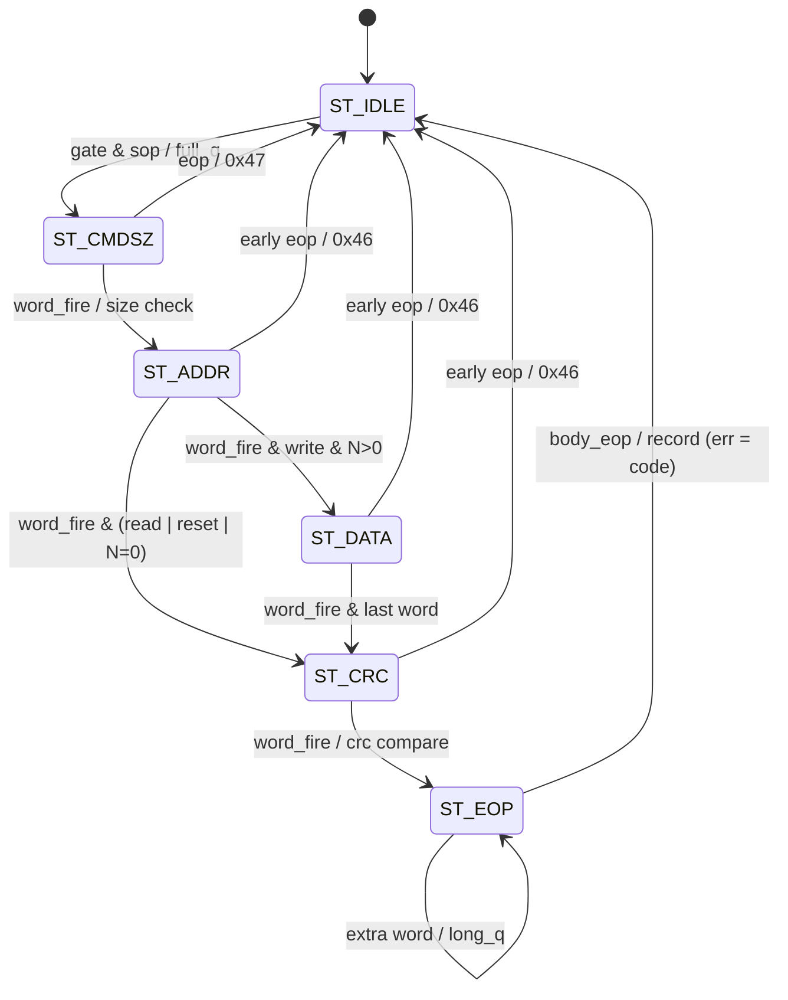

# cxp_ctrl_cmd_parser

Inputs chosen from the tree: RTL `src/rtl/ctrl/cxp_ctrl_cmd_parser.sv` (+ `cxp_pkg.sv`, `cxp_util_pkg.sv`, `cxp_lib_crc32.sv`, `cxp_regmap_pkg.sv` for the ConnectionReset / MasterHostConnectionID addresses); unit TB `src/tb_unit/ctrl/cxp_ctrl_cmd_parser/`; parent `src/rtl/ctrl/cxp_ctrl_plane.sv`; consumer `src/rtl/ctrl/cxp_ctrl_bus_master.sv`; integration TBs `src/tb_unit/ctrl/cxp_ctrl_plane/`, `src/tb_unit/rx/cxp_rx_link/` (its wrapper instantiates `cxp_ctrl_plane`) and `src/tb_unit/top/cxp_device_top/`; spec JIIA CXP-001-2015 v1.1.1 (`docs/spec/CXP-001-2015.pdf`) §5.1, §8.2.2.1, §8.2.2.2, §8.4 (Table 18), §8.6.1.1, §8.6.1.2, §8.6.2 (Table 21), §8.6.3 (Table 22), §8.6.4, §10.3.28, §10.3.30; regression `make -C src/tb_unit`; output `docs/design/modules/ctrl/cxp_ctrl_cmd_parser.md`.

Parses the body of a type-0x02 control-command packet delivered word-by-word by `cxp_rx_packet_parser`, buffers the write data in one of two banks, validates the packet at its trailer, and emits one command record per packet (`cmd_valid_o`, `cmd_o`) for the executor `cxp_ctrl_bus_master`. `cmd_o.err` is 0 for a command to execute, otherwise the Table 22 code the executor answers it with, without any access (§8.6.1.1: an invalid command is answered at once and not executed).

| Word | Content as parsed (Table 21) |
|---|---|
| TYPE | 4×0x02, `long_sop_i` |
| 0 | Cmd in P0; Size[23:16] in P1, [15:8] in P2, [7:0] in P3 |
| 1 | Addr, big-endian (Addr[31:24] in P0), byte-swapped into `addr_q` |
| 2..N+1 | N data words, big-endian, byte-swapped into `wbuf` (writes only) |
| N+2 | CRC, compared with `crc_wire(crc_final)` (the register, `[7:0]` in P0) |
| trailer | 4×K29.7, `long_eop_i` |

N+6 words from K27.7 to K29.7, as Table 21 defines; N = ceil(Size/4).

Source: `src/rtl/ctrl/cxp_ctrl_cmd_parser.sv`. One instance, `cxp_ctrl_plane.cxp_ctrl_cmd_parser_i` on `rx_clk`. Its `long_*` inputs are the fields of `cxp_ctrl_plane.long_i`, i.e. `cxp_rx_link.long_o`, which carries the long-packet stream of `cxp_rx_packet_parser` (inside `cxp_rx_link` the same stream also feeds `cxp_rx_linktest`); it gates internally on `long_type_i == 0x02`. `from_extension_link_i` is the plane's strap of the same name (`cxp_interface_top.from_extension_link`). Everything it produces goes to `cxp_ctrl_bus_master`: the record (`cmd_*`), and the write-buffer read port (`wbuf_*`); `cmd_full_i` comes back from the executor. The codes it decides reach the side band only through the executor's `nack_pulse_o` / `nack_code_o` (`sb_ctrl_nack_*` on `cxp_interface_top`).

Spec clauses: Table 21 (payload, Size rules, reserved opcodes), §8.2.1 (big-endian address and data), §8.2.2.2 (CRC), §8.6.1.1 (invalid command → immediate ack), §8.6.1.2 (control channel reset), §8.6.4 and §10.3.31 (packet size limit = ControlPacketSizeMax), §5.1 (an extension link may only read), §10.3.28 / §10.3.30 notes (ConnectionReset and MasterHostConnectionID ignore a write on an extension link), Table 22 (codes 0x01, 0x42, 0x43, 0x45, 0x46, 0x47, 0x80).

## Interface

| Name | Default | Meaning |
|---|---|---|
| `p_BUF_DEPTH` | 64 | Words per write-buffer bank; the buffer holds two banks (`wbuf[2 * p_BUF_DEPTH]`). Must hold the largest N the size limit allows (elaboration `$error` otherwise). Unit TB, `cxp_ctrl_plane` bench and the `cxp_rx_link` wrapper use 16; `cxp_ctrl_plane` passes its `p_BUF_DEPTH` (`p_CTRL_BUF_DEPTH` = 64 in `cxp_interface_top` / `cxp_device_top`). The bank index is the bit above `idx_w(p_BUF_DEPTH)` word bits, so the depth must be a power of two ≥ 2 (elaboration `$error`) |
| `p_PKT_SIZE_MAX` | `cxp_regmap_pkg::CONTROL_PACKET_SIZE_MAX_VALUE` (0x118 = 280) | Packet size limit in bytes, K27.7 to K29.7 (§8.6.4). The largest N is `MAX_N = p_PKT_SIZE_MAX/4 − 6` (Table 21: N + 6 words); the default 280 bytes is the 6 framing words plus the 64-word buffer, so the register the host reads and the limit enforced come from one YAML value. Must be a multiple of 4 above 24 (elaboration `$error`). `cxp_ctrl_plane` forwards its own `p_PKT_SIZE_MAX` (same default); the unit TB, the `cxp_ctrl_plane` bench and the `cxp_rx_link` wrapper pass `(BUF_DEPTH + 6) * 4` = 88 |

| Name | Dir | Width | Description |
|---|---|---|---|
| `rx_clk` | in | 1 | Only clock |
| `rx_rst_n` | in | 1 | Active-low. Asynchronous assert; comment says "sync reset" |
| `long_data_i` | in | 32 | Body word, `{P3,P2,P1,P0}` (lane 0 = P0) |
| `long_kmask_i` | in | 4 | Unused (UNUSEDSIGNAL waived in `cxp_ip.vlt`) |
| `long_valid_i` | in | 1 | Body word valid |
| `long_sop_i` | in | 1 | Set on the TYPE word |
| `long_eop_i` | in | 1 | Set on the K29.7 word |
| `long_err_i` | in | 1 | With `long_eop_i`: the parser aborted the packet. Without it: that body word had an 8B/10B error |
| `long_type_i` | in | 8 | TYPE byte latched by the parser; only 0x02 opens the gate |
| `from_extension_link_i` | in | 1 | Strap: 1 = the link is an extension link; writes are answered here (0x43, or 0x01 for the two ignored registers) |
| `cmd_valid_o` | out | 1 | Registered, 1 cycle, one cycle after the trailer or the abort word: one record per packet, except while the executor was full at the packet's start (below) |
| `cmd_o` | out | `cxp_ctrl_cmd_t` | `op`, `size` (B), `addr`, `nwords` (N = ceil(Size/4), 0 for a reset, saturated at 0xFFFF), `err` (0 = execute, else the Table 22 code), `wbank` (bank holding a write's data). Holds between records |
| `cmd_full_i` | in | 1 | The executor has no room for another command (`cxp_ctrl_bus_master.cmd_full_o`). Sampled on the SOP word only |
| `wbuf_addr_i` | in | `$clog2(p_BUF_DEPTH)` + 1 | Buffer read address `{bank, word}` |
| `wbuf_data_o` | out | 32 | Buffer read data, registered, 1-cycle latency |

Notes:

- Reset: asynchronous assert; the FSM, the latched fields, `wbank_q`, `cmd_valid_o` and `cmd_o` go to 0. `wbuf` has no reset (a word is read only after it was written), so it can infer RAM.
- Single clock, no CDC.
- No back-pressure: every `long_valid_i` word is consumed in the cycle it appears. `cmd_full_i` does not stall the packet; it only decides whether its data are stored and its record is emitted.
- The record is the only output; there are no separate error pulses. `cmd_valid_o` with `err` = 0 means "execute", with `err` ≠ 0 "answer this code".

## How it works

1. **Gate.** `gate = long_valid_i & (long_type_i == 0x02)`; `word_fire = gate & ~long_eop_i`; `body_eop = gate & long_eop_i & ~long_err_i`; `pkt_abort = gate & long_eop_i & long_err_i` outside ST_IDLE; `pkt_end = body_eop` outside ST_IDLE. The header words are single-copy (Table 21), so there is no vote; a bit error in them is caught by the CRC. On the SOP word the fields are cleared and `full_q <= cmd_full_i`.
2. **FSM** (`state_q`, 6 states):

| State | Next | Condition |
|---|---|---|
| ST_IDLE | ST_CMDSZ | `gate & long_sop_i` (fields and CRC reseeded, `full_q` sampled) |
| ST_CMDSZ | ST_ADDR | `word_fire`; `op_q <= P0`, `size_q <= {P1,P2,P3}`, `n_words_q <=` N = (Size+3)>>2 computed in 26 bits and saturated at 0xFFFF (0 for 0xFF); flags `op_bad_q` (opcode not 0x00/0x01/0xFF), `size_zero_q` (read/write with Size 0), `oversize_q` (read/write with the unwrapped N > `MAX_N`) |
| ST_ADDR | ST_DATA | `word_fire & op_q == 0x01 & n_words_q != 0`; `addr_q <= bswap32(word)` |
| ST_ADDR | ST_CRC | `word_fire` otherwise (reads, reset, zero-length writes) |
| ST_DATA | ST_CRC | `word_fire & data_idx_q == n_words_q-1`; the word goes to `wbuf[{wbank_q, data_idx_q}]` only while `!full_q` and `data_idx_q < MAX_N` |
| ST_CRC | ST_EOP | `word_fire`; `crc_pass_q <= (long_data_i == crc_wire(crc_final))` and no word of the packet marked `long_err_i` |
| ST_EOP | ST_EOP | `word_fire`: a word after the CRC word sets `long_q` (packet longer than its Size) |
| ST_EOP | ST_IDLE | `body_eop`; the record is registered here with the code of step 4 |
| any other state | ST_IDLE | `gate & long_eop_i` (early trailer); the record is registered with its code |
| any | ST_IDLE | `pkt_abort` (the parser aborted the packet: lost trailer, link loss); record with `err` = 0x47 |



3. **CRC.** `cxp_lib_crc32_i` (`cxp_lib_crc32`, `p_IN_W = 32`) is reseeded on the SOP word and folds `long_data_i` (lane P0 first, bits LSB-first) for words 0..N+1. The received CRC word is compared with `crc_wire(crc_o)` (the register itself, §8.2.2.2 — no final XOR, `[7:0]` in P0). `crc_wire()` is the single wire-order function of the IP: this checker and `cxp_tx_pkt_framer` (inside `cxp_tx_ctrl_ack`, `cxp_tx_stream_pkt`) both use it.
4. **Code at the trailer** (`rej_code`, then `code`; first match wins):

| Condition | `cmd_o.err` |
|---|---|
| packet aborted by the parser (`long_eop_i & long_err_i`) | 0x47 |
| trailer before the command word (ST_CMDSZ) | 0x47 |
| opcode other than 0x00 / 0x01 / 0xFF | 0x42 |
| trailer early (not in ST_EOP) or late (`long_q`) for the declared Size | 0x46 |
| CRC mismatch, or a word marked with an 8B/10B error | 0x80 |
| read / write with Size 0 (Table 21: B ≥ 1) | 0x46 |
| N > `MAX_N` (packet over ControlPacketSizeMax), N not wrapped | 0x45 |
| write on an extension link to ConnectionReset (0x4000) or MasterHostConnectionID (0x4008), by start address | 0x01 (not executed) |
| any other write on an extension link | 0x43 |
| none of the above | 0x00: execute |

   An undefined opcode has no known length, so its packet is not length- or CRC-checked (it is walked like a read; any extra words land in ST_EOP). A control channel reset (0xFF) takes no data whatever its Size says, and its Size and Addr are not checked, so a reset always gets through (§8.6.1.2 makes it the host's way out of any state). An oversize packet's data words are still folded into the CRC and counted; only the first `MAX_N` are stored. Size 0xFFFFFD … 0xFFFFFF gives N = 0x400000 in 26 bits, so it is oversize (0x45), not wrapped to N = 0. `long_sop_i` is ignored outside ST_IDLE; a new packet inside an old one is ended by the parser's abort.
5. **Record and banks.** At `pkt_abort` or `pkt_end` the record is loaded with `op_q`, `size_q`, `addr_q`, `n_words_q`, the code and `wbank_q`. `cmd_valid_o <= ~full_q | (pkt_end & code == 0 & op_q == 0xFF)`: a packet that started while the executor was full leaves no record and stored no data, unless it is a valid 0xFF, which the executor always takes. A write that is executed (`pkt_end`, not full, code 0) flips `wbank_q`, so the next write lands in the other bank while this one may still be executing; a refused write does not flip it, and its data are overwritten by the next one.
6. **Latency and throughput.** One word per cycle. With the SOP word at cycle 0, the K29.7 word is at cycle N+4 and `cmd_valid_o` is high during cycle N+5. The next packet's SOP can arrive at cycle N+6 at the earliest (the parser spends the K27.7 word in a state with `long_valid_o = 0`), when the executor's `cmd_full_o` already reflects this record, so no SOP is missed for back-to-back packets. `wbuf_data_o` follows `wbuf_addr_i` after 1 cycle.

Invariants not asserted here: in ST_DATA `data_idx_q < n_words_q`; at most one `cmd_valid_o` per SOP.

## Arbiter integration

Not applicable: receive-side block with no ready/grant. Downstream it feeds the executor's one-deep command slot; `cmd_full_i` is the only flow control and acts per packet, at its SOP.

## Verification

Verilator 5.046, cocotb 2.0.1, `cxp_test` wrapper; no SVA on this module (the opt-in `src/verif/common/cxp_reglog.sv` binds a print-only monitor, see Other). FSM coverage is collected: the unit TB registers `rx_ctrl_cmd` (6 states, 11 arcs: the 6 accept-path arcs plus the five arcs back to ST_IDLE from ST_CMDSZ, ST_ADDR, ST_DATA, ST_CRC and ST_EOP) with `fsm_coverage.register_fsm`.

### Unit TB — `src/tb_unit/ctrl/cxp_ctrl_cmd_parser/`

Wrapper `tb_cxp_ctrl_cmd_parser_top.sv` with `BUF_DEPTH = 16` (not the RTL default 64) and `PKT_SIZE_MAX = (16 + 6) * 4 = 88` bytes, so `MAX_N` = 16; ports without `_i/_o`. The wrapper decodes the record into the outputs the older tests read: `cmd_valid` = record with `err` 0, `cmd_crc_err_pulse` = `err` 0x80, `cmd_logical_err_pulse` = `err` 0x4x with `cmd_logical_err_code` holding the last one; `cmd_any`, `cmd_err`, `cmd_wbank` show the raw record. `wbuf_addr` reads the bank of the last executed write unless `wbuf_raw` selects `wbuf_bank`; `from_extension_link` and `cmd_full` are driven by Python. Clock 10 ns; reset: all inputs 0, `rx_rst_n` low 4 cycles, release, 1 cycle. `make_packet` builds the command with the golden `cxp_protocol` codec in its specification profile (`SPEC`, Table 21 and the §8.2.2.2 CRC); write data are register values, sent big-endian. `drive_packet` presents one word per cycle with `long_type = 0x02`, SOP on the TYPE word, EOP + kmask 0xF on the trailer. `monitor_cmd` samples `cmd_valid` (first only), both decoded pulses and the logical code after every edge; `run` drives one packet with a monitor window of `len(pkt)+8` cycles, and `rejected(mon, code)` requires exactly that logical code, no CRC pulse and no command. `run_raw` (tests 18–20) returns every raw record as (op, err, wbank).

| Test | Stimulus | Expect |
|---|---|---|
| test_01_read | read, addr 0x12345678, Size 4 | `cmd_valid`; op 0, addr, size 4, wc 1 |
| test_02_write | write, addr 0x100, Size 16, 4 data words | `cmd_valid`; op 1, wc 4; `wbuf[i]` = register value |
| test_03_reset_op | op 0xFF, Size 0 | `cmd_valid`; op 0xFF |
| test_04_crc_error | read with CRC ^ 1 | `err` 0x80, no `cmd_valid` |
| test_05_oversize | write of N = 16 (the limit); write of N = 17 | first fires with wc 16; second 0x45 only |
| test_06_burst_read | read, addr 0x80, Size 16 | `cmd_valid`; wc 4, op 0 |
| test_07_read_b3 | read, addr 0x2004, B = 3 | `cmd_valid`; size 3, wc 1, no error |
| test_08_write_b8 | write, addr 0x4014, B = 8, 2 values | `cmd_valid`; size 8, wc 2; `wbuf` = both values |
| test_09_spec_worked_example | the literal §8.2.2.2 packet (read of address 0, CRC 56 86 5D 6F) | `cmd_valid`; op 0, addr 0, size 4, no CRC error |
| test_10_aborted_packet | TYPE, Cmd/Size, Addr, abort word; then a read | 0x47, no `cmd_valid`; the read fires |
| test_11_decode_error_word | a read with `long_err` on the Addr word, good CRC | 0x80, no `cmd_valid` |
| test_12_undefined_opcode | Cmd 0x02 and 0x80 (read form); Cmd 0x7F with 3 extra words; then a read | 0x42 each, no command; the read fires |
| test_13_size_zero | read and write with Size 0 | 0x46 each |
| test_14_length_mismatch | write Size 8 missing a data word; read with an extra word; read without its CRC word; read cut off after its Cmd/Size word (trailer in ST_ADDR); then a write | 0x46 each; the write fires |
| test_15_empty_packet | TYPE word then the trailer | 0x47 |
| test_16_reset_with_fields | 0xFF with Size 4, Addr 0x1234 | `cmd_valid`, op 0xFF, wc 0 |
| test_17_size_field_wrap | reads with Size 0xFFFFFD, 0xFFFFFE, 0xFFFFFF | 0x45 each, no command, no 0x80 |
| test_18_extension_link | extension link: write 0x10000, write 0x4000, write 0x4008, read 0x10000; then master link: write 0x10000 | records (0x01, 0x43), (0x01, 0x01), (0x01, 0x01), (0x00, 0x00), (0x01, 0x00) |
| test_19_executor_full | write A (not full); then with `cmd_full` = 1: write B, a read, a 0xFF | A in bank 0; only the 0xFF leaves a record; bank 0 still A, bank 1 not B |
| test_20_write_banks | write A, write B, then a 1-word write C | A bank 0, B bank 1, C bank 0; bank 1 = B; bank 0 = C's word 0 then A's words 1–2 |

#### test_01_read

- *Stimulus*: 5 words back-to-back: TYPE(sop), Cmd/Size `00 00 00 04`, Addr `12 34 56 78`, CRC, K29.7(eop). Monitor window 15 cycles.
- *Checks*: `cmd_valid` seen; `cmd_op = 0x00`; `cmd_addr = 0x12345678`; `cmd_size = 4`; `cmd_word_count = 1`.
- *Proves*: ST_IDLE → ST_CMDSZ → ST_ADDR → ST_CRC → ST_EOP → ST_IDLE with the record, the Table 21 field positions, N = ceil(4/4), the §8.2.2.2 CRC.

```wavedrom
{ "signal": [
  { "name": "rx_clk",       "wave": "p......" },
  { "name": "long_valid_i", "wave": "1....0." },
  { "name": "long_sop_i",   "wave": "10....." },
  { "name": "long_eop_i",   "wave": "0...10." },
  { "name": "long_data_i",  "wave": "22222x.", "data": ["TYPE","CMD/SZ","ADDR","CRC","EOP"] },
  { "name": "state_q",      "wave": "222222.", "data": ["IDLE","CMDSZ","ADDR","CRC","EOP","IDLE"] },
  { "name": "crc_pass_q",   "wave": "0...1.." },
  { "name": "cmd_valid_o",  "wave": "0....10", "node": ".....A." },
  { "name": "cmd_o.err",    "wave": "x....2.", "data": ["0x00"] }
], "head": { "text": "A: registered record one cycle after the trailer; the monitor samples it at the next edge" } }
```

#### test_02_write

- *Stimulus*: 8 words: TYPE, Cmd/Size (op 0x01, Size 16), Addr 0x100, data 0x11223344, 0x55667788, 0x99AABBCC, 0xDDEEFF00, CRC, trailer. Then `wbuf_addr` = 0..3 (the wrapper adds the bank of this write), each read one cycle later in ReadOnly.
- *Checks*: `cmd_valid`; op 0x01; addr 0x100; wc 4; `wbuf[i] == byteswap32(data[i])`.
- *Proves*: ST_ADDR → ST_DATA → ST_CRC arc, the big-endian byte swap into `wbuf`, 1-cycle read port. `cmd_size` not checked.

#### test_03_reset_op

- *Stimulus*: 5 words with op 0xFF, addr 0, Size 0.
- *Checks*: `cmd_valid`; op 0xFF.
- *Proves*: ST_ADDR → ST_CRC for N = 0. `cmd_word_count = 0` is not checked.

#### test_04_crc_error

- *Stimulus*: as test_01 with addr 0x42 and the CRC value XORed with 1 before packing.
- *Checks*: the decoded CRC pulse (`err` 0x80) seen; `cmd_valid` (`err` 0) never seen.
- *Proves*: `crc_pass_q = 0` gives the record `err` = 0x80. The logical pulse is not checked to be absent.

```wavedrom
{ "signal": [
  { "name": "rx_clk",              "wave": "p.|...." },
  { "name": "long_valid_i",        "wave": "1.|..0." },
  { "name": "long_sop_i",          "wave": "10|...." },
  { "name": "long_eop_i",          "wave": "0.|.10." },
  { "name": "long_data_i",         "wave": "23|45x.", "data": ["TYPE","CMD/SZ","CRC^1","EOP"] },
  { "name": "state_q",             "wave": "23|4567", "data": ["IDLE","CMDSZ","CRC","EOP","IDLE","IDLE"] },
  { "name": "crc_pass_q",          "wave": "0.|...." },
  { "name": "cmd_valid_o",         "wave": "0.|..10", "node": ".....A." },
  { "name": "cmd_o.err",           "wave": "x.|..2.", "data": ["0x80"] }
], "head": { "text": "A: record with err 0x80 the cycle after the trailer; the executor answers it without an access" } }
```

#### test_05_oversize

- *Stimulus*: write, addr 0x1000, 16 data words (64 bytes, a 22-word = 88-byte packet); then 17 data words (68 bytes), valid CRCs.
- *Checks*: the first fires `cmd_valid` with wc 16; the second gives logical code 0x45, no CRC pulse, no command.
- *Proves*: the limit is `p_PKT_SIZE_MAX/4 − 6` exactly (boundary accepted, one over refused); all 17 data words are counted and folded so the CRC passes and the size branch is taken; `wbuf` write guard for index 16 (not observed).

#### test_12 .. test_17

- *test_12*: undefined opcodes 0x02, 0x80 → 0x42; 0x7F followed by three extra words before the trailer → still 0x42 (no length check for an unknown opcode); a following read executes, so nothing is left behind.
- *test_13*: SPEC-built read and write with Size 0 → 0x46 (Table 21: B ≥ 1).
- *test_14*: a write of Size 8 with one data word removed (trailer in ST_CRC), a read with an extra word before the trailer (`long_q`), and a read without its CRC word (trailer in ST_CRC) → 0x46 each; a valid write then fires.
- *test_15*: TYPE word immediately followed by the trailer → 0x47.
- *test_16*: a reset with Size 4 and Addr 0x1234 is accepted as a reset with N = 0.
- *test_17*: Size 0xFFFFFD … 0xFFFFFF → 0x45 each. Before the 26-bit N these wrapped to N = 0 in 24 bits, passed the size check and were executed; the test is now untagged and green.

Tests 12–16 fail on the parser before the Table 21 rework (5/5), which executed or silently dropped these packets.

#### test_18 .. test_20

- *test_18*: one record per packet on an extension link; the two ignored registers are matched by start address; a read there executes; the same write on the master link executes.
- *test_19*: `cmd_full` held 1 across three packets: the write stores nothing (bank 1 does not hold B), the read leaves no record, the 0xFF does (err 0).
- *test_20*: `wbank` alternates per executed write; the words of the earlier write survive in their bank while the next write fills the other.

#### test_06_burst_read

- *Stimulus*: read, addr 0x80, Size 16; 5 words (no data words for a read).
- *Checks*: `cmd_valid`; wc 4; op 0.
- *Proves*: N computation for a multi-word read and that reads take ST_ADDR → ST_CRC regardless of N.

### Integration TB — `src/tb_unit/ctrl/cxp_ctrl_plane/`

This module and `cxp_ctrl_bus_master` together (`cxp_ctrl_plane`), `BUF_DEPTH` 16, a Python register file and an APB user window; see `cxp_ctrl_plane.md`. Tests crossing this module's decisions: test_03 (0x80 and 0x45 answered, nack pulses), test_04 (extension link: 0x01, 0x01, 0x43, read executes), test_11 (three refused commands while a response is held: the third finds the executor full and is dropped), test_13 (a write behind a slow write: both data sets intact through the two banks).

### Integration TB — `src/tb_unit/rx/cxp_rx_link/`

The real `cxp_rx_link` with the real `cxp_ctrl_plane` beside it in the wrapper (serial uplink, 8b10b, link monitor, packet parser, `long_o`, this module, `cxp_ctrl_bus_master`; the plane's register port bridged by a bench `cxp_ctrl_apb_bridge` to a Python APB slave, the user window off). The wrapper decodes the plane's `nack_*` back into its old `cmd_crc_err_pulse` / `cmd_logical_err_*` / `router_reject_*` outputs. Commands are built with the golden codec in its `SPEC` profile (Table 21), via `ctrl_packet_words` or `gp.ctrl_cmd`. Five tests cross this module:

| Test | Checks |
|---|---|
| test_05_ctrl_read | read at 0x42 → `rsp_code = 0x00`, `rbuf[0] = 0xDEADBEEF` |
| test_06_ctrl_reset_op | op 0xFF → `ctrl_reset_pulse`, `rsp_code = 0x03` |
| test_09_lost_trailer | a write whose trailer is lost → 0x47, then a read executes |
| test_10_rd_seed_and_code_error | a read with one bad 10b character → 0x80 |
| test_11 / test_12 | a hung access → one Wait then 0x40; hung access then 0xFF → 0x03 only |

#### test_05_ctrl_read

- *Stimulus*: 20 IDLE words, a Table 21 read command (op 0x00, addr 0x42, Size 4), 20 IDLE words, all as serial bits; an APB slave task answers 0xDEADBEEF.
- *Checks*: first `rsp_valid` carries 0x00; `rbuf_data[0] = 0xDEADBEEF`.
- *Proves*: gate on the parser's `long_type`, header capture and the record end to end, `nwords = 1` consumed by the executor.

#### test_06_ctrl_reset_op

- *Stimulus*: same framing with op 0xFF, addr 0, Size 0.
- *Checks*: `ctrl_reset_pulse` seen; `rsp_code = 0x03`.
- *Proves*: N = 0 path end to end.

### Integration TB — `src/tb_unit/top/cxp_device_top/`

25 tests on `cxp_device_top` (`p_ASYNC_CLOCKS = 1`, `p_CTRL_BUF_DEPTH` = 64, default `p_PKT_SIZE_MAX` = 280, default `p_RX_LOSS_WORDS`). The host model `common/cxp_host.py` builds commands with the golden `cxp_protocol` package; commands are Table 21. `test_02`, `test_03`, `test_05` and `test_06` send 1-dword and 8-dword reads and 1-dword writes and check the register data and ack codes; `test_02` reads ControlPacketSizeMax and compares it with the register-map value. `test_08_invalid_commands` sends, end to end over the serial uplink, an undefined opcode 0x02 (ack 0x42), a read of Size 0 (0x46), a read of N = 65 words, one over the 280-byte limit (0x45), and a read of N = 64 words, the largest that fits (0x00 with 64 words). `test_13_pipelined_cmds` sends a read right behind a read (the second record arrives while the first executes and waits in the executor's slot), and `test_25_ctrl_reset_during_exec` sends 0xFF commands during execution and back to back.

### Other

- `src/tb_unit/ctrl/cxp_ctrl_bus_master/` test_13 drives records with `err` 0x80, 0x45, 0x47 and 0x01 by hand.
- `src/tb_unit/tx/cxp_tx_ctrl_ack/` and `src/tb_unit/lib/cxp_lib_crc32/` share the CRC convention; `cxp_lib_crc32.md` documents the deviation with the spec's worked example.
- `src/verif/` PyUVM `host_uplink_agent` drives control packets through this parser to the control scoreboard; not run here.
- `src/emu/bridge/Makefile` compiles it (through `cxp_device_top`); no test there targets it. With `make REGLOG=1` it adds `src/verif/common/cxp_reglog.sv`, whose `cxp_reglog_cmd` monitor is meant to print one line per command answered here. That bind still names the removed `cmd_crc_err_pulse_o`, `cmd_logical_err_pulse_o` and `cmd_logical_err_code_o` and a one-bank `wbuf`, so a `REGLOG=1` build does not elaborate against this RTL (Medium 2).

### Running

```
make -C src/tb_unit/ctrl/cxp_ctrl_cmd_parser
COCOTB_TEST_FILTER=test_05 make -C src/tb_unit/ctrl/cxp_ctrl_cmd_parser
make -C src/tb_unit/ctrl/cxp_ctrl_plane
make -C src/tb_unit/rx/cxp_rx_link
make -C src/tb_unit/top/cxp_device_top
make -C src/tb_unit
```

2026-09-19: unit TB 16/16 pass; `cxp_device_top` 8/8 pass.

2026-09-20: unit TB 16/16 pass with the fourth length-mismatch case added to test_14 — FSM coverage 7/7 states and 13/13 arcs (with the former ST_FIRE state).

2026-09-26 (uncommitted working tree, one record per packet): unit TB 20/20 pass, test_17 untagged; FSM coverage 6/6 states and 11/11 arcs; full `make -C src/tb_unit` 389 tests, 0 failing (8 tagged, none in this module).

### Not covered in-tree

- Reset during a packet, and a SOP word in the cycle reset releases.
- Size between 2^18 and 0xFFFFFC (the 0x45 decision uses the unwrapped N; test_17 covers the top three values only).
- Indefinite stall: not applicable (no ready); a packet whose trailer never arrives is ended by the parser's abort (0x47, test_10).
- Forced idle mid-packet: `long_valid_i` gaps between body words (by code: FSM waits in place).
- Multi-clock: single clock.
- End-to-end 0x46 for a length mismatch (only Size 0 goes end to end), and `from_extension_link_i` = 1 end to end (unit and `cxp_ctrl_plane` bench only).
- X-propagation: not tested.
- A SOP word inside a packet, body words with non-zero `long_kmask_i`, back-to-back packets without a gap.
- `wbuf` guard at index ≥ `MAX_N` (test_05 exercises it but observes nothing).
- `cmd_full_i` changing inside a packet (it cannot rise: only this module's records fill the executor).
- `p_BUF_DEPTH` other than 16 in the unit TB (64 only through `cxp_device_top`), and any depth that is not a power of two.

## Known issues and recommendations

### Critical

None.

### Medium

1. **Unit-test gaps.** test_03 does not check `cmd_word_count = 0` (test_16 does for a reset with fields); no test covers `long_valid_i` gaps between body words or back-to-back packets. Effort: 2 h.
2. **The REGLOG monitor no longer matches this module.** `src/verif/common/cxp_reglog.sv` binds `cmd_crc_err_pulse_o`, `cmd_logical_err_pulse_o`, `cmd_logical_err_code_o` (gone) and treats every `cmd_valid_o` as accepted, and its `wbuf` port has one bank. Rebind it to `cmd_valid_o`, `cmd_o.err` and `wbuf[{cmd_o.wbank, i}]`. Effort: 30 min.

### Minor

- Port comment for `rx_rst_n`: "async assert, sync deassert".
- The comment above `rej_code` still says the CRC case is "the separate 0x80 pulse"; it is now a code of the record.
- Fixed: a depth that is not a power of two indexed bank 1 past the array; an elaboration check now requires a power of two ≥ 2 (here, in `cxp_ctrl_bus_master` and in `cxp_tx_ctrl_ack`).
- `long_kmask_i` is unused; its lint warning is waived in `cxp_ip.vlt` (the old in-`always_ff` lint sink is gone). Dropping the port would also let `cxp_ctrl_plane` stop forwarding `long_i.kmask`.
- Header comments cite "§8.3" for byte order (v1.0 numbering) and the TB docstring cites "§6.6.2, table 20"; both are Table 21 in v1.1.1.
- Delete the unused `build_packet` helper in the TB (also noted in `cxp_lib_crc32.md`).
- Add SVA: at most one `cmd_valid_o` per SOP; `(state_q == ST_DATA) |-> (data_idx_q < n_words_q)`.
- Fixed: the `wbuf` reset loop is gone, so the buffer can infer RAM.

### Open questions

1. Designer: should a reset whose Size or Addr is non-zero (Table 21: "shall be 0") be refused? It is accepted now so that the reset always gets through.
2. Designer: a multi-word write on an extension link that starts below 0x4000 and covers ConnectionReset is answered 0x43, one that starts at 0x4000 is answered 0x01 as a whole. Is the start-address rule the intended reading of §10.3.28 / §10.3.30?
