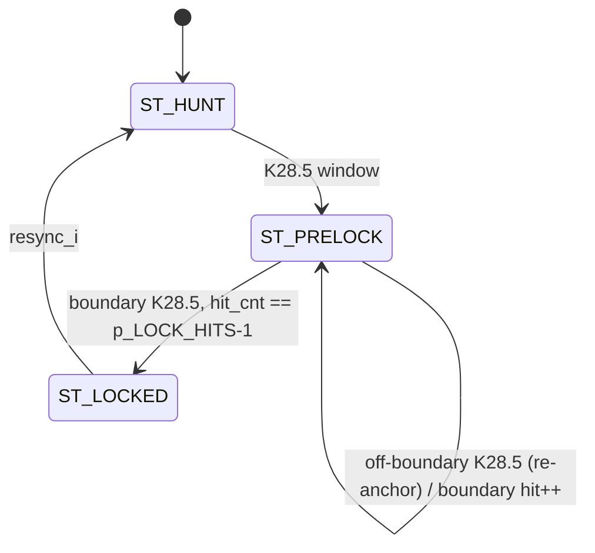

# cxp_rx_lspd_sampler

Device-side soft receiver for the 20.83 Mbps low-speed upconnection: oversamples the serial line on `os_clk`, recovers bits with an edge-reset phase counter, finds the K28.5 comma, takes Table 15 trigger packets out of the character stream, and packs four 10-bit symbols into one 40-bit word.

| Field | Bits | Content |
|---|---|---|
| P0 | [9:0] | first symbol received, bit 'a' at bit 0 (K28.5 of an IDLE word once locked) |
| P1 | [19:10] | second symbol |
| P2 | [29:20] | third symbol |
| P3 | [39:30] | fourth symbol, bit 'j' at bit 39 |

Source: `src/rtl/rx/cxp_rx_lspd_sampler.sv`. Instantiated once in `cxp_rx_link` as `cxp_rx_lspd_sampler_i` on `rx_clk`; fed by the top-level pin `rx_serial` (through `cxp_interface_top`); feeds the four 8B/10B decoders of `cxp_rx_link` (words) and `cxp_rx_trigger_lspd` (trigger packets); `rx_lock_o` is exported as `sb_rx_lock`.
Spec: §6.7 / Table 6 (bit rate, ±100 ppm), §8.2.1 (symbol bit order, Table 11), §8.2.5 / Table 14 (IDLE word), §8.2.5.1 (IDLE spacing), §10.2 (loss of lock, owned by `cxp_rx_link_mon`).

## Interface

| Name | Default | Meaning |
|---|---|---|
| `p_OS_RATIO` | 16 | `os_clk` cycles per bit. Even and ≥ 4 (elaboration check `g_chk_os_ratio`) (phase counter `idx_w(p_OS_RATIO)` bits, sample at `p_OS_RATIO/2 - 1`). `cxp_rx_link` and `cxp_interface_top` pass their own `p_OS_RATIO` (default 16); every unit and rx_top TB uses 8. |
| `p_LOCK_HITS` | 2 | Boundary-aligned K28.5 hits after the anchoring comma before `ST_LOCKED`; ≥ 1. Lock needs `p_LOCK_HITS + 1` commas, i.e. `p_LOCK_HITS + 1` IDLE words. |
| `resync_i` (port) | — | One-cycle request from `cxp_rx_link_mon` to drop to `ST_HUNT` from any state; the sampler has no loss counter of its own (the monitor counts words without IDLE, §8.2.5.1, §10.2). |

| Name | Dir | Width | Description |
|---|---|---|---|
| `os_clk` | in | 1 | Oversampling clock (= `rx_clk`). |
| `os_rst_n` | in | 1 | Active-low reset, asynchronous assert (comment says "sync"). |
| `rx_serial_i` | in | 1 | Raw serial line, asynchronous to `os_clk`. |
| `sym_out_o` | out | 40 | Packed word, registered, held until the next word. |
| `sym_valid_o` | out | 1 | One `os_clk` pulse per word, registered. |
| `sym_rd_flip_o` | out | 4 | Per lane: the running disparity entering this character is the chain's inverted (a trigger packet was taken out before it and changed the RD). |
| `rx_lock_o` | out | 1 | `state_q == ST_LOCKED`. |
| `trig_valid_o` | out | 1 | Pulse on the last character of a Table 15 packet. |
| `trig_edge_o` | out | 2 | 01 rising, 10 falling (leader voted 2 of 3). |
| `trig_dly_o` | out | 30 | The three Delay characters as received, first in `[9:0]`. |

Notes:
- Reset is asynchronous in every `always_ff` (`negedge os_rst_n`); the port comment and the TB docstring call it synchronous. Nothing in the module or in `cxp_rx_link` / `cxp_interface_top` synchronises the release.
- Single clock domain. `rx_serial_i` crosses through a 2-FF synchroniser (`rx_q1`, `rx_q2`); `rx_q3` is a third stage used only for edge detection.
- No back-pressure: a consumer must take a word every `40 × p_OS_RATIO` cycles.

## How it works

1. **Bit recovery.** `edge_seen = rx_q2 ^ rx_q3` resets `phase_q` to 0; otherwise it counts modulo `p_OS_RATIO`. `bit_sample_pulse = (phase_q == p_OS_RATIO/2 - 1)` shifts `rx_q2` into `bit_sr_q[9]`. With the two synchroniser flops and the counter's reset cycle, the line is read `p_OS_RATIO/2` to `p_OS_RATIO/2 + 1` cycles after its transition (0.50–0.56 UI at 16, 0.50–0.63 UI at 8, 0.50–0.75 UI at 4); between transitions the counter free-wheels with a period of exactly one nominal bit. An edge in the same cycle as the sample resets the counter but does not cancel the sample. Measured (tests 10 / 11, edges on `os_clk` edges): error-free from −7 % to +6 % bit-period offset at ratio 8. At ratio 4 a ±200 ppm host with random phase runs clean in the PyUVM environment up to 12 % UI edge jitter and loses bits at 13 % (`test_uplink_ppm_jitter_os4*` gate 10 %); at ratio 16 the same host was clean at 15 % with the previous sample point. Until 2026-09-27 the sample was one cycle later (0.75–1.0 UI at ratio 4): a host 200 ppm fast, even without jitter, lost bits at ratio 4 (PyUVM T-14 sweep). §6.7 requires ±100 ppm.
2. **Symbol window.** `bit_sr_q` is LSB-first (bit 'a' at bit 0) as required by §8.2.1; `k28_5_now = is_k28_5({rx_q2, bit_sr_q[9:1]})` looks at the window the register is about to hold, so a comma is seen on the pulse that completes it.
3. **Lock FSM** (`state_q`, evaluated only on `bit_sample_pulse`):

| State | Next | Condition |
|---|---|---|
| `ST_HUNT` | `ST_PRELOCK` | `k28_5_now` (any bit position); `bit_in_sym_q`, `hit_cnt_q` cleared |
| `ST_PRELOCK` | `ST_PRELOCK` | `k28_5_now` with `bit_in_sym_q != 9`: re-anchor (`bit_in_sym_q`, `hit_cnt_q` cleared) |
| `ST_PRELOCK` | `ST_PRELOCK` | `bit_in_sym_q == 9`, `k28_5_now`, `hit_cnt_q < p_LOCK_HITS-1`: `hit_cnt_q++` |
| `ST_PRELOCK` | `ST_LOCKED` | `bit_in_sym_q == 9`, `k28_5_now`, `hit_cnt_q == p_LOCK_HITS-1`: comma stored in P0, `word_lane_q = 1` |
| `ST_PRELOCK` | `ST_PRELOCK` | `bit_in_sym_q == 9`, not K28.5: keep waiting, `hit_cnt_q` kept |
| any | `ST_HUNT` | `resync_i` (link monitor lost the IDLE rhythm) |
| default | `ST_HUNT` | unreachable encoding |



4. **Trigger window.** Every locked character enters a 3-character window (`win_q`); the oldest leaves for the packer. When the window's two newest characters and the new one hold a leader — two of the three positions matching K28.2 K28.4 K28.4 (rising) or K28.4 K28.2 K28.2 (falling); the two patterns differ in every position, so both cannot match — the window is emptied and the next three characters (Delay) are taken out too; `trig_valid_o` pulses on the last, a fixed 60 bit intervals after the first leader character started, with the edge and the three raw Delay characters (decoded and voted by `cxp_rx_trigger_lspd`). One damaged leader character therefore costs neither the trigger nor the word phase (§8.2.2). A two-of-three match is decided one character later (`tent_q`): if the window one character on holds a leader exactly, that is the leader and the oldest character was data. Without that, a bit error turning D28.2 (RD−) into K28.2 right before a falling leader made the window [K28.2′ K28.4 K28.2] a rising leader one character early; the falling edge was dropped as a resend and the next rising one too (review RX-02, fixed 2026-10-04; `cxp_rx_link` test_21 fails on the old RTL).
5. **RD across a trigger.** The six characters change the running disparity by: once for a rising leader (one K28.2; both K28.4 forms have five ones), not for a falling one (two K28.2), and once more if the Delay character is not neutral — two of the three received copies decide. That flip rides on the next character (`f` of its slot → `sym_rd_flip_o`), and the lane's decoder starts from the chain's RD inverted. Because it is a change, not an absolute RD, a trigger character hit by a bit error does not propagate a disparity error. A flip still riding on a character that a second, adjacent trigger takes out is carried over (`carry_q`).
6. **Word packer.** In `ST_LOCKED` every character popped from the window is stored into lane `word_lane_q`; lane 3 also loads `sym_out_q` / `sym_rd_flip_q` and pulses `sym_valid_q`. Lock is held until `resync_i`.

Numbers (all measured at ratio 8, `p_LOCK_HITS = 2`):
- Lock: `p_LOCK_HITS + 1` commas 40 bits apart; `rx_lock_o` rises 131 bit-times after the first IDLE bit enters `rx_serial_i` (3 IDLE words + synchroniser).
- `sym_valid_o` rises `p_OS_RATIO/2 + 3` cycles (7 at ratio 8) after the transition that starts the last bit of P3.
- Throughput one word per `40 × p_OS_RATIO` cycles; lock drops on the cycle after `resync_i`.

```wavedrom
{"signal": [
 {"name": "os_clk", "wave": "p.........."},
 {"name": "rx_serial_i (bit j of P3)", "wave": "10........."},
 {"name": "rx_q1", "wave": "1.0........"},
 {"name": "rx_q2", "wave": "1..0......."},
 {"name": "phase_q", "wave": "===========", "data": ["4","5","6","7","0","1","2","3","4","5","6"]},
 {"name": "bit_sample_pulse", "wave": "10......10."},
 {"name": "sym_valid_o", "wave": "0........10", "node": ".........a."}
],
 "edge": ["a p_OS_RATIO/2 + 3 = 7 cycles after the edge"],
 "head": {"text": "last bit of P3 to sym_valid_o, p_OS_RATIO = 8"}}
```

Invariants that hold by construction but are not asserted: `bit_in_sym_q ≤ 9`; `word_lane_q` returns to 0 only through lock entry or loss; a comma in lane 1..3 is carried as data.

## Arbiter integration

Not applicable: the sampler is a receiver with no arbiter, no `ready` and no side-band inputs.

## Verification

Verilator 5.046 + cocotb 2.0.1; no SVA; `fsm_coverage.py` samples `state_q` (3/3 states, 3/3 designed arcs, no extra arcs).

### Unit TB — `src/tb_unit/rx/cxp_rx_lspd_sampler/`

Wrapper `tb_cxp_rx_lspd_sampler_top` with `OS_RATIO = 8`, `LOCK_HITS = 2`, a `resync` input and a `TESTCASE` register; `os_clk` 10 ns; reset holds `os_rst_n = 0` and `rx_serial = 0` for 5 cycles, then 2 cycles after release. `drive_bits()` holds each bit for a fractional number of cycles via an accumulator; `wait_for_lock()` polls `rx_lock`; `collect_words()` samples `sym_out` on `sym_valid`. `idle_words()` encodes K28.5 K28.1 K28.1 **K28.1** with `kmask 0b1111`, not the Table 14 word (P3 = D21.5) that `cxp_pkg` and the rx_top TB use.

| Test | Stimulus | Expect |
|---|---|---|
| `test_01_pristine_lock` | 20 IDLE words | `rx_lock` within 3000 cycles |
| `test_02_bit_exact_idle` | 30 IDLE words | 8 words after lock ∈ {IDLE RD−, IDLE RD+} |
| `test_03_mixed_traffic` | 8 IDLE, 4 data words, 4 IDLE | the 4 data words appear contiguously in 14 captured words |
| `test_04_freq_offset` | 30 IDLE at 8.0016 cycles/bit | lock; 12 words are IDLE |
| `test_05_sliding_phase` | 1–6 cycles of '1', then 30 IDLE | lock; 6 words are IDLE |
| `test_06_loss_of_signal` | 30 IDLE, line held 0 for 8192 cycles, `resync` | lock holds on the flat line; drops on `resync` |
| `test_07_async_reset` | 30 IDLE, reset asserted after lock, 30 IDLE | `rx_lock`/`sym_valid` clear 3 ns after reset; re-lock |
| `test_08_recovery_after_loss` | 30 IDLE, 1024 cycles of 0, `resync`, 30 IDLE | `rx_lock` low after `resync`; re-lock; 6 IDLE words |
| `test_09_locked_bit_slip` | 40 IDLE, the first bit after lock not sent, no `resync` | lock holds; no lane of the next 20 words is a framed K28.5/K28.1 (mutant that re-anchors on an off-boundary comma while locked → red) |

#### test_01_pristine_lock
- *Stimulus*: 20 IDLE words (800 bits) at 8 cycles/bit from reset release.
- *Checks*: `wait_for_lock(3000)` does not time out; the cycle count is only logged.
- *Proves*: `ST_HUNT → ST_PRELOCK → ST_LOCKED` on the third comma. The docstring's "≤ 5 IDLE words" is a timeout, not a measured bound.

```wavedrom
{"signal": [
 {"name": "symbol (10 bits, 80 os_clk)", "wave": "==========", "data": ["K28.5","K28.1","K28.1","K28.1","K28.5","K28.1","K28.1","K28.1","K28.5","K28.1"]},
 {"name": "state_q", "wave": "3=.......4", "data": ["HUNT","PRELOCK","LOCKED"]},
 {"name": "hit_cnt_q", "wave": "=....=....", "data": ["0","1"]},
 {"name": "rx_lock_o", "wave": "0........1", "node": ".........a"}
],
 "edge": ["a wait_for_lock returns"],
 "head": {"text": "test_01: one column = one symbol"}}
```

#### test_02_bit_exact_idle
- *Stimulus*: 30 IDLE words; capture 8 words after `rx_lock`.
- *Checks*: each word equals the TB's IDLE encoding for RD− or RD+.
- *Proves*: lane order P0..P3 and LSB-first bit order in the packer; comma placed in P0 at lock.

#### test_03_mixed_traffic
- *Stimulus*: 8 IDLE, data words `11 22 33 44`, `A5 5A C3 3C`, `00 FF 55 AA`, `10 20 30 40` (all D-codes, RD carried across), 4 IDLE.
- *Checks*: first data word found in the 14 captured words; the next three captured words equal the next three data words.
- *Proves*: symbols without commas pass through unchanged.

#### test_04_freq_offset
- *Stimulus*: 30 IDLE words at 8.0016 cycles/bit (+200 ppm).
- *Checks*: lock within 4000 cycles; 12 captured words are IDLE.
- *Proves*: the free-wheeling counter tracks a slow offset. **The offset is far inside the measured tolerance and twice the §6.7 limit; tests 10 and 11 hold the tolerance itself.**

#### test_05_sliding_phase
- *Stimulus*: line high for `randrange(1, 7)` cycles (seed `0xDEADBEEF`), then 30 IDLE words.
- *Checks*: lock within 4000 cycles; 6 captured words are IDLE.
- *Proves*: `phase_q` re-aligns on the first transition regardless of its position. **The docstring's "±0.4 UI" is 0.125–0.75 UI at ratio 8; one seed exercises one offset.**

#### test_06_loss_of_signal
- *Stimulus*: 30 IDLE words; the line held 0 for 8192 cycles; then a one-cycle `resync`.
- *Checks*: lock within 3000 cycles; still locked after the flat stretch; `rx_lock` = 0 after `resync`.
- *Proves*: the sampler never drops lock on its own (§8.2.5.1 allows 10 000 words between IDLEs); `resync_i` → `ST_HUNT`.

#### test_07_async_reset
- *Stimulus*: 30 IDLE words; after lock, `os_rst_n = 0` between clock edges; 3 ns later the checks run; reset released one edge later while the first stream is still being driven; then 30 more IDLE words.
- *Checks*: `rx_lock == 0` and `sym_valid == 0` at +3 ns; `wait_for_lock(4000)` after the second stream.
- *Proves*: asynchronous reset assertion; re-lock with the line already toggling at reset release.

```wavedrom
{"signal": [
 {"name": "os_clk", "wave": "p........."},
 {"name": "os_rst_n", "wave": "1..0...1.."},
 {"name": "state_q", "wave": "=..=......", "data": ["LOCKED","HUNT"]},
 {"name": "rx_lock_o", "wave": "1..0......", "node": "...a"},
 {"name": "sym_valid_o", "wave": "0.10......"}
],
 "edge": ["a checks at +3 ns"],
 "head": {"text": "test_07: reset asserted between edges"}}
```

#### test_08_recovery_after_loss
- *Stimulus*: 30 IDLE words; line 0 for 8192 cycles; 30 IDLE words.
- *Checks*: `rx_lock == 0` at the end of the gap; lock within 4000 cycles; 6 captured words are IDLE.
- *Proves*: `ST_HUNT → ST_PRELOCK → ST_LOCKED` a second time with `hit_cnt_q`, `word_lane_q` and `bit_in_sym_q` cleared by the resync arc.

### Integration TB — `src/tb_unit/rx/cxp_rx_link/`

7 tests on the real `cxp_rx_link` (sampler at ratio 8, default link-loss window); `drive_bits()` holds each bit for exactly 8 `rx_clk` cycles and IDLE is the Table 14 word.

| Test | Checks |
|---|---|
| `test_01_reset` | `rx_lock`, `aligned`, `link_detected` are 0 after reset |
| `test_02_link_lock` | `rx_lock` within 4000 cycles, then `link_detected` within 2000 |
| `test_04_trigger` | `trigger_out_app` after a Table 15 trigger inside an IDLE word |

`test_05`, `test_06` and `test_07` rely on lock but check downstream blocks only.

#### test_01_reset
- *Stimulus*: 5 cycles in reset with `rx_serial = 0`, one cycle after release.
- *Checks*: the three status outputs are 0.
- *Proves*: `ST_HUNT` at reset; `rx_lock_o` is a state compare.

#### test_02_link_lock
- *Stimulus*: 30 Table 14 IDLE words.
- *Checks*: `rx_lock` then `link_detected` assert (timeouts only).
- *Proves*: the sampler locks on the spec IDLE word and its word phase satisfies the word aligner without rotation.

#### test_04_trigger
- *Stimulus*: 20 IDLE, then a rising Table 15 trigger after the K28.5 of the next IDLE word, then 30 IDLE.
- *Checks*: `trigger_out_app` fires within 20000 cycles.
- *Proves*: the six characters are taken out at a character boundary and reach `cxp_rx_trigger_lspd`. Tests 13 (all four character phases, in IDLE and inside a read), 17 (a leader character hit by a bit error), 19 (Delay vote) and 20 (two triggers back to back inside a read) cover the rest; mutants "leader 3 of 3" → 17 red, "no RD flip" → 13, 17, 20 red, "flip not carried" → 20 red.

### Other

- `src/tb_unit/top/cxp_interface_top/` (13 tests) instantiates the sampler through `cxp_rx_link` with `rx_serial` tied to 1; it never locks and tests nothing here.
- `src/verif/uvm/agents/host_uplink_agent.py` drives 16 cycles per bit and pre-rolls 6 IDLE words so the sampler locks before traffic; the PyUVM env is the only in-tree run of the default `p_OS_RATIO = 16`.
- `src/emu/bridge/tb/cxp_hw_env.sv` drives `rx_serial` at 16 cycles per bit from a DPI bit source.
- `src/tb_unit/rx/cxp_rx_word_aligner/` consumes the sampler's word format from a stand-in driver, not from this module.

### Running

```
cd src/tb_unit/rx/cxp_rx_lspd_sampler && make WAVES=0 COCOTB_TEST_FILTER=test_06_loss_of_signal   # one test
cd src/tb_unit/rx/cxp_rx_lspd_sampler && make WAVES=0                                             # unit TB
cd src/tb_unit/rx/cxp_rx_link && make WAVES=0                                                      # integration TB
cd src/tb_unit && make                                                                         # regression entry point
```

2026-09-15, commit `bbd6372`: unit TB 8/8 (FSM 3/3 states, 3/3 arcs), rx_top 6/6. Full regression not re-run. A change of `WAVES` needs `make clean` first.

### Not covered in-tree

- Table 14 IDLE word at unit level (currently locks and decodes it, observed; the unit TB uses K28.1 in P3).
- Table 15 six-character trigger: no test in this unit TB; covered through `cxp_rx_link` tests 13, 17, 19, 20.
- Bit-period offset anywhere near the tolerance edge or the §6.7 limit; negative offsets; duty-cycle distortion; jitter on the transitions.
- Bit slip while locked at this level only pins that the sampler does not re-frame by itself (`test_09`); the recovery is `cxp_rx_link_mon`'s (`cxp_rx_link` test_14, test_15).
- `ST_PRELOCK` off-boundary re-anchor branch (`cxp_rx_lspd_sampler.sv:255`); `resync_i` during `ST_PRELOCK`.
- `p_LOCK_HITS ≠ 2`, `p_OS_RATIO` other than 8 at unit level, odd `p_OS_RATIO`.
- Reset release with the line toggling is covered by `test_07`; reset asserted with `rx_serial_i` unknown (X) is not.
- Counter wrap: none possible (`hit_cnt_q` stops at `p_LOCK_HITS-1`).
- Indefinite stall and multi-clock operation: not applicable (no handshake, one clock).

## Known issues and recommendations

### Critical

1. **Resolved: a Table 15 trigger packet no longer breaks the word phase.** The six characters are taken out at any character boundary (How it works 4–5), with the leader voted 2 of 3 and the RD change carried as a flip. *Original finding:* six characters inserted at a character boundary left the packer two lanes out of phase until loss of lock.

### Medium

1. **Resolved: re-synchronisation after a slip while locked.** `cxp_rx_link_mon` now requests `resync_i` after `p_BAD_WORDS` misfit words (down or up) or at once on a K28.5 outside P0 while up; the sampler re-anchors on the next comma. It still has no judgement of its own (`test_09`).
2. **Unit TB IDLE is not the spec word.** `idle_words()` puts K28.1 in P3; change to `[K28_5, K28_1, K28_1, D21_5]` with `kmask 0b0111` as in the rx_top TB so the D21.5 high-frequency content is exercised. Effort: trivial.
3. **Done (tests 10, 11).** **Frequency-offset test has no margin.** Replace `test_04` with a sweep (e.g. −4 %, −1 %, +1 %, +8 %) that asserts bit-exact words, plus an out-of-range point that asserts no lock, so the −5 %/+10 % bound becomes a regression check. Effort: small.
4. **Re-anchor path untested.** Add a test that drops one bit inside a K28.1 symbol during `ST_PRELOCK` (next comma arrives off-boundary → the re-anchor branch). The `ST_LOCKED` slip is `test_09`. Effort: small.
5. **Reset release is unsynchronised** all the way up to the `cxp_interface_top` pin. Either add a 2-FF release synchroniser in `cxp_rx_link` or document it as an integration requirement. Effort: trivial.
6. **Done 2026-09-27: the sample is at `p_OS_RATIO/2 - 1`.** **Tolerance is asymmetric and unstated.** The late sample point (`p_OS_RATIO/2 + 1`) gives −5 %/+10 % at ratio 8; document the bound per ratio in the header, or sample at `p_OS_RATIO/2 - 1` to centre it. Effort: trivial.

### Minor

- Port comment "Active-low sync reset" and the TB docstring contradict the asynchronous reset.
- The TB docstring still cites CXP 1.0 clauses (§4.7, §10.4.3, "±200 ppm"); in CXP-001-2015 they are §6.7 (±100 ppm), §8.2.1, §8.2.5, §10.2.
- Header and `p_LOCK_HITS` comment: IDLE is K28.5 K28.1 K28.1 D21.5 (Table 14), lock needs `p_LOCK_HITS + 1` commas and takes 131 bit-times, not "under 30 IDLE bits"; the `ST_PRELOCK` comment says "`p_LOCK_HITS - 1` sightings".
- ~~`bit_strobe_o` is unconnected in `cxp_rx_link`~~ — port removed 2026-09-19.
- `test_05` docstring "±0.4 UI" does not match the 0.125–0.75 UI stimulus.

### Open questions

1. (verification) Should the unit TB adopt the rx_top TB's packet helpers so IDLE, trigger and control encodings are shared instead of re-implemented?
