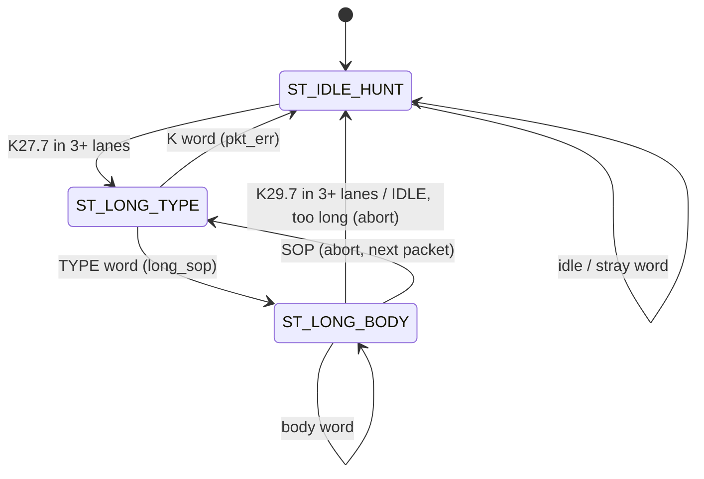

# cxp_rx_packet_parser

Inputs chosen from the tree: RTL `src/rtl/rx/cxp_rx_packet_parser.sv` (+ `cxp_pkg.sv`, `cxp_util_pkg.sv` for `mvote`); parent `src/rtl/rx/cxp_rx_link.sv`; bound SVA `src/sva/cxp_sva.sv` (`cxp_rxlong_sva`); unit TB `src/tb_unit/rx/cxp_rx_packet_parser/`; integration TBs `src/tb_unit/rx/cxp_rx_link/`, `src/tb_unit/top/cxp_device_top/`, `src/tb_unit/top/cxp_interface_top/`; spec JIIA CXP-001-2015 v1.1.1 (`docs/spec/CXP-001-2015.pdf`) §8.2.1 (Table 11), §8.2.2.1, §8.2.3, §8.2.4 (Table 13), §8.2.5 (Table 14), §8.2.5.2, §8.3.1, §8.3.2.1 (Table 15), §8.3.3 (Table 17), §8.4 (Table 18); regression `make -C src/tb_unit`; output `docs/design/modules/rx/cxp_rx_packet_parser.md`.

Classifies every decoded uplink word into IDLE (dropped), an I/O acknowledgment (taken out of the stream in any state, pulse out) or a long data packet (body streamed with SOP/EOP marks and the TYPE byte), by K-character pattern alone.

| Word class | Pattern on `{P3,P2,P1,P0}` / `d_kmask_i` | Output |
|---|---|---|
| IDLE | P0 = K28.5, P1 = P2 = K28.1, kmask = 0111 (P3 any D) | none |
| I/O-ack leader | K28.6 in ≥ 3 lanes, in any state | none; the word is not part of any packet |
| I/O-ack code | the word after an I/O-ack leader, kmask = 0000 | `ioack_o` if the 3-of-4 bit vote of the lanes is 0x01; the word is not part of any packet |
| Long SOP | K27.7 in ≥ 3 lanes | none; next word is TYPE |
| TYPE | first word after SOP | `long_valid_o + long_sop_o`, `long_type_o` = 3-of-4 vote of the lanes |
| Body | every following word | `long_valid_o` |
| EOP | K29.7 in ≥ 3 lanes | `long_valid_o + long_eop_o` |
| Anything else in hunt | e.g. K28.0, K28.3, K29.7 without SOP, a K28.2 / K28.4 word (a damaged Table 15 leader) | dropped silently |

Source: `src/rtl/rx/cxp_rx_packet_parser.sv`. One instance, `cxp_rx_link.cxp_rx_packet_parser_i` on `rx_clk`, fed by `cxp_rx_link_mon` (`mon_data`, `mon_kmask`, `mon_err`, `mon_valid`, `mon_flush`), which forwards the registered 4-lane 8B/10B decoder words while the link is up. Feeds `cxp_ctrl_plane` (`long_*` as `cxp_rx_link.long_o`) and `cxp_rx_linktest` (`long_*` gated on TYPE 0x04 in `cxp_rx_link`). `ioack_o` leaves `cxp_rx_link` as `ioack_rcvd_o`; `cxp_interface_top` crosses it to `tx_clk` and it becomes `cxp_tx_trigger_hs.ack_i`, which releases the next device trigger (§8.3.3). `pkt_err_pulse_o` leaves `cxp_interface_top` as `sb_pkt_err_pulse`.

Spec clauses implemented: Table 11 K-codes, Table 14 IDLE, Table 18 framing (K27.7 / 4×TYPE / K29.7), Table 17 I/O acknowledgment including its §8.2.4 insertion at a word boundary into a packet the host is sending. Table 15 (the low-speed 6-character trigger packet) never reaches this block: `cxp_rx_lspd_sampler` takes it out of the character stream, also inside a packet. The Table 16 word form belongs to the high-speed links and has no path here (removed 2026-09-26).

## Interface

Parameters: none. K-code bytes, `KMASK_IDLE` and `IOACK_CODE_OK` come from `cxp_pkg`; `mvote` from `cxp_util_pkg`.

| Name | Dir | Width | Description |
|---|---|---|---|
| `rx_clk` | in | 1 | Only clock |
| `rx_rst_n` | in | 1 | Active-low. Asynchronous assert; comment says "sync reset" |
| `d_in_i` | in | 32 | Word, `{P3,P2,P1,P0}`, P0 in bits 7:0 |
| `d_kmask_i` | in | 4 | Bit i = 1: lane Pi is a K-character |
| `d_err_i` | in | 1 | 8B/10B code or disparity error in this word (from `cxp_rx_link`) |
| `d_valid_i` | in | 1 | Word strobe; nothing moves or is emitted without it |
| `flush_i` | in | 1 | From `cxp_rx_link_mon`: the link left UP; a packet in flight is aborted, the FSM returns to hunt, a half-received I/O ack is forgotten |
| `ioack_o` | out | 1 | High during an I/O-ack code word whose voted byte is 0x01 (Table 17 "Trigger packet received OK"); low under `flush_i` |
| `long_data_o` | out | 32 | `d_in_i` while in a long packet, else 0 |
| `long_kmask_o` | out | 4 | `d_kmask_i` while in a long packet, else 0 |
| `long_valid_o` | out | 1 | High on the TYPE word, every body word and the K29.7 word; also on an abort word |
| `long_sop_o` | out | 1 | High on the TYPE word only |
| `long_eop_o` | out | 1 | High on a word with K29.7 in at least 3 lanes, or on an abort word |
| `long_err_o` | out | 1 | With `long_eop_o`: the packet was aborted (SOP, IDLE or over-long body inside a packet, or `flush_i`); without: this body word had an 8B/10B error (`d_err_i`) |
| `long_type_o` | out | 8 | 3-of-4 vote of the TYPE word during that word, then the latched value until the next TYPE word |
| `pkt_err_pulse_o` | out | 1 | High on an abort word and on a K word (other than SOP) where the TYPE word belongs |

Notes:

- Reset: asynchronous assert on `rx_rst_n` (`always_ff … or negedge rx_rst_n`); the state, `long_type_q`, `body_cnt_q` and `ioack_q` clear and every output drops in the same time step. A SOP in the release cycle is accepted.
- Single `rx_clk` domain, no CDC.
- Every output except the latched part of `long_type_o` is combinational on `state_q`, `ioack_q` and the current word: latency 0, outputs are only meaningful while `d_valid_i` is high. No back-pressure; one word per cycle.
- Header comments that do not match the code: (a) "any all-K on P0..P2 + D on P3 is IDLE" – the code requires exactly K28.5/K28.1/K28.1; (b) "§6.2.2" is v1.0 numbering for §8.2.2.1.

## How it works

1. **Word classification** (combinational): `is_idle`, `is_sop3` / `is_eop3` (K27.7 / K29.7 in at least 3 lanes, §8.2.2.1), and for the I/O acknowledgment `ioack_lead = cnt_kc(K28_6) >= 3` and `ioack_code = ioack_q && d_kmask_i == 0000`. In hunt only a SOP leaves the state.
2. **I/O-acknowledgment extraction** (`ioack_q`, `ioack_word = d_valid_i & (ioack_lead | ioack_code)`). Checked before the packet FSM, in every state:
   - A leader sets `ioack_q`; a following data word is the code word and clears it. On both words the packet FSM, `body_cnt_q` and the latches hold, no `long_*` output fires and the word cannot abort a packet (`abort` is masked by `~ioack_word`). So an acknowledgment inserted between two words of a long packet (§8.2.4) leaves the packet exactly as if it were absent.
   - `ioack_o` pulses on the code word when `mvote(b0..b3)` (per-bit 3-of-4 vote) is 0x01. Another code value takes both words out silently.
   - A repeated leader is taken out too and starts the acknowledgment again (test_15, leader, leader, 0x01 inside a command).
   - A leader followed by any other K-character word is dropped: `ioack_q` clears and that word is parsed normally (an IDLE, SOP or EOP after it still frames, aborts or closes as usual).
   - `flush_i` clears `ioack_q`.
3. **FSM** (`state_q`, 3 states, advances only on `d_valid_i` and not on an I/O-ack word):

| State | Next | Condition |
|---|---|---|
| ST_IDLE_HUNT | ST_IDLE_HUNT | anything but a SOP (a single K27.7 lane is not one) |
| ST_IDLE_HUNT | ST_LONG_TYPE | K27.7 in ≥ 3 lanes (`is_sop3`) |
| ST_LONG_TYPE | ST_LONG_BODY | a D word; `long_sop_o`, `long_type_q` ← voted TYPE |
| ST_LONG_TYPE | ST_LONG_TYPE | another SOP (nothing presented) |
| ST_LONG_TYPE | ST_IDLE_HUNT | any other K word (`pkt_err_pulse_o`, nothing presented) |
| ST_LONG_BODY | ST_IDLE_HUNT | K29.7 in ≥ 3 lanes (`long_eop_o`) |
| ST_LONG_BODY | ST_LONG_TYPE | SOP (≥ 3 K27.7 lanes): abort word, the new packet starts |
| ST_LONG_BODY | ST_IDLE_HUNT | IDLE (§8.2.5.2), or `RX_MAX_BODY_WORDS` (2048) body words: abort word |
| ST_LONG_BODY | ST_LONG_BODY | otherwise, including a 1–2-lane K29.7, K28.4/K28.2 and any other K word (streamed as body) |
| any | same | an I/O-ack leader or code word |
| any | ST_IDLE_HUNT | `flush_i` (abort word if in ST_LONG_BODY) |

An abort word has `long_valid_o = long_eop_o = long_err_o = 1` and fires `pkt_err_pulse_o`; `cxp_ctrl_plane` acks the aborted command 0x47, `cxp_rx_linktest` counts its missing words. The bound `cxp_rxlong_sva` checks that every SOP is closed by one EOP before the next.



The I/O-ack words are not arcs: in any state the two words leave `state_q` unchanged.

4. **Output mux** per state (title-block table). `long_type_o` is the voted TYPE live on the TYPE word and `long_type_q` otherwise, so `cxp_rx_link`'s `lt_gate` and `cxp_ctrl_plane`'s gate see the right TYPE on the SOP-marked word itself.
5. **Timing.** An I/O acknowledgment occupies 2 words and yields one `ioack_o` cycle on the second. A long packet of D payload words (Table 18: D + 3 words) yields D + 2 `long_valid_o` cycles; the K27.7 word produces nothing, so a following packet's SOP can be recognised in the cycle after the trailer. Same-cycle rules: `long_eop_o` and the return to hunt are the same word.

Invariants by construction, not asserted: `long_sop_o → state_q == ST_LONG_TYPE`; `long_eop_o → state_n ∈ {ST_IDLE_HUNT, ST_LONG_TYPE}`; `long_valid_o` and `ioack_o` never coincide.

## Arbiter integration

No arbiter: receive-side block with no ready. It is, however, the point where §8.2.4 / Table 13 priority insertion must be undone on the receive side. For the I/O acknowledgment (priority 1) it is: a Table 17 packet the host inserts into a command or connection-test packet is taken out and the packet goes on. The trigger (priority 0) a low-speed host sends is the Table 15 packet, taken out at character level by `cxp_rx_lspd_sampler`, also inside a packet, before words are formed.

## Verification

Verilator 5.046, cocotb 2.0.1, `cxp_test` wrapper, built with `--assert`: the bound `cxp_rxlong_sva` (every SOP closed by one EOP before the next; `err` only inside a packet) runs in every bench that contains the parser. FSM coverage is collected: the unit TB registers `rx_packet_parser` (3 states, 5 designed arcs).

### Unit TB — `src/tb_unit/rx/cxp_rx_packet_parser/`

Wrapper `tb_cxp_rx_packet_parser_top.sv` (ports without `_i/_o`, `ioack` included, `TESTCASE` register). Clock 10 ns; reset: inputs 0, `rx_rst_n` low 4 cycles, release, 1 cycle. `drive_seq` presents the words through `common/cxp_gapped.GappedDriver`: before each word `d_valid` drops for a random 0–4 cycles with a stale or random word on the bus, and `quiet()` asserts that no `long_valid`, `pkt_err` or `ioack` fires in those cycles. Outputs are sampled in ReadOnly of the cycle a word is valid, so capture index i is the parser's response to word i. No shared checkers beyond inline asserts. Test numbers skip 03 (the GPIO test removed with CXP 1.1) and 04–06 (the Table 16 word-form trigger, removed with that path).

| Test | Stimulus | Expect |
|---|---|---|
| test_01_reset | reset only | `long_valid = 0`, `ioack = 0` |
| test_02_idle | 5 IDLE words | no `ioack`, `long_valid`, `pkt_err` |
| test_07_long_packet | SOP, 4×0x02, 3 body words, EOP | 5 `long_valid`; sop/type on first, data order, eop on last |
| test_08_truncated | SOP, TYPE, body, SOP, TYPE, body, EOP | 2 sop, 2 eop: the first an abort (`long_err`, `pkt_err`) on the second SOP |
| test_09_three_of_four | one K27.7 lane; then 3-lane SOP and EOP | no packet; then one packet |
| test_10_idle_in_body | IDLE inside a body | abort word, nothing forwarded after |
| test_11_flush | `flush` mid-body; `flush` in hunt | abort word; nothing |
| test_12_too_long | 2100-word body | abort at 2048 body words |
| test_13_decode_error_word | body word with `d_err` | forwarded with `long_err`, no `long_eop`; trailer clean |
| test_14_kchar_in_type | SOP then IDLE; SOP then K29.7; then a whole packet | no `long_valid` on either K word, `pkt_err` on both; the packet after them frames normally |
| test_15_ioack_extracted | I/O acks between packets and inside a command; wrong code; leader then IDLE | `ioack` on the two 0x01 code words only; the command intact |
| test_16_sop_after_trig_leader | 4×K28.4, then SOP, TYPE, body, EOP | the command frames (TYPE with sop, body, EOP), no `long_err`; red before the word-form path was removed (the K28.4 word took the SOP as its delay word) |

#### test_01_reset

- *Stimulus*: reset sequence, no words.
- *Checks*: `long_valid = 0`; `ioack = 0` after release.
- *Proves*: reset values with `d_valid = 0` (the output mux defaults). Nothing about the state or the latches.

#### test_02_idle

- *Stimulus*: 5 × (K28.5, K28.1, K28.1, D21.5) with kmask 0111.
- *Checks*: for every captured word `ioack = 0`, `long_valid = 0`, `pkt_err = 0`.
- *Proves*: `is_idle` keeps ST_IDLE_HUNT with all outputs low.

#### test_07_long_packet

- *Stimulus*: 4×K27.7, 4×0x02, 0x11111111, 0x22222222, 0x33333333, 4×K29.7 (kmask 1111).
- *Checks*: exactly 5 `long_valid` captures; first has `long_sop = 1` and `long_type = 0x02`; captures 2..4 carry the body words in order; the fifth has `long_eop = 1`.
- *Proves*: ST_IDLE_HUNT → ST_LONG_TYPE → ST_LONG_BODY → ST_IDLE_HUNT, `long_type_o` live on the TYPE word, `long_eop_o = is_eop3`. `long_kmask` and the absence of `pkt_err` are not checked.

```wavedrom
{ "signal": [
  { "name": "rx_clk",       "wave": "p......" },
  { "name": "d_valid_i",    "wave": "1.....0" },
  { "name": "d_in_i",       "wave": "2345672", "data": ["SOP","TYPE","11..","22..","33..","EOP","-"] },
  { "name": "state_q",      "wave": "2345..2", "data": ["HUNT","TYPE","BODY","BODY","","","HUNT"] },
  { "name": "long_valid_o", "wave": "01....0" },
  { "name": "long_sop_o",   "wave": "010...." , "node": ".A....." },
  { "name": "long_eop_o",   "wave": "0....10", "node": ".....B." },
  { "name": "long_type_o",  "wave": "2=.....", "data": ["00","02"] }
], "head": { "text": "A: sop + type on the TYPE word; B: eop on the K29.7 word, state back to hunt next edge (gaps omitted)" } }
```

#### test_08_truncated

- *Stimulus*: 4×K27.7, 4×0x02, 0xCAFEBABE, 4×K27.7, 4×0x02, 0xDEADBEEF, 4×K29.7.
- *Checks*: 2 `long_sop` and 2 `long_eop` events; the first eop is on the second SOP with `long_err` and `pkt_err`; 0xDEADBEEF is in the second packet.
- *Proves*: a lost trailer does not merge two packets.

#### test_09_three_of_four, test_10_idle_in_body, test_11_flush, test_12_too_long, test_13_decode_error_word, test_14_kchar_in_type

As in the table: the 3-of-4 SOP/EOP vote, the IDLE / flush / length aborts, the body-word error mark and a K word in the TYPE slot. Each checks the `long_*` event list and `pkt_err` inline.

#### test_15_ioack_extracted

- *Stimulus*: (0) an I/O-ack leader with P3 corrupted to K28.5 (3 of 4 lanes K28.6), (1) 4×0x01; (2–4) SOP, 4×0x02, 0x11111111; (5–6) 4×K28.6, 4×0x01 inside the command; (7–8) 0x22222222, EOP; (9–10) 4×K28.6, 4×0x02; (11–12) 4×K28.6, IDLE; (13–15) SOP, 4×0x02, EOP.
- *Checks*: `ioack` at words 1 and 6 only; `long_valid` at words 3, 4, 7, 8, 14, 15 (TYPE, both body words, EOP; then the last packet); no `long_err`; no `pkt_err`; `long_sop` on 3, `long_eop` on 8 and 15.
- *Proves*: the 3-of-4 leader rule; extraction in hunt and inside a long body without disturbing the body count, the framing or the abort logic; code 0x02 taken out without a pulse; a leader followed by an IDLE is dropped and the IDLE parsed normally. Before this change the parser streamed an inserted acknowledgment as two body words (by code: ST_LONG_BODY streams any K word that is not SOP, EOP or IDLE).

### Integration TB — `src/tb_unit/rx/cxp_rx_link/`

The parser inside the real receive chain, driven bit-serially (OS_RATIO 8). Entries that exercise this block:

#### test_02_link_lock

- *Stimulus*: 30 IDLE words as serial bits.
- *Checks*: `rx_lock` within 4000 cycles, `link_detected` within 2000 more.
- *Proves*: indirectly that IDLE words reach the parser; no parser output is observed.

#### test_05_ctrl_read, test_06_ctrl_reset_op

- *Stimulus*: 20 IDLE, one Table 21 control packet, 20 IDLE.
- *Checks*: `rsp_code` 0x00 / 0x03, `rbuf[0]` (test_05), `ctrl_reset_pulse` (test_06).
- *Proves*: SOP → TYPE (`long_type = 0x02`) → body → EOP framing end to end. Asserts nothing about `pkt_err_pulse`.

Tests 13, 17 and 20 put Table 15 triggers inside commands at every character phase: the commands the parser frames stay intact.

`test_08` (connection-test packets), `test_09` (lost trailer → 0x47) and `test_10` (decode-error word → 0x80) also run through the parser's framing and abort paths. The bench never sends an I/O acknowledgment; `ioack_rcvd` is exposed by the wrapper but not observed.

### Integration TBs — `src/tb_unit/top/cxp_interface_top/`, `src/tb_unit/top/cxp_device_top/`

The host model `common/cxp_host.py` answers every device trigger with a Table 17 acknowledgment inserted at the next uplink word boundary, which can fall inside a command it is sending. So `ioack_o` is exercised end to end, through `cxp_rx_link.ioack_rcvd_o` and the rx→tx pulse crossing, by `cxp_interface_top` tests 8–11, 15, 20 (acknowledging host; test 19 drops every acknowledgment) and `cxp_device_top` tests 12, 30, 31 and 32: the device sends its next trigger only after the acknowledgment or the timeout, and those tests check the pacing (`cxp_device_top` test 30 with a host that acknowledges, drops or acknowledges late). None of them asserts that an acknowledgment landed inside a command.

### Other

- `src/tb_unit/ctrl/cxp_ctrl_cmd_parser/` and `src/tb_unit/rx/cxp_rx_linktest/` drive the `long_*` interface by hand in the RTL's conventions; neither instantiates the parser.
- `src/verif/` PyUVM `host_uplink_agent` sends Table 15 host triggers and answers device triggers with Table 17.
- `src/emu/bridge/Makefile` compiles it; no emulation test targets it.
- `docs/design/cxp_camera_ip_modules.md` §4.6 and `docs/verification/cxp_rx_verification.md` §3.4 describe the v1.0 parser (8-bit ports, GPIO output, 8 tests).

### Running

```
make -C src/tb_unit/rx/cxp_rx_packet_parser WAVES=0
make -C src/tb_unit/rx/cxp_rx_packet_parser WAVES=0 COCOTB_TEST_FILTER=test_15_ioack_extracted
make -C src/tb_unit/rx/cxp_rx_link WAVES=0
make -C src/tb_unit
```

2026-09-26: unit TB 12/12 pass, FSM coverage 3/3 states, 5/5 arcs; `cxp_rx_link` 19/19 pass, none tagged.

### Not covered in-tree

- Table 15 six-character trigger packet: taken out before this block.
- An I/O acknowledgment between SOP and TYPE: by code both words are taken out and the packet continues; no test.
- A doubled I/O-ack leader inside a body: the first is dropped, the second (with `ioack_q` set) is parsed normally and streamed as a body word, and the code word after it too (Minor).
- An I/O-ack code word with a decode error: by code it still counts if the lane vote gives 0x01; no test.
- An acknowledgment landing inside a command at device level: possible with the host model, not asserted.
- Non-replicated TYPE word and 1–3-lane SOP: TYPE is voted; a 3-lane SOP is accepted without a glitch flag.
- Stray words in hunt (K28.0, K28.3, K28.2 / K28.4, K29.7 without SOP, all-K IDLE-shaped word, a lone I/O-ack leader): dropped silently (Medium 1); a K28.4 word before a SOP is test_16.
- Reset during a packet and a SOP in the release cycle: by code both behave (state back to hunt, SOP accepted); no test.
- End to end: `pkt_err_pulse` is unobserved above the unit TB (Medium 2).
- X-propagation: not tested.

## Known issues and recommendations

### Critical

None.

### Medium

1. **Silent discards hide link problems.** K29.7 without SOP, K28.0 (v1.0 GPIO), K28.3, a damaged trigger leader, IDLE-shaped words with kmask 1111, a lone I/O-ack leader and an I/O ack with a code other than 0x01 vanish with no counter or pulse, so a misbehaving Host or a decoder fault is invisible to software. Fix: pulse `pkt_err_pulse_o` (or a separate `stray_word_pulse_o`) for these. Effort: 1 h.
2. **`pkt_err_pulse` is unobserved above the unit TB.** Add an rx_top test that sends a K word where TYPE belongs and asserts `pkt_err_pulse` once. Add an rx_top test that inserts an I/O acknowledgment into a command and asserts one `ioack_rcvd` and the command acked 0x00. Effort: 3 h.
3. **Unit-test gaps.** No test for reset mid-packet. Effort: 1 h.

### Minor

- Port comment for `rx_rst_n`: "async assert, sync deassert".
- Header: replace the claims listed under Interface Notes, and cite §8.2.2.1 instead of §6.2.2.
- A doubled I/O-ack leader streams the second leader and its code word as body words (the command then fails its CRC). Letting a leader re-arm `ioack_q` (`ioack_lead` without `!ioack_q`) would take out leader, leader, code.
- `docs/design/cxp_camera_ip_modules.md` §4.6 (8-bit ports, GPIO, §6.x numbering) and `docs/verification/cxp_rx_verification.md` §3.4 (8 cases incl. GPIO, "8/8") are stale.
- SVA to add: `ioack_o |-> !long_valid_o`.

### Open questions

1. Designer: should an I/O acknowledgment with a code other than 0x01 be reported (Table 17 defines only 0x01)?
2. Verification: which TB owns the end-to-end checks of `pkt_err_pulse` and I/O-ack insertion inside a command, `cxp_rx_link` or `cxp_device_top`?
