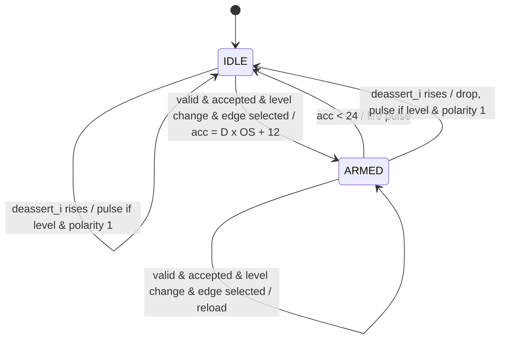

# cxp_rx_trigger_lspd

Recreates the host's trigger event from a low-speed trigger packet (Table 15): votes the three Delay characters, rejects a packet it cannot trust, and pulses the application output Delay units of 1/24 bit after the packet, so the event-to-output latency is constant (§8.3.2.1, Figure 20). It follows the host's trigger level, so a re-sent packet (§8.3.3) is not a second event, and de-asserts that level when a ConnectionReset starts link discovery (§8.3.2).

| Input transaction (from `cxp_rx_lspd_sampler`, via `cxp_rx_link`) | Field | Meaning |
|---|---|---|
| `trig_valid_i` = 1 for one cycle | `trig_edge_i` | 01 rising (leader K28.2 K28.4 K28.4), 10 falling (K28.4 K28.2 K28.2), voted 2 of 3 by the sampler |
| | `trig_dly_i` | the three Delay characters as received, 10b each, the first in `[9:0]` |

Source: `src/rtl/rx/cxp_rx_trigger_lspd.sv`. Instantiated once in `cxp_rx_link`, which passes the sampler's strobe only while `link_detected_o` is 1 and `trig_enable_i` is 1 (`cxp_interface_top` ties it to `~from_extension_link`: the I/O channel is the Master connection's), and drives `deassert_i` from `trig_deassert_i` (`cxp_interface_top`: `conn_reset_active`); `trig_ok_o` is `cxp_rx_link`'s `trig_pkt_rcvd_o` (the §8.3.3 I/O-acknowledgment request) and the two pulses go straight through to `cxp_interface_top`'s `trig_out` / `trig_out_glitch_pulse`. Spec: §8.2.2, §8.3.2, §8.3.2.1, Figure 20, Table 15, §8.3.3.

## Interface

| Parameter | Default | Meaning |
|---|---|---|
| `p_OS_RATIO` | 16 | `rx_clk` cycles per low-speed bit (the sampler's ratio). One Delay unit is `p_OS_RATIO / 24` cycles. ≥ 1. |

| Port | Dir | Width | Description |
|---|---|---|---|
| `rx_clk`, `rx_rst_n` | in | 1 | Clock; asynchronous active-low reset. |
| `cfg_polarity_i` | in | 1 | 0 = rising packets reach the application, 1 = falling. Sampled with `trig_valid_i` and on the first cycle of `deassert_i`. |
| `deassert_i` | in | 1 | ConnectionReset in progress. Its rising edge de-asserts the host's trigger level. |
| `trig_valid_i` | in | 1 | One-cycle strobe qualifying the two inputs below. |
| `trig_edge_i` | in | 2 | `TRIG_EDGE_RISE` / `TRIG_EDGE_FALL`; 00 and 11 are rejected. |
| `trig_dly_i` | in | 30 | Three Delay characters, 10b, first in `[9:0]`. |
| `trig_ok_o` | out | 1 | Registered pulse for every packet accepted, whatever its edge. |
| `trigger_out_app_o` | out | 1 | Registered one-cycle pulse, the recreated event. |
| `trigger_glitch_pulse_o` | out | 1 | Registered pulse for a rejected packet. |

## How it works

1. **Decode.** Each Delay character goes through two `cxp_rx_8b10b_decoder` instances, at RD− and at RD+: the three copies of a non-neutral character alternate forms on the wire, and D.x.A7 is only legal at one RD. A copy is good if it decodes as a data character, without code or disparity error, at one of the two.
2. **Vote.** Two good copies with the same byte give the Delay (§8.2.2: one bad copy is out-voted). No two alike, a Delay above 239 (`TRIG_DELAY_MAX`), or edge 00/11 rejects the packet: `trigger_glitch_pulse_o`, no `trig_ok_o`, no application pulse.
3. **Acknowledge.** Every accepted packet pulses `trig_ok_o`, also when the polarity filters its edge or it is a resend (§8.3.3: each packet is acknowledged).
4. **Level.** `lvl_q` is the host's trigger level: a rising packet sets it, a falling one clears it. An accepted packet whose edge does not change `lvl_q` is a resend — §8.3.3: a host with no acknowledgment "can resend the last trigger packet" — and arms nothing. Only a level change goes on to the wait.
5. **Wait.** An accepted level change of the selected edge loads `acc_q` = Delay × `p_OS_RATIO` + 12 and arms; each armed cycle takes 24 off, and the cycle that finds `acc_q` < 24 fires. The wait is floor((Delay × `p_OS_RATIO` + 12) / 24) cycles: Delay units of 1/24 bit, rounded to a cycle. The sampler's strobe comes a fixed 60 bit intervals after the first leader character started, so the output is (constant + Delay units) after the packet's start, i.e. 239 units plus a constant after the host's event (Figure 20).
6. **Retrigger.** The load is written after the decrement, so a packet arriving during a countdown replaces it, and one arriving on the cycle that fires arms the next countdown (both pulses happen). From the wire this cannot occur (the wait is under one character, the next packet at least six characters later).
7. **Link discovery.** On the first cycle of `deassert_i` the countdown is dropped and `lvl_q` cleared. If the host was left asserted and the polarity selects falling edges, the falling edge the reset implies (§8.3.2: "the effect of a falling edge trigger packet") pulses `trigger_out_app_o` at once, with no Delay (there is no packet to take one from). No `trig_ok_o`: there is nothing to acknowledge.

Timing: `trig_ok_o` and `trigger_glitch_pulse_o` one cycle after `trig_valid_i`; `trigger_out_app_o` wait + 1 cycles after it, or one cycle after `deassert_i` rises.

## Verification

### Unit TB — `src/tb_unit/rx/cxp_rx_trigger_lspd/`

Wrapper with `OS_RATIO` = 8 (one Delay unit = 1/3 cycle) and a `deassert` input; the TB stands in for the sampler and encodes the Delay characters with the golden `cxp_8b10b`, RD chained, so the copies alternate forms as on the wire.

| Test | Stimulus | Expect |
|---|---|---|
| test_01_reset | reset | outputs low |
| test_02_rising_zero_delay | rising, Delay 0 | one app pulse, one `trig_ok`, no glitch |
| test_03_falling_pol_match | falling, polarity 1 | app pulse |
| test_04_polarity_mismatch | falling, polarity 0 | no app pulse, one `trig_ok` |
| test_05_delay_countdown | Delay 0, 3, 24, 120, 147, 239 | latency − latency(0) = 0, 1, 8, 40, 49, 80 cycles exactly |
| test_06_delay_no_majority | Delay characters 10, 20, 30 | glitch, no `trig_ok`, no pulse |
| test_07_one_bad_delay_char | Delay 147 with one bit of the first or the last copy inverted | pulse at the clean latency |
| test_08_delay_out_of_range | Delay 240, 255 | glitch |
| test_09_delay_char_forms | Delay 235 (D11.7, P7 / A7 / P7) from RD− and RD+; three K28.5 | pulse at the Delay-235 wait; K28.5 → glitch |
| test_10_retrigger_while_armed | A (20-cycle wait), a falling packet, B (3-cycle wait) 5 edges later | one pulse, B's latency after B |
| test_11_event_on_fire_cycle | A, a falling packet, B sampled on the edge that fires A | two pulses |
| test_12_resent_packet | rising three times; falling; rising | one pulse and three `trig_ok` for the three; the rising after the falling pulses |
| test_13_connection_reset_deasserts | (a) pol 1, rising, `deassert`; (b) `deassert` again; (c) pol 0, rising with a 60-cycle wait, `deassert` 10 cycles later; (d) rising, falling, `deassert` | (a) one pulse; (b), (c), (d) none |

Tests that send a second rising packet put a falling one (`rearm`) before it. Mutants that turn them red: decrement after the load (the previous order) → 10, 11; vote needing three alike → 7; Delay decoded at RD− only → 7, 9. Tests 10 and 11 were red on the 0.1 RTL (B lost; B on the fire cycle dropped); 12 and 13 on 0.2 (every rising packet pulsed; nothing on `deassert`).

### Integration — `src/tb_unit/rx/cxp_rx_link/`

- test_16_delay_absolute_time: Delay 0, 80, 160, 239 at `OS_RATIO` 8: latency from the first leader character minus Delay × `OS_RATIO` / 24 constant within 2 cycles (before: varied by 319 cycles). The phase sweep puts a falling packet after each rising one.
- test_18_trigger_while_down: nothing fires or is acknowledged before `aligned`.
- test_19_delay_vote: one bad copy fires at the clean latency; no majority or Delay 240 → glitch, no ack.
- test_04, test_07, test_13, test_17, test_20: Table 15 packets in IDLE and inside commands, the ack independent of the polarity; test_17 and test_19 alternate the edges (a repeated rising packet is a resend).
- `cxp_device_top` test_07 (host trigger, one I/O ack), test_33 (triggers inside host test packets, TestMode 0 and 1: 10 alternating packets, 5 rises, 10 acks), test_35 (inside a write: 4 packets, 2 rises, 4 acks).
- `cxp_rx_link` ties `trig_enable_i` to 1 and `trig_deassert_i` to 0; the two are checked through `src/verif/uvm`.

### Other

- `src/verif/uvm`: `rx_trigger_scoreboard` follows the host level — one `trig_out` pulse per level change of the selected edge, none for a resend, the falling edge at polarity 1 when a ConnectionReset finds the host asserted, nothing on an extension connection — and checks the Delay law (latency less Delay × 1/24 bit constant). `io_ack_scoreboard` expects an acknowledgment for every accepted packet, resends included, and none on an extension connection. `test_trigger_at_discovery` covers the resend, the reset de-assertion at polarity 1 (red on 0.2) and the extension connection; `test_trigger_delay_latency`, `test_trigger_uplink`, `test_io_ack`, `test_trigger_in_ctrl_packet` and the trigger concurrency tests send Table 15 packets.
- `src/emu/`: the DPI host and the virtual camera send Table 15.

## Known issues and recommendations

### Critical

None.

### Medium

None.

### Minor

- The application interface is a pulse of the selected edge; the level is tracked inside but not output.
- `cfg_polarity_i` is also the sense of the device's own trigger pin (`cxp_tx_trigger_hs`): the edge the application sees and the pin's active level cannot be set apart.
- The reset's falling edge has no Delay and so not the fixed latency of a packet; a countdown ending on the first cycle of `deassert_i` is dropped with the rest.
- No SVA on the wait (`trig_valid_i` accepted → `trigger_out_app_o` within 80 × `p_OS_RATIO` / 8 + 2 cycles).
- The Delay wait is rounded to one `rx_clk` cycle; a finer recreated event would need a sub-cycle output.
