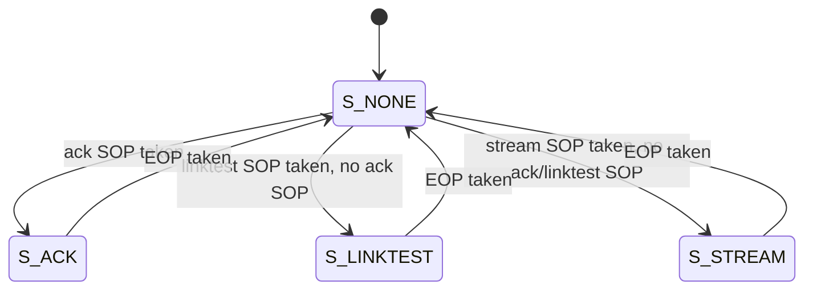

# cxp_tx_arbiter

Inputs chosen from the tree: RTL `src/rtl/tx/cxp_tx_arbiter.sv` (+ `cxp_pkg.sv` for `cxp_txw_t`, `TX_PORTS`, `TX_PORT_*`; `cxp_util_pkg.sv` for `cnt_w`); its consumer `src/rtl/tx/cxp_tx_inserter.sv`; wiring in `src/rtl/top/cxp_interface_top.sv`; bound SVA `src/sva/cxp_sva.sv` (`cxp_arbiter_sva`, `cxp_tx_owner_sva`); scheduler TB `src/tb_unit/tx/cxp_tx_arbiter/` (wrapper `tb_cxp_tx_arbiter_top.sv`, arbiter + inserter); integration TBs `src/tb_unit/top/cxp_interface_top/`, `src/tb_unit/top/cxp_device_top/`; spec JIIA CXP-001-2015 v1.1.1 §8.2.4 / Table 13, §8.2.5.2, §8.7.4; output `docs/design/modules/tx/cxp_tx_arbiter.md`.

Chooses which long packet goes to the downlink next. It serves only the Table 13 priority-2 sources; triggers, I/O acknowledgments and IDLE words are placed by `cxp_tx_inserter`, which takes the word this block offers only when none of those is due. Between packets it offers the start-of-packet word of the highest-priority source that has one; once that word is taken, the source owns the arbiter until its end-of-packet word is taken. Nothing pre-empts a long packet here, and nothing drops one: a started packet is always sent whole.

| Port (`cxp_pkg::TX_PORT_*`) | Index | Source in `cxp_interface_top` | Packet |
|---|---|---|---|
| `TX_PORT_ACK` | 0 (first) | `cxp_tx_ctrl_ack` | type 0x03, control acknowledgment |
| `TX_PORT_LT` | 1 | `cxp_tx_linktest` | type 0x04, 1027-word connection-test packet |
| `TX_PORT_STREAM` | 2 (last) | `cxp_app_stream` (`cxp_tx_stream_pkt`) | type 0x01, stream data |

§8.2.4 leaves the order of priority-2 packets to the device ("free to prioritise"). The control acknowledgment ranks first because the host's control-cycle timer makes its latency matter; the §8.2.4 Comment names the same choice. The only in-order rule, §8.5.3 (packets of one stream in order), holds because the stream has one port.

Source `src/rtl/tx/cxp_tx_arbiter.sv`. One instance, `cxp_interface_top.cxp_tx_arbiter_i`, at the default parameter. `src_i` is `tx_src[TX_PORT_*]`, `ready_o` is `tx_ready`, `m_o` is `tx_long` into `cxp_tx_inserter_i.long_i`, and `m_ready_i` is `tx_long_ready` = `cxp_tx_inserter_i.long_ready_o`. `cxp_device_top` contains the same instance through `cxp_interface_top`.

## Interface

| Name | Default | Meaning |
|---|---|---|
| `p_PORTS` | `cxp_pkg::TX_PORTS` = 3 | Number of long-packet sources; the index is the priority, 0 highest. Elaboration `$error` if < 1 (`g_chk_ports`). Owner width `SW` = `cnt_w(p_PORTS)` = 2. |

| Name | Dir | Width | Description |
|---|---|---|---|
| `tx_clk` | in | 1 | Clock for all logic |
| `tx_rst_n` | in | 1 | Active-low, asynchronous assert; clears `owner_q` to `S_NONE` |
| `src_i` | in | `cxp_txw_t` × `p_PORTS` | Per-source word: `data` (32), `kmask` (4), `valid`, `sop`, `eop`. Between packets a source is picked only on a word with `valid` and `sop` |
| `ready_o` | out | `p_PORTS` | Bit i = `m_ready_i` while port i is the selected port: port i's word is taken this cycle. At most one bit set (asserted) |
| `m_o` | out | `cxp_txw_t` | The selected source's word, all fields unchanged; `'0` when no port is selected |
| `m_ready_i` | in | 1 | The inserter takes `m_o` this cycle |

Notes:
- **Reset:** asynchronous assert. Deassertion must be synchronised by the integration.
- **Clock:** one domain, `tx_clk`. Every source is `tx_clk` logic in the top.
- **Output timing:** `m_o` and `ready_o` are combinational from `owner_q`, `src_i` and `m_ready_i`. The downlink word itself is registered in `cxp_tx_inserter`, so no source reaches the top port `cxp_if_data_o` combinationally. The ready path is still combinational end to end: a trigger or I/O-ack source's `valid`/`sop` → inserter `long_ready_o` → `m_ready_i` → `ready_o[i]` → the long source's framer counters and FIFO pop (Minor 3).
- **Owner encoding:** `owner_q` = 0 (`S_NONE`) between packets, i + 1 while port i owns the arbiter. The scheduler TB names the values `S_NONE`, `S_ACK`, `S_LINKTEST`, `S_STREAM`.
- **Source contract:** every source offers its packet back to back, one word every cycle from SOP to EOP (store and forward). `cxp_tx_ctrl_ack` reads a buffer filled before the request, `cxp_tx_linktest` counts, and `cxp_tx_stream_pkt` starts a packet only when all of it is in `cxp_cdc_stream_fifo`. The arbiter does not rely on it for correctness, only for throughput: an owner with `valid` = 0 keeps the arbiter, and the inserter sends IDLE (or a trigger or I/O acknowledgment) in that cycle. `cxp_tx_owner_sva` asserts the contract in `cxp_interface_top`.

## How it works

1. **Selection (`sel`, combinational, `cxp_tx_arbiter.sv:97`).** While a port owns the arbiter, `sel = owner_q`. In `S_NONE` the loop runs from the highest index down, so the lowest-index port with `src_i[i].valid && src_i[i].sop` wins; with none, `sel` stays `S_NONE`.
2. **Output mux (`:110`).** `m_o = src_i[sel - 1]` and `ready_o[sel - 1] = m_ready_i`; with `sel` = `S_NONE`, `m_o = '0` and `ready_o = '0`. A source offering a word without `sop` between packets is not selected.
3. **Owner register (`:127`).** `take = m_o.valid && m_ready_i`. A taken EOP returns to `S_NONE`; otherwise a taken SOP makes `sel` the owner. The EOP test comes first, so a one-word packet (SOP and EOP together) never takes ownership.

| State | Next | Condition (priority top to bottom) |
|---|---|---|
| any | `S_NONE` | `take && m_o.eop` |
| `S_NONE` | port of `sel` | `take && m_o.sop` |
| any | same | otherwise |



Same-cycle rules:
- Two SOPs in one cycle between packets: the lower index is offered; the other waits unchanged.
- A higher-priority SOP while another port owns the arbiter waits for that packet's EOP (no pre-emption among priority-2 packets).
- The EOP of one packet and the SOP of the next can be taken on consecutive cycles: in the cycle after an EOP, `owner_q` is `S_NONE` and a waiting SOP is offered at once.

Latency and throughput: the offered word is on `m_o` in the cycle the source presents it (0 cycles); the inserter registers it, so it reaches `cxp_if_data_o` one cycle after it is taken. One word per cycle when the inserter takes every word; the inserter withholds `m_ready_i` for trigger and I/O-ack words and one IDLE per 95 words (see `cxp_tx_inserter.md`). A waiting control acknowledgment is delayed by at most the rest of the long packet on the wire: up to about 1027 words behind a connection-test packet, or one stream packet.

## Arbiter integration

- **Policy:** control acknowledgment > connection test > stream at packet boundaries, no pre-emption. §8.2.4 allows any order among priority-2 packets.
- **Triggers and I/O acknowledgments:** not on this arbiter. `cxp_tx_inserter` inserts them between words of whatever long packet is on the wire, and the long packet resumes with its next word (§8.2.4). The arbiter sees only `m_ready_i` low for those cycles; `owner_q` holds.
- **IDLE:** also inserted by `cxp_tx_inserter`, inside a long packet as §8.2.5.2 allows, and between packets.
- **TestMode (§8.7.4):** does not reach the arbiter. `cxp_tx_stream_pkt` starts no new stream packet while `suppress_stream_i` (= `cxp_tx_linktest.suppress_traffic_o` = TestMode or a test packet in progress) is high; a stream packet already started completes. Connection-test and control packets pass as usual. Triggers and I/O acknowledgments are not held in TestMode; the design reads §8.7.4 ("shall not transmit data other than connection test packets or control packets") as restricting data packets, and §8.3.2 / §8.3.3 require triggers to be inserted and acknowledged.
- **No drop path:** only a taken EOP ends a packet. A source that stopped offering words while it owns the arbiter would hold the long-packet path until reset (triggers, I/O acknowledgments and IDLE still go out). `cxp_tx_owner_sva` asserts that this never happens in `cxp_interface_top` (Open question 1).
- **Link reset:** no flush input; sources and the owner register run through the window.

## Verification

Verilator 5.046, cocotb 2.0.1, built with `--assert`. SVA:
- `cxp_arbiter_sva` (bound into every `cxp_tx_arbiter`): `a_one_grant`, `$onehot0(ready_o)`.
- `cxp_tx_owner_sva` (bound into `cxp_interface_top`, so it runs in the `cxp_interface_top` and `cxp_device_top` benches, not in the scheduler TB): `a_owner_valid`, the port that owns the arbiter offers a valid word in every cycle. A mutant that starts stream packets before they are all in the FIFO trips it (run when the property was written; not re-run here).

FSM coverage: the scheduler TB registers `owner_q` (4 states, 6 arcs) and the inserter's `short_q` (3 states, 4 arcs). No code or functional coverage.

### Scheduler TB — `src/tb_unit/tx/cxp_tx_arbiter/`

`tb_cxp_tx_arbiter_top` instantiates the arbiter and the inserter as `cxp_interface_top` does. Each source is a flat bundle `p_<src>_*` (`trig`, `ioack`, `ack`, `linktest`, `stream`); the three long bundles are packed into the `cxp_txw_t` array in `TX_PORT_*` order. `m_data` / `m_kmask` / `idle_seen` are the word the inserter chooses in the current cycle, read hierarchically from `cxp_tx_inserter_i.word_data` / `word_kmask` / `word_idle`; `wire_data` / `wire_kmask` are the registered wire word, one cycle later. 8 ns clock; `tx_rst_n` low for 6 edges, then 2 edges before stimulus. The IDLE word is 0xB53C3CBC / 0b0111. `packet_beats(base, n)` builds beats `base + i`, SOP/EOP kmask 0xF, body kmask 0. A `SourceDriver` per source presents its queue head and pops it when its `*_ready` is seen; `tick` drives, waits for the edge and samples. The sources are Python stand-ins, not `cxp_tx_short_pkt` or `cxp_tx_pkt_framer`. No scoreboard: each test checks its own capture, and most drop IDLE samples before comparing.

| Test | Stimulus | Expect |
|---|---|---|
| `test_01_reset_emits_idle` | no source | 8 IDLE words |
| `test_02_ack_packet_passthrough` | 5-beat ack | 5 ack beats, data/kmask |
| `test_03_stream_packet_passthrough` | 6-beat stream | 6 stream beats |
| `test_04_priority_ack_over_stream` | ack 3 + stream 4 at t0 | ack first |
| `test_05_priority_trig_over_ack` | trig 2 + ack 3 at t0 | trig first |
| `test_06_trig_preempts_mid_stream` | trig SOP during stream | trig inside stream, stream resumes |
| `test_07_trig_preempts_mid_ack` | trig SOP during ack | same for ack |
| `test_08_no_mid_packet_interleave` | stream SOP during ack | ack completes first |
| `test_09_idle_cadence_midpacket` | 300-beat stream | one IDLE per 95 words, no beat lost |
| `test_10_source_stall_idle_fill` | ack valid low 2 cycles | 4 beats in order |
| `test_11_idle_between_packets` | ack, then stream | IDLE run, clean restart |
| `test_12_single_beat_packet` | SOP+EOP ack and stream | 1 each, ack first |
| `test_13_kmask_passthrough` | kmasks F/A/5/F | kmask unchanged |
| `test_14_random_mixed` | 4 ack + 4 stream packets, random stalls | no interleave, no loss |
| `test_15_priority_ioack_over_ack` | ioack 2 + ack 4 at t0 | ioack first |
| `test_16_priority_trig_over_ioack` | trig 2 + ioack 2 at t0 | trig first |
| `test_17_ioack_inserted_mid_ack` | ioack during a 20-beat ack | ioack within 3 words, ack whole |
| `test_18_trig_waits_for_ioack_code` | trig offered on the ioack leader | ioack, ioack, trig, trig |
| `test_22_linktest_packet_passthrough` | 5-beat linktest | 5 linktest beats |
| `test_23_trig_preempts_mid_linktest` | trig SOP during linktest | trig inside linktest |
| `test_24_suppress_while_trig_preempts_ack` | trig during a 5-beat ack | ack whole, trig contiguous |
| `test_25_insert_at_every_run_position` | trig / ioack at run 85..104 | nothing split, run ≤ 99, bounded latency |
| `test_26_registered_wire_word` | all sources together | wire = previous cycle's choice |

#### test_01_reset_emits_idle
- *Stimulus*: no source valid; 8 cycles after reset.
- *Checks*: every sample is the IDLE word with `idle_seen` 1 and all five readies 0 (`is_idle_sample`).
- *Proves*: `S_NONE` with no SOP offers nothing; the inserter fills with IDLE.
#### test_02_ack_packet_passthrough
- *Stimulus*: one 5-beat ack packet (0xAA000000 + i), 9 cycles.
- *Checks*: exactly 5 non-IDLE samples; each has `ack_ready` 1, `stream_ready` 0, `idle_seen` 0, and matching data and kmask.
- *Proves*: `S_NONE → S_ACK` on the SOP and `S_ACK → S_NONE` on the EOP.
#### test_03_stream_packet_passthrough
- *Stimulus*: one 6-beat stream packet, 10 cycles.
- *Checks*: 6 non-IDLE samples with `stream_ready` 1, `ack_ready` 0, `idle_seen` 0, data and kmask.
- *Proves*: `S_NONE → S_STREAM → S_NONE`.
#### test_04_priority_ack_over_stream
- *Stimulus*: 3-beat ack and 4-beat stream both queued before the first cycle; 13 cycles.
- *Checks*: 7 non-IDLE beats; beats 0–2 are ack (`ack_ready`, data, kmask), beats 3–6 stream.
- *Proves*: the `S_NONE` order ack > stream. The gap between the packets is not checked, because IDLE samples are dropped.
#### test_05_priority_trig_over_ack
- *Stimulus*: 2-beat trig (SOP kmask 0xF, EOP kmask 0) and 3-beat ack at t0; 11 cycles.
- *Checks*: 5 beats; trig beats exclusive (`ack_ready` 0) with data/kmask; then 3 exclusive ack beats.
- *Proves*: the inserter's trigger choice beats a long SOP offered in the same cycle; the ack SOP is taken after the Delay word.
#### test_06_trig_preempts_mid_stream
- *Stimulus*: 6-beat stream at t0; the 2-beat trig is queued before cycle 3, so its SOP meets stream beat 3; 16 cycles.
- *Checks*: every non-IDLE sample is trig or stream, never both, with in-order data; all 2 trig and 6 stream beats seen; first trig beat not first on the wire; last trig beat not last; trig beats adjacent.
- *Proves*: a trigger is inserted between long words while `owner_q` stays `S_STREAM`, and the stream resumes at its next word. kmask is not compared.
#### test_07_trig_preempts_mid_ack
- *Stimulus*: 5-beat ack; the 2-beat trig is queued before cycle 2; 15 cycles.
- *Checks*: the same exclusivity, data, count, inserted and contiguous checks as test_06.
- *Proves*: the same for `S_ACK`.
#### test_08_no_mid_packet_interleave
- *Stimulus*: 5-beat ack; a 3-beat stream is queued before cycle 2, while the ack runs; 14 cycles.
- *Checks*: the first 5 non-IDLE beats are ack with `stream_ready` 0 and data; the next 3 are stream with `ack_ready` 0.
- *Proves*: the owner holds the arbiter; a stream SOP is not offered while `owner_q` = `S_ACK`.
#### test_09_idle_cadence_midpacket
- *Stimulus*: one 300-beat always-valid stream packet; 330 cycles.
- *Checks*: the first three runs of non-IDLE words between IDLEs are exactly 95, no run exceeds 95, and the stream beats arrive complete and in order.
- *Proves*: the inserter's `p_IDLE_SOFT` IDLE inside a long packet (§8.2.5.1, §8.2.5.2) while `owner_q` holds. See `cxp_tx_inserter.md`.
#### test_10_source_stall_idle_fill
- *Stimulus*: 4-beat ack driven by the plan present/present/absent/absent/present…; valid is low for 2 cycles after beat 1, then 3 tail cycles.
- *Checks*: 4 ack beats in order with the stalled beat not repeated; at least 2 samples with `idle_seen` 1.
- *Proves*: an owner with `valid` 0 keeps the arbiter and the inserter sends IDLE (§8.2.5.2). In `cxp_interface_top` this case is excluded by `a_owner_valid`.
- **The IDLE-count check is vacuous: the 3 tail cycles after the EOP are counted, so it passes without the stall IDLEs (Minor 1).**
#### test_11_idle_between_packets
- *Stimulus*: 3-beat ack, 9 cycles; then a 4-beat stream, 8 cycles.
- *Checks*: the ack EOP beat is seen; at least 3 contiguous IDLE samples follow it; 4 stream beats in order.
- *Proves*: `S_ACK → S_NONE`, IDLE fill with no SOP offered, a clean `S_NONE → S_STREAM`.
#### test_12_single_beat_packet
- *Stimulus*: a 1-beat ack (SOP+EOP, 0xDEADBEEF) and a 1-beat stream (0xF00DF00D) at t0; 12 cycles.
- *Checks*: exactly one ack and one stream beat, with those values, ack first.
- *Proves*: a one-word packet never takes ownership (EOP tested before SOP in the owner register); the order holds for 1-word packets.
#### test_13_kmask_passthrough
- *Stimulus*: 4-beat ack with kmasks 0xF, 0xA, 0x5, 0xF.
- *Checks*: 4 beats with data and kmask equal to the input.
- *Proves*: the output mux and the inserter pass `kmask` bit for bit.
#### test_14_random_mixed
- *Stimulus*: seed 0xC0FFEE; 4 ack packets of 1–4 beats and 4 stream packets of 1–6 beats. Each cycle each source withholds its word with p = 0.15; up to 800 cycles plus 4 drain cycles.
- *Checks*: each packet starts on a SOP beat; the owner does not change before an EOP; all ack and stream beats arrive in order.
- *Proves*: no interleave of two priority-2 sources under stalls. Trig, ioack and linktest are not driven; one seed (Medium 1).
#### test_15_priority_ioack_over_ack
- *Stimulus*: 2-beat ioack and 4-beat ack at t0; 12 cycles.
- *Checks*: 6 beats; ioack beats exclusive with data/kmask; then ack beats exclusive.
- *Proves*: the I/O acknowledgment goes before a long SOP offered in the same cycle.
#### test_16_priority_trig_over_ioack
- *Stimulus*: 2-beat trig and 2-beat ioack at t0; 10 cycles.
- *Checks*: 4 beats; trig first with `ioack_ready` 0, then ioack with `trig_ready` 0; data. kmask is not compared.
- *Proves*: trigger > I/O acknowledgment in the inserter.
#### test_17_ioack_inserted_mid_ack
- *Stimulus*: 20-beat ack at t0; a 2-beat ioack queued at cycle 2; 30 cycles.
- *Checks*: the ioack SOP is chosen at most 3 cycles after it is queued and its second word on the next cycle; the ack words are complete and in order.
- *Proves*: §8.2.4 insertion of the I/O acknowledgment into a priority-2 packet. See `cxp_tx_inserter.md`.
#### test_18_trig_waits_for_ioack_code
- *Stimulus*: a 12-beat ack; a 2-beat ioack (0xDCDCDCDC, 0x01010101) queued at cycle 3; a 2-beat trigger (0x9C9C9C9C, 0) queued in the cycle the ioack leader is chosen; 24 cycles.
- *Checks*: four consecutive chosen words are ioack leader, ioack code, trigger leader, trigger Delay; the ack completes around them.
- *Proves*: a trigger does not split an I/O acknowledgment. See `cxp_tx_inserter.md`.
#### test_22_linktest_packet_passthrough
- *Stimulus*: one 5-beat linktest packet, 9 cycles.
- *Checks*: 5 non-IDLE samples with `linktest_ready` 1, ack/stream ready 0, `idle_seen` 0, data and kmask.
- *Proves*: `S_NONE → S_LINKTEST → S_NONE`.
#### test_23_trig_preempts_mid_linktest
- *Stimulus*: 6-beat linktest; the 2-beat trig is queued before cycle 2; 16 cycles.
- *Checks*: the same insertion checks as test_06.
- *Proves*: a trigger is inserted into a connection-test packet. The same happens in the top in TestMode (`cxp_interface_top` `test_11_trigger_in_testmode`).
#### test_24_suppress_while_trig_preempts_ack
- *Stimulus*: 5-beat ack at t0; a 2-beat trigger queued before cycle 2; 20 cycles.
- *Checks*: all 5 ack beats in order; the two trigger beats adjacent.
- *Proves*: the acknowledgment a trigger was inserted into completes. TestMode is not an input of the scheduler, so this repeats test_07 with weaker checks (Minor 1).
#### test_25_insert_at_every_run_position
- *Stimulus*: for each offer cycle c = 85..104 of a 300-beat stream packet, four runs from reset: a trigger at c; an ioack at c; an ioack at c and a trigger at c + 1; two ioacks from c and a trigger at c + 3.
- *Checks*: stream beats complete and in order; every leader followed by its second word; no run over 99 non-IDLE words; a lone trigger sent in the cycle offered, one behind an ioack at most 1 word later; every ioack at most 3 words after it is offered.
- *Proves*: the inserter's run limits. See `cxp_tx_inserter.md`.
#### test_26_registered_wire_word
- *Stimulus*: an ack packet, a stream packet, a trigger and an ioack offered together; 60 cycles.
- *Checks*: the wire word after reset is IDLE; `wire_data`/`wire_kmask` at cycle k + 1 equal the chosen word at k for every k.
- *Proves*: the downlink word leaves a register.

### Integration TB — `src/tb_unit/top/cxp_interface_top/`

The real `cxp_interface_top` with `cxp_ctrl_bootstrap_regs`. Every downlink packet passes through this module; `a_owner_valid` and `cxp_idle_rule_sva` (§8.2.5.1 on `cxp_if_data_o`) run in every test. Tests that aim at the transmit scheduler:

| Test | Checks |
|---|---|
| `test_01_idle_after_reset` | 32 IDLE words |
| `test_02_stream_from_tpg` | stream port: first packet is type 0x01 |
| `test_04_linktest_packets_under_testmode` | connection-test port under TestMode; packets of type 0x03 / 0x04 only after the first |
| `test_08_trigger_rising_edge`, `test_09_trigger_edge_pair` | trigger words on the wire, K28.4 then K28.2, each with its Delay word |
| `test_10_trigger_preempts_stream` | a trigger within 20 words of the edge, then another stream SOP |
| `test_11_trigger_in_testmode` | a trigger inserted into a connection-test packet, whose framing holds |
| `test_19_trig_phase_sweep_100` | triggers at 80 or more IDLE-cadence positions, each leader followed by its Delay word, stream intact |

`test_10`'s 20-word bound cannot catch a missing insertion, because the 16-word packet would also end inside it (Minor 2); `test_11` and `test_19` do exercise insertion into long packets.

### Integration TB — `src/tb_unit/top/cxp_device_top/`

`cxp_device_top` with `p_ASYNC_CLOCKS` = 1 and a host model (`src/verif/common/cxp_host.py`) that decodes every downlink packet with framing and CRC checks. Tests that aim at the scheduler: `test_12_idle_cadence_per_packet_type` (triggers inside test packets, stream packets and read acknowledgments, never split, run ≤ 99), `test_27_ioack_latency_under_stream` (200 host triggers under 200-word stream packets; each K28.6 leader at most 6 words after the tx-side request), `test_28_testmode_vs_stream` (TestMode entry and exit never cut a packet), `test_29_ioack_in_testmode` (I/O acknowledgments sent in TestMode), `test_31_nested_preempt` (a device trigger and an I/O acknowledgment close together inside a stream packet, both whole, the stream resumes).

### Other
- `src/verif/uvm/tests/all_tests.py`: `test_arbiter_preempt`, `test_arbiter_stream_underflow`, `test_arbiter_underflow_ctrl`. Not run here.

### Running
```
make -C src/tb_unit/tx/cxp_tx_arbiter WAVES=0 COCOTB_TEST_FILTER=test_06_trig_preempts_mid_stream
make -C src/tb_unit            # regression entry point
```

2026-09-26, working tree on `3dc65a2`: scheduler TB 23/23 pass; FSM coverage `owner_q` 4/4 states, 6/6 arcs, `short_q` 3/3 states, 4/4 arcs; no SVA failure. `cxp_interface_top` and `cxp_device_top` not re-run here.

### Not covered in-tree
- Random traffic with triggers, I/O acknowledgments and the connection-test port together with long-packet stalls → Medium 1.
- Two SOPs from the connection-test and stream ports in one cycle (ack > linktest and linktest > stream are not tested in isolation; only ack > stream is).
- Reset during a packet, or a source valid at reset release: not tested; every source shares `tx_rst_n` in the top.
- Other `p_PORTS` values: only 3 is elaborated.

## Known issues and recommendations

### Critical

None.

### Medium

1. **The random test drives two sources.** `test_14_random_mixed` drives only ack and stream from one seed; `test_25` covers triggers and I/O acknowledgments against the IDLE cadence but only on one always-valid stream packet. Add triggers, I/O acknowledgments, the connection-test port and several seeds to a random test, with a per-source order check and the inserter's latency bounds. Effort: 0.5 day.

### Minor

1. **Weak check.** The IDLE-count check of test_10 counts the tail cycles and cannot fail. Effort: 1 h.
2. **Combinational ready path.** `ready_o` follows `m_ready_i`, which the inserter computes from `trig_i`, `ioack_i`, `run_q` and `long_i.valid`; so the trigger and I/O-ack sources' outputs reach every long source's `m_ready_i` and, through the framers, `cxp_cdc_stream_fifo`'s pop in one cycle. Check the path at the target `tx_clk`; if it fails, a one-word skid buffer between the arbiter and the inserter breaks it.
3. `cxp_tx_owner_sva` takes a 2-bit `owner` and concatenates exactly three `valid` bits in the bind; an elaboration check stops a build with another `p_PORTS`, but the bind has to be edited by hand if `TX_PORTS` changes.
4. SVA still to add: `m_ready_i |-> m_o.valid` (the inserter never takes an empty word), and `owner_q` changes only on a taken SOP or EOP.

### Open questions

1. Designer: an owner that stopped offering words would hold the long-packet path until reset, with only IDLE, triggers and I/O acknowledgments on the wire. The store-and-forward contract is checked only in simulation (`a_owner_valid`). Is a hardware bound (for example an error flag after N cycles without a word) wanted in addition?
