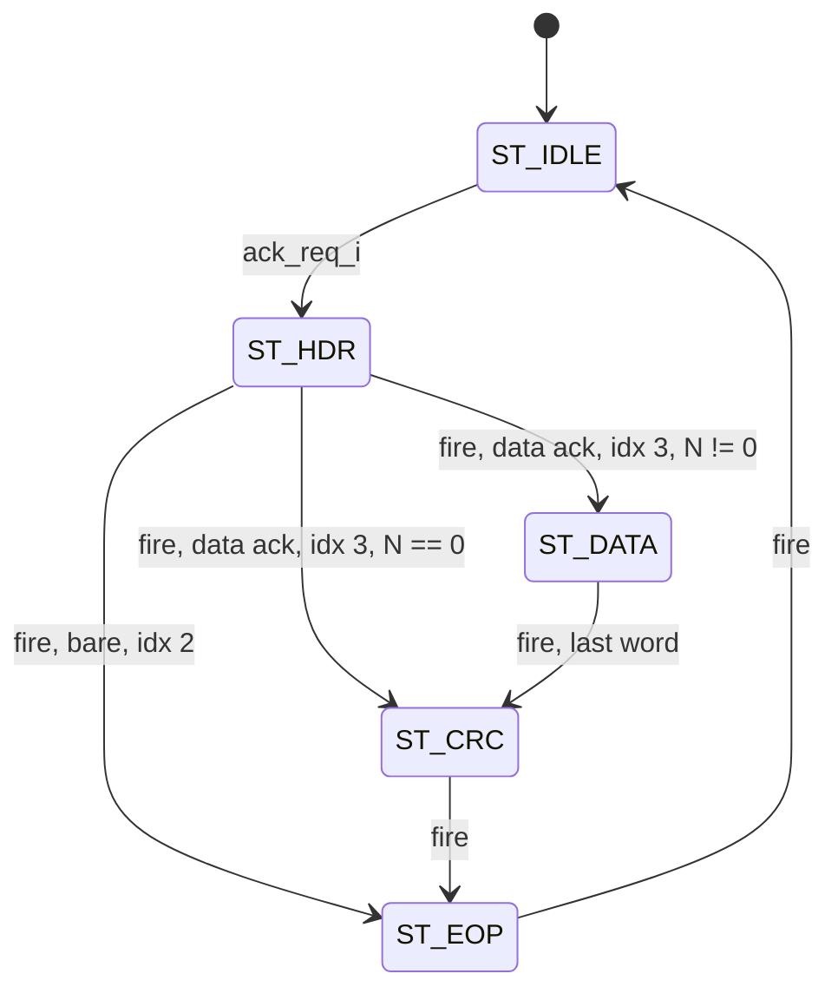

# cxp_tx_ctrl_ack

Inputs chosen from the tree: RTL `src/rtl/tx/cxp_tx_ctrl_ack.sv` (+ `cxp_tx_pkt_framer.sv`, `cxp_lib_crc32.sv`, `cxp_pkg.sv`, `cxp_util_pkg.sv`); unit TB `src/tb_unit/tx/cxp_tx_ctrl_ack/`; integration TBs `src/tb_unit/top/cxp_interface_top/`, `src/tb_unit/top/cxp_device_top/`; SVA `src/sva/cxp_sva.sv`; spec JIIA CXP-001-2015 v1.1.1 (`docs/spec/CXP-001-2015.pdf`) §8.2.1, §8.2.2.2, §8.2.4, §8.6.1.1, §8.6.3 Table 22, §8.6.4, §10.3.28; regression `make -C src/tb_unit`; output `docs/design/modules/tx/cxp_tx_ctrl_ack.md`.

Frames one type-0x03 control acknowledgment per request and streams it as 32-bit beats under valid/ready. Codes 0x00 and 0x04 give a data ack; every other code gives an immediate ack.

| Beat | Immediate ack (code ∉ {0x00, 0x04}) | Data ack (0x00 read-OK, 0x04 Wait) |
|---|---|---|
| 0 | 4×K27.7, kmask 0xF, sop | same |
| 1 | 4×0x03 | same |
| 2 | 4×Code | same |
| 3 | 4×K29.7, kmask 0xF, eop | Size = B, one big-endian word (B = 4 for 0x04) |
| 4 … N+3 | — | `bswap32(rbuf_data_i)`, or `bswap32(ack_wait_ms_i)` with N = 1 for 0x04; the 4N − B pad bytes of the last word are 0 |
| N+4 | — | `crc_wire(crc_o)` = the register, CRC over beats 2 … N+3 |
| N+5 | — | 4×K29.7, kmask 0xF, eop |

A data ack is N+6 words with N = ceil(B/4), as Table 22 defines.

Source `src/rtl/tx/cxp_tx_ctrl_ack.sv`. The module owns the ack fields (code, N, Size, Wait word), the choice of shape and the read-buffer address. SOP, header replication, data sequencing, CRC and EOP come from a `cxp_tx_pkt_framer` instance `cxp_tx_pkt_framer_i` (`p_HDR_WORDS` = 4, `p_HAS_CRC` = 1, `p_CRC_FROM` = 2), which also holds the FSM; see `cxp_tx_pkt_framer.md`.

It is instantiated once, as `cxp_interface_top.cxp_tx_ctrl_ack_i` with `p_BUF_DEPTH = p_CTRL_BUF_DEPTH` (64). Inputs there: `ack_req = rsp_valid_tx`, `ack_code = rsp_tx.code`, `ack_size = rsp_tx.size`, `ack_wait_ms = rsp_tx.wait_ms`. `ack_rbank = rsp_tx.rbank`. `rsp_tx` is the `cxp_ctrl_plane` response (`cxp_ctrl_rsp_t`), held by the executor `cxp_ctrl_bus_master` until taken: wired straight through with `rsp_ready = ~ack_busy` when `p_ASYNC_CLOCKS` = 0, or carried by `cxp_cdc_req` with `dst_ready = ~ack_busy` when `p_ASYNC_CLOCKS` = 1. Either way a response waits until this module is idle and is taken exactly once. `rbuf_*` connects to the two-bank read buffer in `cxp_ctrl_bus_master` (inside `cxp_ctrl_plane`), whose read port runs on `tx_clk` in the asynchronous build. The output drives port `TX_PORT_ACK` (0, the highest of the three long-packet ports) of `cxp_tx_arbiter`, whose chosen word goes through `cxp_tx_inserter` to the wire. The end of a ConnectionReset window sends no acknowledgment.

Spec clauses: §8.6.3 / Table 22 (ack shapes, code set), §8.2.1 (P0 first, big-endian multi-byte values), §8.2.2.2 (CRC span, seed, output order), §8.2.4 (the packet is free to be ordered against other long packets; trigger packets and their acknowledgments are inserted into it).

## Interface

| Name | Default | Meaning |
|---|---|---|
| `p_BUF_DEPTH` | 64 | Words per read-buffer bank; `rbuf_addr_o` is `$clog2(p_BUF_DEPTH)` + 1 bits (bank bit on top). A power of two ≥ 2, checked at elaboration (`g_chk_buf_depth`), as the executor's banks need. Largest reply N = `p_BUF_DEPTH`. That limit is enforced upstream (`cxp_ctrl_cmd_parser` rejects larger N), not here. Unit TB uses 16. |

| Name | Dir | Width | Description |
|---|---|---|---|
| `tx_clk` | in | 1 | Clock for all logic, including the framer and its CRC |
| `tx_rst_n` | in | 1 | Active-low. Asserts asynchronously; the caller synchronises deassertion |
| `ack_req_i` | in | 1 | Request. Taken only while `ack_busy_o` = 0 (`start`); otherwise dropped, not queued |
| `ack_code_i` | in | 8 | Ack code, latched with the request; selects the packet shape |
| `ack_size_i` | in | 24 | Size B in bytes for code 0x00 (the command's Size); N = ceil(B/4). Forced to 4 for 0x04; unused for immediate acks |
| `ack_wait_ms_i` | in | 32 | Reply word for 0x04, latched with the request. No 100–10000 ms range check |
| `ack_rbank_i` | in | 1 | Read-buffer bank holding the data (`rsp_o.rbank`), latched with the request and held for the whole packet |
| `ack_busy_o` | out | 1 | Framer `busy_o` (framer `state_q != ST_IDLE`) |
| `rbuf_addr_o` | out | `$clog2(p_BUF_DEPTH)` + 1 | `{rbank_q, word}`. Word 0 outside the data phase; in it `data_idx + 1` if `m_ready_i`, else `data_idx` (framer `data_idx_o`) |
| `rbuf_data_i` | in | 32 | Read-buffer data, expected 1 cycle after the address |
| `m_o.data` | out | 32 | Beat; P0 = `[7:0]` |
| `m_o.kmask` | out | 4 | 0xF on the SOP and EOP beats, otherwise 0 |
| `m_o.valid` | out | 1 | 1 whenever the framer is not idle (`pl_valid_i` is tied to 1) |
| `m_o.sop` | out | 1 | Framer `ST_HDR` with `hdr_idx_q = 0` |
| `m_o.eop` | out | 1 | Framer `ST_EOP` |
| `m_ready_i` | in | 1 | The beat is accepted (`out_fire`) when `m_o.valid & m_ready_i` |

Notes:
- **Reset:** asynchronous assert. Forces the framer to `ST_IDLE`, clears all latches and indices, and resets the CRC register.
- **Clocks:** one domain, `tx_clk`. In the top, `ack_req_i`, `ack_code_i`, `ack_size_i` and `rbuf_data_i` originate on `rx_clk`. With `p_ASYNC_CLOCKS` = 1 the response crosses through `cxp_cdc_req` (held until this module is idle) and the read buffer is read on `tx_clk`, so the crossing is safe; `src/tb_unit/top/cxp_device_top` runs it with unrelated 10 / 8 / 12 ns clocks. With the default `p_ASYNC_CLOCKS` = 0 there is no synchroniser and `rx_clk` must equal `tx_clk`.
- **Output timing:** outputs are combinational from registers. In the data phase, `m_o.data` is `bswap32(rbuf_data_i)` with no register, and `rbuf_addr_o` depends combinationally on `m_ready_i`. There is no path from `m_ready_i` to `m_o.valid` or `m_o.data`.
- **Stall:** `m_ready_i = 0` holds every output. In the data phase the address stays on the in-flight word, so `rbuf_data_i` stays stable.
- **Port comments vs code:** `ack_req_i` "1-cycle pulse" — a held level restarts a packet after every EOP, and in the asynchronous build `ack_req_i` is a level held until taken. `ack_size_i` "0 for non-read" — not enforced. `tx_rst_n` "sync-deassert" — omits the asynchronous assert (Minor 1).

## How it works

1. **Latch** (`start = !ack_busy_o & ack_req_i`): `code_q`, `rbank_q`; `nwords_q`/`size_bytes_q` = 1/4 for 0x04, else ceil(B/4)/B; `wait_word_q`. `is_bare = code_q ∉ {0x00, 0x04}`. The framer sees `start_i = ack_req_i` and starts on the same edge.
2. **Header:** `hdr` is `rep4(0x03)`, `rep4(code)` and the raw Size word `bswap32(B)` for header words 1–3. The framer sends words 0 … `hdr_last_i`, with `hdr_last_i` = 2 for an immediate ack and 3 for a data ack.
3. **Data:** `has_body_i = !is_bare`, `n_words_i = nwords_q`, `skip_empty_i = 1` (so N = 0 goes from the header straight to the CRC), `pl_valid_i = 1`, `pl_eop_i = 0`. The data word is `bswap32(is_wait ? wait_word_q : rbuf_data_i)` with the pad bytes of the last word zeroed when B is not a multiple of 4 (`wire_word`).
4. **Read-buffer prefetch**: in the data phase the word address is one ahead of the word on the bus when the arbiter accepts it, so the 1-cycle buffer has the next word ready. The bank bit is `rbank_q` throughout, so the executor can fill the other bank with the next read while this packet is sent.
5. **CRC:** inside the framer. For data acks only, it folds header words 2–3 (Code, Size) and every data beat on `out_fire`; the CRC beat is `crc_wire(crc_o)` from `cxp_pkg`, the register itself.
6. **FSM:** the framer's `cxp_tx_pkt_framer_i.state_q`, 5 states in a 3-bit enum. A started packet always runs to its EOP; nothing outside can drop it. The rows below are the framer rows with this module's connections substituted.

| State | Next | Condition |
|---|---|---|
| `ST_IDLE` | `ST_HDR` | `ack_req_i` |
| `ST_HDR` | `ST_EOP` | `out_fire & is_bare & hdr_idx_q == 2` |
| `ST_HDR` | `ST_DATA` | `out_fire & !is_bare & hdr_idx_q == 3 & nwords_q != 0` |
| `ST_HDR` | `ST_CRC` | `out_fire & !is_bare & hdr_idx_q == 3 & nwords_q == 0` |
| `ST_DATA` | `ST_CRC` | `out_fire & data_left_q == 1` (the N-th word) |
| `ST_CRC` | `ST_EOP` | `out_fire` |
| `ST_EOP` | `ST_IDLE` | `out_fire` |



Same-cycle rules:
- A request while `ack_busy_o` = 1 is dropped, including in the cycle the EOP beat is accepted.
- The CRC seed (start edge) and the CRC fold (`ST_HDR`/`ST_DATA`) are exclusive by state.
- A data-phase fire folds the CRC, increments the framer's `data_idx_q` and moves `rbuf_addr_o` in the same cycle.

Latency and throughput:
- Request cycle → SOP cycle: 1.
- Packet length: 4 beats (immediate), N+6 (data), 7 (Wait). With `m_ready_i = 1`, `ack_busy_o` is high for exactly that many cycles.
- At least 1 idle cycle between packets, so the peak is 4/5 or (N+6)/(N+7) beats per cycle.
- Nothing wraps: `data_idx_q`/`nwords_q` are 16 bits, and Size ≤ 262140 fits in 24 bits.

Invariants: the bound `cxp_framer_sva` asserts that SOP/EOP only appear on valid beats, that no SOP appears inside a packet, and that header, CRC and EOP beats hold while not accepted. In `cxp_interface_top`, `cxp_tx_owner_sva` asserts that the port owning the arbiter offers a word in every cycle; this module meets it because `m_o.valid` is 1 from SOP to EOP (`pl_valid_i` = 1, and the read buffer is complete before the request, with the next word prefetched). Not asserted: `m_o.valid == ack_busy_o`; `m_o.sop` implies kmask 0xF and 4×K27.7; data beats hold while not accepted (the data phase is exempt in the bound checker).

## Arbiter integration

- **Priority:** `cxp_tx_arbiter` chooses between the three long-packet ports, index = priority: ack (0) > connection test (1) > stream (2). Between packets it offers the SOP of the highest port that has one; once that SOP is taken the port owns the arbiter until its EOP is taken. TestMode does not reach the arbiter, so it never holds this port off (§8.7.4 allows control packets during the test).
- **Handshake:** `ready_o[TX_PORT_ACK]` is the inserter's `long_ready_o` while this port owns the arbiter: combinational from the offered word's valid, the inserter's two-word state, the trigger and I/O-ack requests and its IDLE run counter, with no skid. So `rbuf_addr_o` is combinational from those inputs, and the path ends at the read-buffer RAM address (on `tx_clk` in the asynchronous build).
- **Waiting for a grant:** a connection-test or stream packet already in flight delays the ack SOP until its EOP. The longest wait is a 1027-word test packet plus the IDLE words and short packets inserted into it, far below the 200 ms of §8.6.1.1.
- **Insertion into the ack (`cxp_tx_inserter`):** a trigger packet (while the run since the last IDLE is ≤ 97) or an I/O acknowledgment (run ≤ 95) is inserted at the next word boundary, and an IDLE word once the run reaches `IDLE_SOFT_RUN` (95). This module sees `m_ready_i` = 0 for those cycles (2 per two-word packet, 1 per IDLE) and resumes with the held word (§8.2.4). It inserts nothing itself.
- **No drop:** there is no watchdog and no abort; a started ack always reaches its EOP. `cxp_tx_owner_sva` checks the contract that makes this safe (a word every cycle while owning).
- **No request loss:** in both builds the response is held upstream until `ack_busy_o` is low, so a response that arrives while a packet is in flight (including one waiting for a grant) waits for it.

## Verification

Tools: Verilator 5.046 with cocotb 2.0.1. The bound SVA of `src/sva/cxp_sva.sv` (`cxp_framer_sva` on the framer; in the tops also `cxp_arbiter_sva`, `cxp_inserter_sva`, `cxp_tx_owner_sva` and `cxp_idle_rule_sva`) runs in every bench with `--assert`. FSM coverage: the unit TB registers the framer's `cxp_tx_ctrl_ack_i.cxp_tx_pkt_framer_i.state_q`: 5/5 states and 7/7 arcs (2026-09-26 run).

### Unit TB — `src/tb_unit/tx/cxp_tx_ctrl_ack/test_cxp_tx_ctrl_ack.py`

- **Wrapper and bring-up:** `tb_cxp_tx_ctrl_ack_top` sets `p_BUF_DEPTH = 16` and exposes unsuffixed port names; `rbuf_addr_o` is split into `rbuf_bank` and `rbuf_addr`, and `ack_rbank` is driven (0 unless a test sets it). The 8 ns clock starts low. Bring-up zeroes the inputs (`m_ready = 0`), holds reset for 6 edges, waits 2 more, then starts `rbuf_model`: a 1-cycle-latency buffer that returns 0 at or beyond `len(rbuf)`.
- **Helpers:**
  - `issue_ack`: 1-cycle request, then zeroes code/N/wait.
  - `capture_packet`: drives `m_ready` each cycle and records the accepted beats up to the first EOP, then drives `m_ready = 0` for 1 cycle (200-cycle timeout).
  - `check_packet`: compares length and per-beat data/kmask/sop/eop with `expected_packet`.
- **Golden model:** `expected_packet` is the golden `cxp_protocol` codec in its specification profile (Table 22, §8.2.2.2).

| Test | Stimulus | Expect |
|---|---|---|
| test_01_write_ok_no_data | 0x01, N = 0 | 4-beat immediate ack |
| test_02_read_ok_with_data | 0x00, N = 4, fixed rbuf | 10 beats, BE data, golden CRC |
| test_03_reset_done | 0x03, N = 0 | 4 beats |
| test_04_logical_err | 0x40/0x43/0x45/0x46/0x47, fresh bring-up each | 4 beats, code word |
| test_05_wait_ack | 0x04, Size arg 0, wait 100/5000/10000 ms | 7 beats, Size 4, data = `bswap32(wait)` |
| test_06_crc_err_code | 0x80, N = 0 | 4 beats |
| test_07_size_field_encoding | 0x00, N = 0/1/5/8/16 back-to-back | N+6 beats, Size word = 4N |
| test_08_crc32_random | 0x00, N = 0/1/2/7/12, random rbuf | golden CRC |
| test_09_eop_kmask_alignment | 0x00, N = 2 | one EOP beat, 4×K29.7/0xF; body kmask 0 |
| test_10_sop_kmask_alignment | 0x00, N = 1 | one SOP beat, 4×K27.7/0xF, not EOP |
| test_11_backpressure | 0x00, N = 8, `m_ready` 40 % low | packet unchanged |
| test_12_ack_busy | 0x00, N = 3, SOP held 5 cycles | busy 1 after req, 0 after EOP |
| test_13_overlapping_req | 0x00, N = 4; 2nd req mid-packet | 2nd req dropped; later req works |
| test_14_back_to_back | 0x00 N = 3, then 0x00 N = 2 | both packets exact |
| test_15_read_b3 | 0x00, B = 3 | 7 beats, Size 3, data lanes 11 22 33 00 |
| test_16_read_bank | 0x00, N = 4 with `ack_rbank` 1 (dropped to 0 after the request); then bank 0 | first packet carries bank 1's words, `rbuf_bank` 1 throughout; second carries bank 0's |

#### test_01_write_ok_no_data
- *Stimulus*: empty rbuf. 1-cycle request (0x01, N = 0) with `m_ready = 0`; `m_ready = 1` from the next cycle through the EOP, then 0.
- *Checks*: `check_packet` (4-beat model); `len(got) == 4`.
- *Proves*: `ST_IDLE → ST_HDR → ST_EOP` (the `has_body_i = 0` exit at `hdr_last_i = 2`), 1-cycle request→SOP latency, and no Size/CRC on immediate acks.

```wavedrom
{"signal":[
  {"name":"tx_clk","wave":"p....."},
  {"name":"ack_req","wave":"10...."},
  {"name":"m_ready","wave":"01...0"},
  {"name":"framer state_q","wave":"======","data":["IDLE","HDR0","HDR1","HDR2","EOP","IDLE"]},
  {"name":"ack_busy","wave":"01...0"},
  {"name":"m_data","wave":"x====x","data":["4×FB","4×03","4×01","4×FD"]},
  {"name":"m_sop","wave":"010..."},
  {"name":"m_eop","wave":"0...10","node":"....a."}
]}
```
`a`: last beat accepted; `check_packet` runs.

#### test_02_read_ok_with_data
- *Stimulus*: rbuf = DEADBEEF, CAFEF00D, 0BADC0DE, 12345678; request 0x00, N = 4; `m_ready = 1` throughout.
- *Checks*: `check_packet` (12 beats).
- *Proves*: `ST_HDR → ST_DATA → ST_CRC → ST_EOP`; the `rbuf_addr_o` prefetch (0 outside the data phase, `data_idx + 1` on accept) against a 1-cycle buffer; `bswap32` on data; Size = 0x10; CRC over beats 2–9.

```wavedrom
{"signal":[
  {"name":"tx_clk","wave":"p..|......."},
  {"name":"ack_req","wave":"10.|......."},
  {"name":"m_ready","wave":"01.|......."},
  {"name":"framer state_q","wave":"===|=======","data":["IDLE","HDR0","HDR1-4","HDR5","DATA0","DATA1","DATA2","DATA3","CRC","EOP"]},
  {"name":"rbuf_addr","wave":"=..|.=====.","data":["0","1","2","3","4","0"]},
  {"name":"rbuf_data","wave":"==.|..=====","data":["0","DEADBEEF","CAFEF00D","0BADC0DE","12345678","0","DEADBEEF"]},
  {"name":"m_data","wave":"x==|=======","data":["4×FB","03,00,00,00","4×10","EFBEADDE","0DF0FECA","DEC0AD0B","78563412","7A0C9280","4×FD"]},
  {"name":"m_eop","wave":"000|......1","node":"..........a"}
]}
```

#### test_03_reset_done
- *Stimulus*: 0x03, N = 0, driven as in test_01_write_ok_no_data.
- *Checks*: `check_packet` (4 beats).
- *Proves*: 0x03 takes the immediate shape (Table 22).

#### test_04_logical_err
- *Stimulus*: for each of 0x40, 0x43, 0x45, 0x46, 0x47: full bring-up, 1-cycle request with N = 0, capture. 0x41, 0x42 and 0x44 are not driven.
- *Checks*: `check_packet` (4 beats); beat 2 = 4×code.
- *Proves*: `is_bare` for the 0x40 class; the code byte passes through unmodified.

#### test_05_wait_ack
- *Stimulus*: for `wait_ms` = 100, 5000, 10000: fresh bring-up, then request 0x04 with `ack_word_count = 0`. Inputs are zeroed after the request cycle.
- *Checks*: `check_packet` (9-beat model, N = 1); beat 2 = 4×0x04; beat 5 = 4×0x04 (Size 4); beat 6 = `bswap32(wait_ms)`.
- *Proves*: the `ACK_WAIT` latch branch — `nwords_q` is forced to 1 against an input of 0, which would otherwise take `ST_HDR → ST_CRC` through `skip_empty_i`. Also that the data mux selects the latched `wait_word_q`.

#### test_06_crc_err_code
- *Stimulus*: 0x80, N = 0.
- *Checks*: `check_packet` (4 beats).
- *Proves*: the physical-error code is framed as an immediate ack.

#### test_07_size_field_encoding
- *Stimulus*: rbuf = A0000000 … A000000F (16 words = wrapper depth). Requests 0x00 with N = 0, 1, 5, 8, 16, with no reset between them and 4 idle cycles after each capture.
- *Checks*: for each N, `check_packet`, and beats 3/4/5 = `rep4` of the Size bytes (4N).
- *Proves*: `ST_HDR → ST_CRC` (N = 0: CRC over code/Size only) and `ST_HDR → ST_DATA`. At N = `p_BUF_DEPTH`, the last prefetch wraps 16 → 0 and is discarded. The CRC is reseeded between packets.

#### test_08_crc32_random
- *Stimulus*: 16 random words (seed 0xDEADBEEF); requests 0x00 with N = 0, 1, 2, 7, 12, 3 idle cycles apart.
- *Checks*: `check_packet` per trial.
- *Proves*: the fold schedule (Code + Size + N data words on `out_fire`) and the per-packet reseed against the golden §8.2.2.2 CRC.

#### test_09_eop_kmask_alignment
- *Stimulus*: rbuf of 2 words; request 0x00, N = 2; `m_ready = 1`.
- *Checks*: exactly 1 EOP beat; it is 4×K29.7 with kmask 0xF; every beat with `sop = eop = 0` has kmask 0.
- *Proves*: kmask 0xF only in `ST_EOP` and at `hdr_idx_q = 0`.

#### test_10_sop_kmask_alignment
- *Stimulus*: rbuf of 1 word; request 0x00, N = 1.
- *Checks*: exactly 1 SOP beat; it is 4×K27.7 with kmask 0xF and `eop = 0`.
- *Proves*: `m_o.sop = ST_HDR & hdr_idx_q == 0`.

#### test_11_backpressure
- *Stimulus*: 8 random words (seed 0xC0DEC0DE); request 0x00, N = 8. `m_ready` is 0 with p = 0.4 per cycle (seed 0x55AA), 400-cycle window. In the 2026-09-14 run the stalls hit HDR idx 1 and 3, DATA idx 6, CRC, and EOP (2 cycles); none hit the SOP beat.
- *Checks*: `check_packet` (16 beats).
- *Proves*: outputs hold under `m_ready_i = 0`. A data-phase stall keeps `rbuf_addr_o = data_idx`, so `rbuf_data_i` keeps the in-flight word. Index and CRC advance only on `out_fire`.

```wavedrom
{"signal":[
  {"name":"tx_clk","wave":"p........."},
  {"name":"m_ready","wave":"101.010.10"},
  {"name":"framer state_q","wave":"=...=.=..=","data":["DATA","CRC","EOP","IDLE"]},
  {"name":"data_idx_q","wave":"==.==.....","data":["5","6","7","8"]},
  {"name":"rbuf_addr","wave":"=.===.....","data":["6","7","8","0"]},
  {"name":"m_data","wave":"==.==.=..x","data":["CE9A08B2","B08EAFF7","E9BE54F9","1E420840","4×FD"],"node":"..a.....b."}
]}
```
`a`: the held word is accepted after the stall. `b`: EOP accepted; `check_packet` runs.

#### test_12_ack_busy
- *Stimulus*: rbuf of 3 words. Request 0x00, N = 3, with `m_ready = 0`; the SOP beat is held for 5 cycles, then `m_ready = 1` until the EOP, then 0.
- *Checks* (all in `ReadOnly`): busy = 0 in idle; busy = 1 in the cycle after the request; busy = 1 on 5 more parked cycles; the EOP is captured; busy = 0 in the cycle after the EOP; `check_packet` (11 beats).
- *Proves*: `ack_busy_o` = framer `busy_o` at both ends, and that a stall on the SOP beat holds. Busy is not sampled in `ST_DATA`/`ST_CRC`/`ST_EOP`.

```wavedrom
{"signal":[
  {"name":"tx_clk","wave":"p.|..|.."},
  {"name":"ack_req","wave":"10|..|.."},
  {"name":"m_ready","wave":"0.|1.|.0"},
  {"name":"framer state_q","wave":"==|.=|==","data":["IDLE","HDR0","HDR1..CRC","EOP","IDLE"]},
  {"name":"ack_busy","wave":"01|..|.0","node":".a.....b"},
  {"name":"m_sop","wave":"01|.0|.."}
]}
```
`a`: busy = 1 right after the request (the 5 parked checks fall in the gap). `b`: busy = 0 after the EOP.

#### test_13_overlapping_req
- *Stimulus*: rbuf of 4 words; request 0x00, N = 4, `m_ready = 1`. After the 4th accepted beat (`ST_HDR`, `hdr_idx_q = 4`), `ack_req = 1` for 1 cycle with code 0x01, N = 0; `ack_code` stays 0x01 afterwards. After the EOP, 4 idle cycles, then a fresh 0x01 request.
- *Checks*: `check_packet` for packet 1 (12 beats); EOP count = 1 (cannot fail, because the capture stops at the first EOP); `ack_busy = 0` after the 4 idle cycles; `check_packet` for the fresh 4-beat ack.
- *Proves*: the `start = !ack_busy_o & ack_req_i` gate (and the framer's `ST_IDLE`-only start). A request while busy is dropped, not queued, and leaves `code_q`/`nwords_q` untouched.

```wavedrom
{"signal":[
  {"name":"tx_clk","wave":"p..|...|..."},
  {"name":"ack_req","wave":"10.|10.|..."},
  {"name":"m_ready","wave":"01.|...|..."},
  {"name":"framer state_q","wave":"===|===|===","data":["IDLE","HDR0","HDR1-3","HDR4","HDR5","DATA0-3","CRC","EOP","IDLE"],"node":"....a....b."},
  {"name":"ack_busy","wave":"01.|...|..0"},
  {"name":"m_eop","wave":"0..|...|.10"}
]}
```
`a`: the second request is sampled in `HDR4` and ignored. `b`: the only EOP.

#### test_14_back_to_back
- *Stimulus*: request 0x00, N = 3 from rbuf[0..2]. After 5 idle cycles (including the request cycle), request 0x00, N = 2, with rbuf[0..1] overwritten to BBBB0001/BBBB0002 right after the request edge.
- *Checks*: `check_packet` #1 (11 beats); `ack_busy = 0` before the 2nd request; `check_packet` #2 (10 beats).
- *Proves*: `ST_EOP → ST_IDLE → ST_HDR`, the per-packet clear of both indices, and the CRC reseed. The 1-cycle minimum gap is not exercised.

#### test_16_read_bank
- *Stimulus*: a bank-aware buffer model (bank 0 = A0000000…A0000003, bank 1 = B0000000…B0000003). Request 0x00, N = 4 with `ack_rbank` = 1; `ack_rbank` returns to 0 the cycle after the request. Then the same request with bank 0.
- *Checks*: `check_packet` against the golden model: the first packet carries bank 1's words and `rbuf_bank` is 1 on every busy cycle; the second carries bank 0's.
- *Proves*: `rbank_q` is latched at `start` and addresses every data word of its packet, whatever the input does meanwhile — the property the executor relies on when it fills the other bank with the next read.

### Integration TB — `src/tb_unit/top/cxp_interface_top/test_cxp_interface_top.py`

17 tests on the real `cxp_tx_ctrl_ack` inside `cxp_interface_top` (`p_ASYNC_CLOCKS` = 0). All clocks are tied to one 10 ns `clk`, with the real bootstrap regfile behind an APB bridge.

The uplink `rx_serial` is held idle, so no command reaches the control plane and this module sends nothing in these tests; every read, Wait and error ack is exercised in `cxp_device_top` and the unit TB instead. The two link-reset tests check that the ConnectionReset window requests no ack.

| Test | Checks |
|---|---|
| test_03_link_reset_no_ack | 400 wire words after `link_reset_req` are all IDLE |
| test_17_link_reset_done_no_ack | `link_reset_done` within 64 cycles; the wire stays IDLE through 200 words after it |

No test in this bench has the real module mid-packet.

### Integration TB — `src/tb_unit/top/cxp_device_top/test_cxp_device_top.py`

32 tests on `cxp_device_top` built with `p_ASYNC_CLOCKS` = 1 (rx 10 ns, tx 8 ns, app 12 ns); the ones below reach this module most directly. A host model (`src/verif/common/cxp_host.py`) sends commands on the serial uplink and decodes every ack with the golden `cxp_protocol` codecs in the device's wire format (`cxp_protocol.DEVICE`, which switches on the `ack_size_replicated` quirk). Every data-ack CRC is checked.

| Test | What reaches this module |
|---|---|
| test_02_discovery | Four 1-word reads and one 8-word read (DeviceVendorName): data acks with N = 1 and 8, through the clock crossing and the `tx_clk` read port |
| test_03_registers | Three writes (immediate 0x01 acks) and four reads |
| test_05_connection_reset | The ConnectionReset write ack and nothing more when the window ends |
| test_06_test_mode | Write acks for TestMode 1 and 0 (the second one interleaved with connection-test packets), then a 2-word read of TestPacketCountTx |
| test_12_idle_cadence_per_packet_type | 20 back-to-back largest reads while the device trigger pin toggles: trigger packets inserted into data acks at word boundaries, every leader followed by its Delay word, no run over 99 words |
| test_13_pipelined_cmds | A read right behind a read: two data acks, each with its own words (the second read fills the other bank while the first ack is framed) |
| test_24_ctrl_wait_ack | Wait acks (long form, one word, 100 … 10 000 ms) on the wire within 200 ms, then the final data ack or 0x40 |
| test_25_ctrl_reset_during_exec | 0x03 acks after a Wait and behind a data ack waiting to be framed; nothing stray after them |
| test_28_testmode_vs_stream | TestMode written while stream and test packets run: each write acknowledged once with 0x01 and nothing more |

These are the in-tree end-to-end serial read → wire checks, decoded with the Table 22 codec.

### Other

- **`src/tb_unit/tx/cxp_tx_arbiter`** — `cxp_tx_arbiter` followed by `cxp_tx_inserter`, with a Python `SourceDriver` stand-in on the ack slot, not this module: `test_02_ack_packet_passthrough`, `test_04_priority_ack_over_stream`, `test_05_priority_trig_over_ack`, `test_07_trig_preempts_mid_ack`, `test_15_priority_ioack_over_ack`, `test_17_ioack_inserted_mid_ack` (the I/O acknowledgment on the wire within 3 words of being offered, the ack resumed around it), `test_09_idle_cadence_midpacket`, `test_10_source_stall_idle_fill`, `test_14_random_mixed`.
- **`src/tb_unit/ctrl/cxp_ctrl_bus_master`** — the held response that drives `ack_req_i`/`ack_code_i`/`ack_rbank_i` (0x00 with its bank, 0x01, 0x03, 0x04 Wait, 0x40, the parser's codes) and the two-bank `rbuf` read port.
- **`src/tb_unit/ctrl/cxp_ctrl_plane`** — the same responses behind the real parser, read-buffer data read in the response's bank.
- **`src/tb_unit/rx/cxp_rx_link`** — checks `rsp_code` and `rbuf` after serial commands; does not instantiate this module.
- **`cxp_protocol`** (`cxp_protocol/packets.py`, `quirks.py`) — spec-written ack codec; the RTL's deviations are the named `DEVICE` quirks. `src/emu/cxp/protocol/packets.py` uses it.
- **`src/verif/`** — instantiates this module as part of the full top with its own PyUVM codecs; not run.

### Running

```
make -C src/tb_unit/tx/cxp_tx_ctrl_ack                                        # unit TB, Verilator
make -C src/tb_unit/tx/cxp_tx_ctrl_ack COCOTB_TEST_FILTER=test_11_backpressure   # one test
make -C src/tb_unit/top/cxp_interface_top                                      # integration TB
make -C src/tb_unit/top/cxp_device_top                                         # device TB, unrelated clocks
make -C src/tb_unit                                                        # full regression + report
```

2026-09-26, commit `7a267e2`, Verilator 5.046: `cxp_tx_ctrl_ack` 16/16 pass, FSM coverage 5/5 states, 7/7 arcs. The integration benches and the full regression were not re-run for this page. If you change `WAVES`, run `make clean` first, because the sim_build directory goes stale.

### Not covered in-tree

- **Reset mid-packet:** untested; outputs drop in the same cycle. No item, because the only instance shares `tx_rst_n` with the arbiter.
- **`ack_req_i` high at reset release:** untested. No item, because every in-tree source is a reset-low register.
- **`ack_req_i` held as a level:** untested at unit level. It currently restarts a packet after every EOP plus 1 idle cycle; the asynchronous build relies on the level being taken once (`cxp_cdc_req` drops it on the start edge) → Medium 1, Minor 1.
- **Minimum 1-cycle gap, and a request in the EOP-accept cycle:** untested at unit level (in the tops the request is held upstream until `ack_busy_o` is low) → Medium 1.
- **N > `p_BUF_DEPTH`:** untested; the address wraps. No item, because `cxp_ctrl_cmd_parser` rejects it. N = `p_BUF_DEPTH` is covered.
- **Indefinite `m_ready_i = 0`:** holds forever with no timeout, by design.
- **Insertion into the real module:** triggers inside data acks are exercised end to end by `cxp_device_top` test_12_idle_cadence_per_packet_type (leader/Delay contiguity and IDLE run only; the ack contents are decoded by the host model); an I/O acknowledgment inside an ack only with the stand-in → Medium 1.
- **`rx_clk ≠ tx_clk` with `p_ASYNC_CLOCKS` = 0:** unsupported by design; the asynchronous build is covered by `cxp_device_top`.
- **Wait (0x04) through the top:** covered on the wire by `cxp_device_top` test_24 (and test_25), with the Wait's Size, data word and CRC decoded by the golden codec.
- **Read of B bytes with B not a multiple of 4:** unit test_15 only (B = 3); no end-to-end read with B % 4 ≠ 0.
- **Reserved codes (e.g. 0x02, 0x05, 0xFF):** untested; currently framed as immediate acks; intent undecided → Open question 2.
- **X on `rbuf_data_i`:** would poison the CRC until the next request. No item, because `cxp_ctrl_bus_master` writes `rbuf` only with the data of a completed read and the ack sends only the words that read wrote.

## Known issues and recommendations

### Critical

None.

### Medium

1. **Missing tests:** the 1-cycle gap and a request in the EOP-accept cycle; `ack_req_i` held as a level; an I/O acknowledgment inserted into a real data ack at integration, with the ack decoded around it. *Effort:* 0.5 day.

### Minor

1. **Comments:** the "§8.3" big-endian citations in the header and at the data mux use v1.0 numbering (the v1.1.1 rule is §8.2.1). The header still says the bundle goes from `cxp_tx_arbiter` "into the 8B/10B encoder"; it now passes `cxp_tx_inserter` first. Also fix the port comments listed under Interface. *Effort:* 15 min.
2. **SVA to add:** `m_o.valid == ack_busy_o`; data beats stable while `m_o.valid & !m_ready_i` (the bound framer checker exempts the data phase); a cover on `ack_req_i & ack_busy_o`; `ack_busy_o` reaches `m_o.eop` within N+8 accepted beats. *Effort:* 1 h.
3. **Unit-TB hygiene:** test_04_logical_err and test_05_wait_ack call `bringup()` in a loop, which starts an extra `Clock` and `rbuf_model` per iteration (the VCD shows one 12 ns clock cycle at each re-bring-up). The EOP-count check in test_13_overlapping_req is vacuous. *Effort:* 1 h.

### Open questions

1. **Spec owner:** Table 22 gives no per-character layout for the Size word. Is it B as a 32-bit big-endian value (P0 = MSB, §8.2.1)?
2. **Designer:** reserved codes (0x02, 0x05–0x3F, 0x48–0x7F, 0x81–0xFF) are framed as immediate acks. Should the framer reject them or map them (e.g. to 0x47)?
