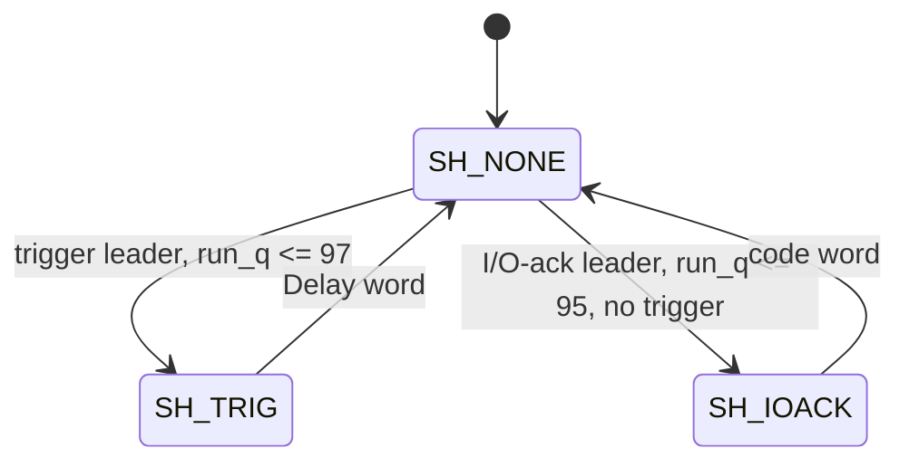

# cxp_tx_inserter

Inputs chosen from the tree: RTL `src/rtl/tx/cxp_tx_inserter.sv` (+ `cxp_pkg.sv` for `cxp_txw_t`, `IDLE_MAX_INTERVAL`, `IDLE_SOFT_RUN`, `IDLE_WORD`, `KMASK_IDLE`); its sources `src/rtl/tx/cxp_tx_arbiter.sv`, `src/rtl/tx/cxp_tx_trigger_hs.sv`, `src/rtl/tx/cxp_tx_io_ack.sv` (both through `cxp_tx_short_pkt.sv`); wiring in `src/rtl/top/cxp_interface_top.sv`; bound SVA `src/sva/cxp_sva.sv` (`cxp_inserter_sva`, `cxp_idle_rule_sva`); scheduler TB `src/tb_unit/tx/cxp_tx_arbiter/` (wrapper `tb_cxp_tx_arbiter_top.sv`); integration TBs `src/tb_unit/top/cxp_interface_top/`, `src/tb_unit/top/cxp_device_top/`; spec JIIA CXP-001-2015 v1.1.1 §8.2.4 / Table 13, §8.2.5 / Table 14, §8.2.5.1, §8.2.5.2, §8.3.2 / Table 16, §8.3.3 / Table 17; output `docs/design/modules/tx/cxp_tx_inserter.md`.

Puts one 32-bit word per `tx_clk` on the device's high-speed downlink. It inserts trigger packets (Table 13 priority 0) and I/O acknowledgments (priority 1) at the next word boundary of whatever long packet `cxp_tx_arbiter` offers, sends the IDLE word often enough for §8.2.5.1, and otherwise passes the long packet's word. The chosen word is registered; the register is the downlink output of the IP.

Every cycle it chooses, in this order:

| # | Word | Condition | Ready raised |
|---|---|---|---|
| 1 | second word of a two-word packet | its leader went in the previous cycle (`short_q` ≠ `SH_NONE`) | `trig_ready_o` or `ioack_ready_o` |
| 2 | trigger leader (Table 16) | `trig_i.valid && trig_i.sop && run_q <= 97` | `trig_ready_o` |
| 3 | I/O-ack leader (Table 17) | `ioack_i.valid && ioack_i.sop && run_q <= 95` | `ioack_ready_o` |
| 4 | IDLE (Table 14) | `run_q >= p_IDLE_SOFT` (95) | none |
| 5 | long-packet word | `long_i.valid` | `long_ready_o` |
| 6 | IDLE | otherwise | none |

`run_q` is the number of non-IDLE words sent since the last IDLE.

Source `src/rtl/tx/cxp_tx_inserter.sv`. One instance, `cxp_interface_top.cxp_tx_inserter_i`, at the default parameter: `trig_i` = `tx_trig` from `cxp_tx_trigger_hs_i`, `ioack_i` = `tx_ioack` from `cxp_tx_io_ack_i`, `long_i` = `tx_long` from `cxp_tx_arbiter_i.m_o`, and `m_data_o`/`m_kmask_o` drive the top ports `cxp_if_data_o`/`cxp_if_kmask_o`. 8B/10B coding is outside the IP. `cxp_device_top` contains the same instance through `cxp_interface_top`.

## Interface

| Name | Default | Meaning |
|---|---|---|
| `p_IDLE_SOFT` | `cxp_pkg::IDLE_SOFT_RUN` = 95 | Run at which an IDLE is due: from here no long word is sent until the IDLE. Elaboration `$error` unless 1..`ACK_LAST` (95) (`g_chk_soft`), so an I/O acknowledgment and a trigger still fit before word 100. |

Local parameters: `MAX_RUN` = `IDLE_MAX_INTERVAL` − 1 = 99 (non-IDLE words allowed between IDLEs), `TRIG_LAST` = `MAX_RUN` − 2 = 97 (last run a trigger may start at), `ACK_LAST` = `MAX_RUN` − 4 = 95 (last run an I/O acknowledgment may start at).

| Name | Dir | Width | Description |
|---|---|---|---|
| `tx_clk` | in | 1 | Clock for all logic |
| `tx_rst_n` | in | 1 | Active-low, asynchronous assert; `short_q` ← `SH_NONE`, `run_q` ← 0, wire word ← IDLE |
| `trig_i` | in | `cxp_txw_t` | Trigger words: leader with `sop`, Delay word with `eop` |
| `trig_ready_o` | out | 1 | The trigger word is chosen this cycle |
| `ioack_i` | in | `cxp_txw_t` | I/O-ack words: leader with `sop`, code word with `eop` |
| `ioack_ready_o` | out | 1 | The I/O-ack word is chosen this cycle |
| `long_i` | in | `cxp_txw_t` | The long-packet word `cxp_tx_arbiter` offers; only `data`, `kmask` and `valid` are used (`sop`/`eop` are waived in `cxp_ip.vlt`) |
| `long_ready_o` | out | 1 | The long word is chosen this cycle (= `cxp_tx_arbiter.m_ready_i`) |
| `m_data_o` | out | 32 | Registered wire word, P0 in `[7:0]`; the word chosen in the previous cycle; IDLE after reset |
| `m_kmask_o` | out | 4 | Registered per-byte K flags of `m_data_o` |

Notes:
- **Reset:** asynchronous assert; `m_data_o`/`m_kmask_o` show `IDLE_WORD`/`KMASK_IDLE` (0xB53C3CBC / 0b0111) from assertion. Deassertion must be synchronised by the integration.
- **Clock:** one domain, `tx_clk`.
- **Output timing:** `m_data_o`/`m_kmask_o` are registered. The three ready outputs are combinational from `short_q`, `run_q`, `trig_i.valid/sop`, `ioack_i.valid/sop` and `long_i.valid`; `long_ready_o` therefore depends on the trigger and I/O-ack sources in the same cycle (`cxp_tx_arbiter.md` Minor 3).
- **Source contract for two-word packets:** once a leader without `eop` is chosen, the next cycle chooses that source's word unconditionally (`SH_TRIG`/`SH_IOACK` force `trig_go`/`ioack_go` without looking at `valid`). The source must present its second word in that cycle; `cxp_tx_short_pkt` always does (its `ST_COD` is valid). `a_trig_contiguous`/`a_ioack_contiguous` assert it.
- **Stall:** there is no downstream ready; a word leaves every cycle.

## How it works

1. **Choice (`always_comb`, `cxp_tx_inserter.sv:126`).** In `SH_TRIG` the trigger's word goes, in `SH_IOACK` the I/O-ack's word. In `SH_NONE`: a trigger leader if `run_q <= TRIG_LAST`, else an I/O-ack leader if `run_q <= ACK_LAST`, else the long word if `run_q < p_IDLE_SOFT` and `long_i.valid`. The ready outputs are these choices (`trig_go`, `ioack_go`, `long_go`).
2. **Word mux (`:148`).** The chosen source's `data`/`kmask`, or `IDLE_WORD`/`KMASK_IDLE` with `word_idle` = 1 when nothing was chosen.
3. **Two-word state (`:170`).** From `SH_NONE`, a chosen leader without `eop` opens `SH_TRIG` or `SH_IOACK`; the next cycle always returns to `SH_NONE`. A trigger leader and an I/O-ack leader are never chosen in the same cycle, so the two assignments cannot collide.
4. **Registers (`:182`).** `short_q ← short_n`; `run_q ← 0` on an IDLE, else `run_q + 1`; `m_data_o`/`m_kmask_o` ← the chosen word.

| State | Next | Condition |
|---|---|---|
| `SH_NONE` | `SH_TRIG` | trigger leader chosen, `trig_i.eop` = 0 |
| `SH_NONE` | `SH_IOACK` | I/O-ack leader chosen, `ioack_i.eop` = 0 |
| `SH_TRIG`, `SH_IOACK` | `SH_NONE` | always (the second word goes) |
| `SH_NONE` | `SH_NONE` | otherwise |



**Run limits (§8.2.5.1: an IDLE at least once every 100 words, so at most 99 others between two IDLEs).** A long word goes only while `run_q` < 95, so long traffic alone gives runs of exactly 95 words and one IDLE (about 1.04 % of the link). Above that, only two-word packets extend the run:

| `run_q` when offered | Trigger | I/O acknowledgment | Long word |
|---|---|---|---|
| 0..94 | sent | sent | sent |
| 95 | sent | sent | IDLE first |
| 96, 97 | sent | IDLE first | IDLE first |
| 98, 99 | IDLE first | IDLE first | IDLE first |

An I/O acknowledgment started at 95 ends at word 97, and a trigger started at 97 ends at word 99, so the run never passes 99 and no two-word packet is split by the IDLE. A trigger finds `run_q` at 98 or 99 only right after another trigger started at run 96 or 97; the trigger source waits for the host's acknowledgment between packets (`cxp_tx_trigger_hs.md`), so in the top this needs an acknowledgment or timeout within two words.

**Latency.** From the cycle a leader is offered to the cycle it is chosen:
- Trigger: 0 words, or 1 word when an I/O-ack leader was chosen in the previous cycle (the code word goes first) or when `run_q` is 98/99.
- I/O acknowledgment: at most 3 words: a trigger leader and its Delay word, then the IDLE the trigger made due (offered at `run_q` 96: trigger at 96–97, IDLE at 98, I/O acknowledgment at 0).
- Chosen word to `m_data_o`: 1 cycle (register). A trigger edge at the pin therefore reaches the top port at least one cycle after the trigger source presents its leader.

The I/O-ack bound is 3 × 32 ns = 96 ns at 1.25 Gbps, inside the one low-speed character (480 ns at 20.83 Mbps) that §8.3.3 sets as the timeout for a trigger sent on the low-speed connection; the path from the uplink decoder to `ioack_i` adds to it (`cxp_device_top` `test_27` bounds the tx-side part at 6 words).

```wavedrom
{"signal": [
  {"name": "tx_clk", "wave": "p...."},
  {"name": "long_i.valid", "wave": "1...."},
  {"name": "long_ready_o", "wave": "10.1."},
  {"name": "trig_i.valid", "wave": "01.0."},
  {"name": "trig_ready_o", "wave": "01.0."},
  {"name": "short_q", "wave": "=.==.", "data": ["NONE", "TRIG", "NONE"]},
  {"name": "chosen word", "wave": "=====", "data": ["L2", "4xK28.4", "Delay", "L3", "L4"]},
  {"name": "m_data_o", "wave": "=====", "data": ["L1", "L2", "4xK28.4", "Delay", "L3"]}
], "head": {"text": "Trigger inserted between long words L2 and L3; the wire word is one cycle behind the choice"}}
```

## Integration

- **Long packets:** `long_ready_o` low stalls the arbiter's owner, which holds its word; the packet resumes at its next word after the inserted packet (§8.2.4). The IDLE words inside a long packet are the §8.2.5.2 stretching.
- **Triggers:** `cxp_tx_trigger_hs` (through `cxp_tx_short_pkt`), one packet at a time. §8.3.2 requires triggers to be inserted into any lower-priority packet at the next word boundary (§8.3.2.2); the inserter does that except in the two cases in Latency.
- **I/O acknowledgments:** `cxp_tx_io_ack` (through `cxp_tx_short_pkt`); back-to-back acknowledgments are offered with no gap, and each waits for the run limits independently.
- **TestMode:** no input. Triggers and I/O acknowledgments are inserted into connection-test packets as into any other long packet.

## Verification

Verilator 5.046, cocotb 2.0.1, built with `--assert`. SVA:
- `cxp_inserter_sva` (bound into every `cxp_tx_inserter`):
  - `a_trig_contiguous`: a trigger leader without `eop` taken → next cycle the trigger's word taken, valid, with `eop` (Table 16).
  - `a_ioack_contiguous`: the same for the I/O acknowledgment (Table 17).
  - `a_ioack_within_3`: a counter of cycles an I/O-ack leader is offered and not taken never exceeds 3.
  - `a_run`: `run_q` ≤ `IDLE_MAX_INTERVAL` − 1 = 99.
- `cxp_idle_rule_sva` (bound into `cxp_interface_top`): `a_idle_interval`, at most 99 non-IDLE words between IDLE words on `cxp_if_data_o`, measured on the wire rather than on `run_q`.

Mutants run when the module was written (not re-run here): I/O acknowledgment allowed up to run 97 → `test_25` fails (a trigger 2 words late); trigger allowed during the I/O-ack code word → `test_18` fails through `a_ioack_contiguous`; long word taken while an IDLE is due → `test_09` fails through `a_run`.

FSM coverage: `short_q` (3 states, 4 arcs) is registered in the scheduler TB.

### Scheduler TB — `src/tb_unit/tx/cxp_tx_arbiter/`

The bench, its wrapper and all 23 tests are described in `cxp_tx_arbiter.md`. The wrapper reads the chosen word from `cxp_tx_inserter_i.word_data`/`word_kmask`/`word_idle` (hierarchical) and brings the registered word out as `wire_data`/`wire_kmask`. The trigger and I/O-ack sources are Python stand-ins that present both words back to back. Tests that aim at this module:

| Test | Stimulus | Expect |
|---|---|---|
| `test_05_priority_trig_over_ack`, `test_15_priority_ioack_over_ack`, `test_16_priority_trig_over_ioack` | two sources offer a SOP in the same cycle | trigger > I/O ack > long word |
| `test_06`, `test_07`, `test_23` (`trig_preempts_mid_*`) | trigger during a stream, ack or linktest packet | trigger inserted, contiguous, long packet resumes |
| `test_09_idle_cadence_midpacket` | 300-beat stream | runs of exactly 95 words |
| `test_10_source_stall_idle_fill`, `test_11_idle_between_packets` | no long word offered | IDLE fill |
| `test_17_ioack_inserted_mid_ack` | I/O ack during a 20-beat ack | leader within 3 words |
| `test_18_trig_waits_for_ioack_code` | trigger offered on the I/O-ack leader | I/O ack whole, then trigger |
| `test_25_insert_at_every_run_position` | offers at run 85..104 | limits of the run-limit table |
| `test_26_registered_wire_word` | all sources | wire = previous choice |

#### test_09_idle_cadence_midpacket
- *Stimulus*: one 300-beat always-valid stream packet (0x57000000 + i) at t0; 330 cycles.
- *Checks*: the first three runs between IDLEs are [95, 95, 95]; no run exceeds 95; the stream beats arrive complete and in order.
- *Proves*: `idle_due` at `p_IDLE_SOFT` withholds the long word; no long word is lost or repeated across the IDLE.
#### test_17_ioack_inserted_mid_ack
- *Stimulus*: 20-beat ack at t0; a 2-beat I/O ack (0xDCDCDCDC + i) queued at cycle 2; 30 cycles.
- *Checks*: the I/O-ack SOP is chosen at most 3 cycles after it is queued; its second word is chosen in the next cycle; the ack words are complete and in order.
- *Proves*: §8.2.4 insertion of the priority-1 packet into a priority-2 packet, at `run_q` far from the limit.
#### test_18_trig_waits_for_ioack_code
- *Stimulus*: 12-beat ack at t0; a 2-beat I/O ack (0xDCDCDCDC, 0x01010101) queued at cycle 3; a 2-beat trigger (0x9C9C9C9C, 0) queued in the cycle the I/O-ack leader is chosen; 24 cycles.
- *Checks*: the four chosen words from the I/O-ack leader on are (0xDCDCDCDC, ioack), (0x01010101, ioack), (0x9C9C9C9C, trig), (0, trig); the ack words are complete.
- *Proves*: `SH_IOACK` forces the code word ahead of a waiting trigger; the trigger follows 1 word late.
#### test_25_insert_at_every_run_position
- *Stimulus*: for every offer cycle c = 85..104 of a 300-beat always-valid stream packet, four runs, each from a fresh reset: a trigger offered at c; an I/O ack at c; an I/O ack at c and a trigger at c + 1; two I/O acks back to back from c and a trigger at c + 3. 340 cycles each.
- *Checks*: in every run the stream beats are complete and in order; every leader is followed on the next cycle by its second word; no run of more than 99 non-IDLE words; a trigger offered alone is chosen in the cycle it is offered, one offered behind an I/O ack at most 1 word later; every I/O ack at most 3 words after it is offered (the second one counted from the first one's end).
- *Proves*: the run-limit table and the latency bounds at every position around the IDLE. Failures are collected and reported together.
- A trigger offered at `run_q` 98/99 (after another trigger) is not targeted.
#### test_26_registered_wire_word
- *Stimulus*: a 9-beat ack, a 20-beat stream packet, a trigger and an I/O ack offered together from the first cycle; 60 cycles.
- *Checks*: the wire word right after reset is IDLE (data and kmask); `wire` at cycle k + 1 equals the chosen word at k for all 59 pairs.
- *Proves*: `m_data_o`/`m_kmask_o` are the one-cycle-delayed choice, reset to IDLE.

### Integration TBs

- `src/tb_unit/top/cxp_interface_top/`: `test_01_idle_after_reset` (the reset IDLE on the wire), `test_08`–`test_11` (trigger packets from the real `cxp_tx_trigger_hs`; `test_10` and `test_11` insert them into a stream and a connection-test packet), `test_19_trig_phase_sweep_100` (device triggers at 80 or more positions of the IDLE cadence over stream and back-to-back test packets; every leader followed by its Delay word). `a_idle_interval` runs throughout.
- `src/tb_unit/top/cxp_device_top/`: `test_12_idle_cadence_per_packet_type` (triggers inside test packets, stream packets and read acknowledgments; never split; runs ≤ 99), `test_27_ioack_latency_under_stream` (each K28.6 leader at most 6 words after the tx-side request, under 200-word stream packets), `test_31_nested_preempt` (a device trigger and an I/O acknowledgment within a few words of each other inside a stream packet, both orders seen, neither torn).

### Running
```
make -C src/tb_unit/tx/cxp_tx_arbiter WAVES=0 COCOTB_TEST_FILTER=test_25_insert_at_every_run_position
make -C src/tb_unit/top/cxp_device_top WAVES=0 COCOTB_TEST_FILTER=test_27
```

2026-09-26, working tree on `3dc65a2`: scheduler TB 23/23 pass, `short_q` 3/3 states and 4/4 arcs, no SVA failure. The integration benches were not re-run here.

### Not covered in-tree
- `p_IDLE_SOFT` other than 95: the wrapper uses the default.
- A trigger offered at `run_q` 98 or 99, which needs two triggers within two words.
- A source that does not present its second word in the cycle after its leader: excluded by the source contract, caught only by the SVA.
- Reset between a leader and its second word.

## Known issues and recommendations

### Critical

None.

### Medium

None.

### Minor

1. **The second word is sent without looking at `valid`.** In `SH_TRIG`/`SH_IOACK` the source's current `data`/`kmask` go out whatever its `valid` is. Both sources hold their second word, and the SVA catches a violation in simulation; in hardware a violating source would put a stale word on the wire. Acceptable as a documented contract; alternatively send IDLE and stay in `SH_*` while `valid` is low (§8.2.5.2 allows the stretch).
2. **The scheduler TB reads internal signals.** `m_data`/`m_kmask`/`idle_seen` in the wrapper are hierarchical references to `word_data`/`word_kmask`/`word_idle`; renaming them breaks the bench silently at elaboration. Checks on `wire_data` shifted by one cycle would test the port instead.
3. `run_q` is 7 bits and saturation is not needed at the current limits (maximum 99); an elaboration check that `IDLE_MAX_INTERVAL` ≤ 127 would keep that true if the constant changes.

### Open questions

None.
