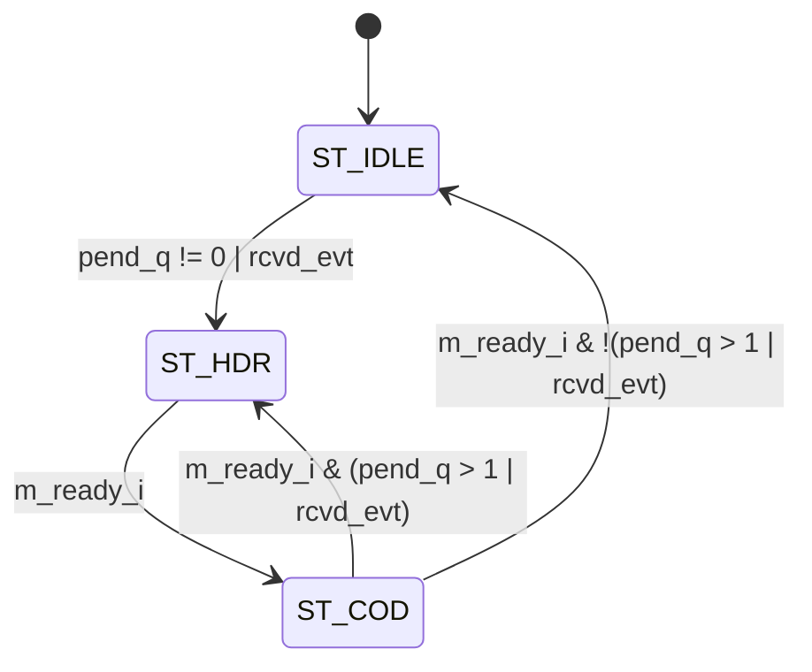

# cxp_tx_io_ack

Inputs chosen from the tree: RTL `src/rtl/tx/cxp_tx_io_ack.sv` and its packet FSM `src/rtl/tx/cxp_tx_short_pkt.sv` (+ `cxp_pkg.sv`, `cxp_util_pkg.sv`); parent `src/rtl/top/cxp_interface_top.sv` and the scheduler it feeds, `src/rtl/tx/cxp_tx_inserter.sv`; bound SVA `src/sva/cxp_sva.sv`; unit TB `src/tb_unit/tx/cxp_tx_io_ack/`; scheduler TB `src/tb_unit/tx/cxp_tx_arbiter/` (arbiter + inserter, stand-in source on the I/O-ack port); end-to-end TB `src/tb_unit/top/cxp_device_top/` (tests 7, 11, 27, 29, 31); receive-side feed `src/tb_unit/rx/cxp_rx_link/` test 7; spec JIIA CXP-001-2015 v1.1.1 (`docs/spec/CXP-001-2015.pdf`) §8.2.4, Table 13, §8.3.2, §8.3.3, Table 17, §8.7.4; regression `make -C src/tb_unit`; output `docs/design/modules/tx/cxp_tx_io_ack.md`.

Sends one 2-word I/O-acknowledgment packet on the high-speed downlink for every host trigger packet the receive path reports as received.

| Word | `m_o.data` | `m_o.kmask` | Flag |
|---|---|---|---|
| 0 | `0xDCDCDCDC` (4×K28.6) | `1111` | `m_o.sop` |
| 1 | `rep4(p_ACK_CODE)` = `0x01010101` | `0000` | `m_o.eop` |

Source `src/rtl/tx/cxp_tx_io_ack.sv`. The module keeps the event queue (edge detector + pending counter); the two packet words come from one `cxp_tx_short_pkt` instance (`cxp_tx_short_pkt_i`, leader `K28_6`, code `p_ACK_CODE`), the same packet FSM `cxp_tx_trigger_hs` uses. Instantiated once in `cxp_interface_top` (`cxp_tx_io_ack_i`); fed by `cxp_rx_link.trig_pkt_rcvd_o` through the crossing layer (`trig_pkt_rcvd_tx`); drives `tx_ioack`, the I/O-acknowledgment port of `cxp_tx_inserter` (priority 1), and takes `tx_ioack_ready` back. Implements §8.3.2/§8.3.3 ("Trigger packets shall be acknowledged with an I/O acknowledgment packet"), Table 17; relies on the inserter for Table 13 / §8.2.4.

## Interface

| Name | Default | Meaning |
|---|---|---|
| `p_ACK_CODE` | `cxp_pkg::IOACK_CODE_OK` = `8'h01` | Byte repeated 4× in word 1. Table 17 defines only 0x01 "Trigger packet received OK". |
| `p_PEND_W` | `2` | Width of the saturating pending counter. Capacity = 2^`p_PEND_W` − 1 = 3 outstanding acks, **including** the one in flight. Legal ≥ 2: 1 elaborates but breaks an invariant (Minor 4), 0 fails elaboration. No elaboration check. |

| Name | Dir | Width | Description |
|---|---|---|---|
| `tx_clk` | in | 1 | TX word clock |
| `tx_rst_n` | in | 1 | Active-low reset, asynchronous assert |
| `trig_rcvd_i` | in | 1 | Trigger-received strobe; rising-edge detected |
| `m_o.data` | out | 32 | Word data |
| `m_o.kmask` | out | 4 | Per-byte K flag |
| `m_o.valid` | out | 1 | 1 while `cxp_tx_short_pkt_i` is in `ST_HDR` or `ST_COD` |
| `m_o.sop` | out | 1 | 1 in `ST_HDR` |
| `m_o.eop` | out | 1 | 1 in `ST_COD` |
| `m_ready_i` | in | 1 | Word taken by the inserter (`ioack_ready_o`, same cycle) |

Notes:
- **Reset:** `tx_rst_n` clears `pend_q`, `trig_rcvd_q` and the short-packet `state_q` asynchronously; outputs go quiet at assertion without a clock edge. The port comment still says "sync reset". Deassertion must be synchronised by the integration. `tx_rst_n` is the only way to clear `pend_q`: ConnectionReset, TestMode and the control-channel reset do not reach it. A started packet always completes (no abort input).
- **Clock domain / CDC:** single domain `tx_clk`. The strobe is produced on `rx_clk`, the low-speed oversampling clock. `cxp_interface_top` crosses it: with `p_ASYNC_CLOCKS` = 1 through `cxp_cdc_pulse_trig_rcvd_i` (toggle synchroniser), with `p_ASYNC_CLOCKS` = 0 as a plain wire, which is correct only when the clocks are one clock or phase-locked. Two strobes closer than three `tx_clk` cycles cancel in the toggle synchroniser; host triggers cannot come that close (a Table 15 trigger is six low-speed characters, and §8.3.3 makes the host wait for the ack).
- **Output registration:** all outputs are combinational decodes of the short-packet `state_q`; a word not taken is held bit-exact (bound `cxp_short_pkt_sva`). The inserter registers the wire word.
- **What counts as "received":** decided upstream. `trig_pkt_rcvd_o = trig_valid & ~trig_glitch` in `cxp_rx_link`, where `trig_valid` is the sampler's Table 15 trigger (character level, also inside a command) or the parser's Table 16 word form. It is taken before the Delay vote, so a trigger rejected by `cxp_rx_trigger_lspd` for a bad Delay is still acked (`cxp_rx_trigger_lspd.md`). A Table 16 word-form trigger inserted into a long packet is not recognised by the parser, so not acked (`cxp_rx_packet_parser.md` Critical 1); a compliant host sends Table 15 on the low-speed uplink.
- **Header/port comments:** see Minor 1 and 2.

## How it works

1. **Edge detector** (`cxp_tx_io_ack.sv:147`). `rcvd_evt = trig_rcvd_i & ~trig_rcvd_q`. A level or a widened pulse is one event; two events need a sampled 0 between them. With `trig_rcvd_i` high at reset release, `trig_rcvd_q` = 0 gives one event and one ack.
2. **Pending counter `pend_q`** (`:162`). +1 on `rcvd_evt` unless full, −1 on `ack_done` (the short packet's `done_o`, code-word handshake). Same-cycle rules:
   - `{rcvd_evt, ack_done}` = 11, not full: net 0.
   - 11 while full: net −1. The new event is dropped although a slot frees in that cycle (Minor 3).
   - 10 while full: event dropped. No status output for either drop (Medium 3).
3. **Packet FSM** in `cxp_tx_short_pkt_i` (`:185`; 2-bit, code 3 unreachable, `default` → `ST_IDLE`), with `avail_i = work_avail = (pend_q != 0) | rcvd_evt` and `more_i = work_more = (pend_q > 1) | rcvd_evt` (`:149`–`:152`).

| State | Next | Condition |
|---|---|---|
| `ST_IDLE` | `ST_HDR` | `pend_q != 0` or `rcvd_evt` |
| `ST_HDR` | `ST_COD` | `m_o.valid & m_ready_i` |
| `ST_COD` | `ST_HDR` | handshake and (`pend_q > 1` or `rcvd_evt`) |
| `ST_COD` | `ST_IDLE` | handshake and not (`pend_q > 1` or `rcvd_evt`) |



Latency with `m_ready_i` = 1: event in cycle c → HDR offered in c+1 → code word (EOP handshake) in c+2 → `ST_IDLE` in c+3; the inserter puts each word on the wire one cycle after it takes it. Back-to-back throughput: one packet per 2 cycles. All acks are identical, so order is trivially kept.

Invariant, by construction for `p_PEND_W` ≥ 2, not asserted: `state_q == ST_IDLE` ⇔ `pend_q == 0`.

## Arbiter integration

- **Port:** the I/O-acknowledgment port of `cxp_tx_inserter` (`ioack_i` / `ioack_ready_o`), priority 1 (Table 13). The long-packet arbiter (`cxp_tx_arbiter`) is not involved.
- **Insertion (§8.2.4):** the inserter takes the ack's leader at the next word boundary of whatever long packet is on the wire (control acknowledgment, connection test or stream), provided no two-word packet is half sent, no trigger leader is offered in the same cycle, and the run since the last IDLE is ≤ 95. The code word always follows on the next word (SVA `a_ioack_contiguous`), and the long packet resumes afterwards.
- **Bound:** the leader waits at most 3 words after it is offered (SVA `a_ioack_within_3`): the worst case is a trigger leader and its Delay word, then the IDLE they made due. The run limit of 95 keeps the §8.2.5.1 rule (IDLE at least every 100 words) with room for one more trigger after the ack.
- **Handshake:** `ioack_ready_o` is combinational from the inserter's choice, same cycle.
- **TestMode (§8.7.4):** not a factor. The ack is inserted into connection-test packets like into any long packet; §8.3.3 has no TestMode exemption and §8.7.4 restricts data packets, so the design sends I/O acks during TestMode (decided). Nothing is held for the TestMode exit, so no stale acks follow it (`cxp_device_top` test 29).
- **§8.3.3 host timeout:** for a low-speed trigger acknowledged on high speed, "The timeout shall be one character on the low speed connection", 480 ns, i.e. 75 words at 6.25 Gbps (6.4 ns per word) or 15 words at 1.25 Gbps. The transmit side uses at most a few words of it (`cxp_device_top` test 27: leader at most 6 words after the `tx_clk` request, under stream load); the receive side (last trigger character → `trig_pkt_rcvd_o`) and the pulse crossing are not measured against it (Medium 4).

## Verification

cocotb 2.0.1 on Verilator 5.046 (2-state), built with `--assert`. SVA: `cxp_short_pkt_sva` is bound into the short-packet instance in every bench (an unaccepted word is held with the same data and kmask); `cxp_inserter_sva` (`a_ioack_contiguous`, `a_ioack_within_3`, `a_trig_contiguous`) into every inserter; `cxp_idle_rule_sva` into `cxp_interface_top`. Coverage: FSM state/arc sampling (`fsm_coverage.py`) on `cxp_tx_io_ack_i.cxp_tx_short_pkt_i.state_q` in the unit TB.

### Unit TB — `src/tb_unit/tx/cxp_tx_io_ack`

Wrapper `tb_cxp_tx_io_ack_top.sv`: DUT plus the `TESTCASE` byte. Clock 8 ns. `reset()` starts the clock, holds `tx_rst_n` = 0 for 4 edges with `m_ready` and `trig_rcvd` at their initial values, releases, waits 1 edge. Shared checkers: `split_into_packets` (asserts no SOP inside a packet, no beat outside one, no EOP outside one, no open packet at the end) and `check_ack_packet` (2 beats; HDR `0xDCDCDCDC`/`0xF`/sop; COD `0x01010101`/`0x0`/eop). `capture_accepted(n)` records beats with `m_valid & m_ready` for n edges. `pulse_trig(n)` sets `trig_rcvd` = 1, waits n edges, sets 0 and returns without waiting.

| Test | Stimulus | Expect |
|---|---|---|
| `test_01_reset_idle` | reset, 16 idle cycles | `m_valid` = 0 throughout |
| `test_02_single_ack` | 1 pulse | 1 packet |
| `test_03_level_held_one_ack` | level high for 20 cycles | 1 packet |
| `test_04_no_trig_no_ack` | 48 idle cycles | 0 beats |
| `test_05_backpressure_and_queue` | `m_ready` = 0, 2 pulses, release | HDR held; then 2 packets |
| `test_06_burst_two` | `1,0,1,0` | 2 packets |
| `test_07_sustained` | 12 events, period 3 | 12 packets |
| `test_08_random_stream` | 25 events, gaps 4–12 | 25 packets |
| `test_09_overflow_safe` | 8 `pulse_trig()` calls while stalled | 1–8 packets |

#### test_01_reset_idle
- *Stimulus*: reset with `m_ready` = 1, `trig_rcvd` = 0; 16 edges.
- *Checks*: `m_valid` == 0 on each edge.
- *Proves*: reset values of `state_q`, `pend_q`, `trig_rcvd_q`; no event from the edge-detector flop.

#### test_02_single_ack
- *Stimulus*: reset; `pulse_trig(1)`; capture 8 cycles.
- *Checks*: `split_into_packets`; exactly 1 packet; `check_ack_packet`.
- *Proves*: `ST_IDLE → ST_HDR → ST_COD → ST_IDLE`, HDR one cycle after the event cycle.

```wavedrom
{"signal": [
  {"name": "tx_clk",      "wave": "p....."},
  {"name": "trig_rcvd_i", "wave": "010..."},
  {"name": "rcvd_evt",    "wave": "010..."},
  {"name": "state_q",     "wave": "2.342.", "data": ["IDLE", "HDR", "COD", "IDLE"]},
  {"name": "pend_q",      "wave": "2.2.2.", "data": ["0", "1", "0"]},
  {"name": "m_o.valid",   "wave": "0.1.0."},
  {"name": "m_o.sop",     "wave": "0.10.."},
  {"name": "m_o.eop",     "wave": "0..10."},
  {"name": "m_o.data",    "wave": "2.342.", "data": ["0", "DCDCDCDC", "01010101", "0"]},
  {"name": "m_ready_i",   "wave": "1....."}
]}
```

#### test_03_level_held_one_ack
- *Stimulus*: reset; `trig_rcvd` = 1 for the whole 20-cycle capture; then 0.
- *Checks*: framing; exactly 1 packet; `check_ack_packet`.
- *Proves*: rising-edge detection (a level or a CDC-widened pulse is one event).

#### test_04_no_trig_no_ack
- *Stimulus*: reset; 48 cycles, `m_ready` = 1, no trigger.
- *Checks*: zero accepted beats.
- *Proves*: `work_avail` = 0 with `pend_q` = 0 and no event.

#### test_05_backpressure_and_queue
- *Stimulus*: reset with `m_ready` = 0; `pulse_trig(1)`; 6 edges; `pulse_trig(1)`; 4 edges; `m_ready` = 1; capture 12 cycles.
- *Checks*, in order: `m_valid` == 1, `m_sop` == 1, `m_kmask` == 0xF, `m_data` == `0xDCDCDCDC`; after the second pulse `m_data` still `0xDCDCDCDC`; after release framing, exactly 2 packets, `check_ack_packet` on each.
- *Proves*: the stalled HDR is held bit-exact; `pend_q` counts to 2 while parked; `ST_COD → ST_HDR` via `pend_q > 1`.

```wavedrom
{"signal": [
  {"name": "tx_clk",      "wave": "p.|..|....."},
  {"name": "trig_rcvd_i", "wave": "10|10|....."},
  {"name": "m_ready_i",   "wave": "0.|..|1...."},
  {"name": "state_q",     "wave": "23|..|.4342", "data": ["IDLE", "HDR", "COD", "HDR", "COD", "IDLE"]},
  {"name": "pend_q",      "wave": "22|.2|..2.2", "data": ["0", "1", "2", "1", "0"]},
  {"name": "m_o.valid",   "wave": "01|..|....0"},
  {"name": "m_o.sop",     "wave": "01|..|.010."},
  {"name": "m_o.eop",     "wave": "0.|..|.1010"},
  {"name": "m_o.data",    "wave": "23|..|.4342", "data": ["0", "DCDCDCDC", "01010101", "DCDCDCDC", "01010101", "0"], "node": "...a..b...c"}
],
 "edge": ["a HDR held", "b HDR unchanged", "c 2 packets"]}
```

#### test_06_burst_two
- *Stimulus*: reset; `trig_rcvd` = 1, 0, 1, 0 on four consecutive edges, capturing inline; 16 more cycles.
- *Checks*: framing; exactly 2 packets; `check_ack_packet` on each.
- *Proves*: the second event lands in the first packet's COD handshake cycle: `{rcvd_evt, ack_done}` = 11 with `pend_q` = 1 leaves `pend_q` at 1, and `ST_COD → ST_HDR` is taken via the `rcvd_evt` term. One packet per 2 cycles.

```wavedrom
{"signal": [
  {"name": "tx_clk",      "wave": "p......"},
  {"name": "trig_rcvd_i", "wave": "01010.."},
  {"name": "rcvd_evt",    "wave": "01010.."},
  {"name": "ack_done",    "wave": "0..1010", "node": "...a..."},
  {"name": "state_q",     "wave": "2.34342", "data": ["IDLE", "HDR", "COD", "HDR", "COD", "IDLE"]},
  {"name": "pend_q",      "wave": "2.2...2", "data": ["0", "1", "0"]},
  {"name": "m_o.sop",     "wave": "0.1010."},
  {"name": "m_o.eop",     "wave": "0..1010"},
  {"name": "m_ready_i",   "wave": "1......"}
],
 "edge": ["a {rcvd_evt, ack_done} = 11"]}
```

#### test_07_sustained
- *Stimulus*: reset; 12 events of 1 high cycle + 2 low cycles, capturing inline; 10 more cycles.
- *Checks*: framing; exactly 12 packets; `check_ack_packet` on each.
- *Proves*: `ST_IDLE → ST_HDR → ST_COD → ST_IDLE` repeated; each 2-cycle packet ends before the next event, so `pend_q` never exceeds 1.

#### test_08_random_stream
- *Stimulus*: reset; 25 one-cycle events at gaps of 4–12 cycles from `random.Random(0x10ACC0DE)`, capturing inline; 12 more cycles.
- *Checks*: framing; 25 packets; `check_ack_packet` on each.
- *Proves*: 1:1 event-to-ack mapping when every ack drains before the next event.

#### test_09_overflow_safe
- *Stimulus as written*: reset with `m_ready` = 0; 8 back-to-back `pulse_trig(1)` calls; `m_ready` = 1; capture 40 cycles.
- *Checks*: framing; 1 ≤ packets ≤ 8; `check_ack_packet` on each.
- *Intended to prove*: saturation at `pend_q` = 3 does not corrupt framing.
- **Does not do what it intends** (its docstring now says so). `pulse_trig()` writes 0 and returns in the same time step in which the next call writes 1, so the DUT never samples a 0 between calls. Observed: 1 rising edge, `pend_q` peaks at 1, 1 packet. The loose bound passes anyway, so saturation and the 11-while-full branch have no in-tree stimulus (Medium 1).

```wavedrom
{"signal": [
  {"name": "tx_clk",                   "wave": "p........."},
  {"name": "trig_rcvd_i (intended)",   "wave": "010101010."},
  {"name": "pend_q (intended)",        "wave": "2.2.2.2...", "data": ["0", "1", "2", "3"]},
  {"name": "trig_rcvd_i (actual)",     "wave": "01.......0"},
  {"name": "rcvd_evt (actual)",        "wave": "010......."},
  {"name": "pend_q (actual)",          "wave": "2.2.......", "data": ["0", "1"], "node": "..a"},
  {"name": "m_ready_i",                "wave": "0........."}
],
 "edge": ["a pend_q never exceeds 1"]}
```

### Scheduler TB — `src/tb_unit/tx/cxp_tx_arbiter`

`cxp_tx_arbiter` + `cxp_tx_inserter` (wrapper `tb_cxp_tx_arbiter_top.sv`, 8 ns clock); `cxp_tx_io_ack` is **not** instantiated: each source is a Python `SourceDriver` that presents the head of a beat queue and pops it on `*_ready`. `m_data` / `m_kmask` / `idle_seen` are the inserter's choice of the cycle; the registered wire word follows one cycle later. Tests on the I/O-ack port:

| Test | Checks |
|---|---|
| `test_15_priority_ioack_over_ack` | ioack and ack SOP offered together: the 2 ioack beats first, then the 4 ack beats, each exclusive with matching data and kmask |
| `test_16_priority_trig_over_ioack` | trigger and ioack offered together: trigger beats first, then ioack beats |
| `test_17_ioack_inserted_mid_ack` | ioack queued at cycle 2 of a 20-beat ack packet: its leader within 3 cycles, the code word next, the ack complete and in order around it |
| `test_18_trig_waits_for_ioack_code` | trigger offered in the cycle the ioack leader is chosen: wire order ioack leader, ioack code, trigger leader, Delay on four consecutive words; the ack packet completes |
| `test_25_insert_at_every_run_position` | trigger, ioack, ioack + trigger, two ioacks + trigger offered at every run position 85..104 of a 300-beat stream packet: stream complete, every leader followed by its second word, run ≤ 99, the ioack at most 3 words after it is offered |

### Integration TB — `src/tb_unit/top/cxp_device_top`

The real `cxp_rx_link` → `cxp_cdc_pulse_trig_rcvd_i` → this module → `cxp_tx_inserter` chain, `p_ASYNC_CLOCKS` = 1, rx 10 ns, tx 8 ns, app 12 ns. The host model (`common/cxp_host.py`) sends Table 15 triggers on the uplink and decodes each Table 17 packet on the downlink (`host.ioacks`, voted code).

| Test | Checks |
|---|---|
| `test_07_host_trigger` | one rising trigger: `trig_out` pulses; exactly one I/O ack 0x01 within 3000 `tx_clk` cycles |
| `test_11_single_domain_reset` | after one I/O-acked host trigger, an `rx_rst_n`-only reset puts no I/O ack (or anything else) on the downlink |
| `test_27_ioack_latency_under_stream` | 200 host triggers during back-to-back 200-word stream packets: one request per trigger, 200 acks of 0x01, each K28.6 leader at most 6 words after the `tx_clk` request, ≥ 20 requests inside a stream packet, the stream reassembles |
| `test_29_ioack_in_testmode` | four host triggers in TestMode, each acked within 3000 cycles while TestMode is 1; exactly four acks in all after TestMode ends |
| `test_31_nested_preempt` | host trigger and device trigger edge −6..+6 cycles apart inside a stream packet: 14 acks, 13 device triggers, no torn short packet, stream intact, both orders seen |

### Other

- `src/tb_unit/rx/cxp_rx_link` `test_07_trig_pkt_rcvd_for_ioack`: one serial trigger gives exactly one `trig_pkt_rcvd` strobe, independent of `cfg_trig_polarity`; `test_13_ls_trigger_char_form`: Table 15 triggers at the four character phases, in IDLE and inside a command, each give one strobe. Glitched leaders are not exercised.
- `src/tb_unit/top/cxp_interface_top`: compiles the instance; its trigger tests drive the uplink with a host but send no host trigger, so no I/O ack is produced there.
- `src/verif/uvm` `test_io_ack` and `test_arbiter_stream_underflow`: `io_ack_scoreboard` checks count equality and code 0x01 only, no latency. Not run here.
- `src/emu/bridge/Makefile` and `src/verif/Makefile` compile the module.

### Running

```
make -C src/tb_unit/tx/cxp_tx_io_ack WAVES=0
make -C src/tb_unit/tx/cxp_tx_io_ack WAVES=0 COCOTB_TEST_FILTER=test_05_backpressure_and_queue
make -C src/tb_unit/top/cxp_device_top WAVES=0 'COCOTB_TEST_FILTER=test_\(07\|27\|29\|31\)_'   # the recipe passes the filter unquoted
make -C src/tb_unit            # all benches
```

Results on 2026-09-26 at commit `7a267e2`: unit TB 9/9, no SVA failure, FSM coverage 3/3 states, 4/4 arcs. `cxp_device_top` tests 7, 27, 29, 31: 8/8 pass (run together with tests 11, 12, 30, 32). Full regression not re-run. Run `make clean` when switching `WAVES`, because a stale `sim_build` keeps the old trace setting.

### Not covered in-tree

- Reset during activity. By code: outputs quiet at assertion, `pend_q` cleared, no packet after release.
- `trig_rcvd_i` high at reset release (currently emits one ack — intent undecided).
- Counter saturation and the 11-while-full branch (Medium 1).
- The real source against the real inserter at unit level: only `cxp_device_top` combines them; the scheduler bench uses a stand-in.
- End-to-end ack latency from the last character of the host's trigger packet (Medium 4).
- A glitched trigger leader (`trig_glitch`): no ack by design, not tested above the parser.
- X-propagation: Verilator is 2-state (Minor 6).

## Known issues and recommendations

### Critical

None.

### Medium

1. `test_09` does not saturate. End `pulse_trig()` with a sampled low cycle, assert exactly 3 packets from 8 events, and add the 11-while-full case (3 queued, release, event in the first COD handshake → 3 packets). *Effort:* 1 h.
2. Missing unit tests: reset in `ST_HDR` with `pend_q` = 2, input high at reset release, level held across a packet boundary. *Effort:* 2 h.
3. **Drops are silent.** The pending counter saturates at 3 and a further event is dropped with no status. A compliant host never has more than one trigger outstanding (§8.3.3), so this needs a misbehaving host or a receive-side fault; the host then sees one ack fewer and its timeout decides. Expose an `ack_dropped_o` pulse for a status counter, or document the limit. *Effort:* 2 h.
4. **The §8.3.3 one-character timeout is not checked end to end.** `cxp_device_top` test 27 bounds only the transmit part (≤ 6 words from the `tx_clk` request). Add a check from the last character of the host's trigger packet on `rx_serial` to the K28.6 leader on the wire, against 480 ns scaled to the bench clocks, under stream load. *Effort:* 0.5 day.
5. **CDC with `p_ASYNC_CLOCKS` = 0.** The strobe is then a plain wire, correct only for one clock or phase-locked clocks; an integration with an `rx_clk` unrelated to `tx_clk` must set the parameter. State the requirement in the integration guide, or default `p_ASYNC_CLOCKS` to 1. *Effort:* 10 min.

### Minor

1. Header comments: `tx_rst_n` "sync reset" → asynchronous assert, synchronised deassert; the "Clock domain / CDC" paragraph still says a multi-clock build must add the synchroniser, which `cxp_interface_top` has under `p_ASYNC_CLOCKS`; the "Priority" and "Pending queue" paragraphs and the output-port comment still name `cxp_tx_arbiter` ("places it at priority 1 (above ctrl-ack / link-test / stream)", "the arbiter may stall this slot"); the scheduler is now `cxp_tx_inserter`, which inserts the ack into any long packet.
2. Header and `p_PEND_W` comment: capacity is 3 outstanding including the in-flight ack, not 3 queued behind it.
3. The 11-while-full branch drops the new event although the dequeue frees a slot. Replace the `pend_full` decrement with "no change" and update the comment.
4. `p_PEND_W` = 1: `ST_HDR` is entered with `pend_q` = 0 (invariant broken) and Verilator reports `CMPCONST` at the `pend_q > PEND_ONE` compare. `p_PEND_W` = 0 fails on a negative replication. Add an elaboration-time `$error` for `p_PEND_W < 2`, in the generate-if style the other modules use.
5. SVA: the bound `cxp_short_pkt_sva` checks that an unaccepted word is held. Still missing: HDR/COD contents; `(state_q == ST_IDLE) == (pend_q == 0)`; `pend_q` never wraps.
6. One 4-state run or an `!$isunknown` assertion on the outputs after reset.

### Open questions

1. Designer: should `trig_rcvd_i` high at reset release produce an ack?
2. Designer: should a trigger whose Delay vote fails still be acked 0x01 (raised from the receive side, `cxp_rx_trigger_lspd.md`)?
3. Designer: on pending-counter saturation, drop silently, count, or widen `p_PEND_W` (Medium 3)?
4. Verification: who owns the end-to-end ack-latency check against the one-character timeout, `src/tb_unit/top/cxp_device_top` or `src/verif/uvm` (Medium 4)?
