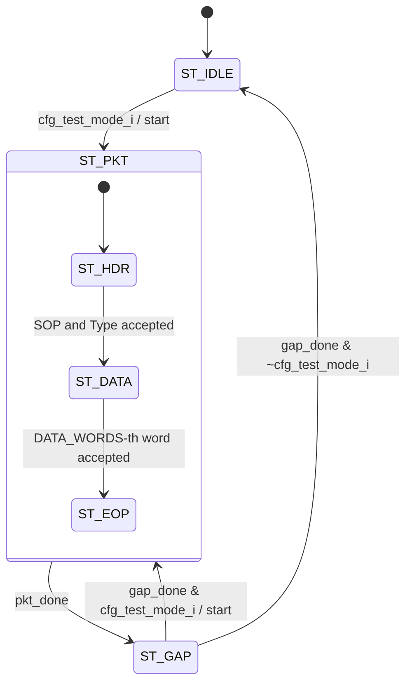

# cxp_tx_linktest

Device→host Test Generator of the §8.7 connection test. While TestMode is 1 it sends type-0x04 test packets of 1024 counting words, keeps at least 16 word slots between them, and counts each packet in TestPacketCountTx.

| Word | P0 | P1 | P2 | P3 | kmask |
|---|---|---|---|---|---|
| SOP | K27.7 | K27.7 | K27.7 | K27.7 | 1111 |
| Type | 0x04 | 0x04 | 0x04 | 0x04 | 0000 |
| D[i], i = 0..1023 | (4i) & 0xFF | (4i+1) & 0xFF | (4i+2) & 0xFF | (4i+3) & 0xFF | 0000 |
| EOP | K29.7 | K29.7 | K29.7 | K29.7 | 1111 |

1027 words, no CRC. At the default parameters the packet matches Table 23 word for word, including the 16× repetition of 0x00..0xFF (checked word by word by `cxp_device_top` test_06). P0 is `m_o.data[7:0]`.

Source `src/rtl/tx/cxp_tx_linktest.sv`. The module keeps TestMode sequencing (its own `state_q`: idle, packet, gap), the counting payload, TestPacketCountTx and `suppress_traffic_o`. SOP, type word, data sequencing and EOP come from a `cxp_tx_pkt_framer` instance `cxp_tx_pkt_framer_i` (`p_HDR_WORDS` = 2, `p_HAS_CRC` = 0, lines 267–294); see `cxp_tx_pkt_framer.md`.

Instantiated once, as `cxp_tx_linktest_i` in `cxp_interface_top` with default parameters. `cfg_test_mode_i` is `cfg_tx.test_mode`, the `tx_clk` copy of bit 0 of the TestMode register (through `cxp_cdc_bus` when `p_ASYNC_CLOCKS` = 1). It feeds port `TX_PORT_LT` (1) of `cxp_tx_arbiter`, and `suppress_traffic_o` drives only `suppress_stream_i` of `cxp_app_stream` (no new stream packet starts while it is high). `clr_pkt_count_i` is `clr_lt_tx | crst_tx`, where `clr_lt_tx` is the `clr_lt_pkt_tx` top port (through `cxp_cdc_pulse` in the asynchronous build), which `cxp_device_top` drives from the register file's `ctl_test_pkt_tx_clr_o`, and `crst_tx` is the ConnectionReset level (through `cxp_cdc_sync`). `pkt_count_o` leaves as `sb_lt_pkt_count_tx` (through `cxp_cdc_bus` in the asynchronous build).
Implements §8.7.1, §8.7.2 / Table 23, §8.7.4, §10.3.35, §10.3.38.

## Interface

| Name | Default | Meaning |
|---|---|---|
| `DATA_WORDS` | `cxp_pkg::LT_DATA_WORDS` = 1024 | Data words per packet; Table 23 requires 1024. Passed to the framer's 16-bit `n_words_i`; legal 1…65535, checked at elaboration (`g_chk_data_words`, lines 148–150). |
| `GAP_WORDS` | `cxp_pkg::LT_GAP_WORDS` = 16 | Cycles with `m_o.valid` = 0 after each accepted EOP; §8.7.4 minimum is 16. Counter width `cnt_w(GAP_WORDS)` = 5. `GAP_WORDS` < 1 is an elaboration `$error` (0 would give a two-word gap); the 16 of §8.7.4 is checked on `LT_GAP_WORDS` where the device instantiates this module (the unit TB uses 4). |

Both parameters are un-prefixed on purpose: the unit TB reads them by name (noted at the instantiation).

| Name | Dir | Width | Description |
|---|---|---|---|
| `tx_clk` | in | 1 | TX word clock. |
| `tx_rst_n` | in | 1 | Active-low reset, asynchronous assert. |
| `cfg_test_mode_i` | in | 1 | §10.3.35 TestMode enable. |
| `suppress_traffic_o` | out | 1 | `cfg_test_mode_i \| (state_q != ST_IDLE)`; to `suppress_stream_i` of the stream top. |
| `clr_pkt_count_i` | in | 1 | Clears `pkt_count_o` and marks the packet in flight as not counted; wins over an increment. In `cxp_interface_top`: `clr_lt_tx` (host write of 0, a pulse) OR `crst_tx` (the ConnectionReset level). |
| `pkt_count_o` | out | 64 | §10.3.38 TestPacketCountTx. |
| `m_o.data` | out | 32 | Packet word, P0 in `[7:0]`. |
| `m_o.kmask` | out | 4 | Per-byte K flag. |
| `m_o.valid` | out | 1 | High for every word of a packet (`state_q` = `ST_PKT`), low in `ST_IDLE` and `ST_GAP`. |
| `m_o.sop` | out | 1 | High with the K27.7 word. |
| `m_o.eop` | out | 1 | High with the K29.7 word. |
| `m_ready_i` | in | 1 | Arbiter grant; a word is accepted on `m_o.valid & m_ready_i`. |

Notes:
- Reset: all registers, and the framer, clear on `negedge tx_rst_n`. The port comment (line 103) says "sync reset". Deassertion timing is left to the integration.
- Single clock `tx_clk`. With `p_ASYNC_CLOCKS` = 1, `cxp_interface_top` synchronises all three crossings: TestMode arrives through `cxp_cdc_bus`, the host clear through `cxp_cdc_pulse`, the ConnectionReset level through `cxp_cdc_sync`, and the 64-bit count leaves through `cxp_cdc_bus`, which transfers a stable holding register, so a torn read is not possible. `cxp_device_top` exercises this with unrelated clocks. With the default `p_ASYNC_CLOCKS` = 0 the register file and `tx_clk` must be one clock; the `src/tb_unit` interface-level TB ties all clocks to one source, and `src/verif/` runs them at the same 10 ns period.
- `m_*` are decoded from the framer state and `seq_q`, with no combinational path from `m_ready_i`. `suppress_traffic_o` has a combinational path from `cfg_test_mode_i`. `pkt_count_o` is registered.
- Stall: with `m_ready_i` low the current word holds. `ST_GAP` counts every cycle whatever `m_ready_i` does.
- The header says the count clears on a host write of 0 (a pulse) or a ConnectionReset (a level). In `cxp_device_top` a host write of 0 to TestPacketCountTx reaches it through its own strobe (`ctl_test_pkt_tx_clr_o` → `clr_lt_pkt_tx`); the ConnectionReset level is `crst_tx`. The port comment still says "Clear pulse" (line 112).

## How it works

1. **FSMs.** This module's `state_q` (lines 138–142, 193–220) runs one packet per pass; the framer inside `ST_PKT` walks `ST_HDR` (SOP, then the type word), `ST_DATA` (`DATA_WORDS` words) and `ST_EOP`. `ST_CRC` is never entered (`p_HAS_CRC` = 0). `ST_PKT` is left only on the accepted EOP word: a started packet always completes. `start` (line 187) pulses on every entry to `ST_PKT` and starts the framer.

| State | Next | Condition |
|---|---|---|
| ST_IDLE | ST_PKT | `cfg_test_mode_i` (`start`) |
| ST_PKT | ST_GAP | `pkt_done` (EOP word accepted, framer `done_o`) |
| ST_GAP | ST_PKT | `gap_done & cfg_test_mode_i` (`start`) |
| ST_GAP | ST_IDLE | `gap_done & ~cfg_test_mode_i` |



2. **Payload.** `seq_q` (8 bits) is the P0 byte of the next data word, and the word is `{seq+3, seq+2, seq+1, seq}` (lines 177–180). Each accepted data word (`pl_ready`, the framer's `pl_ready_o`) adds 4. Wrap at 256 gives the 16 repetitions with no outer counter. The framer counts the `DATA_WORDS` words. `seq_q` resets to 0 on every `start` (line 250), so every packet starts at 0x03020100.
3. **Gap and mode sampling.** `gap_q` runs 0..`GAP_WORDS`-1 inside `ST_GAP` and is held at 0 elsewhere (lines 254–260). `cfg_test_mode_i` is looked at only in `ST_IDLE` and on the last gap cycle. A TestMode fall mid-packet therefore completes the packet and its gap, as §10.3.35 requires. A fall that is back high by the last gap cycle is invisible (confirmed by simulation, probe not in repo).
4. **TestPacketCountTx.** `pkt_count_q` gets +1 on the cycle the EOP word is accepted, if `counted_q` is set, and shows the new value the next cycle (lines 236–247). `counted_q` is set by `start` and cleared by `clr_pkt_count_i`, so only a packet that started after the last clear is counted: a packet in flight across a ConnectionReset or a host clear is sent but not counted. It has 64 bits and does not saturate.

Same-cycle rules:
- Clear on the EOP-accept cycle, or anywhere inside the packet: that packet is not counted.
- Clear in the same cycle as `start`: the clear wins, so that packet is not counted either (it started with the clear, not after it).
- `start` resets `seq_q` with priority over the data-word advance.

Latency and throughput:
- SOP is presented one cycle after `cfg_test_mode_i` is first high in `ST_IDLE`.
- With `m_ready_i` = 1 a packet takes 1027 cycles and the gap 16, so the period is 1043 cycles.
- In `cxp_interface_top`, `cxp_tx_inserter` sends an IDLE word once the run since the last IDLE reaches `IDLE_SOFT_RUN` (95) and no two-word packet is due, so a test packet with nothing else inserted carries 10 or 11 IDLE words, depending on the run at its SOP. The 16 gap cycles go out as IDLE unless a control acknowledgment starts in them.
- After a mid-packet TestMode fall, `suppress_traffic_o` falls 17 cycles after the EOP cycle.

Invariants:
- Asserted by the bound `cxp_framer_sva`: SOP/EOP only on valid words, no SOP inside a packet, SOP/Type/EOP words held while not accepted.
- In `cxp_interface_top`, `cxp_tx_owner_sva` asserts that the port owning the arbiter offers a word in every cycle; this module meets it because `m_o.valid` is 1 from SOP to EOP (`pl_valid_i` = 1).
- By construction, not asserted: `m_o.valid` implies `suppress_traffic_o`; every packet has exactly `DATA_WORDS` + 3 accepted words.

## Arbiter integration

- **Slot.** Port 1 of the three long-packet ports of `cxp_tx_arbiter`, below the control acknowledgment (0) and above the stream (2). Between packets a ctrl-ack SOP wins over a test SOP, which meets §8.7.4's "room for control data packets" at packet boundaries. A ctrl-ack that arrives after a test SOP waits for that packet's EOP (1027 words plus what is inserted into it).
- **Handshake.** `ready_o[TX_PORT_LT]` is the inserter's `long_ready_o` while this port owns the arbiter, combinational from the inserter's per-word choice; `m_o.valid` does not depend on it. A word moves on every cycle both are high.
- **Insertion (§8.2.4).** `cxp_tx_inserter` puts a trigger packet (run ≤ 97) or an I/O acknowledgment (run ≤ 95) between two words of the test packet, and an IDLE word once the run reaches 95; the test packet sees `m_ready_i` = 0 for those cycles and resumes with the held word (§8.2.5.2 allows IDLE inside a high-speed packet). TestMode does not hold triggers or I/O acknowledgments back: they are allowed during the test, and the stream is the only traffic `suppress_traffic_o` stops.
- **Gap.** The 16 gap cycles show as IDLE, or as a ctrl-ack if one is waiting, with triggers and I/O acknowledgments inserted as anywhere else.
- **Stream suppression.** `suppress_traffic_o` stops new stream packets from starting (`cxp_tx_stream_pkt`) from the TestMode rise until the last test packet and its gap drain. A stream packet already on the wire at the rise completes first, and the test packet waits for its EOP; the TestMode flush of `cxp_app_stream` (driven directly by `cfg_tx.test_mode` in `cxp_interface_top`) empties the rest of the stream path.
- **No drop.** There is no watchdog and no abort: a test packet, once its SOP is taken, always reaches its EOP.

## Verification

Verilator 5.046 with cocotb 2.0.1. The bound SVA of `src/sva/cxp_sva.sv` (`cxp_framer_sva`) runs in every bench with `--assert`. FSM state and arc coverage comes from `src/verif/common/fsm_coverage.py` in the unit TB, registered on `cxp_tx_linktest_i.state_q` with the three states and four arcs; the framer's own `state_q` is not registered. There is no code or functional coverage.

### Unit TB — `src/tb_unit/tx/cxp_tx_linktest`

The wrapper `tb_cxp_tx_linktest_top` shrinks `DATA_WORDS` to 16 and `GAP_WORDS` to 4, so a packet is 19 words and a period 23 cycles. Clock is 8 ns. Reset holds `tx_rst_n` low for 4 edges with `cfg_test_mode` = 0, `clr_pkt_count` = 0 and `m_ready` = 1, then releases it for 1 edge. Monitors sample after each rising edge.

Two shared checkers are used:
- `split_into_packets` asserts that no SOP lands inside a packet, no beat falls outside one, and no EOP appears outside one.
- `check_packet_shape` checks the length N+3, SOP 4×0xFB with kmask F, Type 4×0x04 with kmask 0, the N counting words with kmask 0 and no flags, and EOP 4×0xFD with kmask F.

FSM coverage (2026-09-26 run): 3/3 states, 4/4 arcs (test_03, test_04, test_07 between them).

| Test | Stimulus | Expect |
|---|---|---|
| `test_01_reset_idle` | Reset, TestMode 0, 8 cycles | `m_valid` = 0 and `suppress_traffic` = 0 every cycle |
| `test_02_idle_when_disabled` | TestMode 0, 80 cycles | No accepted beat; suppress 0 |
| `test_03_single_packet_format` | TestMode 1 until the first EOP, then 0 | One packet of correct shape |
| `test_04_repeated_packets_pattern` | TestMode 1, 125 cycles | At least 5 packets, each of correct shape |
| `test_05_gap_spacing` | TestMode 1, 102 cycles | Silence from EOP to next SOP of at least `GAP_WORDS` |
| `test_06_suppress_traffic` | TestMode 0, then 1, then 0 | Suppress follows TestMode up, and falls only after drain |
| `test_07_mode_exit_finishes_pkt` | TestMode falls 2 cycles after SOP | EOP arrives; no SOP afterwards |
| `test_08_random_ready_stalls` | `m_ready` 30 % low, 276 cycles | Every captured packet of correct shape |
| `test_09_seq_byte_rollover` | TestMode 1, 125 cycles | Four packets start with 0x03020100 |
| `test_10_pkt_count_tx` | Four packets, stop, clear | Count trails EOPs by at most 1; equals 4; cleared to 0 |

#### test_01_reset_idle
- *Stimulus*: reset, then 8 cycles with every input at its reset value.
- *Checks*: `m_valid` = 0 and `suppress_traffic` = 0 on each of the 8 samples.
- *Proves*: reset state `ST_IDLE`; both terms of `suppress_traffic_o` are low.

#### test_02_idle_when_disabled
- *Stimulus*: reset, TestMode 0, 80 cycles of capture with `m_ready` = 1.
- *Checks*: no beat is accepted; `suppress_traffic` = 0 at the end.
- *Proves*: `ST_IDLE` holds while `cfg_test_mode_i` = 0.

#### test_03_single_packet_format
- *Stimulus*: TestMode 1. Up to 60 cycles of capture, and TestMode goes to 0 as soon as an accepted EOP is seen.
- *Checks*: an EOP is seen; `split_into_packets` returns exactly 1 packet; `check_packet_shape` passes with N = 16.
- *Proves*: arcs `ST_IDLE → ST_PKT → ST_GAP → ST_IDLE`, the framer's `ST_HDR → ST_DATA → ST_EOP` walk with a 2-word header and no CRC, `rep4` framing words and `data_word` byte order.

```wavedrom
{"signal": [
  {"name": "tx_clk",        "wave": "p....|...|.."},
  {"name": "cfg_test_mode", "wave": "1....|..0|.."},
  {"name": "state / framer","wave": "=====|===|==", "data": ["IDLE","PKT/HDR0","PKT/HDR1","PKT/DATA","PKT/DATA","PKT/DATA","PKT/EOP","GAP","GAP","IDLE"]},
  {"name": "m_valid",       "wave": "01...|..0|.."},
  {"name": "m_sop",         "wave": "010..|...|.."},
  {"name": "m_eop",         "wave": "0....|.10|..", "node": ".......a...."},
  {"name": "m_data",        "wave": "=====|===|..", "data": ["0","FBFBFBFB","04040404","03020100","07060504","3F3E3D3C","FDFDFDFD","0"]},
  {"name": "pkt_count",     "wave": "=....|..=|..", "data": ["0","1"]}
],
 "head": {"text": "a: packet captured, check_packet_shape runs (N = 16, G = 4)"}}
```

#### test_04_repeated_packets_pattern
- *Stimulus*: TestMode 1, 5 × 23 + 10 = 125 cycles of capture, `m_ready` = 1.
- *Checks*: at least 5 packets; `check_packet_shape` passes on the first 5.
- *Proves*: arc `ST_GAP → ST_PKT`; `seq_q` resets per packet.

#### test_05_gap_spacing
- *Stimulus*: TestMode 1 for 102 cycles. The cycle index of every accepted SOP and EOP is recorded.
- *Checks*: at least 2 EOPs and 3 SOPs; for each EOP the next SOP satisfies `sop - eop - 1 >= 4`.
- *Proves*: `gap_q` / `gap_done` length. It checks only the lower bound; the gap is exactly `GAP_WORDS`, which is 16 at production size (observed, not in repo).

```wavedrom
{"signal": [
  {"name": "tx_clk",         "wave": "p........"},
  {"name": "state / framer", "wave": "===...===", "data": ["PKT/DATA","PKT/EOP","GAP","PKT/HDR0","PKT/HDR1","PKT/DATA"]},
  {"name": "gap_q",          "wave": "=..====..", "data": ["0","1","2","3","0"]},
  {"name": "m_valid",        "wave": "1.0...1.."},
  {"name": "m_eop",          "wave": "010......", "node": ".a......."},
  {"name": "m_sop",          "wave": "0.....10.", "node": "......b.."},
  {"name": "pkt_count",      "wave": "=.=......", "data": ["k","k+1"]}
],
 "edge": ["a<->b gap = 4 >= GAP_WORDS"],
 "head": {"text": "check fires at b: next SOP - EOP - 1 >= 4"}}
```

#### test_06_suppress_traffic
- *Stimulus*: 4 cycles at TestMode 0. TestMode goes to 1 for 23 cycles, then back to 0, followed by a drain window of up to 102 cycles.
- *Checks*:
  - Suppress is 0 on each of the first 4 cycles.
  - It is 1 on the first sample after TestMode rises.
  - It stays 1 for all 23 cycles.
  - It returns to 0 within the drain window.
- *Proves*: both terms of `suppress_traffic_o`. The `cfg_test_mode_i` term acts at once, and the `state_q != ST_IDLE` term holds suppression through the in-flight packet and gap.

#### test_07_mode_exit_finishes_pkt
- *Stimulus*: TestMode 1. Once an SOP is seen (within 10 cycles), 2 more edges pass and TestMode goes to 0. The capture runs up to 24 cycles for the EOP, then 32 more cycles.
- *Checks*: an accepted EOP appears; no SOP appears in the 32-cycle drain.
- **The test does not check the in-flight packet's length or content, so a design that cut the packet short on a TestMode fall would pass (the test's own note: a mutant jumping `ST_DATA → ST_EOP` passes). The §10.3.35 "complete the packet" rule has no discriminating test (Medium 1).**
- *Proves*: arc `ST_GAP → ST_IDLE` and no restart after a mode exit.

```wavedrom
{"signal": [
  {"name": "tx_clk",             "wave": "p...|...|..."},
  {"name": "cfg_test_mode",      "wave": "1.0.|...|..."},
  {"name": "state / framer",     "wave": "===.|.==|.=.", "data": ["PKT/HDR0","PKT/HDR1","PKT/DATA","PKT/EOP","GAP","IDLE"]},
  {"name": "m_valid",            "wave": "1...|..0|..."},
  {"name": "m_eop",              "wave": "0...|.10|...", "node": "......a....."},
  {"name": "m_sop",              "wave": "10..|...|...", "node": "...........b"},
  {"name": "suppress_traffic",   "wave": "1...|...|.0."}
],
 "head": {"text": "a: saw_eop check; b: end of 32-cycle no-SOP window"}}
```

#### test_08_random_ready_stalls
- *Stimulus*: TestMode 1 for 4 × 23 × 3 = 276 cycles, with `m_ready` low on each cycle with probability 0.30 (seed 0xBEEF). Afterwards `m_ready` = 1 and TestMode = 0.
- *Checks*: at least 2 complete packets; `check_packet_shape` passes on every captured packet.
- *Proves*: `seq_q` advances only on `pl_ready`, and the framer's word count and state advance only on accepted words, so no word is lost or repeated under stalls.

#### test_09_seq_byte_rollover
- *Stimulus*: TestMode 1, 125 cycles, `m_ready` = 1.
- *Checks*: at least 4 packets, each with first data word 0x03020100.
- **The name promises the 256-byte rollover, but with `DATA_WORDS` = 16 the payload only reaches byte 0x3F. The test re-checks the per-packet `seq_q` reset already covered by test_04, and no unit test ever wraps `seq_q`.** The wrap is covered at production size by `cxp_device_top` test_06.
- *Proves*: `seq_q` reset on `start`.

#### test_10_pkt_count_tx
- *Stimulus*:
  - TestMode is 1 for up to 4000 cycles, until 4 accepted EOPs.
  - TestMode then goes to 0 and 40 cycles pass.
  - `clr_pkt_count` is high for 1 cycle.
- *Checks*:
  - Every cycle, the count equals the EOPs seen so far or trails them by one.
  - 4 EOPs are reached.
  - The count equals 4 after the stop.
  - The count is 0 one cycle after the clear.
- *Proves*: +1 per EOP accept with a one-cycle lag; the clear branch. It sets `TESTCASE` = 10 (it set 9, the same as test_09, before the TB restyle).

### Integration TB — `src/tb_unit/top/cxp_interface_top`

17 tests run on the real `cxp_interface_top` at default parameters (`p_ASYNC_CLOCKS` = 0), with `cxp_ctrl_bootstrap_regs` behind an APB bridge and all clocks tied. TestMode is set by a backdoor write of the register file's `reg_q[row_test_mode]`. The wrapper leaves the regfile's `ctl_test_count_clr_o` and `sb_lt_pkt_count_tx` open and ties `test_pkt_count_tx[0]` to 0, so TestPacketCountTx reads 0 at this level.

| Test | Checks |
|---|---|
| `test_04_linktest_packets_under_testmode` | 5 packets under TestMode are type 0x03/0x04, at least one 0x04 |
| `test_11_trigger_in_testmode` | A device trigger raised mid test packet is on the wire within 20 words |

`test_13_link_reset_clears_bootstrap_regs` checks only that the TestMode register reads 0 after ConnectionReset. It never observes this module.

#### test_04_linktest_packets_under_testmode
- *Stimulus*: TPG running (`cfg_use_tpg` = 1, `cfg_run` = 1, `cfg_dsizeP` = 8), then TestMode = 1 by backdoor. `collect_packet` gathers 5 packets (`max_idle` 8000, `max_data` 2400) from SOP up to, but not including, K29.7, with any mid-packet IDLE words left in place.
- *Checks*: packet 0 is skipped if its type is 0x01; every other type byte is 0x03 or 0x04; at least one is 0x04.
- *Proves*: the `cfg_test_mode` → linktest → arbiter → wire path, and K27.7/K29.7 framing with IDLE insertion. Payload, length, gap and count are not checked. Packet 0 is tolerated as a stream packet, but the test does not force TestMode to rise inside one; `cxp_device_top` test_28_testmode_vs_stream does.

#### test_11_trigger_in_testmode
- *Stimulus*: uplink brought up (`uplink()`, so the trigger source sees the link); TestMode = 1 by backdoor; the first SOP under TestMode, 100 more wire words, then `trigger_in_app` = 1.
- *Checks*: a 4×K28.4 leader followed by a valid Delay word within 20 words.
- *Proves*: a trigger is inserted into the running test packet instead of waiting for TestMode to end. The test does not decode the test packet around the trigger.

### Integration TB — `src/tb_unit/top/cxp_device_top`

32 tests on `cxp_device_top` with `p_ASYNC_CLOCKS` = 1 and unrelated clocks (rx 10 ns, tx 8 ns, app 12 ns); a host model drives the serial uplink and decodes the downlink with the golden `cxp_protocol` codecs.

#### test_06_test_mode
- *Stimulus*: host write TestMode = 1 over the uplink; wait for two connection-test packets; host write TestMode = 0; host read of TestPacketCountTx (2 words).
- *Checks*: each of the two packets has a 1024-word body with word i = `{(4i+3), (4i+2), (4i+1), 4i}` & 0xFF per lane, so the `seq_q` wrap at word 64 is covered; the count read back is ≥ 2.
- *Proves*: the production-size Table 23 payload, TestMode through the regfile and the `rx_clk → tx_clk` crossing, and TestPacketCountTx back through the `tx_clk → rx_clk` crossing. The gap, the exact count and the exit length are not checked.

`test_12_idle_cadence_per_packet_type` runs TestMode with back-to-back test packets while the device trigger pin toggles 250 times: every trigger leader is followed by its Delay word, the triggers land at 80 or more distinct positions of the IDLE cadence, and no run exceeds 99 words. `test_28_testmode_vs_stream` writes TestMode 1 inside stream packets and 0 inside test packets over up to 40 rounds: no framing error, a test packet in every round, every stream packet reassembles. `test_29_ioack_in_testmode` has four host triggers acknowledged while TestMode is 1 and none left over after it.

`test_05_connection_reset` reads TestMode 0 after a ConnectionReset; it does not run a test. `test_15_conn_reset_postconditions` runs TestMode until TestPacketCountTx > 0, writes ConnectionReset and checks that TestPacketCountTx reads 0 and that at most one test packet completes after the write; the packet may still be in flight at the write, but the test does not force it.

### Other
- `src/tb_unit/tx/cxp_tx_arbiter` (the arbiter followed by `cxp_tx_inserter`): `test_22_linktest_packet_passthrough` and `test_23_trig_preempts_mid_linktest` drive a Python stand-in on the linktest slot, not this module; the second inserts a trigger into a test packet, which now also happens in-tree.
- `src/verif/uvm` `test_tx_linktest_mode`: a host writes TestMode 1 then 0 through the uplink. `LinktestScoreboard` compares the number of type-0x04 packets with `sb_lt_pkt_count_tx`; it does not check payload. Not run today.
- `src/tb_unit/rx/cxp_rx_linktest` and the host packet builders use the same Table 23 format on the receive direction as this module sends. `src/emu/cxp/gui/link_stats.py` decodes device test packets and strips an optional filler that this RTL never sends.

### Running

```
cd src/tb_unit/tx/cxp_tx_linktest && make WAVES=0 COCOTB_TEST_FILTER=test_03_single_packet_format
make -C src/tb_unit/top/cxp_device_top WAVES=0 COCOTB_TEST_FILTER=test_06_test_mode
make -C src/tb_unit tx_linktest        # this TB inside the regression; `make -C src/tb_unit` runs all
```

2026-09-26, commit `7a267e2`: unit TB 10/10 pass, FSM coverage 3/3 states, 4/4 arcs. The integration benches and the full regression were not re-run for this page. Production parameters in the unit TB need a `-G` override passed through the environment (`COMPILE_ARGS="-GDATA_WORDS=1024 -GGAP_WORDS=16" make ...`), because a command-line `COMPILE_ARGS` drops cocotb's own flags.

### Not covered in-tree
- The 16-word gap at production size, and packet length after a TestMode exit → Medium 1.
- Host write of 0 to TestPacketCountTx (wired in `cxp_device_top`, never written by a test) → Medium 2.
- A trigger inserted into a test packet with the packet decoded around it at integration level → Medium 2.
- Clear on the EOP cycle and clear mid-packet at unit level; ConnectionReset with a packet known to be in flight → Medium 2.
- Reset mid-packet, TestMode high at reset release, TestMode toggled inside the gap, and a one-cycle TestMode pulse (currently sends one full packet) → Medium 2.
- Indefinite `m_ready_i` low: unreachable in-tree.
- Counter wrap: 64 bits, unreachable.
- X-propagation: Verilator is 2-state, so no in-tree tool can check it.

## Known issues and recommendations

### Critical
None.

### Medium
1. **Verification hole on §10.3.35 and the Table 23 geometry.** `cxp_device_top` test_06 checks two production-size packets word by word, including the `seq_q` wrap. Still open: unit test_07 does not check the length after a TestMode exit, so the "complete the packet" rule has no discriminating test; the 16-word gap is never measured at production size; the unit TB never builds a 1024-word packet. *Fix:* assert length and payload of the in-flight packet in test_07, add a production-parameter build of the unit TB, and measure the gap in `cxp_device_top` test_06. *Effort:* 0.5 day.
2. **Missing tests and end-to-end coverage.**
   - `cxp_device_top` test_06 enables TestMode through a host write and reads TestPacketCountTx (≥ 2 only). The interface-level wrapper still ties the count to 0.
   - No test covers a host write of 0, reset mid-packet, TestMode high at reset release, TestMode toggled in the gap, clears mid-packet or on the EOP cycle at unit level, or a ConnectionReset with a packet known to be in flight (test_15 does not force it). No test decodes a test packet with a trigger or I/O acknowledgment inserted into it.
   - *Fix:* add these cases to the unit TB and to `cxp_device_top`, and check the exact count there. *Effort:* 1 day.

### Minor
1. **Stale comments.** The header cites v1.0 (line 15 "old §6.7.4 / Table 22", line 28 "table 22", line 62 "§6.7.4 / modules.md test #4") and gives a "why no CRC" rationale that is not in the spec (lines 42–47); the reset is called "sync" (line 103); the `suppress_traffic_o` port comment says "-> arbiter stream-mask", but it goes to the stream framer; the gap paragraph (lines 79–82) says "the arbiter fills" the gap, where the inserter sends the IDLE words. *Effort:* 15 min.
2. **Parameter guard.** Fixed 2026-09-27: `GAP_WORDS` ≥ 1 here, `LT_GAP_WORDS` ≥ 16 (§8.7.4) at the device's instance.
3. **Unit TB hygiene.** Rename test_09 or make it test rollover, and let test_05 assert the exact gap. *Effort:* 30 min.
4. **Stale modules doc.** `docs/design/cxp_camera_ip_modules.md` §3.6 names the module `cxp_linktest_tx`, cites v1.0 and lacks the count ports. Its test plan item 1 (1024-word pattern) is not implemented at unit level. *Effort:* 15 min.
5. **Assertions to add.**
   - `m_o.valid |-> suppress_traffic_o`.
   - `pkt_done |=> !m_o.valid [*GAP_WORDS]`.
   - `(m_o.valid && !m_ready_i) |=> $stable(m_o.data)` for data words (the bound framer checker exempts the data phase).
   - A beat counter asserting `DATA_WORDS` + 3 accepted words between SOP and EOP.

   *Effort:* 1 h.
6. **Framer FSM not in coverage.** Register `cxp_tx_linktest_i.cxp_tx_pkt_framer_i.state_q` beside the outer FSM (see `cxp_tx_pkt_framer.md`). *Effort:* 15 min.

### Open questions
1. Designer: should TestPacketCountTx, TestPacketCountRx and TestErrorCount have separate host clears as §10.3.37–39 describe? Shared with `cxp_rx_linktest.md`.
2. Verification: which TB owns production-size checking, a second parameter set in the unit TB or the payload checks in `cxp_device_top` test_06?
