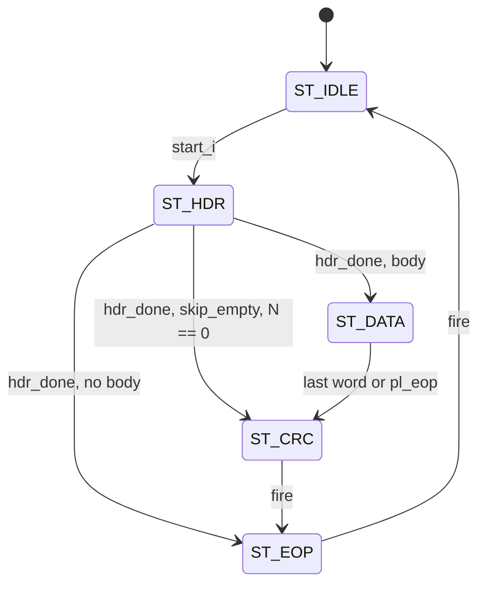

# cxp_tx_pkt_framer

Inputs chosen from the tree: RTL `src/rtl/tx/cxp_tx_pkt_framer.sv` (+ `cxp_lib_crc32.sv`, `cxp_pkg.sv`, `cxp_util_pkg.sv`); callers `cxp_tx_ctrl_ack.sv`, `cxp_tx_stream_pkt.sv`, `cxp_tx_linktest.sv`; their consumer `cxp_tx_arbiter.sv`; bound SVA `src/sva/cxp_sva.sv` (`cxp_framer_sva`, `cxp_tx_owner_sva`); unit TBs of the three callers; integration TBs `src/tb_unit/top/cxp_interface_top/`, `src/tb_unit/top/cxp_device_top/`; spec JIIA CXP-001-2015 v1.1.1 (`docs/spec/CXP-001-2015.pdf`) §8.2.1, §8.2.2, §8.2.2.1, §8.2.2.2, §8.2.5.2; output `docs/design/modules/tx/cxp_tx_pkt_framer.md`.

Emits one §8.2.2 long packet as 32-bit words under valid/ready. The caller supplies the header words (a byte replicated with `rep4()`, or a raw 32-bit value such as the Table 22 Size word), the payload word count and the payload; this block owns the word order, the CRC and the K27.7 / K29.7 framing. Every long packet the device transmits goes through it: control acknowledgments, stream data packets and connection-test packets. A packet, once started, runs to its trailer; nothing outside can drop it.

| Word | `m_data_o` | `m_kmask_o` | Flag | Present when |
|---|---|---|---|---|
| 0 | 4×K27.7 (`0xFBFBFBFB`) | `1111` | `m_sop_o` | always |
| 1 … `hdr_last_i` | `hdr_i[w]` | `0000` | — | always |
| next N | `pl_data_i`, passed through | `pl_kmask_i` | — | `has_body_i` |
| next | `crc_wire(crc)` | `0000` | — | `has_body_i & p_HAS_CRC` |
| last | 4×K29.7 (`0xFDFDFDFD`) | `1111` | `m_eop_o` | always |

N is `n_words_i`, sampled when the last header word is accepted, or fewer if `pl_eop_i` closes the payload early. P0 is `m_data_o[7:0]`.

Source `src/rtl/tx/cxp_tx_pkt_framer.sv`. The CRC is a `cxp_lib_crc32` instance `cxp_lib_crc32_i` (`p_IN_W = 32`) inside the `g_crc` generate branch. Instantiated three times, each as `cxp_tx_pkt_framer_i`:

| Parent | `p_HDR_WORDS` | `p_HAS_CRC` | `p_CRC_FROM` | Header words 1…`hdr_last_i` | Payload |
|---|---|---|---|---|---|
| `cxp_tx_ctrl_ack` | 4 | 1 | 2 | `rep4(0x03)`, `rep4(Code)`, Size word `bswap32({8'h00, B})`; `hdr_last_i` = 2 for an immediate ack (no Size), 3 for a data ack (0x00 read, 0x04 Wait) | `bswap32` of the read buffer or the Wait word, last word's pad bytes zeroed; `pl_valid_i` = 1 |
| `cxp_tx_stream_pkt` | 6 | 1 | 6 | `rep4` of 0x01, StreamID, PacketTag, DsizeP[15:8], DsizeP[7:0] | `cxp_cdc_stream_fifo` head, kmask passed through, `pl_eop_i` = `s_eop_i` |
| `cxp_tx_linktest` | 2 | 0 | 2 (default, unused) | `rep4(0x04)` | counting words from `seq_q`, `pl_valid_i` = 1 |

Two-word packets (trigger, I/O acknowledgment) do not use this block; they use `cxp_tx_short_pkt`.

## Interface

| Name | Default | Meaning |
|---|---|---|
| `p_HDR_WORDS` | 6 | Header words including the SOP word. `hdr_i` holds words 1 … `p_HDR_WORDS`−1. Legal 2…8, checked at elaboration (`g_chk_hdr`). |
| `p_HAS_CRC` | 1 | 1 = a packet with a body carries a CRC word before the EOP. 0 = no CRC word and no `cxp_lib_crc32` instance (`g_no_crc`). |
| `p_CRC_FROM` | 2 | First header word folded into the CRC. 2 = everything after the TYPE word (Tables 21/22, `cxp_tx_ctrl_ack`); `p_HDR_WORDS` = header not covered (Table 19, `cxp_tx_stream_pkt`). Legal 2…`p_HDR_WORDS` (`g_chk_crc_from`). |

| Name | Dir | Width | Description |
|---|---|---|---|
| `tx_clk` | in | 1 | Only clock, including `cxp_lib_crc32_i` |
| `tx_rst_n` | in | 1 | Active-low, asynchronous assert |
| `start_i` | in | 1 | Begin a packet. Sampled only in `ST_IDLE`; ignored in every other state, not queued |
| `hdr_last_i` | in | 3 | Index of the last header word. Read live in `ST_HDR` |
| `hdr_i` | in | `[p_HDR_WORDS-1:1][31:0]` | Header words 1 …, sent as given. Read live in `ST_HDR` |
| `has_body_i` | in | 1 | 0 = header then EOP, no payload and no CRC (immediate acknowledgment). Read at the end of the header and in the CRC enable |
| `skip_empty_i` | in | 1 | With `n_words_i` = 0: go from the header straight to the CRC word (or EOP) |
| `n_words_i` | in | 16 | Payload word count, loaded into `data_left_q` when the last header word is accepted. 0 without `skip_empty_i` means "until `pl_eop_i`" |
| `pl_data_i` | in | 32 | Payload word |
| `pl_kmask_i` | in | 4 | Payload K flags, passed through to `m_kmask_o` |
| `pl_valid_i` | in | 1 | Payload word valid; drives `m_valid_o` in `ST_DATA` |
| `pl_eop_i` | in | 1 | Last payload word. Closes the payload early in `ST_DATA` |
| `pl_ready_o` | out | 1 | `m_ready_i` in `ST_DATA`, else 0 |
| `busy_o` | out | 1 | `state_q != ST_IDLE` |
| `data_phase_o` | out | 1 | `state_q == ST_DATA` |
| `data_idx_o` | out | 16 | Payload words accepted in this packet; cleared on the start edge |
| `m_data_o` | out | 32 | Packet word, P0 = `[7:0]` |
| `m_kmask_o` | out | 4 | `1111` on SOP and EOP, `pl_kmask_i` in `ST_DATA`, else `0000` |
| `m_valid_o` | out | 1 | 1 in `ST_HDR`, `ST_CRC`, `ST_EOP`; `pl_valid_i` in `ST_DATA`; 0 in `ST_IDLE` |
| `m_sop_o` | out | 1 | `ST_HDR` with `hdr_idx_q` = 0 |
| `m_eop_o` | out | 1 | `ST_EOP` |
| `m_ready_i` | in | 1 | Downstream accepts the word (`out_fire = m_valid_o & m_ready_i`); in the top, `cxp_tx_arbiter.ready_o[port]` |
| `done_o` | out | 1 | The EOP word is accepted this cycle |

Notes:
- **Reset:** asynchronous assert clears `state_q`, `hdr_idx_q`, `data_left_q`, `data_idx_q` and the CRC register. Outputs go quiet at assertion.
- **Output timing:** every output is combinational from `state_q`, `hdr_idx_q` and the CRC register; in `ST_DATA` also from `pl_*`. `pl_ready_o` follows `m_ready_i` combinationally in `ST_DATA`. There is no path from `m_ready_i` to `m_valid_o` or `m_data_o`.
- **Caller-held inputs:** `hdr_i`, `hdr_last_i`, `has_body_i` and `skip_empty_i` are not latched here. The caller must hold them from `start_i` to the EOP; each caller latches its fields on the start edge (`code_q`/`size_bytes_q`/`nwords_q`, `curr_*_q`) or drives constants.
- **Stall:** `m_ready_i` = 0 holds every word, index and the CRC. `pl_valid_i` = 0 in `ST_DATA` drops `m_valid_o` mid-packet; downstream, `cxp_tx_inserter` would fill the cycle with IDLE (§8.2.5.2). In `cxp_interface_top` no caller does this: the ack and connection-test payloads are always valid, and `cxp_tx_stream_pkt` starts only when the whole packet is in `cxp_cdc_stream_fifo`. `cxp_tx_owner_sva` asserts it there.
- **Unchecked range:** `hdr_last_i` > `p_HDR_WORDS`−1 is not rejected. The extra header words come from the zero fill of `hdr_words` and go out as `rep4(0x00)`. No caller does this.

## How it works

1. **Header** (`cxp_tx_pkt_framer.sv:152`, `:192`). `hdr_words` is word 0 = 4×K27.7 followed by `hdr_i`, zero-filled to 8 entries. `hdr_idx_q` walks 0 … `hdr_last_i`, advancing on every `ST_HDR` fire, and the word is `hdr_words[hdr_idx_q]`; the §8.2.2.1 replication is the caller's `rep4()`. `hdr_done` is the fire of word `hdr_last_i`.
2. **Payload** (`:202`). `ST_DATA` passes `pl_*` straight through. `data_left_q` is loaded with `n_words_i` at `hdr_done` and counts down on each accepted payload word; `data_idx_q` counts up. The payload closes on the `n_words_i`-th word or on an earlier `pl_eop_i`. A source with more words than `n_words_i` keeps the rest: the framer stops reading at the count.
3. **CRC** (`:319`, `:212`). `crc_init` fires on the start edge. `crc_din_valid` folds `m_data_o` on every accepted header word with `hdr_idx_q` ≥ `p_CRC_FROM` and every accepted payload word, only when `has_body_i`. The SOP word, the type word (word 1), the CRC word and the EOP are never folded; payload K flags are ignored, so a K28.3 byte folds as D28.3. `ST_CRC` drives `crc_wire(crc_final)`.
4. **`crc_wire()`** (`src/rtl/pkg/cxp_pkg.sv`): the register unchanged, `[7:0]` in P0, as §8.2.2.2 sends it (no final XOR in `cxp_lib_crc32`). It is the one definition of the CRC wire order in the RTL: this framer transmits with it and `cxp_ctrl_cmd_parser` compares received command CRCs with it.
5. **FSM** (`:235`, sequential `:286`): 5 states in a 3-bit enum; unused encodings go to `ST_IDLE` via `default`.

| State | Next | Condition |
|---|---|---|
| `ST_IDLE` | `ST_HDR` | `start_i` |
| `ST_HDR` | `ST_EOP` | `hdr_done & !has_body_i` |
| `ST_HDR` | `ST_CRC` / `ST_EOP` | `hdr_done & has_body_i & skip_empty_i & n_words_i == 0` (`ST_EOP` when `p_HAS_CRC` = 0) |
| `ST_HDR` | `ST_DATA` | `hdr_done & has_body_i`, otherwise |
| `ST_DATA` | `ST_CRC` / `ST_EOP` | `data_fire & (data_left_q == 1 \| pl_eop_i)` |
| `ST_CRC` | `ST_EOP` | `out_fire` |
| `ST_EOP` | `ST_IDLE` | `out_fire` (`done_o`) |



With `p_HAS_CRC` = 0 (`cxp_tx_linktest`) every arrow into `ST_CRC` goes to `ST_EOP` instead (`body_end`). The `ST_HDR → ST_EOP` and `skip_empty_i` arcs are reachable only in `cxp_tx_ctrl_ack`.

Same-cycle rules:
- `start_i` in the EOP-accept cycle is ignored (the state is still `ST_EOP`), so there is at least one `ST_IDLE` cycle between packets of one framer.
- On the start edge `hdr_idx_q` and `data_idx_q` clear and the CRC reseeds in the same cycle.

Latency and throughput:
- `start_i` in cycle k (in `ST_IDLE`) → SOP word in cycle k+1.
- Packet length: `hdr_last_i` + 1 + N + (1 if a CRC) + 1 words. With `m_ready_i` and `pl_valid_i` high, one word per cycle and one idle cycle between packets.
- `data_left_q` and `data_idx_q` are 16 bits; N ≤ 65535.

Invariants, asserted by the bound `cxp_framer_sva` (`src/sva/cxp_sva.sv`): `a_flags_on_valid`, `m_sop_o`/`m_eop_o` only with `m_valid_o`; `a_no_sop_in_packet`, no SOP between an accepted SOP and an accepted EOP; `a_hold_until_ready`, a word with `m_valid_o & !m_ready_i` outside `ST_DATA` is repeated unchanged (data, kmask, SOP, EOP) next cycle. Not asserted: `m_kmask_o` = `1111` only on SOP/EOP outside `ST_DATA`; `hdr_idx_q` ≤ `hdr_last_i`.

## Who instantiates it

- **`cxp_tx_ctrl_ack`** (`cxp_tx_ctrl_ack.sv:218`): `start_i` = `ack_req_i`, `has_body_i` = `!is_bare`, `skip_empty_i` = 1 so a read of N = 0 still gets a CRC, `n_words_i` = `nwords_q` (1 for a Wait), `pl_eop_i` = 0. It uses `busy_o` as `ack_busy_o` and `data_phase_o`/`data_idx_o` to drive the read-buffer prefetch address. See `cxp_tx_ctrl_ack.md`.
- **`cxp_tx_stream_pkt`** (`cxp_tx_stream_pkt.sv:197`): `start_i` = `sop_ready` (a SOP at the FIFO head with the whole packet in, the stream enabled, not TestMode, not discarding), `n_words_i` = `curr_dsizeP_q` (the packet's length `s_len_i`, latched on the start edge). It uses `done_o` to bump the PacketTag. An `s_eop_i` before `s_len_i` words closes the packet early with a DsizeP that over-states the payload; `cxp_cdc_stream_fifo` never does this. See `cxp_tx_stream_pkt.md`.
- **`cxp_tx_linktest`** (`cxp_tx_linktest.sv:267`): `start_i` on each entry to its `ST_PKT`, `n_words_i` = `DATA_WORDS`, `pl_eop_i` = 0, no CRC. It uses `pl_ready_o` to advance `seq_q` and `done_o` to count packets. See `cxp_tx_linktest.md`.

In `cxp_interface_top` each caller's `m_*` bundle is `tx_src[TX_PORT_*]` into `cxp_tx_arbiter`, and `m_ready_i` is the matching `tx_ready` bit: high when the arbiter offers this port's word and `cxp_tx_inserter` takes it. The inserter withholds it for trigger and I/O-ack words and for the IDLE it sends every 95 words, so a packet on the wire is stretched but never cut.

## Verification

Tools: Verilator 5.046 with cocotb 2.0.1; every bench compiles `sva` with `--assert`, so `cxp_framer_sva` runs in each of them. There is no unit TB of this module on its own. FSM coverage of the framer's `state_q` is collected in two caller benches: `src/tb_unit/tx/cxp_tx_ctrl_ack` registers `cxp_tx_ctrl_ack_i.cxp_tx_pkt_framer_i.state_q` (5 states, 7 arcs) and `src/tb_unit/tx/cxp_tx_stream_pkt` registers `cxp_tx_stream_pkt_i.cxp_tx_pkt_framer_i.state_q` (5 states, 5 arcs); `src/tb_unit/tx/cxp_tx_linktest` registers only the outer `ST_IDLE`/`ST_PKT`/`ST_GAP` FSM (Minor 1).

| Bench | Tests | What reaches the framer |
|---|---|---|
| `src/tb_unit/tx/cxp_tx_ctrl_ack` | 16/16 | Immediate (`has_body_i` = 0) and data acks, N = 0 via `skip_empty_i`, Wait, Size not a multiple of 4 (`test_15_read_b3`), random back-pressure, CRC against `zlib` in the device's wire order; FSM 5/5 states, 7/7 arcs |
| `src/tb_unit/tx/cxp_tx_stream_pkt` | 16/16 | Early `pl_eop_i` (`test_11_dsizeP_under_supply`), K-mask passthrough, back-pressure, 257-packet tag wrap, TestMode rising in `ST_HDR`/`ST_DATA` completes the packet (`test_12`, `test_13`), start only on a whole packet (`test_15_len_and_pkt_avail`); FSM 5/5 states, 5/5 arcs |
| `src/tb_unit/tx/cxp_tx_linktest` | 10/10 | Two-word header, no CRC, `n_words_i` = `DATA_WORDS`, back-pressure (`test_08_random_ready_stalls`) |
| `src/tb_unit/top/cxp_interface_top` | not re-run | All three instances behind the real arbiter and inserter; link-reset traffic, stream from the TPG, test packets under TestMode with triggers inserted |
| `src/tb_unit/top/cxp_device_top` | not re-run | Serial reads and writes end to end (data and immediate acks decoded by `cxp_protocol`), 1024-word test packets checked word by word, stream images reassembled without CRC or tag errors, TestMode entry and exit never cutting a packet (`test_28_testmode_vs_stream`) |

### Running

```
make -C src/tb_unit/tx/cxp_tx_ctrl_ack WAVES=0
make -C src/tb_unit/tx/cxp_tx_stream_pkt WAVES=0
make -C src/tb_unit/tx/cxp_tx_linktest WAVES=0
make -C src/tb_unit/top/cxp_interface_top WAVES=0
make -C src/tb_unit/top/cxp_device_top WAVES=0
```

2026-09-26, working tree on `3dc65a2`: the three caller benches pass with the counts in the table, no SVA failure. `cxp_interface_top` and `cxp_device_top` not re-run here.

### Not covered in-tree

- **`pl_valid_i` low in `ST_DATA`** in the top: excluded by the callers and by `a_owner_valid`; no unit test targets it.
- **`hdr_last_i` > `p_HDR_WORDS`−1, `p_HDR_WORDS` = 8:** unreachable from the callers.
- **N = 65535 and `n_words_i` = 0 without `skip_empty_i`:** only the stream caller can produce them; see `cxp_tx_stream_pkt.md`.
- **Reset mid-packet:** untested; outputs drop in the same cycle.

## Known issues and recommendations

### Critical

None.

### Medium

None.

### Minor

1. **The link-test bench does not cover the framer's FSM.** `test_cxp_tx_linktest.py` registers only the parent's `ST_IDLE`/`ST_PKT`/`ST_GAP`. Register `cxp_tx_linktest_i.cxp_tx_pkt_framer_i.state_q` as well (states `ST_IDLE`, `ST_HDR`, `ST_DATA`, `ST_EOP`; no `ST_CRC` with `p_HAS_CRC` = 0). *Effort:* 15 min.
2. **No check on `hdr_last_i`.** It is an input, so only an assertion can cover it: `busy_o |-> hdr_last_i <= p_HDR_WORDS-1`. *Effort:* 15 min.
3. **SVA to add:** `m_kmask_o == 4'hF` only with `m_sop_o | m_eop_o` outside `ST_DATA`; `done_o` implies `m_eop_o`; a beat count between SOP and EOP of `hdr_last_i` + 1 + N + CRC + 1 when no early `pl_eop_i`. *Effort:* 1 h.

### Open questions

1. **Verification:** should the framer get its own unit TB, now that three modules depend on it, or stay covered through its callers?
