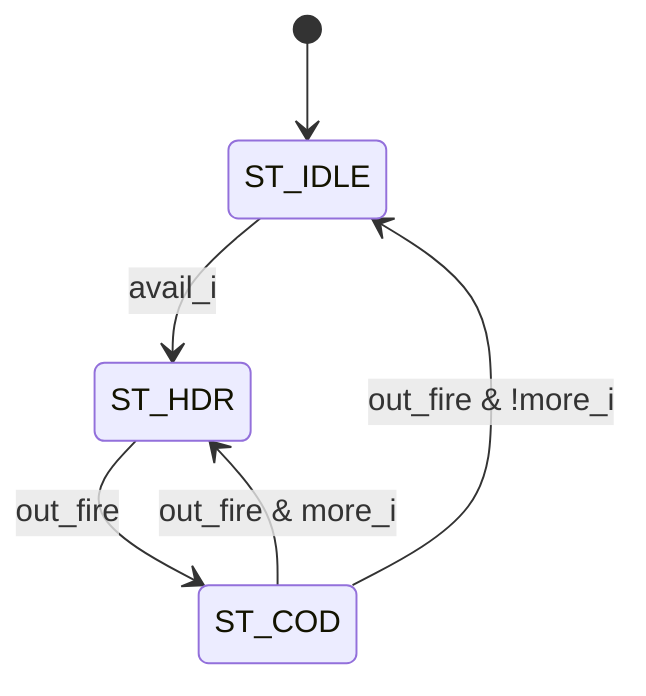

# cxp_tx_short_pkt

Inputs chosen from the tree: RTL `src/rtl/tx/cxp_tx_short_pkt.sv` (+ `cxp_pkg.sv`, `cxp_util_pkg.sv`); its two callers `src/rtl/tx/cxp_tx_trigger_hs.sv` and `src/rtl/tx/cxp_tx_io_ack.sv`; their consumer `src/rtl/tx/cxp_tx_inserter.sv`; bound checkers `cxp_short_pkt_sva` and `cxp_inserter_sva` in `src/sva/cxp_sva.sv`; unit TBs of the callers `src/tb_unit/tx/cxp_tx_trigger_hs/`, `src/tb_unit/tx/cxp_tx_io_ack/`; integration TBs `src/tb_unit/top/cxp_interface_top/`, `src/tb_unit/top/cxp_device_top/`; spec JIIA CXP-001-2015 v1.1.1 §8.2.4 / Table 13, §8.3.2.2 / Table 16, §8.3.3 / Table 17; regression `make -C src/tb_unit`; output `docs/design/modules/tx/cxp_tx_short_pkt.md`.

Shared 2-word "leader + code" packet source. It holds the 3-state packet FSM and the output mux used by both high-speed short packets on the downlink; the caller keeps its own event state and chooses the leader K-code and the code byte. A packet, once started, is always sent whole.

| Word | `m_data_o` | `m_kmask_o` | Flag | Trigger (Table 16) | I/O ack (Table 17) |
|---|---|---|---|---|---|
| 0 | `rep4(leader_i)` | `1111` | `m_sop_o` | 4×K28.4 (asserted) or 4×K28.2 (de-asserted) | 4×K28.6 |
| 1 | `rep4(code_i)` | `0000` | `m_eop_o` | 4×Delay (constant 0x00) | 4×0x01 |

Source `src/rtl/tx/cxp_tx_short_pkt.sv`. No module instantiates it directly except the two callers, each with one instance named `cxp_tx_short_pkt_i`:

| Caller | `avail_i` | `more_i` | `leader_i` | `code_i` | `start_o` | `busy_o` | `done_o` |
|---|---|---|---|---|---|---|---|
| `cxp_tx_trigger_hs` | `send` (level to send differs from the host's, no acknowledgment awaited, link up) | `1'b0` | `leader_q` (K28.4 / K28.2, latched on `start`) | `DELAY` (0x00) | `start` (latches `leader_q` and `host_lvl_q`) | open | `done` (starts the acknowledgment wait) |
| `cxp_tx_io_ack` | `work_avail` | `work_more` | `cxp_pkg::K28_6` | `p_ACK_CODE` (0x01) | open | open | `ack_done` (decrements `pend_q`) |

The open outputs are waived in `src/rtl/cxp_ip.vlt` (`PINCONNECTEMPTY`). In `cxp_interface_top` the trigger source drives `tx_trig` into `cxp_tx_inserter_i.trig_i` and the I/O-ack source drives `tx_ioack` into `ioack_i`; `m_ready_i` is `trig_ready_o` / `ioack_ready_o`. See `cxp_tx_trigger_hs.md` and `cxp_tx_io_ack.md` for the event logic around this block.

## Interface

No parameters.

| Name | Dir | Width | Description |
|---|---|---|---|
| `tx_clk` | in | 1 | TX word clock; one 32-bit word (4 characters) per cycle |
| `tx_rst_n` | in | 1 | Active-low reset, asynchronous assert; clears `state_q` to `ST_IDLE` |
| `avail_i` | in | 1 | Work queued. In `ST_IDLE` it starts a packet: `ST_HDR` next cycle |
| `more_i` | in | 1 | Work queued behind this packet. Sampled when the code word is accepted: 1 goes straight to `ST_HDR` (back-to-back), 0 to `ST_IDLE` |
| `leader_i` | in | 8 | K-code for word 0. Must hold for the whole packet |
| `code_i` | in | 8 | Data byte for word 1. Must hold for the whole packet |
| `start_o` | out | 1 | Packet committed this cycle: `state_n == ST_HDR && state_q != ST_HDR`. Covers both `ST_IDLE → ST_HDR` and the back-to-back `ST_COD → ST_HDR` |
| `busy_o` | out | 1 | `state_q != ST_IDLE` |
| `done_o` | out | 1 | Code word accepted this cycle: `state_q == ST_COD && m_valid_o && m_ready_i` |
| `m_data_o` | out | 32 | `rep4(leader_i)` in `ST_HDR`, `rep4(code_i)` in `ST_COD`, 0 in `ST_IDLE` |
| `m_kmask_o` | out | 4 | `KMASK_ALL` in `ST_HDR`, `KMASK_NONE` otherwise |
| `m_valid_o` | out | 1 | 1 in `ST_HDR` and `ST_COD` |
| `m_sop_o` | out | 1 | 1 in `ST_HDR` |
| `m_eop_o` | out | 1 | 1 in `ST_COD` |
| `m_ready_i` | in | 1 | Same-cycle accept from `cxp_tx_inserter` (`trig_ready_o` / `ioack_ready_o`) |

Notes:
- **Reset:** `always_ff @(posedge tx_clk or negedge tx_rst_n)` (`cxp_tx_short_pkt.sv:152`); outputs go quiet at assertion without a clock edge. Deassertion must be synchronised by the integration.
- **Clock domain:** `tx_clk` only; no crossing.
- **Output timing:** every output is combinational from `state_q`, `leader_i` and `code_i` (`:98`–`:132`); `start_o` also from `avail_i`/`more_i` and `m_ready_i`, `done_o` from `m_ready_i`. A stalled word is held bit-exact as long as the caller holds `leader_i`/`code_i`, which both callers do.
- **No cancel:** once `ST_HDR` is entered the packet completes; dropping `avail_i` does not withdraw it.
- **No queue:** the block starts one packet per `avail_i`/`more_i` decision and forgets it once `done_o` fires. Counting events is the caller's job.

## How it works

1. **Output mux** (`:98`). `ST_IDLE` drives zeros. `ST_HDR` drives `rep4(leader_i)` with all four K flags and `m_sop_o`. `ST_COD` drives `rep4(code_i)` as data with `m_eop_o`.
2. **FSM** (`:138`, 2-bit enum, code 3 unreachable, `default` → `ST_IDLE`). `out_fire = m_valid_o & m_ready_i`.

| State | Next | Condition |
|---|---|---|
| `ST_IDLE` | `ST_HDR` | `avail_i` |
| `ST_HDR` | `ST_COD` | `out_fire` |
| `ST_COD` | `ST_HDR` | `out_fire & more_i` |
| `ST_COD` | `ST_IDLE` | `out_fire & !more_i` |
| any | same | otherwise |



Latency with `m_ready_i` = 1: `avail_i` in cycle c → HDR offered in c+1 → code word in c+2 → `ST_IDLE` in c+3, or HDR again in c+3 when `more_i` was high. Throughput: one packet per 2 cycles, no gap between back-to-back packets.

## Users

- **`cxp_tx_trigger_hs`** — device→host high-speed trigger (Table 16). One packet at a time (`more_i` = 0); after `done_o` it waits for the host's I/O acknowledgment or its timeout before the next packet. See `cxp_tx_trigger_hs.md`.
- **`cxp_tx_io_ack`** — I/O acknowledgment (Table 17). `done_o` decrements the pending counter; `more_i` sends queued acknowledgments back to back. See `cxp_tx_io_ack.md`.
- **Inserter** — `cxp_tx_inserter` accepts the leader when its run limits allow (trigger at run ≤ 97, I/O acknowledgment at run ≤ 95) and then accepts the code word in the very next cycle, unconditionally. So in the top `ST_HDR` may wait a few cycles, but `ST_COD` always lasts exactly one cycle, and a trigger never splits an I/O acknowledgment or the reverse. The inserter relies on `m_valid_o` being high in `ST_COD`, which this FSM guarantees. Neither packet is held in TestMode. See `cxp_tx_inserter.md`.

## Verification

Verilator 5.046 with cocotb 2.0.1. There is no unit TB for this block; it is exercised through its callers.

- **SVA.** `cxp_short_pkt_sva` (`src/sva/cxp_sva.sv`) is bound into every instance and compiled into every cocotb bench (built with `--assert`): `a_hold_until_ready`, a valid word that is not accepted is still valid, with the same data and kmask, on the next cycle. It does not check `m_sop_o`/`m_eop_o` stability or the word contents. In `cxp_interface_top`, `cxp_inserter_sva` checks from the other side that each leader is followed by its second word on the next cycle (`a_trig_contiguous`, `a_ioack_contiguous`).
- **`src/tb_unit/tx/cxp_tx_trigger_hs`** (13 tests) and **`src/tb_unit/tx/cxp_tx_io_ack`** (9 tests) drive every arc the callers use: `ST_IDLE → ST_HDR → ST_COD → ST_IDLE`, the back-to-back `ST_COD → ST_HDR` (I/O-ack TB `test_05_backpressure_and_queue`, `test_06_burst_two`), and the held HDR under back-pressure (trigger TB `test_06_backpressure_holds_packet`, I/O-ack TB `test_05_backpressure_and_queue`). Both wrappers drive `m_ready` from Python, not through the inserter.
- **FSM coverage** is collected on `<caller>_i.cxp_tx_short_pkt_i.state_q`: the trigger TB declares 3 states and 3 arcs (no back-to-back arc, since `more_i` = 0), the I/O-ack TB 3 states and 4 arcs.
- **`src/tb_unit/top/cxp_interface_top`**: `test_08`–`test_11` and `test_19` carry real trigger packets through the inserter.
- **`src/tb_unit/top/cxp_device_top`** (`p_ASYNC_CLOCKS` = 1): `test_07_host_trigger` (one I/O ack with code 0x01), `test_27_ioack_latency_under_stream`, `test_29_ioack_in_testmode`, `test_31_nested_preempt` (trigger and I/O ack close together, neither torn), `test_12_idle_cadence_per_packet_type` (triggers never split by an IDLE), all checked by the golden host decoder.

### Running

```
make -C src/tb_unit/tx/cxp_tx_trigger_hs WAVES=0
make -C src/tb_unit/tx/cxp_tx_io_ack WAVES=0
```

2026-09-26, working tree on `3dc65a2`: I/O-ack unit TB 9/9, FSM coverage 3/3 states and 4/4 arcs, no SVA failure. The trigger unit TB, `cxp_interface_top` and `cxp_device_top` were not re-run here.

## Known issues and recommendations

### Minor

1. `leader_i`/`code_i` must hold for the whole packet; nothing checks it. Extend `cxp_short_pkt_sva` with `$stable(leader_i) && $stable(code_i)` while `busy_o`, and with `m_sop_o`/`m_eop_o` stability under stall.
2. `busy_o` is unused by both callers (waived in `cxp_ip.vlt`) and `start_o` by the I/O-ack caller. Keep them for the interface, or remove `busy_o` if no user appears.
