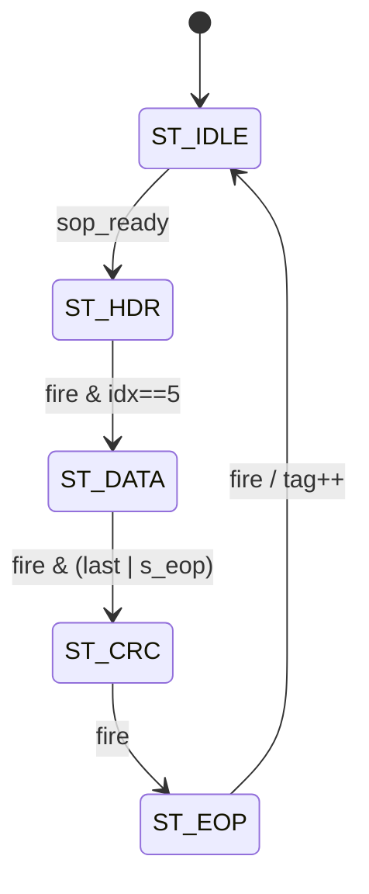

# cxp_tx_stream_pkt

Frames a flat payload stream into CoaXPress type-0x01 stream data packets: it adds the SOP, the replicated header, a CRC and the EOP around the packet's payload (DsizeP = the packet's length `s_len_i`), and keeps one PacketTag counter per StreamID. A packet starts only once the FIFO holds all of it, and once started it runs to its trailer.

| Wire word | Content | Table 19 word |
|---|---|---|
| 0 | 4×K27.7, `m_o.kmask` = 1111, `m_o.sop` | SOP |
| 1 | 4×0x01 | packet type |
| 2 | 4×StreamID | 0 |
| 3 | 4×PacketTag | 1 |
| 4 / 5 | 4×DsizeP[15:8] / 4×DsizeP[7:0] | 2 / 3 |
| 6 … N+5 | N payload words, data and kmask passed through | 4 … N+3 |
| N+6 | CRC, `crc_wire(crc_o)` = the `cxp_lib_crc32` register over the data words 6 … N+5 | N+4 |
| N+7 | 4×K29.7, `m_o.kmask` = 1111, `m_o.eop` | EOP |

- Source: `src/rtl/tx/cxp_tx_stream_pkt.sv`. The module owns the header fields, the PacketTag table, the start condition and the whole-packet drop while the stream is disabled. SOP, header replication, CRC and EOP come from a `cxp_tx_pkt_framer` instance `cxp_tx_pkt_framer_i` (`p_HDR_WORDS` = 6, `p_HAS_CRC` = 1, `p_CRC_FROM` = 6), which also holds the FSM; see `cxp_tx_pkt_framer.md`.
- Instantiated once, in `cxp_app_stream` (`cxp_tx_stream_pkt_i`). It is fed by `cxp_cdc_stream_fifo`, whose SOP/EOP come from the DsizeP chopper on `app_clk` and whose per-packet descriptor gives `s_len_i` and `s_streamid_i`. It feeds port `TX_PORT_STREAM` (2), the lowest-priority of the three long-packet ports of `cxp_tx_arbiter` in `cxp_interface_top`.
- Spec: CXP 1.1.1 (JIIA CXP-001-2015) §8.5.1 Table 19, §8.5.2, §8.5.3, §8.2.2.1, §8.2.2.2, §8.2.4, §8.2.5.2, §8.7.4.

## Interface

No parameters.

| Name | Dir | Width | Description |
|---|---|---|---|
| `tx_clk` | in | 1 | Only clock |
| `tx_rst_n` | in | 1 | Active-low, asynchronous assert |
| `stream_ctrl_reset_i` | in | 1 | Clears all 256 PacketTags on the next edge. A packet in flight keeps the tag its header carries and does not bump the table at its trailer (`tag_rst_q`) |
| `stream_en_i` | in | 1 | A stream packet fits in StreamPacketSizeMax (`cxp_device_top`: register ≥ 36 bytes). While low no packet starts; the packets behind the one in flight wait in the FIFO and go out when it rises again (since 2026-10-04; before, each was read and dropped whole) |
| `suppress_stream_i` | in | 1 | TestMode (§8.7.4): no new packet starts while high (`sop_ready` gated). A packet already started completes |
| `s_data_i` | in | 32 | Payload word, P0 in [7:0] |
| `s_kmask_i` | in | 4 | Per-lane K flag, passed through in `ST_DATA` (K28.3 markers) |
| `s_valid_i` | in | 1 | Payload beat valid |
| `s_sop_i` | in | 1 | First payload word of a packet; the SOP beat is also data word 0 |
| `s_eop_i` | in | 1 | Last payload word of a packet |
| `s_streamid_i` | in | 8 | StreamID of the packet at the head, latched at start |
| `s_len_i` | in | 16 | Payload words of the packet at the head (`cxp_cdc_stream_fifo` `m_len_o`), latched at start as DsizeP |
| `s_pkt_avail_i` | in | 1 | The head packet is stored whole; a packet starts only then |
| `s_ready_o` | out | 1 | Combinational: the framer's `pl_ready_o` (`m_ready_i` in `ST_DATA`, else 0) |
| `m_o.data` | out | 32 | Framed word |
| `m_o.kmask` | out | 4 | K flags of `m_o.data` |
| `m_o.valid` | out | 1 | 1 in `ST_HDR`/`ST_CRC`/`ST_EOP`; `s_valid_i` in `ST_DATA`; 0 in `ST_IDLE` |
| `m_o.sop` | out | 1 | `ST_HDR` with `hdr_idx_q` = 0 only |
| `m_o.eop` | out | 1 | `ST_EOP` only |
| `m_ready_i` | in | 1 | Downstream accept |
| `busy_o` | out | 1 | `busy`: the framer has a packet in flight. `cxp_app_stream` feeds it to `cxp_cdc_stream_fifo.m_busy_i`, so a flush waits for the packet to leave the FIFO |

States named here are those of `cxp_tx_pkt_framer_i.state_q`.

Notes:
- **Reset:** every flop, including the 256 tag valid bits (`tag_vld_q`) and `tag_rst_q`, resets asynchronously on `tx_rst_n` low. The port comment says "sync-deassert"; the RTL has no synchroniser (release ordering is `cxp_cdc_reset`'s job in `cxp_device_top`).
- **Clocks:** one domain. `s_streamid_i` and `s_len_i` come from the FIFO's per-packet descriptor, written on `app_clk` before the packet is announced by `s_pkt_avail_i`. `stream_ctrl_reset_i` is `crst_tx | conn_cfg_wr_tx`: the ConnectionReset level, high for as long as the register file holds the ConnectionReset bit, or the one-cycle pulse of any ConnectionConfig write, same value included (§8.5.3). `suppress_stream_i` is `linktest_suppress_traffic` from `cxp_tx_linktest`.
- **Registration:** all outputs are combinational from the framer's `state_q`, `hdr_idx_q` and, in `ST_DATA`, from the upstream beat. `s_ready_o` follows `m_ready_i` combinationally in `ST_DATA`.
- **Stall:** `m_ready_i` = 0 holds every output and counter. `s_valid_i` = 0 in `ST_DATA` would drop `m_o.valid` mid-packet; with `s_pkt_avail_i` from the store-and-forward FIFO this does not happen, and `cxp_tx_owner_sva` in `cxp_interface_top` asserts it.

## How it works

1. **Start and latch.** `sop_ready = s_valid_i & s_sop_i & s_pkt_avail_i & stream_en_i & ~suppress_stream_i` and `start = !busy & sop_ready` watch the FIFO head without consuming it. On that edge the module latches StreamID, DsizeP (`s_len_i`) and `tag_table_q[StreamID]` into `curr_*_q` and clears `tag_rst_q`; the framer starts on the same edge (`start_i = sop_ready`, ignored outside `ST_IDLE`) and seeds the CRC.
2. **Framing.** `hdr` holds 0x01, StreamID, tag and the two DsizeP bytes. The framer emits wire words 0–5, passes the payload through in `ST_DATA` (counting down `data_left_q` from `curr_dsizeP_q`), and closes the payload on the `curr_dsizeP_q`-th word or on an earlier `s_eop_i`, then emits the CRC and EOP. Nothing outside can stop a packet once started.

| State | Next | Condition |
|---|---|---|
| `ST_IDLE` | `ST_HDR` | `sop_ready` |
| `ST_HDR` | `ST_DATA` | `out_fire & hdr_idx_q == 5`; loads `data_left_q ← curr_dsizeP_q` |
| `ST_DATA` | `ST_CRC` | `data_fire & (data_left_q == 1 \| s_eop_i)` |
| `ST_CRC` | `ST_EOP` | `out_fire` |
| `ST_EOP` | `ST_IDLE` | `out_fire` (`done`); `tag_mem[sid] ← curr_tag_q + 1`, `tag_vld_q[sid] ← 1` unless `tag_rst_q` |



3. **TestMode.** `suppress_stream_i` only removes the start condition. A packet whose SOP has left keeps going to its trailer; the SOP of the next packet stays unconsumed at the FIFO head until the input falls. In `cxp_interface_top` TestMode also raises the stream flush, which empties the FIFO once `busy_o` falls, so what was queued behind the finished packet never goes out (`cxp_app_stream.md` How it works 5). The PacketTag of the completed packet is bumped as usual.
4. **Stream disabled.** While `stream_en_i` is low no packet starts; a packet that started before it fell completes, and the packets behind it stay in the FIFO until it rises. An image already begun on the wire is therefore completed, not torn. Until 2026-10-04 each packet reaching the head was read and dropped whole (`disc_q`), which tore the image in flight whenever the host wrote a StreamPacketSizeMax below 36 bytes mid-image (emulator CXP-CAM-BND-003b, intermittent: 30 of 32 lines). What a ConnectionReset, a ConnectionConfig write or TestMode must not send later is emptied by the FIFO flush.
5. **CRC.** The framer (`p_CRC_FROM` = 6) seeds on the start edge and folds `s_data_i` on each accepted data word only (Table 19, "stream data 4 to (N+3)"), ignoring `s_kmask_i`, so K28.3 folds as D28.3 as §8.2.2.2 requires. The header words, K27.7 and K29.7 are not folded. The CRC word is `crc_wire(crc_o)` from `cxp_pkg`, the register with `[7:0]` in P0.
6. **PacketTag.** The tag table holds 256 8-bit counters indexed by StreamID: `tag_mem` (RAM, no reset) with a valid bit per entry (`tag_vld_q`); an entry without its bit reads 0. A tag is bumped only when the trailer is accepted (`done`) and wraps 0xFF→0x00. `stream_ctrl_reset_i` clears all 256 in one cycle (the valid bits) and sets `tag_rst_q ← busy | start`, so a packet in flight — or starting in that cycle, whose header has just read the old tag — keeps its header tag and its trailer leaves the table at 0; the next packet carries tag 0 (test_17, test_18).
7. **Length handling.** DsizeP in the header is `s_len_i` as latched at start, which in `cxp_app_stream` is exactly the packet's payload. For a source that does not keep that contract: an `s_eop_i` before `s_len_i` words closes the packet early with the header still announcing `s_len_i` (test_11); `s_len_i` = 0 loads `data_left_q` = 0, so the packet runs until `s_eop_i` with DsizeP 0 in the header; more than `s_len_i` words are not dropped: after the `s_len_i`-th word the framer sends CRC and EOP and the remainder, without a SOP, stays at the FIFO head where it blocks every later start. No error is flagged on any of these paths (Medium 1).

Same-cycle rules:
- `stream_ctrl_reset_i` on the trailer edge: the clear wins over the bump (later assignment).
- `stream_ctrl_reset_i` on the start edge: `curr_tag_q` latches the old tag and `tag_rst_q` is set by `start`, so that packet keeps the old tag and the next one carries 0 (test_18).
- `suppress_stream_i` rising on the start edge: `sop_ready` is already 0, so the packet does not start.

Latency and throughput:
- A SOP beat at the FIFO head in cycle *k* (framer idle, `s_pkt_avail_i` = 1) puts K27.7 on `m_o.data` in cycle *k*+1. The SOP beat itself is consumed in the first `ST_DATA` cycle, 7 cycles after it appears at full ready.
- One packet takes N + 8 wire words plus 1 `ST_IDLE` cycle, so N + 9 cycles back to back at full ready.

Invariants: the bound `cxp_framer_sva` asserts that SOP/EOP appear only on valid beats, that no SOP appears inside a packet, and that header, CRC and EOP beats hold while not accepted. `cxp_tx_owner_sva` (bound in `cxp_interface_top`) asserts that the stream port offers a word in every cycle it owns the arbiter. Not asserted: `s_ready_o` = 0 in `ST_IDLE`/`ST_HDR`/`ST_CRC`/`ST_EOP` outside a whole-packet drop; `data_left_q` never wraps below 0.

## Arbiter integration

- **Slot:** port `TX_PORT_STREAM` (2), lowest of the three long-packet ports of `cxp_tx_arbiter` (control acknowledgment > connection test > stream). The arbiter picks a port only between packets and only on a valid SOP, which this module drives only in `ST_HDR` index 0; once the SOP is taken the stream owns the arbiter until its EOP is taken. Nothing pre-empts it at the arbiter.
- **Handshake:** `m_ready_i` is the arbiter's `ready_o[TX_PORT_STREAM]`, which is `cxp_tx_inserter.long_ready_o` while the stream is selected: 1 when the offered word is valid and no trigger or I/O-acknowledgment word and no IDLE is due. In `ST_DATA`, `s_ready_o = m_ready_i`, so the FIFO read strobe is combinational through the framer, the arbiter mux and the inserter. There is no loop: `m_o.valid` does not depend on `m_ready_i`. A word taken in cycle *k* is on `cxp_if_data_o` in cycle *k*+1 (the inserter registers the wire word).
- **Insertion (§8.2.4, §8.2.5):** triggers, I/O acknowledgments and IDLE words are inserted between this packet's words by `cxp_tx_inserter`; here they appear as cycles with `m_ready_i` = 0. §8.2.5.2 allows IDLE inside a high-speed packet. The control acknowledgment and the connection-test packet wait for this packet's EOP (N + 8 words, N ≤ `p_FIFO_DEPTH` − 8).
- **Store-and-forward contract:** the arbiter has no watchdog and cannot drop a packet; the owner must offer a word in every cycle it holds the arbiter. This module meets that because it starts only on `s_pkt_avail_i`; `cxp_tx_owner_sva` checks it.
- **TestMode:** `suppress_stream_i` (`linktest_suppress_traffic`) holds new packets only; the packet on the wire completes with CRC and EOP, and the flush that TestMode raises empties the rest (`cxp_device_top` test_28).
- **Packet-size gate:** `cxp_device_top` turns StreamPacketSizeMax (bytes) into the chopper's payload size and drives `stream_en_i` low while it is below 36 bytes (the smallest Table 19 packet), 0 included; no image enters then (`cxp_app_acq_ctrl`) and this module holds what is already queued until the value is usable again.
- **Flush:** a ConnectionReset, a ConnectionConfig write or TestMode flushes `cxp_cdc_stream_fifo`. The FIFO waits for `busy_o` to fall, so a packet this module has started (and has whole in the FIFO) completes; after that nothing it would have read is presented.

## Verification

Verilator 5.046 with cocotb 2.0.1. The bound SVA of `src/sva/cxp_sva.sv` (`cxp_framer_sva`) runs in every bench with `--assert`. FSM coverage: the unit TB registers `cxp_tx_stream_pkt_i.cxp_tx_pkt_framer_i.state_q` with the five states and five designed arcs; the last run covered 5/5 states and 5/5 arcs.

### Unit TB — `src/tb_unit/tx/cxp_tx_stream_pkt`

`tb_cxp_tx_stream_pkt_top` renames the ports without the `_i`/`_o` suffixes and adds `TESTCASE`. The clock is 8 ns; reset is held 8 cycles, then 4 idle cycles; `s_pkt_avail` = 1 and `stream_en` = 1 unless stated. `PktTxDriver` presents beats back to back, holds each until `s_valid & s_ready`, drives `s_len` with the packet's length (unless the test gives another) and always drives `s_kmask` = 0. `m_ready` = 1 unless stated. Shared checkers: `split_packets` asserts no SOP inside a packet, no beat outside one and no packet left open; `check_packet` asserts length N + 8, the 6 header words exactly, each data word with kmask 0 and no SOP/EOP, the CRC word against the golden `cxp_protocol.crc` over the data words, and the trailer.

| Test | Stimulus | Expect |
|---|---|---|
| test_01_header_field_layout | 1 packet, N = 4, SID 0x55 | `check_packet`, tag 0 |
| test_02_crc32_random | 5 random packets, N = 8 | `check_packet`, tags 0–4 |
| test_03_packet_tag_wrap | 257 packets, N = 1 | tag byte = i & 0xFF, 4× replicated |
| test_04_trailer_k29_7 | 5 packets on 5 SIDs, N = 3 | one EOP per packet, on 4×K29.7 |
| test_06_backpressure | 3 packets, N = 6, `m_ready` 30 % low | `check_packet` on all |
| test_07_per_stream_tag_independent | A B A B A B, N = 2 | tags 0,1,2 per SID |
| test_08_idle_between_packets | 1 packet, N = 2 | `m_valid` = 0 after EOP |
| test_09_single_data_word | 2 packets, N = 1 | tags 0, 1 |
| test_10_stream_ctrl_reset_restarts_tag | 3 packets, clear while idle, 2 packets | tags [0,1,2] then [0,1] |
| test_11_dsizeP_under_supply | 3 words with `s_len` 8, then 8 words | DsizeP 8 with 3 words, then tag 1 |
| test_12_suppress_mid_data_completes_packet | suppress after 3 data words | A completes, B waits; tags 0, 1 |
| test_13_suppress_mid_header_completes_packet | suppress after 3 header words | A completes, B waits; tags 0, 1 |
| test_14_suppress_in_idle_preserves_tag_sequence | suppress 15 cycles while idle | next packet tag 1 |
| test_15_len_and_pkt_avail | `s_pkt_avail` = 0 for 40 cycles; `s_len` 3, then 12 | nothing sent while held; DsizeP 3, 12 |
| test_16_stream_disabled_holds_packets | `stream_en` = 0 after B's SOP; 3 more packets | A, B complete; the rest not read while low, then sent with tags 2, 3, 4 |
| test_17_ctrl_reset_mid_packet | clear two edges after B's SOP | tags 0, 1, 0 |
| test_18_ctrl_reset_on_start_edge | one-cycle clear swept over 30 cycles of four 2-word packets | after the clear the tags run 0, 1, … (the packet starting on the clear's edge may keep its old tag) |

#### test_01_header_field_layout
- *Stimulus:* one packet on SID 0x55 with data `DEADBEEF CAFEF00D 0BADC0DE 12345678` (`s_len` 4); 80-cycle window.
- *Checks:* 1 packet; `check_packet` with tag 0, DsizeP 4.
- *Proves:* the full arc chain `ST_IDLE → ST_HDR → ST_DATA → ST_CRC → ST_EOP → ST_IDLE` and the header byte mux for indices 0–5.

#### test_02_crc32_random
- *Stimulus:* 5 packets of 8 random words (seed 0xC0FFEE) on SID 0x10; 600 cycles.
- *Checks:* 5 packets; `check_packet` on each with tag 0–4.
- *Proves:* the CRC reseeds per packet and covers the data words only, against the golden `cxp_protocol.crc`.

#### test_03_packet_tag_wrap
- *Stimulus:* 257 one-word packets (seed 0xBEEF) on SID 0xA5; 257 × 16 + 200 cycles.
- *Checks:* 257 packets; per packet the tag byte equals i & 0xFF; the tag word is 4× replicated; `check_packet`.
- *Proves:* the 8-bit the tag table (`tag_mem` / `tag_vld_q`) entry wraps 0xFF → 0x00 on the trailer bump.

#### test_04_trailer_k29_7
- *Stimulus:* one random 3-word packet (seed 0xD00D) on each SID 1, 2, 3, 0x80, 0xFF; 400 cycles.
- *Checks:* 5 packets; exactly one EOP beat per packet; the last beat has `m_eop` = 1, data 4×K29.7 and kmask 0xF. It does not call `check_packet`.
- *Proves:* the `ST_EOP` outputs and `m_o.eop` alignment. Header, CRC and tags are not checked here.

#### test_06_backpressure
- *Stimulus:* 3 random 6-word packets (seed 0x5A5A) on SID 0x77; `m_ready` = 0 with probability 0.3 per cycle (seed 0xDEADBEEF); 1500 cycles.
- *Checks:* 3 packets; `check_packet` on each with tags 0–2.
- *Proves:* `hdr_idx_q`, `data_left_q`, the CRC and the tag advance only on accepted words, and the outputs hold under stall. Which states were stalled is not recorded.

#### test_07_per_stream_tag_independent
- *Stimulus:* 6 two-word packets alternating SID 0x21 and 0x42 (seed 0x123); 400 cycles.
- *Checks:* 6 packets; `check_packet` with a separate expected tag per SID, each walking 0, 1, 2.
- *Proves:* the tag table (`tag_mem` / `tag_vld_q`) is indexed by `curr_streamid_q` for both the read at start and the bump at EOP.

#### test_08_idle_between_packets
- *Stimulus:* one two-word packet on SID 0x09; loop of up to 120 cycles, stopping 10 cycles after the EOP.
- *Checks:* 1 packet; `check_packet` with tag 0; at least one cycle with `m_valid` = 0 after the EOP.
- *Proves:* `ST_EOP → ST_IDLE` and `m_o.valid` = 0 in `ST_IDLE`. The upstream is empty after the packet, so this does not show the 1-cycle gap between back-to-back packets.

#### test_09_single_data_word
- *Stimulus:* two one-word packets (0xF00DBABE, 0x01234567) on SID 0x33, each with `s_sop` and `s_eop` on the same beat; 120 cycles.
- *Checks:* 2 packets; `check_packet` with tags 0 and 1.
- *Proves:* `data_left_q` = 1 on the first data word, `ST_DATA → ST_CRC`, and the 1-cycle `ST_IDLE` gap before the next SOP.

```wavedrom
{"signal":[
 {"name":"tx_clk","wave":"p..........."},
 {"name":"framer state_q","wave":"==.....=====","data":["IDLE","HDR 0-5","DATA","CRC","EOP","IDLE","HDR"]},
 {"name":"s_valid","wave":"1..........."},
 {"name":"s_ready","wave":"0......10...","node":".......b...."},
 {"name":"m_data","wave":"x=========x=","data":["K27.7","01","SID","TAG","DH","DL","D0","CRC","K29.7","K27.7"]},
 {"name":"m_valid","wave":"01........01"},
 {"name":"m_sop","wave":"010........1"},
 {"name":"m_eop","wave":"0........10.","node":".........a.."}
],"head":{"text":"b: SOP beat consumed in ST_DATA   a: trailer, check_packet runs"}}
```

#### test_10_stream_ctrl_reset_restarts_tag
- *Stimulus:* 3 two-word packets on SID 0x10; after they finish, `stream_ctrl_reset` = 1 for one cycle while idle; then 2 more packets on SID 0x10.
- *Checks:* tag bytes [0, 1, 2] before the clear; [0, 1] after. It does not call `check_packet`.
- *Proves:* the clear loop over the tag table (`tag_mem` / `tag_vld_q`), for the idle case.

#### test_11_dsizeP_under_supply
- *Stimulus:* a 3-word packet (`s_eop` on the third word) announced with `s_len` = 8, then an 8-word packet, both on SID 0x55; 300 cycles.
- *Checks:* 2 packets; packet 0 has DsizeP 8, 3 data words, and a CRC over those 3 words, tag 0; packet 1 has tag 1.
- *Proves:* `ST_DATA → ST_CRC` on an early `s_eop` and a clean restart. **It asserts a design decision: the header DsizeP over-states N, which contradicts the Table 19 definition of DsizeP** (Medium 1). `cxp_cdc_stream_fifo` never produces this input.

#### test_12_suppress_mid_data_completes_packet
- *Stimulus:* packets A and B of 8 words on SID 0x55. Once 9 beats of A are out (6 header + 3 data), `suppress_stream` = 1 for 30 cycles, then 0; up to 120 more cycles.
- *Checks:* A completes while `suppress_stream` is high (16 beats in all, last one EOP) and nothing of B goes out then; after the release B is sent whole; A tag 0, B tag 1, both through `check_packet`.
- *Proves:* TestMode does not cut a started packet, and B's SOP stays unconsumed at the head until the release.

```wavedrom
{"signal":[
 {"name":"tx_clk","wave":"p......|......"},
 {"name":"suppress","wave":"01.....|..0..."},
 {"name":"framer state_q","wave":"=.....=|=.=.==","data":["DATA","CRC","EOP","IDLE","HDR 0","HDR 1"]},
 {"name":"m_valid","wave":"1......|0...1."},
 {"name":"m_eop","wave":"0......|10....","node":"........a....."},
 {"name":"m_sop","wave":"0......|....10","node":"............b."}
],"head":{"text":"a: A completes under TestMode   b: B starts after the release, tag 1"}}
```

#### test_13_suppress_mid_header_completes_packet
- *Stimulus:* packets A (0xC0 … 0xC3) and B (0xD0 … 0xD3) on SID 0x77. Once 3 header beats of A are out, `suppress_stream` = 1 for 20 cycles, then 0.
- *Checks:* A completes under TestMode (12 beats) and B waits; then B; A tag 0, B tag 1, both through `check_packet`.
- *Proves:* a packet in `ST_HDR` runs to its trailer under TestMode.

#### test_14_suppress_in_idle_preserves_tag_sequence
- *Stimulus:* one two-word packet on SID 0x33; `suppress_stream` = 1 for 15 cycles while idle, then 4 idle cycles; one more packet.
- *Checks:* both packets pass `check_packet`, with tags 0 and 1.
- *Proves:* `suppress_stream_i` leaves the tag table (`tag_mem` / `tag_vld_q`) alone when `stream_ctrl_reset_i` = 0. Suppress together with a clear is not covered.

#### test_15_len_and_pkt_avail
- *Stimulus:* a 3-word packet presented with `s_pkt_avail` = 0 for 40 cycles, then `s_pkt_avail` = 1; then a 12-word packet.
- *Checks:* no beat while `s_pkt_avail` = 0; then packets with DsizeP 3 and 12, tags 0 and 1.
- *Proves:* a packet starts only on `s_pkt_avail_i`, and DsizeP is the packet's own `s_len_i`.

#### test_16_stream_disabled_holds_packets
- *Stimulus:* packets A and B of 4 words; `stream_en` = 0 from the cycle B's SOP is on the wire; C, D (a 1-word SOP+EOP beat) and E queued while low; 150 cycles; then `stream_en` = 1.
- *Checks:* A (tag 0) and B (tag 1) complete through `check_packet`; nothing else goes out while `stream_en` = 0 and C is not read; after the rise C, D, E with tags 2, 3, 4.
- *Proves:* a started packet completes when the stream is disabled, the rest wait rather than being dropped (an image begun is not torn), and the tags go on (Table 44, §8.5.3).

#### test_17_ctrl_reset_mid_packet
- *Stimulus:* packets A, B, C of 4 words on SID 0x02; a one-cycle `stream_ctrl_reset` two edges after B's SOP is on the wire.
- *Checks:* tags 0, 1, 0; every packet through `check_packet`.
- *Proves:* `tag_rst_q`: the packet in flight keeps its header tag and its trailer does not bump the cleared table.

#### test_18_ctrl_reset_on_start_edge
- *Stimulus:* for d = 0 … 29, from reset: packets of 2 words on SID 0x03, back to back; `stream_ctrl_reset` for the one cycle d cycles after the driver starts.
- *Checks:* among the packets whose SOP is on the wire after the pulse, the tags are 0, 1, 2 …, or the first is any tag and the rest 0, 1, ….
- *Proves:* the clear on the start edge (`tag_rst_q ← busy | start`); with `tag_rst_q ← busy` it was red at d = 11 and 22 (tags [1, 2, 3] and [2, 3]).

### Integration TB — `src/tb_unit/top/cxp_stream_top`

16 tests on the real chain: `cxp_app_tpg` (8 × 4 Mono8) or an external pixel bus, the header and marker generators, the chopper, `cxp_cdc_stream_fifo` (depth 256) and this module. `app_clk` = 10 ns, `tx_clk` = 8 ns, `cfg_dsizeP` = 11. Python drives `m_ready` directly, with no arbiter; `stream_ctrl_reset_i`, `suppress_stream_i` and `flush_i` are tied 0 and `stream_en_i` to 1. `check_packet_framing` asserts length N + 8, the header, no SOP/EOP in data, the CRC over payload words including K28.3 words, and the trailer. All tests run it on every packet they decode; the tests below are those that exercise this module beyond plain framing.

| Test | Checks |
|---|---|
| test_01_packet_framing | ≥ 4 TPG packets framed, tags 0, 1, 2, … |
| test_02_full_frame_decode | two frames of payload match the TPG reference word for word |
| test_03_kmask_passthrough | data-slot kmask ∈ {0, 0xF}, ≥ 5 K28.3 words |
| test_07_skid_holds_under_backpressure | first payload word is K28.3 after a 200-cycle wire stall |
| test_12_chopper_residual_across_frame_boundary | frame-2 image header lands at packet offset 8 |
| test_13_eof_closes_short_packet | packets of 11, 11, 11, 8 per frame, DsizeP = payload |
| test_14_tail_packet_keeps_streamid | the tail packet keeps StreamID 0x05 after the metadata moves on |
| test_15_dsizeP_lowered_mid_packet | every packet's DsizeP = its payload after a size change |

#### test_01_packet_framing
- *Stimulus:* `cfg_run` = 1, TPG free-running; 2000 `tx_clk` cycles with `m_ready` = 1.
- *Checks:* ≥ 4 packets; `check_packet_framing` on each, StreamID 0x01, tag = packet index.
- *Proves:* framing and tag sequence on real FIFO output.

#### test_02_full_frame_decode
- *Stimulus:* as above, 8000 cycles.
- *Checks:* ≥ 10 packets framed; the concatenated payload equals two frames of header, markers and ramp pixels, data and kmask.
- *Proves:* `ST_DATA` passes words and kmask through in order, and CRC and tags stay correct across frame boundaries.

#### test_03_kmask_passthrough
- *Stimulus:* as above, 4000 cycles.
- *Checks:* every packet framed; each data-slot kmask is 0 or 0xF; ≥ 5 words with kmask 0xF; ≥ 1 with kmask 0.
- *Proves:* `m_o.kmask = s_kmask_i` in `ST_DATA`, and, through the CRC compare, that K28.3 words fold as data.

#### test_07_skid_holds_under_backpressure
- *Stimulus:* external path, one frame with same-cycle pulses; `m_ready` = 0 for the first 200 `tx_clk` cycles, then 1.
- *Checks:* ≥ 1 packet; packet 0 payload word 0 is 4×K28.3 with kmask 0xF.
- *Proves:* for this module, a long stall holds `ST_HDR` index 0 with the SOP beat unconsumed.

#### test_12_chopper_residual_across_frame_boundary
- *Stimulus:* external path, two frames back to back without an end-of-frame mark, then padding to a packet boundary.
- *Checks:* ≥ 8 packets, each framed with tags 0 …; frame 2's K28.3 header sits at payload index 41, which is offset 8 inside its packet.
- *Proves:* the framer is agnostic to frame boundaries; a K28.3 header mid-packet is passed and folded like any data word.

#### test_13_eof_closes_short_packet, test_14_tail_packet_keeps_streamid, test_15_dsizeP_lowered_mid_packet
- *Proves (for this module):* DsizeP and StreamID come from the FIFO descriptor of each packet, not from a live configuration value: short tail packets carry their own length, the StreamID of a packet is its image's, and a size lowered mid-packet gives packets whose DsizeP still equals their payload. Details in `cxp_app_stream.md`.

### Other

- `src/tb_unit/top/cxp_interface_top` (16 tests, one clock, no crossings): test_02 checks only the type word of the first stream packet; test_18 pulses the ConnectionConfig write strobe while the TPG streams and checks that one of the next two packets carries PacketTag 0 and the one after it 1 (it accepts either outcome of the in-flight case); test_10 checks that a trigger is inserted into a stream packet and detects the resume only as the next stream SOP; test_04 and test_11 cover TestMode. No test there decodes a full stream packet from the wire.
- `src/tb_unit/top/cxp_device_top`: test_04_stream reassembles TPG images from the downlink through unrelated clocks with the golden `cxp_protocol` decoder in `DEVICE` mode and checks for no CRC, tag or DsizeP errors; the same reassembler runs in test_18–23 (flush on ConnectionReset and TestMode, the TPG stopped mid-packet, StreamPacketSizeMax below 36 and changed while streaming), test_27 and test_31 (I/O acknowledgments and triggers inserted into 200-word stream packets) and test_28 (TestMode entered and left at random points of stream and test packets; no framing error, every stream packet reassembles). `cxp_tx_owner_sva` runs in both integration benches.
- `src/tb_unit/lib/cxp_lib_crc32` test_13_stream_packet_shape reproduces this module's CRC byte stream.
- `src/tb_unit/tx/cxp_tx_arbiter` uses a Python stand-in for the stream slot, not this module.
- `src/verif/uvm` `stream_scoreboard` checks stream CRCs with the same coverage and packing as the RTL, on its own codec. Not run.

### Running

```
make -C src/tb_unit/tx/cxp_tx_stream_pkt WAVES=0 COCOTB_TEST_FILTER=test_09_single_data_word
make -C src/tb_unit/top/cxp_stream_top WAVES=0
make -C src/tb_unit          # regression
```

2026-09-26, commit `7a267e2`: unit TB 16/16, FSM coverage 5/5 states and 5/5 arcs; `cxp_app_stream` 16/16. Full regression not re-run.

### Not covered in-tree

- `tx_rst_n` asserted mid-packet, and a SOP presented at reset release → Medium 2.
- `s_valid_i` = 0 inside `ST_DATA` (excluded in the integration by store and forward and asserted by `cxp_tx_owner_sva`; not driven at unit level) → Medium 2.
- `s_len_i` = 0, more than `s_len_i` words before `s_eop_i`, and a second SOP inside a packet (header DsizeP ≠ N or a wedged head, no error) → Medium 1.
- `suppress_stream_i` together with `stream_ctrl_reset_i` → Medium 2.
- `s_kmask_i` ≠ 0 at unit level: covered only through `cxp_app_stream` test_03_kmask_passthrough; no item needed.
- Packet size against StreamPacketSizeMax: covered end to end by `cxp_device_top` test_21 (below 36 bytes holds, 36 gives 9-word packets) and test_23 (every packet fits the value in force); `stream_en_i` low at unit level by test_16.
- `busy_o` at unit level, and a flush while a whole-packet drop is waiting for `s_pkt_avail_i`.
- X on `s_streamid_i` at start (would index the tag table (`tag_mem` / `tag_vld_q`) with X) → Minor 3.

## Known issues and recommendations

### Critical

None.

### Medium

1. **Header DsizeP can differ from N, silently, for a source outside the FIFO contract.** Paths: an early `s_eop_i` (asserted by test_11_dsizeP_under_supply), `s_len_i` = 0 (DsizeP 0, packet runs to `s_eop_i`), more words than `s_len_i` (the SOP-less remainder blocks the head), and a SOP inside `ST_DATA` (taken as data). `cxp_cdc_stream_fifo` produces none of them. *Fix:* treat `s_sop_i` in `ST_DATA` and an `s_eop_i` that does not coincide with the last counted word as a framing error (flag it on a `frame_err_o` pulse), and reject `s_len_i` = 0; or add an SVA on the FIFO contract (`start |-> s_len_i != 0`, `ST_DATA & s_valid_i |-> s_eop_i == last_data_word`). *Effort:* ½ day.
2. **Missing unit tests:** reset mid-packet and at start; an upstream bubble in `ST_DATA`; suppress together with a clear; `s_len_i` = 0 and 65535; a K28.3 payload word checked against a D28.3 fold. *Effort:* 1 day.

### Minor

1. A packet with `s_sop` and `s_eop` on one beat but `s_len` > 1 closes as a 1-word packet with the announced DsizeP (How it works 7); only the DsizeP = 1 case is tested (test_09), as the TB docstring says.
2. The unit TB docstrings cite v1.0 (§6.2.1, §6.2.2.2, "table 18"). `docs/design/cxp_camera_ip_modules.md` §2.7 cites v1.0 §6.5.1 and lacks `stream_ctrl_reset_i`, `suppress_stream_i`, `stream_en_i` and `busy_o`.
3. Add SVA: `s_ready_o |-> framer state == ST_DATA || disc_q || disc_start`; `$isunknown(s_streamid_i)` never true on start; `m_o.valid & ~m_ready_i |=> $stable(m_o.data)` in `ST_DATA` (the bound framer checker exempts the data phase). SOP and hold outside `ST_DATA` are already covered by `cxp_framer_sva`.
4. Fixed 2026-09-27: the tag table was 2048 flops with an asynchronous reset and a one-cycle clear. It is now a 256 × 8 RAM without reset (`tag_mem`) and 256 valid bits (`tag_vld_q`): a clear empties the valid bits, a stream without one starts at 0 (identical behaviour; the tests see a mutant that ignores the valid bits: 9 of 17 red). The table itself is not dead: the sensor's StreamID passes through per image (D9) and Image1StreamID may change, and §8.5.3 counts per stream. A single-stream build could still keep one counter behind a `p_NUM_STREAMS` parameter.
5. Stale comments: the `stream_en_i` port comment says "StreamPacketSizeMax != 0" and the header's stream-enable paragraph "StreamPacketSizeMax = 0"; the enable is "a stream packet fits" (register ≥ 36 bytes, `cxp_device_top`). The `busy_o` port comment ("a packet is being read from the FIFO") omits that it also covers the whole-packet drop. The `tx_rst_n` comment says "sync-deassert".

### Open questions

1. Designer: when a ConnectionReset or ConnectionConfig write arrives at the start of a packet, should that packet carry tag 0 (and the next 1), or keep the old tag with the next starting at 0, as a clear one cycle later does?
2. Designer: which block owns the §8.5.2 limit, this framer or the chopper in `cxp_app_stream`, given that both must use the same N?
3. Designer: should this module detect framing errors from upstream (SOP inside a packet, N ≠ DsizeP) and report them, or is the FIFO trusted by contract (Medium 1)?
