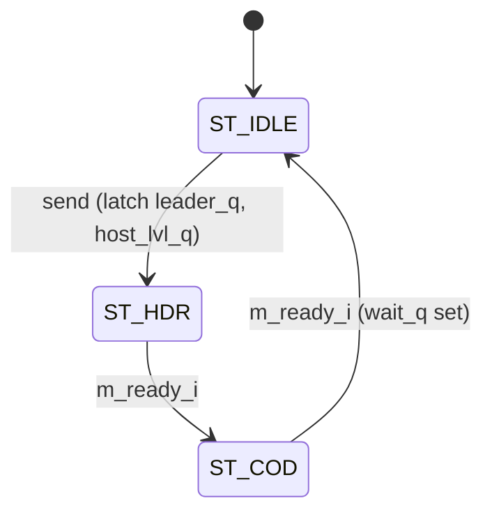

# cxp_tx_trigger_hs

Inputs chosen from the tree: RTL `src/rtl/tx/cxp_tx_trigger_hs.sv`, its packet FSM `src/rtl/tx/cxp_tx_short_pkt.sv` and pin synchroniser `src/rtl/cdc/cxp_cdc_sync.sv` (+ `cxp_pkg.sv`, `cxp_util_pkg.sv`); parent `src/rtl/top/cxp_interface_top.sv` and the scheduler it feeds, `src/rtl/tx/cxp_tx_inserter.sv`; the acknowledgment source on the uplink, `src/rtl/rx/cxp_rx_packet_parser.sv` / `cxp_rx_link.sv`; bound SVA `src/sva/cxp_sva.sv`; unit TB `src/tb_unit/tx/cxp_tx_trigger_hs/`; integration TBs `src/tb_unit/top/cxp_interface_top/` (trigger tests 8–11, 15, 19, 20) and `src/tb_unit/top/cxp_device_top/` (tests 12, 30–32); host model `src/verif/common/cxp_host.py`; spec JIIA CXP-001-2015 v1.1.1 (`docs/spec/CXP-001-2015.pdf`) §8.2.4 (Table 13), §8.3.2, §8.3.2.2 (Table 16), §8.3.3 (Table 17), §10.3.28; regression `make -C src/tb_unit`; output `docs/design/modules/tx/cxp_tx_trigger_hs.md`.

Device→host high-speed trigger source. It sends the logical level of the device trigger pin to the host as 2-word Table 16 packets, one packet outstanding at a time: after each packet it waits for the host's I/O acknowledgment (Table 17) or a timeout, then sends the pin's level again only if it has changed (§8.3.3).

| Word | P0..P3 | kmask | Framing | Meaning |
|---|---|---|---|---|
| 0 | 4×K28.4 (0x9C) or 4×K28.2 (0x5C) | 1111 | `m_o.sop` | trigger asserted / de-asserted (the logical level, after polarity) |
| 1 | 4×0x00 | 0000 | `m_o.eop` | Delay, constant 0 (Table 16: "Usage is optional, when not used set to 0") |

Source `src/rtl/tx/cxp_tx_trigger_hs.sv`. The module keeps the pin synchroniser (`cxp_cdc_sync_pin_i`, 2 flops), the arming flag, the level the host was last sent and the acknowledgment wait; the two packet words come from one `cxp_tx_short_pkt` instance (`cxp_tx_short_pkt_i`, leader `leader_q`, code `DELAY`, `more_i` tied 0), shared in shape with `cxp_tx_io_ack`. Instantiated once in `cxp_interface_top` (`cxp_tx_trigger_hs_i`), with:

- `trigger_in_i` = the top's `trig_in` pin, unsynchronised (any clock); `cxp_device_top` passes its `trig_i` through.
- `cfg_polarity_i` = `cfg_tx.trig_polarity`, the `tx_clk` copy of `cfg_trig_polarity` (through `cxp_cdc_bus` when `p_ASYNC_CLOCKS` = 1).
- `link_up_i` = `link_tx`, `sb_link_detected` from `cxp_rx_link` crossed to `tx_clk` (`cxp_cdc_sync_link_i`, or a wire when `p_ASYNC_CLOCKS` = 0).
- `mask_i` = `crst_tx`, the ConnectionReset level on `tx_clk`.
- `ack_i` = `ioack_rcvd_tx`, `cxp_rx_link.ioack_rcvd_o` crossed rx→tx as a pulse (`cxp_cdc_pulse_ioack_rcvd_i`, or a wire).
- `p_ACK_TIMEOUT` = the top's `p_TRIG_ACK_TIMEOUT` (default `cxp_pkg::TRIG_ACK_TIMEOUT`); `cxp_device_top` has the same parameter.
- The packet words drive `tx_trig`, the trigger port of `cxp_tx_inserter` (priority 0), and take `tx_trig_ready` back.

Also compiled by `src/verif/Makefile` and `src/emu/bridge/Makefile`. Spec: §8.3.2, §8.3.2.2/Table 16, §8.3.3, §8.2.4/Table 13, §10.3.28.

## Interface

| Parameter | Default | Meaning |
|---|---|---|
| `p_ACK_TIMEOUT` | `cxp_pkg::TRIG_ACK_TIMEOUT` = 4096 | `tx_clk` cycles a sent packet waits for `ack_i` before the next one may go. Elaboration `$error` below 1. No register sets it (Medium 2). The benches use 64 (`cxp_tx_trigger_hs`, `cxp_interface_top`) and 800 (`cxp_device_top`). |

The Delay byte is the localparam `DELAY = 8'h00`.

| Name | Dir | Width | Description |
|---|---|---|---|
| `tx_clk` | in | 1 | TX word clock; one 32-bit word (4 characters) per cycle. |
| `tx_rst_n` | in | 1 | Active-low reset, asynchronous assert. |
| `trigger_in_i` | in | 1 | Device trigger pin, any clock; synchronised here by two flops. |
| `cfg_polarity_i` | in | 1 | Pin sense: 0 = high is asserted, 1 = low is asserted. `tx_clk` level. |
| `link_up_i` | in | 1 | A host is connected (uplink Detected). Nothing is sent while it is low. |
| `mask_i` | in | 1 | ConnectionReset in progress (§10.3.28): the level sent is de-asserted. |
| `ack_i` | in | 1 | Host I/O acknowledgment, one pulse per Table 17 packet with code 0x01. |
| `m_o.data` | out | 32 | `rep4(leader_q)` in `ST_HDR`, `rep4(0x00)` in `ST_COD`, 0 otherwise. |
| `m_o.kmask` | out | 4 | 1111 in `ST_HDR`, 0000 otherwise. |
| `m_o.valid` | out | 1 | High in `ST_HDR` and `ST_COD`. |
| `m_o.sop` | out | 1 | High in `ST_HDR`. |
| `m_o.eop` | out | 1 | High in `ST_COD`. |
| `m_ready_i` | in | 1 | Word taken by the inserter (`trig_ready_o`, same cycle). |

State names `ST_IDLE`, `ST_HDR` and `ST_COD` are those of `cxp_tx_short_pkt_i.state_q`; `ST_COD` carries the Delay word.

Notes:
- Reset: `always_ff @(posedge tx_clk or negedge tx_rst_n)`, asynchronous assertion. Reset clears the synchroniser, `pin_ok_q`, `armed_q`, `host_lvl_q` (de-asserted), `wait_q` and `tmo_q`. A packet in flight at reset is cut.
- Clock domain: `tx_clk`. The pin is the only asynchronous input; `cfg_polarity_i`, `link_up_i`, `mask_i` and `ack_i` must already be on `tx_clk` (the parent crosses them).
- Outputs are combinational decodes of the short-packet `state_q` and of `leader_q`, which changes only when a packet starts. A word not taken is held (bound `cxp_short_pkt_sva`).
- The packet always completes: there is no abort input.

## How it works

1. **Pin synchroniser** (`cxp_cdc_sync_pin_i`). `pin` is `trigger_in_i` two `tx_clk` edges later. Its reset value is 0, which is the asserted level when `cfg_polarity_i` = 1; `pin_ok_q` (a 2-bit shift register of ones after reset) marks the cycles from which `pin` holds the real pin, and arming waits for it.
2. **Logical level** (`:129`–`:131`). `asserted = pin ^ cfg_polarity_i`. `level = armed_q & asserted & ~mask_i` is the level to send. `send = link_up_i & ~wait_q & (level != host_lvl_q)`.
3. **Arming** (`armed_q`). Cleared by reset and in every cycle `mask_i` is high; set once `pin_ok_q[1]` is set and the pin is de-asserted. While it is 0 the level sent is de-asserted, so a pin held asserted through a reset or a ConnectionReset is not taken as a new edge; the next real assertion is.
4. **Packet start.** `send` is `avail_i` of the short-packet FSM, which leaves `ST_IDLE` for `ST_HDR` when it is set. In that cycle (`start_o`) the module latches `leader_q` (K28.4 for `level` = 1, K28.2 for 0) and `host_lvl_q <= level`. `more_i` is 0, so a packet always returns to `ST_IDLE`.
5. **Acknowledgment wait.** When the Delay word is taken (`done_o`), `wait_q` is set and `tmo_q` cleared. While waiting, `tmo_q` counts; `ack_i` or `tmo_q == p_ACK_TIMEOUT - 1` clears `wait_q`. `wait_q` is therefore high for at most `p_ACK_TIMEOUT` cycles. `ack_i` outside the wait is ignored.
6. **Level merging.** While a packet is in flight or waiting, pin changes are not queued; once the wait ends, one packet goes out only if the pin's level then differs from `host_lvl_q`. The host sees every level the pin holds long enough and ends at the pin's level; a pulse that starts and ends inside one wait is not sent at all (§8.3.3 allows only one packet per acknowledgment or timeout).
7. **Link gate.** While `link_up_i` is low nothing starts, `wait_q` is cleared and `host_lvl_q` is set to de-asserted (§8.3.2: both sides de-assert the trigger at link discovery). A packet already in flight completes. When the link comes up with the pin asserted (and armed), one K28.4 goes out.
8. **ConnectionReset** (§10.3.28: "Device trigger signal shall be set to 0"). While `mask_i` is high `level` = 0, so a host left asserted gets one K28.2 (after any wait in progress), and `armed_q` is cleared. When the mask ends with the pin still asserted nothing is sent; the pin must be de-asserted and asserted again.
9. **Delay word.** Always `rep4(0x00)`: the module has no sub-word phase information (Medium 1).

| State | Next | Condition |
|---|---|---|
| `ST_IDLE` | `ST_HDR` | `send` |
| `ST_HDR` | `ST_COD` | `m_o.valid & m_ready_i` |
| `ST_COD` | `ST_IDLE` | `m_o.valid & m_ready_i` (`done_o`; `wait_q` set at the same edge) |
| any | same | otherwise |



Latency: if the edge `E` is the first to sample the new pin level into the synchroniser, `pin` changes at `E+1`, the packet starts (`ST_HDR`) at `E+2`, and with the inserter taking it at once the leader is on the wire (registered in the inserter) at `E+3` and the Delay word at `E+4` (unit test 13). After an acknowledgment pulse in cycle `a` the next packet (if the level changed) is in `ST_HDR` at `a+2`. Without an acknowledgment the next leader is offered `p_ACK_TIMEOUT + 2` cycles after the cycle its predecessor's Delay word was taken.

Invariants by construction, not asserted: `wait_q → state_q == ST_IDLE`; `host_lvl_q` equals the level of the last leader sent while the link is up.

## Arbiter integration

- **Slot.** The trigger port of `cxp_tx_inserter`, priority 0 (Table 13). The long-packet arbiter (`cxp_tx_arbiter`) is not involved: the inserter takes the trigger leader at the next word boundary of whatever long packet is on the wire and resumes that packet afterwards (§8.2.4).
- **Handshake.** `trig_ready_o` is combinational from the inserter's choice. The leader is taken in any cycle in which no two-word packet is half sent and the run since the last IDLE is ≤ 97; the Delay word is always taken in the next cycle (SVA `a_trig_contiguous`), so an IDLE never splits a trigger packet.
- **What delays it.** An I/O acknowledgment whose leader has just been sent: the trigger waits one word for the acknowledgment's code word (Table 16 and Table 17 packets are never interleaved). A run past 97 cannot occur in front of a trigger, because only a trigger started at 97 reaches it and one trigger is outstanding at a time. So the leader waits at most one word (arbiter/inserter test 25, device test 31).
- **TestMode.** Not a factor: triggers are inserted into connection-test packets like any other long packet (§8.3.3 has no TestMode exemption; §8.7.4 restricts data packets). `cxp_interface_top` test 11.
- **Registered wire word.** The inserter's `m_data_o`/`m_kmask_o` carry the word chosen in the previous cycle.
- **I/O acknowledgment path.** The host's Table 17 packet is taken out of the uplink word stream by `cxp_rx_packet_parser` (also between two words of a long packet), exported as `cxp_rx_link.ioack_rcvd_o`, and crossed rx→tx as a pulse to `ack_i`.

## Verification

Verilator 5.046 with cocotb 2.0.1, built with `--assert`, so the bound `cxp_short_pkt_sva`, `cxp_inserter_sva` (`a_trig_contiguous`, `a_ioack_within_3`) and `cxp_idle_rule_sva` run in every bench that contains them.

### Unit TB — `src/tb_unit/tx/cxp_tx_trigger_hs`

The wrapper `tb_cxp_tx_trigger_hs_top` adds only the `TESTCASE` register and sets `p_ACK_TIMEOUT` to `ACK_TIMEOUT_P` = 64. The clock is 8 ns. `reset()` presets `trigger_in`, `cfg_polarity`, `link_up` (default 1), `mask` = 0, `ack` = 0 and `m_ready`, holds `tx_rst_n` low for 4 edges and releases it for 1 edge. FSM coverage is registered on `cxp_tx_trigger_hs_i.cxp_tx_short_pkt_i.state_q` (3 states, 3 arcs).

Shared helpers:
- `Capture(dut, ack_delay).run(n, drive)` runs `n` edges, calls `drive(cycle)` before each, records every `m_valid & m_ready` beat with its cycle, and answers each packet with a one-cycle `ack` pulse `ack_delay` cycles after its EOP (`None`: never).
- `split_into_packets` asserts SOP/EOP framing: no SOP inside a packet, no beat outside one, no EOP outside one.
- `check_packet_shape(pkt, K)` asserts 2 beats: HDR `rep4(K)` with kmask 0xF and sop=1/eop=0, then Delay 0 with kmask 0 and sop=0/eop=1.
- `unpaced(pkts, acks)` lists packets that followed the previous one with neither an ack between them nor `ACK_TIMEOUT` cycles.

| Test | Stimulus | Expect |
|---|---|---|
| `test_01_reset_idle` | reset, pin 0 | `m_valid` 0 for 16 cycles |
| `test_02_rising_edge_kcode` | pin 0→1, acked | one K28.4 packet |
| `test_03_falling_edge_kcode` | polarity 1, pin 1→0→1, acked | K28.4, then K28.2 |
| `test_04_no_edge_no_packet` | pin 0 for 64 cycles | no beats |
| `test_05_cfg_polarity_reset_level` | both polarities: pin asserted through reset, released, asserted | nothing until the new assertion; then one K28.4 |
| `test_06_backpressure_holds_packet` | `m_ready` 0, rise, fall, release | HDR held; K28.4 then K28.2 |
| `test_07_burst_two_edges` | one-cycle pulse, ack 10 cycles after EOP | K28.4, then K28.2 after the ack |
| `test_08_random_toggle_stream` | 60 toggles, ack delays 0 / 5 / 12 | alternating packets, all paced, host ends at pin level |
| `test_09_pending_overflow_level` | `m_ready` 0, rise, fall, rise, release | last packet K28.4 |
| `test_10_timeout_without_ack` | no acks, pin toggled every 3 cycles, then held 1 | packets ≥ 64 cycles apart, alternating, last K28.4, no resend of an unchanged level |
| `test_11_link_gate` | pin changes with link down; link up; link down and up | nothing while down; K28.4; K28.4 again |
| `test_12_mask_deasserts` | pin 1, `mask` 30 cycles, pin re-asserted | K28.4, K28.2, nothing at mask end, K28.4 |
| `test_13_edge_to_sop_latency` | pin 0→1 | HDR offered on the 4th edge after the write |

#### test_01_reset_idle
- *Stimulus*: default reset (polarity 0, pin 0, link up), 16 cycles.
- *Checks*: `m_valid == 0` after each edge.
- *Proves*: `level` = 0 equals `host_lvl_q` = 0 out of reset, so `send` stays low.

#### test_02_rising_edge_kcode
- *Stimulus*: polarity 0, pin 0 through reset; pin 1 written 4 edges after release and held; 40-cycle capture, ack 4 cycles after the EOP.
- *Checks*: exactly one packet; `check_packet_shape(K28.4)`.
- *Proves*: arming on the de-asserted pin, `ST_IDLE → ST_HDR → ST_COD → ST_IDLE`, K28.4 for the asserted level, and no second packet for a steady level after the ack.

```wavedrom
{"signal": [
  {"name": "tx_clk", "wave": "p......."},
  {"name": "trigger_in_i", "wave": "01......"},
  {"name": "pin", "wave": "0..1...."},
  {"name": "state_q", "wave": "=...===.", "data": ["IDLE", "HDR", "COD", "IDLE"]},
  {"name": "host_lvl_q", "wave": "0...1..."},
  {"name": "wait_q", "wave": "0.....1."},
  {"name": "m_o.data", "wave": "=...===.", "data": ["0", "4xK28.4", "4x00", "0"]}
],
 "head": {"text": "read from the code: 2 synchroniser flops, then one cycle to start"}}
```

#### test_03_falling_edge_kcode
- *Stimulus*: polarity 1, pin 1 (de-asserted) through reset; pin 0 at capture cycle 4; pin 1 at cycle 44; acks 4 cycles after each EOP; 100 cycles.
- *Checks*: two packets, K28.4 then K28.2, both well formed.
- *Proves*: the packet carries the logical level (`pin ^ cfg_polarity_i`), not the physical edge.

#### test_04_no_edge_no_packet
- *Stimulus*: polarity 0, pin 0, 64 cycles.
- *Checks*: no accepted beat.
- *Proves*: no `send` without a level change.

#### test_05_cfg_polarity_reset_level
- *Stimulus*: for polarity 0 and 1: reset with the pin asserted (1, resp. 0); 30 quiet cycles; pin de-asserted, 20 cycles; pin asserted, 40 cycles; acks 4 cycles after each EOP.
- *Checks*: no packet while the pin stays asserted from reset, none for its release, one K28.4 for the assertion that follows.
- *Proves*: `armed_q` waits for a de-asserted pin, and `pin_ok_q` keeps the synchroniser's reset value 0 (asserted for polarity 1) from arming the source. The first version of the module failed this test for polarity 1.

#### test_06_backpressure_holds_packet
- *Stimulus*: `m_ready` 0 from reset; pin 0→1, 8 edges; pin 1→0, 4 edges; `m_ready` 1 and a 40-cycle capture, acks 4 cycles after each EOP.
- *Checks*: after 8 edges `m_valid`, `m_sop`, kmask 0xF and `rep4(K28.4)`; after 4 more edges `m_data` unchanged; the capture holds K28.4 then K28.2.
- *Proves*: the HDR is held under back-pressure with `leader_q` fixed at start; the change during the stall is sent after the ack.

#### test_07_burst_two_edges
- *Stimulus*: pin 1 for one cycle, then 0; ack 10 cycles after each EOP; 60 cycles.
- *Checks*: K28.4 then K28.2; the K28.2 packet starts after the first ack.
- *Proves*: one packet outstanding (§8.3.3); a one-cycle pulse still reaches the host as two levels because it started while nothing was waiting.

#### test_08_random_toggle_stream
- *Stimulus*: seed 0xC0FFEE; 60 toggles 1–25 cycles apart; three runs with ack delays 0, 5 and 12 cycles; 120 settle cycles.
- *Checks*: packets alternate K28.4 / K28.2 from K28.4; `unpaced` is empty; the last packet's level is the pin's.
- *Proves*: level merging under random pin activity against an acknowledging host.

#### test_09_pending_overflow_level
- *Stimulus*: `m_ready` 0 from reset; pin 0→1, 1→0, 0→1, 6 cycles apart; `m_ready` 1; acks 20 cycles after each EOP; 300 cycles.
- *Checks*: the last packet is K28.4 (the host ends at the pin's level).
- *Proves*: edges piling up behind a held packet do not leave the host on a stale level. The previous edge-queue design ended at K28.2 here.

#### test_10_timeout_without_ack
- *Stimulus*: no acks; pin toggled every 3 cycles for 400 cycles, then held 1; 3 × 64 settle cycles.
- *Checks*: EOP-to-SOP gaps ≥ 64; packets alternate; the last is K28.4; no packet later than 400 + 64 + 8 cycles.
- *Proves*: the timeout releases the wait, and an unchanged level is not resent (§8.3.3 "can resend the last trigger packet or can send a new trigger packet": this module never resends).

#### test_11_link_gate
- *Stimulus*: reset with `link_up` 0; pin 1, 0, 1, 20 cycles apart; 100 cycles; `link_up` 1, 40 cycles; `link_up` 0 for 20 cycles, then 1, 40 cycles; acks 4 cycles after each EOP.
- *Checks*: no packet before the link is up; then `[K28.4]`; after the link returns, `[K28.4, K28.4]`.
- *Proves*: `send` gated by `link_up_i`; `host_lvl_q` returns to de-asserted while the link is down.

#### test_12_mask_deasserts
- *Stimulus*: pin 1 (K28.4 sent and acked); `mask` for 30 cycles with the pin held; 60 cycles; pin 0 for 10 cycles, then 1; 40 cycles; acks 4 cycles after each EOP.
- *Checks*: `[K28.4, K28.2]` after the mask; `[K28.4, K28.2, K28.4]` at the end.
- *Proves*: the mask de-asserts once, the pin held across it is not re-sent, the next real edge is.

#### test_13_edge_to_sop_latency
- *Stimulus*: pin 0→1 written after an edge; edges counted until `m_valid & m_sop`.
- *Checks*: exactly 4 edges.
- *Proves*: a fixed pin-to-HDR latency: the write is sampled on the second edge (cocotb applies a write made after an edge at the next one), then one synchroniser flop, then the start. Two flops plus one cycle from the sampling edge.

### Integration TB — `src/tb_unit/top/cxp_interface_top`

The real `cxp_interface_top` with the real trigger source, inserter, arbiter and register file; all clocks tied to one 10 ns `clk` (`p_ASYNC_CLOCKS` = 0); `p_TRIG_ACK_TIMEOUT` = 64. Every trigger test first calls `uplink()`: a `cxp_host.Host` at 16× oversampling on `rx_serial`, which brings the uplink to Detected (the source sends nothing before) and by default answers every trigger packet with a Table 17 acknowledgment. An acknowledgment takes about 2000 cycles at this oversampling, so the 64-cycle timeout paces consecutive triggers here. Python drives `trigger_in_app` (polarity 0) and `link_reset_req`; `wait_for_trigger_packet(max_idle)` finds a leader word and asserts that the next word is Delay 0 with kmask 0.

| Test | Checks |
|---|---|
| `test_08_trigger_rising_edge` | no leader for 20 samples; K28.4 within 200; none in the next 40 |
| `test_09_trigger_edge_pair` | K28.4, then K28.2, each within 200 samples |
| `test_10_trigger_preempts_stream` | K28.4 within 20 samples of an edge placed 2 words into a stream packet; a later stream SOP |
| `test_11_trigger_in_testmode` | TestMode on, 100 words into a test packet: K28.4 within 20 words |
| `test_15_link_reset_clears_trigger_output` | K28.4, then K28.2 within 400 samples of a ConnectionReset with the pin held |
| `test_19_trig_phase_sweep_100` | host drops every ack; pin toggles every 3–11 cycles through six sensor frames and 20000 TestMode cycles: no torn trigger packet, leaders alternate and end at the pin level, ≥ 64 words apart, at ≥ 80 cadence positions; stream intact |
| `test_20_trigger_held_across_reset` | nothing for a pin held through a reset; K28.4 for a real edge; one K28.2 and no K28.4 for a ConnectionReset with the pin held; one K28.4 for the next real edge |

The `test_15` docstring still says the mask lives in `cxp_interface_top`; it moved into this module (Minor 2). `test_10` cannot tell insertion from waiting for the stream EOP (the 20-sample bound covers the rest of the packet); insertion is proven by `cxp_tx_arbiter` tests 6 and 25 and `cxp_device_top` test 31.

### Integration TB — `src/tb_unit/top/cxp_device_top`

`cxp_device_top` with `p_ASYNC_CLOCKS` = 1 and unrelated clocks (rx 10 ns, tx 8 ns, app 12 ns), `TRIG_ACK_TIMEOUT` = 800, the host model `common/cxp_host.py` on the uplink. The host answers each trigger packet it decodes with a Table 17 acknowledgment inserted at the next uplink word boundary after `trig_ack_delay` rx cycles (`trig_ack = "ack"`, the default), or never (`"drop"`); it records `trig_times` (downlink word of each trigger) and `trig_ack_words` (word count when each acknowledgment has left the uplink pin). So `ack_i` crosses `cxp_cdc_pulse_ioack_rcvd_i` and `link_up_i` crosses `cxp_cdc_sync_link_i` in these tests.

| Test | Checks |
|---|---|
| `test_12_idle_cadence_per_packet_type` | 250 toggles during test packets, 60 during 200-word stream packets, 30 during largest reads, each after the previous ack: every leader followed by its Delay word, one packet per toggle, ≥ 80 cadence positions, run ≤ 99 |
| `test_30_tx_trigger_ack_rules` | pin toggled every 5 cycles for 3000 cycles against a host that acks, drops, or acks `TRIG_ACK_TIMEOUT` + 30 % late: no packet before an ack or the timeout; host level ends at the pin; no torn packet |
| `test_31_nested_preempt` | host trigger and device edge within −6..+6 cycles of each other in a stream packet: 14 I/O acks, 13 triggers, no torn short packet, stream intact, both orders seen |
| `test_32_trigger_waits_for_link` | pin toggled with the uplink down: no leader; one K28.4 after the host brings the link up |

`test_30` counts an acknowledgment for the packet after which it reached the device, allowing `ACK_RX_WORDS` = 200 downlink words for the uplink transit. A late acknowledgment of a timed-out packet is therefore accepted as the acknowledgment of the next one (Medium 3).

### Other

- `src/tb_unit/tx/cxp_tx_arbiter` (scheduler bench: `cxp_tx_arbiter` + `cxp_tx_inserter`, Python stand-in sources): tests 5, 6, 7, 16, 18, 23, 24 and 25 cover the trigger port's priority, insertion into long packets, the wait behind an I/O acknowledgment's code word and the IDLE cadence. Evidence for the inserter, not for this module.
- `src/verif/uvm`: `io_agent` drives the device trigger once the link is up; `tx_trigger_scoreboard` checks the §8.3.3 level rules (each packet changes the host's level, never more packets of a kind than edges of that kind, the host ends at the pin's level, Delay 0); the host agent answers device triggers with Table 17. Not run here.
- `src/emu/bridge/Makefile` compiles the module. Not run here.

### Running

```
make -C src/tb_unit/tx/cxp_tx_trigger_hs WAVES=0
make -C src/tb_unit/tx/cxp_tx_trigger_hs WAVES=0 COCOTB_TEST_FILTER=test_10_timeout_without_ack
make -C src/tb_unit/top/cxp_interface_top WAVES=0 'COCOTB_TEST_FILTER=test_\(08\|09\|10\|11\|15\|19\|20\)_'   # the recipe passes the filter unquoted
make -C src/tb_unit/top/cxp_device_top WAVES=0 'COCOTB_TEST_FILTER=test_\(12\|30\|31\|32\)_'
make -C src/tb_unit            # all benches
```

Results on 2026-09-26 at commit `7a267e2`:

| TB | Result |
|---|---|
| Unit TB | 13/13 pass, no SVA failure; FSM coverage 3/3 states, 3/3 arcs |
| `src/tb_unit/top/cxp_interface_top` (tests 8–11, 15, 19, 20) | 7/7 pass |
| `src/tb_unit/top/cxp_device_top` (tests 12, 30–32) | 4/4 pass (run with tests 7, 11, 27, 29) |

Full regression not re-run.

### Not covered in-tree

- Reset asserted while a packet is in flight or while waiting.
- A change of `cfg_polarity_i` at run time (the logical level flips, so a packet is sent; see Open question 3).
- `mask_i` or a link drop while a packet waits for its acknowledgment, or while a packet is in flight.
- `ack_i` arriving while no packet waits (ignored by code).
- The default `p_ACK_TIMEOUT` of 4096: every bench overrides it (64 or 800).
- A pin pulse shorter than one `tx_clk` period (may be missed by the synchroniser) and a pulse inside one wait (merged by design): no test asserts either.
- X on `trigger_in_i` at reset release (Verilator is 2-state).

## Known issues and recommendations

### Critical

None.

### Medium

1. **Timing accuracy is one word plus a fixed latency, and Delay is always 0.** The pin is sampled once per 4-character word, passes two synchroniser flops, and the leader reaches the wire 3 cycles after the sampling edge, or 4 when it waits for an I/O acknowledgment's code word. Table 16 defines Delay as "three minus the number of whole characters between the trigger event and the start of this trigger packet" and makes it optional; the module has no character-phase information and sends 0. Fix, if sub-word accuracy is needed: sample the pin at character rate in the PHY clock, capture the phase, and send Delay = 3 − k with the fixed latency documented. Effort: 1–2 days, depending on the PHY clocking.
2. **The acknowledgment timeout is a parameter, not a register.** §8.3.3 recommends, for a high-speed trigger acknowledged on the low-speed connection, "that the Device has a register controlling the timeout, set to a default value by the Device based on its I/O usage, but that can be overridden by the Host". The value was decided as a build parameter (`p_TRIG_ACK_TIMEOUT`, default 4096 cycles: 26 µs at 156.25 MHz, 131 µs at 31.25 MHz, against about 6 µs for an acknowledgment on the uplink). A host that needs another value cannot set it. Fix, if required: a manufacturer register feeding `p_ACK_TIMEOUT`'s comparator, with the default as reset value. Effort: 0.5 day.
3. **A late acknowledgment releases the next trigger early.** Table 17 names no packet, so an acknowledgment that arrives after the timeout has released the next packet is taken as that packet's acknowledgment. The host may then receive a new trigger before it has acknowledged the previous one. `cxp_device_top` test 30 tolerates this by construction. No fix inside the device is possible without a sequence field; a system with this risk should choose a timeout well above the host's acknowledgment latency.

### Minor

1. **Comment fix.** The `tx_rst_n` port comment says only "Active-low reset"; state asynchronous assert.
2. **SVA to add.** `wait_q |-> cxp_tx_short_pkt_i.state_q == ST_IDLE`; `start |-> link_up_i`; `m_o.sop |-> m_o.kmask == 4'hF`; a cover on `ack_i && wait_q` and on the timeout expiring.
3. **`leader_q` reset value** (K28.2) is never used before the first start; harmless.

### Open questions

1. Designer: after a timeout this module never resends an unchanged level; §8.3.3 allows either a resend or a new packet. Is "never resend" the intended system behaviour, given that a lost packet then leaves the host's level wrong until the pin next changes?
2. Designer: should a Host be able to override the acknowledgment timeout (Medium 2)?
3. Designer: a run-time change of `cfg_trig_polarity` with the pin steady flips the logical level and sends a packet. Intended, or should a polarity change re-arm (clear `armed_q`) like a ConnectionReset?
4. Designer: is one-word trigger accuracy with Delay 0 acceptable (Medium 1)? If not, which clock or SerDes path provides the character phase?
