# CoaXPress Camera Validation Plan

> Compliance, functional and robustness validation of a CoaXPress Device (camera), derived from the CoaXPress Standard v1.1.1

| Field | Value |
|---|---|
| Camera / project | Generic CXP camera (Device). DUT identity **NOT PROVIDED** |
| CXP version | 1.1.1 (JIIA CXP-001-2015, revised 2015-12-29, published 2016-02-24) |
| Document version | 0.1 (Draft) |
| Generation date | 2026-09-21 |
| Validation scope | Device-side CXP compliance (electrical, PoCXP, link, protocol, streams, GenICam) plus camera functional and robustness tests |
| Document status | **DRAFT**. All tests **NOT TESTED** |

> **Source of truth.** Only the CoaXPress Standard v1.1.1 (`CXP-001-2015.pdf`, 134 pages) was analysed. No camera documentation, RTL, GenICam XML or protocol traces were used, so every DUT-specific fact is marked **NOT PROVIDED** and every test status is **NOT TESTED**. The document makes no compliance claim.

> **Normative language.** CXP 1.1.1 §3.3 defines only “Shall” (mandatory) and “Can” (optional). This plan maps *shall* → MUST, *shall not* → MUST NOT, *recommended* → SHOULD, *can* → MAY. Italic “Comment” text is not normative (§3.3), so rows taken from it are typed **INFO**.

> Companion file: `cxp_camera_validation_plan.html` holds the same content, plus live filtering, a DUT feature profile and a persistent checklist.


## Coverage Dashboard

All numbers are counted from the requirement and test tables in this document. Conditional requirements count as applicable until the DUT declares the feature unsupported.

| Metric | Count |
|---|---|
| Total requirements | 250 |
| MUST / MUST NOT | 226 |
| SHOULD / SHOULD NOT | 12 |
| MAY | 5 |
| INFO (non-normative) | 7 |
| Applicable (unconditional) | 174 |
| Conditional (feature-dependent) | 58 |
| Not applicable (Host / Cable) | 18 |
| Total tests | 139 |
| Automated tests | 102 |
| Partially automated tests | 21 |
| Manual tests | 16 |
| Hardware tests | 35 |
| Missing validation | 0 |
| Clarification required | 24 |
| Tests passed / failed | 0 / 0 |


**Requirements by group and type**

| Group | MUST | SHOULD | MAY | INFO | Total |
|---|---|---|---|---|---|
| Physical/electrical | 54 | 5 | 0 | 0 | 59 |
| Link initialization | 31 | 1 | 0 | 0 | 32 |
| Protocol | 31 | 0 | 3 | 0 | 34 |
| Control channel | 15 | 1 | 0 | 0 | 16 |
| Data channel | 11 | 1 | 1 | 0 | 13 |
| Image transmission | 25 | 1 | 0 | 0 | 26 |
| Trigger | 9 | 1 | 1 | 0 | 11 |
| Acquisition | 4 | 0 | 0 | 1 | 5 |
| Error handling | 12 | 0 | 0 | 0 | 12 |
| Reset | 12 | 0 | 0 | 0 | 12 |
| Link recovery | 1 | 2 | 0 | 1 | 4 |
| Performance | 0 | 0 | 0 | 3 | 3 |
| Multi-link | 5 | 0 | 0 | 0 | 5 |
| GenICam | 14 | 0 | 0 | 0 | 14 |
| Interoperability | 2 | 0 | 0 | 2 | 4 |


**Coverage metrics** (formulas in §22)

| Metric | Value |
|---|---|
| Requirement coverage | 225 / 225 = 100.0 % |
| Executable test coverage | 210 / 225 = 93.3 % |
| Automation coverage | 102 / 139 = 73.4 % |
| Hardware dependency | 35 / 139 = 25.2 % |
| Execution progress | 0 / 139 = 0 % (no evidence supplied) |


## Table of Contents

1. [Executive Summary](#1-executive-summary)
2. [Scope](#2-scope)
3. [Applicable Standards](#3-applicable-standards)
4. [System Under Test](#4-system-under-test)
5. [CXP Camera Architecture](#5-cxp-camera-architecture)
6. [Compliance Strategy](#6-compliance-strategy)
7. [CXP Requirement Analysis](#7-cxp-requirement-analysis)
8. [Validation Test Plan](#8-validation-test-plan)
9. [Protocol Validation](#9-protocol-validation)
10. [Camera Control Validation](#10-camera-control-validation)
11. [Image/Data Path Validation](#11-imagedata-path-validation)
12. [Trigger Validation](#12-trigger-validation)
13. [GenICam Validation](#13-genicam-validation)
14. [Error and Negative Testing](#14-error-and-negative-testing)
15. [Boundary Testing](#15-boundary-testing)
16. [Performance Testing](#16-performance-testing)
17. [Link Recovery Testing](#17-link-recovery-testing)
18. [Interoperability Testing](#18-interoperability-testing)
19. [Hardware/Electrical Validation](#19-hardwareelectrical-validation)
20. [Automation Strategy](#20-automation-strategy)
21. [Traceability Matrix](#21-traceability-matrix)
22. [Coverage Analysis](#22-coverage-analysis)
23. [Validation Gaps](#23-validation-gaps)
24. [Final Compliance Checklist](#24-final-compliance-checklist)
25. [Appendices](#25-appendices)


## 1. Executive Summary

**Purpose.** This plan defines how to show, with objective evidence, that a CoaXPress camera (a CXP *Device*, §3.1) meets the Device-side requirements of CoaXPress v1.1.1. It also covers the camera's own functions and its robustness. The plan contains 250 requirement rows traced to 139 test cases. Every test starts as **NOT TESTED**.

| Capability | Specification envelope (DUT values NOT PROVIDED) |
|---|---|
| CXP version | 1.1.1. The Revision register shows 0x00010001, because the sub-minor version is not coded (§10.3.6) |
| CXP links | One master connection (0) plus 0..n−1 extension connections, and an optional high speed upconnection (§4.1, §8.1) |
| Speeds | HS: 1.250 / 2.500 / 3.125 / 5.000 / 6.250 Gbps (Table 5), discovery 1.25 or 3.125 Gbps. LS: 20.83 Mbps (Table 6) |
| Acquisition modes | “Continuous” is mandatory (§11.2.1.3). Other modes: NOT PROVIDED |
| Pixel formats | At least one Table 25 format is mandatory (§9.4.1). DUT list: NOT PROVIDED |
| Trigger | Host→Device LS/HS triggers with I/O acknowledgment (§8.3). Device→Host triggers are optional. Camera trigger modes: NOT PROVIDED |
| GenICam | GenApi XML (GenICam ≥ 2.3.1, SFNC ≥ 2.0) and the Table 47 use-case features are mandatory (§11.2) |
| Power | PoCXP 13 W per cable at a nominal 24 V is optional for the Device and recommended below 13 W (§7) |
| Verification environments | RTL/SIM (cocotb, pyuvm, Verilator/Questa), protocol exerciser/analyzer, GenICam software, hardware laboratory |

**Three validation tracks**

- **CXP STANDARD COMPLIANCE**: requirements REQ-* traced to JIIA CXP-001-2015 clauses. A verdict here is evidence toward JIIA registration (§4.11) but does not replace the JIIA procedure (Ref 8).
- **CAMERA FUNCTIONAL VALIDATION**: behaviour defined by the DUT datasheet, not by CXP. Examples are exposure, frame rate, trigger modes, test pattern and buffering. These tests have no CXP requirement and are listed in §23.
- **ROBUSTNESS TESTING**: negative, boundary, recovery and soak tests (§14–§17). They probe behaviour where the specification is silent or ambiguous.

**Key figures:** 226 MUST/MUST NOT, 12 SHOULD, 5 MAY and 7 INFO rows. 18 rows are not applicable to a camera, 58 depend on optional DUT features, 24 need specification clarification, and 35 of 139 tests need physical hardware.

## 2. Scope

**In scope**

- Every Device-side “shall” in CXP 1.1.1 sections 4–11 and Annex B (Device transceiver). Physical, PoCXP, link protocol, I/O channel, control channel, connection test, stream and image formats, discovery, bootstrap registers and GenICam.
- Conditional features: multi-connection, HS upconnection, PoCXP, line scan, arbitrary images, multi-stream/tap, Device→Host triggers, indicator lamps, ElectricalComplianceTest, zipped XML, IIDC2.
- Camera functional and robustness tests that CXP needs in order to be exercised: acquisition, trigger modes, soak, recovery.

**Out of scope**

- Host (frame grabber) requirements, which are listed as NOT APPLICABLE — HOST for traceability.
- Cable manufacturer requirements (Annex A), listed as NOT APPLICABLE — CABLE.
- Transceiver chipset design (Annex B beyond the Device product measurements), CXP 2.x features, and the JIIA compliance procedure itself (Ref 8, not supplied).

**Inputs used**

| Input | Status |
|---|---|
| CoaXPress Standard v1.1.1 (JIIA CXP-001-2015) | ANALYSED |
| Camera documentation / datasheet | NOT PROVIDED |
| RTL / source code | NOT PROVIDED (excluded by request) |
| GenICam XML | NOT PROVIDED |
| Protocol traces | NOT PROVIDED |
| JIIA compliance test procedure (Ref 8), PFNC, SFNC, GenTL | REFERENCED, NOT PROVIDED |

## 3. Applicable Standards

| Document | Version | Role | Source |
|---|---|---|---|
| JIIA CXP-001-2015 CoaXPress Standard | 1.1.1 (2015-12-29) | Primary source of truth | Supplied |
| IEC 61169-8 Ed.1.0:2007 (+ Annex A 75 Ω) | 2007 | BNC connector (§5.2.1) | Normative ref. §2.1 |
| IEC 61169-29 Ed.1.0:2005 | 2005 | DIN 1.0/2.3 connector (§5.2.1–5.2.2) | Normative ref. §2.1 |
| 8B/10B code, US Patent 4486739 | — | Line coding (§8.2.1) | Normative ref. §2.1 |
| GenICam (GenApi, SFNC, GenTL, PFNC) | GenICam ≥ 2.3.1, SFNC ≥ 2.0 (Device) | §11, §9.4.1 | Normative ref. §2.1; Ref 7 |
| ZIP (PKWARE APPNOTE) | — | Compressed XML (§11.1) | Ref 3 |
| ITU-R BT.601-6 / BT.709-5 | — | YCbCr formats (§9.4.1.9–10) | Ref 4, 5 |
| IIDC2 | — | Optional register space (§10.3.12) | Ref 6 |
| CoaXPress product registration and test procedures | — | Certification (§4.11) | Ref 8, NOT PROVIDED |

## 4. System Under Test

> No camera documentation, RTL or XML was supplied. The table below is the **DUT declaration** that the camera owner must fill in before execution. Each NOT PROVIDED item is carried into the gap list (§23).

### 4.1 DUT declaration


| Item | Value | Status |
|---|---|---|
| Camera / project name | NOT PROVIDED | EVIDENCE REQUIRED |
| FPGA device | NOT PROVIDED | EVIDENCE REQUIRED |
| Sensor | NOT PROVIDED | EVIDENCE REQUIRED |
| Image pipeline | NOT PROVIDED | EVIDENCE REQUIRED |
| CXP TX / RX implementation | NOT PROVIDED (reference model in §5 from the specification) | EVIDENCE REQUIRED |
| Control path / register interface | Per §8.6 / §10.3 — implementation NOT PROVIDED | EVIDENCE REQUIRED |
| DMA / FIFO / frame buffer | NOT PROVIDED | EVIDENCE REQUIRED |
| Trigger logic | Per §8.3 — camera-side trigger modes NOT PROVIDED | EVIDENCE REQUIRED |
| Clock domains | NOT PROVIDED (spec: HS clocks from one sub-rate master clock for multi-connection, §6.6) | EVIDENCE REQUIRED |
| Reset domains | NOT PROVIDED (spec: connection reset §10.3.28, control channel reset §8.6.1.2) | EVIDENCE REQUIRED |
| GenICam interface | XML NOT PROVIDED | EVIDENCE REQUIRED |
| Host interface | Any CXP 1.1.1 Host (frame grabber) with GenTL producer | NOT TESTED |
| Physical connectors | NOT PROVIDED — BNC or DIN 1.0/2.3 (§5.2) | EVIDENCE REQUIRED |
| Number of connections | NOT PROVIDED | EVIDENCE REQUIRED |
| Supported bit rates | NOT PROVIDED — subset of 1.25 / 2.5 / 3.125 / 5.0 / 6.25 Gbps | EVIDENCE REQUIRED |
| Discovery rate | NOT PROVIDED — 1.25 and/or 3.125 Gbps | EVIDENCE REQUIRED |
| HS upconnection | NOT PROVIDED | EVIDENCE REQUIRED |
| PoCXP | NOT PROVIDED | EVIDENCE REQUIRED |
| Pixel formats | NOT PROVIDED | EVIDENCE REQUIRED |
| Tap geometry | NOT PROVIDED | EVIDENCE REQUIRED |
| Scan type (area / line) | NOT PROVIDED | EVIDENCE REQUIRED |
| Acquisition modes | Continuous mandatory (§11.2.1.3); others NOT PROVIDED | EVIDENCE REQUIRED |
| Trigger modes | NOT PROVIDED | EVIDENCE REQUIRED |
| ControlPacketSizeMax / max stream packet | NOT PROVIDED | EVIDENCE REQUIRED |


### 4.2 Specification-derived Device model

- **CXP TX:** 8B/10B-coded 4-character words (§8.2.1), IDLE fill (§8.2.5), priority insertion (§8.2.4), stream packets (§8.5), control acks (§8.6.3), I/O acks (§8.3.3), test packets (§8.7.4).
- **CXP RX:** LS 20.83 Mbps upconnection (or HS upconnection). Word alignment, majority decode (§8.2.2.1), command packets (Table 21), trigger packets (Table 15/16), test packets (Table 23).
- **Register interface:** 32-bit aligned, big-endian (§10.3.3). Bootstrap registers from 0x0000 (Table 45); manufacturer-specific registers from 0x6000.
- **Clock domains:** HS serial clocks from one sub-rate master clock (§6.6), plus the LS 125/6 MHz domain (§6.7). Internal domains NOT PROVIDED.
- **Reset domains:** power-up reset → connection reset (§10.3.28), control channel reset (§8.6.1.2), ConnectionConfig stream-control reset (§10.3.33).

### 4.3 DUT feature profile (drives applicability)

Mark each optional feature as Supported or Not supported. Requirements typed `CONDITIONAL — <FEATURE>` then become APPLICABLE or NOT APPLICABLE — DUT.


| Feature key | Description | Supported? (Yes / No) | Conditional requirements |
|---|---|---|---|
| `MULTI` | Device uses more than one connection (extension connections) | ☐ Yes ☐ No | 8 |
| `MCONN` | Device uses a CXP multi-connector (DIN 1.0/2.3 multiway) | ☐ Yes ☐ No | 2 |
| `HSUP` | Device supports the optional high speed upconnection | ☐ Yes ☐ No | 7 |
| `POCXP` | Device is powered via PoCXP | ☐ Yes ☐ No | 8 |
| `AUXONLY` | Device is powered only from an auxiliary connector (non-PoCXP) | ☐ Yes ☐ No | 1 |
| `DUALPWR` | Device can be powered either by PoCXP or auxiliary connector | ☐ Yes ☐ No | 2 |
| `OVER13W` | Multi-connector Device consuming more than 13 W | ☐ Yes ☐ No | 2 |
| `LAMPS` | Connector indicator lamps fitted | ☐ Yes ☐ No | 5 |
| `ECT` | ElectricalComplianceTest register implemented | ☐ Yes ☐ No | 3 |
| `LINESCAN` | Line scan Device | ☐ Yes ☐ No | 2 |
| `ARB` | Arbitrary (non-rectangular) image streams | ☐ Yes ☐ No | 2 |
| `INTERLACED` | Interlaced image output | ☐ Yes ☐ No | 1 |
| `MSTREAM` | More than one image stream (multiple images / ROIs) | ☐ Yes ☐ No | 2 |
| `MTAP` | Multi-tap vertical geometry (1X-1Y2 or 1X-2YE) | ☐ Yes ☐ No | 1 |
| `D2HTRIG` | Device sends trigger packets to the Host | ☐ Yes ☐ No | 3 |
| `ZIPXML` | XML file stored compressed (ZIP) | ☐ Yes ☐ No | 2 |
| `IIDC2` | IIDC2 register space supported | ☐ Yes ☐ No | 1 |
| `COLOR` | Colour / planar / Bayer / YUV / YCbCr pixel formats supported | ☐ Yes ☐ No | 1 |
| `MMODE` | More than one valid ConnectionConfig mode | ☐ Yes ☐ No | 1 |
| `LONGOP` | Commands whose execution can exceed 200 ms | ☐ Yes ☐ No | 1 |
| `BRAND` | CoaXPress logo / feature bar used on product or literature | ☐ Yes ☐ No | 3 |


## 5. CXP Camera Architecture

The diagrams follow the specification's own reference model (Figures 1, 2, 8, 13, 14, 21, 22, 25, 40). Blocks whose implementation was not supplied are labelled NOT PROVIDED. No DUT-specific blocks have been invented.

**Figure D-1 — System architecture — CXP Device reference model (§4.1, §6.2, §8.1, §8.5, Fig. 8/13/22)**

```mermaid
flowchart LR
  subgraph DEV["CXP Device (camera) - reference model derived from the specification"]
    direction TB
    SRC["Image source<br/>(sensor / test pattern)<br/><i>DUT-specific: NOT PROVIDED</i>"] --> FMT["Stream formation §9.4<br/>image header, line markers,<br/>pixel packing"]
    FMT --> PKT["Stream packetizer §8.5<br/>SPH / SPT, packet tag, CRC-32"]
    PKT --> MUX["Stream multiplexer §8.5.4<br/>(only if >1 stream)"]
    MUX --> DIST["Connection distribution §8.5.5<br/>(only if >1 connection)"]
    DIST --> ARB["TX priority arbiter §8.2.4<br/>trigger / I-O ack insertion<br/>IDLE ≥ 1 per 100 words §8.2.5"]
    CTL["Control channel §8.6<br/>command decode, acks"] --> ARB
    CTG["Connection test generator §8.7.4"] --> ARB
    ARB --> ENC["8B/10B encode + serializer<br/>(Phy ΦD) §8.2.1"]
    ENC --> DT["Device Transceiver + Cd / Zp<br/>§6, Annex B"]
    DT --> RXD["LS receive 20.83 Mbps<br/>8B/10B decode, word align"]
    RXD --> PARSE["Upconnection parser<br/>K27.7 packets / K28.2-K28.4 triggers"]
    PARSE --> CTL
    PARSE --> TRG["Trigger decode §8.3.2<br/>→ I/O ack (K28.6)"]
    TRG --> ARB
    PARSE --> CTR["Connection test receiver §8.7.3"]
    CTL <--> REG["Bootstrap registers §10.3 (0x0000-0x5FFF)<br/>Manufacturer registers (≥0x6000)<br/>GenICam XML"]
    TRG --> CAM["Camera control / exposure<br/><i>NOT PROVIDED</i>"]
    REG --> CAM
    PRU["PoCXP PRU §7 (optional)"]
  end
  DT <-->|"75 Ω coax, connection 0..n-1<br/>HS down / LS up / 24 V"| HT["Host Transceiver"]
  HT --> FG["Frame grabber / Host<br/>GenTL Producer §11.3"]
  FG --> APP["Application<br/>GenICam consumer"]
```

**Figure D-2 — CXP data path — sensor to host reconstruction (§8.5, §9.4, Fig. 21/22)**

```mermaid
flowchart LR
  A["Pixels<br/>Xsize × Ysize"] --> B["Pixel packing §9.4.2<br/>8/10/12/14/16-bit, P0 first,<br/>no packing across lines"]
  B --> C["Stream §9.4.6<br/>IH (K28.3,0x01) + per line LM (K28.3,0x02) + DsizeL words"]
  C --> D["Chop into packets<br/>≤ StreamPacketSizeMax §8.5.2"]
  D --> E["Stream packet §8.5.1<br/>K27.7,0x01,StreamID,Tag,DsizeP | data | CRC | K29.7"]
  E --> F["Multiplex streams §8.5.4<br/>round-robin connections §8.5.5"]
  F --> G["TX arbiter + IDLE<br/>8B/10B"]
  G --> H["Coax (HS downconnection)"]
  H --> I["Host: per-connection RX,<br/>realign by tag order"]
  I --> J["Check CRC (monitoring) §8.2.2.2<br/>strip SPH/SPT"]
  J --> K["Parse K28.3 markers<br/>header → geometry, PixelF"]
  K --> L["Unpack pixels → image buffer<br/>(PFNC format)"]
```

**Figure D-3 — CXP control path — register access (§8.6, §10.3)**

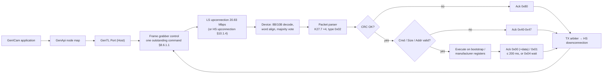

### 5.1 Camera state machine

**Figure D-4 — Camera (Device) link lifecycle state machine (§7, §8.7, §10.1, §10.3.28, §10.3.33, §10.3.35, §10.3.40)**

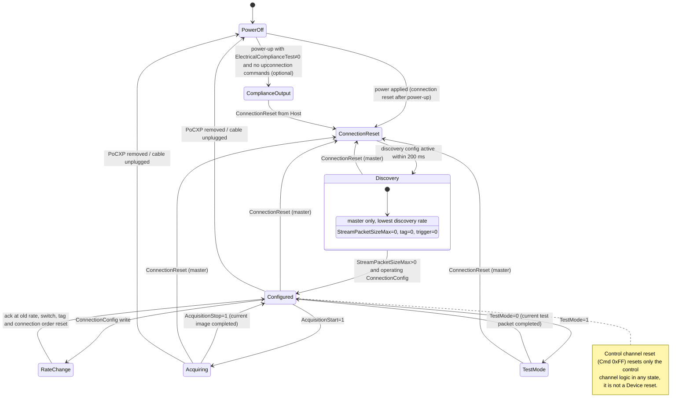

### 5.2 Communication sequences

**Figure D-5 — Camera initialization (discovery) sequence (§10.1.2–§10.1.6, Fig. 35/39)**

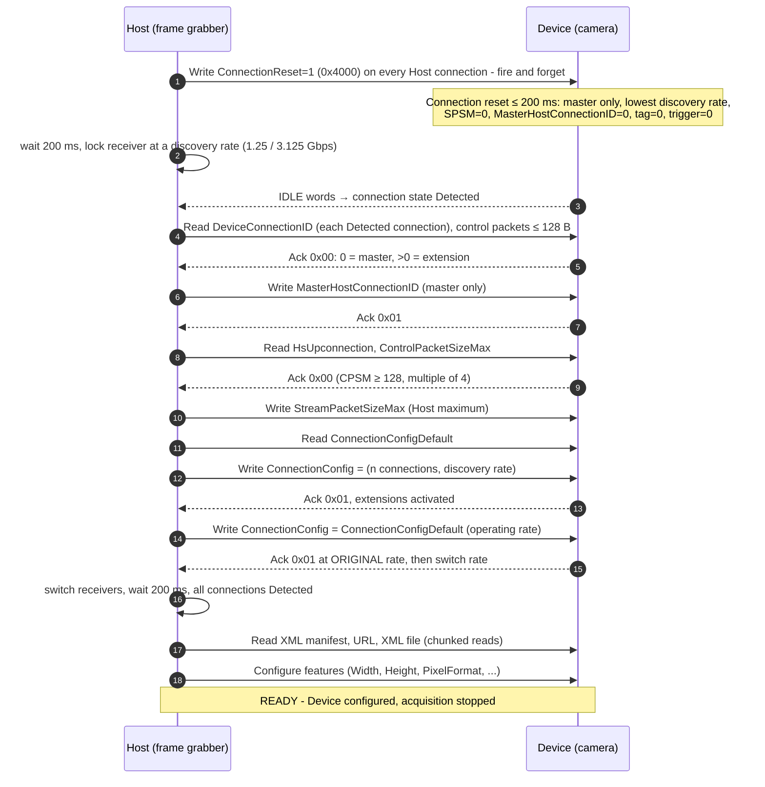

**Figure D-6 — Register read sequence (§8.6.1, Tables 21/22)**

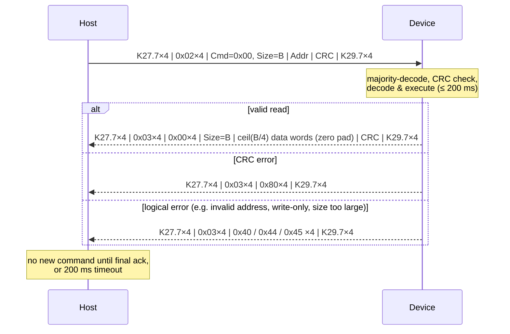

**Figure D-7 — Register write sequence incl. wait acknowledgment (§8.6.1.1, §8.6.3, Fig. 23/24)**

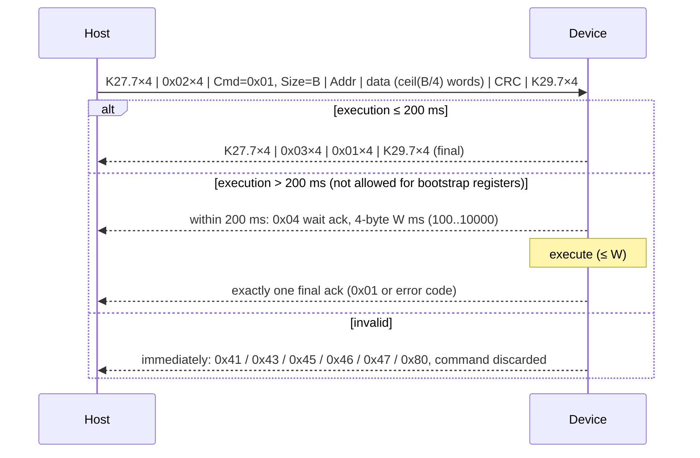

**Figure D-8 — Acquisition start and image stream sequence (§11.2.1.4, §8.5, §9.4.6)**

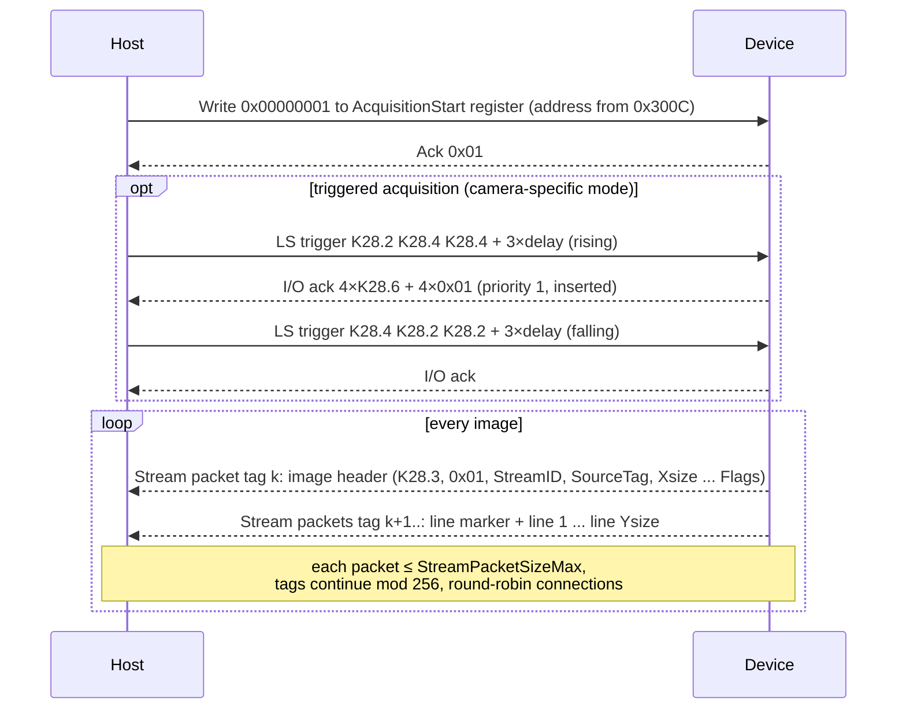

**Figure D-9 — Acquisition stop sequence (§11.2.1.5, §8.5.3)**

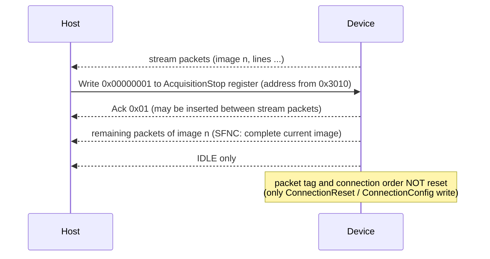

**Figure D-11 — Error handling and recovery flow (§8.2.2.2, §8.6.1, §8.6.3, §8.6.1.2, §10.3.28, §7.4.5)**

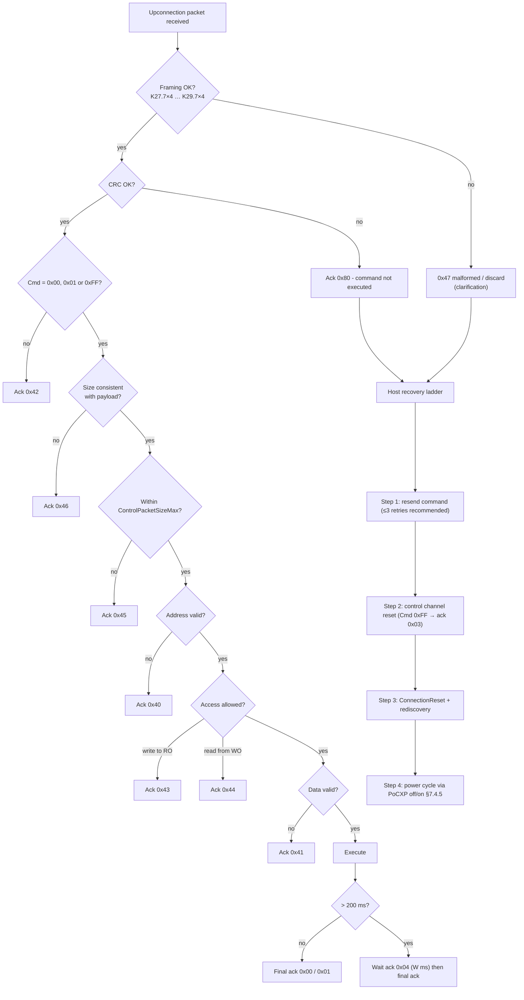

## 6. Compliance Strategy

### 6.1 Verification methods

| Code | Method | Used for |
|---|---|---|
| `I` | Inspection | BOM, schematic, connector, labelling |
| `A` | Analysis | Derived limits, efficiency, spec interpretation |
| `D` | Demonstration | Visible behaviour (lamps, use case) |
| `S` | RTL simulation | Cycle-accurate RTL checks with Host BFM and golden codec |
| `P` | Protocol test | Wire-level checks with exerciser/analyzer on hardware |
| `H` | Hardware measurement | Scope/VNA/PSU measurements |
| `G` | GenICam software test | GenApi/GenTL loading and feature checks |


### 6.2 Verification levels

1. **RTL/SIM**: protocol, packet and register behaviour with full observability and error injection.
2. **Protocol on hardware**: the same checks on the FPGA build with an exerciser/analyzer. They confirm the silicon matches the simulation.
3. **Software**: GenICam XML, GenApi and GenTL use case.
4. **Hardware laboratory**: electrical, PoCXP, connectors, lamps and long-cable BER.
5. **Interoperability**: independent Hosts, clients and analyzers.

### 6.3 Status vocabulary

`NOT TESTED` · `PASS` · `FAIL` · `PARTIAL` · `NOT APPLICABLE` · `NEEDS CLARIFICATION` · `EVIDENCE REQUIRED` · `MISSING VALIDATION`

A requirement moves to PASS only when all its linked tests PASS with archived evidence. The word “Compliant” is not used in this document.

### 6.4 Applicability classes

`APPLICABLE` · `CONDITIONAL — FEATURE` · `NOT APPLICABLE — HOST` · `NOT APPLICABLE — CABLE` · `NOT APPLICABLE — DUT (feature not supported)`

## 7. CXP Requirement Analysis

### 7.1 CXP Camera Compliance Requirement Matrix

Document: **JIIA CXP-001-2015, CoaXPress Standard Version 1.1.1**. The standard assigns no requirement IDs, so the REQ-* IDs below belong to this plan (Appendix D). Each row paraphrases one Device-relevant obligation, with its clause and table/figure. Rows marked ⚑ need specification clarification. Every MUST has a validation method.


### 7.2 Physical/electrical (59 requirements)

| ID | CXP Version | Clause | Requirement (paraphrase) | Type | Applicability | Validation Method | Test ID | Status |
|---|---|---|---|---|---|---|---|---|
| <a id="req-phy-001"></a>`REQ-PHY-001` | 1.1.1 | §4.3 (Table 1) | Device shall support at least one of the defined high speed bit rates (1.250/2.500/3.125/5.000/6.250 Gbps) in normal operation, plus a discovery rate (1.250 or 3.125 Gbps, per Table 1 discovery marks). | MUST | APPLICABLE | Hardware measurement, Protocol test | [CXP-CAM-INIT-004](#cxp-cam-init-004), [CXP-CAM-PERF-001](#cxp-cam-perf-001), [CXP-CAM-IOP-004](#cxp-cam-iop-004), [CXP-CAM-PHY-001](#cxp-cam-phy-001) | NOT TESTED |
| <a id="req-phy-002"></a>`REQ-PHY-002` | 1.1.1 | §6.6 (Table 5) | High speed connection bit rate shall be one of the Table 5 multiples of 625 Mbps (UI 800/400/320/200/160 ps). | MUST | APPLICABLE | Hardware measurement | [CXP-CAM-PHY-001](#cxp-cam-phy-001) | NOT TESTED |
| <a id="req-phy-003"></a>`REQ-PHY-003` | 1.1.1 | §6.6 (—) | Relative tolerance of the high speed bit rate shall be ≤ ±100 ppm. | MUST | APPLICABLE | Hardware measurement | [CXP-CAM-PERF-005](#cxp-cam-perf-005), [CXP-CAM-PHY-001](#cxp-cam-phy-001) | NOT TESTED |
| <a id="req-phy-004"></a>`REQ-PHY-004` | 1.1.1 | §6.2, 6.6 (Figure 8) | Device shall use a CoaXPress compliant Device Transceiver (DT) such that the high speed output waveform complies with Annex B. | MUST | APPLICABLE | Hardware measurement, Inspection | [CXP-CAM-PHY-002](#cxp-cam-phy-002) | NOT TESTED |
| <a id="req-phy-005"></a>`REQ-PHY-005` | 1.1.1 | §6.2 (Figure 8) | The DT I/O pin shall be AC coupled to the coax centre contact through capacitor Cd. | MUST | APPLICABLE | Inspection | [CXP-CAM-PHY-005](#cxp-cam-phy-005) | NOT TESTED |
| <a id="req-phy-006"></a>`REQ-PHY-006` | 1.1.1 | §6.3 (—) | Device-side Cd shall be between 25 nF and 500 nF. | MUST | APPLICABLE | Inspection, Hardware measurement | [CXP-CAM-PHY-005](#cxp-cam-phy-005) | NOT TESTED |
| <a id="req-phy-007"></a>`REQ-PHY-007` | 1.1.1 | §6.3 (—) | Breakdown voltage of Cd shall be at least 50 V. | MUST | APPLICABLE | Inspection | [CXP-CAM-PHY-005](#cxp-cam-phy-005) | NOT TESTED |
| <a id="req-phy-008"></a>`REQ-PHY-008` | 1.1.1 | §6.4 (—) | A 75 Ω ± 15 % termination shall terminate the coax line at the Device side. | MUST | APPLICABLE | Hardware measurement | [CXP-CAM-PHY-005](#cxp-cam-phy-005) | NOT TESTED |
| <a id="req-phy-009"></a>`REQ-PHY-009` | 1.1.1 | §6.5 (—) | Zp shall be as high as possible at the high bit rate and controlled at 2–10 MHz; inductive part Lp shall be 11.5 µH ± 30 %. | MUST | APPLICABLE | Inspection, Hardware measurement | [CXP-CAM-PHY-005](#cxp-cam-phy-005) | NOT TESTED |
| <a id="req-phy-010"></a>`REQ-PHY-010` | 1.1.1 | §6.6 (Figure 9) | Jitter at Tp2 from Phy ΦD + DT shall not exceed 20 % UI. | MUST | APPLICABLE | Hardware measurement | [CXP-CAM-PHY-002](#cxp-cam-phy-002) | NOT TESTED |
| <a id="req-phy-011"></a>`REQ-PHY-011` | 1.1.1 | §6.7 (—) | Device shall use a compliant DT such that Phy ΦD reconstructs the low speed bit stream by compensating cable attenuation (Annex B). | MUST | APPLICABLE | Hardware measurement | [CXP-CAM-PHY-006](#cxp-cam-phy-006) | NOT TESTED |
| <a id="req-phy-012"></a>`REQ-PHY-012` | 1.1.1 | §6.8 (Table 8) | Device return loss at the jack connector (Tp2) shall be better than −10 / −7 / −4 dB in the Table 8 frequency ranges for its highest bit rate. | MUST | APPLICABLE | Hardware measurement | [CXP-CAM-PHY-004](#cxp-cam-phy-004) | NOT TESTED |
| <a id="req-phy-013"></a>`REQ-PHY-013` | 1.1.1 | §B.3.1 (Annex B Table 1) | Transmit amplitude VTX at Tp2 shall be 450–700 mV into 75 Ω (366–552 mV into 50 Ω). | MUST | APPLICABLE | Hardware measurement | [CXP-CAM-PHY-002](#cxp-cam-phy-002) | NOT TESTED |
| <a id="req-phy-014"></a>`REQ-PHY-014` | 1.1.1 | §B.3.1 (Annex B Table 1) | Relative eye opening VEYE/VTX at Tp2 shall be ≥ 0.7. | MUST | APPLICABLE | Hardware measurement | [CXP-CAM-PHY-002](#cxp-cam-phy-002) | NOT TESTED |
| <a id="req-phy-015"></a>`REQ-PHY-015` | 1.1.1 | §B.3.1 (Annex B Table 1) | Rise/fall time (20–80 %) at Tp2 shall be ≤ 90 ps. | MUST | APPLICABLE | Hardware measurement | [CXP-CAM-PHY-002](#cxp-cam-phy-002) | NOT TESTED |
| <a id="req-phy-016"></a>`REQ-PHY-016` | 1.1.1 | §B.3.1 (—) | The high speed DT shall not apply pre-emphasis or de-emphasis. | MUST NOT | APPLICABLE | Hardware measurement | [CXP-CAM-PHY-003](#cxp-cam-phy-003) | NOT TESTED |
| <a id="req-phy-017"></a>`REQ-PHY-017` | 1.1.1 | §B.4.1 (Annex B Figure 3) | Baseline wander of the received low speed signal shall be compensated in the Device Transceiver. | MUST | APPLICABLE | Hardware measurement | [CXP-CAM-PHY-006](#cxp-cam-phy-006) | NOT TESTED |
| <a id="req-phy-018"></a>`REQ-PHY-018` | 1.1.1 | §B.4.4 (Annex B Table 4) | Device shall receive the 20.83 Mbps low speed signal from a compliant Host over Belden 1694A with −4.9 dB @ 30 MHz (≈135 m), full VTXLF range, PoCXP and high speed active, BER < 10⁻¹². | MUST | APPLICABLE | Hardware measurement | [CXP-CAM-IOP-004](#cxp-cam-iop-004), [CXP-CAM-PHY-006](#cxp-cam-phy-006) | NOT TESTED |
| <a id="req-phy-019"></a>`REQ-PHY-019` | 1.1.1 | §6.2, 6.6, 6.7, B.1 (—) | A Device implementing a high speed upconnection shall implement a Host Transceiver (HT) on that connection, compliant with Annex B (HS equalised receive, LS transmit waveform). | MUST | CONDITIONAL — HSUP | Hardware measurement, Inspection | [CXP-CAM-PHY-007](#cxp-cam-phy-007) | NOT TESTED |
| <a id="req-phy-020"></a>`REQ-PHY-020` | 1.1.1 | §6.7, B.4.3 (Annex B Table 3) | Low speed transmitter (HT) at Tp3: VTXLF 90–180 mV, eye ≥ 0.75, rise/fall 5–20 ns, jitter ≤ 5 ns. ⚑ **NEEDS SPECIFICATION CLARIFICATION:** Device-side applicability only via HT on HS upconnection; direction of LS traffic on the HS-upconnection coax is not described in §8 figures. | MUST | CONDITIONAL — HSUP | Hardware measurement | [CXP-CAM-PHY-007](#cxp-cam-phy-007) | NOT TESTED / NEEDS CLARIFICATION |
| <a id="req-phy-021"></a>`REQ-PHY-021` | 1.1.1 | §6.3 (—) | Host-side Cd shall be between 80 nF and 500 nF. | MUST | NOT APPLICABLE — HOST | — | — | NOT APPLICABLE |
| <a id="req-phy-022"></a>`REQ-PHY-022` | 1.1.1 | §6.7 (Table 6) | Low speed bit rate shall be 125/6 Mbps (20.83 Mbps, UI 48 ns) ± 100 ppm (Host transmitter). | MUST | NOT APPLICABLE — HOST | — | — | NOT APPLICABLE |
| <a id="req-phy-023"></a>`REQ-PHY-023` | 1.1.1 | §6.8 (Table 7) | Host return loss limits (−15/−10/−7 dB). | MUST | NOT APPLICABLE — HOST | — | — | NOT APPLICABLE |
| <a id="req-phy-024"></a>`REQ-PHY-024` | 1.1.1 | §B.3.2 (Annex B Table 2) | Host receiver shall receive over Belden 1694A with Table 2 attenuation at BER < 10⁻¹². | MUST | NOT APPLICABLE — HOST | — | — | NOT APPLICABLE |
| <a id="req-phy-025"></a>`REQ-PHY-025` | 1.1.1 | §6.6 (—) | A Device with multiple connections shall derive all high speed clocks from one common sub-rate master clock. | MUST | CONDITIONAL — MULTI | Inspection, Hardware measurement | [CXP-CAM-ML-002](#cxp-cam-ml-002) | NOT TESTED |
| <a id="req-con-001"></a>`REQ-CON-001` | 1.1.1 | §5.2.1 (—) | Single connectors shall be 75 Ω BNC (IEC 61169-8 Annex A, and all other IEC 61169-8 requirements) or 75 Ω DIN 1.0/2.3 (IEC 61169-29). | MUST | APPLICABLE | Inspection | [CXP-CAM-CON-001](#cxp-cam-con-001) | NOT TESTED |
| <a id="req-con-002"></a>`REQ-CON-002` | 1.1.1 | §5.2.1 (—) | Device BNC connector shall be socket-centre-contact type; Device DIN 1.0/2.3 shall be female (socket). | MUST | APPLICABLE | Inspection | [CXP-CAM-CON-001](#cxp-cam-con-001) | NOT TESTED |
| <a id="req-con-003"></a>`REQ-CON-003` | 1.1.1 | §5.2.2 (Figure 6) | Multi-connector positions (connection 0 = master, optional HS upconnection position) and dimensions (9 mm pitch ± 0.05 mm) shall follow Figure 6. | MUST | CONDITIONAL — MCONN | Inspection | [CXP-CAM-CON-002](#cxp-cam-con-002) | NOT TESTED |
| <a id="req-con-004"></a>`REQ-CON-004` | 1.1.1 | §5.2.2 (—) | Multi-connector contacts shall be 75 Ω DIN 1.0/2.3 female on the Device. | MUST | CONDITIONAL — MCONN | Inspection | [CXP-CAM-CON-001](#cxp-cam-con-001) | NOT TESTED |
| <a id="req-con-005"></a>`REQ-CON-005` | 1.1.1 | §5.2.4 (—) | Contact plating: BNC centre gold, outer nickel or white bronze; DIN centre and outer gold. | SHOULD | APPLICABLE | Inspection | [CXP-CAM-CON-003](#cxp-cam-con-003) | NOT TESTED |
| <a id="req-con-006"></a>`REQ-CON-006` | 1.1.1 | §4.3, 4.11.3 (Table 2) | Compliant products shall be labelled with the official logo and maximum operational bit rate per coax indication. | MUST | APPLICABLE | Inspection | [CXP-CAM-CON-003](#cxp-cam-con-003) | NOT TESTED |
| <a id="req-con-007"></a>`REQ-CON-007` | 1.1.1 | §4.11.3 (—) | A Device with more than one coax connector shall label the master connector with an arrowhead pointing to it. | MUST | CONDITIONAL — MULTI | Inspection | [CXP-CAM-CON-003](#cxp-cam-con-003) | NOT TESTED |
| <a id="req-con-008"></a>`REQ-CON-008` | 1.1.1 | §4.11 (—) | Logo use only for JIIA-registered products that completed the compliance test procedure (CoaXPress Compliance Product Certification Program). | MUST | CONDITIONAL — BRAND | Inspection | [CXP-CAM-IOP-007](#cxp-cam-iop-007), [CXP-CAM-CON-003](#cxp-cam-con-003) | NOT TESTED |
| <a id="req-con-009"></a>`REQ-CON-009` | 1.1.1 | §4.11.4 (Figure 5) | Product literature should carry a feature bar; if used, connector type shall be “BNC” or “DIN” and connection count = downconnections [+ HS upconnections]. | SHOULD | CONDITIONAL — BRAND | Inspection | [CXP-CAM-CON-003](#cxp-cam-con-003) | NOT TESTED |
| <a id="req-con-010"></a>`REQ-CON-010` | 1.1.1 | §5.3 (—) | Cables forming one link shall be nominally the same type and length, length difference < 1 m. | MUST | NOT APPLICABLE — CABLE | — | — | NOT APPLICABLE |
| <a id="req-con-011"></a>`REQ-CON-011` | 1.1.1 | §A.2–A.7 (Annex A Tables 1–3) | Cable impedance 75 Ω ± 4 Ω, return loss, DC loop resistance < 4.98 Ω, attenuation limits, 1 A current, cable-like behaviour, 1:1 multi-cable mapping and master marking. | MUST | NOT APPLICABLE — CABLE | — | — | NOT APPLICABLE |
| <a id="req-lamp-001"></a>`REQ-LAMP-001` | 1.1.1 | §5.4 (—) | Devices should have an indicator lamp by each connector. | SHOULD | APPLICABLE | Inspection | [CXP-CAM-LAMP-001](#cxp-cam-lamp-001) | NOT TESTED |
| <a id="req-lamp-002"></a>`REQ-LAMP-002` | 1.1.1 | §5.4 (Table 3) | If fitted, lamps shall show the Table 3 indications (no power, booting, detection, incompatible, connected idle/waiting/transferring, error, connection test, compliance test, system error). | MUST | CONDITIONAL — LAMPS | Demonstration | [CXP-CAM-CT-006](#cxp-cam-ct-006), [CXP-CAM-LAMP-001](#cxp-cam-lamp-001) | NOT TESTED |
| <a id="req-lamp-003"></a>`REQ-LAMP-003` | 1.1.1 | §5.4 (Table 4) | Lamp timings: fast flash 12.5 Hz (20/60 ms), slow flash 0.5 Hz (1/1 s), slow pulse 1 Hz (200/800 ms), all ± 20 %. | MUST | CONDITIONAL — LAMPS | Hardware measurement | [CXP-CAM-LAMP-002](#cxp-cam-lamp-002) | NOT TESTED |
| <a id="req-lamp-004"></a>`REQ-LAMP-004` | 1.1.1 | §5.4 (Table 3) | Connection-detection indication shall be shown for a minimum of 1 s. | MUST | CONDITIONAL — LAMPS | Hardware measurement | [CXP-CAM-LAMP-001](#cxp-cam-lamp-001) | NOT TESTED |
| <a id="req-lamp-005"></a>`REQ-LAMP-005` | 1.1.1 | §5.4 (Table 3) | Data-transfer errors shown as 500 ms red pulse; with multiple errors at least two green fast flash pulses before the next error indication. | MUST | CONDITIONAL — LAMPS | Hardware measurement | [CXP-CAM-LAMP-002](#cxp-cam-lamp-002) | NOT TESTED |
| <a id="req-lamp-006"></a>`REQ-LAMP-006` | 1.1.1 | §5.4 (—) | Option to turn lamps off; additional option to show only error conditions. | SHOULD | CONDITIONAL — LAMPS | Demonstration | [CXP-CAM-LAMP-001](#cxp-cam-lamp-001) | NOT TESTED |
| <a id="req-pwr-001"></a>`REQ-PWR-001` | 1.1.1 | §7.3.1 (—) | Devices consuming < 13 W per connector should draw power via PoCXP (highly recommended). | SHOULD | APPLICABLE | Inspection | [CXP-CAM-PWR-003](#cxp-cam-pwr-003) | NOT TESTED |
| <a id="req-pwr-002"></a>`REQ-PWR-002` | 1.1.1 | §7.3.1 (—) | Devices that may consume > 13 W per connector shall draw power from an auxiliary connector. | MUST | APPLICABLE | Hardware measurement, Inspection | [CXP-CAM-PWR-003](#cxp-cam-pwr-003) | NOT TESTED |
| <a id="req-pwr-003"></a>`REQ-PWR-003` | 1.1.1 | §7.1 (—) | PoCXP shall not be implemented on a high speed upconnection. | MUST NOT | CONDITIONAL — HSUP | Hardware measurement, Inspection | [CXP-CAM-PHY-007](#cxp-cam-phy-007) | NOT TESTED |
| <a id="req-pwr-004"></a>`REQ-PWR-004` | 1.1.1 | §7.3.2.1 (—) | Device shall operate from 18.5 V DC to 26 V DC. | MUST | CONDITIONAL — POCXP | Hardware measurement | [CXP-CAM-PWR-001](#cxp-cam-pwr-001) | NOT TESTED |
| <a id="req-pwr-005"></a>`REQ-PWR-005` | 1.1.1 | §7.3.2.1 (—) | Device shall not be damaged by continuous 30 V DC or start-up overshoot up to 50 V. | MUST | CONDITIONAL — POCXP | Hardware measurement | [CXP-CAM-PWR-002](#cxp-cam-pwr-002) | NOT TESTED |
| <a id="req-pwr-006"></a>`REQ-PWR-006` | 1.1.1 | §7.3.2.2 (—) | Device shall draw a maximum of 13 W per cable. | MUST | CONDITIONAL — POCXP | Hardware measurement | [CXP-CAM-PWR-003](#cxp-cam-pwr-003) | NOT TESTED |
| <a id="req-pwr-007"></a>`REQ-PWR-007` | 1.1.1 | §7.3.2.2 (—) | Device shall not draw more than 50 mA until 25 ms after its input voltage reached 15 V (initial Cs charge excluded). | MUST | CONDITIONAL — POCXP | Hardware measurement | [CXP-CAM-PWR-004](#cxp-cam-pwr-004) | NOT TESTED |
| <a id="req-pwr-008"></a>`REQ-PWR-008` | 1.1.1 | §7.3.3.1 (Figure 11) | Sense resistance Rs = 4k7 Ω ± 5 % whenever input voltage is 2.2–5.5 V. | MUST | CONDITIONAL — POCXP | Hardware measurement | [CXP-CAM-PWR-005](#cxp-cam-pwr-005), [CXP-CAM-PWR-009](#cxp-cam-pwr-009) | NOT TESTED |
| <a id="req-pwr-009"></a>`REQ-PWR-009` | 1.1.1 | §7.3.3.2 (—) | Input capacitance Cs ≤ 57 µF. | MUST | CONDITIONAL — POCXP | Hardware measurement, Inspection | [CXP-CAM-PWR-006](#cxp-cam-pwr-006) | NOT TESTED |
| <a id="req-pwr-010"></a>`REQ-PWR-010` | 1.1.1 | §7.3.3.2 (—) | Cs shall be discharged to < 1 V within 500 ms of power removal. | MUST | CONDITIONAL — POCXP | Hardware measurement | [CXP-CAM-REC-001](#cxp-cam-rec-001), [CXP-CAM-PWR-006](#cxp-cam-pwr-006), [CXP-CAM-PWR-009](#cxp-cam-pwr-009) | NOT TESTED |
| <a id="req-pwr-011"></a>`REQ-PWR-011` | 1.1.1 | §7.3.3.3 (—) | After power is applied the Device shall draw ≥ 15 mA within 0.25 s (per powered connector, even for multi-connector > 13 W Devices). | MUST | CONDITIONAL — POCXP | Hardware measurement | [CXP-CAM-PWR-007](#cxp-cam-pwr-007), [CXP-CAM-PWR-009](#cxp-cam-pwr-009) | NOT TESTED |
| <a id="req-pwr-012"></a>`REQ-PWR-012` | 1.1.1 | §7.3.4 (—) | Multi-connector Device > 13 W: power supply shall not draw more than 13 W per cable. | MUST | CONDITIONAL — OVER13W | Hardware measurement | [CXP-CAM-PWR-003](#cxp-cam-pwr-003) | NOT TESTED |
| <a id="req-pwr-013"></a>`REQ-PWR-013` | 1.1.1 | §7.3.4 (—) | Multi-connector Device > 13 W: power applied to one connector shall not be injected into any other. | MUST | CONDITIONAL — OVER13W | Hardware measurement | [CXP-CAM-PWR-008](#cxp-cam-pwr-008) | NOT TESTED |
| <a id="req-pwr-014"></a>`REQ-PWR-014` | 1.1.1 | §7.3.5.1 (—) | Auxiliary-only Device shall not present an input resistance meeting §7.3.3.1 (no 4k7 signature). | MUST NOT | CONDITIONAL — AUXONLY | Hardware measurement | [CXP-CAM-PWR-005](#cxp-cam-pwr-005) | NOT TESTED |
| <a id="req-pwr-015"></a>`REQ-PWR-015` | 1.1.1 | §7.3.5.2 (—) | Dual-power Device shall isolate sources: aux shall not inject into Host; coax shall not inject into aux. | MUST | CONDITIONAL — DUALPWR | Hardware measurement | [CXP-CAM-PWR-008](#cxp-cam-pwr-008) | NOT TESTED |
| <a id="req-pwr-016"></a>`REQ-PWR-016` | 1.1.1 | §7.3.5.2 (—) | Dual-power Device with aux power applied shall run from aux and disconnect Rs. | MUST | CONDITIONAL — DUALPWR | Hardware measurement | [CXP-CAM-PWR-005](#cxp-cam-pwr-005) | NOT TESTED |
| <a id="req-pwr-017"></a>`REQ-PWR-017` | 1.1.1 | §7.4.1–7.4.5 (Figure 12) | Host PoCXP PTU: 24 V ± 2 V, 17 W/cable, OCP (≥ 790 mA hold, ≤ 5 A trip), detection with 550 µA–1 mA sense, power removal < 8 mA/0.5 s, ≤ 7 V / 2 mA while sensing, never power non-PoCXP loads. | MUST | NOT APPLICABLE — HOST | — | — | NOT APPLICABLE |


### 7.3 Link initialization (32 requirements)

| ID | CXP Version | Clause | Requirement (paraphrase) | Type | Applicability | Validation Method | Test ID | Status |
|---|---|---|---|---|---|---|---|---|
| <a id="req-init-001"></a>`REQ-INIT-001` | 1.1.1 | §10.1.2, 10.3.28 (Figure 35) | On a ConnectionReset (write 0x00000001) received via the Master connection the Device shall execute connection reset and activate its discovery connection configuration within 200 ms. | MUST | APPLICABLE | RTL simulation, Protocol test | [CXP-CAM-INIT-002](#cxp-cam-init-002), [CXP-CAM-NEG-011](#cxp-cam-neg-011), [CXP-CAM-REC-002](#cxp-cam-rec-002) | NOT TESTED |
| <a id="req-init-002"></a>`REQ-INIT-002` | 1.1.1 | §10.3.28 (—) | The Device shall clear ConnectionReset back to 0x00000000 once the discovery configuration is active. | MUST | APPLICABLE | RTL simulation, Protocol test | [CXP-CAM-INIT-002](#cxp-cam-init-002), [CXP-CAM-REC-002](#cxp-cam-rec-002) | NOT TESTED |
| <a id="req-init-003"></a>`REQ-INIT-003` | 1.1.1 | §10.3.28 (—) | Connection reset shall initialise the master connection bit rate to the lowest discovery bit rate the Device supports, with the corresponding value in ConnectionConfig (1 connection). | MUST | APPLICABLE | RTL simulation, Protocol test | [CXP-CAM-INIT-001](#cxp-cam-init-001), [CXP-CAM-INIT-002](#cxp-cam-init-002) | NOT TESTED |
| <a id="req-init-004"></a>`REQ-INIT-004` | 1.1.1 | §10.1.3, 10.3.29 (Figure 37) | DeviceConnectionID shall return the ID of the Device connection through which it is read (0 = master). | MUST | APPLICABLE | RTL simulation, Protocol test | [CXP-CAM-INIT-004](#cxp-cam-init-004), [CXP-CAM-INIT-005](#cxp-cam-init-005), [CXP-CAM-IOP-006](#cxp-cam-iop-006) | NOT TESTED |
| <a id="req-init-005"></a>`REQ-INIT-005` | 1.1.1 | §10.1.3, 10.3.30 (Figure 38) | MasterHostConnectionID shall hold the Host connection ID written via the master connection; 0x00000000 = unknown. | MUST | APPLICABLE | RTL simulation, Protocol test | [CXP-CAM-INIT-004](#cxp-cam-init-004), [CXP-CAM-INIT-005](#cxp-cam-init-005), [CXP-CAM-BND-003](#cxp-cam-bnd-003), [CXP-CAM-IOP-006](#cxp-cam-iop-006) | NOT TESTED |
| <a id="req-init-006"></a>`REQ-INIT-006` | 1.1.1 | §10.1.5, 10.3.31 (Table 43) | Device shall support control packets up to its maximum and report it in ControlPacketSizeMax: bytes, whole packet, multiple of 4, ≥ 128. | MUST | APPLICABLE | RTL simulation, Protocol test | [CXP-CAM-INIT-004](#cxp-cam-init-004), [CXP-CAM-CTRL-008](#cxp-cam-ctrl-008) | NOT TESTED |
| <a id="req-init-007"></a>`REQ-INIT-007` | 1.1.1 | §10.1.5 (Table 44) | While StreamPacketSizeMax = 0 the Device shall not transmit stream packets. | MUST NOT | APPLICABLE | RTL simulation, Protocol test | [CXP-CAM-INIT-007](#cxp-cam-init-007) | NOT TESTED |
| <a id="req-init-008"></a>`REQ-INIT-008` | 1.1.1 | §8.5.2, 10.1.5, 10.3.32 (Table 44) | Stream packet total size (first K27.7 to last K29.7) shall not exceed StreamPacketSizeMax (bytes). | MUST | APPLICABLE | RTL simulation, Protocol test | [CXP-CAM-INIT-007](#cxp-cam-init-007), [CXP-CAM-BND-003](#cxp-cam-bnd-003) | NOT TESTED |
| <a id="req-init-009"></a>`REQ-INIT-009` | 1.1.1 | §10.3.32 (—) | StreamPacketSizeMax shall be host-writable, in bytes, whole packet, multiple of 4. ⚑ **NEEDS SPECIFICATION CLARIFICATION:** Device reaction to a write that is not a multiple of 4 (or too small to carry one data word, i.e. < 36 bytes) is not specified. | MUST | APPLICABLE | RTL simulation, Protocol test | [CXP-CAM-BND-003](#cxp-cam-bnd-003) | NOT TESTED / NEEDS CLARIFICATION |
| <a id="req-init-010"></a>`REQ-INIT-010` | 1.1.1 | §10.1.6.1, 10.3.33 (Figure 39) | On a ConnectionConfig write that changes speed, the Device shall acknowledge at the original speed first, then switch all specified connections (and HS upconnection) to the new rate. | MUST | APPLICABLE | RTL simulation, Protocol test | [CXP-CAM-INIT-006](#cxp-cam-init-006) | NOT TESTED |
| <a id="req-init-011"></a>`REQ-INIT-011` | 1.1.1 | §10.1.6 (—) | All connections forming one link, including an HS upconnection, shall operate at the same bit rate. | MUST | APPLICABLE | Protocol test, Hardware measurement | [CXP-CAM-INIT-006](#cxp-cam-init-006) | NOT TESTED |
| <a id="req-init-012"></a>`REQ-INIT-012` | 1.1.1 | §10.3.33 (Table 46) | ConnectionConfig shall hold a valid (connections[31:16], speed code[15:0]) combination; speed codes 0x28/0x30/0x38/0x40/0x48. ⚑ **NEEDS SPECIFICATION CLARIFICATION:** Error code for an invalid ConnectionConfig write (0x41 assumed) is not stated. | MUST | APPLICABLE | RTL simulation, Protocol test | [CXP-CAM-INIT-006](#cxp-cam-init-006), [CXP-CAM-NEG-003](#cxp-cam-neg-003) | NOT TESTED / NEEDS CLARIFICATION |
| <a id="req-init-013"></a>`REQ-INIT-013` | 1.1.1 | §10.3.34 (—) | ConnectionConfigDefault shall provide the ConnectionConfig value of the Device's recommended mode. | MUST | APPLICABLE | Protocol test | [CXP-CAM-INIT-004](#cxp-cam-init-004), [CXP-CAM-INIT-009](#cxp-cam-init-009) | NOT TESTED |
| <a id="req-init-014"></a>`REQ-INIT-014` | 1.1.1 | §10.3.34 (—) | If more than one ConnectionConfig mode is possible, a manufacturer-space mechanism to reprogram ConnectionConfigDefault should be provided. | SHOULD | CONDITIONAL — MMODE | Demonstration | [CXP-CAM-INIT-009](#cxp-cam-init-009) | NOT TESTED |
| <a id="req-init-015"></a>`REQ-INIT-015` | 1.1.1 | §10.3.33 (—) | Writing ConnectionConfig shall set the connection speed on the specified number of connections (used by the Host at discovery rate to enable extensions, §10.1.3). | MUST | APPLICABLE | RTL simulation, Protocol test | [CXP-CAM-INIT-004](#cxp-cam-init-004) | NOT TESTED |
| <a id="req-init-016"></a>`REQ-INIT-016` | 1.1.1 | §10.1.4 (—) | HS upconnection: when the Device reaches Detected (bit + word lock) on the HS upconnection it shall switch all upconnection communication to it. | MUST | CONDITIONAL — HSUP | RTL simulation, Protocol test | [CXP-CAM-INIT-008](#cxp-cam-init-008) | NOT TESTED |
| <a id="req-init-017"></a>`REQ-INIT-017` | 1.1.1 | §10.1.4, 10.1.6.1 (—) | HS upconnection: if the HS upconnection is disabled, or Undetected 200 ms after a speed change, the Device shall switch back to the low speed upconnection. | MUST | CONDITIONAL — HSUP | RTL simulation, Protocol test | [CXP-CAM-INIT-008](#cxp-cam-init-008), [CXP-CAM-REC-005](#cxp-cam-rec-005) | NOT TESTED |
| <a id="req-init-018"></a>`REQ-INIT-018` | 1.1.1 | §10.3.41 (—) | HsUpconnection bit 0 = 1 if HS upconnection supported else 0; bits 31:1 = 0. | MUST | APPLICABLE | RTL simulation, Protocol test | [CXP-CAM-INIT-004](#cxp-cam-init-004), [CXP-CAM-INIT-008](#cxp-cam-init-008) | NOT TESTED |
| <a id="req-init-019"></a>`REQ-INIT-019` | 1.1.1 | §4.3 (Table 1) | Host shall support all rates from 1.25 Gbps to its maximum; Host discovery procedure (ConnectionReset per connection, 200 ms wait, 128-byte control limit, ConnectionConfigDefault read, StreamPacketSizeMax write). | MUST | NOT APPLICABLE — HOST | — | — | NOT APPLICABLE |
| <a id="req-boot-001"></a>`REQ-BOOT-001` | 1.1.1 | §10.3.4 (Table 45) | All mandatory bootstrap registers shall be implemented at the Table 45 addresses, lengths and access modes. | MUST | APPLICABLE | RTL simulation, Protocol test | [CXP-CAM-INIT-004](#cxp-cam-init-004), [CXP-CAM-BOOT-001](#cxp-cam-boot-001) | NOT TESTED |
| <a id="req-boot-002"></a>`REQ-BOOT-002` | 1.1.1 | §10.3.5 (—) | Standard (0x0000) shall read 0xC0A79AE5. | MUST | APPLICABLE | RTL simulation, Protocol test | [CXP-CAM-BOOT-002](#cxp-cam-boot-002) | NOT TESTED |
| <a id="req-boot-003"></a>`REQ-BOOT-003` | 1.1.1 | §10.3.6 (—) | Revision (0x0004): major[31:16], minor[15:0]; stated value 0x00010001. ⚑ **NEEDS SPECIFICATION CLARIFICATION:** Text says “Devices compliant to this revision 1.1 … shall return 0x00010001” inside the v1.1.1 document; sub-minor not coded — expected value for a v1.1.1 Device assumed 0x00010001. | MUST | APPLICABLE | RTL simulation, Protocol test | [CXP-CAM-BOOT-002](#cxp-cam-boot-002) | NOT TESTED / NEEDS CLARIFICATION |
| <a id="req-boot-004"></a>`REQ-BOOT-004` | 1.1.1 | §10.3.7, 10.3.8 (—) | XmlManifestSize ≥ 1; XmlManifestSelector holds 0..XmlManifestSize−1. ⚑ **NEEDS SPECIFICATION CLARIFICATION:** Reaction to an out-of-range selector write not specified. | MUST | APPLICABLE | RTL simulation, Protocol test | [CXP-CAM-INIT-001](#cxp-cam-init-001), [CXP-CAM-BOOT-003](#cxp-cam-boot-003), [CXP-CAM-NEG-003](#cxp-cam-neg-003) | NOT TESTED / NEEDS CLARIFICATION |
| <a id="req-boot-005"></a>`REQ-BOOT-005` | 1.1.1 | §10.3.9, 10.3.10 (—) | XmlVersion / XmlSchemaVersion: [31:24] = 0, [23:16] major, [15:8] minor, [7:0] sub-minor. | MUST | APPLICABLE | RTL simulation, Protocol test | [CXP-CAM-BOOT-003](#cxp-cam-boot-003) | NOT TESTED |
| <a id="req-boot-006"></a>`REQ-BOOT-006` | 1.1.1 | §10.3.11 (—) | XmlUrlAddress shall point to a URL string in manufacturer space (≥ 0x6000) in GenTL URL format. | MUST | APPLICABLE | Protocol test, GenICam software test | [CXP-CAM-BOOT-003](#cxp-cam-boot-003) | NOT TESTED |
| <a id="req-boot-007"></a>`REQ-BOOT-007` | 1.1.1 | §10.3.12 (—) | Iidc2Address = IIDC2 register space start, or 0x00000000 if IIDC2 is not supported. | MUST | APPLICABLE | Protocol test | [CXP-CAM-BOOT-004](#cxp-cam-boot-004), [CXP-CAM-GEN-009](#cxp-cam-gen-009) | NOT TESTED |
| <a id="req-boot-008"></a>`REQ-BOOT-008` | 1.1.1 | §10.3.1 (—) | Strings: NULL-terminated ASCII (terminator counted), no terminator only when the string fills the register. | MUST | APPLICABLE | Protocol test | [CXP-CAM-BOOT-004](#cxp-cam-boot-004) | NOT TESTED |
| <a id="req-boot-009"></a>`REQ-BOOT-009` | 1.1.1 | §10.3.13–10.3.17 (Table 45) | DeviceVendorName (32), DeviceModelName (32), DeviceManufacturerInfo (48), DeviceVersion (32), DeviceSerialNumber (16, NULL-terminated) shall be provided. | MUST | APPLICABLE | Protocol test | [CXP-CAM-BOOT-004](#cxp-cam-boot-004) | NOT TESTED |
| <a id="req-boot-010"></a>`REQ-BOOT-010` | 1.1.1 | §10.3.18 (Table 45) | DeviceUserID (16 bytes) shall be R/W. | MUST | APPLICABLE | Protocol test | [CXP-CAM-BOOT-004](#cxp-cam-boot-004), [CXP-CAM-BOOT-005](#cxp-cam-boot-005) | NOT TESTED |
| <a id="req-boot-011"></a>`REQ-BOOT-011` | 1.1.1 | §10.3.19–10.3.27 (Table 45) | Width/Height/AcquisitionMode/AcquisitionStart/AcquisitionStop/PixelFormat/DeviceTapGeometry/Image<n>StreamID Address registers shall give the manufacturer-space address of the feature; Image<n>StreamIDAddress (0x3018 + n×4) = 0 for unsupported streams. | MUST | APPLICABLE | Protocol test, GenICam software test | [CXP-CAM-BOOT-006](#cxp-cam-boot-006), [CXP-CAM-BOOT-007](#cxp-cam-boot-007) | NOT TESTED |
| <a id="req-boot-012"></a>`REQ-BOOT-012` | 1.1.1 | §10.3.3 (—) | Unused bootstrap register bits shall be 0. | MUST | APPLICABLE | RTL simulation, Protocol test | [CXP-CAM-BOOT-001](#cxp-cam-boot-001) | NOT TESTED |
| <a id="req-boot-013"></a>`REQ-BOOT-013` | 1.1.1 | §10.3.4 (Table 45) | ConnectionReset W/(R), DeviceConnectionID R, MasterHostConnectionID R/W, ControlPacketSizeMax R, StreamPacketSizeMax R/W, ConnectionConfig R/W, ConnectionConfigDefault R, TestMode R/W, selector/counters R/W (TestPacketCount* 8 bytes), HsUpconnection R. | MUST | APPLICABLE | RTL simulation, Protocol test | [CXP-CAM-BOOT-001](#cxp-cam-boot-001) | NOT TESTED |


### 7.4 Protocol (34 requirements)

| ID | CXP Version | Clause | Requirement (paraphrase) | Type | Applicability | Validation Method | Test ID | Status |
|---|---|---|---|---|---|---|---|---|
| <a id="req-prot-001"></a>`REQ-PROT-001` | 1.1.1 | §4.1, 8.2.1 (—) | Both upconnection and downconnection shall use 8B/10B coding. | MUST | APPLICABLE | RTL simulation, Protocol test | [CXP-CAM-PROT-001](#cxp-cam-prot-001) | NOT TESTED |
| <a id="req-prot-002"></a>`REQ-PROT-002` | 1.1.1 | §8.2.1 (Table 11) | K-codes shall be used only for the Table 11 functions (K27.7 SOP, K28.6 I/O ack, K28.1/K28.5 alignment, K28.2/K28.4 trigger, K28.3 stream marker, K29.7 EOP). | MUST | APPLICABLE | RTL simulation, Protocol test | [CXP-CAM-PROT-002](#cxp-cam-prot-002), [CXP-CAM-IOP-003](#cxp-cam-iop-003) | NOT TESTED |
| <a id="req-prot-003"></a>`REQ-PROT-003` | 1.1.1 | §8.2.1 (—) | Transmission is in 4-character words P0..P3 sent P0 first (except 6-character LS trigger packets). | MUST | APPLICABLE | RTL simulation, Protocol test | [CXP-CAM-PROT-002](#cxp-cam-prot-002) | NOT TESTED |
| <a id="req-prot-004"></a>`REQ-PROT-004` | 1.1.1 | §8.2.1 (—) | The receiver shall perform word alignment. | MUST | APPLICABLE | RTL simulation, Protocol test | [CXP-CAM-PROT-005](#cxp-cam-prot-005), [CXP-CAM-NEG-009](#cxp-cam-neg-009), [CXP-CAM-REC-004](#cxp-cam-rec-004) | NOT TESTED |
| <a id="req-prot-005"></a>`REQ-PROT-005` | 1.1.1 | §8.2.1 (Figure 15) | Bit order: 8B/10B bit 'A' = LSB before coding; bit 'a' transmitted first. | MUST | APPLICABLE | RTL simulation, Hardware measurement | [CXP-CAM-PROT-001](#cxp-cam-prot-001) | NOT TESTED |
| <a id="req-prot-006"></a>`REQ-PROT-006` | 1.1.1 | §8.2.1 (—) | Multi-byte single values (addresses, sizes, header fields) shall be transmitted big-endian. | MUST | APPLICABLE | RTL simulation, Protocol test | [CXP-CAM-BOOT-002](#cxp-cam-boot-002), [CXP-CAM-PROT-004](#cxp-cam-prot-004) | NOT TESTED |
| <a id="req-prot-007"></a>`REQ-PROT-007` | 1.1.1 | §8.2.2.1 (—) | The receiver shall decode replicated P0..P3 characters with immunity to single bit errors. | MUST | APPLICABLE | RTL simulation, Protocol test | [CXP-CAM-PROT-006](#cxp-cam-prot-006), [CXP-CAM-NEG-009](#cxp-cam-neg-009), [CXP-CAM-NEG-012](#cxp-cam-neg-012) | NOT TESTED |
| <a id="req-prot-008"></a>`REQ-PROT-008` | 1.1.1 | §8.2.2.2 (Figure 16) | CRC-32: polynomial 0x04C11DB7, seed 0xFFFFFFFF, data bit 0 first, P0 first, word 0 first; CRC sent MSB in P0 bit 0 … LSB in P3 bit 7. | MUST | APPLICABLE | RTL simulation, Protocol test | [CXP-CAM-PROT-007](#cxp-cam-prot-007) | NOT TESTED |
| <a id="req-prot-009"></a>`REQ-PROT-009` | 1.1.1 | §8.2.2.2 (—) | CRC shall exclude IDLE words used to stretch packets; K28.3 shall be treated as D28.3. | MUST | APPLICABLE | RTL simulation, Protocol test | [CXP-CAM-PROT-008](#cxp-cam-prot-008) | NOT TESTED |
| <a id="req-prot-010"></a>`REQ-PROT-010` | 1.1.1 | §8.2.4 (Table 13) | Priority: trigger (0) > trigger I/O ack (1) > all other (2); a higher priority packet shall be inserted into a lower priority packet at a word boundary (LS trigger: character boundary). | MUST | APPLICABLE | RTL simulation, Protocol test | [CXP-CAM-PROT-009](#cxp-cam-prot-009) | NOT TESTED |
| <a id="req-prot-011"></a>`REQ-PROT-011` | 1.1.1 | §8.2.4 (Figures 17–19) | Transmission of the interrupted lower priority packet shall resume after the inserted packet completes. | MUST | APPLICABLE | RTL simulation, Protocol test | [CXP-CAM-PROT-009](#cxp-cam-prot-009) | NOT TESTED |
| <a id="req-prot-012"></a>`REQ-PROT-012` | 1.1.1 | §8.2.4 (—) | Apart from triggers and their acks, packets may be freely prioritised (subject to in-order stream rule §8.5.3). | MAY | APPLICABLE | Analysis | [CXP-CAM-CTRL-010](#cxp-cam-ctrl-010) | NOT TESTED |
| <a id="req-prot-013"></a>`REQ-PROT-013` | 1.1.1 | §8.2.5 (Table 14) | Idle time shall be filled with IDLE words K28.5 K28.1 K28.1 D21.5. | MUST | APPLICABLE | RTL simulation, Protocol test | [CXP-CAM-PROT-003](#cxp-cam-prot-003) | NOT TESTED |
| <a id="req-prot-014"></a>`REQ-PROT-014` | 1.1.1 | §8.2.5.1 (—) | On a high speed connection an IDLE word shall be transmitted at least once every 100 words (all modes, incl. streaming and test packets). ⚑ **NEEDS SPECIFICATION CLARIFICATION:** A 1027-word connection test packet (§8.7.2) and long stream packets can only meet this by IDLE stretching (§8.2.5.2); the spec does not say so explicitly for test packets. | MUST | APPLICABLE | RTL simulation, Protocol test | [CXP-CAM-PROT-003](#cxp-cam-prot-003), [CXP-CAM-CT-002](#cxp-cam-ct-002), [CXP-CAM-PERF-001](#cxp-cam-perf-001) | NOT TESTED / NEEDS CLARIFICATION |
| <a id="req-prot-015"></a>`REQ-PROT-015` | 1.1.1 | §8.2.5.1, 8.2.5.2 (—) | Low speed transmitters: IDLE at least every 10 000 words; IDLE kept on extension connections and on master when HS upconnection in use; no IDLE stretching on LS. | MUST | NOT APPLICABLE — HOST | — | — | NOT APPLICABLE |
| <a id="req-prot-016"></a>`REQ-PROT-016` | 1.1.1 | §8.2.5.2 (—) | Packets on a high speed connection may be stretched with IDLE words; receivers should ignore them (not in CRC). | MAY | APPLICABLE | RTL simulation, Protocol test | [CXP-CAM-PROT-003](#cxp-cam-prot-003) | NOT TESTED |
| <a id="req-prot-017"></a>`REQ-PROT-017` | 1.1.1 | §8.2.3, 8.6 (Table 12) | Device shall not send control commands; stream data only on the downconnection; control acks only in response to a received command. | MUST | APPLICABLE | RTL simulation, Protocol test | [CXP-CAM-PROT-002](#cxp-cam-prot-002), [CXP-CAM-PROT-010](#cxp-cam-prot-010) | NOT TESTED |
| <a id="req-prot-018"></a>`REQ-PROT-018` | 1.1.1 | §8.4 (Table 18) | Data packet: 4×K27.7, 4×type (0x01 stream, 0x02 cmd, 0x03 ack, 0x04 test), payload, 4×K29.7; other types reserved and not to be sent. | MUST | APPLICABLE | RTL simulation, Protocol test | [CXP-CAM-PROT-002](#cxp-cam-prot-002), [CXP-CAM-DATA-001](#cxp-cam-data-001), [CXP-CAM-IOP-003](#cxp-cam-iop-003) | NOT TESTED |
| <a id="req-prot-019"></a>`REQ-PROT-019` | 1.1.1 | §8.4 (Table 18) | Device reaction to a received data packet with reserved/unexpected type (0x00, 0x01, 0x03, 0x05–0xFF) on the upconnection. ⚑ **NEEDS SPECIFICATION CLARIFICATION:** Not specified: whether to discard silently or acknowledge with 0x47 Malformed packet. | MUST | APPLICABLE | RTL simulation, Protocol test | [CXP-CAM-NEG-008](#cxp-cam-neg-008) | NOT TESTED / NEEDS CLARIFICATION |
| <a id="req-prot-020"></a>`REQ-PROT-020` | 1.1.1 | §8.7 (Figure 25) | Device shall provide connection test facilities (Host initiated/controlled, both directions). | MUST | APPLICABLE | RTL simulation, Protocol test | [CXP-CAM-CT-001](#cxp-cam-ct-001) | NOT TESTED |
| <a id="req-prot-021"></a>`REQ-PROT-021` | 1.1.1 | §8.7.1, 8.7.3 (—) | Device Test Receiver: compare against local sequence, increment TestErrorCount[m] per differing word and TestPacketCountRx[m] per test packet received. | MUST | APPLICABLE | RTL simulation, Protocol test | [CXP-CAM-CT-004](#cxp-cam-ct-004) | NOT TESTED |
| <a id="req-prot-022"></a>`REQ-PROT-022` | 1.1.1 | §8.7.3, 10.3.37, 10.3.39 (—) | Host shall have R/W access to TestErrorCount[m] and TestPacketCountRx[m]; writing 0 resets the selected counter. | MUST | APPLICABLE | RTL simulation, Protocol test | [CXP-CAM-CT-004](#cxp-cam-ct-004), [CXP-CAM-CT-005](#cxp-cam-ct-005) | NOT TESTED |
| <a id="req-prot-023"></a>`REQ-PROT-023` | 1.1.1 | §8.7.3 (—) | Device shall process received test packets at all times regardless of TestMode. | MUST | APPLICABLE | RTL simulation, Protocol test | [CXP-CAM-CT-004](#cxp-cam-ct-004) | NOT TESTED |
| <a id="req-prot-024"></a>`REQ-PROT-024` | 1.1.1 | §8.7.2 (Table 23) | Test packet: 4×K27.7, 4×0x04, 1024 words counting 0x00..0xFF sixteen times (P0 = 4k), 4×K29.7 — 1027 words. | MUST | APPLICABLE | RTL simulation, Protocol test | [CXP-CAM-CT-001](#cxp-cam-ct-001) | NOT TESTED |
| <a id="req-prot-025"></a>`REQ-PROT-025` | 1.1.1 | §8.7.4, 10.3.35 (—) | TestMode = 1 enables Device→Host test packet transmission at a regular interval; 0 = normal operation. | MUST | APPLICABLE | RTL simulation, Protocol test | [CXP-CAM-CT-001](#cxp-cam-ct-001) | NOT TESTED |
| <a id="req-prot-026"></a>`REQ-PROT-026` | 1.1.1 | §8.7.4 (—) | Spacing between Device test packets ≥ 16 word intervals. | MUST | APPLICABLE | RTL simulation, Protocol test | [CXP-CAM-CT-002](#cxp-cam-ct-002) | NOT TESTED |
| <a id="req-prot-027"></a>`REQ-PROT-027` | 1.1.1 | §8.7.4 (—) | In Test Mode the Device shall not transmit data other than connection test packets or control packets (plus IDLE). ⚑ **NEEDS SPECIFICATION CLARIFICATION:** Unclear whether trigger packets / I/O acknowledgements (I/O channel) are allowed during Test Mode. | MUST NOT | APPLICABLE | RTL simulation, Protocol test | [CXP-CAM-CT-002](#cxp-cam-ct-002), [CXP-CAM-CT-007](#cxp-cam-ct-007) | NOT TESTED / NEEDS CLARIFICATION |
| <a id="req-prot-028"></a>`REQ-PROT-028` | 1.1.1 | §8.7.2 (—) | The transmitter shall give priority to control data over test data. | MUST | APPLICABLE | RTL simulation, Protocol test | [CXP-CAM-CT-003](#cxp-cam-ct-003) | NOT TESTED |
| <a id="req-prot-029"></a>`REQ-PROT-029` | 1.1.1 | §10.3.35 (—) | When TestMode changes 1→0 the Device shall complete the test packet currently being transmitted. | MUST | APPLICABLE | RTL simulation, Protocol test | [CXP-CAM-CT-003](#cxp-cam-ct-003) | NOT TESTED |
| <a id="req-prot-030"></a>`REQ-PROT-030` | 1.1.1 | §8.7.4, 10.3.38 (—) | TestPacketCountTx[m] counts transmitted test packets; host write 0 resets it. | MUST | APPLICABLE | RTL simulation, Protocol test | [CXP-CAM-CT-001](#cxp-cam-ct-001), [CXP-CAM-CT-005](#cxp-cam-ct-005) | NOT TESTED |
| <a id="req-prot-031"></a>`REQ-PROT-031` | 1.1.1 | §10.3.36 (—) | TestErrorCountSelector shall hold a valid connection ID 0..n−1, or n for the HS upconnection. ⚑ **NEEDS SPECIFICATION CLARIFICATION:** Reaction to an out-of-range selector write is not specified. | MUST | APPLICABLE | RTL simulation, Protocol test | [CXP-CAM-CT-005](#cxp-cam-ct-005), [CXP-CAM-NEG-003](#cxp-cam-neg-003) | NOT TESTED / NEEDS CLARIFICATION |
| <a id="req-prot-032"></a>`REQ-PROT-032` | 1.1.1 | §10.3.40 (—) | ElectricalComplianceTest (optional, non-volatile): 0 = normal; a valid ConnectionConfig value makes the Device, at next power-up with no upconnection commands, output test packets at that speed/connection count, only control acks otherwise, lamps in compliance mode, no upconnection IDLE required. ⚑ **NEEDS SPECIFICATION CLARIFICATION:** §10.3.28 names the register “ComplianceTest” and resets it at connection reset, while §10.3.40 calls it non-volatile. | MAY | CONDITIONAL — ECT | Hardware measurement, Protocol test | [CXP-CAM-CT-006](#cxp-cam-ct-006) | NOT TESTED / NEEDS CLARIFICATION |
| <a id="req-prot-033"></a>`REQ-PROT-033` | 1.1.1 | §10.3.40 (—) | ElectricalComplianceTest shall not be used other than for formal compliance testing. | MUST NOT | CONDITIONAL — ECT | Inspection | [CXP-CAM-CT-006](#cxp-cam-ct-006) | NOT TESTED |
| <a id="req-prot-034"></a>`REQ-PROT-034` | 1.1.1 | §8.7.3, 8.7.4 (—) | Host test generator rules (≥ 1 IDLE between test packets, counter resets, test procedures). | MUST | NOT APPLICABLE — HOST | — | — | NOT APPLICABLE |


### 7.5 Control channel (16 requirements)

| ID | CXP Version | Clause | Requirement (paraphrase) | Type | Applicability | Validation Method | Test ID | Status |
|---|---|---|---|---|---|---|---|---|
| <a id="req-ctrl-001"></a>`REQ-CTRL-001` | 1.1.1 | §8.6 (—) | Master connection control channel shall provide full register access. | MUST | APPLICABLE | RTL simulation, Protocol test | [CXP-CAM-CTRL-001](#cxp-cam-ctrl-001) | NOT TESTED |
| <a id="req-ctrl-002"></a>`REQ-CTRL-002` | 1.1.1 | §8.6.1.1 (Figure 23) | On a valid command the Device shall execute it and transmit one final acknowledgment after execution. | MUST | APPLICABLE | RTL simulation, Protocol test | [CXP-CAM-PROT-010](#cxp-cam-prot-010), [CXP-CAM-CTRL-001](#cxp-cam-ctrl-001), [CXP-CAM-CTRL-002](#cxp-cam-ctrl-002), [CXP-CAM-NEG-010](#cxp-cam-neg-010) | NOT TESTED |
| <a id="req-ctrl-003"></a>`REQ-CTRL-003` | 1.1.1 | §8.6.1.1 (—) | Command execution plus final acknowledgment shall not exceed 200 ms. | MUST | APPLICABLE | RTL simulation, Protocol test | [CXP-CAM-CTRL-003](#cxp-cam-ctrl-003), [CXP-CAM-CTRL-010](#cxp-cam-ctrl-010) | NOT TESTED |
| <a id="req-ctrl-004"></a>`REQ-CTRL-004` | 1.1.1 | §8.6.1.1, 8.6.3 (Figure 24) | If > 200 ms is needed, exactly one wait ack (code 0x04, 4-byte ms value 100–10 000) shall be sent within 200 ms, then one final ack within the stated time. | MUST | CONDITIONAL — LONGOP | RTL simulation, Protocol test | [CXP-CAM-CTRL-004](#cxp-cam-ctrl-004) | NOT TESTED |
| <a id="req-ctrl-005"></a>`REQ-CTRL-005` | 1.1.1 | §8.6.1.1, 10.3.3 (—) | The Device shall not send a wait acknowledgment to a bootstrap register access. | MUST NOT | APPLICABLE | RTL simulation, Protocol test | [CXP-CAM-CTRL-005](#cxp-cam-ctrl-005) | NOT TESTED |
| <a id="req-ctrl-006"></a>`REQ-CTRL-006` | 1.1.1 | §8.6.2 (Table 21) | Command payload decode: word 0 = Cmd (P0: 0x00 read, 0x01 write, 0xFF reset) + 24-bit Size B (P1..P3); word 1 = 32-bit address (incrementing); write data N = ceil(B/4) words with zero padding; CRC over words 0..N+1. | MUST | APPLICABLE | RTL simulation, Protocol test | [CXP-CAM-CTRL-001](#cxp-cam-ctrl-001), [CXP-CAM-CTRL-002](#cxp-cam-ctrl-002) | NOT TESTED |
| <a id="req-ctrl-007"></a>`REQ-CTRL-007` | 1.1.1 | §8.6.3 (Table 22) | Ack format: 4×K27.7, 4×0x03, 4×code; for codes 0x00/0x04: Size word, N data words (zero padded), CRC over words 0..N+1; 4×K29.7. | MUST | APPLICABLE | RTL simulation, Protocol test | [CXP-CAM-PROT-007](#cxp-cam-prot-007), [CXP-CAM-CTRL-001](#cxp-cam-ctrl-001) | NOT TESTED |
| <a id="req-ctrl-008"></a>`REQ-CTRL-008` | 1.1.1 | §8.6.3 (Table 22) | For ack codes other than 0x00 and 0x04 the Size, Data and CRC fields shall be omitted. | MUST | APPLICABLE | RTL simulation, Protocol test | [CXP-CAM-CTRL-002](#cxp-cam-ctrl-002) | NOT TESTED |
| <a id="req-ctrl-009"></a>`REQ-CTRL-009` | 1.1.1 | §8.6.3 (Table 22) | Read ack Size shall equal the command Size B; padding bytes = 0. | MUST | APPLICABLE | RTL simulation, Protocol test | [CXP-CAM-CTRL-001](#cxp-cam-ctrl-001) | NOT TESTED |
| <a id="req-ctrl-010"></a>`REQ-CTRL-010` | 1.1.1 | §8.6.4 (—) | Total control packet size shall not exceed ControlPacketSizeMax (applies to Device acks). | MUST | APPLICABLE | RTL simulation, Protocol test | [CXP-CAM-CTRL-008](#cxp-cam-ctrl-008) | NOT TESTED |
| <a id="req-ctrl-011"></a>`REQ-CTRL-011` | 1.1.1 | §10.3.2 (—) | Bootstrap and manufacturer register accesses up to and including 104 bytes shall be implemented as one Control Command message. | MUST | APPLICABLE | RTL simulation, Protocol test | [CXP-CAM-CTRL-001](#cxp-cam-ctrl-001), [CXP-CAM-CTRL-009](#cxp-cam-ctrl-009) | NOT TESTED |
| <a id="req-ctrl-012"></a>`REQ-CTRL-012` | 1.1.1 | §10.3.2 (—) | Memory > 104 bytes shall be accessible in one message or as multiple word-aligned messages of 4 bytes..register size, within ControlPacketSizeMax. | MUST | APPLICABLE | RTL simulation, Protocol test | [CXP-CAM-CTRL-009](#cxp-cam-ctrl-009) | NOT TESTED |
| <a id="req-ctrl-013"></a>`REQ-CTRL-013` | 1.1.1 | §10.3.2 (—) | Devices using zipped XML shall support read accesses that are not a multiple of 4 bytes. | MUST | CONDITIONAL — ZIPXML | RTL simulation, Protocol test | [CXP-CAM-CTRL-009](#cxp-cam-ctrl-009) | NOT TESTED |
| <a id="req-ctrl-014"></a>`REQ-CTRL-014` | 1.1.1 | §10.3.3 (—) | All Device registers shall be 32-bit aligned and big-endian. | MUST | APPLICABLE | RTL simulation, Protocol test | [CXP-CAM-BOOT-001](#cxp-cam-boot-001), [CXP-CAM-PROT-004](#cxp-cam-prot-004) | NOT TESTED |
| <a id="req-ctrl-015"></a>`REQ-CTRL-015` | 1.1.1 | §10.3.3 (—) | Writable manufacturer-specific registers should also be readable. | SHOULD | APPLICABLE | Protocol test, GenICam software test | [CXP-CAM-BOOT-008](#cxp-cam-boot-008), [CXP-CAM-GEN-006](#cxp-cam-gen-006) | NOT TESTED |
| <a id="req-ctrl-016"></a>`REQ-CTRL-016` | 1.1.1 | §8.6.1.1 (—) | Host shall not send a new command before the final ack, except after 200 ms timeout, expired wait time, or a control channel reset. ⚑ **NEEDS SPECIFICATION CLARIFICATION:** Device behaviour when a Host violates this (overlapping command) is unspecified. | MUST | NOT APPLICABLE — HOST | — | [CXP-CAM-NEG-010](#cxp-cam-neg-010) | NOT APPLICABLE / NEEDS CLARIFICATION |


### 7.6 Data channel (13 requirements)

| ID | CXP Version | Clause | Requirement (paraphrase) | Type | Applicability | Validation Method | Test ID | Status |
|---|---|---|---|---|---|---|---|---|
| <a id="req-data-001"></a>`REQ-DATA-001` | 1.1.1 | §9.1 (—) | Stream channels shall carry data Device→Host; data shall be formed into streams before being split into packets. | MUST | APPLICABLE | RTL simulation, Protocol test | [CXP-CAM-DATA-001](#cxp-cam-data-001), [CXP-CAM-DATA-006](#cxp-cam-data-006) | NOT TESTED |
| <a id="req-data-002"></a>`REQ-DATA-002` | 1.1.1 | §8.5.1 (Table 19) | Stream packet: 4×K27.7, 4×0x01, 4×StreamID, 4×PacketTag, 4×DsizeP[15:8], 4×DsizeP[7:0], N data words, CRC, 4×K29.7 (N + 8 words); DsizeP = N. | MUST | APPLICABLE | RTL simulation, Protocol test | [CXP-CAM-DATA-001](#cxp-cam-data-001) | NOT TESTED |
| <a id="req-data-003"></a>`REQ-DATA-003` | 1.1.1 | §8.5.1 (Table 19) | Stream packet CRC shall be calculated over the stream data words only (words 4..N+3). | MUST | APPLICABLE | RTL simulation, Protocol test | [CXP-CAM-PROT-007](#cxp-cam-prot-007), [CXP-CAM-DATA-001](#cxp-cam-data-001), [CXP-CAM-IMG-011](#cxp-cam-img-011), [CXP-CAM-PERF-003](#cxp-cam-perf-003) | NOT TESTED |
| <a id="req-data-004"></a>`REQ-DATA-004` | 1.1.1 | §8.5.3 (—) | Packet tag: first packet of a stream = 0, incremented per packet with the same StreamID, wraps 0xFF→0x00. | MUST | APPLICABLE | RTL simulation, Protocol test | [CXP-CAM-DATA-002](#cxp-cam-data-002), [CXP-CAM-PERF-003](#cxp-cam-perf-003) | NOT TESTED |
| <a id="req-data-005"></a>`REQ-DATA-005` | 1.1.1 | §8.5.3 (—) | Packets within one stream shall be transmitted in order. | MUST | APPLICABLE | RTL simulation, Protocol test | [CXP-CAM-DATA-002](#cxp-cam-data-002), [CXP-CAM-DATA-004](#cxp-cam-data-004) | NOT TESTED |
| <a id="req-data-006"></a>`REQ-DATA-006` | 1.1.1 | §8.5.3, 10.3.28, 10.3.33 (—) | Packet tag shall be reset only by ConnectionReset or a ConnectionConfig write (not by AcquisitionStart/Stop, frame boundaries or image size change). | MUST | APPLICABLE | RTL simulation, Protocol test | [CXP-CAM-DATA-003](#cxp-cam-data-003) | NOT TESTED |
| <a id="req-data-007"></a>`REQ-DATA-007` | 1.1.1 | §10.3.33 (—) | A ConnectionConfig write shall reset stream control (tag → 0, next packet on connection 0) even if the value is unchanged. | MUST | APPLICABLE | RTL simulation, Protocol test | [CXP-CAM-INIT-006](#cxp-cam-init-006), [CXP-CAM-DATA-003](#cxp-cam-data-003) | NOT TESTED |
| <a id="req-data-008"></a>`REQ-DATA-008` | 1.1.1 | §8.5.4 (Figure 22) | With multiple streams, the next stream packet may come from any stream only after the current packet transmission completes (packet-level multiplexing). | MUST | CONDITIONAL — MSTREAM | RTL simulation, Protocol test | [CXP-CAM-DATA-004](#cxp-cam-data-004) | NOT TESTED |
| <a id="req-data-009"></a>`REQ-DATA-009` | 1.1.1 | §9.3 (—) | Each stream shall have a unique, static stream ID (0–255) from a fixed set. | MUST | APPLICABLE | RTL simulation, Protocol test, GenICam software test | [CXP-CAM-DATA-005](#cxp-cam-data-005) | NOT TESTED |
| <a id="req-data-010"></a>`REQ-DATA-010` | 1.1.1 | §9.3, 11.2.1.8 (—) | The primary stream (Image1StreamID) should have stream ID 0. | SHOULD | APPLICABLE | Protocol test, GenICam software test | [CXP-CAM-DATA-005](#cxp-cam-data-005) | NOT TESTED |
| <a id="req-data-011"></a>`REQ-DATA-011` | 1.1.1 | §9.2 (—) | K28.3 shall be used as stream marker to identify stream headers and line markers. | MUST | APPLICABLE | RTL simulation, Protocol test | [CXP-CAM-PROT-008](#cxp-cam-prot-008), [CXP-CAM-DATA-006](#cxp-cam-data-006) | NOT TESTED |
| <a id="req-data-012"></a>`REQ-DATA-012` | 1.1.1 | §8.5.2 (—) | The Device may use any packet size up to StreamPacketSizeMax (last packet of an image may be as small as 1 word). | MAY | APPLICABLE | RTL simulation, Protocol test | [CXP-CAM-INIT-007](#cxp-cam-init-007), [CXP-CAM-DATA-006](#cxp-cam-data-006) | NOT TESTED |
| <a id="req-data-013"></a>`REQ-DATA-013` | 1.1.1 | §8.2.2.2 (—) | Stream packet CRCs shall be decoded by the receiver for error monitoring. | MUST | NOT APPLICABLE — HOST | — | — | NOT APPLICABLE |


### 7.7 Image transmission (26 requirements)

| ID | CXP Version | Clause | Requirement (paraphrase) | Type | Applicability | Validation Method | Test ID | Status |
|---|---|---|---|---|---|---|---|---|
| <a id="req-img-001"></a>`REQ-IMG-001` | 1.1.1 | §9.4.6.1 (Figure 26) | Area scan: a rectangular image header shall be sent before the first line of each image. | MUST | APPLICABLE | RTL simulation, Protocol test | [CXP-CAM-IMG-002](#cxp-cam-img-002) | NOT TESTED |
| <a id="req-img-002"></a>`REQ-IMG-002` | 1.1.1 | §9.4.6.1, 9.4.6.3 (Table 39) | A rectangular line marker (4×K28.3, 4×0x02) shall be sent before each line. | MUST | APPLICABLE | RTL simulation, Protocol test | [CXP-CAM-IMG-002](#cxp-cam-img-002) | NOT TESTED |
| <a id="req-img-003"></a>`REQ-IMG-003` | 1.1.1 | §9.4.2, 9.4.6.1 (—) | Image data shall not be packed across line boundaries; the first pixel of each line in P0; the last word padded with 0 bits. | MUST | APPLICABLE | RTL simulation, Protocol test | [CXP-CAM-IMG-004](#cxp-cam-img-004) | NOT TESTED |
| <a id="req-img-004"></a>`REQ-IMG-004` | 1.1.1 | §9.4.6.2 (Table 38) | Rectangular header: 4×K28.3, 4×0x01, StreamID, SourceTag[15:0], Xsize, Xoffs, Ysize, Yoffs, DsizeL (24-bit), PixelF, TapG (16-bit), Flags — every byte replicated 4 times, in that order. | MUST | APPLICABLE | RTL simulation, Protocol test | [CXP-CAM-IMG-001](#cxp-cam-img-001) | NOT TESTED |
| <a id="req-img-005"></a>`REQ-IMG-005` | 1.1.1 | §9.4.6.2 (Table 38) | SourceTag incremented per transferred image, wraps 0xFFFF→0; identical in all streams carrying the same image. | MUST | APPLICABLE | RTL simulation, Protocol test | [CXP-CAM-IMG-005](#cxp-cam-img-005), [CXP-CAM-PERF-003](#cxp-cam-perf-003) | NOT TESTED |
| <a id="req-img-006"></a>`REQ-IMG-006` | 1.1.1 | §9.4.6.2 (Table 38, Figure 34) | Xsize/Ysize = image width/height in pixels; Xoffs/Yoffs = offset relative to the full Device image. | MUST | APPLICABLE | RTL simulation, Protocol test | [CXP-CAM-IMG-003](#cxp-cam-img-003), [CXP-CAM-GEN-007](#cxp-cam-gen-007), [CXP-CAM-BND-001](#cxp-cam-bnd-001) | NOT TESTED |
| <a id="req-img-007"></a>`REQ-IMG-007` | 1.1.1 | §9.4.6.2 (Table 38) | DsizeL = number of data words per image line. | MUST | APPLICABLE | RTL simulation, Protocol test | [CXP-CAM-IMG-003](#cxp-cam-img-003), [CXP-CAM-BND-001](#cxp-cam-bnd-001) | NOT TESTED |
| <a id="req-img-008"></a>`REQ-IMG-008` | 1.1.1 | §9.4.6.2 (Table 38) | Flags bits 1:0 = interlace (0 none, 1 field 1 first, 2 field 2 first; 3 reserved); bits 7:2 = 0. | MUST | APPLICABLE | RTL simulation, Protocol test | [CXP-CAM-IMG-001](#cxp-cam-img-001), [CXP-CAM-IMG-008](#cxp-cam-img-008) | NOT TESTED |
| <a id="req-img-009"></a>`REQ-IMG-009` | 1.1.1 | §9.4.6.1 (—) | Rectangular image: size known before sending; every line same length and horizontal offset; every pixel same type. | MUST | APPLICABLE | RTL simulation, Protocol test | [CXP-CAM-IMG-002](#cxp-cam-img-002), [CXP-CAM-IMG-003](#cxp-cam-img-003) | NOT TESTED |
| <a id="req-img-010"></a>`REQ-IMG-010` | 1.1.1 | §9.4.6.2, 9.4.7.2 (Tables 38, 40) | Line scan: Ysize = 0 and Yoffs = 0. | MUST | CONDITIONAL — LINESCAN | RTL simulation, Protocol test | [CXP-CAM-IMG-006](#cxp-cam-img-006) | NOT TESTED |
| <a id="req-img-011"></a>`REQ-IMG-011` | 1.1.1 | §9.4.6.1, 9.4.7.1 (—) | Line scan: header before the first line; subsequent lines preceded by line marker or header; header at least every 200 ms, or every line if the line period exceeds 200 ms. | MUST | CONDITIONAL — LINESCAN | RTL simulation, Protocol test | [CXP-CAM-IMG-006](#cxp-cam-img-006) | NOT TESTED |
| <a id="req-img-012"></a>`REQ-IMG-012` | 1.1.1 | §9.4.7.1–9.4.7.3 (Tables 40, 41) | Arbitrary image: arbitrary header (type 0x03) before the first line; arbitrary line marker (type 0x04 with Xsize, Xoffs, DsizeL) before each line; no packing across lines. | MUST | CONDITIONAL — ARB | RTL simulation, Protocol test | [CXP-CAM-IMG-007](#cxp-cam-img-007) | NOT TESTED |
| <a id="req-img-013"></a>`REQ-IMG-013` | 1.1.1 | §9.4.7 (—) | The arbitrary stream format should not be used for rectangular images. | SHOULD NOT | CONDITIONAL — ARB | Analysis | [CXP-CAM-IMG-007](#cxp-cam-img-007) | NOT TESTED |
| <a id="req-img-014"></a>`REQ-IMG-014` | 1.1.1 | §9.4.6.2 (Table 38) | Interlaced: Xoffs/Yoffs represent the full Device image, same for both fields; Flags indicate which field is first after each header. | MUST | CONDITIONAL — INTERLACED | RTL simulation, Protocol test | [CXP-CAM-IMG-008](#cxp-cam-img-008) | NOT TESTED |
| <a id="req-img-015"></a>`REQ-IMG-015` | 1.1.1 | §9.4.4 (—) | Horizontal scanning shall be left to right. | MUST | APPLICABLE | RTL simulation, Protocol test | [CXP-CAM-IMG-009](#cxp-cam-img-009) | NOT TESTED |
| <a id="req-img-016"></a>`REQ-IMG-016` | 1.1.1 | §9.4.5 (Tables 35–37) | Device shall support at least one of the tap geometries 1X-1Y, 1X-1Y2, 1X-2YE; TapG coded per Table 36/37 (0x0000, 0x0004/0x1004, 0x0041/0x1041). | MUST | APPLICABLE | RTL simulation, Protocol test | [CXP-CAM-IMG-001](#cxp-cam-img-001), [CXP-CAM-IMG-010](#cxp-cam-img-010) | NOT TESTED |
| <a id="req-img-017"></a>`REQ-IMG-017` | 1.1.1 | §9.4.5 (—) | The number of taps shall be readable (or settable) by the Host via a Device register. | MUST | APPLICABLE | Protocol test, GenICam software test | [CXP-CAM-IMG-010](#cxp-cam-img-010) | NOT TESTED |
| <a id="req-img-018"></a>`REQ-IMG-018` | 1.1.1 | §9.4.3, 9.4.5 (—) | Each image (e.g. ROI) and each tap shall form a separate stream. | MUST | CONDITIONAL — MSTREAM | RTL simulation, Protocol test | [CXP-CAM-DATA-004](#cxp-cam-data-004) | NOT TESTED |
| <a id="req-img-019"></a>`REQ-IMG-019` | 1.1.1 | §9.4.5 (Figure 33) | Multi-tap: each tap forms its own stream with the tap number in TapG[15:12]. | MUST | CONDITIONAL — MTAP | RTL simulation, Protocol test | [CXP-CAM-IMG-010](#cxp-cam-img-010) | NOT TESTED |
| <a id="req-pix-001"></a>`REQ-PIX-001` | 1.1.1 | §9.4.1 (Table 25) | Device shall use Table 25 pixel formats and support at least one of them over the link. | MUST | APPLICABLE | RTL simulation, Protocol test, GenICam software test | [CXP-CAM-PIX-001](#cxp-cam-pix-001) | NOT TESTED |
| <a id="req-pix-002"></a>`REQ-PIX-002` | 1.1.1 | §9.4.1.1 (Table 24) | PixelF coding: [15:8] data type, [7:4] sub-type, [3:0] data width; 0x0000 = Raw. | MUST | APPLICABLE | RTL simulation, Protocol test | [CXP-CAM-IMG-001](#cxp-cam-img-001) | NOT TESTED |
| <a id="req-pix-003"></a>`REQ-PIX-003` | 1.1.1 | §9.4.2 (Figures 27–31) | Maximum-density packing for 8/10/12/14/16-bit pixels/components per Figures 27–31 (little-end-first packing starting at P0 bit 0). | MUST | APPLICABLE | RTL simulation, Protocol test | [CXP-CAM-IMG-004](#cxp-cam-img-004), [CXP-CAM-IMG-011](#cxp-cam-img-011), [CXP-CAM-PIX-002](#cxp-cam-pix-002) | NOT TESTED |
| <a id="req-pix-004"></a>`REQ-PIX-004` | 1.1.1 | §9.4.2 (Figure 32) | Pixel sizes between defined widths shall be MSB-aligned into the next larger width; unused LSBs zero or dither. | MUST | APPLICABLE | RTL simulation, Protocol test | [CXP-CAM-PIX-003](#cxp-cam-pix-003) | NOT TESTED |
| <a id="req-pix-005"></a>`REQ-PIX-005` | 1.1.1 | §9.4.1.4–9.4.1.10 (Tables 28–34) | Component/transmission order: Bayer GR/RG/GB/BG line orders; RGB = R,G,B; RGBA = R,G,B,A; YUV/YCbCr 411/422/444 orders; YUV full range; planar RGB/YUV420 standard plane usage. | MUST | CONDITIONAL — COLOR | RTL simulation, Protocol test | [CXP-CAM-PIX-004](#cxp-cam-pix-004) | NOT TESTED |
| <a id="req-pix-006"></a>`REQ-PIX-006` | 1.1.1 | §11.2.1.6 (—) | The Device shall map the GenICam PixelFormat (PFNC) value to a valid PixelF code sent over CoaXPress. | MUST | APPLICABLE | RTL simulation, Protocol test, GenICam software test | [CXP-CAM-PIX-001](#cxp-cam-pix-001), [CXP-CAM-GEN-007](#cxp-cam-gen-007) | NOT TESTED |
| <a id="req-pix-007"></a>`REQ-PIX-007` | 1.1.1 | §9.4.1 (—) | Host-generated image shall be precisely as defined by the PFNC. | MUST | NOT APPLICABLE — HOST | — | — | NOT APPLICABLE |


### 7.8 Trigger (11 requirements)

| ID | CXP Version | Clause | Requirement (paraphrase) | Type | Applicability | Validation Method | Test ID | Status |
|---|---|---|---|---|---|---|---|---|
| <a id="req-trig-001"></a>`REQ-TRIG-001` | 1.1.1 | §8.3 (—) | The I/O channel (triggers, I/O acks) is defined for the Master connection (connection 0) only. | MUST | APPLICABLE | RTL simulation, Protocol test | [CXP-CAM-TRIG-001](#cxp-cam-trig-001) | NOT TESTED |
| <a id="req-trig-002"></a>`REQ-TRIG-002` | 1.1.1 | §8.3.2 (—) | Device shall de-assert its trigger signal as part of link discovery, equivalent to a falling-edge trigger packet. | MUST | APPLICABLE | RTL simulation, Protocol test | [CXP-CAM-INIT-001](#cxp-cam-init-001), [CXP-CAM-TRIG-003](#cxp-cam-trig-003) | NOT TESTED |
| <a id="req-trig-003"></a>`REQ-TRIG-003` | 1.1.1 | §8.3.2, 8.3.3 (Table 17) | Every received trigger packet shall be acknowledged with an I/O acknowledgment (4×K28.6, 4×0x01). | MUST | APPLICABLE | RTL simulation, Protocol test | [CXP-CAM-CT-007](#cxp-cam-ct-007), [CXP-CAM-TRIG-001](#cxp-cam-trig-001), [CXP-CAM-TRIG-007](#cxp-cam-trig-007) | NOT TESTED |
| <a id="req-trig-004"></a>`REQ-TRIG-004` | 1.1.1 | §8.3.2.1 (Table 15) | Device shall decode LS trigger packets: K28.2 K28.4 K28.4 = rising, K28.4 K28.2 K28.2 = falling, followed by 3× delay; packet may start at any character boundary, including inside another packet. | MUST | APPLICABLE | RTL simulation, Protocol test | [CXP-CAM-PROT-006](#cxp-cam-prot-006), [CXP-CAM-NEG-012](#cxp-cam-neg-012), [CXP-CAM-TRIG-001](#cxp-cam-trig-001) | NOT TESTED |
| <a id="req-trig-005"></a>`REQ-TRIG-005` | 1.1.1 | §8.3.2.1 (Figure 20) | The delay value (239 − elapsed 2 ns units) may be used, at full or coarser resolution, to recreate the trigger with fixed latency (quality of implementation). | MAY | APPLICABLE | RTL simulation, Hardware measurement | [CXP-CAM-TRIG-002](#cxp-cam-trig-002), [CXP-CAM-BND-002](#cxp-cam-bnd-002) | NOT TESTED |
| <a id="req-trig-006"></a>`REQ-TRIG-006` | 1.1.1 | §8.2.4 (Table 13) | The I/O ack (priority 1) shall be inserted into a lower priority packet on the downconnection at a word boundary. | MUST | APPLICABLE | RTL simulation, Protocol test | [CXP-CAM-PROT-009](#cxp-cam-prot-009), [CXP-CAM-TRIG-006](#cxp-cam-trig-006) | NOT TESTED |
| <a id="req-trig-007"></a>`REQ-TRIG-007` | 1.1.1 | §8.3.2.2 (Table 16) | Device-sent HS trigger: 4×K28.4 rising / 4×K28.2 falling, then 4×delay (3 − whole characters elapsed; 0 if unused), inserted at the next word boundary. | MUST | CONDITIONAL — D2HTRIG | RTL simulation, Protocol test | [CXP-CAM-TRIG-004](#cxp-cam-trig-004) | NOT TESTED |
| <a id="req-trig-008"></a>`REQ-TRIG-008` | 1.1.1 | §8.3.3 (—) | After sending a trigger the Device shall not send a new trigger until acknowledged, unless the transmission timeout has elapsed (then resend or send new). | MUST | CONDITIONAL — D2HTRIG | RTL simulation, Protocol test | [CXP-CAM-TRIG-004](#cxp-cam-trig-004) | NOT TESTED |
| <a id="req-trig-009"></a>`REQ-TRIG-009` | 1.1.1 | §8.3.3 (—) | A Device register should control the Device→Host trigger ack timeout (default set by Device, Host-overridable). | SHOULD | CONDITIONAL — D2HTRIG | Protocol test, GenICam software test | [CXP-CAM-TRIG-004](#cxp-cam-trig-004) | NOT TESTED |
| <a id="req-trig-010"></a>`REQ-TRIG-010` | 1.1.1 | §8.3.3 (—) | With HS upconnection in use, trigger ack timeout = 480 ns; Device decodes Table 16 triggers on the HS upconnection. | MUST | CONDITIONAL — HSUP | RTL simulation, Protocol test | [CXP-CAM-INIT-008](#cxp-cam-init-008), [CXP-CAM-TRIG-005](#cxp-cam-trig-005) | NOT TESTED |
| <a id="req-trig-011"></a>`REQ-TRIG-011` | 1.1.1 | §8.3.3 (—) | Host LS trigger ack timeout = one low speed character (480 ns). ⚑ **NEEDS SPECIFICATION CLARIFICATION:** The Host rule implies the Device I/O ack must reach the Host within ~480 ns of the LS trigger; the spec states no explicit Device ack-latency requirement. | MUST | NOT APPLICABLE — HOST | RTL simulation, Protocol test | [CXP-CAM-TRIG-006](#cxp-cam-trig-006) | NOT APPLICABLE / NEEDS CLARIFICATION |


### 7.9 Acquisition (5 requirements)

| ID | CXP Version | Clause | Requirement (paraphrase) | Type | Applicability | Validation Method | Test ID | Status |
|---|---|---|---|---|---|---|---|---|
| <a id="req-acq-001"></a>`REQ-ACQ-001` | 1.1.1 | §11.2.1.3 (Table 47) | AcquisitionMode shall support “Continuous” (capture until AcquisitionStop). | MUST | APPLICABLE | GenICam software test, Protocol test | [CXP-CAM-GEN-003](#cxp-cam-gen-003) | NOT TESTED |
| <a id="req-acq-002"></a>`REQ-ACQ-002` | 1.1.1 | §11.2.1.4 (Table 47) | AcquisitionStart register shall be single-shot; writing 0x00000001 starts acquisition. | MUST | APPLICABLE | GenICam software test, Protocol test | [CXP-CAM-BOOT-007](#cxp-cam-boot-007), [CXP-CAM-GEN-005](#cxp-cam-gen-005) | NOT TESTED |
| <a id="req-acq-003"></a>`REQ-ACQ-003` | 1.1.1 | §11.2.1.5 (Table 47) | AcquisitionStop register shall be single-shot; writing 0x00000001 stops acquisition. | MUST | APPLICABLE | GenICam software test, Protocol test | [CXP-CAM-BOOT-007](#cxp-cam-boot-007), [CXP-CAM-IMG-012](#cxp-cam-img-012), [CXP-CAM-GEN-005](#cxp-cam-gen-005) | NOT TESTED |
| <a id="req-acq-004"></a>`REQ-ACQ-004` | 1.1.1 | §11.2.1.5 (—) | SFNC defines that AcquisitionStop should complete transmission of the current image (comment). ⚑ **NEEDS SPECIFICATION CLARIFICATION:** Italic comment — not normative per §3.3; SFNC is the controlling document. | INFO | APPLICABLE | Protocol test | [CXP-CAM-IMG-012](#cxp-cam-img-012) | NOT TESTED / NEEDS CLARIFICATION |
| <a id="req-acq-005"></a>`REQ-ACQ-005` | 1.1.1 | §8.7.4 (—) | Before a Device→Host connection test the Host stops streaming (AcquisitionStop); Device must honour stop. | MUST | NOT APPLICABLE — HOST | — | — | NOT APPLICABLE |


### 7.10 Error handling (12 requirements)

| ID | CXP Version | Clause | Requirement (paraphrase) | Type | Applicability | Validation Method | Test ID | Status |
|---|---|---|---|---|---|---|---|---|
| <a id="req-err-001"></a>`REQ-ERR-001` | 1.1.1 | §8.2.2.2 (—) | A control command with a CRC error shall be answered with a negative acknowledgment 0x80 and not executed. | MUST | APPLICABLE | RTL simulation, Protocol test | [CXP-CAM-NEG-001](#cxp-cam-neg-001), [CXP-CAM-REC-006](#cxp-cam-rec-006) | NOT TESTED |
| <a id="req-err-002"></a>`REQ-ERR-002` | 1.1.1 | §8.6.1.1 (—) | On an invalid command the appropriate acknowledgment shall be transmitted immediately and the command discarded. | MUST | APPLICABLE | RTL simulation, Protocol test | [CXP-CAM-NEG-001](#cxp-cam-neg-001), [CXP-CAM-NEG-002](#cxp-cam-neg-002), [CXP-CAM-NEG-007](#cxp-cam-neg-007) | NOT TESTED |
| <a id="req-err-003"></a>`REQ-ERR-003` | 1.1.1 | §8.6.3 (Table 22) | Invalid address → 0x40. | MUST | APPLICABLE | RTL simulation, Protocol test | [CXP-CAM-NEG-002](#cxp-cam-neg-002) | NOT TESTED |
| <a id="req-err-004"></a>`REQ-ERR-004` | 1.1.1 | §8.6.3 (Table 22) | Invalid data for the address → 0x41. | MUST | APPLICABLE | RTL simulation, Protocol test | [CXP-CAM-NEG-003](#cxp-cam-neg-003) | NOT TESTED |
| <a id="req-err-005"></a>`REQ-ERR-005` | 1.1.1 | §8.6.3 (Table 22) | Invalid control operation code → 0x42. | MUST | APPLICABLE | RTL simulation, Protocol test | [CXP-CAM-NEG-004](#cxp-cam-neg-004) | NOT TESTED |
| <a id="req-err-006"></a>`REQ-ERR-006` | 1.1.1 | §8.6.3 (Table 22) | Write attempted to a read-only address → 0x43. | MUST | APPLICABLE | RTL simulation, Protocol test | [CXP-CAM-BOOT-001](#cxp-cam-boot-001), [CXP-CAM-NEG-005](#cxp-cam-neg-005) | NOT TESTED |
| <a id="req-err-007"></a>`REQ-ERR-007` | 1.1.1 | §8.6.3 (Table 22) | Read attempted from a write-only address → 0x44. | MUST | APPLICABLE | RTL simulation, Protocol test | [CXP-CAM-NEG-005](#cxp-cam-neg-005) | NOT TESTED |
| <a id="req-err-008"></a>`REQ-ERR-008` | 1.1.1 | §8.6.3 (Table 22) | Size too large (write command or read ack would exceed the packet size limit) → 0x45. | MUST | APPLICABLE | RTL simulation, Protocol test | [CXP-CAM-CTRL-008](#cxp-cam-ctrl-008), [CXP-CAM-NEG-006](#cxp-cam-neg-006) | NOT TESTED |
| <a id="req-err-009"></a>`REQ-ERR-009` | 1.1.1 | §8.6.3 (Table 22) | Message size inconsistent with size indication → 0x46. | MUST | APPLICABLE | RTL simulation, Protocol test | [CXP-CAM-NEG-006](#cxp-cam-neg-006) | NOT TESTED |
| <a id="req-err-010"></a>`REQ-ERR-010` | 1.1.1 | §8.6.3 (Table 22) | Malformed packet → 0x47. ⚑ **NEEDS SPECIFICATION CLARIFICATION:** ‘Malformed’ is not defined (missing EOP? wrong replication? truncated?); precedence between 0x46/0x47/0x80 when several apply is not defined. | MUST | APPLICABLE | RTL simulation, Protocol test | [CXP-CAM-NEG-007](#cxp-cam-neg-007) | NOT TESTED / NEEDS CLARIFICATION |
| <a id="req-err-011"></a>`REQ-ERR-011` | 1.1.1 | §8.6.2 (Table 21) | Size ≥ 1 for read/write, Size = 0 and Addr = 0 for control channel reset. ⚑ **NEEDS SPECIFICATION CLARIFICATION:** Device response to Size = 0 read/write or non-zero Size on reset is not specified (0x46 or 0x47?). | MUST | APPLICABLE | RTL simulation, Protocol test | [CXP-CAM-NEG-007](#cxp-cam-neg-007) | NOT TESTED / NEEDS CLARIFICATION |
| <a id="req-err-012"></a>`REQ-ERR-012` | 1.1.1 | §8.6 (—) | Extension connection control channels shall be read-only and used only during discovery. ⚑ **NEEDS SPECIFICATION CLARIFICATION:** Ack code for a write via an extension connection (0x43?) is not specified; §10.3.30 says such a MasterHostConnectionID write is ‘ignored’. | MUST | CONDITIONAL — MULTI | RTL simulation, Protocol test | [CXP-CAM-CTRL-007](#cxp-cam-ctrl-007) | NOT TESTED / NEEDS CLARIFICATION |


### 7.11 Reset (12 requirements)

| ID | CXP Version | Clause | Requirement (paraphrase) | Type | Applicability | Validation Method | Test ID | Status |
|---|---|---|---|---|---|---|---|---|
| <a id="req-rst-001"></a>`REQ-RST-001` | 1.1.1 | §10.3.28 (—) | The Device shall execute a connection reset after power-up. | MUST | APPLICABLE | RTL simulation, Protocol test | [CXP-CAM-INIT-001](#cxp-cam-init-001), [CXP-CAM-REC-001](#cxp-cam-rec-001), [CXP-CAM-REC-003](#cxp-cam-rec-003) | NOT TESTED |
| <a id="req-rst-002"></a>`REQ-RST-002` | 1.1.1 | §10.3.28 (—) | Connection reset: activate master only; extension connections not activated. | MUST | APPLICABLE | RTL simulation, Protocol test | [CXP-CAM-INIT-001](#cxp-cam-init-001) | NOT TESTED |
| <a id="req-rst-003"></a>`REQ-RST-003` | 1.1.1 | §10.3.28 (—) | Connection reset: MasterHostConnectionID = 0x00000000. | MUST | APPLICABLE | RTL simulation, Protocol test | [CXP-CAM-INIT-001](#cxp-cam-init-001) | NOT TESTED |
| <a id="req-rst-004"></a>`REQ-RST-004` | 1.1.1 | §10.3.28 (—) | Connection reset: StreamPacketSizeMax = 0 (only IDLE sent on master). | MUST | APPLICABLE | RTL simulation, Protocol test | [CXP-CAM-INIT-001](#cxp-cam-init-001), [CXP-CAM-INIT-007](#cxp-cam-init-007) | NOT TESTED |
| <a id="req-rst-005"></a>`REQ-RST-005` | 1.1.1 | §10.3.28 (—) | Connection reset: stream control reset — packet tag restarts at 0; first packet on connection 0. | MUST | APPLICABLE | RTL simulation, Protocol test | [CXP-CAM-INIT-001](#cxp-cam-init-001), [CXP-CAM-INIT-002](#cxp-cam-init-002), [CXP-CAM-DATA-003](#cxp-cam-data-003) | NOT TESTED |
| <a id="req-rst-006"></a>`REQ-RST-006` | 1.1.1 | §10.3.28 (—) | Connection reset: TestMode = 0, TestErrorCountSelector = 0, all test counters = 0. | MUST | APPLICABLE | RTL simulation, Protocol test | [CXP-CAM-INIT-001](#cxp-cam-init-001), [CXP-CAM-CT-005](#cxp-cam-ct-005) | NOT TESTED |
| <a id="req-rst-007"></a>`REQ-RST-007` | 1.1.1 | §10.3.28 (—) | Connection reset: ElectricalComplianceTest (“ComplianceTest”) = 0. ⚑ **NEEDS SPECIFICATION CLARIFICATION:** Naming mismatch and conflict with ‘non-volatile’ in §10.3.40. | MUST | CONDITIONAL — ECT | RTL simulation, Protocol test | [CXP-CAM-CT-006](#cxp-cam-ct-006) | NOT TESTED / NEEDS CLARIFICATION |
| <a id="req-rst-008"></a>`REQ-RST-008` | 1.1.1 | §10.3.28 (—) | Connection reset: HsUpconnection = 0/1 per support; Device trigger signal = 0; XmlManifestSelector = 0. | MUST | APPLICABLE | RTL simulation, Protocol test | [CXP-CAM-INIT-001](#cxp-cam-init-001), [CXP-CAM-TRIG-003](#cxp-cam-trig-003) | NOT TESTED |
| <a id="req-rst-009"></a>`REQ-RST-009` | 1.1.1 | §10.3.28 (—) | The Device shall ignore a connection reset received on an extension connection. | MUST | CONDITIONAL — MULTI | RTL simulation, Protocol test | [CXP-CAM-INIT-003](#cxp-cam-init-003) | NOT TESTED |
| <a id="req-rst-010"></a>`REQ-RST-010` | 1.1.1 | §8.6.1.2 (—) | Control channel reset (Cmd 0xFF): abort any control operation, reset control channel logic, send ack 0x03. | MUST | APPLICABLE | RTL simulation, Protocol test | [CXP-CAM-CTRL-006](#cxp-cam-ctrl-006), [CXP-CAM-NEG-011](#cxp-cam-neg-011), [CXP-CAM-REC-006](#cxp-cam-rec-006) | NOT TESTED |
| <a id="req-rst-011"></a>`REQ-RST-011` | 1.1.1 | §8.6.1.2 (—) | Control channel reset shall reset only the control channel, not the entire Device. | MUST NOT | APPLICABLE | RTL simulation, Protocol test | [CXP-CAM-CTRL-006](#cxp-cam-ctrl-006) | NOT TESTED |
| <a id="req-rst-012"></a>`REQ-RST-012` | 1.1.1 | §10.3.18 (—) | DeviceUserID shall be persistent across power-off. | MUST | APPLICABLE | Hardware measurement, Protocol test | [CXP-CAM-BOOT-005](#cxp-cam-boot-005), [CXP-CAM-NEG-011](#cxp-cam-neg-011) | NOT TESTED |


### 7.12 Link recovery (4 requirements)

| ID | CXP Version | Clause | Requirement (paraphrase) | Type | Applicability | Validation Method | Test ID | Status |
|---|---|---|---|---|---|---|---|---|
| <a id="req-rec-001"></a>`REQ-REC-001` | 1.1.1 | §10.2 (—) | IDLE presence should be checked on each active connection; after a threshold of misses the receiver should be reset (re-align). | SHOULD | APPLICABLE | RTL simulation, Protocol test | [CXP-CAM-PROT-005](#cxp-cam-prot-005), [CXP-CAM-NEG-013](#cxp-cam-neg-013), [CXP-CAM-REC-004](#cxp-cam-rec-004) | NOT TESTED |
| <a id="req-rec-002"></a>`REQ-REC-002` | 1.1.1 | §10.2 (—) | If the HS upconnection loses lock and the Device cannot recover it, the Device shall switch back to the LS upconnection. | MUST | CONDITIONAL — HSUP | RTL simulation, Protocol test | [CXP-CAM-INIT-008](#cxp-cam-init-008), [CXP-CAM-REC-005](#cxp-cam-rec-005) | NOT TESTED |
| <a id="req-rec-003"></a>`REQ-REC-003` | 1.1.1 | §4.10.1, 10.1 (—) | The link is designed to recover automatically after loss of connectivity; discovery should allow cable connect/re-connect while powered. ⚑ **NEEDS SPECIFICATION CLARIFICATION:** Descriptive text; no measurable Device requirement or recovery time is given. | INFO | APPLICABLE | Demonstration | [CXP-CAM-NEG-013](#cxp-cam-neg-013), [CXP-CAM-REC-001](#cxp-cam-rec-001) | NOT TESTED / NEEDS CLARIFICATION |
| <a id="req-rec-004"></a>`REQ-REC-004` | 1.1.1 | §10.2 (—) | If Host receiver reset does not recover lock, the Device should be reset and discovery retried on all connections (Host action). | SHOULD | NOT APPLICABLE — HOST | — | — | NOT APPLICABLE |


### 7.13 Performance (3 requirements)

| ID | CXP Version | Clause | Requirement (paraphrase) | Type | Applicability | Validation Method | Test ID | Status |
|---|---|---|---|---|---|---|---|---|
| <a id="req-perf-001"></a>`REQ-PERF-001` | 1.1.1 | §4.7 (—) | HS connection triggers have an accuracy of ten transmitter bit periods (better than ±2 ns at 3.125 Gbps). ⚑ **NEEDS SPECIFICATION CLARIFICATION:** Introductory text, not phrased as ‘shall’; measurement reference points not defined. | INFO | APPLICABLE | Hardware measurement | [CXP-CAM-TRIG-005](#cxp-cam-trig-005) | NOT TESTED / NEEDS CLARIFICATION |
| <a id="req-perf-002"></a>`REQ-PERF-002` | 1.1.1 | §4.7 (—) | LS triggers allow a fixed trigger latency of 3.4 µs with ±4 ns accuracy via the delay value. ⚑ **NEEDS SPECIFICATION CLARIFICATION:** Introductory text; §8.3.2.1 makes delay usage quality-of-implementation. | INFO | APPLICABLE | Hardware measurement | [CXP-CAM-TRIG-002](#cxp-cam-trig-002) | NOT TESTED / NEEDS CLARIFICATION |
| <a id="req-perf-003"></a>`REQ-PERF-003` | 1.1.1 | §8.5.2 (—) | Largest supported packet size recommended for efficiency (~1 KB typical). ⚑ **NEEDS SPECIFICATION CLARIFICATION:** Italic comment — not normative. | INFO | APPLICABLE | Analysis | [CXP-CAM-PERF-001](#cxp-cam-perf-001) | NOT TESTED / NEEDS CLARIFICATION |


### 7.14 Multi-link (5 requirements)

| ID | CXP Version | Clause | Requirement (paraphrase) | Type | Applicability | Validation Method | Test ID | Status |
|---|---|---|---|---|---|---|---|---|
| <a id="req-ml-001"></a>`REQ-ML-001` | 1.1.1 | §8.5.5 (Table 20) | Successive stream packets (combined stream) shall be written to connections in ascending Connection ID order starting at 0 (round robin). | MUST | CONDITIONAL — MULTI | RTL simulation, Protocol test | [CXP-CAM-ML-001](#cxp-cam-ml-001) | NOT TESTED |
| <a id="req-ml-002"></a>`REQ-ML-002` | 1.1.1 | §8.5.5 (—) | Connection order shall reset to connection 0 only on ConnectionReset or ConnectionConfig write. | MUST | CONDITIONAL — MULTI | RTL simulation, Protocol test | [CXP-CAM-ML-001](#cxp-cam-ml-001) | NOT TESTED |
| <a id="req-ml-003"></a>`REQ-ML-003` | 1.1.1 | §8.6 (—) | Extension connections provide read-only discovery access; DeviceConnectionID > 0 on extensions (may exceed 1). | MUST | CONDITIONAL — MULTI | RTL simulation, Protocol test | [CXP-CAM-INIT-003](#cxp-cam-init-003), [CXP-CAM-INIT-005](#cxp-cam-init-005), [CXP-CAM-CTRL-007](#cxp-cam-ctrl-007) | NOT TESTED |
| <a id="req-ml-004"></a>`REQ-ML-004` | 1.1.1 | §10.3.30 (—) | The Device shall ignore a write to MasterHostConnectionID via an extension connection. | MUST | CONDITIONAL — MULTI | RTL simulation, Protocol test | [CXP-CAM-INIT-005](#cxp-cam-init-005), [CXP-CAM-CTRL-007](#cxp-cam-ctrl-007) | NOT TESTED |
| <a id="req-ml-005"></a>`REQ-ML-005` | 1.1.1 | §10.1.3 (—) | Host enables the number of connections from ConnectionConfigDefault at discovery rate; if not achievable, keeps the master at discovery speed. | MUST | NOT APPLICABLE — HOST | — | — | NOT APPLICABLE |


### 7.15 GenICam (14 requirements)

| ID | CXP Version | Clause | Requirement (paraphrase) | Type | Applicability | Validation Method | Test ID | Status |
|---|---|---|---|---|---|---|---|---|
| <a id="req-gen-001"></a>`REQ-GEN-001` | 1.1.1 | §4.10.2, 11.1 (—) | CoaXPress products shall support GenICam. | MUST | APPLICABLE | GenICam software test | [CXP-CAM-GEN-001](#cxp-cam-gen-001), [CXP-CAM-IOP-002](#cxp-cam-iop-002) | NOT TESTED |
| <a id="req-gen-002"></a>`REQ-GEN-002` | 1.1.1 | §11.1 (—) | An XML Device description compatible with GenApi shall be provided; accessible via bootstrap registers. | MUST | APPLICABLE | GenICam software test | [CXP-CAM-GEN-001](#cxp-cam-gen-001), [CXP-CAM-IOP-002](#cxp-cam-iop-002) | NOT TESTED |
| <a id="req-gen-003"></a>`REQ-GEN-003` | 1.1.1 | §11.1 (—) | Device features shall follow GenICam SFNC names and types where applicable. | MUST | APPLICABLE | GenICam software test | [CXP-CAM-GEN-002](#cxp-cam-gen-002), [CXP-CAM-GEN-006](#cxp-cam-gen-006) | NOT TESTED |
| <a id="req-gen-004"></a>`REQ-GEN-004` | 1.1.1 | §11.1 (—) | A compressed XML shall use the ZIP DEFLATE or STORE methods. | MUST | CONDITIONAL — ZIPXML | GenICam software test | [CXP-CAM-GEN-001](#cxp-cam-gen-001) | NOT TESTED |
| <a id="req-gen-005"></a>`REQ-GEN-005` | 1.1.1 | §11.2 (—) | Device shall implement GenICam ≥ V2.3.1 and SFNC ≥ V2.0. | MUST | APPLICABLE | GenICam software test | [CXP-CAM-GEN-002](#cxp-cam-gen-002) | NOT TESTED |
| <a id="req-gen-006"></a>`REQ-GEN-006` | 1.1.1 | §11.2.1 (Table 47) | Camera XML shall expose Width R/(W), Height R/(W), AcquisitionMode R/(W), AcquisitionStart W/(R), AcquisitionStop W/(R), PixelFormat R/(W), DeviceTapGeometry R/(W), Image<n>StreamID R — 4-byte Integer registers in manufacturer space. | MUST | APPLICABLE | GenICam software test, Protocol test | [CXP-CAM-BOOT-006](#cxp-cam-boot-006), [CXP-CAM-GEN-003](#cxp-cam-gen-003), [CXP-CAM-GEN-007](#cxp-cam-gen-007) | NOT TESTED |
| <a id="req-gen-007"></a>`REQ-GEN-007` | 1.1.1 | §10.3.3, 10.3.4, 11.2.1 (Table 45) | Bootstrap registers shall be defined in the XML and respect SFNC (Table 45 ‘X’ marks those recommended for the XML). ⚑ **NEEDS SPECIFICATION CLARIFICATION:** §10.3.3 ‘shall be defined in the XML’ vs Table 45 ‘X = recommended’ — conflicting strength. | MUST | APPLICABLE | GenICam software test | [CXP-CAM-GEN-004](#cxp-cam-gen-004) | NOT TESTED / NEEDS CLARIFICATION |
| <a id="req-gen-008"></a>`REQ-GEN-008` | 1.1.1 | §11.2.1.7 (—) | The Device shall map DeviceTapGeometry (SFNC) to a valid TapG code. | MUST | APPLICABLE | GenICam software test, RTL simulation, Protocol test | [CXP-CAM-IMG-010](#cxp-cam-img-010) | NOT TESTED |
| <a id="req-gen-009"></a>`REQ-GEN-009` | 1.1.1 | §11.2.1.8 (—) | Image<n>StreamID shall give the stream ID of the n-th image stream. | MUST | APPLICABLE | GenICam software test, Protocol test | [CXP-CAM-BOOT-006](#cxp-cam-boot-006), [CXP-CAM-DATA-005](#cxp-cam-data-005), [CXP-CAM-GEN-003](#cxp-cam-gen-003) | NOT TESTED |
| <a id="req-gen-010"></a>`REQ-GEN-010` | 1.1.1 | §11.2.2 (—) | The XML file shall be provided in Device non-volatile memory (recommended) and/or on the vendor website. | MUST | APPLICABLE | GenICam software test | [CXP-CAM-GEN-001](#cxp-cam-gen-001) | NOT TESTED |
| <a id="req-gen-011"></a>`REQ-GEN-011` | 1.1.1 | §11.2.2 (—) | The manifest URL shall follow the GenTL format (e.g. “Local:name.zip;B8000;33A?SchemaVersion=1.0.0”, “Web:http://…”). | MUST | APPLICABLE | GenICam software test | [CXP-CAM-BOOT-003](#cxp-cam-boot-003), [CXP-CAM-GEN-001](#cxp-cam-gen-001) | NOT TESTED |
| <a id="req-gen-012"></a>`REQ-GEN-012` | 1.1.1 | §9.4.1 (Table 25) | XML shall list the supported pixel formats using the PFNC names of Table 25. | MUST | APPLICABLE | GenICam software test | [CXP-CAM-PIX-001](#cxp-cam-pix-001) | NOT TESTED |
| <a id="req-gen-013"></a>`REQ-GEN-013` | 1.1.1 | §10.3.12 (—) | An IIDC2 Device still requires an XML file describing the IIDC2 registers. | MUST | CONDITIONAL — IIDC2 | GenICam software test | [CXP-CAM-GEN-009](#cxp-cam-gen-009) | NOT TESTED |
| <a id="req-gen-014"></a>`REQ-GEN-014` | 1.1.1 | §11.3 (—) | Host: GenICam ≥ 2.3.1, SFNC ≥ 2.0, GenTL SFNC ≥ 1.0, GenTL Producer with acquisition engine and Port. | MUST | NOT APPLICABLE — HOST | — | — | NOT APPLICABLE |


### 7.16 Interoperability (4 requirements)

| ID | CXP Version | Clause | Requirement (paraphrase) | Type | Applicability | Validation Method | Test ID | Status |
|---|---|---|---|---|---|---|---|---|
| <a id="req-iop-001"></a>`REQ-IOP-001` | 1.1.1 | §11.1 (—) | Goal: a CoaXPress camera interfaces to any compliant Host; the use case (continuous acquisition and display) guarantees minimal interoperability. | INFO | APPLICABLE | Demonstration | [CXP-CAM-IOP-001](#cxp-cam-iop-001) | NOT TESTED |
| <a id="req-iop-002"></a>`REQ-IOP-002` | 1.1.1 | §C.2.1 (—) | v1.1 Devices additionally need to support some v1.0 features to operate with v1.0 Hosts. ⚑ **NEEDS SPECIFICATION CLARIFICATION:** The v1.0 features required are not enumerated in v1.1.1. | MUST | APPLICABLE | Demonstration | [CXP-CAM-IOP-005](#cxp-cam-iop-005) | NOT TESTED / NEEDS CLARIFICATION |
| <a id="req-iop-003"></a>`REQ-IOP-003` | 1.1.1 | §4.11, 2.2 Ref 8 (—) | Registered products shall complete the JIIA compliance test procedure (Ref 8). ⚑ **NEEDS SPECIFICATION CLARIFICATION:** Ref 8 test procedures are not part of the supplied material. | MUST | CONDITIONAL — BRAND | Demonstration | [CXP-CAM-IOP-007](#cxp-cam-iop-007) | NOT TESTED / NEEDS CLARIFICATION |
| <a id="req-iop-004"></a>`REQ-IOP-004` | 1.1.1 | §10.3.19–10.3.27 (—) | Bootstrap *Address registers allow non-GenICam software / black-box converters to run the use case. | INFO | APPLICABLE | Protocol test | [CXP-CAM-BOOT-006](#cxp-cam-boot-006), [CXP-CAM-BOOT-007](#cxp-cam-boot-007) | NOT TESTED |


## 8. Validation Test Plan

Test cases are grouped by validation area (sections 9–19). Each test gives its ID, requirement and clause, objective, preconditions, equipment, numbered procedure, stimulus, expected result, PASS/FAIL criteria, evidence and automation level.

**Test ID convention:** `CXP-CAM-<AREA>-<NNN>`. AREA ∈ INIT, BOOT, PROT, CT (connection test), CTRL, NEG, DATA, ML (multi-link), IMG, PIX, TRIG, GEN, BND, PERF, REC, IOP, PHY, CON, LAMP, PWR.

**Figure D-14 — Requirement-to-test traceability flow**

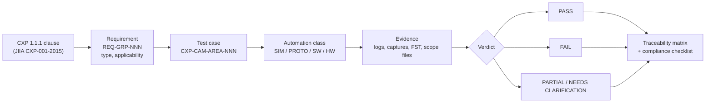

### 8.1 Test catalogue

| Test ID | Title | Requirements | Class | Automation | Status |
|---|---|---|---|---|---|
| [CXP-CAM-INIT-001](#cxp-cam-init-001) | Power-up connection reset state | REQ-RST-001, REQ-RST-002, REQ-RST-003, REQ-RST-004, REQ-RST-005, REQ-RST-006, REQ-RST-008, REQ-INIT-003, REQ-TRIG-002, REQ-BOOT-004 | RTL/SIM | AUTOMATED | NOT TESTED |
| [CXP-CAM-INIT-002](#cxp-cam-init-002) | ConnectionReset via master: 200 ms, self-clear, rate fallback | REQ-INIT-001, REQ-INIT-002, REQ-INIT-003, REQ-RST-005 | Protocol | AUTOMATED | NOT TESTED |
| [CXP-CAM-INIT-003](#cxp-cam-init-003) | ConnectionReset on extension connection is ignored | REQ-RST-009, REQ-ML-003 | Protocol | AUTOMATED | NOT TESTED |
| [CXP-CAM-INIT-004](#cxp-cam-init-004) | Full discovery sequence against Host emulator | REQ-PHY-001, REQ-INIT-004, REQ-INIT-005, REQ-INIT-006, REQ-INIT-013, REQ-INIT-015, REQ-INIT-018, REQ-BOOT-001 | Protocol | AUTOMATED | NOT TESTED |
| [CXP-CAM-INIT-005](#cxp-cam-init-005) | Topology discovery with permuted cabling | REQ-INIT-004, REQ-ML-003, REQ-ML-004, REQ-INIT-005 | Protocol | PARTIALLY AUTOMATED | NOT TESTED |
| [CXP-CAM-INIT-006](#cxp-cam-init-006) | Operating bit-rate change via ConnectionConfig | REQ-INIT-010, REQ-INIT-011, REQ-INIT-012, REQ-DATA-007 | Protocol | AUTOMATED | NOT TESTED |
| [CXP-CAM-INIT-007](#cxp-cam-init-007) | StreamPacketSizeMax gating and limit | REQ-INIT-007, REQ-INIT-008, REQ-DATA-012, REQ-RST-004 | RTL/SIM | AUTOMATED | NOT TESTED |
| [CXP-CAM-INIT-008](#cxp-cam-init-008) | High speed upconnection discovery and fallback | REQ-INIT-016, REQ-INIT-017, REQ-INIT-018, REQ-REC-002, REQ-TRIG-010 | Protocol | AUTOMATED | NOT TESTED |
| [CXP-CAM-INIT-009](#cxp-cam-init-009) | ConnectionConfigDefault and reprogramming mechanism | REQ-INIT-013, REQ-INIT-014 | Protocol | PARTIALLY AUTOMATED | NOT TESTED |
| [CXP-CAM-BOOT-001](#cxp-cam-boot-001) | Bootstrap register map sweep (address/length/access) | REQ-BOOT-001, REQ-BOOT-012, REQ-BOOT-013, REQ-CTRL-014, REQ-ERR-006 | RTL/SIM | AUTOMATED | NOT TESTED |
| [CXP-CAM-BOOT-002](#cxp-cam-boot-002) | Standard magic number and Revision | REQ-BOOT-002, REQ-BOOT-003, REQ-PROT-006 | RTL/SIM | AUTOMATED | NOT TESTED |
| [CXP-CAM-BOOT-003](#cxp-cam-boot-003) | XML manifest registers | REQ-BOOT-004, REQ-BOOT-005, REQ-BOOT-006, REQ-GEN-011 | Protocol | AUTOMATED | NOT TESTED |
| [CXP-CAM-BOOT-004](#cxp-cam-boot-004) | Device information strings and Iidc2Address | REQ-BOOT-007, REQ-BOOT-008, REQ-BOOT-009, REQ-BOOT-010 | Protocol | AUTOMATED | NOT TESTED |
| [CXP-CAM-BOOT-005](#cxp-cam-boot-005) | DeviceUserID persistence | REQ-RST-012, REQ-BOOT-010 | Hardware (HW-dependent) | PARTIALLY AUTOMATED | NOT TESTED |
| [CXP-CAM-BOOT-006](#cxp-cam-boot-006) | Use-case *Address registers | REQ-BOOT-011, REQ-GEN-006, REQ-GEN-009, REQ-IOP-004 | Protocol | AUTOMATED | NOT TESTED |
| [CXP-CAM-BOOT-007](#cxp-cam-boot-007) | Black-box use case using bootstrap addresses only | REQ-BOOT-011, REQ-ACQ-002, REQ-ACQ-003, REQ-IOP-004 | Protocol | AUTOMATED | NOT TESTED |
| [CXP-CAM-BOOT-008](#cxp-cam-boot-008) | Writable manufacturer registers are readable | REQ-CTRL-015 | Software | AUTOMATED | NOT TESTED |
| [CXP-CAM-PROT-001](#cxp-cam-prot-001) | 8B/10B code and running-disparity validity | REQ-PROT-001, REQ-PROT-005 | Protocol | AUTOMATED | NOT TESTED |
| [CXP-CAM-PROT-002](#cxp-cam-prot-002) | Word structure and K-code usage audit | REQ-PROT-002, REQ-PROT-003, REQ-PROT-017, REQ-PROT-018 | Protocol | AUTOMATED | NOT TESTED |
| [CXP-CAM-PROT-003](#cxp-cam-prot-003) | IDLE word format and ≤ 100-word spacing | REQ-PROT-013, REQ-PROT-014, REQ-PROT-016 | Protocol | AUTOMATED | NOT TESTED |
| [CXP-CAM-PROT-004](#cxp-cam-prot-004) | Big-endian multi-byte fields | REQ-PROT-006, REQ-CTRL-014 | RTL/SIM | AUTOMATED | NOT TESTED |
| [CXP-CAM-PROT-005](#cxp-cam-prot-005) | Upconnection word alignment and re-alignment | REQ-PROT-004, REQ-REC-001 | RTL/SIM | AUTOMATED | NOT TESTED |
| [CXP-CAM-PROT-006](#cxp-cam-prot-006) | Single-bit error immunity of replicated characters | REQ-PROT-007, REQ-TRIG-004 | RTL/SIM | AUTOMATED | NOT TESTED |
| [CXP-CAM-PROT-007](#cxp-cam-prot-007) | CRC-32 conformance on Device transmissions | REQ-PROT-008, REQ-CTRL-007, REQ-DATA-003 | RTL/SIM | AUTOMATED | NOT TESTED |
| [CXP-CAM-PROT-008](#cxp-cam-prot-008) | CRC exclusions: IDLE stretching and K28.3 | REQ-PROT-009, REQ-DATA-011 | RTL/SIM | AUTOMATED | NOT TESTED |
| [CXP-CAM-PROT-009](#cxp-cam-prot-009) | Priority insertion and resume (I/O ack into stream packet) | REQ-PROT-010, REQ-PROT-011, REQ-TRIG-006 | RTL/SIM | AUTOMATED | NOT TESTED |
| [CXP-CAM-PROT-010](#cxp-cam-prot-010) | Direction and origin rules | REQ-PROT-017, REQ-CTRL-002 | Protocol | AUTOMATED | NOT TESTED |
| [CXP-CAM-CT-001](#cxp-cam-ct-001) | Device→Host test packet format and TestPacketCountTx | REQ-PROT-020, REQ-PROT-024, REQ-PROT-025, REQ-PROT-030 | RTL/SIM | AUTOMATED | NOT TESTED |
| [CXP-CAM-CT-002](#cxp-cam-ct-002) | Test-mode spacing and exclusive content | REQ-PROT-026, REQ-PROT-027, REQ-PROT-014 | Protocol | AUTOMATED | NOT TESTED |
| [CXP-CAM-CT-003](#cxp-cam-ct-003) | Control priority over test data; exit completes packet | REQ-PROT-028, REQ-PROT-029 | RTL/SIM | AUTOMATED | NOT TESTED |
| [CXP-CAM-CT-004](#cxp-cam-ct-004) | Host→Device test receiver counting | REQ-PROT-021, REQ-PROT-022, REQ-PROT-023 | RTL/SIM | AUTOMATED | NOT TESTED |
| [CXP-CAM-CT-005](#cxp-cam-ct-005) | Counter selector indexing and resets | REQ-PROT-031, REQ-PROT-022, REQ-PROT-030, REQ-RST-006 | RTL/SIM | AUTOMATED | NOT TESTED |
| [CXP-CAM-CT-006](#cxp-cam-ct-006) | ElectricalComplianceTest boot behaviour | REQ-PROT-032, REQ-PROT-033, REQ-RST-007, REQ-LAMP-002 | Hardware (HW-dependent) | PARTIALLY AUTOMATED | NOT TESTED |
| [CXP-CAM-CT-007](#cxp-cam-ct-007) | Test Mode interaction with I/O channel | REQ-PROT-027, REQ-TRIG-003 | Protocol | AUTOMATED | NOT TESTED |
| [CXP-CAM-CTRL-001](#cxp-cam-ctrl-001) | Read command decode and read acknowledgment format | REQ-CTRL-001, REQ-CTRL-002, REQ-CTRL-006, REQ-CTRL-007, REQ-CTRL-009, REQ-CTRL-011 | RTL/SIM | AUTOMATED | NOT TESTED |
| [CXP-CAM-CTRL-002](#cxp-cam-ctrl-002) | Write command and write acknowledgment | REQ-CTRL-002, REQ-CTRL-006, REQ-CTRL-008 | RTL/SIM | AUTOMATED | NOT TESTED |
| [CXP-CAM-CTRL-003](#cxp-cam-ctrl-003) | 200 ms transaction limit across the register map | REQ-CTRL-003 | Protocol | AUTOMATED | NOT TESTED |
| [CXP-CAM-CTRL-004](#cxp-cam-ctrl-004) | Wait acknowledgment protocol | REQ-CTRL-004 | Protocol | AUTOMATED | NOT TESTED |
| [CXP-CAM-CTRL-005](#cxp-cam-ctrl-005) | No wait acknowledgment for bootstrap registers | REQ-CTRL-005 | Protocol | AUTOMATED | NOT TESTED |
| [CXP-CAM-CTRL-006](#cxp-cam-ctrl-006) | Control channel reset | REQ-RST-010, REQ-RST-011 | RTL/SIM | AUTOMATED | NOT TESTED |
| [CXP-CAM-CTRL-007](#cxp-cam-ctrl-007) | Extension connection control access | REQ-ML-003, REQ-ERR-012, REQ-ML-004 | Protocol | AUTOMATED | NOT TESTED |
| [CXP-CAM-CTRL-008](#cxp-cam-ctrl-008) | ControlPacketSizeMax limits | REQ-INIT-006, REQ-CTRL-010, REQ-ERR-008 | RTL/SIM | AUTOMATED | NOT TESTED |
| [CXP-CAM-CTRL-009](#cxp-cam-ctrl-009) | Large memory access split rules and non-multiple-of-4 reads | REQ-CTRL-011, REQ-CTRL-012, REQ-CTRL-013 | RTL/SIM | AUTOMATED | NOT TESTED |
| [CXP-CAM-CTRL-010](#cxp-cam-ctrl-010) | Ack latency under maximum stream load | REQ-CTRL-003, REQ-PROT-012 | Protocol | AUTOMATED | NOT TESTED |
| [CXP-CAM-NEG-001](#cxp-cam-neg-001) | CRC error in command → 0x80, not executed | REQ-ERR-001, REQ-ERR-002 | RTL/SIM | AUTOMATED | NOT TESTED |
| [CXP-CAM-NEG-002](#cxp-cam-neg-002) | Invalid address → 0x40 | REQ-ERR-003, REQ-ERR-002 | RTL/SIM | AUTOMATED | NOT TESTED |
| [CXP-CAM-NEG-003](#cxp-cam-neg-003) | Invalid data → 0x41 | REQ-ERR-004, REQ-INIT-012, REQ-BOOT-004, REQ-PROT-031 | RTL/SIM | AUTOMATED | NOT TESTED |
| [CXP-CAM-NEG-004](#cxp-cam-neg-004) | Invalid opcode → 0x42 | REQ-ERR-005 | RTL/SIM | AUTOMATED | NOT TESTED |
| [CXP-CAM-NEG-005](#cxp-cam-neg-005) | Write to read-only → 0x43; read from write-only → 0x44 | REQ-ERR-006, REQ-ERR-007 | RTL/SIM | AUTOMATED | NOT TESTED |
| [CXP-CAM-NEG-006](#cxp-cam-neg-006) | Size too large → 0x45 and inconsistent size → 0x46 | REQ-ERR-008, REQ-ERR-009 | RTL/SIM | AUTOMATED | NOT TESTED |
| [CXP-CAM-NEG-007](#cxp-cam-neg-007) | Malformed and truncated commands | REQ-ERR-010, REQ-ERR-011, REQ-ERR-002 | RTL/SIM | AUTOMATED | NOT TESTED |
| [CXP-CAM-NEG-008](#cxp-cam-neg-008) | Unknown/unexpected packet types on the upconnection | REQ-PROT-019 | RTL/SIM | AUTOMATED | NOT TESTED |
| [CXP-CAM-NEG-009](#cxp-cam-neg-009) | 8B/10B code and disparity errors on the upconnection | REQ-PROT-004, REQ-PROT-007 | RTL/SIM | AUTOMATED | NOT TESTED |
| [CXP-CAM-NEG-010](#cxp-cam-neg-010) | Host protocol violations: overlapping and duplicate commands | REQ-CTRL-002, REQ-CTRL-016 | RTL/SIM | AUTOMATED | NOT TESTED |
| [CXP-CAM-NEG-011](#cxp-cam-neg-011) | Reset during transaction and power interruption | REQ-INIT-001, REQ-RST-012, REQ-RST-010 | Hardware (HW-dependent) | PARTIALLY AUTOMATED | NOT TESTED |
| [CXP-CAM-NEG-012](#cxp-cam-neg-012) | Corrupted and out-of-range trigger packets | REQ-TRIG-004, REQ-PROT-007 | RTL/SIM | AUTOMATED | NOT TESTED |
| [CXP-CAM-NEG-013](#cxp-cam-neg-013) | Link interruption during streaming | REQ-REC-001, REQ-REC-003 | Hardware (HW-dependent) | MANUAL | NOT TESTED |
| [CXP-CAM-DATA-001](#cxp-cam-data-001) | Stream packet format | REQ-DATA-001, REQ-DATA-002, REQ-DATA-003, REQ-PROT-018 | RTL/SIM | AUTOMATED | NOT TESTED |
| [CXP-CAM-DATA-002](#cxp-cam-data-002) | Packet tag increment and wrap | REQ-DATA-004, REQ-DATA-005 | RTL/SIM | AUTOMATED | NOT TESTED |
| [CXP-CAM-DATA-003](#cxp-cam-data-003) | Packet tag persistence and reset triggers | REQ-DATA-006, REQ-DATA-007, REQ-RST-005 | RTL/SIM | AUTOMATED | NOT TESTED |
| [CXP-CAM-DATA-004](#cxp-cam-data-004) | Multi-stream packet multiplexing and in-order delivery | REQ-DATA-008, REQ-DATA-005, REQ-IMG-018 | RTL/SIM | AUTOMATED | NOT TESTED |
| [CXP-CAM-DATA-005](#cxp-cam-data-005) | Stream IDs static, unique and consistent | REQ-DATA-009, REQ-DATA-010, REQ-GEN-009 | Protocol | AUTOMATED | NOT TESTED |
| [CXP-CAM-DATA-006](#cxp-cam-data-006) | Stream formation across packet boundaries | REQ-DATA-001, REQ-DATA-011, REQ-DATA-012 | RTL/SIM | AUTOMATED | NOT TESTED |
| [CXP-CAM-ML-001](#cxp-cam-ml-001) | Round-robin packet distribution over connections | REQ-ML-001, REQ-ML-002 | Protocol | AUTOMATED | NOT TESTED |
| [CXP-CAM-ML-002](#cxp-cam-ml-002) | Multi-connection common clock | REQ-PHY-025 | Hardware (HW-dependent) | MANUAL | NOT TESTED |
| [CXP-CAM-IMG-001](#cxp-cam-img-001) | Rectangular image header structure | REQ-IMG-004, REQ-IMG-008, REQ-PIX-002, REQ-IMG-016 | RTL/SIM | AUTOMATED | NOT TESTED |
| [CXP-CAM-IMG-002](#cxp-cam-img-002) | Header per frame and marker per line | REQ-IMG-001, REQ-IMG-002, REQ-IMG-009 | RTL/SIM | AUTOMATED | NOT TESTED |
| [CXP-CAM-IMG-003](#cxp-cam-img-003) | Geometry fields vs configured ROI | REQ-IMG-006, REQ-IMG-007, REQ-IMG-009 | RTL/SIM | AUTOMATED | NOT TESTED |
| [CXP-CAM-IMG-004](#cxp-cam-img-004) | Line packing, first pixel in P0, zero padding | REQ-IMG-003, REQ-PIX-003 | RTL/SIM | AUTOMATED | NOT TESTED |
| [CXP-CAM-IMG-005](#cxp-cam-img-005) | SourceTag increment and wrap | REQ-IMG-005 | RTL/SIM | AUTOMATED | NOT TESTED |
| [CXP-CAM-IMG-006](#cxp-cam-img-006) | Line-scan header rules | REQ-IMG-010, REQ-IMG-011 | RTL/SIM | AUTOMATED | NOT TESTED |
| [CXP-CAM-IMG-007](#cxp-cam-img-007) | Arbitrary image stream | REQ-IMG-012, REQ-IMG-013 | RTL/SIM | AUTOMATED | NOT TESTED |
| [CXP-CAM-IMG-008](#cxp-cam-img-008) | Interlaced flags and offsets | REQ-IMG-008, REQ-IMG-014 | RTL/SIM | AUTOMATED | NOT TESTED |
| [CXP-CAM-IMG-009](#cxp-cam-img-009) | Horizontal scan direction | REQ-IMG-015 | RTL/SIM | AUTOMATED | NOT TESTED |
| [CXP-CAM-IMG-010](#cxp-cam-img-010) | Tap geometry coding and per-tap streams | REQ-IMG-016, REQ-IMG-017, REQ-IMG-019, REQ-GEN-008 | RTL/SIM | AUTOMATED | NOT TESTED |
| [CXP-CAM-IMG-011](#cxp-cam-img-011) | End-to-end image integrity | REQ-DATA-003, REQ-PIX-003 | Protocol | AUTOMATED | NOT TESTED |
| [CXP-CAM-IMG-012](#cxp-cam-img-012) | AcquisitionStop frame completion | REQ-ACQ-003, REQ-ACQ-004 | Protocol | AUTOMATED | NOT TESTED |
| [CXP-CAM-PIX-001](#cxp-cam-pix-001) | PixelFormat ↔ PixelF mapping | REQ-PIX-001, REQ-PIX-006, REQ-GEN-012 | Software | AUTOMATED | NOT TESTED |
| [CXP-CAM-PIX-002](#cxp-cam-pix-002) | Packing golden vectors 8/10/12/14/16 bit | REQ-PIX-003 | RTL/SIM | AUTOMATED | NOT TESTED |
| [CXP-CAM-PIX-003](#cxp-cam-pix-003) | In-between widths MSB-aligned | REQ-PIX-004 | RTL/SIM | AUTOMATED | NOT TESTED |
| [CXP-CAM-PIX-004](#cxp-cam-pix-004) | Colour component order | REQ-PIX-005 | RTL/SIM | AUTOMATED | NOT TESTED |
| [CXP-CAM-TRIG-001](#cxp-cam-trig-001) | LS trigger decode and I/O acknowledgment | REQ-TRIG-003, REQ-TRIG-004, REQ-TRIG-001 | RTL/SIM | AUTOMATED | NOT TESTED |
| [CXP-CAM-TRIG-002](#cxp-cam-trig-002) | Trigger delay compensation (latency and jitter) | REQ-TRIG-005, REQ-PERF-002 | Hardware (HW-dependent) | PARTIALLY AUTOMATED | NOT TESTED |
| [CXP-CAM-TRIG-003](#cxp-cam-trig-003) | Trigger de-assertion at discovery/reset | REQ-TRIG-002, REQ-RST-008 | RTL/SIM | AUTOMATED | NOT TESTED |
| [CXP-CAM-TRIG-004](#cxp-cam-trig-004) | Device→Host HS trigger format and ack rules | REQ-TRIG-007, REQ-TRIG-008, REQ-TRIG-009 | RTL/SIM | AUTOMATED | NOT TESTED |
| [CXP-CAM-TRIG-005](#cxp-cam-trig-005) | HS upconnection triggers | REQ-TRIG-010, REQ-PERF-001 | RTL/SIM | AUTOMATED | NOT TESTED |
| [CXP-CAM-TRIG-006](#cxp-cam-trig-006) | I/O ack latency vs Host LS timeout | REQ-TRIG-011, REQ-TRIG-006 | Protocol | AUTOMATED | NOT TESTED |
| [CXP-CAM-TRIG-007](#cxp-cam-trig-007) | Trigger during acquisition, overlap and rate stress | REQ-TRIG-003 | Protocol | AUTOMATED | NOT TESTED |
| [CXP-CAM-GEN-001](#cxp-cam-gen-001) | XML retrieval, decompression and schema validation | REQ-GEN-001, REQ-GEN-002, REQ-GEN-004, REQ-GEN-010, REQ-GEN-011 | Software | AUTOMATED | NOT TESTED |
| [CXP-CAM-GEN-002](#cxp-cam-gen-002) | GenApi load and SFNC conformance | REQ-GEN-003, REQ-GEN-005 | Software | AUTOMATED | NOT TESTED |
| [CXP-CAM-GEN-003](#cxp-cam-gen-003) | Mandatory use-case features | REQ-GEN-006, REQ-GEN-009, REQ-ACQ-001 | Software | AUTOMATED | NOT TESTED |
| [CXP-CAM-GEN-004](#cxp-cam-gen-004) | Bootstrap registers in XML | REQ-GEN-007 | Software | AUTOMATED | NOT TESTED |
| [CXP-CAM-GEN-005](#cxp-cam-gen-005) | AcquisitionStart/Stop single-shot semantics | REQ-ACQ-002, REQ-ACQ-003 | Protocol | AUTOMATED | NOT TESTED |
| [CXP-CAM-GEN-006](#cxp-cam-gen-006) | Feature sweep: access modes, ranges, enumerations, dependencies | REQ-GEN-003, REQ-CTRL-015 | Software | AUTOMATED | NOT TESTED |
| [CXP-CAM-GEN-007](#cxp-cam-gen-007) | Image format features vs stream (Width/Height/PixelFormat/Offsets) | REQ-GEN-006, REQ-IMG-006, REQ-PIX-006 | Software | AUTOMATED | NOT TESTED |
| [CXP-CAM-GEN-008](#cxp-cam-gen-008) | Exposure, frame rate and trigger features (camera functional) | — | Software | AUTOMATED | NOT TESTED |
| [CXP-CAM-GEN-009](#cxp-cam-gen-009) | IIDC2 XML description | REQ-GEN-013, REQ-BOOT-007 | Software | AUTOMATED | NOT TESTED |
| [CXP-CAM-BND-001](#cxp-cam-bnd-001) | Image geometry boundaries | REQ-IMG-006, REQ-IMG-007 | Software | AUTOMATED | NOT TESTED |
| [CXP-CAM-BND-002](#cxp-cam-bnd-002) | Trigger delay value boundaries | REQ-TRIG-005 | RTL/SIM | AUTOMATED | NOT TESTED |
| [CXP-CAM-BND-003](#cxp-cam-bnd-003) | MasterHostConnectionID and StreamPacketSizeMax extremes | REQ-INIT-005, REQ-INIT-008, REQ-INIT-009 | RTL/SIM | AUTOMATED | NOT TESTED |
| [CXP-CAM-PERF-001](#cxp-cam-perf-001) | Maximum sustained bandwidth | REQ-PHY-001, REQ-PROT-014, REQ-PERF-003 | Protocol | AUTOMATED | NOT TESTED |
| [CXP-CAM-PERF-002](#cxp-cam-perf-002) | Maximum frame rate / minimum frame size | — | Protocol | AUTOMATED | NOT TESTED |
| [CXP-CAM-PERF-003](#cxp-cam-perf-003) | Long-duration streaming soak | REQ-DATA-004, REQ-IMG-005, REQ-DATA-003 | Protocol | AUTOMATED | NOT TESTED |
| [CXP-CAM-PERF-004](#cxp-cam-perf-004) | Buffer pressure and back-to-back frames | — | Protocol | AUTOMATED | NOT TESTED |
| [CXP-CAM-PERF-005](#cxp-cam-perf-005) | Bit rate tolerance over temperature | REQ-PHY-003 | Hardware (HW-dependent) | PARTIALLY AUTOMATED | NOT TESTED |
| [CXP-CAM-REC-001](#cxp-cam-rec-001) | Cable disconnect/reconnect during streaming | REQ-REC-003, REQ-RST-001, REQ-PWR-010 | Hardware (HW-dependent) | MANUAL | NOT TESTED |
| [CXP-CAM-REC-002](#cxp-cam-rec-002) | Host reset / driver restart | REQ-INIT-001, REQ-INIT-002 | Protocol | AUTOMATED | NOT TESTED |
| [CXP-CAM-REC-003](#cxp-cam-rec-003) | Camera power cycle / reset during acquisition | REQ-RST-001 | Hardware (HW-dependent) | PARTIALLY AUTOMATED | NOT TESTED |
| [CXP-CAM-REC-004](#cxp-cam-rec-004) | LS upconnection loss of lock | REQ-REC-001, REQ-PROT-004 | RTL/SIM | AUTOMATED | NOT TESTED |
| [CXP-CAM-REC-005](#cxp-cam-rec-005) | HS upconnection loss and fallback | REQ-REC-002, REQ-INIT-017 | Protocol | AUTOMATED | NOT TESTED |
| [CXP-CAM-REC-006](#cxp-cam-rec-006) | Acquisition recovery after errors | REQ-RST-010, REQ-ERR-001 | Protocol | AUTOMATED | NOT TESTED |
| [CXP-CAM-IOP-001](#cxp-cam-iop-001) | Reference frame grabbers (≥ 2 vendors) | REQ-IOP-001 | Hardware (HW-dependent) | PARTIALLY AUTOMATED | NOT TESTED |
| [CXP-CAM-IOP-002](#cxp-cam-iop-002) | Independent GenICam client | REQ-GEN-001, REQ-GEN-002 | Software | AUTOMATED | NOT TESTED |
| [CXP-CAM-IOP-003](#cxp-cam-iop-003) | Passive protocol-analyzer compliance audit | REQ-PROT-002, REQ-PROT-018 | Protocol | AUTOMATED | NOT TESTED |
| [CXP-CAM-IOP-004](#cxp-cam-iop-004) | Cable variants | REQ-PHY-018, REQ-PHY-001 | Hardware (HW-dependent) | MANUAL | NOT TESTED |
| [CXP-CAM-IOP-005](#cxp-cam-iop-005) | v1.0 Host backward compatibility | REQ-IOP-002 | Hardware (HW-dependent) | MANUAL | NOT TESTED |
| [CXP-CAM-IOP-006](#cxp-cam-iop-006) | Two Devices on one Host (topology) | REQ-INIT-004, REQ-INIT-005 | Hardware (HW-dependent) | PARTIALLY AUTOMATED | NOT TESTED |
| [CXP-CAM-IOP-007](#cxp-cam-iop-007) | JIIA compliance test procedure (Ref 8) | REQ-IOP-003, REQ-CON-008 | Hardware (HW-dependent) | MANUAL | NOT TESTED |
| [CXP-CAM-PHY-001](#cxp-cam-phy-001) | High speed bit rate and ±100 ppm tolerance | REQ-PHY-001, REQ-PHY-002, REQ-PHY-003 | Hardware (HW-dependent) | PARTIALLY AUTOMATED | NOT TESTED |
| [CXP-CAM-PHY-002](#cxp-cam-phy-002) | Transmit eye at Tp2 (amplitude, eye, rise/fall, jitter) | REQ-PHY-004, REQ-PHY-010, REQ-PHY-013, REQ-PHY-014, REQ-PHY-015 | Hardware (HW-dependent) | PARTIALLY AUTOMATED | NOT TESTED |
| [CXP-CAM-PHY-003](#cxp-cam-phy-003) | No transmitter pre-/de-emphasis | REQ-PHY-016 | Hardware (HW-dependent) | MANUAL | NOT TESTED |
| [CXP-CAM-PHY-004](#cxp-cam-phy-004) | Device return loss (Table 8) | REQ-PHY-012 | Hardware (HW-dependent) | PARTIALLY AUTOMATED | NOT TESTED |
| [CXP-CAM-PHY-005](#cxp-cam-phy-005) | Front-end component inspection (Cd, Lp, termination) | REQ-PHY-005, REQ-PHY-006, REQ-PHY-007, REQ-PHY-008, REQ-PHY-009 | Hardware (HW-dependent) | MANUAL | NOT TESTED |
| [CXP-CAM-PHY-006](#cxp-cam-phy-006) | Low speed receive sensitivity with 135 m-equivalent cable | REQ-PHY-011, REQ-PHY-017, REQ-PHY-018 | Hardware (HW-dependent) | PARTIALLY AUTOMATED | NOT TESTED |
| [CXP-CAM-PHY-007](#cxp-cam-phy-007) | HS upconnection front end (Device HT) | REQ-PHY-019, REQ-PHY-020, REQ-PWR-003 | Hardware (HW-dependent) | MANUAL | NOT TESTED |
| [CXP-CAM-CON-001](#cxp-cam-con-001) | Connector type and gender | REQ-CON-001, REQ-CON-002, REQ-CON-004 | Hardware (HW-dependent) | MANUAL | NOT TESTED |
| [CXP-CAM-CON-002](#cxp-cam-con-002) | Multi-connector geometry | REQ-CON-003 | Hardware (HW-dependent) | MANUAL | NOT TESTED |
| [CXP-CAM-CON-003](#cxp-cam-con-003) | Product labelling and feature bar | REQ-CON-006, REQ-CON-007, REQ-CON-008, REQ-CON-009, REQ-CON-005 | Hardware (HW-dependent) | MANUAL | NOT TESTED |
| [CXP-CAM-LAMP-001](#cxp-cam-lamp-001) | Indicator lamp state walk-through | REQ-LAMP-001, REQ-LAMP-002, REQ-LAMP-004, REQ-LAMP-006 | Hardware (HW-dependent) | MANUAL | NOT TESTED |
| [CXP-CAM-LAMP-002](#cxp-cam-lamp-002) | Indicator lamp timings | REQ-LAMP-003, REQ-LAMP-005 | Hardware (HW-dependent) | PARTIALLY AUTOMATED | NOT TESTED |
| [CXP-CAM-PWR-001](#cxp-cam-pwr-001) | Operating voltage range 18.5–26 V | REQ-PWR-004 | Hardware (HW-dependent) | PARTIALLY AUTOMATED | NOT TESTED |
| [CXP-CAM-PWR-002](#cxp-cam-pwr-002) | Over-voltage survival 30 V / 50 V overshoot | REQ-PWR-005 | Hardware (HW-dependent) | MANUAL | NOT TESTED |
| [CXP-CAM-PWR-003](#cxp-cam-pwr-003) | Maximum power per cable | REQ-PWR-006, REQ-PWR-012, REQ-PWR-002, REQ-PWR-001 | Hardware (HW-dependent) | PARTIALLY AUTOMATED | NOT TESTED |
| [CXP-CAM-PWR-004](#cxp-cam-pwr-004) | Start-up current limit (50 mA until 25 ms after 15 V) | REQ-PWR-007 | Hardware (HW-dependent) | PARTIALLY AUTOMATED | NOT TESTED |
| [CXP-CAM-PWR-005](#cxp-cam-pwr-005) | Detection signature 4k7 ± 5 % | REQ-PWR-008, REQ-PWR-014, REQ-PWR-016 | Hardware (HW-dependent) | PARTIALLY AUTOMATED | NOT TESTED |
| [CXP-CAM-PWR-006](#cxp-cam-pwr-006) | Input capacitance and discharge | REQ-PWR-009, REQ-PWR-010 | Hardware (HW-dependent) | PARTIALLY AUTOMATED | NOT TESTED |
| [CXP-CAM-PWR-007](#cxp-cam-pwr-007) | Minimum load current | REQ-PWR-011 | Hardware (HW-dependent) | PARTIALLY AUTOMATED | NOT TESTED |
| [CXP-CAM-PWR-008](#cxp-cam-pwr-008) | Power isolation between connectors and sources | REQ-PWR-013, REQ-PWR-015 | Hardware (HW-dependent) | MANUAL | NOT TESTED |
| [CXP-CAM-PWR-009](#cxp-cam-pwr-009) | PoCXP Host detection interoperability | REQ-PWR-008, REQ-PWR-010, REQ-PWR-011 | Hardware (HW-dependent) | MANUAL | NOT TESTED |


## 9. Protocol Validation

Covers link initialisation/discovery (§10.1), transport layer (§8.2), packet structure, CRC, IDLE, priority insertion, direction rules and the connection test (§8.7). The acknowledgment/response, malformed, timeout, duplicate and unexpected packet cases are in §10 and §14. Sequence numbers in CXP are the stream PacketTag and SourceTag (§11). Control packets have no sequence number, so duplicates cannot be detected by the Device (see NEG-010).

**Figure D-20 — Operating bit-rate change (§10.1.6.1, Fig. 39)**

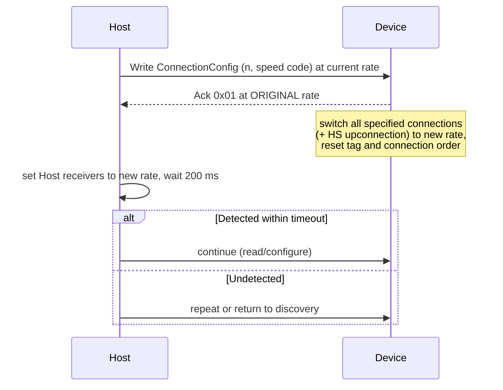

**Figure D-18 — Connection test methodology (§8.7, Fig. 25)**

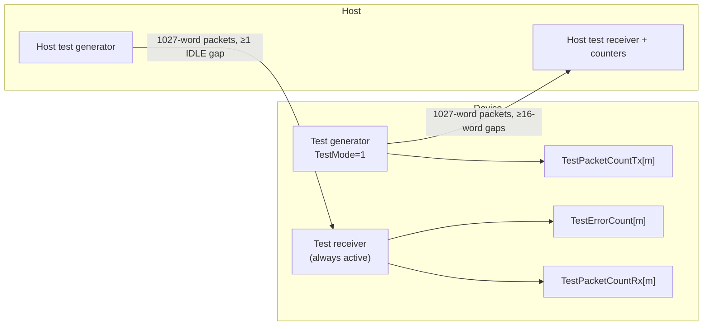

**Figure D-19 — High speed upconnection discovery and fallback (§10.1.4, §10.1.6.1, §10.2)**

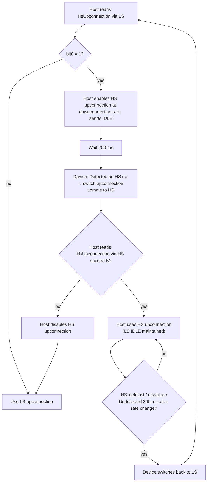

### 9.1 Priority insertion timing (§8.2.4, Figures 17–19)

```text
HS downconnection (words):
| K27.7 | 0x01 | p-data | p-data |[K28.6 | 0x01]| p-data | p-data | CRC | K29.7 | IDLE | IDLE |
                                   ^ I/O ack inserted at word boundary, stream packet resumes

LS upconnection (characters):
| K28.5 K28.1 |[K28.2 K28.4 K28.4 d d d]| K28.1 D21.5 | K27.7 K27.7 K27.7 |[K28.4 K28.2 K28.2 d d d]| K27.7 0x02 ...
                ^ rising trigger interrupts IDLE           falling trigger inserted inside a command SOP ^
```

<a id="cxp-cam-init-001"></a>
#### CXP-CAM-INIT-001 — Power-up connection reset state

`AUTOMATED` · `RTL/SIM` · Status: **NOT TESTED** · kind: executable

- **Requirement(s):** [REQ-RST-001](#req-rst-001), [REQ-RST-002](#req-rst-002), [REQ-RST-003](#req-rst-003), [REQ-RST-004](#req-rst-004), [REQ-RST-005](#req-rst-005), [REQ-RST-006](#req-rst-006), [REQ-RST-008](#req-rst-008), [REQ-INIT-003](#req-init-003), [REQ-TRIG-002](#req-trig-002), [REQ-BOOT-004](#req-boot-004). CXP 1.1.1 clause(s): §10.3.28, 10.3.7, 10.3.8, 8.3.2
- **Objective:** Verify that after power-up the Device is in the connection-reset state defined by §10.3.28.
- **Preconditions:** DUT unpowered; exerciser connected to connection 0 (and all extensions if MULTI); no prior configuration.
- **Test equipment:**
  - CXP protocol exerciser / Host emulator (character-level upconnection generation, error injection)
  - CXP protocol analyzer (passive tap, 8B/10B character capture, timestamps)
  - FPGA/RTL testbench: cocotb + pyuvm on Verilator/Questa with Host BFM, scoreboards
- **Procedure:**
  1. Apply power (in SIM: release all resets).
  2. Observe the downconnection with the analyzer from the first character.
  3. Sweep the exerciser receiver over the discovery rates (1.25, 3.125 Gbps) until Detected.
  4. Over the master LS upconnection read: ConnectionConfig, MasterHostConnectionID, StreamPacketSizeMax, TestMode, TestErrorCountSelector, TestErrorCount/TestPacketCountTx/Rx for every selector, HsUpconnection, XmlManifestSelector, ConnectionReset.
  5. Check extension connections carry no link activity (MULTI).
  6. Check no trigger asserted inside the Device (probe/sim signal).
- **Stimulus:** Power-on; read commands (Cmd 0x00, B = 4 or 8) to the listed bootstrap addresses.
- **Expected result:** Master transmits IDLE only at the lowest supported discovery rate; ConnectionConfig = (1 connection, speed code of that rate); MasterHostConnectionID = 0; StreamPacketSizeMax = 0; TestMode = 0; selector = 0; all counters = 0; XmlManifestSelector = 0; HsUpconnection = support bit; ConnectionReset = 0.
- **PASS criteria:** Every listed register equals its reset value; downconnection contains only IDLE words (no stream/test packets) until configured; extensions inactive.
- **FAIL criteria:** Any register differs; any non-IDLE packet other than control acks; master at a non-discovery rate; extension active.
- **Evidence:** Analyzer capture (first 10 ms), register dump log, sim transcript / waveform (FST).
- **Automation:** AUTOMATED (RTL/SIM)

<a id="cxp-cam-init-002"></a>
#### CXP-CAM-INIT-002 — ConnectionReset via master: 200 ms, self-clear, rate fallback

`AUTOMATED` · `Protocol` · Status: **NOT TESTED** · kind: executable

- **Requirement(s):** [REQ-INIT-001](#req-init-001), [REQ-INIT-002](#req-init-002), [REQ-INIT-003](#req-init-003), [REQ-RST-005](#req-rst-005). CXP 1.1.1 clause(s): §10.1.2, 10.3.28, 10.3.28
- **Objective:** Verify ConnectionReset execution time, register self-clear and return to discovery configuration from an operational high-rate multi-connection state.
- **Preconditions:** DUT discovered and running at its ConnectionConfigDefault; streaming active; StreamPacketSizeMax > 0.
- **Test equipment:**
  - CXP protocol exerciser / Host emulator (character-level upconnection generation, error injection)
  - CXP protocol analyzer (passive tap, 8B/10B character capture, timestamps)
  - FPGA/RTL testbench: cocotb + pyuvm on Verilator/Questa with Host BFM, scoreboards
- **Procedure:**
  1. Start continuous acquisition and confirm stream packets on all connections.
  2. Write 0x00000001 to 0x4000 via master (fire-and-forget; do not wait for ack).
  3. Timestamp the write EOP (t0).
  4. Re-lock the Host receiver at each discovery rate; record time t1 at which Detected is reached on master at the lowest supported discovery rate.
  5. Read ConnectionReset, ConnectionConfig, StreamPacketSizeMax.
  6. Repeat 100× with random write instants relative to stream packet boundaries.
- **Stimulus:** Write command: Cmd 0x01, Size 0x000004, Addr 0x00004000, Data 0x00000001.
- **Expected result:** Device stops streaming, switches master to lowest discovery rate, disables extensions within 200 ms; ConnectionReset reads 0.
- **PASS criteria:** t(discovery config active) − t0 ≤ 200 ms in 100/100 trials; ConnectionReset = 0 on first successful read; ConnectionConfig = discovery value; SPSM = 0; no stream packet after reset.
- **FAIL criteria:** Any trial > 200 ms; register not cleared; streaming continues; Device not detectable at a discovery rate.
- **Evidence:** Analyzer timestamps table, per-trial CSV, register reads.
- **Automation:** AUTOMATED (Protocol)

Test diagram (stimulus → camera → protocol → host → expected) — see also Figure D-5:

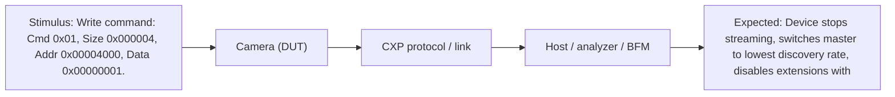

<a id="cxp-cam-init-003"></a>
#### CXP-CAM-INIT-003 — ConnectionReset on extension connection is ignored

`AUTOMATED` · `Protocol` · Status: **NOT TESTED** · kind: executable

- **Requirement(s):** [REQ-RST-009](#req-rst-009), [REQ-ML-003](#req-ml-003). CXP 1.1.1 clause(s): §10.3.28, 8.6
- **Objective:** Verify that a connection reset received on an extension connection is ignored.
- **Preconditions:** MULTI Device, all connections discovered and streaming at ConnectionConfigDefault.
- **Test equipment:**
  - CXP protocol exerciser / Host emulator (character-level upconnection generation, error injection)
  - CXP protocol analyzer (passive tap, 8B/10B character capture, timestamps)
- **Procedure:**
  1. Stream continuously.
  2. Write 0x00000001 to ConnectionReset via extension connection k (each k ≥ 1).
  3. Monitor all connections for 500 ms.
  4. Read ConnectionConfig and packet tag continuity via master.
- **Stimulus:** Write 0x00000001 to 0x4000 on extension connection k.
- **Expected result:** No reset: rate, connection count, streaming and packet tags continue uninterrupted.
- **PASS criteria:** No change in ConnectionConfig; no gap or restart in packet tags; master control channel still operational.
- **FAIL criteria:** Any reset symptom (rate change, tag restart, SPSM = 0).
- **Evidence:** Analyzer capture across all connections; tag continuity report.
- **Automation:** AUTOMATED (Protocol)

<a id="cxp-cam-init-004"></a>
#### CXP-CAM-INIT-004 — Full discovery sequence against Host emulator

`AUTOMATED` · `Protocol` · Status: **NOT TESTED** · kind: executable

- **Requirement(s):** [REQ-PHY-001](#req-phy-001), [REQ-INIT-004](#req-init-004), [REQ-INIT-005](#req-init-005), [REQ-INIT-006](#req-init-006), [REQ-INIT-013](#req-init-013), [REQ-INIT-015](#req-init-015), [REQ-INIT-018](#req-init-018), [REQ-BOOT-001](#req-boot-001). CXP 1.1.1 clause(s): §10.1.3, 10.3.29, 10.1.3, 10.3.30, 10.1.5, 10.3.31, 10.3.33, 10.3.34, 10.3.4, 10.3.41, 4.3
- **Objective:** Run the complete §10.1 discovery flow and confirm every Device-side response.
- **Preconditions:** DUT powered; exerciser implementing §10.1.2–10.1.6 host steps; control packet size limited to 128 bytes until CPSM read.
- **Test equipment:**
  - CXP protocol exerciser / Host emulator (character-level upconnection generation, error injection)
  - CXP protocol analyzer (passive tap, 8B/10B character capture, timestamps)
  - FPGA/RTL testbench: cocotb + pyuvm on Verilator/Questa with Host BFM, scoreboards
- **Procedure:**
  1. Write ConnectionReset = 1 on every Host connection; wait 200 ms.
  2. Lock at lowest discovery rate; if not Detected, try next discovery rate.
  3. Read DeviceConnectionID via each detected connection.
  4. Write MasterHostConnectionID (e.g. 0x00000001) via master; read back via every connection.
  5. Read HsUpconnection; read ControlPacketSizeMax; write StreamPacketSizeMax (host max).
  6. Read ConnectionConfigDefault; write ConnectionConfig with its connection count at discovery rate; verify extensions become Detected.
  7. Write ConnectionConfig = ConnectionConfigDefault (operating rate) per §10.1.6.1; verify Detected on all connections.
  8. Start acquisition; verify frames.
- **Stimulus:** Host discovery command script (see sequence diagram).
- **Expected result:** Device detected at a discovery rate; DeviceConnectionID = physical connection index; MasterHostConnectionID readback identical on all connections; CPSM ≥ 128 and multiple of 4; operating mode reached.
- **PASS criteria:** All steps complete with success acks (0x00/0x01), link Detected at operating rate on all connections, first frame received error-free.
- **FAIL criteria:** Any error ack, missing ack within 200 ms, Undetected connection after timeout, wrong ID values.
- **Evidence:** Discovery log with each command/ack, analyzer capture, final register dump.
- **Automation:** AUTOMATED (Protocol)

Test diagram (stimulus → camera → protocol → host → expected) — see also Figure D-5:

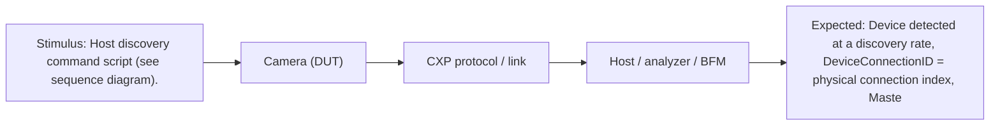

<a id="cxp-cam-init-005"></a>
#### CXP-CAM-INIT-005 — Topology discovery with permuted cabling

`PARTIALLY AUTOMATED` · `Protocol` · Status: **NOT TESTED** · kind: executable

- **Requirement(s):** [REQ-INIT-004](#req-init-004), [REQ-ML-003](#req-ml-003), [REQ-ML-004](#req-ml-004), [REQ-INIT-005](#req-init-005). CXP 1.1.1 clause(s): §10.1.3, 10.3.29, 10.1.3, 10.3.30, 10.3.30, 8.6
- **Objective:** Verify DeviceConnectionID / MasterHostConnectionID allow the Host to reconstruct any cable permutation (Figures 37–38).
- **Preconditions:** MULTI Device; Host with ≥ n+1 connections; cable permutation table.
- **Test equipment:**
  - Reference CXP frame grabber (Host) with GenTL producer
  - CXP protocol exerciser / Host emulator (character-level upconnection generation, error injection)
- **Procedure:**
  1. For each permutation of Device connections to Host ports (at least n cyclic shifts + one reversed):
  2. Run discovery; read DeviceConnectionID on every Detected port.
  3. Write a unique MasterHostConnectionID via the master; attempt a different value via an extension.
  4. Read MasterHostConnectionID on every port.
- **Stimulus:** Discovery per permutation; write via extension to 0x4008.
- **Expected result:** IDs match physical wiring; extension write ignored; all ports report the master's Host ID.
- **PASS criteria:** Topology reconstructed correctly for 100 % of permutations; extension write has no effect.
- **FAIL criteria:** Wrong ID; extension write changes value; discovery fails for any permutation.
- **Evidence:** Permutation matrix with read values, photos of cabling.
- **Automation:** PARTIALLY AUTOMATED (Protocol)

<a id="cxp-cam-init-006"></a>
#### CXP-CAM-INIT-006 — Operating bit-rate change via ConnectionConfig

`AUTOMATED` · `Protocol` · Status: **NOT TESTED** · kind: executable

- **Requirement(s):** [REQ-INIT-010](#req-init-010), [REQ-INIT-011](#req-init-011), [REQ-INIT-012](#req-init-012), [REQ-DATA-007](#req-data-007). CXP 1.1.1 clause(s): §10.1.6, 10.1.6.1, 10.3.33, 10.3.33
- **Objective:** Verify ack-before-switch ordering and re-lock within 200 ms for every rate change.
- **Preconditions:** Device discovered at discovery rate; list of valid ConnectionConfig values (from XML/documentation).
- **Test equipment:**
  - CXP protocol exerciser / Host emulator (character-level upconnection generation, error injection)
  - CXP protocol analyzer (passive tap, 8B/10B character capture, timestamps)
- **Procedure:**
  1. For every ordered pair (from, to) of valid ConnectionConfig values:
  2. Write ConnectionConfig = to; capture ack at old rate.
  3. Switch Host receivers to the new rate; wait 200 ms; check Detected on all specified connections.
  4. Read ConnectionConfig; start acquisition; confirm first packet tag = 0 on connection 0.
- **Stimulus:** Write Cmd 0x01 to 0x4014 with value (connections << 16) | speed code.
- **Expected result:** Ack 0x01 received completely at the old rate before the rate changes; Device Detected at the new rate within 200 ms; tag restarts at 0.
- **PASS criteria:** 100 % of transitions: ack at old rate, Detected ≤ 200 ms + Host lock time, readback equals written value, first packet tag 0 on connection 0.
- **FAIL criteria:** Ack missing/corrupted, switch before ack, lock failure, wrong readback, tag not reset.
- **Evidence:** Transition matrix, analyzer captures around each switch.
- **Automation:** AUTOMATED (Protocol)

Test diagram (stimulus → camera → protocol → host → expected) — see also Figure D-20:

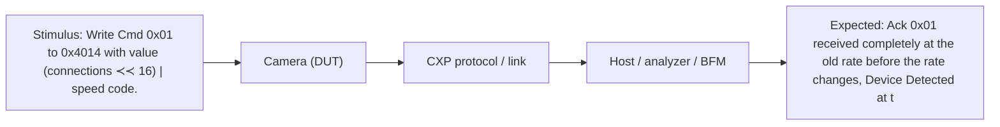

<a id="cxp-cam-init-007"></a>
#### CXP-CAM-INIT-007 — StreamPacketSizeMax gating and limit

`AUTOMATED` · `RTL/SIM` · Status: **NOT TESTED** · kind: executable

- **Requirement(s):** [REQ-INIT-007](#req-init-007), [REQ-INIT-008](#req-init-008), [REQ-DATA-012](#req-data-012), [REQ-RST-004](#req-rst-004). CXP 1.1.1 clause(s): §10.1.5, 10.3.28, 8.5.2, 8.5.2, 10.1.5, 10.3.32
- **Objective:** Verify no stream packets while SPSM = 0 and every stream packet ≤ SPSM bytes for each configured value.
- **Preconditions:** Device after connection reset (SPSM = 0).
- **Test equipment:**
  - FPGA/RTL testbench: cocotb + pyuvm on Verilator/Questa with Host BFM, scoreboards
  - CXP protocol exerciser / Host emulator (character-level upconnection generation, error injection)
  - CXP protocol analyzer (passive tap, 8B/10B character capture, timestamps)
- **Procedure:**
  1. Write AcquisitionStart = 1 while SPSM = 0; observe 1 s.
  2. For SPSM ∈ {36, 40, 128, 1024, 4096, 8192, host max}: write SPSM, stream ≥ 10 frames, measure every packet size (K27.7..K29.7).
  3. Write SPSM = 0 again during streaming (behaviour record only).
- **Stimulus:** Writes to 0x4010; AcquisitionStart via its bootstrap-provided address.
- **Expected result:** No stream packet while SPSM = 0; all packets ≤ SPSM; DsizeP ≤ (SPSM − 32)/4.
- **PASS criteria:** Zero violations over all packets and all SPSM values.
- **FAIL criteria:** Any stream packet with SPSM = 0; any packet > SPSM.
- **Evidence:** Packet-size histogram per SPSM, analyzer capture.
- **Automation:** AUTOMATED (RTL/SIM)

<a id="cxp-cam-init-008"></a>
#### CXP-CAM-INIT-008 — High speed upconnection discovery and fallback

`AUTOMATED` · `Protocol` · Status: **NOT TESTED** · kind: executable

- **Requirement(s):** [REQ-INIT-016](#req-init-016), [REQ-INIT-017](#req-init-017), [REQ-INIT-018](#req-init-018), [REQ-REC-002](#req-rec-002), [REQ-TRIG-010](#req-trig-010). CXP 1.1.1 clause(s): §10.1.4, 10.1.4, 10.1.6.1, 10.2, 10.3.41, 8.3.3
- **Objective:** Verify §10.1.4 HS upconnection enable, switch-over and fallback behaviour.
- **Preconditions:** HSUP Device with HS upconnection cable present; Host emulator supporting HS upconnection.
- **Test equipment:**
  - CXP protocol exerciser / Host emulator (character-level upconnection generation, error injection)
  - CXP protocol analyzer (passive tap, 8B/10B character capture, timestamps)
- **Procedure:**
  1. Read HsUpconnection via LS; expect bit0 = 1.
  2. Enable Host HS upconnection at downconnection rate sending IDLE; wait 200 ms.
  3. Read HsUpconnection via HS upconnection; verify success.
  4. Send commands/triggers on HS; verify responses.
  5. Disable HS upconnection transmitter; verify Device resumes accepting commands on LS.
  6. Change ConnectionConfig rate; keep HS upconnection off for > 200 ms; verify fallback to LS.
  7. Break HS upconnection mid-transaction; verify recovery.
- **Stimulus:** HS upconnection IDLE / commands / Table 16 triggers.
- **Expected result:** Device switches to HS when Detected, back to LS when HS disabled or undetected 200 ms after speed change.
- **PASS criteria:** All transitions succeed; no command lost after fallback beyond the one in flight.
- **FAIL criteria:** Device stays on dead HS link; commands on LS ignored after fallback.
- **Evidence:** Analyzer capture of both directions, command log.
- **Automation:** AUTOMATED (Protocol)

Test diagram (stimulus → camera → protocol → host → expected) — see also Figure D-19:

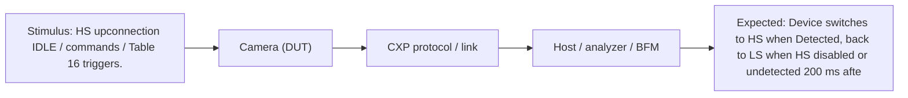

<a id="cxp-cam-init-009"></a>
#### CXP-CAM-INIT-009 — ConnectionConfigDefault and reprogramming mechanism

`PARTIALLY AUTOMATED` · `Protocol` · Status: **NOT TESTED** · kind: executable

- **Requirement(s):** [REQ-INIT-013](#req-init-013), [REQ-INIT-014](#req-init-014). CXP 1.1.1 clause(s): §10.3.34
- **Objective:** Verify ConnectionConfigDefault is a valid recommended mode and, if several modes exist, that it can be reprogrammed.
- **Preconditions:** Device documentation of manufacturer mechanism (unlock/update/commit).
- **Test equipment:**
  - CXP protocol exerciser / Host emulator (character-level upconnection generation, error injection)
  - Reference CXP frame grabber (Host) with GenTL producer
- **Procedure:**
  1. Read ConnectionConfigDefault; check it is in the valid list.
  2. Run discovery; confirm link reaches that mode.
  3. If MMODE: use the vendor mechanism to set another valid mode; power cycle; rediscover; confirm new default applied.
  4. Restore original default.
- **Stimulus:** Reads of 0x4018; vendor-specific register writes.
- **Expected result:** Default is valid and reachable; reprogrammed default persists and is used by discovery.
- **PASS criteria:** Valid default reached; reprogramming (if MMODE) persistent across power cycle.
- **FAIL criteria:** Invalid default; mode unreachable; reprogramming not persistent.
- **Evidence:** Register logs, discovery logs.
- **Automation:** PARTIALLY AUTOMATED (Protocol)

<a id="cxp-cam-prot-001"></a>
#### CXP-CAM-PROT-001 — 8B/10B code and running-disparity validity

`AUTOMATED` · `Protocol` · Status: **NOT TESTED** · kind: executable

- **Requirement(s):** [REQ-PROT-001](#req-prot-001), [REQ-PROT-005](#req-prot-005). CXP 1.1.1 clause(s): §4.1, 8.2.1, 8.2.1
- **Objective:** Verify every transmitted 10-bit symbol is a valid 8B/10B code with correct running disparity, bit 'a' first.
- **Preconditions:** Device streaming max-load images, then idle, then test mode.
- **Test equipment:**
  - CXP protocol analyzer (passive tap, 8B/10B character capture, timestamps)
  - FPGA/RTL testbench: cocotb + pyuvm on Verilator/Questa with Host BFM, scoreboards
  - Python golden CXP codec (CRC-32, packet builder/parser, pixel packing model)
- **Procedure:**
  1. Capture ≥ 10⁹ characters per connection in each mode.
  2. Decode with an independent 8B/10B decoder (IEEE tables incl. D.x.A7 rule).
  3. Count code violations, disparity errors, comma occurrences outside P0 of IDLE (false commas).
  4. In SIM: check the serializer bit order against Figure 15 using the IDLE word (BC 3C 3C B5 → 0011111010 …).
- **Stimulus:** Normal traffic.
- **Expected result:** Zero code/disparity violations; commas (K28.5) only at IDLE P0; Figure 15 bit order.
- **PASS criteria:** 0 errors in ≥ 10⁹ chars per mode per connection.
- **FAIL criteria:** Any invalid symbol, RD error, false comma in data.
- **Evidence:** Analyzer statistics, decoded capture excerpts.
- **Automation:** AUTOMATED (Protocol)

<a id="cxp-cam-prot-002"></a>
#### CXP-CAM-PROT-002 — Word structure and K-code usage audit

`AUTOMATED` · `Protocol` · Status: **NOT TESTED** · kind: executable

- **Requirement(s):** [REQ-PROT-002](#req-prot-002), [REQ-PROT-003](#req-prot-003), [REQ-PROT-017](#req-prot-017), [REQ-PROT-018](#req-prot-018). CXP 1.1.1 clause(s): §8.2.1, 8.2.3, 8.6, 8.4
- **Objective:** Verify every downconnection packet is word-aligned, uses only Table 11 K-codes for their functions, and uses only defined packet types and directions.
- **Preconditions:** Captures from INIT-004, IMG-001, TRIG-001, PROT-010 runs.
- **Test equipment:**
  - CXP protocol analyzer (passive tap, 8B/10B character capture, timestamps)
  - Python golden CXP codec (CRC-32, packet builder/parser, pixel packing model)
- **Procedure:**
  1. Parse all captures into words; check every packet start (K27.7 ×4, K28.6 ×4, K28.2/K28.4 ×4) begins at P0.
  2. Check K27.7/K29.7 appear only as 4× start/end; K28.3 only as 4× stream marker inside stream packets; K28.1/K28.5 only in IDLE.
  3. Check data packet type bytes ∈ {0x01, 0x03, 0x04} downstream; never 0x02 (command) from Device.
  4. Check no K28.0 or other undefined K-codes.
- **Stimulus:** Recorded traffic.
- **Expected result:** Only defined K-code uses, packet types, directions.
- **PASS criteria:** Zero violations.
- **FAIL criteria:** Any misaligned packet, undefined K-code, reserved/0x02 type from Device.
- **Evidence:** Audit report.
- **Automation:** AUTOMATED (Protocol)

<a id="cxp-cam-prot-003"></a>
#### CXP-CAM-PROT-003 — IDLE word format and ≤ 100-word spacing

`AUTOMATED` · `Protocol` · Status: **NOT TESTED** · kind: executable

- **Requirement(s):** [REQ-PROT-013](#req-prot-013), [REQ-PROT-014](#req-prot-014), [REQ-PROT-016](#req-prot-016). CXP 1.1.1 clause(s): §8.2.5, 8.2.5.1, 8.2.5.2
- **Objective:** Verify IDLE words K28.5 K28.1 K28.1 D21.5 fill idle time and appear at least once every 100 words on every HS connection in every mode.
- **Preconditions:** Modes: idle; max-bandwidth streaming at max SPSM; control bursts (max-size reads); TestMode = 1; triggers at max LS rate.
- **Test equipment:**
  - CXP protocol analyzer (passive tap, 8B/10B character capture, timestamps)
  - FPGA/RTL testbench: cocotb + pyuvm on Verilator/Questa with Host BFM, scoreboards
- **Procedure:**
  1. Capture ≥ 10 s per mode per connection.
  2. Compute the maximum run of non-IDLE words between IDLE words.
  3. Verify IDLE words inside packets (stretching) are well-formed and packets remain parseable.
  4. In SIM: assertion max_non_idle_run ≤ 99 on every cycle.
- **Stimulus:** Traffic patterns above.
- **Expected result:** Max non-IDLE run ≤ 99 words; IDLE word exact.
- **PASS criteria:** Max run ≤ 99 in all modes, including within 1027-word test packets and max-size stream packets.
- **FAIL criteria:** Any run ≥ 100 words; malformed IDLE.
- **Evidence:** Histogram of run lengths per mode.
- **Automation:** AUTOMATED (Protocol)

Test diagram (stimulus → camera → protocol → host → expected) — see also Figure D-22:

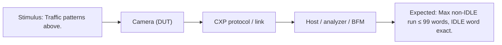

<a id="cxp-cam-prot-004"></a>
#### CXP-CAM-PROT-004 — Big-endian multi-byte fields

`AUTOMATED` · `RTL/SIM` · Status: **NOT TESTED** · kind: executable

- **Requirement(s):** [REQ-PROT-006](#req-prot-006), [REQ-CTRL-014](#req-ctrl-014). CXP 1.1.1 clause(s): §10.3.3, 8.2.1
- **Objective:** Verify addresses, sizes, register values, DsizeP and header 16/24-bit fields are big-endian.
- **Preconditions:** Device discovered and streaming.
- **Test equipment:**
  - FPGA/RTL testbench: cocotb + pyuvm on Verilator/Questa with Host BFM, scoreboards
  - CXP protocol exerciser / Host emulator (character-level upconnection generation, error injection)
  - Python golden CXP codec (CRC-32, packet builder/parser, pixel packing model)
- **Procedure:**
  1. Read Standard; check P0 = 0xC0.
  2. Write MasterHostConnectionID = 0x11223344; read back and check wire bytes 11 22 33 44.
  3. Decode image header: Xsize[23:16] precedes Xsize[15:8] etc.; DsizeP[15:8] first.
- **Stimulus:** Reads/writes with asymmetric patterns.
- **Expected result:** Most-significant byte first on the wire in all fields.
- **PASS criteria:** All fields big-endian.
- **FAIL criteria:** Any little-endian field.
- **Evidence:** Wire captures with annotations.
- **Automation:** AUTOMATED (RTL/SIM)

<a id="cxp-cam-prot-005"></a>
#### CXP-CAM-PROT-005 — Upconnection word alignment and re-alignment

`AUTOMATED` · `RTL/SIM` · Status: **NOT TESTED** · kind: executable

- **Requirement(s):** [REQ-PROT-004](#req-prot-004), [REQ-REC-001](#req-rec-001). CXP 1.1.1 clause(s): §10.2, 8.2.1
- **Objective:** Verify the Device LS receiver achieves and re-acquires word alignment from any bit/character phase.
- **Preconditions:** SIM with bit-level LS channel model; exerciser with bit-slip injection on hardware.
- **Test equipment:**
  - FPGA/RTL testbench: cocotb + pyuvm on Verilator/Questa with Host BFM, scoreboards
  - CXP protocol exerciser / Host emulator (character-level upconnection generation, error injection)
- **Procedure:**
  1. Start IDLE stream with each of 40 bit-phase offsets; measure time to aligned and first accepted command.
  2. During operation inject 1, 2, 3 character slips and single bit slips; measure recovery.
  3. Interrupt LS signal for 1 µs, 1 ms, 100 ms; restore; measure recovery.
- **Stimulus:** IDLE + read commands with injected slips.
- **Expected result:** Alignment achieved on every phase; recovered after each slip; no false command execution.
- **PASS criteria:** 100 % alignment; recovery within implementation limit (to be declared) with no spurious write executed.
- **FAIL criteria:** Stuck misaligned; spurious command; permanent lock loss.
- **Evidence:** Recovery time table, waveforms.
- **Automation:** AUTOMATED (RTL/SIM)

<a id="cxp-cam-prot-006"></a>
#### CXP-CAM-PROT-006 — Single-bit error immunity of replicated characters

`AUTOMATED` · `RTL/SIM` · Status: **NOT TESTED** · kind: executable

- **Requirement(s):** [REQ-PROT-007](#req-prot-007), [REQ-TRIG-004](#req-trig-004). CXP 1.1.1 clause(s): §8.2.2.1, 8.3.2.1
- **Objective:** Verify the Device decodes 4×-replicated fields correctly when any one character is corrupted.
- **Preconditions:** Exerciser/BFM able to replace one character of a replicated group.
- **Test equipment:**
  - FPGA/RTL testbench: cocotb + pyuvm on Verilator/Questa with Host BFM, scoreboards
  - CXP protocol exerciser / Host emulator (character-level upconnection generation, error injection)
  - Python golden CXP codec (CRC-32, packet builder/parser, pixel packing model)
- **Procedure:**
  1. For each replicated field in upconnection packets (K27.7 SOP, type 0x02, K29.7 EOP; test packet type 0x04) corrupt one of P0..P3 (valid other symbol, and invalid code).
  2. For LS trigger packets corrupt one of the 3 K-chars and one of the 3 delay chars.
  3. Send each variant 1000× interleaved with good traffic.
- **Stimulus:** Corrupted-single-character packets.
- **Expected result:** Command executed normally (CRC-protected payload intact); trigger recognised with correct edge.
- **PASS criteria:** 100 % correct decode for every single-character corruption position.
- **FAIL criteria:** Command dropped/NACKed or trigger missed/wrong edge due to a single corrupted replicated character.
- **Evidence:** Per-position result matrix.
- **Automation:** AUTOMATED (RTL/SIM)

<a id="cxp-cam-prot-007"></a>
#### CXP-CAM-PROT-007 — CRC-32 conformance on Device transmissions

`AUTOMATED` · `RTL/SIM` · Status: **NOT TESTED** · kind: executable

- **Requirement(s):** [REQ-PROT-008](#req-prot-008), [REQ-CTRL-007](#req-ctrl-007), [REQ-DATA-003](#req-data-003). CXP 1.1.1 clause(s): §8.2.2.2, 8.5.1, 8.6.3
- **Objective:** Verify Device-generated CRCs (read acks, wait acks, stream packets) match the §8.2.2.2 algorithm including the spec's worked example.
- **Preconditions:** Golden Python CRC model reproducing the §8.2.2.2 example (read of address 0 → 0x56 0x86 0x5D 0x6F).
- **Test equipment:**
  - FPGA/RTL testbench: cocotb + pyuvm on Verilator/Questa with Host BFM, scoreboards
  - CXP protocol analyzer (passive tap, 8B/10B character capture, timestamps)
  - Python golden CXP codec (CRC-32, packet builder/parser, pixel packing model)
- **Procedure:**
  1. Self-check the golden model on the spec example.
  2. Recompute CRC for every captured read ack (random sizes 1..max) and stream packet.
  3. Verify receiver-style residue: CRC over data + transmitted CRC = 0.
  4. Include packets containing K28.3 markers and IDLE-stretched packets.
- **Stimulus:** Captured traffic.
- **Expected result:** All transmitted CRCs equal golden CRC.
- **PASS criteria:** 0 mismatches across ≥ 10⁶ packets.
- **FAIL criteria:** Any mismatch; CRC including IDLE or marker K-flag.
- **Evidence:** CRC mismatch report (must be empty).
- **Automation:** AUTOMATED (RTL/SIM)

<a id="cxp-cam-prot-008"></a>
#### CXP-CAM-PROT-008 — CRC exclusions: IDLE stretching and K28.3

`AUTOMATED` · `RTL/SIM` · Status: **NOT TESTED** · kind: executable

- **Requirement(s):** [REQ-PROT-009](#req-prot-009), [REQ-DATA-011](#req-data-011). CXP 1.1.1 clause(s): §8.2.2.2, 9.2
- **Objective:** Verify stream CRC treats K28.3 as D28.3 and ignores stretching IDLE words, and that the Device accepts IDLE-stretched commands on HS upconnection (HSUP).
- **Preconditions:** Stream packets containing image header / line markers.
- **Test equipment:**
  - FPGA/RTL testbench: cocotb + pyuvm on Verilator/Questa with Host BFM, scoreboards
  - Python golden CXP codec (CRC-32, packet builder/parser, pixel packing model)
  - CXP protocol exerciser / Host emulator (character-level upconnection generation, error injection)
- **Procedure:**
  1. Force packets whose payload starts with an image header (K28.3 ×4) and contains line markers.
  2. Force IDLE stretching inside a stream packet (e.g. by FIFO underrun stimulus) if the design can stretch.
  3. HSUP: send commands with IDLE words inserted mid-packet.
- **Stimulus:** Header/marker-bearing packets; stretched packets.
- **Expected result:** CRC computed with K28.3 as 0x7C data; IDLEs excluded.
- **PASS criteria:** Golden CRC matches for all such packets; stretched commands accepted.
- **FAIL criteria:** Mismatch; stretched command NACKed.
- **Evidence:** CRC report.
- **Automation:** AUTOMATED (RTL/SIM)

<a id="cxp-cam-prot-009"></a>
#### CXP-CAM-PROT-009 — Priority insertion and resume (I/O ack into stream packet)

`AUTOMATED` · `RTL/SIM` · Status: **NOT TESTED** · kind: executable

- **Requirement(s):** [REQ-PROT-010](#req-prot-010), [REQ-PROT-011](#req-prot-011), [REQ-TRIG-006](#req-trig-006). CXP 1.1.1 clause(s): §8.2.4
- **Objective:** Verify the I/O acknowledgment is inserted into an in-progress stream/ack packet at a word boundary and the interrupted packet resumes intact.
- **Preconditions:** Streaming max-size packets; exerciser sends LS triggers at random phases.
- **Test equipment:**
  - FPGA/RTL testbench: cocotb + pyuvm on Verilator/Questa with Host BFM, scoreboards
  - CXP protocol exerciser / Host emulator (character-level upconnection generation, error injection)
  - CXP protocol analyzer (passive tap, 8B/10B character capture, timestamps)
- **Procedure:**
  1. Send 10⁴ triggers at uniformly random instants during stream packets, control acks and test packets.
  2. Locate each K28.6 ×4 + 0x01 ×4 in the downconnection.
  3. Check insertion at word boundary, before the interrupted packet ends, and that the interrupted packet's CRC still verifies after removing the 2 inserted words.
- **Stimulus:** LS trigger packets at random instants.
- **Expected result:** I/O ack inserted (not queued behind the packet); interrupted packet intact.
- **PASS criteria:** 100 % acks inserted within the packet at word boundaries; 0 CRC errors.
- **FAIL criteria:** Ack deferred to end of packet; misaligned; corrupted host packet.
- **Evidence:** Insertion latency histogram, CRC report.
- **Automation:** AUTOMATED (RTL/SIM)

Test diagram (stimulus → camera → protocol → host → expected) — see also Figure D-23:

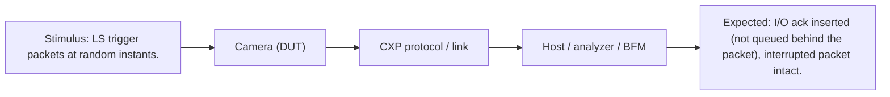

<a id="cxp-cam-prot-010"></a>
#### CXP-CAM-PROT-010 — Direction and origin rules

`AUTOMATED` · `Protocol` · Status: **NOT TESTED** · kind: executable

- **Requirement(s):** [REQ-PROT-017](#req-prot-017), [REQ-CTRL-002](#req-ctrl-002). CXP 1.1.1 clause(s): §8.2.3, 8.6, 8.6.1.1
- **Objective:** Verify the Device never originates control commands and sends acks only in response to a command (one final ack per command).
- **Preconditions:** 24 h mixed traffic capture.
- **Test equipment:**
  - CXP protocol analyzer (passive tap, 8B/10B character capture, timestamps)
  - Python golden CXP codec (CRC-32, packet builder/parser, pixel packing model)
- **Procedure:**
  1. Pair every Device ack with a preceding Host command.
  2. Count acks per command (final acks, wait acks).
- **Stimulus:** Mixed traffic.
- **Expected result:** One final ack per command; wait acks only before final acks; no unsolicited acks.
- **PASS criteria:** 0 unsolicited/duplicate final acks.
- **FAIL criteria:** Unsolicited ack (e.g. after ConnectionReset), duplicate final ack.
- **Evidence:** Pairing report.
- **Automation:** AUTOMATED (Protocol)

<a id="cxp-cam-ct-001"></a>
#### CXP-CAM-CT-001 — Device→Host test packet format and TestPacketCountTx

`AUTOMATED` · `RTL/SIM` · Status: **NOT TESTED** · kind: executable

- **Requirement(s):** [REQ-PROT-020](#req-prot-020), [REQ-PROT-024](#req-prot-024), [REQ-PROT-025](#req-prot-025), [REQ-PROT-030](#req-prot-030). CXP 1.1.1 clause(s): §8.7, 8.7.2, 8.7.4, 10.3.35, 8.7.4, 10.3.38
- **Objective:** Verify Table 23 packet content, regular transmission and Tx counter.
- **Preconditions:** Acquisition stopped; TestPacketCountTx[m] reset by writing 0.
- **Test equipment:**
  - FPGA/RTL testbench: cocotb + pyuvm on Verilator/Questa with Host BFM, scoreboards
  - CXP protocol exerciser / Host emulator (character-level upconnection generation, error injection)
  - CXP protocol analyzer (passive tap, 8B/10B character capture, timestamps)
  - Python golden CXP codec (CRC-32, packet builder/parser, pixel packing model)
- **Procedure:**
  1. Write TestMode = 1.
  2. Capture ≥ 1000 test packets per connection.
  3. Compare every packet with the Table 23 golden sequence (1024 words, 0x00..0xFF × 16).
  4. Write TestMode = 0; read TestPacketCountTx[m] (8 bytes) for each m; compare with counted packets.
- **Stimulus:** TestMode writes; counter reads.
- **Expected result:** Exact packet content; counter = number of packets on that connection.
- **PASS criteria:** 0 content errors; counter exact (± the one in flight when read).
- **FAIL criteria:** Content error; counter mismatch.
- **Evidence:** Capture, counter log.
- **Automation:** AUTOMATED (RTL/SIM)

Test diagram (stimulus → camera → protocol → host → expected) — see also Figure D-18:

```mermaid
flowchart LR
  S["Stimulus: TestMode writes, counter reads."] --> C["Camera (DUT)"]
  C --> P["CXP protocol / link"]
  P --> H["Host / analyzer / BFM"]
  H --> X["Expected: Exact packet content, counter = number of packets on that connection."]
```

<a id="cxp-cam-ct-002"></a>
#### CXP-CAM-CT-002 — Test-mode spacing and exclusive content

`AUTOMATED` · `Protocol` · Status: **NOT TESTED** · kind: executable

- **Requirement(s):** [REQ-PROT-026](#req-prot-026), [REQ-PROT-027](#req-prot-027), [REQ-PROT-014](#req-prot-014). CXP 1.1.1 clause(s): §8.2.5.1, 8.7.4
- **Objective:** Verify ≥ 16-word gaps, IDLE ≤ 100-word rule, and that only test/control packets are sent in Test Mode.
- **Preconditions:** TestMode = 1 while acquisition was running before; triggers optionally applied.
- **Test equipment:**
  - CXP protocol analyzer (passive tap, 8B/10B character capture, timestamps)
  - CXP protocol exerciser / Host emulator (character-level upconnection generation, error injection)
- **Procedure:**
  1. Enable TestMode while streaming; verify stream packets stop (the Host should stop acquisition first; record behaviour if not).
  2. Measure gap between successive test packets (EOP → SOP).
  3. Issue register reads; verify acks interleave.
  4. Send triggers: record whether I/O acks appear (clarification item).
- **Stimulus:** TestMode = 1, control reads, triggers.
- **Expected result:** Gaps ≥ 16 words; only test/control packets + IDLE; IDLE rule met.
- **PASS criteria:** Min gap ≥ 16 words; 0 stream packets in Test Mode.
- **FAIL criteria:** Gap < 16; stream packet in Test Mode; IDLE rule violated.
- **Evidence:** Gap histogram, capture.
- **Automation:** AUTOMATED (Protocol)

<a id="cxp-cam-ct-003"></a>
#### CXP-CAM-CT-003 — Control priority over test data; exit completes packet

`AUTOMATED` · `RTL/SIM` · Status: **NOT TESTED** · kind: executable

- **Requirement(s):** [REQ-PROT-028](#req-prot-028), [REQ-PROT-029](#req-prot-029). CXP 1.1.1 clause(s): §10.3.35, 8.7.2
- **Objective:** Verify control acks are not delayed behind queued test packets and TestMode 1→0 completes the current test packet.
- **Preconditions:** TestMode = 1.
- **Test equipment:**
  - FPGA/RTL testbench: cocotb + pyuvm on Verilator/Questa with Host BFM, scoreboards
  - CXP protocol exerciser / Host emulator (character-level upconnection generation, error injection)
  - CXP protocol analyzer (passive tap, 8B/10B character capture, timestamps)
- **Procedure:**
  1. Issue reads at random instants; measure ack latency.
  2. Write TestMode = 0 at random instants within a test packet (100 trials).
  3. Check the in-flight packet is completed (1024 data words + EOP) and no further test packet starts.
- **Stimulus:** Reads; TestMode = 0 writes.
- **Expected result:** Ack latency not bounded by test packet length queueing; clean exit.
- **PASS criteria:** Acks sent before the next test packet starts; 100 % clean exits.
- **FAIL criteria:** Truncated test packet; test packets continue; ack queued behind multiple test packets.
- **Evidence:** Latency statistics; exit captures.
- **Automation:** AUTOMATED (RTL/SIM)

<a id="cxp-cam-ct-004"></a>
#### CXP-CAM-CT-004 — Host→Device test receiver counting

`AUTOMATED` · `RTL/SIM` · Status: **NOT TESTED** · kind: executable

- **Requirement(s):** [REQ-PROT-021](#req-prot-021), [REQ-PROT-022](#req-prot-022), [REQ-PROT-023](#req-prot-023). CXP 1.1.1 clause(s): §8.7.1, 8.7.3, 8.7.3, 8.7.3, 10.3.37, 10.3.39
- **Objective:** Verify TestErrorCount counts differing words and TestPacketCountRx counts packets, independent of TestMode, even during streaming.
- **Preconditions:** Exerciser test generator with word-error injection.
- **Test equipment:**
  - FPGA/RTL testbench: cocotb + pyuvm on Verilator/Questa with Host BFM, scoreboards
  - CXP protocol exerciser / Host emulator (character-level upconnection generation, error injection)
  - Python golden CXP codec (CRC-32, packet builder/parser, pixel packing model)
- **Procedure:**
  1. Reset counters (write 0 to TestErrorCount[m], TestPacketCountRx[m]).
  2. Send 1000 clean test packets (≥ 1 IDLE between) with TestMode = 0 and streaming active.
  3. Send 100 packets each with k ∈ {1, 2, 1024} corrupted words.
  4. Read counters for every m.
- **Stimulus:** Upconnection test packets.
- **Expected result:** PacketCountRx = sent count; ErrorCount = Σ corrupted words.
- **PASS criteria:** Exact counts in all phases.
- **FAIL criteria:** Miscount; packets ignored when TestMode = 0; stream disturbed.
- **Evidence:** Counter log vs injection log.
- **Automation:** AUTOMATED (RTL/SIM)

<a id="cxp-cam-ct-005"></a>
#### CXP-CAM-CT-005 — Counter selector indexing and resets

`AUTOMATED` · `RTL/SIM` · Status: **NOT TESTED** · kind: executable

- **Requirement(s):** [REQ-PROT-031](#req-prot-031), [REQ-PROT-022](#req-prot-022), [REQ-PROT-030](#req-prot-030), [REQ-RST-006](#req-rst-006). CXP 1.1.1 clause(s): §10.3.28, 10.3.36, 8.7.3, 10.3.37, 10.3.39, 8.7.4, 10.3.38
- **Objective:** Verify TestErrorCountSelector indexing (0..n−1, n for HS up), write-0 resets and reset by ConnectionReset.
- **Preconditions:** MULTI and/or HSUP Device for full coverage; single-connection uses m = 0 only.
- **Test equipment:**
  - FPGA/RTL testbench: cocotb + pyuvm on Verilator/Questa with Host BFM, scoreboards
  - CXP protocol exerciser / Host emulator (character-level upconnection generation, error injection)
- **Procedure:**
  1. Accumulate different non-zero counts per connection.
  2. For each m: write selector, read three counters, compare.
  3. Write 0 to one counter; verify only that counter of that connection cleared.
  4. Write selector = n+1 (out of range): record ack/readback.
  5. ConnectionReset; verify all counters and selector = 0.
- **Stimulus:** Selector/counter writes.
- **Expected result:** Correct per-connection values; selective clear; full clear on ConnectionReset.
- **PASS criteria:** All checks pass; invalid selector rejected.
- **FAIL criteria:** Cross-talk between indices; clear affecting others; not cleared by reset.
- **Evidence:** Register log.
- **Automation:** AUTOMATED (RTL/SIM)

<a id="cxp-cam-ct-007"></a>
#### CXP-CAM-CT-007 — Test Mode interaction with I/O channel

`AUTOMATED` · `Protocol` · Status: **NOT TESTED** · kind: executable

- **Requirement(s):** [REQ-PROT-027](#req-prot-027), [REQ-TRIG-003](#req-trig-003). CXP 1.1.1 clause(s): §8.3.2, 8.3.3, 8.7.4
- **Objective:** Characterise trigger and I/O-ack behaviour while TestMode = 1 (specification ambiguity).
- **Preconditions:** TestMode = 1.
- **Test equipment:**
  - CXP protocol exerciser / Host emulator (character-level upconnection generation, error injection)
  - CXP protocol analyzer (passive tap, 8B/10B character capture, timestamps)
- **Procedure:**
  1. Send rising/falling LS triggers during Test Mode.
  2. Record whether I/O acks are sent and whether the Device acts on triggers.
- **Stimulus:** Triggers during Test Mode.
- **Expected result:** Behaviour recorded; decision per clarification.
- **PASS criteria:** Behaviour documented and consistent with project clarification decision.
- **FAIL criteria:** Undocumented behaviour; link wedge.
- **Evidence:** Capture, clarification record.
- **Automation:** AUTOMATED (Protocol)


## 10. Camera Control Validation

Register access over the control channel (§8.6), bootstrap registers (§10.3), transaction timing, wait acknowledgment and control channel reset.

**Figure D-24 — Wait acknowledgment timing (§8.6.1.1)**

```mermaid
sequenceDiagram
  participant H as Host
  participant D as Device
  H->>D: command
  D-->>H: wait ack 0x04 (W ms) within 200 ms
  Note over H: extend timeout to W
  D-->>H: exactly one final ack within W
```

```text
Host   : [cmd]----------------------------------------------------------------
Device :            [wait ack 0x04 (W)] .............................. [final ack]
         |<------ ≤ 200 ms ------>|<-------- ≤ W ms (100..10000) -------->|
```

<a id="cxp-cam-boot-001"></a>
#### CXP-CAM-BOOT-001 — Bootstrap register map sweep (address/length/access)

`AUTOMATED` · `RTL/SIM` · Status: **NOT TESTED** · kind: executable

- **Requirement(s):** [REQ-BOOT-001](#req-boot-001), [REQ-BOOT-012](#req-boot-012), [REQ-BOOT-013](#req-boot-013), [REQ-CTRL-014](#req-ctrl-014), [REQ-ERR-006](#req-err-006). CXP 1.1.1 clause(s): §10.3.3, 10.3.4, 8.6.3
- **Objective:** Verify every Table 45 register exists at its address with correct length and access mode.
- **Preconditions:** Device discovered; register model generated from Table 45.
- **Test equipment:**
  - FPGA/RTL testbench: cocotb + pyuvm on Verilator/Questa with Host BFM, scoreboards
  - CXP protocol exerciser / Host emulator (character-level upconnection generation, error injection)
  - Python golden CXP codec (CRC-32, packet builder/parser, pixel packing model)
- **Procedure:**
  1. For each register: read with Size = length; expect ack 0x00 with Size = length.
  2. For R-only registers: write the read value back; expect 0x43 and unchanged value.
  3. For R/W registers: write a legal value, read back, restore.
  4. Check reserved/unused bits read 0 (HsUpconnection[31:1], XmlVersion[31:24], XmlSchemaVersion[31:24]).
  5. Read the gap 0x20–0x1FFF, 0x20D0–0x2FFF (behaviour record: 0x40 expected, see clarification).
- **Stimulus:** Read/write sweep over 0x0000–0x403F.
- **Expected result:** Map matches Table 45; big-endian values; access modes enforced.
- **PASS criteria:** 100 % of registers match address/length/access; unused bits 0.
- **FAIL criteria:** Missing register, wrong length, R-only writable, R/W not writable, non-zero reserved bits.
- **Evidence:** Register sweep CSV, sim log.
- **Automation:** AUTOMATED (RTL/SIM)

<a id="cxp-cam-boot-002"></a>
#### CXP-CAM-BOOT-002 — Standard magic number and Revision

`AUTOMATED` · `RTL/SIM` · Status: **NOT TESTED** · kind: executable

- **Requirement(s):** [REQ-BOOT-002](#req-boot-002), [REQ-BOOT-003](#req-boot-003), [REQ-PROT-006](#req-prot-006). CXP 1.1.1 clause(s): §10.3.5, 10.3.6, 8.2.1
- **Objective:** Verify Standard = 0xC0A79AE5 and Revision encoding, and big-endian byte order on the wire.
- **Preconditions:** Device discovered.
- **Test equipment:**
  - CXP protocol exerciser / Host emulator (character-level upconnection generation, error injection)
  - CXP protocol analyzer (passive tap, 8B/10B character capture, timestamps)
  - FPGA/RTL testbench: cocotb + pyuvm on Verilator/Questa with Host BFM, scoreboards
- **Procedure:**
  1. Read 0x00000000 (B = 4); capture ack data bytes on the wire.
  2. Read 0x00000004.
- **Stimulus:** Read commands (see packet example A.8.1).
- **Expected result:** Ack data bytes on wire C0 A7 9A E5 (P0..P3); Revision = 0x00010001.
- **PASS criteria:** Exact match of both values and byte order.
- **FAIL criteria:** Any mismatch; little-endian byte order.
- **Evidence:** Analyzer capture of both acks.
- **Automation:** AUTOMATED (RTL/SIM)

<a id="cxp-cam-boot-003"></a>
#### CXP-CAM-BOOT-003 — XML manifest registers

`AUTOMATED` · `Protocol` · Status: **NOT TESTED** · kind: executable

- **Requirement(s):** [REQ-BOOT-004](#req-boot-004), [REQ-BOOT-005](#req-boot-005), [REQ-BOOT-006](#req-boot-006), [REQ-GEN-011](#req-gen-011). CXP 1.1.1 clause(s): §10.3.11, 10.3.7, 10.3.8, 10.3.9, 10.3.10, 11.2.2
- **Objective:** Verify XmlManifestSize/Selector/Version/SchemaVersion/UrlAddress for every manifest entry.
- **Preconditions:** Device discovered.
- **Test equipment:**
  - CXP protocol exerciser / Host emulator (character-level upconnection generation, error injection)
  - Python golden CXP codec (CRC-32, packet builder/parser, pixel packing model)
- **Procedure:**
  1. Read XmlManifestSize (≥ 1).
  2. For s = 0..Size−1: write Selector = s; read XmlVersion, XmlSchemaVersion, XmlUrlAddress.
  3. Check reserved bytes = 0; UrlAddress ≥ 0x6000.
  4. Read the URL string 4 bytes at a time until NULL; parse with GenTL URL grammar.
  5. Write Selector = Size (out of range); record ack and readback.
- **Stimulus:** Selector writes and reads 0x0C–0x18.
- **Expected result:** All manifests well-formed; URL parses as Local:/Web:/File: form.
- **PASS criteria:** All entries valid; URL in manufacturer space; out-of-range write rejected (ack ≠ 0x01) and selector unchanged.
- **FAIL criteria:** Size 0; bad address; unparsable URL; out-of-range selector accepted.
- **Evidence:** Manifest table, URL strings.
- **Automation:** AUTOMATED (Protocol)

<a id="cxp-cam-boot-004"></a>
#### CXP-CAM-BOOT-004 — Device information strings and Iidc2Address

`AUTOMATED` · `Protocol` · Status: **NOT TESTED** · kind: executable

- **Requirement(s):** [REQ-BOOT-007](#req-boot-007), [REQ-BOOT-008](#req-boot-008), [REQ-BOOT-009](#req-boot-009), [REQ-BOOT-010](#req-boot-010). CXP 1.1.1 clause(s): §10.3.1, 10.3.12, 10.3.13–10.3.17, 10.3.18
- **Objective:** Verify string registers are ASCII, NULL-terminated unless full, and Iidc2Address semantics.
- **Preconditions:** Device discovered.
- **Test equipment:**
  - CXP protocol exerciser / Host emulator (character-level upconnection generation, error injection)
  - Python golden CXP codec (CRC-32, packet builder/parser, pixel packing model)
- **Procedure:**
  1. Read 0x2000 (32), 0x2020 (32), 0x2040 (48), 0x2070 (32), 0x20B0 (16), 0x20C0 (16) in one command each.
  2. Check bytes are ASCII 0x20–0x7E up to NULL; bytes after NULL (record).
  3. Write DeviceUserID with 15 chars + NULL, and with 16 chars (no NULL); read back.
  4. Read Iidc2Address; if non-zero, read at that address (IIDC2 Device).
- **Stimulus:** Reads/writes of string registers.
- **Expected result:** Strings valid; DeviceUserID round-trips; Iidc2Address = 0 unless IIDC2.
- **PASS criteria:** All strings conform to §10.3.1; round-trip exact.
- **FAIL criteria:** Non-ASCII, missing terminator when shorter than register, round-trip mismatch.
- **Evidence:** String dump.
- **Automation:** AUTOMATED (Protocol)

<a id="cxp-cam-boot-005"></a>
#### CXP-CAM-BOOT-005 — DeviceUserID persistence

`PARTIALLY AUTOMATED` · `Hardware` · **HARDWARE-DEPENDENT** · Status: **NOT TESTED** · kind: executable

- **Requirement(s):** [REQ-RST-012](#req-rst-012), [REQ-BOOT-010](#req-boot-010). CXP 1.1.1 clause(s): §10.3.18
- **Objective:** Verify DeviceUserID is stored persistently across power-off and ConnectionReset.
- **Preconditions:** Real hardware with PoCXP or aux power control.
- **Test equipment:**
  - Reference CXP frame grabber (Host) with GenTL producer
  - Programmable DC source 0–50 V with current logging (≥ 1 kHz)
- **Procedure:**
  1. Write a unique DeviceUserID.
  2. ConnectionReset; read back.
  3. Power off ≥ 10 s; power on; rediscover; read back.
  4. Repeat with power removed 10 ms, 100 ms, 1 s after the write ack (write-durability).
- **Stimulus:** Write 16-byte string to 0x20C0.
- **Expected result:** Value retained in all cases after the write ack was received.
- **PASS criteria:** Readback identical after every cycle.
- **FAIL criteria:** Value lost/corrupted after acked write.
- **Evidence:** Log with timestamps of write-ack and power removal.
- **Automation:** PARTIALLY AUTOMATED (Hardware)

<a id="cxp-cam-boot-006"></a>
#### CXP-CAM-BOOT-006 — Use-case *Address registers

`AUTOMATED` · `Protocol` · Status: **NOT TESTED** · kind: executable

- **Requirement(s):** [REQ-BOOT-011](#req-boot-011), [REQ-GEN-006](#req-gen-006), [REQ-GEN-009](#req-gen-009), [REQ-IOP-004](#req-iop-004). CXP 1.1.1 clause(s): §10.3.19–10.3.27, 11.2.1, 11.2.1.8
- **Objective:** Verify the 0x3000–0x301C(+n×4) registers point to working manufacturer-space feature registers consistent with the XML.
- **Preconditions:** Device discovered; XML available.
- **Test equipment:**
  - CXP protocol exerciser / Host emulator (character-level upconnection generation, error injection)
  - GenICam reference GenApi + GenTL consumer application
  - Python golden CXP codec (CRC-32, packet builder/parser, pixel packing model)
- **Procedure:**
  1. Read WidthAddress … Image1StreamIDAddress and Image<n>StreamIDAddress for n = 2..16.
  2. Check each non-zero address ≥ 0x6000 and 4-byte aligned.
  3. Compare each address with the pValue register address of the matching XML feature.
  4. Read Width/Height/PixelFormat/DeviceTapGeometry/Image<n>StreamID through those addresses.
  5. Unsupported streams: Image<n>StreamIDAddress = 0.
- **Stimulus:** Reads 0x3000–0x3058.
- **Expected result:** Addresses valid and identical to XML; values plausible.
- **PASS criteria:** All addresses consistent; unsupported n = 0.
- **FAIL criteria:** Address in bootstrap space, misaligned, disagreeing with XML, non-zero for unsupported stream.
- **Evidence:** Address table vs XML report.
- **Automation:** AUTOMATED (Protocol)

<a id="cxp-cam-boot-007"></a>
#### CXP-CAM-BOOT-007 — Black-box use case using bootstrap addresses only

`AUTOMATED` · `Protocol` · Status: **NOT TESTED** · kind: executable

- **Requirement(s):** [REQ-BOOT-011](#req-boot-011), [REQ-ACQ-002](#req-acq-002), [REQ-ACQ-003](#req-acq-003), [REQ-IOP-004](#req-iop-004). CXP 1.1.1 clause(s): §10.3.19–10.3.27, 11.2.1.4, 11.2.1.5
- **Objective:** Run continuous acquisition without GenICam, using only bootstrap *Address registers (§10.3.19 comment).
- **Preconditions:** Device discovered; no XML used.
- **Test equipment:**
  - CXP protocol exerciser / Host emulator (character-level upconnection generation, error injection)
  - Python golden CXP codec (CRC-32, packet builder/parser, pixel packing model)
- **Procedure:**
  1. Read addresses from 0x3000–0x301C.
  2. Read Width, Height, PixelFormat, Image1StreamID.
  3. Write 0x00000001 to AcquisitionStartAddress target; receive ≥ 100 frames.
  4. Write 0x00000001 to AcquisitionStopAddress target; confirm stream stops.
- **Stimulus:** Writes of 0x00000001 to the AcquisitionStart/Stop targets.
- **Expected result:** Frames with header Xsize/Ysize/PixelF matching the register values; stop terminates streaming.
- **PASS criteria:** ≥ 100 complete frames; stop effective; header fields consistent.
- **FAIL criteria:** No stream; inconsistent header; stop ignored.
- **Evidence:** Frame log, header decode.
- **Automation:** AUTOMATED (Protocol)

<a id="cxp-cam-boot-008"></a>
#### CXP-CAM-BOOT-008 — Writable manufacturer registers are readable

`AUTOMATED` · `Software` · Status: **NOT TESTED** · kind: executable

- **Requirement(s):** [REQ-CTRL-015](#req-ctrl-015). CXP 1.1.1 clause(s): §10.3.3
- **Objective:** Identify write-only manufacturer registers (recommendation §10.3.3).
- **Preconditions:** XML available.
- **Test equipment:**
  - GenICam reference GenApi + GenTL consumer application
  - CXP protocol exerciser / Host emulator (character-level upconnection generation, error injection)
- **Procedure:**
  1. Enumerate all XML registers with AccessMode WO or RW.
  2. Attempt read of each WO register; record ack code.
- **Stimulus:** Reads of every writable register address.
- **Expected result:** All writable registers readable (recommendation).
- **PASS criteria:** Report produced; zero WO registers (or each justified).
- **FAIL criteria:** Unjustified write-only registers (SHOULD violation, WARNING).
- **Evidence:** Register access report.
- **Automation:** AUTOMATED (Software)

<a id="cxp-cam-ctrl-001"></a>
#### CXP-CAM-CTRL-001 — Read command decode and read acknowledgment format

`AUTOMATED` · `RTL/SIM` · Status: **NOT TESTED** · kind: executable

- **Requirement(s):** [REQ-CTRL-001](#req-ctrl-001), [REQ-CTRL-002](#req-ctrl-002), [REQ-CTRL-006](#req-ctrl-006), [REQ-CTRL-007](#req-ctrl-007), [REQ-CTRL-009](#req-ctrl-009), [REQ-CTRL-011](#req-ctrl-011). CXP 1.1.1 clause(s): §10.3.2, 8.6, 8.6.1.1, 8.6.2, 8.6.3
- **Objective:** Verify reads of every size 1..104 bytes return a correctly formatted ack 0x00 with Size = B, zero-padded data and valid CRC.
- **Preconditions:** Device discovered; readable region ≥ 104 bytes (e.g. 0x2000 string block).
- **Test equipment:**
  - FPGA/RTL testbench: cocotb + pyuvm on Verilator/Questa with Host BFM, scoreboards
  - CXP protocol exerciser / Host emulator (character-level upconnection generation, error injection)
  - Python golden CXP codec (CRC-32, packet builder/parser, pixel packing model)
- **Procedure:**
  1. For B = 1..104 and start addresses aligned to 4: send read; parse ack.
  2. Check 4×K27.7, 4×0x03, 4×0x00, Size = B, N = ceil(B/4) data words, pad bytes = 0, CRC per golden model, 4×K29.7.
  3. Cross-check data against a single 104-byte read.
- **Stimulus:** Cmd 0x00, Size B, Addr A.
- **Expected result:** Correct ack for every B.
- **PASS criteria:** 104/104 sizes correct; data consistent.
- **FAIL criteria:** Wrong size field, non-zero padding, CRC error, split ack.
- **Evidence:** Ack decode log.
- **Automation:** AUTOMATED (RTL/SIM)

Test diagram (stimulus → camera → protocol → host → expected) — see also Figure D-6:

```mermaid
flowchart LR
  S["Stimulus: Cmd 0x00, Size B, Addr A."] --> C["Camera (DUT)"]
  C --> P["CXP protocol / link"]
  P --> H["Host / analyzer / BFM"]
  H --> X["Expected: Correct ack for every B."]
```

<a id="cxp-cam-ctrl-002"></a>
#### CXP-CAM-CTRL-002 — Write command and write acknowledgment

`AUTOMATED` · `RTL/SIM` · Status: **NOT TESTED** · kind: executable

- **Requirement(s):** [REQ-CTRL-002](#req-ctrl-002), [REQ-CTRL-006](#req-ctrl-006), [REQ-CTRL-008](#req-ctrl-008). CXP 1.1.1 clause(s): §8.6.1.1, 8.6.2, 8.6.3
- **Objective:** Verify writes (B = 1..104 where the target allows) are executed once and acknowledged by the 4-word ack 0x01 without Size/Data/CRC.
- **Preconditions:** R/W target: DeviceUserID (16 B) and manufacturer scratch/LUT area if documented.
- **Test equipment:**
  - FPGA/RTL testbench: cocotb + pyuvm on Verilator/Questa with Host BFM, scoreboards
  - CXP protocol exerciser / Host emulator (character-level upconnection generation, error injection)
  - Python golden CXP codec (CRC-32, packet builder/parser, pixel packing model)
- **Procedure:**
  1. Write patterns with B = 1..16 to DeviceUserID; read back.
  2. Verify ack = K27.7×4, 0x03×4, 0x01×4, K29.7×4 exactly.
  3. Write with non-zero padding bytes (host violation) — record behaviour.
- **Stimulus:** Cmd 0x01, Size B, Addr, data (+padding).
- **Expected result:** Correct 4-word ack; data written exactly B bytes.
- **PASS criteria:** All writes correct; no bytes beyond B modified.
- **FAIL criteria:** Extra fields in ack; neighbouring bytes corrupted.
- **Evidence:** Log.
- **Automation:** AUTOMATED (RTL/SIM)

Test diagram (stimulus → camera → protocol → host → expected) — see also Figure D-7:

```mermaid
flowchart LR
  S["Stimulus: Cmd 0x01, Size B, Addr, data (+padding)."] --> C["Camera (DUT)"]
  C --> P["CXP protocol / link"]
  P --> H["Host / analyzer / BFM"]
  H --> X["Expected: Correct 4-word ack, data written exactly B bytes."]
```

<a id="cxp-cam-ctrl-003"></a>
#### CXP-CAM-CTRL-003 — 200 ms transaction limit across the register map

`AUTOMATED` · `Protocol` · Status: **NOT TESTED** · kind: executable

- **Requirement(s):** [REQ-CTRL-003](#req-ctrl-003). CXP 1.1.1 clause(s): §8.6.1.1
- **Objective:** Verify command-to-final-ack time ≤ 200 ms for every bootstrap and XML register, idle and under full streaming load.
- **Preconditions:** XML register list; streaming at max bandwidth in second pass.
- **Test equipment:**
  - CXP protocol exerciser / Host emulator (character-level upconnection generation, error injection)
  - CXP protocol analyzer (passive tap, 8B/10B character capture, timestamps)
  - GenICam reference GenApi + GenTL consumer application
- **Procedure:**
  1. For each register: read (and write back where writable) 20×; timestamp command EOP → ack EOP.
  2. Repeat with max-bandwidth streaming and triggers at max rate.
  3. Report max and 99.9th percentile per register.
- **Stimulus:** Register reads/writes.
- **Expected result:** All transactions ≤ 200 ms (wait acks excluded, see CTRL-004).
- **PASS criteria:** Max latency ≤ 200 ms for every register and mode.
- **FAIL criteria:** Any final ack > 200 ms without a preceding wait ack.
- **Evidence:** Latency CSV/histogram.
- **Automation:** AUTOMATED (Protocol)

<a id="cxp-cam-ctrl-004"></a>
#### CXP-CAM-CTRL-004 — Wait acknowledgment protocol

`AUTOMATED` · `Protocol` · Status: **NOT TESTED** · kind: executable

- **Requirement(s):** [REQ-CTRL-004](#req-ctrl-004). CXP 1.1.1 clause(s): §8.6.1.1, 8.6.3
- **Objective:** Verify commands needing > 200 ms send exactly one wait ack within 200 ms with value 100–10 000 ms, then exactly one final ack within that time.
- **Preconditions:** Documented long operation (e.g. flash commit, user-set save).
- **Test equipment:**
  - CXP protocol exerciser / Host emulator (character-level upconnection generation, error injection)
  - CXP protocol analyzer (passive tap, 8B/10B character capture, timestamps)
- **Procedure:**
  1. Trigger the long operation 20×.
  2. Measure t_wait (≤ 200 ms), decode wait value W (4-byte, ms), measure t_final − t_wait ≤ W.
  3. Check CRC and Size = 4 in wait ack.
- **Stimulus:** Long-operation command.
- **Expected result:** One wait ack, one final ack in time.
- **PASS criteria:** 20/20 conform; 100 ≤ W ≤ 10000.
- **FAIL criteria:** Multiple wait acks; late final ack; W out of range.
- **Evidence:** Timing log.
- **Automation:** AUTOMATED (Protocol)

Test diagram (stimulus → camera → protocol → host → expected) — see also Figure D-24:

```mermaid
flowchart LR
  S["Stimulus: Long-operation command."] --> C["Camera (DUT)"]
  C --> P["CXP protocol / link"]
  P --> H["Host / analyzer / BFM"]
  H --> X["Expected: One wait ack, one final ack in time."]
```

<a id="cxp-cam-ctrl-005"></a>
#### CXP-CAM-CTRL-005 — No wait acknowledgment for bootstrap registers

`AUTOMATED` · `Protocol` · Status: **NOT TESTED** · kind: executable

- **Requirement(s):** [REQ-CTRL-005](#req-ctrl-005). CXP 1.1.1 clause(s): §8.6.1.1, 10.3.3
- **Objective:** Verify no bootstrap register access produces a wait ack, including under load.
- **Preconditions:** Streaming at max load.
- **Test equipment:**
  - CXP protocol exerciser / Host emulator (character-level upconnection generation, error injection)
  - CXP protocol analyzer (passive tap, 8B/10B character capture, timestamps)
- **Procedure:**
  1. Access every bootstrap register 100× under load (incl. ConnectionConfig write without speed change, DeviceUserID write).
  2. Scan for ack code 0x04.
- **Stimulus:** Bootstrap accesses.
- **Expected result:** No 0x04 acks.
- **PASS criteria:** 0 wait acks.
- **FAIL criteria:** Any wait ack to a bootstrap address.
- **Evidence:** Ack code histogram.
- **Automation:** AUTOMATED (Protocol)

<a id="cxp-cam-ctrl-006"></a>
#### CXP-CAM-CTRL-006 — Control channel reset

`AUTOMATED` · `RTL/SIM` · Status: **NOT TESTED** · kind: executable

- **Requirement(s):** [REQ-RST-010](#req-rst-010), [REQ-RST-011](#req-rst-011). CXP 1.1.1 clause(s): §8.6.1.2
- **Objective:** Verify Cmd 0xFF aborts any control operation, resets control logic, returns ack 0x03, and does not reset the Device.
- **Preconditions:** Streaming active; one long operation in progress (LONGOP) or idle.
- **Test equipment:**
  - FPGA/RTL testbench: cocotb + pyuvm on Verilator/Questa with Host BFM, scoreboards
  - CXP protocol exerciser / Host emulator (character-level upconnection generation, error injection)
  - CXP protocol analyzer (passive tap, 8B/10B character capture, timestamps)
- **Procedure:**
  1. Idle: send control channel reset (Cmd 0xFF, Size 0, Addr 0); expect ack 0x03.
  2. During a long operation: send reset after the wait ack; expect 0x03 and no later final ack for the aborted command.
  3. With a partially received command on the link (truncated), send reset.
  4. Verify streaming, packet tags, ConnectionConfig, MasterHostConnectionID, SPSM unchanged.
- **Stimulus:** Control channel reset packet (see appendix packet examples).
- **Expected result:** Ack 0x03; Device state otherwise unchanged; control channel usable.
- **PASS criteria:** All scenarios: 0x03 received, next read succeeds, no stream disruption.
- **FAIL criteria:** No ack; late final ack for aborted command; stream reset; registers reset.
- **Evidence:** Captures, state comparison.
- **Automation:** AUTOMATED (RTL/SIM)

Test diagram (stimulus → camera → protocol → host → expected) — see also Figure D-11:

```mermaid
flowchart LR
  S["Stimulus: Control channel reset packet (see appendix packet examples)."] --> C["Camera (DUT)"]
  C --> P["CXP protocol / link"]
  P --> H["Host / analyzer / BFM"]
  H --> X["Expected: Ack 0x03, Device state otherwise unchanged, control channel usable."]
```

<a id="cxp-cam-ctrl-007"></a>
#### CXP-CAM-CTRL-007 — Extension connection control access

`AUTOMATED` · `Protocol` · Status: **NOT TESTED** · kind: executable

- **Requirement(s):** [REQ-ML-003](#req-ml-003), [REQ-ERR-012](#req-err-012), [REQ-ML-004](#req-ml-004). CXP 1.1.1 clause(s): §10.3.30, 8.6
- **Objective:** Verify extension connections allow reads (discovery) and reject writes.
- **Preconditions:** MULTI Device at discovery with extensions enabled.
- **Test equipment:**
  - CXP protocol exerciser / Host emulator (character-level upconnection generation, error injection)
  - CXP protocol analyzer (passive tap, 8B/10B character capture, timestamps)
- **Procedure:**
  1. Read DeviceConnectionID and MasterHostConnectionID via each extension.
  2. Write DeviceUserID, TestMode, AcquisitionStart via an extension; record ack code; verify via master that no write occurred.
  3. Write MasterHostConnectionID via extension; verify ignored.
- **Stimulus:** Reads/writes via extensions.
- **Expected result:** Reads succeed; writes not executed.
- **PASS criteria:** 0 writes executed via extensions; ack code recorded against clarification.
- **FAIL criteria:** Any write executed via an extension.
- **Evidence:** Log.
- **Automation:** AUTOMATED (Protocol)

<a id="cxp-cam-ctrl-009"></a>
#### CXP-CAM-CTRL-009 — Large memory access split rules and non-multiple-of-4 reads

`AUTOMATED` · `RTL/SIM` · Status: **NOT TESTED** · kind: executable

- **Requirement(s):** [REQ-CTRL-011](#req-ctrl-011), [REQ-CTRL-012](#req-ctrl-012), [REQ-CTRL-013](#req-ctrl-013). CXP 1.1.1 clause(s): §10.3.2
- **Objective:** Verify > 104-byte regions are readable in one message or as word-aligned chunks of 4..size bytes, and zipped XML supports odd-size reads.
- **Preconditions:** XML region (Local URL) of known length L.
- **Test equipment:**
  - FPGA/RTL testbench: cocotb + pyuvm on Verilator/Questa with Host BFM, scoreboards
  - CXP protocol exerciser / Host emulator (character-level upconnection generation, error injection)
  - Python golden CXP codec (CRC-32, packet builder/parser, pixel packing model)
- **Procedure:**
  1. Read the XML in chunks of 4, 8, 100, 104, CPSM−24 bytes; compare images.
  2. Read the final chunk with B = L mod 4 ≠ 0 remainder (ZIPXML).
  3. Compute SHA-256 of reassembled file across chunk sizes.
- **Stimulus:** Chunked reads.
- **Expected result:** Identical file content for all chunkings.
- **PASS criteria:** Byte-identical; all acks 0x00.
- **FAIL criteria:** Content mismatch; chunk refused.
- **Evidence:** Hash table.
- **Automation:** AUTOMATED (RTL/SIM)


## 11. Image/Data Path Validation

Covers frame start (image header), line markers, dimensions, DsizeL/DsizeP, pixel format and bit depth, packing and alignment, SourceTag frame numbering, metadata (Flags, TapG, offsets), packetization, PacketTag, CRC integrity, and dropped or incomplete frames. CXP has no stream resend (§4.9). The Host detects corruption through the CRC and missing packets through tag gaps.

**Figure D-16 — Frame → lines → CXP packets → payload → host reconstruction (§9.4, §8.5, Fig. 21/26)**

```mermaid
flowchart LR
  subgraph FR["Frame (image n)"]
    L1["Line 1"]
    L2["Line 2"]
    LN["Line Ysize"]
  end
  FR --> ST["Stream: IH | LM L1 | LM L2 | … | LM LYsize"]
  ST --> P0["Pkt tag k: SPH | IH + LM + L1 part | CRC | SPT"]
  ST --> P1["Pkt tag k+1: SPH | L1 rest + LM + L2 | CRC | SPT"]
  ST --> PM["Pkt tag k+m: SPH | … LYsize end | CRC | SPT"]
  P0 --> HOST["Host: order by tag, strip SPH/SPT,<br/>check CRC, concatenate payload"]
  P1 --> HOST
  PM --> HOST
  HOST --> REC["Parse K28.3 markers → geometry from IH<br/>unpack DsizeL words per line → image"]
```

**Figure D-21 — Stream packet structure (Table 19)**

```mermaid
flowchart LR
  A["4×K27.7"] --> B["4×0x01"] --> C["4×StreamID"] --> Dd["4×PacketTag"] --> E["4×DsizeP[15:8]"] --> F["4×DsizeP[7:0]"] --> G["N data words"] --> H["CRC over data"] --> I["4×K29.7"]
```

**Figure D-26 — 10-bit packing (Fig. 28)**

```mermaid
flowchart LR
  A["D0[9:0]"] --> W0["P0 = D0[7:0]"]
  A --> W1a["P1[1:0] = D0[9:8]"]
  B["D1[9:0]"] --> W1b["P1[7:2] = D1[5:0]"]
  B --> W2a["P2[3:0] = D1[9:6]"]
```

### 11.1 10-bit packing reference (Figure 28)

```text
        P0 (bits 7..0)   P1 (bits 7..0)   P2 (bits 7..0)   P3 (bits 7..0)
word 0: D0[7:0]          D1[5:0] D0[9:8]  D2[3:0] D1[9:6]  D3[1:0] D2[9:4]
word 1: D3[9:2]          ...
```
A 32-bit word holds 3.2 pixels. 16 pixels fill exactly 5 words. A line ending mid-word is zero-padded (§9.4.2).

<a id="cxp-cam-data-001"></a>
#### CXP-CAM-DATA-001 — Stream packet format

`AUTOMATED` · `RTL/SIM` · Status: **NOT TESTED** · kind: executable

- **Requirement(s):** [REQ-DATA-001](#req-data-001), [REQ-DATA-002](#req-data-002), [REQ-DATA-003](#req-data-003), [REQ-PROT-018](#req-prot-018). CXP 1.1.1 clause(s): §8.4, 8.5.1, 9.1
- **Objective:** Verify every stream packet matches Table 19 and DsizeP equals the actual payload word count.
- **Preconditions:** Streaming various sizes/pixel formats.
- **Test equipment:**
  - FPGA/RTL testbench: cocotb + pyuvm on Verilator/Questa with Host BFM, scoreboards
  - CXP protocol analyzer (passive tap, 8B/10B character capture, timestamps)
  - Python golden CXP codec (CRC-32, packet builder/parser, pixel packing model)
- **Procedure:**
  1. Parse ≥ 10⁵ packets.
  2. Check SOP, type 0x01, StreamID ×4, PacketTag ×4, DsizeP bytes ×4, N words, CRC, EOP; total = N + 8 words.
- **Stimulus:** Streaming.
- **Expected result:** All conform.
- **PASS criteria:** 0 violations.
- **FAIL criteria:** Any mismatch.
- **Evidence:** Parser report.
- **Automation:** AUTOMATED (RTL/SIM)

Test diagram (stimulus → camera → protocol → host → expected) — see also Figure D-21:

```mermaid
flowchart LR
  S["Stimulus: Streaming."] --> C["Camera (DUT)"]
  C --> P["CXP protocol / link"]
  P --> H["Host / analyzer / BFM"]
  H --> X["Expected: All conform."]
```

<a id="cxp-cam-data-002"></a>
#### CXP-CAM-DATA-002 — Packet tag increment and wrap

`AUTOMATED` · `RTL/SIM` · Status: **NOT TESTED** · kind: executable

- **Requirement(s):** [REQ-DATA-004](#req-data-004), [REQ-DATA-005](#req-data-005). CXP 1.1.1 clause(s): §8.5.3
- **Objective:** Verify tags increment by 1 per packet per stream and wrap 0xFF→0x00.
- **Preconditions:** ≥ 1000 packets.
- **Test equipment:**
  - FPGA/RTL testbench: cocotb + pyuvm on Verilator/Questa with Host BFM, scoreboards
  - CXP protocol analyzer (passive tap, 8B/10B character capture, timestamps)
- **Procedure:**
  1. Stream ≥ 1000 packets.
  2. Check tag[k+1] = (tag[k] + 1) mod 256 per StreamID.
  3. First packet after reset has tag 0.
- **Stimulus:** Streaming.
- **Expected result:** Continuous sequence including wrap.
- **PASS criteria:** 0 discontinuities.
- **FAIL criteria:** Skip/duplicate/reorder.
- **Evidence:** Tag trace.
- **Automation:** AUTOMATED (RTL/SIM)

<a id="cxp-cam-data-003"></a>
#### CXP-CAM-DATA-003 — Packet tag persistence and reset triggers

`AUTOMATED` · `RTL/SIM` · Status: **NOT TESTED** · kind: executable

- **Requirement(s):** [REQ-DATA-006](#req-data-006), [REQ-DATA-007](#req-data-007), [REQ-RST-005](#req-rst-005). CXP 1.1.1 clause(s): §10.3.28, 10.3.33, 8.5.3, 10.3.28, 10.3.33
- **Objective:** Verify tags are NOT reset by AcquisitionStop/Start, frame boundaries or ROI changes, and ARE reset by ConnectionReset and any ConnectionConfig write (even same value).
- **Preconditions:** —
- **Test equipment:**
  - FPGA/RTL testbench: cocotb + pyuvm on Verilator/Questa with Host BFM, scoreboards
  - CXP protocol exerciser / Host emulator (character-level upconnection generation, error injection)
  - CXP protocol analyzer (passive tap, 8B/10B character capture, timestamps)
- **Procedure:**
  1. Stream; stop; change Width/Height; start; check tag continues.
  2. Write ConnectionConfig with the current value; start; first tag = 0 on connection 0.
  3. ConnectionReset; rediscover; first tag = 0.
- **Stimulus:** Control sequences.
- **Expected result:** As specified.
- **PASS criteria:** All transitions as expected.
- **FAIL criteria:** Reset on stop/start; no reset on ConnectionConfig write.
- **Evidence:** Tag trace with events.
- **Automation:** AUTOMATED (RTL/SIM)

<a id="cxp-cam-data-004"></a>
#### CXP-CAM-DATA-004 — Multi-stream packet multiplexing and in-order delivery

`AUTOMATED` · `RTL/SIM` · Status: **NOT TESTED** · kind: executable

- **Requirement(s):** [REQ-DATA-008](#req-data-008), [REQ-DATA-005](#req-data-005), [REQ-IMG-018](#req-img-018). CXP 1.1.1 clause(s): §8.5.3, 8.5.4, 9.4.3, 9.4.5
- **Objective:** Verify packets from different streams are never interleaved within a packet and each stream is in order.
- **Preconditions:** MSTREAM or MTAP Device.
- **Test equipment:**
  - FPGA/RTL testbench: cocotb + pyuvm on Verilator/Questa with Host BFM, scoreboards
  - CXP protocol analyzer (passive tap, 8B/10B character capture, timestamps)
- **Procedure:**
  1. Enable ≥ 2 streams at max load.
  2. Parse packets; check each packet contains one StreamID; per-stream tags continuous.
- **Stimulus:** Multi-stream traffic.
- **Expected result:** Packet-level multiplexing only.
- **PASS criteria:** 0 violations.
- **FAIL criteria:** Interleave or reorder.
- **Evidence:** Report.
- **Automation:** AUTOMATED (RTL/SIM)

<a id="cxp-cam-data-005"></a>
#### CXP-CAM-DATA-005 — Stream IDs static, unique and consistent

`AUTOMATED` · `Protocol` · Status: **NOT TESTED** · kind: executable

- **Requirement(s):** [REQ-DATA-009](#req-data-009), [REQ-DATA-010](#req-data-010), [REQ-GEN-009](#req-gen-009). CXP 1.1.1 clause(s): §11.2.1.8, 9.3, 9.3, 11.2.1.8
- **Objective:** Verify stream IDs are static, unique, match header StreamID and Image<n>StreamID features.
- **Preconditions:** —
- **Test equipment:**
  - CXP protocol exerciser / Host emulator (character-level upconnection generation, error injection)
  - GenICam reference GenApi + GenTL consumer application
- **Procedure:**
  1. Read Image<n>StreamID for all supported n.
  2. Stream; compare packet StreamID and image-header StreamID with those values.
  3. Power cycle and repeat.
- **Stimulus:** Streaming.
- **Expected result:** Consistent static IDs; primary = 0 (recommended).
- **PASS criteria:** All consistent.
- **FAIL criteria:** Mismatch or changing IDs.
- **Evidence:** Report.
- **Automation:** AUTOMATED (Protocol)

<a id="cxp-cam-data-006"></a>
#### CXP-CAM-DATA-006 — Stream formation across packet boundaries

`AUTOMATED` · `RTL/SIM` · Status: **NOT TESTED** · kind: executable

- **Requirement(s):** [REQ-DATA-001](#req-data-001), [REQ-DATA-011](#req-data-011), [REQ-DATA-012](#req-data-012). CXP 1.1.1 clause(s): §8.5.2, 9.1, 9.2
- **Objective:** Verify the stream (header, markers, line data) is chopped into packets independently of line boundaries and reassembles exactly.
- **Preconditions:** Small SPSM (e.g. 40 bytes) and large SPSM.
- **Test equipment:**
  - FPGA/RTL testbench: cocotb + pyuvm on Verilator/Questa with Host BFM, scoreboards
  - Python golden CXP codec (CRC-32, packet builder/parser, pixel packing model)
- **Procedure:**
  1. Stream with SPSM = 40 (1 data word/packet)… host max.
  2. Concatenate payloads; parse stream markers; reconstruct image.
  3. Compare with expected pattern.
- **Stimulus:** Streaming.
- **Expected result:** Identical reconstructed stream for all SPSM.
- **PASS criteria:** Bit-exact.
- **FAIL criteria:** Mismatch.
- **Evidence:** Report.
- **Automation:** AUTOMATED (RTL/SIM)

Test diagram (stimulus → camera → protocol → host → expected) — see also Figure D-21:

```mermaid
flowchart LR
  S["Stimulus: Streaming."] --> C["Camera (DUT)"]
  C --> P["CXP protocol / link"]
  P --> H["Host / analyzer / BFM"]
  H --> X["Expected: Identical reconstructed stream for all SPSM."]
```

<a id="cxp-cam-ml-001"></a>
#### CXP-CAM-ML-001 — Round-robin packet distribution over connections

`AUTOMATED` · `Protocol` · Status: **NOT TESTED** · kind: executable

- **Requirement(s):** [REQ-ML-001](#req-ml-001), [REQ-ML-002](#req-ml-002). CXP 1.1.1 clause(s): §8.5.5
- **Objective:** Verify Table 20 ordering and its reset rules.
- **Preconditions:** MULTI Device at operating ConnectionConfig.
- **Test equipment:**
  - CXP protocol analyzer (passive tap, 8B/10B character capture, timestamps)
  - CXP protocol exerciser / Host emulator (character-level upconnection generation, error injection)
- **Procedure:**
  1. Capture all connections time-aligned.
  2. Check packet k on connection k mod n; order continues across frames/stop/start.
  3. Write ConnectionConfig (same value); verify next packet on connection 0.
- **Stimulus:** Streaming.
- **Expected result:** Round robin from 0; reset only on ConnectionReset/ConnectionConfig.
- **PASS criteria:** 0 violations.
- **FAIL criteria:** Wrong connection; reset on stop/start.
- **Evidence:** Report.
- **Automation:** AUTOMATED (Protocol)

<a id="cxp-cam-img-001"></a>
#### CXP-CAM-IMG-001 — Rectangular image header structure

`AUTOMATED` · `RTL/SIM` · Status: **NOT TESTED** · kind: executable

- **Requirement(s):** [REQ-IMG-004](#req-img-004), [REQ-IMG-008](#req-img-008), [REQ-PIX-002](#req-pix-002), [REQ-IMG-016](#req-img-016). CXP 1.1.1 clause(s): §9.4.1.1, 9.4.5, 9.4.6.2
- **Objective:** Verify header words, order and 4× replication; Flags reserved bits 0; PixelF/TapG coding.
- **Preconditions:** Area-scan progressive streaming.
- **Test equipment:**
  - FPGA/RTL testbench: cocotb + pyuvm on Verilator/Questa with Host BFM, scoreboards
  - CXP protocol analyzer (passive tap, 8B/10B character capture, timestamps)
  - Python golden CXP codec (CRC-32, packet builder/parser, pixel packing model)
- **Procedure:**
  1. Capture ≥ 1000 headers.
  2. Check 4×K28.3, 4×0x01, StreamID, SourceTag(2), Xsize(3), Xoffs(3), Ysize(3), Yoffs(3), DsizeL(3), PixelF(2), TapG(2), Flags — each 4×.
  3. Check Flags[7:2] = 0, [1:0] ≠ 3.
- **Stimulus:** Streaming.
- **Expected result:** Exact Table 38 layout.
- **PASS criteria:** 0 violations.
- **FAIL criteria:** Any deviation.
- **Evidence:** Header decode log.
- **Automation:** AUTOMATED (RTL/SIM)

Test diagram (stimulus → camera → protocol → host → expected) — see also Figure D-16:

```mermaid
flowchart LR
  S["Stimulus: Streaming."] --> C["Camera (DUT)"]
  C --> P["CXP protocol / link"]
  P --> H["Host / analyzer / BFM"]
  H --> X["Expected: Exact Table 38 layout."]
```

<a id="cxp-cam-img-002"></a>
#### CXP-CAM-IMG-002 — Header per frame and marker per line

`AUTOMATED` · `RTL/SIM` · Status: **NOT TESTED** · kind: executable

- **Requirement(s):** [REQ-IMG-001](#req-img-001), [REQ-IMG-002](#req-img-002), [REQ-IMG-009](#req-img-009). CXP 1.1.1 clause(s): §9.4.6.1, 9.4.6.1, 9.4.6.3
- **Objective:** Verify one header before each image and one line marker before each line; line count = Ysize.
- **Preconditions:** —
- **Test equipment:**
  - FPGA/RTL testbench: cocotb + pyuvm on Verilator/Questa with Host BFM, scoreboards
  - Python golden CXP codec (CRC-32, packet builder/parser, pixel packing model)
- **Procedure:**
  1. Stream ≥ 100 frames; count markers between headers.
  2. Check each line has DsizeL words.
- **Stimulus:** Streaming.
- **Expected result:** Ysize line markers per frame; equal line lengths.
- **PASS criteria:** 100 %.
- **FAIL criteria:** Missing/extra marker.
- **Evidence:** Report.
- **Automation:** AUTOMATED (RTL/SIM)

<a id="cxp-cam-img-003"></a>
#### CXP-CAM-IMG-003 — Geometry fields vs configured ROI

`AUTOMATED` · `RTL/SIM` · Status: **NOT TESTED** · kind: executable

- **Requirement(s):** [REQ-IMG-006](#req-img-006), [REQ-IMG-007](#req-img-007), [REQ-IMG-009](#req-img-009). CXP 1.1.1 clause(s): §9.4.6.1, 9.4.6.2
- **Objective:** Verify Xsize/Ysize/Xoffs/Yoffs/DsizeL for an ROI sweep.
- **Preconditions:** XML Width/Height/OffsetX/OffsetY features.
- **Test equipment:**
  - FPGA/RTL testbench: cocotb + pyuvm on Verilator/Questa with Host BFM, scoreboards
  - GenICam reference GenApi + GenTL consumer application
  - Python golden CXP codec (CRC-32, packet builder/parser, pixel packing model)
- **Procedure:**
  1. Sweep ROI: min, max, odd widths, widths not multiple of the packing group, offsets at max.
  2. For each: DsizeL = ceil(Xsize × bits_per_pixel × components / 32); compare with header and actual words per line.
- **Stimulus:** ROI configurations.
- **Expected result:** Fields equal configuration.
- **PASS criteria:** 100 %.
- **FAIL criteria:** Mismatch (e.g. DsizeL in bytes).
- **Evidence:** Table per ROI.
- **Automation:** AUTOMATED (RTL/SIM)

<a id="cxp-cam-img-004"></a>
#### CXP-CAM-IMG-004 — Line packing, first pixel in P0, zero padding

`AUTOMATED` · `RTL/SIM` · Status: **NOT TESTED** · kind: executable

- **Requirement(s):** [REQ-IMG-003](#req-img-003), [REQ-PIX-003](#req-pix-003). CXP 1.1.1 clause(s): §9.4.2, 9.4.2, 9.4.6.1
- **Objective:** Verify no packing across line boundaries and zero-filled unused bits.
- **Preconditions:** Widths not multiple of packing group for each supported width (10/12/14-bit).
- **Test equipment:**
  - FPGA/RTL testbench: cocotb + pyuvm on Verilator/Questa with Host BFM, scoreboards
  - Python golden CXP codec (CRC-32, packet builder/parser, pixel packing model)
- **Procedure:**
  1. Stream a known pattern.
  2. Check each line starts at a new word at P0 bit 0.
  3. Check trailing unused bits of the last word = 0.
- **Stimulus:** Streaming.
- **Expected result:** As specified.
- **PASS criteria:** 100 %.
- **FAIL criteria:** Cross-line packing; non-zero pad.
- **Evidence:** Report.
- **Automation:** AUTOMATED (RTL/SIM)

<a id="cxp-cam-img-005"></a>
#### CXP-CAM-IMG-005 — SourceTag increment and wrap

`AUTOMATED` · `RTL/SIM` · Status: **NOT TESTED** · kind: executable

- **Requirement(s):** [REQ-IMG-005](#req-img-005). CXP 1.1.1 clause(s): §9.4.6.2
- **Objective:** Verify SourceTag increments per image and wraps 0xFFFF→0; same across streams of one image.
- **Preconditions:** Small ROI for high frame rate; SIM may preload counter near 0xFFFF.
- **Test equipment:**
  - FPGA/RTL testbench: cocotb + pyuvm on Verilator/Questa with Host BFM, scoreboards
  - CXP protocol analyzer (passive tap, 8B/10B character capture, timestamps)
- **Procedure:**
  1. Stream ≥ 65 600 frames (or preload in SIM).
  2. Check increments and wrap.
  3. MSTREAM/MTAP: compare SourceTag across streams per image.
- **Stimulus:** Streaming.
- **Expected result:** Continuous increments.
- **PASS criteria:** 0 anomalies.
- **FAIL criteria:** Skip/duplicate/mismatch.
- **Evidence:** Report.
- **Automation:** AUTOMATED (RTL/SIM)

<a id="cxp-cam-img-006"></a>
#### CXP-CAM-IMG-006 — Line-scan header rules

`AUTOMATED` · `RTL/SIM` · Status: **NOT TESTED** · kind: executable

- **Requirement(s):** [REQ-IMG-010](#req-img-010), [REQ-IMG-011](#req-img-011). CXP 1.1.1 clause(s): §9.4.6.1, 9.4.7.1, 9.4.6.2, 9.4.7.2
- **Objective:** Verify Ysize = Yoffs = 0 and header repetition ≤ 200 ms (or per line if line period > 200 ms).
- **Preconditions:** LINESCAN Device.
- **Test equipment:**
  - FPGA/RTL testbench: cocotb + pyuvm on Verilator/Questa with Host BFM, scoreboards
  - CXP protocol analyzer (passive tap, 8B/10B character capture, timestamps)
- **Procedure:**
  1. Line period 10 µs, 100 ms, 250 ms, 1 s.
  2. Measure interval between headers.
- **Stimulus:** Line-scan streaming.
- **Expected result:** Header ≤ 200 ms apart, or every line when period > 200 ms.
- **PASS criteria:** 100 %.
- **FAIL criteria:** Gap > 200 ms.
- **Evidence:** Timing log.
- **Automation:** AUTOMATED (RTL/SIM)

<a id="cxp-cam-img-007"></a>
#### CXP-CAM-IMG-007 — Arbitrary image stream

`AUTOMATED` · `RTL/SIM` · Status: **NOT TESTED** · kind: executable

- **Requirement(s):** [REQ-IMG-012](#req-img-012), [REQ-IMG-013](#req-img-013). CXP 1.1.1 clause(s): §9.4.7, 9.4.7.1–9.4.7.3
- **Objective:** Verify Table 40 header and Table 41 line markers with per-line Xsize/Xoffs/DsizeL.
- **Preconditions:** ARB Device.
- **Test equipment:**
  - FPGA/RTL testbench: cocotb + pyuvm on Verilator/Questa with Host BFM, scoreboards
  - Python golden CXP codec (CRC-32, packet builder/parser, pixel packing model)
- **Procedure:**
  1. Stream an arbitrary shape (varying line lengths/offsets).
  2. Check marker fields per line vs actual data.
- **Stimulus:** Arbitrary streaming.
- **Expected result:** Per-line fields consistent.
- **PASS criteria:** 100 %.
- **FAIL criteria:** Mismatch.
- **Evidence:** Report.
- **Automation:** AUTOMATED (RTL/SIM)

<a id="cxp-cam-img-008"></a>
#### CXP-CAM-IMG-008 — Interlaced flags and offsets

`AUTOMATED` · `RTL/SIM` · Status: **NOT TESTED** · kind: executable

- **Requirement(s):** [REQ-IMG-008](#req-img-008), [REQ-IMG-014](#req-img-014). CXP 1.1.1 clause(s): §9.4.6.2
- **Objective:** Verify Flags interlace field indication and constant offsets across fields.
- **Preconditions:** INTERLACED Device.
- **Test equipment:**
  - FPGA/RTL testbench: cocotb + pyuvm on Verilator/Questa with Host BFM, scoreboards
  - Python golden CXP codec (CRC-32, packet builder/parser, pixel packing model)
- **Procedure:**
  1. Capture ≥ 10 frames; check Flags = 1 or 2 per header matching actual first line field.
  2. Check Yoffs/Xoffs identical in both fields.
- **Stimulus:** Interlaced streaming.
- **Expected result:** As specified.
- **PASS criteria:** 100 %.
- **FAIL criteria:** Mismatch.
- **Evidence:** Report.
- **Automation:** AUTOMATED (RTL/SIM)

<a id="cxp-cam-img-009"></a>
#### CXP-CAM-IMG-009 — Horizontal scan direction

`AUTOMATED` · `RTL/SIM` · Status: **NOT TESTED** · kind: executable

- **Requirement(s):** [REQ-IMG-015](#req-img-015). CXP 1.1.1 clause(s): §9.4.4
- **Objective:** Verify pixels are transmitted left to right.
- **Preconditions:** Horizontal ramp test pattern or known scene.
- **Test equipment:**
  - FPGA/RTL testbench: cocotb + pyuvm on Verilator/Questa with Host BFM, scoreboards
  - Python golden CXP codec (CRC-32, packet builder/parser, pixel packing model)
- **Procedure:**
  1. Stream a horizontal ramp; verify increasing values along the line.
- **Stimulus:** Pattern.
- **Expected result:** Left-to-right order.
- **PASS criteria:** Pass.
- **FAIL criteria:** Reversed/mixed.
- **Evidence:** Image dump.
- **Automation:** AUTOMATED (RTL/SIM)

<a id="cxp-cam-img-010"></a>
#### CXP-CAM-IMG-010 — Tap geometry coding and per-tap streams

`AUTOMATED` · `RTL/SIM` · Status: **NOT TESTED** · kind: executable

- **Requirement(s):** [REQ-IMG-016](#req-img-016), [REQ-IMG-017](#req-img-017), [REQ-IMG-019](#req-img-019), [REQ-GEN-008](#req-gen-008). CXP 1.1.1 clause(s): §11.2.1.7, 9.4.5
- **Objective:** Verify TapG values and DeviceTapGeometry mapping; each tap in its own stream.
- **Preconditions:** —
- **Test equipment:**
  - FPGA/RTL testbench: cocotb + pyuvm on Verilator/Questa with Host BFM, scoreboards
  - GenICam reference GenApi + GenTL consumer application
- **Procedure:**
  1. For each supported DeviceTapGeometry value: set, stream, decode TapG.
  2. MTAP: verify two streams with ThisTap 0/1 and correct line assignment (1X-1Y2 alternating lines; 1X-2YE top/bottom).
- **Stimulus:** Tap settings.
- **Expected result:** TapG per Table 37.
- **PASS criteria:** 100 %.
- **FAIL criteria:** Wrong code/assignment.
- **Evidence:** Report.
- **Automation:** AUTOMATED (RTL/SIM)

<a id="cxp-cam-img-011"></a>
#### CXP-CAM-IMG-011 — End-to-end image integrity

`AUTOMATED` · `Protocol` · Status: **NOT TESTED** · kind: executable

- **Requirement(s):** [REQ-DATA-003](#req-data-003), [REQ-PIX-003](#req-pix-003). CXP 1.1.1 clause(s): §8.5.1, 9.4.2
- **Objective:** Verify bit-exact reconstruction of a deterministic Device test pattern on a reference Host, zero CRC errors (camera functional + protocol).
- **Preconditions:** Device test-pattern mode (camera-specific, not a CXP requirement).
- **Test equipment:**
  - Reference CXP frame grabber (Host) with GenTL producer
  - GenICam reference GenApi + GenTL consumer application
  - Python golden CXP codec (CRC-32, packet builder/parser, pixel packing model)
- **Procedure:**
  1. Enable test pattern; acquire 10 000 frames per pixel format.
  2. Compare every frame with the golden pattern model.
  3. Read Host CRC error counters.
- **Stimulus:** Test pattern.
- **Expected result:** Bit-exact frames; 0 CRC errors.
- **PASS criteria:** 0 mismatched pixels; 0 CRC errors.
- **FAIL criteria:** Any mismatch.
- **Evidence:** Frame hash log.
- **Automation:** AUTOMATED (Protocol)

<a id="cxp-cam-img-012"></a>
#### CXP-CAM-IMG-012 — AcquisitionStop frame completion

`AUTOMATED` · `Protocol` · Status: **NOT TESTED** · kind: executable

- **Requirement(s):** [REQ-ACQ-003](#req-acq-003), [REQ-ACQ-004](#req-acq-004). CXP 1.1.1 clause(s): §11.2.1.5
- **Objective:** Verify stop behaviour: last image complete (SFNC), streaming ceases, no partial frame.
- **Preconditions:** Continuous acquisition.
- **Test equipment:**
  - CXP protocol exerciser / Host emulator (character-level upconnection generation, error injection)
  - CXP protocol analyzer (passive tap, 8B/10B character capture, timestamps)
  - Python golden CXP codec (CRC-32, packet builder/parser, pixel packing model)
- **Procedure:**
  1. Write AcquisitionStop at 100 random instants within frames.
  2. Check last frame has Ysize lines; no packets after it (except pending acks).
- **Stimulus:** Stop commands.
- **Expected result:** Clean stop.
- **PASS criteria:** 100 % clean stops.
- **FAIL criteria:** Truncated frame, continuing stream, stuck link.
- **Evidence:** Report.
- **Automation:** AUTOMATED (Protocol)

Test diagram (stimulus → camera → protocol → host → expected) — see also Figure D-9:

```mermaid
flowchart LR
  S["Stimulus: Stop commands."] --> C["Camera (DUT)"]
  C --> P["CXP protocol / link"]
  P --> H["Host / analyzer / BFM"]
  H --> X["Expected: Clean stop."]
```

<a id="cxp-cam-pix-001"></a>
#### CXP-CAM-PIX-001 — PixelFormat ↔ PixelF mapping

`AUTOMATED` · `Software` · Status: **NOT TESTED** · kind: executable

- **Requirement(s):** [REQ-PIX-001](#req-pix-001), [REQ-PIX-006](#req-pix-006), [REQ-GEN-012](#req-gen-012). CXP 1.1.1 clause(s): §11.2.1.6, 9.4.1
- **Objective:** Verify every PixelFormat enumeration entry uses a PFNC name from Table 25 and yields the matching PixelF code in the header.
- **Preconditions:** XML available.
- **Test equipment:**
  - GenICam reference GenApi + GenTL consumer application
  - CXP protocol exerciser / Host emulator (character-level upconnection generation, error injection)
  - Python golden CXP codec (CRC-32, packet builder/parser, pixel packing model)
- **Procedure:**
  1. Enumerate PixelFormat entries.
  2. For each: set, stream one frame, read header PixelF; compare with Table 25.
- **Stimulus:** PixelFormat writes.
- **Expected result:** Exact mapping.
- **PASS criteria:** 100 %.
- **FAIL criteria:** Unmapped / wrong code (e.g. Mono16 ≠ 0x0105).
- **Evidence:** Mapping table.
- **Automation:** AUTOMATED (Software)

<a id="cxp-cam-pix-002"></a>
#### CXP-CAM-PIX-002 — Packing golden vectors 8/10/12/14/16 bit

`AUTOMATED` · `RTL/SIM` · Status: **NOT TESTED** · kind: executable

- **Requirement(s):** [REQ-PIX-003](#req-pix-003). CXP 1.1.1 clause(s): §9.4.2
- **Objective:** Verify bit-level packing per Figures 27–31 using unique pixel values.
- **Preconditions:** Pixel source injectable in SIM.
- **Test equipment:**
  - FPGA/RTL testbench: cocotb + pyuvm on Verilator/Questa with Host BFM, scoreboards
  - Python golden CXP codec (CRC-32, packet builder/parser, pixel packing model)
- **Procedure:**
  1. Inject pixels D(i) = unique pattern per width.
  2. Compare packed words with the golden model for 1..64 pixels.
- **Stimulus:** Pixel vectors.
- **Expected result:** Exact bit placement.
- **PASS criteria:** 100 %.
- **FAIL criteria:** Any bit misplaced.
- **Evidence:** Diff report.
- **Automation:** AUTOMATED (RTL/SIM)

Test diagram (stimulus → camera → protocol → host → expected) — see also Figure D-26:

```mermaid
flowchart LR
  S["Stimulus: Pixel vectors."] --> C["Camera (DUT)"]
  C --> P["CXP protocol / link"]
  P --> H["Host / analyzer / BFM"]
  H --> X["Expected: Exact bit placement."]
```

<a id="cxp-cam-pix-003"></a>
#### CXP-CAM-PIX-003 — In-between widths MSB-aligned

`AUTOMATED` · `RTL/SIM` · Status: **NOT TESTED** · kind: executable

- **Requirement(s):** [REQ-PIX-004](#req-pix-004). CXP 1.1.1 clause(s): §9.4.2
- **Objective:** Verify e.g. 9/11/13/15-bit sensor data is MSB-aligned into 10/12/14/16 with zero/dither LSBs.
- **Preconditions:** Device supporting such sensor depth.
- **Test equipment:**
  - FPGA/RTL testbench: cocotb + pyuvm on Verilator/Questa with Host BFM, scoreboards
  - Python golden CXP codec (CRC-32, packet builder/parser, pixel packing model)
- **Procedure:**
  1. Inject full-scale and ramp values; decode containers; check MSB alignment.
- **Stimulus:** Pixel vectors.
- **Expected result:** MSB aligned.
- **PASS criteria:** 100 %.
- **FAIL criteria:** LSB aligned.
- **Evidence:** Report.
- **Automation:** AUTOMATED (RTL/SIM)

<a id="cxp-cam-pix-004"></a>
#### CXP-CAM-PIX-004 — Colour component order

`AUTOMATED` · `RTL/SIM` · Status: **NOT TESTED** · kind: executable

- **Requirement(s):** [REQ-PIX-005](#req-pix-005). CXP 1.1.1 clause(s): §9.4.1.4–9.4.1.10
- **Objective:** Verify Bayer line order, RGB/RGBA and YUV/YCbCr transmission orders.
- **Preconditions:** COLOR Device.
- **Test equipment:**
  - FPGA/RTL testbench: cocotb + pyuvm on Verilator/Questa with Host BFM, scoreboards
  - Python golden CXP codec (CRC-32, packet builder/parser, pixel packing model)
- **Procedure:**
  1. Inject distinct values per component; decode order.
- **Stimulus:** Colour patterns.
- **Expected result:** Orders per Tables 29–34.
- **PASS criteria:** 100 %.
- **FAIL criteria:** Wrong order.
- **Evidence:** Report.
- **Automation:** AUTOMATED (RTL/SIM)


## 12. Trigger Validation

Covers software (Host-generated) and hardware triggers delivered over the link, polarity (rising/falling packets), timing, frequency, triggers while idle or during acquisition, overlap, invalid triggers, latency and the trigger-to-frame relationship. Camera-side trigger modes (TriggerMode, TriggerSource, TriggerActivation) are camera functional features, not CXP requirements.

**Figure D-10 — Trigger sequence Host → Device over the LS upconnection (§8.3.2.1, §8.3.3, Fig. 19/20)**

```mermaid
sequenceDiagram
  participant S as Trigger source
  participant H as Host
  participant D as Device
  participant C as Camera exposure (DUT-specific)
  S->>H: rising edge at t0
  Note over H: next LS character boundary,<br/>delay = 239 - elapsed 2 ns units
  H->>D: K28.2 K28.4 K28.4 d d d (inserted at character boundary)
  Note over D: majority decode, wait (delay) to recreate<br/>edge at fixed latency (quality of implementation)
  D->>C: internal trigger ↑
  D-->>H: I/O ack K28.6×4, 0x01×4 (priority 1, word boundary insertion)
  Note over H: next trigger only after ack<br/>or timeout (one LS character)
  S->>H: falling edge
  H->>D: K28.4 K28.2 K28.2 d d d
  D->>C: internal trigger ↓
  D-->>H: I/O ack
  C-->>D: exposure complete
  D-->>H: image stream (header, lines)
```

### 12.1 LS trigger delay coding timing (§8.3.2.1, Figure 20)

```text
Trigger source : ____/‾‾‾‾‾‾‾‾‾‾‾‾‾‾‾‾‾‾‾‾‾‾‾‾‾‾‾‾‾‾‾‾‾‾\______________________________
LS characters  : IDLE .. | K28.2 K28.4 K28.4 51 51 51 | .. | K28.4 K28.2 K28.2 187 187 187 |
```

- A rising edge 188 units (376 ns) before the next character boundary gives delay = 239 − 188 = 51 (units of 2 ns = 1/24 LS bit).
- The Device recreates the edge a fixed latency after the packet, adding delay × 2 ns, so the jitter from the character quantisation cancels.
- HS form (Table 16): 4×K28.4 / 4×K28.2 + 4×delay, delay = 3 − whole characters (0 if unused), word-boundary insertion.
- Ack rule (§8.3.3): no new trigger until the I/O ack arrives or the timeout expires (LS→HS ack: one LS character; HS up: 480 ns).

**Figure D-25 — LS trigger delay compensation (§8.3.2.1, Fig. 20)**

```mermaid
flowchart LR
  A["Trigger event t0"] --> B["next char boundary t1<br/>Δ = t1 - t0 in 2 ns units (0..239)"] --> C["packet: 3×K + 3×(239-Δ)"] --> D2["Device waits (239-Δ)×2 ns after decode"] --> E["recreated edge at fixed latency"]
```

<a id="cxp-cam-trig-001"></a>
#### CXP-CAM-TRIG-001 — LS trigger decode and I/O acknowledgment

`AUTOMATED` · `RTL/SIM` · Status: **NOT TESTED** · kind: executable

- **Requirement(s):** [REQ-TRIG-003](#req-trig-003), [REQ-TRIG-004](#req-trig-004), [REQ-TRIG-001](#req-trig-001). CXP 1.1.1 clause(s): §8.3, 8.3.2, 8.3.3, 8.3.2.1
- **Objective:** Verify rising/falling LS trigger packets (Table 15) are decoded and acknowledged with Table 17.
- **Preconditions:** Device idle and streaming.
- **Test equipment:**
  - FPGA/RTL testbench: cocotb + pyuvm on Verilator/Questa with Host BFM, scoreboards
  - CXP protocol exerciser / Host emulator (character-level upconnection generation, error injection)
  - CXP protocol analyzer (passive tap, 8B/10B character capture, timestamps)
  - Logic analyzer / probe on DUT trigger-exposure-strobe output
- **Procedure:**
  1. Send rising then falling triggers (delay = 0, 120, 239) inserted at every character position within IDLE and within a command packet.
  2. Observe the Device internal trigger (strobe output) and downconnection I/O acks.
  3. Send triggers on extension connections (MULTI): expect no effect.
- **Stimulus:** Table 15 packets.
- **Expected result:** One ack (4×K28.6, 4×0x01) per trigger; correct edge recreated; extension triggers ignored.
- **PASS criteria:** 100 % acks and edges.
- **FAIL criteria:** Missing/extra ack, wrong edge.
- **Evidence:** Capture, strobe trace.
- **Automation:** AUTOMATED (RTL/SIM)

Test diagram (stimulus → camera → protocol → host → expected) — see also Figure D-10:

```mermaid
flowchart LR
  S["Stimulus: Table 15 packets."] --> C["Camera (DUT)"]
  C --> P["CXP protocol / link"]
  P --> H["Host / analyzer / BFM"]
  H --> X["Expected: One ack (4×K28.6, 4×0x01) per trigger, correct edge recreated, extension triggers ignored."]
```

<a id="cxp-cam-trig-002"></a>
#### CXP-CAM-TRIG-002 — Trigger delay compensation (latency and jitter)

`PARTIALLY AUTOMATED` · `Hardware` · **HARDWARE-DEPENDENT** · Status: **NOT TESTED** · kind: executable

- **Requirement(s):** [REQ-TRIG-005](#req-trig-005), [REQ-PERF-002](#req-perf-002). CXP 1.1.1 clause(s): §4.7, 8.3.2.1
- **Objective:** Characterise latency and jitter between Host trigger event and Device exposure start for LS triggers.
- **Preconditions:** Host with trigger input; Device strobe output.
- **Test equipment:**
  - Reference CXP frame grabber (Host) with GenTL producer
  - Pulse/function generator (trigger source)
  - Sampling oscilloscope (≥ 4× bit rate BW) with eye/jitter analysis, 75→50 Ω adapter
  - Logic analyzer / probe on DUT trigger-exposure-strobe output
- **Procedure:**
  1. Apply 10⁴ trigger edges asynchronous to the LS character clock.
  2. Measure event → Device strobe latency.
  3. Compute mean and peak-to-peak jitter; compare to declared quality-of-implementation (informative §4.7: 3.4 µs, ±4 ns).
- **Stimulus:** Asynchronous trigger edges.
- **Expected result:** Fixed latency; jitter ≪ one LS character (480 ns) if delay value used.
- **PASS criteria:** Within DUT declaration (NOT PROVIDED); informative comparison to §4.7.
- **FAIL criteria:** Jitter ≈ 480 ns p-p (delay ignored) where compensation is claimed.
- **Evidence:** Scope statistics.
- **Automation:** PARTIALLY AUTOMATED (Hardware)

Test diagram (stimulus → camera → protocol → host → expected) — see also Figure D-25:

```mermaid
flowchart LR
  S["Stimulus: Asynchronous trigger edges."] --> C["Camera (DUT)"]
  C --> P["CXP protocol / link"]
  P --> H["Host / analyzer / BFM"]
  H --> X["Expected: Fixed latency, jitter ≪ one LS character (480 ns) if delay value used."]
```

<a id="cxp-cam-trig-003"></a>
#### CXP-CAM-TRIG-003 — Trigger de-assertion at discovery/reset

`AUTOMATED` · `RTL/SIM` · Status: **NOT TESTED** · kind: executable

- **Requirement(s):** [REQ-TRIG-002](#req-trig-002), [REQ-RST-008](#req-rst-008). CXP 1.1.1 clause(s): §10.3.28, 8.3.2
- **Objective:** Verify Device trigger signal is 0 after power-up and after ConnectionReset even if a rising edge was last received.
- **Preconditions:** —
- **Test equipment:**
  - FPGA/RTL testbench: cocotb + pyuvm on Verilator/Questa with Host BFM, scoreboards
  - CXP protocol exerciser / Host emulator (character-level upconnection generation, error injection)
- **Procedure:**
  1. Send rising trigger; then ConnectionReset.
  2. Check internal trigger state = de-asserted.
- **Stimulus:** Reset after rising edge.
- **Expected result:** Trigger low.
- **PASS criteria:** Pass.
- **FAIL criteria:** Trigger stuck high.
- **Evidence:** Waveform.
- **Automation:** AUTOMATED (RTL/SIM)

<a id="cxp-cam-trig-004"></a>
#### CXP-CAM-TRIG-004 — Device→Host HS trigger format and ack rules

`AUTOMATED` · `RTL/SIM` · Status: **NOT TESTED** · kind: executable

- **Requirement(s):** [REQ-TRIG-007](#req-trig-007), [REQ-TRIG-008](#req-trig-008), [REQ-TRIG-009](#req-trig-009). CXP 1.1.1 clause(s): §8.3.2.2, 8.3.3
- **Objective:** Verify Table 16 format, word-boundary insertion, no new trigger before ack, timeout behaviour.
- **Preconditions:** D2HTRIG Device.
- **Test equipment:**
  - FPGA/RTL testbench: cocotb + pyuvm on Verilator/Questa with Host BFM, scoreboards
  - CXP protocol exerciser / Host emulator (character-level upconnection generation, error injection)
  - CXP protocol analyzer (passive tap, 8B/10B character capture, timestamps)
- **Procedure:**
  1. Generate Device events at random phases; decode 4×K28.4/4×K28.2 + 4×delay; check delay = 3 − whole chars (or 0).
  2. Hold off Host acks: verify no new trigger until timeout; then resend/new.
  3. Change timeout register (if present).
- **Stimulus:** Device events.
- **Expected result:** As specified.
- **PASS criteria:** 100 %.
- **FAIL criteria:** Violation.
- **Evidence:** Report.
- **Automation:** AUTOMATED (RTL/SIM)

<a id="cxp-cam-trig-005"></a>
#### CXP-CAM-TRIG-005 — HS upconnection triggers

`AUTOMATED` · `RTL/SIM` · Status: **NOT TESTED** · kind: executable

- **Requirement(s):** [REQ-TRIG-010](#req-trig-010), [REQ-PERF-001](#req-perf-001). CXP 1.1.1 clause(s): §4.7, 8.3.3
- **Objective:** Verify Table 16 triggers on the HS upconnection are decoded and acked; 480 ns timeout basis.
- **Preconditions:** HSUP.
- **Test equipment:**
  - FPGA/RTL testbench: cocotb + pyuvm on Verilator/Questa with Host BFM, scoreboards
  - CXP protocol exerciser / Host emulator (character-level upconnection generation, error injection)
  - CXP protocol analyzer (passive tap, 8B/10B character capture, timestamps)
- **Procedure:**
  1. Send HS triggers at random phases.
  2. Measure ack latency.
- **Stimulus:** HS triggers.
- **Expected result:** Ack per trigger.
- **PASS criteria:** 100 %; ack latency recorded vs 480 ns.
- **FAIL criteria:** Missing ack.
- **Evidence:** Report.
- **Automation:** AUTOMATED (RTL/SIM)

<a id="cxp-cam-trig-006"></a>
#### CXP-CAM-TRIG-006 — I/O ack latency vs Host LS timeout

`AUTOMATED` · `Protocol` · Status: **NOT TESTED** · kind: executable

- **Requirement(s):** [REQ-TRIG-011](#req-trig-011), [REQ-TRIG-006](#req-trig-006). CXP 1.1.1 clause(s): §8.2.4, 8.3.3
- **Objective:** Measure trigger-EOP → ack-SOP latency under all traffic, against the Host's one-character (480 ns) timeout (clarification).
- **Preconditions:** Max-load streaming.
- **Test equipment:**
  - CXP protocol exerciser / Host emulator (character-level upconnection generation, error injection)
  - CXP protocol analyzer (passive tap, 8B/10B character capture, timestamps)
- **Procedure:**
  1. 10⁴ triggers at random instants.
  2. Measure latency distribution.
- **Stimulus:** Triggers.
- **Expected result:** Latency distribution documented.
- **PASS criteria:** Max latency ≤ 480 ns + one HS word (project acceptance, pending clarification).
- **FAIL criteria:** Exceeds acceptance.
- **Evidence:** Histogram.
- **Automation:** AUTOMATED (Protocol)

<a id="cxp-cam-trig-007"></a>
#### CXP-CAM-TRIG-007 — Trigger during acquisition, overlap and rate stress

`AUTOMATED` · `Protocol` · Status: **NOT TESTED** · kind: executable

- **Requirement(s):** [REQ-TRIG-003](#req-trig-003). CXP 1.1.1 clause(s): §8.3.2, 8.3.3
- **Objective:** Camera functional: triggers while idle, during exposure/readout, overlapped, and at maximum LS rate — every packet acked, camera behaviour per datasheet.
- **Preconditions:** Trigger mode configuration features (camera-specific, NOT PROVIDED).
- **Test equipment:**
  - CXP protocol exerciser / Host emulator (character-level upconnection generation, error injection)
  - Reference CXP frame grabber (Host) with GenTL producer
  - Logic analyzer / probe on DUT trigger-exposure-strobe output
- **Procedure:**
  1. Triggers while acquisition stopped.
  2. Triggers during exposure and readout.
  3. Back-to-back rising/falling at max LS capacity for 60 s.
  4. Count frames vs triggers and overlap/overrun events.
- **Stimulus:** Trigger sequences.
- **Expected result:** Every trigger acked; frame/trigger relationship as declared.
- **PASS criteria:** Ack count = trigger count; frame behaviour = declaration.
- **FAIL criteria:** Lost acks; undeclared behaviour.
- **Evidence:** Report.
- **Automation:** AUTOMATED (Protocol)


## 13. GenICam Validation

> GenICam requirements (§11, and §10.3.3 on XML) are kept apart from the CXP protocol requirements. The XML was not supplied, so feature-level checks stay generic.

**Figure D-13 — GenICam architecture (§11, Fig. 40)**

```mermaid
flowchart TD
  APP["GenICam application / GenTL consumer"] --> GA["GenApi (node map, SFNC features)"]
  GA --> XML["Device XML description<br/>(manifest via XmlUrlAddress, Local ZIP or Web)"]
  GA --> PORT["GenTL Producer: Remote Device Port"]
  PORT --> REG["CXP register access = control channel read/write §8.6"]
  REG --> FG["Frame grabber (Host) / Interface module"]
  FG --> COAX["Coax link (Link = master + extensions)"]
  COAX --> BS["Device: bootstrap registers 0x0000-0x5FFF<br/>Standard, Revision, XML manifest, *Address, Connection*"]
  COAX --> MS["Device: manufacturer registers ≥ 0x6000<br/>Width, Height, PixelFormat, Acquisition*, ..."]
  BS --> FPGA["Camera FPGA / firmware features<br/><i>NOT PROVIDED</i>"]
  MS --> FPGA
  XML -. describes .-> BS
  XML -. describes .-> MS
```

### 13.1 GenICam feature checklist

| Feature | Source | Interface / access | Validation | Test |
|---|---|---|---|---|
| XML availability / URL | §11.2.2, §10.3.11 | Manifest (Local / Web) | retrieve, unzip, schema | [CXP-CAM-GEN-001](#cxp-cam-gen-001) |
| Schema / GenApi version | §11.2, §10.3.10 | GenICam ≥ 2.3.1 | load in GenApi, compare XmlSchemaVersion | [CXP-CAM-GEN-001](#cxp-cam-gen-001), [CXP-CAM-GEN-002](#cxp-cam-gen-002) |
| Width / Height | Table 47 | Integer R/(W), 4 B | range, header Xsize/Ysize | [CXP-CAM-GEN-003](#cxp-cam-gen-003), [CXP-CAM-GEN-007](#cxp-cam-gen-007) |
| AcquisitionMode | Table 47, §11.2.1.3 | Integer R/(W) | Continuous present | [CXP-CAM-GEN-003](#cxp-cam-gen-003) |
| AcquisitionStart / Stop | §11.2.1.4–5 | W/(R), single-shot 0x1 | start/stop semantics | [CXP-CAM-GEN-005](#cxp-cam-gen-005) |
| PixelFormat | §11.2.1.6, §9.4.1 | Enumeration of PFNC names | PixelF mapping | [CXP-CAM-PIX-001](#cxp-cam-pix-001) |
| DeviceTapGeometry | §11.2.1.7 | Enumeration (SFNC) | TapG mapping | [CXP-CAM-IMG-010](#cxp-cam-img-010) |
| Image<n>StreamID | §11.2.1.8 | Integer R | stream IDs | [CXP-CAM-DATA-005](#cxp-cam-data-005) |
| Bootstrap registers in XML | §10.3.3, Table 45 “X” | SFNC names | address/length | [CXP-CAM-GEN-004](#cxp-cam-gen-004) |
| All other features | GenApi / SFNC | — | access, ranges, enums, dependencies sweep | [CXP-CAM-GEN-006](#cxp-cam-gen-006) |
| Exposure / frame rate / trigger features | DUT datasheet (NOT PROVIDED) | SFNC | functional | [CXP-CAM-GEN-008](#cxp-cam-gen-008) |

<a id="cxp-cam-gen-001"></a>
#### CXP-CAM-GEN-001 — XML retrieval, decompression and schema validation

`AUTOMATED` · `Software` · Status: **NOT TESTED** · kind: executable

- **Requirement(s):** [REQ-GEN-001](#req-gen-001), [REQ-GEN-002](#req-gen-002), [REQ-GEN-004](#req-gen-004), [REQ-GEN-010](#req-gen-010), [REQ-GEN-011](#req-gen-011). CXP 1.1.1 clause(s): §11.1, 11.2.2, 4.10.2, 11.1
- **Objective:** Verify the XML is retrievable via the manifest URL, unzips (DEFLATE/STORE only) and validates against the GenApi schema version it declares.
- **Preconditions:** Device discovered.
- **Test equipment:**
  - CXP protocol exerciser / Host emulator (character-level upconnection generation, error injection)
  - GenICam reference GenApi + GenTL consumer application
  - GenApi XML schema validator
  - Python golden CXP codec (CRC-32, packet builder/parser, pixel packing model)
- **Procedure:**
  1. Parse URL; read file (Local) or download (Web).
  2. If ZIP: check compression methods ∈ {0 STORE, 8 DEFLATE}; unzip.
  3. Validate against the declared GenApi schema.
  4. Check XmlSchemaVersion register = schema used; XmlVersion = file version.
- **Stimulus:** Manifest-driven retrieval.
- **Expected result:** Valid XML.
- **PASS criteria:** Schema-valid; versions consistent.
- **FAIL criteria:** Invalid/unretrievable XML.
- **Evidence:** Validator output.
- **Automation:** AUTOMATED (Software)

Test diagram (stimulus → camera → protocol → host → expected) — see also Figure D-13:

```mermaid
flowchart LR
  S["Stimulus: Manifest-driven retrieval."] --> C["Camera (DUT)"]
  C --> P["CXP protocol / link"]
  P --> H["Host / analyzer / BFM"]
  H --> X["Expected: Valid XML."]
```

<a id="cxp-cam-gen-002"></a>
#### CXP-CAM-GEN-002 — GenApi load and SFNC conformance

`AUTOMATED` · `Software` · Status: **NOT TESTED** · kind: executable

- **Requirement(s):** [REQ-GEN-003](#req-gen-003), [REQ-GEN-005](#req-gen-005). CXP 1.1.1 clause(s): §11.1, 11.2
- **Objective:** Load the XML with GenApi ≥ 2.3.1 and check SFNC ≥ 2.0 names/types for standard features.
- **Preconditions:** —
- **Test equipment:**
  - GenICam reference GenApi + GenTL consumer application
- **Procedure:**
  1. Instantiate node map; resolve all nodes.
  2. For every feature whose name is an SFNC name, compare interface type and enumeration entries with SFNC.
  3. Report non-SFNC names that duplicate SFNC semantics.
- **Stimulus:** Node map.
- **Expected result:** Load without error; SFNC-conformant.
- **PASS criteria:** 0 load errors; 0 type mismatches.
- **FAIL criteria:** Load error; type mismatch.
- **Evidence:** Report.
- **Automation:** AUTOMATED (Software)

<a id="cxp-cam-gen-003"></a>
#### CXP-CAM-GEN-003 — Mandatory use-case features

`AUTOMATED` · `Software` · Status: **NOT TESTED** · kind: executable

- **Requirement(s):** [REQ-GEN-006](#req-gen-006), [REQ-GEN-009](#req-gen-009), [REQ-ACQ-001](#req-acq-001). CXP 1.1.1 clause(s): §11.2.1, 11.2.1.3, 11.2.1.8
- **Objective:** Verify Table 47 features exist with correct access, length and register interface.
- **Preconditions:** —
- **Test equipment:**
  - GenICam reference GenApi + GenTL consumer application
- **Procedure:**
  1. Check Width, Height, AcquisitionMode, AcquisitionStart, AcquisitionStop, PixelFormat, DeviceTapGeometry, Image<n>StreamID.
  2. Check AcquisitionMode includes Continuous.
- **Stimulus:** Node map.
- **Expected result:** All present and correct.
- **PASS criteria:** 8/8.
- **FAIL criteria:** Missing/wrong access.
- **Evidence:** Report.
- **Automation:** AUTOMATED (Software)

<a id="cxp-cam-gen-004"></a>
#### CXP-CAM-GEN-004 — Bootstrap registers in XML

`AUTOMATED` · `Software` · Status: **NOT TESTED** · kind: executable

- **Requirement(s):** [REQ-GEN-007](#req-gen-007). CXP 1.1.1 clause(s): §10.3.3, 10.3.4, 11.2.1
- **Objective:** Verify bootstrap registers (at least Table 45 ‘X’ entries) are described in the XML with correct addresses/lengths and SFNC names.
- **Preconditions:** —
- **Test equipment:**
  - GenICam reference GenApi + GenTL consumer application
- **Procedure:**
  1. Map XML nodes to Table 45 addresses; compare length/access.
- **Stimulus:** Node map.
- **Expected result:** All X registers present and correct.
- **PASS criteria:** 100 % of X; others reported.
- **FAIL criteria:** Missing X register; wrong address.
- **Evidence:** Report.
- **Automation:** AUTOMATED (Software)

<a id="cxp-cam-gen-005"></a>
#### CXP-CAM-GEN-005 — AcquisitionStart/Stop single-shot semantics

`AUTOMATED` · `Protocol` · Status: **NOT TESTED** · kind: executable

- **Requirement(s):** [REQ-ACQ-002](#req-acq-002), [REQ-ACQ-003](#req-acq-003). CXP 1.1.1 clause(s): §11.2.1.4, 11.2.1.5
- **Objective:** Verify writing 0x00000001 to the Start/Stop registers starts/stops acquisition (single-shot).
- **Preconditions:** —
- **Test equipment:**
  - CXP protocol exerciser / Host emulator (character-level upconnection generation, error injection)
  - GenICam reference GenApi + GenTL consumer application
- **Procedure:**
  1. Write 1 to Start; verify stream; read register (if readable) returns to idle state.
  2. Write 1 to Stop; verify stop.
  3. Repeat 100×.
- **Stimulus:** Register writes.
- **Expected result:** Start/stop each time.
- **PASS criteria:** 100 %.
- **FAIL criteria:** Needs other value; not self-clearing.
- **Evidence:** Log.
- **Automation:** AUTOMATED (Protocol)

Test diagram (stimulus → camera → protocol → host → expected) — see also Figure D-8:

```mermaid
flowchart LR
  S["Stimulus: Register writes."] --> C["Camera (DUT)"]
  C --> P["CXP protocol / link"]
  P --> H["Host / analyzer / BFM"]
  H --> X["Expected: Start/stop each time."]
```

<a id="cxp-cam-gen-006"></a>
#### CXP-CAM-GEN-006 — Feature sweep: access modes, ranges, enumerations, dependencies

`AUTOMATED` · `Software` · Status: **NOT TESTED** · kind: executable

- **Requirement(s):** [REQ-GEN-003](#req-gen-003), [REQ-CTRL-015](#req-ctrl-015). CXP 1.1.1 clause(s): §10.3.3, 11.1
- **Objective:** Generic GenICam validation of every feature (camera functional).
- **Preconditions:** —
- **Test equipment:**
  - GenICam reference GenApi + GenTL consumer application
- **Procedure:**
  1. For every node: check AccessMode vs register behaviour (RO write → error).
  2. Integer: Min/Max/Inc honoured; out-of-range rejected.
  3. Enumeration: every entry settable; invalid entry rejected.
  4. pIsLocked/pIsAvailable dependencies (e.g. Width locked during acquisition).
- **Stimulus:** Feature writes.
- **Expected result:** XML description matches Device behaviour.
- **PASS criteria:** 0 discrepancies.
- **FAIL criteria:** Any discrepancy.
- **Evidence:** Sweep report.
- **Automation:** AUTOMATED (Software)

<a id="cxp-cam-gen-007"></a>
#### CXP-CAM-GEN-007 — Image format features vs stream (Width/Height/PixelFormat/Offsets)

`AUTOMATED` · `Software` · Status: **NOT TESTED** · kind: executable

- **Requirement(s):** [REQ-GEN-006](#req-gen-006), [REQ-IMG-006](#req-img-006), [REQ-PIX-006](#req-pix-006). CXP 1.1.1 clause(s): §11.2.1, 11.2.1.6, 9.4.6.2
- **Objective:** Verify image format features change the stream headers accordingly.
- **Preconditions:** —
- **Test equipment:**
  - GenICam reference GenApi + GenTL consumer application
  - Reference CXP frame grabber (Host) with GenTL producer
- **Procedure:**
  1. Set combinations; acquire; decode header.
- **Stimulus:** Feature combos.
- **Expected result:** Consistent.
- **PASS criteria:** 100 %.
- **FAIL criteria:** Mismatch.
- **Evidence:** Report.
- **Automation:** AUTOMATED (Software)

<a id="cxp-cam-gen-008"></a>
#### CXP-CAM-GEN-008 — Exposure, frame rate and trigger features (camera functional)

`AUTOMATED` · `Software` · Status: **NOT TESTED** · kind: executable

- **Requirement(s):** **NO CXP REQUIREMENT — camera functional**. CXP 1.1.1 clause(s): §—
- **Objective:** Validate ExposureTime, AcquisitionFrameRate, TriggerMode/TriggerSource/TriggerActivation behaviour — NOT a CXP requirement; source = DUT datasheet (NOT PROVIDED).
- **Preconditions:** DUT feature specification.
- **Test equipment:**
  - GenICam reference GenApi + GenTL consumer application
  - Reference CXP frame grabber (Host) with GenTL producer
  - Logic analyzer / probe on DUT trigger-exposure-strobe output
- **Procedure:**
  1. Sweep exposure; measure strobe width.
  2. Sweep frame rate; measure frame period.
  3. Trigger modes: verify frames only on triggers when TriggerMode=On; polarity via TriggerActivation.
- **Stimulus:** Feature sweeps.
- **Expected result:** Per DUT spec.
- **PASS criteria:** Within DUT tolerances.
- **FAIL criteria:** Out of tolerance.
- **Evidence:** Measurements.
- **Automation:** AUTOMATED (Software)

<a id="cxp-cam-gen-009"></a>
#### CXP-CAM-GEN-009 — IIDC2 XML description

`AUTOMATED` · `Software` · Status: **NOT TESTED** · kind: executable

- **Requirement(s):** [REQ-GEN-013](#req-gen-013), [REQ-BOOT-007](#req-boot-007). CXP 1.1.1 clause(s): §10.3.12
- **Objective:** Verify an IIDC2 Device provides XML covering the IIDC2 register space.
- **Preconditions:** IIDC2 Device.
- **Test equipment:**
  - GenICam reference GenApi + GenTL consumer application
- **Procedure:**
  1. Resolve IIDC2 register nodes relative to Iidc2Address.
- **Stimulus:** —
- **Expected result:** Present.
- **PASS criteria:** Pass.
- **FAIL criteria:** Missing.
- **Evidence:** Report.
- **Automation:** AUTOMATED (Software)


## 14. Error and Negative Testing

| Feature | Invalid condition | Stimulus | Expected error | Recovery behaviour | Test |
|---|---|---|---|---|---|
| Control command | CRC error | Flip any CRC/payload bit | 0x80, not executed | Host resends | CXP-CAM-NEG-001 |
| Control command | Invalid address | Unmapped / gap address | 0x40 | none required | CXP-CAM-NEG-002 |
| Control command | Invalid / reserved value | ConnectionConfig bad code, selector out of range, TestMode = 2 | 0x41, value unchanged | none required | CXP-CAM-NEG-003 |
| Control command | Invalid command (opcode) | Cmd 0x02–0xFE | 0x42 | none required | CXP-CAM-NEG-004 |
| Control command | Access violation | Write RO / read WO | 0x43 / 0x44 | none required | CXP-CAM-NEG-005 |
| Control command | Size too large / inconsistent | B > CPSM−24; payload words ≠ ceil(B/4) | 0x45 / 0x46 | none required | CXP-CAM-NEG-006 |
| Control command | Malformed / truncated packet | Missing EOP, truncated, corrupted type | 0x47 or discard (clarification) | next command must succeed | CXP-CAM-NEG-007 |
| Upconnection | Unexpected packet type | Type 0x00/0x01/0x03/0x05–0xFF | discard (clarification) | next command must succeed | CXP-CAM-NEG-008 |
| Upconnection | 8B/10B code / disparity errors | Invalid symbols, wrong RD | no false execution | re-align | CXP-CAM-NEG-009 |
| Control transaction | Duplicate / overlapping commands | Resend after timeout; command before ack | ≤ 1 final ack per command | control channel reset if needed | CXP-CAM-NEG-010 |
| Control transaction | Reset during transaction / power interruption | ConnectionReset mid-ack; power loss mid-write | rediscoverable, persistent data consistent | rediscovery | CXP-CAM-NEG-011 |
| Trigger | Corrupted trigger packet / invalid delay | 2 of 3 K wrong; delay 240–255 | no false trigger | none | CXP-CAM-NEG-012 |
| Link | Link interruption | Unplug 10 ms–10 s | link loss | Host rediscovery | CXP-CAM-NEG-013 |
| Link | Loss of IDLE / lock | IDLE outage on upconnection | receiver re-align | automatic | CXP-CAM-REC-004 |
| Link | Timeout | No ack for > 200 ms | — | Host resend / control channel reset | CXP-CAM-CTRL-003, CTRL-006 |
| Power | Power interruption | PoCXP removal / brown-out | Device off, Cs discharge | Host PoCXP re-detection | CXP-CAM-PWR-006, REC-001 |
| Stream | Packet loss / duplicate / reorder (Host detection) | Analyzer-side drop of a stream packet | Host detects tag gap (Device cannot resend §4.9) | application-level | CXP-CAM-DATA-002 |

<a id="cxp-cam-neg-001"></a>
#### CXP-CAM-NEG-001 — CRC error in command → 0x80, not executed

`AUTOMATED` · `RTL/SIM` · Status: **NOT TESTED** · kind: executable

- **Requirement(s):** [REQ-ERR-001](#req-err-001), [REQ-ERR-002](#req-err-002). CXP 1.1.1 clause(s): §8.2.2.2, 8.6.1.1
- **Objective:** Verify a command with a corrupted CRC (or corrupted payload) is NACKed with 0x80 and never executed.
- **Preconditions:** Writable target with known value.
- **Test equipment:**
  - FPGA/RTL testbench: cocotb + pyuvm on Verilator/Questa with Host BFM, scoreboards
  - CXP protocol exerciser / Host emulator (character-level upconnection generation, error injection)
  - Python golden CXP codec (CRC-32, packet builder/parser, pixel packing model)
- **Procedure:**
  1. Send write with CRC bit flips (each of 32 positions).
  2. Send write with a payload bit flip and original CRC.
  3. Read target; verify unchanged.
  4. Send a valid command next; verify normal ack.
- **Stimulus:** Corrupted CRC/payload.
- **Expected result:** Ack 0x80 (4 words, no CRC) immediately; target unchanged; recovery immediate.
- **PASS criteria:** 100 % 0x80; 0 executions.
- **FAIL criteria:** Executed write; other code; no ack; subsequent command fails.
- **Evidence:** Log.
- **Automation:** AUTOMATED (RTL/SIM)

Test diagram (stimulus → camera → protocol → host → expected) — see also Figure D-11:

```mermaid
flowchart LR
  S["Stimulus: Corrupted CRC/payload."] --> C["Camera (DUT)"]
  C --> P["CXP protocol / link"]
  P --> H["Host / analyzer / BFM"]
  H --> X["Expected: Ack 0x80 (4 words, no CRC) immediately, target unchanged, recovery immediate."]
```

<a id="cxp-cam-neg-002"></a>
#### CXP-CAM-NEG-002 — Invalid address → 0x40

`AUTOMATED` · `RTL/SIM` · Status: **NOT TESTED** · kind: executable

- **Requirement(s):** [REQ-ERR-003](#req-err-003), [REQ-ERR-002](#req-err-002). CXP 1.1.1 clause(s): §8.6.1.1, 8.6.3
- **Objective:** Verify reads/writes of unmapped addresses return 0x40.
- **Preconditions:** Memory map (bootstrap gaps + XML-declared map).
- **Test equipment:**
  - FPGA/RTL testbench: cocotb + pyuvm on Verilator/Questa with Host BFM, scoreboards
  - CXP protocol exerciser / Host emulator (character-level upconnection generation, error injection)
- **Procedure:**
  1. Read/write unmapped addresses: gaps in 0x0020–0x1FFF, 0x2100–0x2FFF, above 0x403F in bootstrap, unmapped manufacturer space, 0xFFFFFFFC.
  2. Read/write spanning from a valid register into an unmapped area.
  3. Unaligned address (A mod 4 ≠ 0) — record (§10.3.3 alignment).
- **Stimulus:** Commands to invalid addresses.
- **Expected result:** Ack 0x40; no side effects.
- **PASS criteria:** All invalid addresses → 0x40.
- **FAIL criteria:** Other code; side effect; hang.
- **Evidence:** Log.
- **Automation:** AUTOMATED (RTL/SIM)

<a id="cxp-cam-neg-003"></a>
#### CXP-CAM-NEG-003 — Invalid data → 0x41

`AUTOMATED` · `RTL/SIM` · Status: **NOT TESTED** · kind: executable

- **Requirement(s):** [REQ-ERR-004](#req-err-004), [REQ-INIT-012](#req-init-012), [REQ-BOOT-004](#req-boot-004), [REQ-PROT-031](#req-prot-031). CXP 1.1.1 clause(s): §10.3.33, 10.3.36, 10.3.7, 10.3.8, 8.6.3
- **Objective:** Verify out-of-range values are rejected with 0x41 and the register keeps its previous value.
- **Preconditions:** List of constrained registers.
- **Test equipment:**
  - FPGA/RTL testbench: cocotb + pyuvm on Verilator/Questa with Host BFM, scoreboards
  - CXP protocol exerciser / Host emulator (character-level upconnection generation, error injection)
- **Procedure:**
  1. ConnectionConfig: unsupported speed code (0x00, 0x29, 0x50), connection count 0 and > max.
  2. XmlManifestSelector ≥ XmlManifestSize.
  3. TestErrorCountSelector > n.
  4. TestMode = 2, ConnectionReset = 2.
  5. StreamPacketSizeMax not multiple of 4 (e.g. 1025).
  6. Manufacturer features beyond XML Min/Max.
- **Stimulus:** Invalid values.
- **Expected result:** Ack 0x41; value unchanged; no link change.
- **PASS criteria:** All rejected, no side effects.
- **FAIL criteria:** Accepted invalid value; link change; other code.
- **Evidence:** Log.
- **Automation:** AUTOMATED (RTL/SIM)

<a id="cxp-cam-neg-004"></a>
#### CXP-CAM-NEG-004 — Invalid opcode → 0x42

`AUTOMATED` · `RTL/SIM` · Status: **NOT TESTED** · kind: executable

- **Requirement(s):** [REQ-ERR-005](#req-err-005). CXP 1.1.1 clause(s): §8.6.3
- **Objective:** Verify every reserved Cmd value (0x02–0xFE) gets 0x42 and is discarded.
- **Preconditions:** —
- **Test equipment:**
  - FPGA/RTL testbench: cocotb + pyuvm on Verilator/Questa with Host BFM, scoreboards
  - CXP protocol exerciser / Host emulator (character-level upconnection generation, error injection)
  - Python golden CXP codec (CRC-32, packet builder/parser, pixel packing model)
- **Procedure:**
  1. For Cmd = 0x02..0xFE with valid CRC send a command (Size 4, Addr 0).
  2. Verify ack 0x42 for each; issue a valid read after each.
- **Stimulus:** 253 invalid opcodes.
- **Expected result:** 0x42 each.
- **PASS criteria:** 253/253.
- **FAIL criteria:** Any other outcome.
- **Evidence:** Log.
- **Automation:** AUTOMATED (RTL/SIM)

<a id="cxp-cam-neg-005"></a>
#### CXP-CAM-NEG-005 — Write to read-only → 0x43; read from write-only → 0x44

`AUTOMATED` · `RTL/SIM` · Status: **NOT TESTED** · kind: executable

- **Requirement(s):** [REQ-ERR-006](#req-err-006), [REQ-ERR-007](#req-err-007). CXP 1.1.1 clause(s): §8.6.3
- **Objective:** Verify access-mode errors on bootstrap and manufacturer registers.
- **Preconditions:** Access table from Table 45 and XML.
- **Test equipment:**
  - FPGA/RTL testbench: cocotb + pyuvm on Verilator/Questa with Host BFM, scoreboards
  - CXP protocol exerciser / Host emulator (character-level upconnection generation, error injection)
- **Procedure:**
  1. Write every R-only bootstrap register (Standard, Revision, XmlManifestSize, ..., HsUpconnection).
  2. Read every W-only register (ConnectionReset if not readable, AcquisitionStart/Stop if W-only).
  3. Verify values unchanged.
- **Stimulus:** Access-mode violations.
- **Expected result:** 0x43 / 0x44 respectively.
- **PASS criteria:** 100 % correct code; no change.
- **FAIL criteria:** Wrong code or state change.
- **Evidence:** Log.
- **Automation:** AUTOMATED (RTL/SIM)

<a id="cxp-cam-neg-006"></a>
#### CXP-CAM-NEG-006 — Size too large → 0x45 and inconsistent size → 0x46

`AUTOMATED` · `RTL/SIM` · Status: **NOT TESTED** · kind: executable

- **Requirement(s):** [REQ-ERR-008](#req-err-008), [REQ-ERR-009](#req-err-009). CXP 1.1.1 clause(s): §8.6.3
- **Objective:** Verify size-related logical errors.
- **Preconditions:** CPSM known.
- **Test equipment:**
  - FPGA/RTL testbench: cocotb + pyuvm on Verilator/Questa with Host BFM, scoreboards
  - CXP protocol exerciser / Host emulator (character-level upconnection generation, error injection)
  - Python golden CXP codec (CRC-32, packet builder/parser, pixel packing model)
- **Procedure:**
  1. Read with B such that ack > CPSM → 0x45.
  2. Write with Size = 8 but 1 data word (and 3 words) before CRC → 0x46.
  3. Write with Size = 4 and 2 data words → 0x46.
- **Stimulus:** Size mismatches.
- **Expected result:** Logical error ack, command discarded.
- **PASS criteria:** All cases give the defined code.
- **FAIL criteria:** Execution, wrong code.
- **Evidence:** Log.
- **Automation:** AUTOMATED (RTL/SIM)

<a id="cxp-cam-neg-007"></a>
#### CXP-CAM-NEG-007 — Malformed and truncated commands

`AUTOMATED` · `RTL/SIM` · Status: **NOT TESTED** · kind: executable

- **Requirement(s):** [REQ-ERR-010](#req-err-010), [REQ-ERR-011](#req-err-011), [REQ-ERR-002](#req-err-002). CXP 1.1.1 clause(s): §8.6.1.1, 8.6.2, 8.6.3
- **Objective:** Characterise response to malformed packets and verify no wedge.
- **Preconditions:** —
- **Test equipment:**
  - FPGA/RTL testbench: cocotb + pyuvm on Verilator/Questa with Host BFM, scoreboards
  - CXP protocol exerciser / Host emulator (character-level upconnection generation, error injection)
  - Python golden CXP codec (CRC-32, packet builder/parser, pixel packing model)
- **Procedure:**
  1. Missing EOP followed by next SOP.
  2. Packet truncated after the address word, then IDLE for 1 s.
  3. Type replication with 2 of 4 characters corrupted.
  4. Size = 0 read/write; control reset with Size ≠ 0 or Addr ≠ 0.
  5. After each: send valid read.
- **Stimulus:** Malformed packets.
- **Expected result:** 0x47 (or documented code) or silent discard; control channel recovers.
- **PASS criteria:** Next valid command succeeds in 100 % of cases; behaviour matches the documented decision.
- **FAIL criteria:** Wedge (no ack to subsequent valid commands), spurious execution.
- **Evidence:** Log.
- **Automation:** AUTOMATED (RTL/SIM)

<a id="cxp-cam-neg-008"></a>
#### CXP-CAM-NEG-008 — Unknown/unexpected packet types on the upconnection

`AUTOMATED` · `RTL/SIM` · Status: **NOT TESTED** · kind: executable

- **Requirement(s):** [REQ-PROT-019](#req-prot-019). CXP 1.1.1 clause(s): §8.4
- **Objective:** Verify Device robustness to data packets with type 0x00, 0x01, 0x03, 0x05–0xFF from the Host.
- **Preconditions:** —
- **Test equipment:**
  - FPGA/RTL testbench: cocotb + pyuvm on Verilator/Questa with Host BFM, scoreboards
  - CXP protocol exerciser / Host emulator (character-level upconnection generation, error injection)
- **Procedure:**
  1. Send each type with plausible payload and EOP.
  2. Send a valid read after each; verify success.
- **Stimulus:** Reserved packet types.
- **Expected result:** No execution; recovery.
- **PASS criteria:** Subsequent command OK in 100 %.
- **FAIL criteria:** Wedge, crash, spurious action.
- **Evidence:** Log.
- **Automation:** AUTOMATED (RTL/SIM)

<a id="cxp-cam-neg-009"></a>
#### CXP-CAM-NEG-009 — 8B/10B code and disparity errors on the upconnection

`AUTOMATED` · `RTL/SIM` · Status: **NOT TESTED** · kind: executable

- **Requirement(s):** [REQ-PROT-004](#req-prot-004), [REQ-PROT-007](#req-prot-007). CXP 1.1.1 clause(s): §8.2.1, 8.2.2.1
- **Objective:** Verify invalid 10-bit symbols / running-disparity errors are not decoded as valid data and do not cause lock loss beyond recovery.
- **Preconditions:** Bit-level injector.
- **Test equipment:**
  - FPGA/RTL testbench: cocotb + pyuvm on Verilator/Questa with Host BFM, scoreboards
  - CXP protocol exerciser / Host emulator (character-level upconnection generation, error injection)
- **Procedure:**
  1. Inject invalid symbols in IDLE, in command payload, in CRC, in trigger packets.
  2. Inject wrong-RD symbols.
  3. Verify: commands with corrupted payload → 0x80 or discard; no false trigger.
- **Stimulus:** Symbol-level corruption.
- **Expected result:** No false execution; alignment kept or re-acquired.
- **PASS criteria:** 0 false executions/triggers.
- **FAIL criteria:** Executed corrupted command; false trigger.
- **Evidence:** Log.
- **Automation:** AUTOMATED (RTL/SIM)

<a id="cxp-cam-neg-010"></a>
#### CXP-CAM-NEG-010 — Host protocol violations: overlapping and duplicate commands

`AUTOMATED` · `RTL/SIM` · Status: **NOT TESTED** · kind: executable

- **Requirement(s):** [REQ-CTRL-002](#req-ctrl-002), [REQ-CTRL-016](#req-ctrl-016). CXP 1.1.1 clause(s): §8.6.1.1
- **Objective:** Characterise behaviour when the Host sends a new command before the final ack, or resends a command after timeout.
- **Preconditions:** —
- **Test equipment:**
  - FPGA/RTL testbench: cocotb + pyuvm on Verilator/Questa with Host BFM, scoreboards
  - CXP protocol exerciser / Host emulator (character-level upconnection generation, error injection)
- **Procedure:**
  1. Send two reads back-to-back without waiting.
  2. Resend an identical write after 200 ms without ack (simulate lost ack).
  3. Verify the Device never sends more than one final ack per received command and never wedges.
- **Stimulus:** Overlapping commands.
- **Expected result:** Documented behaviour; no wedge.
- **PASS criteria:** Control channel responsive afterwards.
- **FAIL criteria:** Wedge, corrupted acks.
- **Evidence:** Log.
- **Automation:** AUTOMATED (RTL/SIM)

<a id="cxp-cam-neg-011"></a>
#### CXP-CAM-NEG-011 — Reset during transaction and power interruption

`PARTIALLY AUTOMATED` · `Hardware` · **HARDWARE-DEPENDENT** · Status: **NOT TESTED** · kind: executable

- **Requirement(s):** [REQ-INIT-001](#req-init-001), [REQ-RST-012](#req-rst-012), [REQ-RST-010](#req-rst-010). CXP 1.1.1 clause(s): §10.1.2, 10.3.28, 10.3.18, 8.6.1.2
- **Objective:** Verify ConnectionReset / control channel reset / power loss in the middle of transactions leave the Device recoverable.
- **Preconditions:** —
- **Test equipment:**
  - Reference CXP frame grabber (Host) with GenTL producer
  - CXP protocol exerciser / Host emulator (character-level upconnection generation, error injection)
  - Programmable DC source 0–50 V with current logging (≥ 1 kHz)
- **Procedure:**
  1. Send ConnectionReset in the middle of a large read ack.
  2. Remove power during a DeviceUserID write (before ack) at 20 random instants.
  3. Rediscover and read all persistent registers.
- **Stimulus:** Reset/power interruptions.
- **Expected result:** Device rediscoverable; persistent storage consistent (old or new value).
- **PASS criteria:** 100 % rediscovery; no corrupted persistent data.
- **FAIL criteria:** Brick, corrupted value.
- **Evidence:** Log.
- **Automation:** PARTIALLY AUTOMATED (Hardware)

<a id="cxp-cam-neg-012"></a>
#### CXP-CAM-NEG-012 — Corrupted and out-of-range trigger packets

`AUTOMATED` · `RTL/SIM` · Status: **NOT TESTED** · kind: executable

- **Requirement(s):** [REQ-TRIG-004](#req-trig-004), [REQ-PROT-007](#req-prot-007). CXP 1.1.1 clause(s): §8.2.2.1, 8.3.2.1
- **Objective:** Verify no false triggers from corrupted trigger packets and defined handling of delay values 240–255.
- **Preconditions:** —
- **Test equipment:**
  - FPGA/RTL testbench: cocotb + pyuvm on Verilator/Questa with Host BFM, scoreboards
  - CXP protocol exerciser / Host emulator (character-level upconnection generation, error injection)
- **Procedure:**
  1. Send trigger packets with 2 of 3 K-chars wrong, mixed K28.2/K28.4 patterns, delay chars not identical.
  2. Send delay = 240..255 (outside 0..239).
- **Stimulus:** Corrupted triggers.
- **Expected result:** No trigger where majority not met; documented behaviour for invalid delay.
- **PASS criteria:** 0 false triggers.
- **FAIL criteria:** False trigger; wedge.
- **Evidence:** Log.
- **Automation:** AUTOMATED (RTL/SIM)

<a id="cxp-cam-neg-013"></a>
#### CXP-CAM-NEG-013 — Link interruption during streaming

`MANUAL` · `Hardware` · **HARDWARE-DEPENDENT** · Status: **NOT TESTED** · kind: executable

- **Requirement(s):** [REQ-REC-001](#req-rec-001), [REQ-REC-003](#req-rec-003). CXP 1.1.1 clause(s): §10.2, 4.10.1, 10.1
- **Objective:** Verify Device survives a downconnection/upconnection interruption during streaming.
- **Preconditions:** Streaming.
- **Test equipment:**
  - Reference CXP frame grabber (Host) with GenTL producer
  - CXP cables (short, max rated length), −4.9 dB @ 30 MHz attenuator/cable emulator, 75 Ω couplers
- **Procedure:**
  1. Disconnect coax for 10 ms, 1 s, 10 s (non-PoCXP Device, or aux power) during streaming.
  2. Reconnect; Host rediscovers.
  3. Restart acquisition; check frames.
- **Stimulus:** Physical interruption.
- **Expected result:** Device returns to service after Host rediscovery.
- **PASS criteria:** Acquisition resumes error-free in all cases.
- **FAIL criteria:** Device requires power cycle.
- **Evidence:** Log, video.
- **Automation:** MANUAL (Hardware)


## 15. Boundary Testing

Numeric parameters come from the specification. Image geometry limits come from the DUT XML, which was NOT PROVIDED.

| Parameter | Zero / reset | Min legal | Max legal | Max representable | Invalid / reserved | Tests |
|---|---|---|---|---|---|---|
| StreamPacketSizeMax (bytes) | 0 = stream disabled | 36 (N = 1) | Host max (multiple of 4) | 0xFFFFFFFC; DsizeP ≤ 0xFFFF → packet ≤ 262 172 B | non-multiple of 4; 4–32 | CXP-CAM-INIT-007, BND-003, NEG-003 |
| ControlPacketSizeMax (bytes) | — | 128 | Device max (×4) | 0xFFFFFFFC | < 128 (Device must not report) | CXP-CAM-CTRL-008 |
| Command Size B (bytes) | 0 only for control reset | 1 | CPSM − 24 | 0xFFFFFF (24-bit) | 0 for read/write; > CPSM − 24 | CXP-CAM-CTRL-001, CTRL-008, NEG-006, NEG-007 |
| Register address | — | 0x00000000 | 0xFFFFFFFC | 0xFFFFFFFF | unmapped, unaligned | CXP-CAM-NEG-002 |
| Wait ack time W (ms) | — | 100 | 10 000 | 0xFFFFFFFF | < 100, > 10 000 | CXP-CAM-CTRL-004 |
| LS trigger delay | 0 | 0 | 239 | 255 | 240–255 | CXP-CAM-BND-002, NEG-012 |
| HS trigger delay | 0 (unused) | 0 | 3 | 255 | > 3 | CXP-CAM-TRIG-004 |
| PacketTag | 0 after reset | 0 | 255 → wraps to 0 | 255 | — | CXP-CAM-DATA-002 |
| SourceTag | — | 0 | 65 535 → wraps to 0 | 65 535 | — | CXP-CAM-IMG-005 |
| Stream ID | — | 0 | 255 | 255 | — | CXP-CAM-DATA-005 |
| Xsize / Ysize / Xoffs / Yoffs / DsizeL | Ysize = Yoffs = 0 for line scan | XML Min | XML Max | 0xFFFFFF (24-bit) | beyond XML range | CXP-CAM-BND-001, IMG-003 |
| ConnectionConfig | — | 1 connection, 0x28 | n connections, max code | 0xFFFFFFFF | count 0 / > n, codes ∉ {28,30,38,40,48} | CXP-CAM-INIT-006, NEG-003 |
| XmlManifestSelector | 0 | 0 | XmlManifestSize − 1 | 0xFFFFFFFF | ≥ XmlManifestSize | CXP-CAM-BOOT-003, NEG-003 |
| TestErrorCountSelector | 0 | 0 | n (HS up) or n − 1 | 0xFFFFFFFF | > n | CXP-CAM-CT-005, NEG-003 |
| MasterHostConnectionID | 0 = unknown | 1 | 0xFFFFFFFF | 0xFFFFFFFF | — (0 reserved) | CXP-CAM-BND-003 |
| TestMode / ConnectionReset | 0 | 0 | 1 | 0xFFFFFFFF | ≥ 2 | CXP-CAM-NEG-003 |
| IDLE spacing (HS) | — | — | ≤ 99 non-IDLE words | — | ≥ 100 | CXP-CAM-PROT-003 |
| Test packet spacing | — | 16 words | — | — | < 16 | CXP-CAM-CT-002 |
| Line-scan header interval | — | — | 200 ms (or per line) | — | > 200 ms | CXP-CAM-IMG-006 |
| PoCXP input voltage (V) | — | 18.5 | 26 | 30 continuous / 50 overshoot (survival) | < 18.5, > 26 (operation) | CXP-CAM-PWR-001, PWR-002 |
| PoCXP sense (2.2–5.5 V) | — | 4465 Ω | 4935 Ω | — | outside ± 5 % | CXP-CAM-PWR-005 |

<a id="cxp-cam-ctrl-008"></a>
#### CXP-CAM-CTRL-008 — ControlPacketSizeMax limits

`AUTOMATED` · `RTL/SIM` · Status: **NOT TESTED** · kind: executable

- **Requirement(s):** [REQ-INIT-006](#req-init-006), [REQ-CTRL-010](#req-ctrl-010), [REQ-ERR-008](#req-err-008). CXP 1.1.1 clause(s): §10.1.5, 10.3.31, 8.6.3, 8.6.4
- **Objective:** Verify the Device accepts commands and produces acks up to ControlPacketSizeMax and rejects larger ones with 0x45.
- **Preconditions:** CPSM read; target memory ≥ CPSM−24 bytes (e.g. XML area).
- **Test equipment:**
  - FPGA/RTL testbench: cocotb + pyuvm on Verilator/Questa with Host BFM, scoreboards
  - CXP protocol exerciser / Host emulator (character-level upconnection generation, error injection)
  - Python golden CXP codec (CRC-32, packet builder/parser, pixel packing model)
- **Procedure:**
  1. Read B = CPSM−24 (max payload): ack packet = CPSM bytes exactly.
  2. Read B = CPSM−24+1 and CPSM−24+4: expect 0x45.
  3. Write B = CPSM−24 to a writable area: success; B = CPSM−20: expect 0x45.
  4. Before CPSM negotiation: 128-byte packets (B = 104) accepted.
- **Stimulus:** Boundary-sized reads/writes.
- **Expected result:** At-limit OK, over-limit 0x45, no truncated acks.
- **PASS criteria:** All boundary cases as expected.
- **FAIL criteria:** Ack exceeding CPSM; wrong code; truncated data.
- **Evidence:** Log.
- **Automation:** AUTOMATED (RTL/SIM)

<a id="cxp-cam-bnd-001"></a>
#### CXP-CAM-BND-001 — Image geometry boundaries

`AUTOMATED` · `Software` · Status: **NOT TESTED** · kind: executable

- **Requirement(s):** [REQ-IMG-006](#req-img-006), [REQ-IMG-007](#req-img-007). CXP 1.1.1 clause(s): §9.4.6.2
- **Objective:** Width/Height/Offset at min, max, min−Inc, max+Inc, 0, 1, 0xFFFFFF (camera functional + header coding).
- **Preconditions:** XML ranges.
- **Test equipment:**
  - GenICam reference GenApi + GenTL consumer application
  - Reference CXP frame grabber (Host) with GenTL producer
  - Python golden CXP codec (CRC-32, packet builder/parser, pixel packing model)
- **Procedure:**
  1. Set legal extremes; stream; verify headers.
  2. Attempt illegal values; expect GenApi range error or 0x41.
- **Stimulus:** Boundary values.
- **Expected result:** Legal accepted, illegal rejected.
- **PASS criteria:** 100 %.
- **FAIL criteria:** Accepted illegal; broken stream at legal extreme.
- **Evidence:** Report.
- **Automation:** AUTOMATED (Software)

<a id="cxp-cam-bnd-002"></a>
#### CXP-CAM-BND-002 — Trigger delay value boundaries

`AUTOMATED` · `RTL/SIM` · Status: **NOT TESTED** · kind: executable

- **Requirement(s):** [REQ-TRIG-005](#req-trig-005). CXP 1.1.1 clause(s): §8.3.2.1
- **Objective:** Delay values 0, 1, 238, 239 (and 240–255 invalid, see NEG-012).
- **Preconditions:** —
- **Test equipment:**
  - FPGA/RTL testbench: cocotb + pyuvm on Verilator/Questa with Host BFM, scoreboards
  - CXP protocol exerciser / Host emulator (character-level upconnection generation, error injection)
- **Procedure:**
  1. Send triggers with each delay value; measure recreated trigger offset.
- **Stimulus:** Delay values.
- **Expected result:** Monotonic 2 ns-unit offset (if implemented).
- **PASS criteria:** Offset error within declared resolution.
- **FAIL criteria:** Non-monotonic.
- **Evidence:** Table.
- **Automation:** AUTOMATED (RTL/SIM)

<a id="cxp-cam-bnd-003"></a>
#### CXP-CAM-BND-003 — MasterHostConnectionID and StreamPacketSizeMax extremes

`AUTOMATED` · `RTL/SIM` · Status: **NOT TESTED** · kind: executable

- **Requirement(s):** [REQ-INIT-005](#req-init-005), [REQ-INIT-008](#req-init-008), [REQ-INIT-009](#req-init-009). CXP 1.1.1 clause(s): §10.1.3, 10.3.30, 10.3.32, 8.5.2, 10.1.5, 10.3.32
- **Objective:** Host IDs 0x00000001 / 0xFFFFFFFF; SPSM 36 (N = 1), 40, host max, 0xFFFFFFFC.
- **Preconditions:** —
- **Test equipment:**
  - FPGA/RTL testbench: cocotb + pyuvm on Verilator/Questa with Host BFM, scoreboards
  - CXP protocol exerciser / Host emulator (character-level upconnection generation, error injection)
- **Procedure:**
  1. Write/read IDs.
  2. Set SPSM extremes; stream; check sizes and DsizeP ≤ 0xFFFF.
- **Stimulus:** Extremes.
- **Expected result:** Correct storage; packets within limits.
- **PASS criteria:** 100 %.
- **FAIL criteria:** Truncation, overflow.
- **Evidence:** Log.
- **Automation:** AUTOMATED (RTL/SIM)


## 16. Performance Testing

**Figure D-17 — Performance data flow and measurement points**

```mermaid
flowchart LR
  SEN["Sensor / pattern<br/>pixel rate (DUT)"] --> BUF["Device buffer<br/>(no link flow control)"]
  BUF --> PK["Packetizer<br/>efficiency N/(N+8)"]
  PK --> LNK["n connections × bit rate × 0.8 (8B/10B)<br/>≥ 1 IDLE / 100 words"]
  LNK --> HB["Host buffer"]
  HB --> MEM["Host memory / application"]
  M1(["M1: pixel rate in"]) -.-> SEN
  M2(["M2: packets on wire (analyzer)"]) -.-> LNK
  M3(["M3: frames delivered, CRC errors, tag gaps"]) -.-> HB
```

### 16.1 Requirement → Measurement → Limit → PASS/FAIL

| Requirement | Measurement | Limit | Test | PASS/FAIL |
|---|---|---|---|---|
| §6.6 bit-rate tolerance | Frequency per rate/connection | ≤ ± 100 ppm | CXP-CAM-PHY-001, PERF-005 | NOT TESTED |
| §6.6 jitter at Tp2 | Tj (eye) | ≤ 20 % UI (160 ps UI → 32 ps at 6.25 Gbps) | CXP-CAM-PHY-002 | NOT TESTED |
| Annex B Table 1 rise/fall | 20–80 % tr/tf | ≤ 90 ps | CXP-CAM-PHY-002 | NOT TESTED |
| §8.2.5.1 IDLE density | Max non-IDLE run | ≤ 99 words | CXP-CAM-PROT-003 | NOT TESTED |
| §8.6.1.1 transaction time | Command → final ack | ≤ 200 ms (else wait ack) | CXP-CAM-CTRL-003, CTRL-010 | NOT TESTED |
| §10.3.28 connection reset | Write → discovery config active | ≤ 200 ms | CXP-CAM-INIT-002 | NOT TESTED |
| §8.7.4 test packet spacing | EOP → next SOP | ≥ 16 words | CXP-CAM-CT-002 | NOT TESTED |
| §9.4.6.1 line-scan header | Header interval | ≤ 200 ms | CXP-CAM-IMG-006 | NOT TESTED |
| §8.3.3 I/O ack (HS up) | Trigger → ack | 480 ns timeout basis | CXP-CAM-TRIG-005 | NOT TESTED |
| §4.7 (informative) LS trigger | Latency / jitter | 3.4 µs / ± 4 ns (informative) | CXP-CAM-TRIG-002 | NOT TESTED |
| B.4.4 LS receive | BER with −4.9 dB @ 30 MHz | < 10⁻¹² | CXP-CAM-PHY-006 | NOT TESTED |
| Camera throughput (DUT) | Payload MB/s | DUT declaration — NOT PROVIDED | CXP-CAM-PERF-001 | NOT TESTED |
| Camera frame rate (DUT) | fps vs ROI | DUT declaration — NOT PROVIDED | CXP-CAM-PERF-002 | NOT TESTED |
| Soak (DUT) | CRC errors / lost frames in 24–72 h | 0 / 0 (project acceptance) | CXP-CAM-PERF-003 | NOT TESTED |


### 16.2 Derived per-connection payload ceiling (analysis, not a specification limit)

`ceiling = bit rate × 8/10 × N/(N+8) × 99/100`, with `N = (StreamPacketSizeMax − 32)/4`. It ignores image header and line marker overhead (25 words per image header + 2 words per line marker) and control/trigger traffic. Multiply by the number of connections.

| Bit rate (Gbps) | SPSM (bytes) | N (words) | After 8B/10B (MB/s) | Efficiency (%) | Payload ceiling (MB/s) |
|---|---|---|---|---|---|
| 1.25 | 1024 | 248 | 125.0 | 95.91 | 119.9 |
| 1.25 | 4096 | 1016 | 125.0 | 98.23 | 122.8 |
| 1.25 | 8192 | 2040 | 125.0 | 98.61 | 123.3 |
| 2.5 | 1024 | 248 | 250.0 | 95.91 | 239.8 |
| 2.5 | 4096 | 1016 | 250.0 | 98.23 | 245.6 |
| 2.5 | 8192 | 2040 | 250.0 | 98.61 | 246.5 |
| 3.125 | 1024 | 248 | 312.5 | 95.91 | 299.7 |
| 3.125 | 4096 | 1016 | 312.5 | 98.23 | 307.0 |
| 3.125 | 8192 | 2040 | 312.5 | 98.61 | 308.2 |
| 5.0 | 1024 | 248 | 500.0 | 95.91 | 479.5 |
| 5.0 | 4096 | 1016 | 500.0 | 98.23 | 491.1 |
| 5.0 | 8192 | 2040 | 500.0 | 98.61 | 493.1 |
| 6.25 | 1024 | 248 | 625.0 | 95.91 | 599.4 |
| 6.25 | 4096 | 1016 | 625.0 | 98.23 | 613.9 |
| 6.25 | 8192 | 2040 | 625.0 | 98.61 | 616.3 |

<a id="cxp-cam-ctrl-010"></a>
#### CXP-CAM-CTRL-010 — Ack latency under maximum stream load

`AUTOMATED` · `Protocol` · Status: **NOT TESTED** · kind: executable

- **Requirement(s):** [REQ-CTRL-003](#req-ctrl-003), [REQ-PROT-012](#req-prot-012). CXP 1.1.1 clause(s): §8.2.4, 8.6.1.1
- **Objective:** Characterise ack latency when stream FIFOs are near full (Device free prioritisation, §8.2.4).
- **Preconditions:** Max-bandwidth streaming.
- **Test equipment:**
  - CXP protocol exerciser / Host emulator (character-level upconnection generation, error injection)
  - CXP protocol analyzer (passive tap, 8B/10B character capture, timestamps)
- **Procedure:**
  1. Issue 10⁴ single-word reads at random instants.
  2. Record latency distribution; correlate with stream packet boundaries.
- **Stimulus:** Reads under load.
- **Expected result:** Latency ≤ 200 ms always; distribution reported.
- **PASS criteria:** Max ≤ 200 ms.
- **FAIL criteria:** > 200 ms.
- **Evidence:** Latency histogram.
- **Automation:** AUTOMATED (Protocol)

<a id="cxp-cam-perf-001"></a>
#### CXP-CAM-PERF-001 — Maximum sustained bandwidth

`AUTOMATED` · `Protocol` · Status: **NOT TESTED** · kind: executable

- **Requirement(s):** [REQ-PHY-001](#req-phy-001), [REQ-PROT-014](#req-prot-014), [REQ-PERF-003](#req-perf-003). CXP 1.1.1 clause(s): §4.3, 8.2.5.1, 8.5.2
- **Objective:** Measure payload throughput at the maximum ConnectionConfig vs the theoretical CXP ceiling.
- **Preconditions:** Max rate × all connections; max SPSM; largest image.
- **Test equipment:**
  - Reference CXP frame grabber (Host) with GenTL producer
  - CXP protocol analyzer (passive tap, 8B/10B character capture, timestamps)
- **Procedure:**
  1. Stream 10 min.
  2. Measure payload bytes/s, packets, IDLE ratio, CRC errors, lost tags.
- **Stimulus:** Max-load streaming.
- **Expected result:** Throughput ≥ DUT declaration (NOT PROVIDED); ≤ theoretical ceiling (Appendix formula).
- **PASS criteria:** 0 CRC errors, 0 lost packets, throughput ≥ declared.
- **FAIL criteria:** Loss or below declared.
- **Evidence:** Throughput report.
- **Automation:** AUTOMATED (Protocol)

Test diagram (stimulus → camera → protocol → host → expected) — see also Figure D-17:

```mermaid
flowchart LR
  S["Stimulus: Max-load streaming."] --> C["Camera (DUT)"]
  C --> P["CXP protocol / link"]
  P --> H["Host / analyzer / BFM"]
  H --> X["Expected: Throughput ≥ DUT declaration (NOT PROVIDED), ≤ theoretical ceiling (Appendix formula)."]
```

<a id="cxp-cam-perf-002"></a>
#### CXP-CAM-PERF-002 — Maximum frame rate / minimum frame size

`AUTOMATED` · `Protocol` · Status: **NOT TESTED** · kind: executable

- **Requirement(s):** **NO CXP REQUIREMENT — camera functional**. CXP 1.1.1 clause(s): §—
- **Objective:** Camera functional: frame rate at minimum ROI and at declared image sizes.
- **Preconditions:** DUT datasheet (NOT PROVIDED).
- **Test equipment:**
  - Reference CXP frame grabber (Host) with GenTL producer
  - GenICam reference GenApi + GenTL consumer application
- **Procedure:**
  1. Sweep ROI; measure frame period and loss.
- **Stimulus:** ROI sweep.
- **Expected result:** Per datasheet.
- **PASS criteria:** ≥ declared, 0 loss.
- **FAIL criteria:** Below.
- **Evidence:** Report.
- **Automation:** AUTOMATED (Protocol)

<a id="cxp-cam-perf-003"></a>
#### CXP-CAM-PERF-003 — Long-duration streaming soak

`AUTOMATED` · `Protocol` · Status: **NOT TESTED** · kind: executable

- **Requirement(s):** [REQ-DATA-004](#req-data-004), [REQ-IMG-005](#req-img-005), [REQ-DATA-003](#req-data-003). CXP 1.1.1 clause(s): §8.5.1, 8.5.3, 9.4.6.2
- **Objective:** 24 h (engineering) / 72 h (release) continuous acquisition at max load with periodic control traffic and triggers.
- **Preconditions:** Temperature logging; optional chamber corners.
- **Test equipment:**
  - Reference CXP frame grabber (Host) with GenTL producer
  - CXP protocol analyzer (passive tap, 8B/10B character capture, timestamps)
  - Climate chamber (temperature corners, optional)
- **Procedure:**
  1. Run soak.
  2. Every 10 s read a bootstrap register; every 1 s trigger (if triggered mode).
  3. Monitor tags, SourceTag, CRC, frame loss, lock losses.
- **Stimulus:** Soak.
- **Expected result:** No anomalies.
- **PASS criteria:** 0 CRC errors, 0 lost frames, 0 control timeouts, 0 lock losses.
- **FAIL criteria:** Any.
- **Evidence:** Soak log.
- **Automation:** AUTOMATED (Protocol)

<a id="cxp-cam-perf-004"></a>
#### CXP-CAM-PERF-004 — Buffer pressure and back-to-back frames

`AUTOMATED` · `Protocol` · Status: **NOT TESTED** · kind: executable

- **Requirement(s):** **NO CXP REQUIREMENT — camera functional**. CXP 1.1.1 clause(s): §—
- **Objective:** Camera functional: sensor data rate > link rate; minimum inter-frame gap. CXP has no flow control — Device must drop/throttle per its own specification.
- **Preconditions:** DUT buffering spec (NOT PROVIDED).
- **Test equipment:**
  - Reference CXP frame grabber (Host) with GenTL producer
  - CXP protocol analyzer (passive tap, 8B/10B character capture, timestamps)
- **Procedure:**
  1. Configure sensor rate above link capacity.
  2. Observe frame drops/throttling; verify no corrupt partial frames on the wire.
  3. Back-to-back frames: measure gap between last line of frame k and header of k+1.
- **Stimulus:** Overload.
- **Expected result:** Declared behaviour; stream always well-formed.
- **PASS criteria:** Stream syntax valid; behaviour as declared.
- **FAIL criteria:** Malformed stream; wedge.
- **Evidence:** Report.
- **Automation:** AUTOMATED (Protocol)

<a id="cxp-cam-perf-005"></a>
#### CXP-CAM-PERF-005 — Bit rate tolerance over temperature

`PARTIALLY AUTOMATED` · `Hardware` · **HARDWARE-DEPENDENT** · Status: **NOT TESTED** · kind: executable

- **Requirement(s):** [REQ-PHY-003](#req-phy-003). CXP 1.1.1 clause(s): §6.6
- **Objective:** Verify ±100 ppm at temperature and supply corners.
- **Preconditions:** —
- **Test equipment:**
  - Frequency counter / time-interval analyzer (≤ 1 ppm)
  - Climate chamber (temperature corners, optional)
  - Programmable DC source 0–50 V with current logging (≥ 1 kHz)
- **Procedure:**
  1. Measure each rate at min/typ/max temperature and 18.5/24/26 V.
- **Stimulus:** Corners.
- **Expected result:** Within ±100 ppm.
- **PASS criteria:** All corners within limit.
- **FAIL criteria:** Out of limit.
- **Evidence:** Table.
- **Automation:** PARTIALLY AUTOMATED (Hardware)


## 17. Link Recovery Testing

Scenarios: (1) cable disconnect, (2) cable reconnect, (3) Host reset, (4) camera reset, (5) PHY reset / loss of lock, (6) CXP link loss, (7) link recovery, (8) acquisition recovery. The specification gives no recovery-time limit (§4.10.1 is descriptive), so recovery times are recorded against a project acceptance value.

**Figure D-12 — Link failure and recovery flow (§4.10.1, §10.1, §10.2, §7.4.4)**

```mermaid
flowchart TD
  N["Normal operation<br/>(streaming / idle)"] --> EV{"Event"}
  EV -- "cable disconnect (PoCXP)" --> P1["Host: current below 8 mA for 0.5 s → power removed"] --> P2["Device off, Cs discharged below 1 V in 500 ms"] --> RC["Reconnect: Host 4k7 detection → power on"] --> PU["Device power-up → connection reset"]
  EV -- "cable disconnect (aux powered)" --> A1["Device keeps transmitting, Host loses lock"] --> RC2["Reconnect"] --> DISC
  EV -- "Host reset / restart" --> DISC["Host discovery: ConnectionReset on all connections"]
  EV -- "camera reset / power cycle" --> PU
  EV -- "PHY / lock loss" --> L1["Receiver: IDLE missing ≥ threshold → reset receiver, re-align §10.2"]
  L1 -- recovered --> N
  L1 -- "not recovered (Host)" --> DISC
  EV -- "HS upconnection lock loss" --> HS1["Device: switch back to LS upconnection"] --> HS2["Host: repeat §10.1.4"] --> N
  PU --> DISC
  DISC --> CFG["Reconfigure: SPSM, ConnectionConfig, features"]
  CFG --> ACQ["AcquisitionStart → streaming resumes<br/>tag restarts at 0"]
  ACQ --> N
```

<a id="cxp-cam-rec-001"></a>
#### CXP-CAM-REC-001 — Cable disconnect/reconnect during streaming

`MANUAL` · `Hardware` · **HARDWARE-DEPENDENT** · Status: **NOT TESTED** · kind: executable

- **Requirement(s):** [REQ-REC-003](#req-rec-003), [REQ-RST-001](#req-rst-001), [REQ-PWR-010](#req-pwr-010). CXP 1.1.1 clause(s): §10.3.28, 4.10.1, 10.1, 7.3.3.2
- **Objective:** Verify recovery after unplug/replug (PoCXP: power-cycles Device; aux: link only).
- **Preconditions:** Streaming on reference Host with auto re-discovery.
- **Test equipment:**
  - Reference CXP frame grabber (Host) with GenTL producer
  - CXP cables (short, max rated length), −4.9 dB @ 30 MHz attenuator/cable emulator, 75 Ω couplers
- **Procedure:**
  1. Unplug master for 0.1 s / 1 s / 10 s; replug.
  2. Unplug extension only (MULTI).
  3. Measure time to rediscovery and first good frame.
- **Stimulus:** Physical.
- **Expected result:** Rediscovery; acquisition restart.
- **PASS criteria:** Recovery in 20/20 trials; no power cycle needed.
- **FAIL criteria:** Stuck state.
- **Evidence:** Log, video.
- **Automation:** MANUAL (Hardware)

Test diagram (stimulus → camera → protocol → host → expected) — see also Figure D-12:

```mermaid
flowchart LR
  S["Stimulus: Physical."] --> C["Camera (DUT)"]
  C --> P["CXP protocol / link"]
  P --> H["Host / analyzer / BFM"]
  H --> X["Expected: Rediscovery, acquisition restart."]
```

<a id="cxp-cam-rec-002"></a>
#### CXP-CAM-REC-002 — Host reset / driver restart

`AUTOMATED` · `Protocol` · Status: **NOT TESTED** · kind: executable

- **Requirement(s):** [REQ-INIT-001](#req-init-001), [REQ-INIT-002](#req-init-002). CXP 1.1.1 clause(s): §10.1.2, 10.3.28, 10.3.28
- **Objective:** Verify Device returns to discovery state on Host-issued ConnectionReset after Host restart while Device was streaming.
- **Preconditions:** —
- **Test equipment:**
  - Reference CXP frame grabber (Host) with GenTL producer
  - CXP protocol exerciser / Host emulator (character-level upconnection generation, error injection)
- **Procedure:**
  1. Stream; kill/restart Host software (PoCXP kept).
  2. Host rediscovers (ConnectionReset per connection).
  3. Resume acquisition.
- **Stimulus:** Host restart.
- **Expected result:** Clean rediscovery.
- **PASS criteria:** 20/20.
- **FAIL criteria:** Failure.
- **Evidence:** Log.
- **Automation:** AUTOMATED (Protocol)

<a id="cxp-cam-rec-003"></a>
#### CXP-CAM-REC-003 — Camera power cycle / reset during acquisition

`PARTIALLY AUTOMATED` · `Hardware` · **HARDWARE-DEPENDENT** · Status: **NOT TESTED** · kind: executable

- **Requirement(s):** [REQ-RST-001](#req-rst-001). CXP 1.1.1 clause(s): §10.3.28
- **Objective:** Verify Device restarts into connection-reset state and is rediscovered.
- **Preconditions:** —
- **Test equipment:**
  - Reference CXP frame grabber (Host) with GenTL producer
  - Programmable DC source 0–50 V with current logging (≥ 1 kHz)
- **Procedure:**
  1. Power cycle Device at random instants during streaming (aux or PoCXP off via Host).
  2. Verify rediscovery and defaults.
- **Stimulus:** Power cycle.
- **Expected result:** Clean restart.
- **PASS criteria:** 20/20.
- **FAIL criteria:** Failure.
- **Evidence:** Log.
- **Automation:** PARTIALLY AUTOMATED (Hardware)

<a id="cxp-cam-rec-004"></a>
#### CXP-CAM-REC-004 — LS upconnection loss of lock

`AUTOMATED` · `RTL/SIM` · Status: **NOT TESTED** · kind: executable

- **Requirement(s):** [REQ-REC-001](#req-rec-001), [REQ-PROT-004](#req-prot-004). CXP 1.1.1 clause(s): §10.2, 8.2.1
- **Objective:** Verify Device receiver re-aligns after IDLE loss on the upconnection and resumes command processing.
- **Preconditions:** —
- **Test equipment:**
  - FPGA/RTL testbench: cocotb + pyuvm on Verilator/Questa with Host BFM, scoreboards
  - CXP protocol exerciser / Host emulator (character-level upconnection generation, error injection)
- **Procedure:**
  1. Stop LS IDLE for 1 ms / 100 ms / 1 s while streaming; resume.
  2. Send read; verify ack.
- **Stimulus:** IDLE outage.
- **Expected result:** Receiver recovers; streaming unaffected (Device keeps transmitting).
- **PASS criteria:** Recovery 100 %.
- **FAIL criteria:** Wedge.
- **Evidence:** Log.
- **Automation:** AUTOMATED (RTL/SIM)

<a id="cxp-cam-rec-005"></a>
#### CXP-CAM-REC-005 — HS upconnection loss and fallback

`AUTOMATED` · `Protocol` · Status: **NOT TESTED** · kind: executable

- **Requirement(s):** [REQ-REC-002](#req-rec-002), [REQ-INIT-017](#req-init-017). CXP 1.1.1 clause(s): §10.1.4, 10.1.6.1, 10.2
- **Objective:** Verify fallback to LS upconnection on HS upconnection lock loss.
- **Preconditions:** HSUP.
- **Test equipment:**
  - CXP protocol exerciser / Host emulator (character-level upconnection generation, error injection)
  - CXP protocol analyzer (passive tap, 8B/10B character capture, timestamps)
- **Procedure:**
  1. Remove HS upconnection signal; send commands on LS.
  2. Restore; Host repeats §10.1.4.
- **Stimulus:** Signal loss.
- **Expected result:** Fallback then re-enable.
- **PASS criteria:** Pass.
- **FAIL criteria:** Commands lost permanently.
- **Evidence:** Log.
- **Automation:** AUTOMATED (Protocol)

Test diagram (stimulus → camera → protocol → host → expected) — see also Figure D-19:

```mermaid
flowchart LR
  S["Stimulus: Signal loss."] --> C["Camera (DUT)"]
  C --> P["CXP protocol / link"]
  P --> H["Host / analyzer / BFM"]
  H --> X["Expected: Fallback then re-enable."]
```

<a id="cxp-cam-rec-006"></a>
#### CXP-CAM-REC-006 — Acquisition recovery after errors

`AUTOMATED` · `Protocol` · Status: **NOT TESTED** · kind: executable

- **Requirement(s):** [REQ-RST-010](#req-rst-010), [REQ-ERR-001](#req-err-001). CXP 1.1.1 clause(s): §8.2.2.2, 8.6.1.2
- **Objective:** Verify acquisition continues/restarts after control CRC bursts, control channel reset, ConnectionConfig rewrite.
- **Preconditions:** —
- **Test equipment:**
  - CXP protocol exerciser / Host emulator (character-level upconnection generation, error injection)
  - Reference CXP frame grabber (Host) with GenTL producer
- **Procedure:**
  1. Inject 100 corrupted commands during streaming.
  2. Control channel reset during streaming.
  3. Stop → rewrite ConnectionConfig → start.
- **Stimulus:** Error sequences.
- **Expected result:** Stream unaffected / restarts with tag 0.
- **PASS criteria:** Pass.
- **FAIL criteria:** Stream loss.
- **Evidence:** Log.
- **Automation:** AUTOMATED (Protocol)


## 18. Interoperability Testing

- **Compliance test:** checks one requirement against the specification using controlled stimulus (exerciser, BFM, instruments). The verdict is PASS/FAIL per REQ-*. Sections 9–16 and 19.
- **Interoperability test:** checks end-to-end operation with independent products (reference frame grabbers, GenICam clients, analyzers, cables). A failure may come from either side and must be triaged against the compliance results.

<a id="cxp-cam-iop-001"></a>
#### CXP-CAM-IOP-001 — Reference frame grabbers (≥ 2 vendors)

`PARTIALLY AUTOMATED` · `Hardware` · **HARDWARE-DEPENDENT** · Status: **NOT TESTED** · kind: executable

- **Requirement(s):** [REQ-IOP-001](#req-iop-001). CXP 1.1.1 clause(s): §11.1
- **Objective:** Interoperability: discovery, configuration and continuous acquisition on independent CXP Hosts.
- **Preconditions:** Two or more commercial CXP 1.1+ Hosts.
- **Test equipment:**
  - Reference CXP frame grabber (Host) with GenTL producer
  - GenICam reference GenApi + GenTL consumer application
- **Procedure:**
  1. Discovery on each Host at each supported ConnectionConfig.
  2. 1 h acquisition per pixel format.
  3. Register access via Host GenTL.
- **Stimulus:** Normal use.
- **Expected result:** Works on every Host.
- **PASS criteria:** 0 errors on all Hosts.
- **FAIL criteria:** Any Host fails.
- **Evidence:** Per-host report.
- **Automation:** PARTIALLY AUTOMATED (Hardware)

<a id="cxp-cam-iop-002"></a>
#### CXP-CAM-IOP-002 — Independent GenICam client

`AUTOMATED` · `Software` · Status: **NOT TESTED** · kind: executable

- **Requirement(s):** [REQ-GEN-001](#req-gen-001), [REQ-GEN-002](#req-gen-002). CXP 1.1.1 clause(s): §11.1, 4.10.2, 11.1
- **Objective:** Open the Device through an independent GenTL consumer and exercise all features.
- **Preconditions:** —
- **Test equipment:**
  - GenICam reference GenApi + GenTL consumer application
  - Reference CXP frame grabber (Host) with GenTL producer
- **Procedure:**
  1. Enumerate device; load XML; stream; stop.
- **Stimulus:** —
- **Expected result:** Works.
- **PASS criteria:** Pass.
- **FAIL criteria:** Fail.
- **Evidence:** Log.
- **Automation:** AUTOMATED (Software)

<a id="cxp-cam-iop-003"></a>
#### CXP-CAM-IOP-003 — Passive protocol-analyzer compliance audit

`AUTOMATED` · `Protocol` · Status: **NOT TESTED** · kind: executable

- **Requirement(s):** [REQ-PROT-002](#req-prot-002), [REQ-PROT-018](#req-prot-018). CXP 1.1.1 clause(s): §8.2.1, 8.4
- **Objective:** Replay all captures through an independent analyzer's rule checker.
- **Preconditions:** Independent analyzer.
- **Test equipment:**
  - CXP protocol analyzer (passive tap, 8B/10B character capture, timestamps)
- **Procedure:**
  1. Run analyzer compliance rules over all test captures.
- **Stimulus:** —
- **Expected result:** 0 violations.
- **PASS criteria:** 0 violations.
- **FAIL criteria:** Any.
- **Evidence:** Analyzer report.
- **Automation:** AUTOMATED (Protocol)

<a id="cxp-cam-iop-004"></a>
#### CXP-CAM-IOP-004 — Cable variants

`MANUAL` · `Hardware` · **HARDWARE-DEPENDENT** · Status: **NOT TESTED** · kind: executable

- **Requirement(s):** [REQ-PHY-018](#req-phy-018), [REQ-PHY-001](#req-phy-001). CXP 1.1.1 clause(s): §4.3, B.4.4
- **Objective:** Operation with max-length rated cables, couplers, multi-cable (DIN).
- **Preconditions:** Cable set.
- **Test equipment:**
  - Reference CXP frame grabber (Host) with GenTL producer
  - CXP cables (short, max rated length), −4.9 dB @ 30 MHz attenuator/cable emulator, 75 Ω couplers
- **Procedure:**
  1. For each cable config: discovery + 1 h streaming + H2D/D2H connection test.
- **Stimulus:** —
- **Expected result:** 0 errors.
- **PASS criteria:** 0 test errors per config.
- **FAIL criteria:** Errors.
- **Evidence:** Report.
- **Automation:** MANUAL (Hardware)

<a id="cxp-cam-iop-005"></a>
#### CXP-CAM-IOP-005 — v1.0 Host backward compatibility

`MANUAL` · `Hardware` · **HARDWARE-DEPENDENT** · Status: **NOT TESTED** · kind: executable

- **Requirement(s):** [REQ-IOP-002](#req-iop-002). CXP 1.1.1 clause(s): §C.2.1
- **Objective:** Operation with a CXP v1.0 Host (features required are unspecified — clarification).
- **Preconditions:** v1.0 Host.
- **Test equipment:**
  - Reference CXP frame grabber (Host) with GenTL producer
- **Procedure:**
  1. Discovery; acquisition.
- **Stimulus:** —
- **Expected result:** Works.
- **PASS criteria:** Pass per clarification.
- **FAIL criteria:** Fail.
- **Evidence:** Report.
- **Automation:** MANUAL (Hardware)

<a id="cxp-cam-iop-006"></a>
#### CXP-CAM-IOP-006 — Two Devices on one Host (topology)

`PARTIALLY AUTOMATED` · `Hardware` · **HARDWARE-DEPENDENT** · Status: **NOT TESTED** · kind: executable

- **Requirement(s):** [REQ-INIT-004](#req-init-004), [REQ-INIT-005](#req-init-005). CXP 1.1.1 clause(s): §10.1.3, 10.3.29, 10.1.3, 10.3.30
- **Objective:** Figure 37/38 topology with two Devices on one multi-port Host.
- **Preconditions:** Two DUTs.
- **Test equipment:**
  - Reference CXP frame grabber (Host) with GenTL producer
- **Procedure:**
  1. Connect per Figure 37; discover; stream both.
- **Stimulus:** —
- **Expected result:** Both discovered.
- **PASS criteria:** Pass.
- **FAIL criteria:** Fail.
- **Evidence:** Report.
- **Automation:** PARTIALLY AUTOMATED (Hardware)

<a id="cxp-cam-iop-007"></a>
#### CXP-CAM-IOP-007 — JIIA compliance test procedure (Ref 8)

`MANUAL` · `Hardware` · **HARDWARE-DEPENDENT** · Status: **NOT TESTED** · kind: inspection / analysis

- **Requirement(s):** [REQ-IOP-003](#req-iop-003), [REQ-CON-008](#req-con-008). CXP 1.1.1 clause(s): §4.11, 4.11, 2.2 Ref 8
- **Objective:** Execute the JIIA CoaXPress product registration test procedure (external document, not supplied).
- **Preconditions:** Ref 8 procedure.
- **Test equipment:**
  - Reference CXP frame grabber (Host) with GenTL producer
  - Sampling oscilloscope (≥ 4× bit rate BW) with eye/jitter analysis, 75→50 Ω adapter
- **Procedure:**
  1. Obtain Ref 8; execute; archive certificate.
- **Stimulus:** —
- **Expected result:** Certificate.
- **PASS criteria:** Registered.
- **FAIL criteria:** Not registered.
- **Evidence:** JIIA certificate.
- **Automation:** MANUAL (Hardware)


## 19. Hardware/Electrical Validation

Every test below is **HARDWARE-DEPENDENT** and cannot run in simulation. The Compliance Test Specification (Ref 8) requires a sample camera that is not powered by PoCXP for eye-diagram measurements (§7.3.1 comment).

**Figure D-27 — Tp2 eye measurement setup (§6.6, Annex B.3.1)**

```mermaid
flowchart LR
  DUT["Device DT (TestMode / ECT)"] --> TP2["Tp2 jack connector"] --> AD["75 Ω → 50 Ω adapter"] --> SC["Sampling scope<br/>eye, VTX, tr/tf, Tj"]
```

| Test ID | Title | Requirements | Class | Automation | Status |
|---|---|---|---|---|---|
| [CXP-CAM-BOOT-005](#cxp-cam-boot-005) | DeviceUserID persistence | REQ-RST-012, REQ-BOOT-010 | Hardware (HW-dependent) | PARTIALLY AUTOMATED | NOT TESTED |
| [CXP-CAM-CT-006](#cxp-cam-ct-006) | ElectricalComplianceTest boot behaviour | REQ-PROT-032, REQ-PROT-033, REQ-RST-007, REQ-LAMP-002 | Hardware (HW-dependent) | PARTIALLY AUTOMATED | NOT TESTED |
| [CXP-CAM-NEG-011](#cxp-cam-neg-011) | Reset during transaction and power interruption | REQ-INIT-001, REQ-RST-012, REQ-RST-010 | Hardware (HW-dependent) | PARTIALLY AUTOMATED | NOT TESTED |
| [CXP-CAM-NEG-013](#cxp-cam-neg-013) | Link interruption during streaming | REQ-REC-001, REQ-REC-003 | Hardware (HW-dependent) | MANUAL | NOT TESTED |
| [CXP-CAM-ML-002](#cxp-cam-ml-002) | Multi-connection common clock | REQ-PHY-025 | Hardware (HW-dependent) | MANUAL | NOT TESTED |
| [CXP-CAM-TRIG-002](#cxp-cam-trig-002) | Trigger delay compensation (latency and jitter) | REQ-TRIG-005, REQ-PERF-002 | Hardware (HW-dependent) | PARTIALLY AUTOMATED | NOT TESTED |
| [CXP-CAM-PERF-005](#cxp-cam-perf-005) | Bit rate tolerance over temperature | REQ-PHY-003 | Hardware (HW-dependent) | PARTIALLY AUTOMATED | NOT TESTED |
| [CXP-CAM-REC-001](#cxp-cam-rec-001) | Cable disconnect/reconnect during streaming | REQ-REC-003, REQ-RST-001, REQ-PWR-010 | Hardware (HW-dependent) | MANUAL | NOT TESTED |
| [CXP-CAM-REC-003](#cxp-cam-rec-003) | Camera power cycle / reset during acquisition | REQ-RST-001 | Hardware (HW-dependent) | PARTIALLY AUTOMATED | NOT TESTED |
| [CXP-CAM-IOP-001](#cxp-cam-iop-001) | Reference frame grabbers (≥ 2 vendors) | REQ-IOP-001 | Hardware (HW-dependent) | PARTIALLY AUTOMATED | NOT TESTED |
| [CXP-CAM-IOP-004](#cxp-cam-iop-004) | Cable variants | REQ-PHY-018, REQ-PHY-001 | Hardware (HW-dependent) | MANUAL | NOT TESTED |
| [CXP-CAM-IOP-005](#cxp-cam-iop-005) | v1.0 Host backward compatibility | REQ-IOP-002 | Hardware (HW-dependent) | MANUAL | NOT TESTED |
| [CXP-CAM-IOP-006](#cxp-cam-iop-006) | Two Devices on one Host (topology) | REQ-INIT-004, REQ-INIT-005 | Hardware (HW-dependent) | PARTIALLY AUTOMATED | NOT TESTED |
| [CXP-CAM-IOP-007](#cxp-cam-iop-007) | JIIA compliance test procedure (Ref 8) | REQ-IOP-003, REQ-CON-008 | Hardware (HW-dependent) | MANUAL | NOT TESTED |
| [CXP-CAM-PHY-001](#cxp-cam-phy-001) | High speed bit rate and ±100 ppm tolerance | REQ-PHY-001, REQ-PHY-002, REQ-PHY-003 | Hardware (HW-dependent) | PARTIALLY AUTOMATED | NOT TESTED |
| [CXP-CAM-PHY-002](#cxp-cam-phy-002) | Transmit eye at Tp2 (amplitude, eye, rise/fall, jitter) | REQ-PHY-004, REQ-PHY-010, REQ-PHY-013, REQ-PHY-014, REQ-PHY-015 | Hardware (HW-dependent) | PARTIALLY AUTOMATED | NOT TESTED |
| [CXP-CAM-PHY-003](#cxp-cam-phy-003) | No transmitter pre-/de-emphasis | REQ-PHY-016 | Hardware (HW-dependent) | MANUAL | NOT TESTED |
| [CXP-CAM-PHY-004](#cxp-cam-phy-004) | Device return loss (Table 8) | REQ-PHY-012 | Hardware (HW-dependent) | PARTIALLY AUTOMATED | NOT TESTED |
| [CXP-CAM-PHY-005](#cxp-cam-phy-005) | Front-end component inspection (Cd, Lp, termination) | REQ-PHY-005, REQ-PHY-006, REQ-PHY-007, REQ-PHY-008, REQ-PHY-009 | Hardware (HW-dependent) | MANUAL | NOT TESTED |
| [CXP-CAM-PHY-006](#cxp-cam-phy-006) | Low speed receive sensitivity with 135 m-equivalent cable | REQ-PHY-011, REQ-PHY-017, REQ-PHY-018 | Hardware (HW-dependent) | PARTIALLY AUTOMATED | NOT TESTED |
| [CXP-CAM-PHY-007](#cxp-cam-phy-007) | HS upconnection front end (Device HT) | REQ-PHY-019, REQ-PHY-020, REQ-PWR-003 | Hardware (HW-dependent) | MANUAL | NOT TESTED |
| [CXP-CAM-CON-001](#cxp-cam-con-001) | Connector type and gender | REQ-CON-001, REQ-CON-002, REQ-CON-004 | Hardware (HW-dependent) | MANUAL | NOT TESTED |
| [CXP-CAM-CON-002](#cxp-cam-con-002) | Multi-connector geometry | REQ-CON-003 | Hardware (HW-dependent) | MANUAL | NOT TESTED |
| [CXP-CAM-CON-003](#cxp-cam-con-003) | Product labelling and feature bar | REQ-CON-006, REQ-CON-007, REQ-CON-008, REQ-CON-009, REQ-CON-005 | Hardware (HW-dependent) | MANUAL | NOT TESTED |
| [CXP-CAM-LAMP-001](#cxp-cam-lamp-001) | Indicator lamp state walk-through | REQ-LAMP-001, REQ-LAMP-002, REQ-LAMP-004, REQ-LAMP-006 | Hardware (HW-dependent) | MANUAL | NOT TESTED |
| [CXP-CAM-LAMP-002](#cxp-cam-lamp-002) | Indicator lamp timings | REQ-LAMP-003, REQ-LAMP-005 | Hardware (HW-dependent) | PARTIALLY AUTOMATED | NOT TESTED |
| [CXP-CAM-PWR-001](#cxp-cam-pwr-001) | Operating voltage range 18.5–26 V | REQ-PWR-004 | Hardware (HW-dependent) | PARTIALLY AUTOMATED | NOT TESTED |
| [CXP-CAM-PWR-002](#cxp-cam-pwr-002) | Over-voltage survival 30 V / 50 V overshoot | REQ-PWR-005 | Hardware (HW-dependent) | MANUAL | NOT TESTED |
| [CXP-CAM-PWR-003](#cxp-cam-pwr-003) | Maximum power per cable | REQ-PWR-006, REQ-PWR-012, REQ-PWR-002, REQ-PWR-001 | Hardware (HW-dependent) | PARTIALLY AUTOMATED | NOT TESTED |
| [CXP-CAM-PWR-004](#cxp-cam-pwr-004) | Start-up current limit (50 mA until 25 ms after 15 V) | REQ-PWR-007 | Hardware (HW-dependent) | PARTIALLY AUTOMATED | NOT TESTED |
| [CXP-CAM-PWR-005](#cxp-cam-pwr-005) | Detection signature 4k7 ± 5 % | REQ-PWR-008, REQ-PWR-014, REQ-PWR-016 | Hardware (HW-dependent) | PARTIALLY AUTOMATED | NOT TESTED |
| [CXP-CAM-PWR-006](#cxp-cam-pwr-006) | Input capacitance and discharge | REQ-PWR-009, REQ-PWR-010 | Hardware (HW-dependent) | PARTIALLY AUTOMATED | NOT TESTED |
| [CXP-CAM-PWR-007](#cxp-cam-pwr-007) | Minimum load current | REQ-PWR-011 | Hardware (HW-dependent) | PARTIALLY AUTOMATED | NOT TESTED |
| [CXP-CAM-PWR-008](#cxp-cam-pwr-008) | Power isolation between connectors and sources | REQ-PWR-013, REQ-PWR-015 | Hardware (HW-dependent) | MANUAL | NOT TESTED |
| [CXP-CAM-PWR-009](#cxp-cam-pwr-009) | PoCXP Host detection interoperability | REQ-PWR-008, REQ-PWR-010, REQ-PWR-011 | Hardware (HW-dependent) | MANUAL | NOT TESTED |

<a id="cxp-cam-ct-006"></a>
#### CXP-CAM-CT-006 — ElectricalComplianceTest boot behaviour

`PARTIALLY AUTOMATED` · `Hardware` · **HARDWARE-DEPENDENT** · Status: **NOT TESTED** · kind: executable

- **Requirement(s):** [REQ-PROT-032](#req-prot-032), [REQ-PROT-033](#req-prot-033), [REQ-RST-007](#req-rst-007), [REQ-LAMP-002](#req-lamp-002). CXP 1.1.1 clause(s): §10.3.28, 10.3.40, 5.4
- **Objective:** Verify the optional ElectricalComplianceTest register produces autonomous test output at next power-up and is cleared by discovery.
- **Preconditions:** ECT Device; analyzer / scope without upconnection traffic.
- **Test equipment:**
  - Reference CXP frame grabber (Host) with GenTL producer
  - CXP protocol analyzer (passive tap, 8B/10B character capture, timestamps)
  - Sampling oscilloscope (≥ 4× bit rate BW) with eye/jitter analysis, 75→50 Ω adapter
  - Programmable DC source 0–50 V with current logging (≥ 1 kHz)
- **Procedure:**
  1. Write a valid ConnectionConfig value (e.g. max rate × all connections) to 0x4038.
  2. Power cycle with no Host (analyzer only, no upconnection IDLE).
  3. Verify test packets at the programmed rate/connections, lamps in compliance mode.
  4. Connect to Host; run discovery; verify register reads 0 and normal operation.
- **Stimulus:** Register write, power cycle.
- **Expected result:** Autonomous test packet output; cleared by ConnectionReset.
- **PASS criteria:** Output matches programmed config; register 0 after discovery.
- **FAIL criteria:** No output; wrong rate; not cleared.
- **Evidence:** Scope/analyzer screenshots, lamp video.
- **Automation:** PARTIALLY AUTOMATED (Hardware)

<a id="cxp-cam-ml-002"></a>
#### CXP-CAM-ML-002 — Multi-connection common clock

`MANUAL` · `Hardware` · **HARDWARE-DEPENDENT** · Status: **NOT TESTED** · kind: executable

- **Requirement(s):** [REQ-PHY-025](#req-phy-025). CXP 1.1.1 clause(s): §6.6
- **Objective:** Verify all HS connections are frequency-locked (single sub-rate master clock).
- **Preconditions:** MULTI Device in TestMode.
- **Test equipment:**
  - Frequency counter / time-interval analyzer (≤ 1 ppm)
  - Sampling oscilloscope (≥ 4× bit rate BW) with eye/jitter analysis, 75→50 Ω adapter
- **Procedure:**
  1. Measure frequency of each connection simultaneously over 10 s.
  2. Measure relative phase drift between connections over 60 s.
  3. Review schematic clock tree.
- **Stimulus:** TestMode output.
- **Expected result:** Identical frequencies; bounded phase wander.
- **PASS criteria:** Δf between connections = 0 ppm within instrument resolution; no unbounded drift.
- **FAIL criteria:** Independent drift.
- **Evidence:** Measurements, schematic excerpt.
- **Automation:** MANUAL (Hardware)

<a id="cxp-cam-phy-001"></a>
#### CXP-CAM-PHY-001 — High speed bit rate and ±100 ppm tolerance

`PARTIALLY AUTOMATED` · `Hardware` · **HARDWARE-DEPENDENT** · Status: **NOT TESTED** · kind: executable

- **Requirement(s):** [REQ-PHY-001](#req-phy-001), [REQ-PHY-002](#req-phy-002), [REQ-PHY-003](#req-phy-003). CXP 1.1.1 clause(s): §4.3, 6.6
- **Objective:** Measure the actual bit rate of every supported rate (incl. discovery rate) on every connection.
- **Preconditions:** Device in TestMode or ElectricalComplianceTest at each supported rate.
- **Test equipment:**
  - Frequency counter / time-interval analyzer (≤ 1 ppm)
  - Sampling oscilloscope (≥ 4× bit rate BW) with eye/jitter analysis, 75→50 Ω adapter
  - CXP protocol exerciser / Host emulator (character-level upconnection generation, error injection)
- **Procedure:**
  1. Set ConnectionConfig for rate r.
  2. Measure bit rate from D21.5-rich IDLE/test pattern or recovered clock over ≥ 1 s.
  3. Compute ppm error = (f − f_nom)/f_nom × 10⁶.
- **Stimulus:** TestMode output.
- **Expected result:** Rate ∈ Table 5; |error| ≤ 100 ppm.
- **PASS criteria:** All rates/connections ≤ ±100 ppm.
- **FAIL criteria:** > 100 ppm or unsupported rate.
- **Evidence:** Measurement table, instrument screenshots.
- **Automation:** PARTIALLY AUTOMATED (Hardware)

<a id="cxp-cam-phy-002"></a>
#### CXP-CAM-PHY-002 — Transmit eye at Tp2 (amplitude, eye, rise/fall, jitter)

`PARTIALLY AUTOMATED` · `Hardware` · **HARDWARE-DEPENDENT** · Status: **NOT TESTED** · kind: executable

- **Requirement(s):** [REQ-PHY-004](#req-phy-004), [REQ-PHY-010](#req-phy-010), [REQ-PHY-013](#req-phy-013), [REQ-PHY-014](#req-phy-014), [REQ-PHY-015](#req-phy-015). CXP 1.1.1 clause(s): §6.2, 6.6, 6.6, B.3.1
- **Objective:** Measure Annex B Table 1 parameters at the Device connector for each supported rate.
- **Preconditions:** Non-PoCXP sample (§7.3.1 comment) or bias-tee; TestMode/ECT output; scope with 75 Ω adapter.
- **Test equipment:**
  - Sampling oscilloscope (≥ 4× bit rate BW) with eye/jitter analysis, 75→50 Ω adapter
  - CXP protocol exerciser / Host emulator (character-level upconnection generation, error injection)
- **Procedure:**
  1. Connect Tp2 via 75 Ω → scope (or 50 Ω with Note 1 limits).
  2. Acquire eye ≥ 10⁶ UI of 8B/10B test data.
  3. Measure VTX, VEYE/VTX, 20–80 % tr/tf, Tj.
- **Stimulus:** Test packets.
- **Expected result:** VTX 450–700 mV (75 Ω) / 366–552 mV (50 Ω); eye ≥ 0.7; tr/tf ≤ 90 ps; Tj ≤ 20 % UI.
- **PASS criteria:** All parameters within limits at every rate and connection.
- **FAIL criteria:** Any out of limit.
- **Evidence:** Eye diagrams, measurement report.
- **Automation:** PARTIALLY AUTOMATED (Hardware)

Test diagram (stimulus → camera → protocol → host → expected) — see also Figure D-27:

```mermaid
flowchart LR
  S["Stimulus: Test packets."] --> C["Camera (DUT)"]
  C --> P["CXP protocol / link"]
  P --> H["Host / analyzer / BFM"]
  H --> X["Expected: VTX 450–700 mV (75 Ω) / 366–552 mV (50 Ω), eye ≥ 0.7, tr/tf ≤ 90 ps, Tj ≤ 20 % UI."]
```

<a id="cxp-cam-phy-003"></a>
#### CXP-CAM-PHY-003 — No transmitter pre-/de-emphasis

`MANUAL` · `Hardware` · **HARDWARE-DEPENDENT** · Status: **NOT TESTED** · kind: executable

- **Requirement(s):** [REQ-PHY-016](#req-phy-016). CXP 1.1.1 clause(s): §B.3.1
- **Objective:** Verify transition bits are not boosted relative to non-transition bits.
- **Preconditions:** As PHY-002.
- **Test equipment:**
  - Sampling oscilloscope (≥ 4× bit rate BW) with eye/jitter analysis, 75→50 Ω adapter
- **Procedure:**
  1. Capture K28.5 run-length patterns; compare amplitude of first bit after transition vs settled bits.
- **Stimulus:** IDLE/test data.
- **Expected result:** Equal levels (within noise).
- **PASS criteria:** No emphasis step detected.
- **FAIL criteria:** Emphasis present.
- **Evidence:** Waveforms.
- **Automation:** MANUAL (Hardware)

<a id="cxp-cam-phy-004"></a>
#### CXP-CAM-PHY-004 — Device return loss (Table 8)

`PARTIALLY AUTOMATED` · `Hardware` · **HARDWARE-DEPENDENT** · Status: **NOT TESTED** · kind: executable

- **Requirement(s):** [REQ-PHY-012](#req-phy-012). CXP 1.1.1 clause(s): §6.8
- **Objective:** Measure S11 at the Device connector, powered, across Table 8 ranges for the highest supported rate.
- **Preconditions:** VNA 75 Ω calibrated at connector plane.
- **Test equipment:**
  - Vector network analyzer 5 MHz–3.2 GHz, 75 Ω calibration kit
- **Procedure:**
  1. Calibrate; measure S11 5 MHz–3.2 GHz (DUT powered, link idle).
  2. Compare with −10/−7/−4 dB masks.
- **Stimulus:** —
- **Expected result:** Within mask.
- **PASS criteria:** Margin ≥ 0 dB over all ranges.
- **FAIL criteria:** Mask violation.
- **Evidence:** VNA plot and data file.
- **Automation:** PARTIALLY AUTOMATED (Hardware)

<a id="cxp-cam-phy-005"></a>
#### CXP-CAM-PHY-005 — Front-end component inspection (Cd, Lp, termination)

`MANUAL` · `Hardware` · **HARDWARE-DEPENDENT** · Status: **NOT TESTED** · kind: inspection / analysis

- **Requirement(s):** [REQ-PHY-005](#req-phy-005), [REQ-PHY-006](#req-phy-006), [REQ-PHY-007](#req-phy-007), [REQ-PHY-008](#req-phy-008), [REQ-PHY-009](#req-phy-009). CXP 1.1.1 clause(s): §6.2, 6.3, 6.4, 6.5
- **Objective:** Inspect schematic/BOM and measure: Cd 25–500 nF ≥ 50 V, Lp 11.5 µH ± 30 %, 75 Ω ± 15 % termination, AC coupling to centre contact.
- **Preconditions:** Schematic, BOM, unpowered board.
- **Test equipment:**
  - LCR meter / component datasheets
- **Procedure:**
  1. Check BOM values/ratings.
  2. Measure Lp at 2–10 MHz and DC termination (unpowered, where possible).
  3. Verify topology per Figure 8.
- **Stimulus:** —
- **Expected result:** All within limits.
- **PASS criteria:** All items conform.
- **FAIL criteria:** Any deviation.
- **Evidence:** Inspection checklist, measurements.
- **Automation:** MANUAL (Hardware)

<a id="cxp-cam-phy-006"></a>
#### CXP-CAM-PHY-006 — Low speed receive sensitivity with 135 m-equivalent cable

`PARTIALLY AUTOMATED` · `Hardware` · **HARDWARE-DEPENDENT** · Status: **NOT TESTED** · kind: executable

- **Requirement(s):** [REQ-PHY-011](#req-phy-011), [REQ-PHY-017](#req-phy-017), [REQ-PHY-018](#req-phy-018). CXP 1.1.1 clause(s): §6.7, B.4.1, B.4.4
- **Objective:** Verify error-free LS reception through −4.9 dB @ 30 MHz with PoCXP and max-rate HS active, and minimum Host VTXLF (90 mV).
- **Preconditions:** Host emulator with adjustable LS amplitude; cable emulator.
- **Test equipment:**
  - CXP protocol exerciser / Host emulator (character-level upconnection generation, error injection)
  - CXP cables (short, max rated length), −4.9 dB @ 30 MHz attenuator/cable emulator, 75 Ω couplers
  - Reference CXP frame grabber (Host) with GenTL producer
- **Procedure:**
  1. Configure LS amplitude 90 mV and 180 mV.
  2. Run Host→Device connection test with HS streaming active for ≥ 3×10¹² bits (≈ 40 h) for 95 % confidence of BER < 10⁻¹² (or reduced duration with documented confidence).
  3. Read TestErrorCount/TestPacketCountRx.
- **Stimulus:** H2D connection test.
- **Expected result:** 0 word errors.
- **PASS criteria:** 0 errors over the declared bit count.
- **FAIL criteria:** Any error (compute BER bound).
- **Evidence:** Counter logs, confidence calculation.
- **Automation:** PARTIALLY AUTOMATED (Hardware)

<a id="cxp-cam-phy-007"></a>
#### CXP-CAM-PHY-007 — HS upconnection front end (Device HT)

`MANUAL` · `Hardware` · **HARDWARE-DEPENDENT** · Status: **NOT TESTED** · kind: executable

- **Requirement(s):** [REQ-PHY-019](#req-phy-019), [REQ-PHY-020](#req-phy-020), [REQ-PWR-003](#req-pwr-003). CXP 1.1.1 clause(s): §6.2, 6.6, 6.7, B.1, 6.7, B.4.3, 7.1
- **Objective:** Verify the HS upconnection port implements an HT (equalised HS receive) and no PoCXP.
- **Preconditions:** HSUP Device.
- **Test equipment:**
  - Sampling oscilloscope (≥ 4× bit rate BW) with eye/jitter analysis, 75→50 Ω adapter
  - CXP protocol exerciser / Host emulator (character-level upconnection generation, error injection)
  - CXP cables (short, max rated length), −4.9 dB @ 30 MHz attenuator/cable emulator, 75 Ω couplers
  - Programmable DC source 0–50 V with current logging (≥ 1 kHz)
- **Procedure:**
  1. Receive HS upconnection over max-attenuation cable (Annex B Table 2) — commands error-free.
  2. Measure any LS output on that port against Annex B Table 3.
  3. Apply 24 V sense signature: port must not present 4k7 / draw power.
- **Stimulus:** —
- **Expected result:** As specified.
- **PASS criteria:** All pass.
- **FAIL criteria:** Fail.
- **Evidence:** Measurements.
- **Automation:** MANUAL (Hardware)

<a id="cxp-cam-con-001"></a>
#### CXP-CAM-CON-001 — Connector type and gender

`MANUAL` · `Hardware` · **HARDWARE-DEPENDENT** · Status: **NOT TESTED** · kind: inspection / analysis

- **Requirement(s):** [REQ-CON-001](#req-con-001), [REQ-CON-002](#req-con-002), [REQ-CON-004](#req-con-004). CXP 1.1.1 clause(s): §5.2.1, 5.2.2
- **Objective:** Inspect connector part numbers and mating with reference 75 Ω plugs.
- **Preconditions:** Connector datasheets.
- **Test equipment:**
  - Calipers / connector gauge
  - CXP cables (short, max rated length), −4.9 dB @ 30 MHz attenuator/cable emulator, 75 Ω couplers
- **Procedure:**
  1. Verify 75 Ω BNC (IEC 61169-8 Annex A) or DIN 1.0/2.3 (IEC 61169-29); socket/female on Device.
  2. Mate with certified cable plugs.
- **Stimulus:** —
- **Expected result:** Conform.
- **PASS criteria:** Pass.
- **FAIL criteria:** Fail.
- **Evidence:** Datasheets, photos.
- **Automation:** MANUAL (Hardware)

<a id="cxp-cam-con-002"></a>
#### CXP-CAM-CON-002 — Multi-connector geometry

`MANUAL` · `Hardware` · **HARDWARE-DEPENDENT** · Status: **NOT TESTED** · kind: inspection / analysis

- **Requirement(s):** [REQ-CON-003](#req-con-003). CXP 1.1.1 clause(s): §5.2.2
- **Objective:** Measure Figure 6 pitch (9 mm ± 0.05), position of connection 0 and HS upconnection; test with CXP multi-cable.
- **Preconditions:** MCONN Device.
- **Test equipment:**
  - Calipers / connector gauge
  - CXP cables (short, max rated length), −4.9 dB @ 30 MHz attenuator/cable emulator, 75 Ω couplers
- **Procedure:**
  1. Measure pitches.
  2. Insert certified multi-cable; verify locking and order.
- **Stimulus:** —
- **Expected result:** Within tolerance.
- **PASS criteria:** Pass.
- **FAIL criteria:** Fail.
- **Evidence:** Measurement sheet.
- **Automation:** MANUAL (Hardware)

<a id="cxp-cam-con-003"></a>
#### CXP-CAM-CON-003 — Product labelling and feature bar

`MANUAL` · `Hardware` · **HARDWARE-DEPENDENT** · Status: **NOT TESTED** · kind: inspection / analysis

- **Requirement(s):** [REQ-CON-006](#req-con-006), [REQ-CON-007](#req-con-007), [REQ-CON-008](#req-con-008), [REQ-CON-009](#req-con-009), [REQ-CON-005](#req-con-005). CXP 1.1.1 clause(s): §4.11, 4.11.3, 4.11.4, 4.3, 4.11.3, 5.2.4
- **Objective:** Inspect logo/speed label, master arrowhead, feature bar format, JIIA registration, contact plating.
- **Preconditions:** Product, literature, registration status.
- **Test equipment:**
  - Calipers / connector gauge
- **Procedure:**
  1. Check label shows max bit rate per coax (Table 2).
  2. Master arrowhead on multi-connector products.
  3. Feature bar ‘BNC’/‘DIN’ and ‘n[+m]’ format.
  4. JIIA registration record.
  5. Plating per connector datasheet.
- **Stimulus:** —
- **Expected result:** Conform.
- **PASS criteria:** Pass.
- **FAIL criteria:** Fail.
- **Evidence:** Photos, registration evidence.
- **Automation:** MANUAL (Hardware)

<a id="cxp-cam-lamp-001"></a>
#### CXP-CAM-LAMP-001 — Indicator lamp state walk-through

`MANUAL` · `Hardware` · **HARDWARE-DEPENDENT** · Status: **NOT TESTED** · kind: executable

- **Requirement(s):** [REQ-LAMP-001](#req-lamp-001), [REQ-LAMP-002](#req-lamp-002), [REQ-LAMP-004](#req-lamp-004), [REQ-LAMP-006](#req-lamp-006). CXP 1.1.1 clause(s): §5.4
- **Objective:** Drive the Device through every applicable Table 3 state and record the lamp indication.
- **Preconditions:** LAMPS Device.
- **Test equipment:**
  - Reference CXP frame grabber (Host) with GenTL producer
  - Photodiode + scope or high-speed camera (lamp timing)
  - CXP protocol exerciser / Host emulator (character-level upconnection generation, error injection)
- **Procedure:**
  1. Power off/booting/unconnected/detection/connected idle/waiting for trigger/streaming/CRC error/connection test/compliance test/system error.
  2. Verify detection indication ≥ 1 s.
  3. Verify off and error-only options.
- **Stimulus:** State sequence.
- **Expected result:** Table 3 indication per state.
- **PASS criteria:** All states correct.
- **FAIL criteria:** Any wrong indication.
- **Evidence:** Video, checklist.
- **Automation:** MANUAL (Hardware)

<a id="cxp-cam-lamp-002"></a>
#### CXP-CAM-LAMP-002 — Indicator lamp timings

`PARTIALLY AUTOMATED` · `Hardware` · **HARDWARE-DEPENDENT** · Status: **NOT TESTED** · kind: executable

- **Requirement(s):** [REQ-LAMP-003](#req-lamp-003), [REQ-LAMP-005](#req-lamp-005). CXP 1.1.1 clause(s): §5.4
- **Objective:** Measure fast/slow flash and slow pulse timings (±20 %), 500 ms error pulse and two green pulses between multiple errors.
- **Preconditions:** LAMPS Device.
- **Test equipment:**
  - Photodiode + scope or high-speed camera (lamp timing)
  - CXP protocol exerciser / Host emulator (character-level upconnection generation, error injection)
- **Procedure:**
  1. Photodiode on each lamp colour; measure on/off times.
  2. Inject repeated CRC errors; measure error pulse and separation.
- **Stimulus:** —
- **Expected result:** Within ±20 %.
- **PASS criteria:** All timings within limits.
- **FAIL criteria:** Out of limit.
- **Evidence:** Scope captures.
- **Automation:** PARTIALLY AUTOMATED (Hardware)

<a id="cxp-cam-pwr-001"></a>
#### CXP-CAM-PWR-001 — Operating voltage range 18.5–26 V

`PARTIALLY AUTOMATED` · `Hardware` · **HARDWARE-DEPENDENT** · Status: **NOT TESTED** · kind: executable

- **Requirement(s):** [REQ-PWR-004](#req-pwr-004). CXP 1.1.1 clause(s): §7.3.2.1
- **Objective:** Verify full function (streaming at max load) across 18.5–26 V at the Device connector.
- **Preconditions:** POCXP Device; bias-tee injecting PSU voltage.
- **Test equipment:**
  - Programmable DC source 0–50 V with current logging (≥ 1 kHz)
  - Reference CXP frame grabber (Host) with GenTL producer
- **Procedure:**
  1. Step 18.5, 20, 24, 26 V; stream 10 min each at max power mode.
  2. Slow ramp 26 → 18.5 V.
- **Stimulus:** Voltage steps.
- **Expected result:** No resets, 0 errors.
- **PASS criteria:** Pass all points.
- **FAIL criteria:** Reset/errors.
- **Evidence:** Log.
- **Automation:** PARTIALLY AUTOMATED (Hardware)

<a id="cxp-cam-pwr-002"></a>
#### CXP-CAM-PWR-002 — Over-voltage survival 30 V / 50 V overshoot

`MANUAL` · `Hardware` · **HARDWARE-DEPENDENT** · Status: **NOT TESTED** · kind: executable

- **Requirement(s):** [REQ-PWR-005](#req-pwr-005). CXP 1.1.1 clause(s): §7.3.2.1
- **Objective:** Verify no damage after continuous 30 V and a 50 V start-up overshoot (sample unit, potentially destructive).
- **Preconditions:** Sample unit.
- **Test equipment:**
  - Programmable DC source 0–50 V with current logging (≥ 1 kHz)
  - Sampling oscilloscope (≥ 4× bit rate BW) with eye/jitter analysis, 75→50 Ω adapter
- **Procedure:**
  1. Apply 30 V for 1 h.
  2. Apply start-up transient to 50 V (defined edge/duration).
  3. Re-run PWR-001 and INIT-004.
- **Stimulus:** Over-voltage.
- **Expected result:** Device functional afterwards.
- **PASS criteria:** Pass.
- **FAIL criteria:** Damage.
- **Evidence:** Log.
- **Automation:** MANUAL (Hardware)

<a id="cxp-cam-pwr-003"></a>
#### CXP-CAM-PWR-003 — Maximum power per cable

`PARTIALLY AUTOMATED` · `Hardware` · **HARDWARE-DEPENDENT** · Status: **NOT TESTED** · kind: executable

- **Requirement(s):** [REQ-PWR-006](#req-pwr-006), [REQ-PWR-012](#req-pwr-012), [REQ-PWR-002](#req-pwr-002), [REQ-PWR-001](#req-pwr-001). CXP 1.1.1 clause(s): §7.3.1, 7.3.2.2, 7.3.4
- **Objective:** Measure worst-case power per cable over voltage and operating modes.
- **Preconditions:** Max-power configuration (max rate, max frame rate, all features on).
- **Test equipment:**
  - Programmable DC source 0–50 V with current logging (≥ 1 kHz)
  - DC current probe + oscilloscope
- **Procedure:**
  1. Measure V×I per cable at 18.5, 24, 26 V in worst-case mode.
  2. OVER13W: verify supply does not start until enough connectors powered and each ≤ 13 W.
- **Stimulus:** —
- **Expected result:** ≤ 13 W per cable.
- **PASS criteria:** All measurements ≤ 13 W.
- **FAIL criteria:** > 13 W.
- **Evidence:** Power table.
- **Automation:** PARTIALLY AUTOMATED (Hardware)

<a id="cxp-cam-pwr-004"></a>
#### CXP-CAM-PWR-004 — Start-up current limit (50 mA until 25 ms after 15 V)

`PARTIALLY AUTOMATED` · `Hardware` · **HARDWARE-DEPENDENT** · Status: **NOT TESTED** · kind: executable

- **Requirement(s):** [REQ-PWR-007](#req-pwr-007). CXP 1.1.1 clause(s): §7.3.2.2
- **Objective:** Verify brown-out/start-up behaviour.
- **Preconditions:** —
- **Test equipment:**
  - Programmable DC source 0–50 V with current logging (≥ 1 kHz)
  - DC current probe + oscilloscope
  - Sampling oscilloscope (≥ 4× bit rate BW) with eye/jitter analysis, 75→50 Ω adapter
- **Procedure:**
  1. Ramp input slowly 0 → 24 V (and fast step); capture current vs voltage.
  2. Exclude Cs charging component.
- **Stimulus:** Voltage ramps.
- **Expected result:** ≤ 50 mA until 25 ms after 15 V.
- **PASS criteria:** Pass.
- **FAIL criteria:** Exceeded.
- **Evidence:** Scope captures.
- **Automation:** PARTIALLY AUTOMATED (Hardware)

<a id="cxp-cam-pwr-005"></a>
#### CXP-CAM-PWR-005 — Detection signature 4k7 ± 5 %

`PARTIALLY AUTOMATED` · `Hardware` · **HARDWARE-DEPENDENT** · Status: **NOT TESTED** · kind: executable

- **Requirement(s):** [REQ-PWR-008](#req-pwr-008), [REQ-PWR-014](#req-pwr-014), [REQ-PWR-016](#req-pwr-016). CXP 1.1.1 clause(s): §7.3.3.1, 7.3.5.1, 7.3.5.2
- **Objective:** Measure input resistance at 2.2–5.5 V; verify absence for aux-only and aux-powered dual Devices.
- **Preconditions:** —
- **Test equipment:**
  - Source-measure unit (2–6 V, µA resolution)
- **Procedure:**
  1. Sweep 2.2–5.5 V after Cs settles; compute R = V/I.
  2. AUXONLY/DUALPWR with aux applied: verify no 4k7 signature.
- **Stimulus:** Voltage sweep.
- **Expected result:** 4465–4935 Ω for PoCXP; no signature otherwise.
- **PASS criteria:** Pass.
- **FAIL criteria:** Fail.
- **Evidence:** IV table.
- **Automation:** PARTIALLY AUTOMATED (Hardware)

<a id="cxp-cam-pwr-006"></a>
#### CXP-CAM-PWR-006 — Input capacitance and discharge

`PARTIALLY AUTOMATED` · `Hardware` · **HARDWARE-DEPENDENT** · Status: **NOT TESTED** · kind: executable

- **Requirement(s):** [REQ-PWR-009](#req-pwr-009), [REQ-PWR-010](#req-pwr-010). CXP 1.1.1 clause(s): §7.3.3.2
- **Objective:** Measure Cs ≤ 57 µF and discharge < 1 V within 500 ms after power removal.
- **Preconditions:** —
- **Test equipment:**
  - Programmable DC source 0–50 V with current logging (≥ 1 kHz)
  - Sampling oscilloscope (≥ 4× bit rate BW) with eye/jitter analysis, 75→50 Ω adapter
- **Procedure:**
  1. Charge-current method to derive Cs.
  2. Remove power (open circuit); measure V(t).
- **Stimulus:** Power removal.
- **Expected result:** Cs ≤ 57 µF; V < 1 V at 500 ms.
- **PASS criteria:** Pass.
- **FAIL criteria:** Fail.
- **Evidence:** Captures.
- **Automation:** PARTIALLY AUTOMATED (Hardware)

<a id="cxp-cam-pwr-007"></a>
#### CXP-CAM-PWR-007 — Minimum load current

`PARTIALLY AUTOMATED` · `Hardware` · **HARDWARE-DEPENDENT** · Status: **NOT TESTED** · kind: executable

- **Requirement(s):** [REQ-PWR-011](#req-pwr-011). CXP 1.1.1 clause(s): §7.3.3.3
- **Objective:** Verify ≥ 15 mA drawn within 0.25 s of power application, per powered connector, in every state (incl. standby).
- **Preconditions:** —
- **Test equipment:**
  - Programmable DC source 0–50 V with current logging (≥ 1 kHz)
  - DC current probe + oscilloscope
- **Procedure:**
  1. Apply 24 V; measure current from t0.
  2. Repeat in lowest-power states (stopped, idle).
  3. Multi-connector: power one connector only.
- **Stimulus:** —
- **Expected result:** ≥ 15 mA by 0.25 s and thereafter.
- **PASS criteria:** Pass.
- **FAIL criteria:** < 15 mA (Host would drop power).
- **Evidence:** Captures.
- **Automation:** PARTIALLY AUTOMATED (Hardware)

<a id="cxp-cam-pwr-008"></a>
#### CXP-CAM-PWR-008 — Power isolation between connectors and sources

`MANUAL` · `Hardware` · **HARDWARE-DEPENDENT** · Status: **NOT TESTED** · kind: executable

- **Requirement(s):** [REQ-PWR-013](#req-pwr-013), [REQ-PWR-015](#req-pwr-015). CXP 1.1.1 clause(s): §7.3.4, 7.3.5.2
- **Objective:** Verify no back-feed between coax connectors or from aux into Host / coax into aux.
- **Preconditions:** OVER13W / DUALPWR Device.
- **Test equipment:**
  - Programmable DC source 0–50 V with current logging (≥ 1 kHz)
  - Source-measure unit (2–6 V, µA resolution)
- **Procedure:**
  1. Power one connector; measure voltage/current on others.
  2. Apply aux; measure on coax connectors (no Host).
  3. Apply PoCXP; measure at aux connector.
- **Stimulus:** —
- **Expected result:** No injection.
- **PASS criteria:** < measurement floor (declare).
- **FAIL criteria:** Injection.
- **Evidence:** Measurements.
- **Automation:** MANUAL (Hardware)

<a id="cxp-cam-pwr-009"></a>
#### CXP-CAM-PWR-009 — PoCXP Host detection interoperability

`MANUAL` · `Hardware` · **HARDWARE-DEPENDENT** · Status: **NOT TESTED** · kind: executable

- **Requirement(s):** [REQ-PWR-008](#req-pwr-008), [REQ-PWR-010](#req-pwr-010), [REQ-PWR-011](#req-pwr-011). CXP 1.1.1 clause(s): §7.3.3.1, 7.3.3.2, 7.3.3.3
- **Objective:** Verify detection, power-up, unplug detection and replug across reference PoCXP Hosts (Figure 12 state machine).
- **Preconditions:** Reference PoCXP Hosts.
- **Test equipment:**
  - Reference CXP frame grabber (Host) with GenTL producer
  - CXP cables (short, max rated length), −4.9 dB @ 30 MHz attenuator/cable emulator, 75 Ω couplers
- **Procedure:**
  1. Plug/unplug/replug 50× with random intervals 0.1–5 s.
  2. Verify Host powers the Device each time and removes power on unplug.
- **Stimulus:** —
- **Expected result:** Reliable detection.
- **PASS criteria:** 50/50.
- **FAIL criteria:** Missed detection or power stuck.
- **Evidence:** Log.
- **Automation:** MANUAL (Hardware)


## 20. Automation Strategy

**Figure D-15 — Validation / automation architecture**

```mermaid
flowchart TB
  CAT["Test catalogue (this plan)"] --> SIM["RTL/SIM runner<br/>cocotb + pyuvm on Verilator / Questa<br/>Host BFM, scoreboards, coverage"]
  CAT --> PRO["Protocol runner<br/>exerciser / analyzer scripts (Python)"]
  CAT --> SW["Software runner<br/>GenApi / GenTL scripts (Python, C++)"]
  CAT --> HW["Lab runner<br/>SCPI instruments + manual steps"]
  GOLD["Golden Python CXP codec<br/>CRC-32, packets, packing"] --> SIM
  GOLD --> PRO
  SIM --> EV["Evidence store<br/>logs, FST/VCD, captures, CSV"]
  PRO --> EV
  SW --> EV
  HW --> EV
  EV --> RES["Results (status per test)"]
  RES --> REP["Traceability matrix, coverage, checklist"]
```

| Class | Suitable tools | Count | Tests |
|---|---|---|---|
| RTL/SIM | cocotb, pyuvm, SystemVerilog/UVM, Questa, Verilator; Host BFM; golden Python codec | 55 | CXP-CAM-INIT-001, CXP-CAM-INIT-007, CXP-CAM-BOOT-001, CXP-CAM-BOOT-002, CXP-CAM-PROT-004, CXP-CAM-PROT-005, CXP-CAM-PROT-006, CXP-CAM-PROT-007, CXP-CAM-PROT-008, CXP-CAM-PROT-009, CXP-CAM-CT-001, CXP-CAM-CT-003, CXP-CAM-CT-004, CXP-CAM-CT-005, CXP-CAM-CTRL-001, CXP-CAM-CTRL-002, CXP-CAM-CTRL-006, CXP-CAM-CTRL-008, CXP-CAM-CTRL-009, CXP-CAM-NEG-001, CXP-CAM-NEG-002, CXP-CAM-NEG-003, CXP-CAM-NEG-004, CXP-CAM-NEG-005, CXP-CAM-NEG-006, CXP-CAM-NEG-007, CXP-CAM-NEG-008, CXP-CAM-NEG-009, CXP-CAM-NEG-010, CXP-CAM-NEG-012, CXP-CAM-DATA-001, CXP-CAM-DATA-002, CXP-CAM-DATA-003, CXP-CAM-DATA-004, CXP-CAM-DATA-006, CXP-CAM-IMG-001, CXP-CAM-IMG-002, CXP-CAM-IMG-003, CXP-CAM-IMG-004, CXP-CAM-IMG-005, CXP-CAM-IMG-006, CXP-CAM-IMG-007, CXP-CAM-IMG-008, CXP-CAM-IMG-009, CXP-CAM-IMG-010, CXP-CAM-PIX-002, CXP-CAM-PIX-003, CXP-CAM-PIX-004, CXP-CAM-TRIG-001, CXP-CAM-TRIG-003, CXP-CAM-TRIG-004, CXP-CAM-TRIG-005, CXP-CAM-BND-002, CXP-CAM-BND-003, CXP-CAM-REC-004 |
| Protocol | Python, packet generator/exerciser, protocol analyzer | 37 | CXP-CAM-INIT-002, CXP-CAM-INIT-003, CXP-CAM-INIT-004, CXP-CAM-INIT-005, CXP-CAM-INIT-006, CXP-CAM-INIT-008, CXP-CAM-INIT-009, CXP-CAM-BOOT-003, CXP-CAM-BOOT-004, CXP-CAM-BOOT-006, CXP-CAM-BOOT-007, CXP-CAM-PROT-001, CXP-CAM-PROT-002, CXP-CAM-PROT-003, CXP-CAM-PROT-010, CXP-CAM-CT-002, CXP-CAM-CT-007, CXP-CAM-CTRL-003, CXP-CAM-CTRL-004, CXP-CAM-CTRL-005, CXP-CAM-CTRL-007, CXP-CAM-CTRL-010, CXP-CAM-DATA-005, CXP-CAM-ML-001, CXP-CAM-IMG-011, CXP-CAM-IMG-012, CXP-CAM-TRIG-006, CXP-CAM-TRIG-007, CXP-CAM-GEN-005, CXP-CAM-PERF-001, CXP-CAM-PERF-002, CXP-CAM-PERF-003, CXP-CAM-PERF-004, CXP-CAM-REC-002, CXP-CAM-REC-005, CXP-CAM-REC-006, CXP-CAM-IOP-003 |
| Software | GenICam GenApi/GenTL, Python, C++ | 12 | CXP-CAM-BOOT-008, CXP-CAM-PIX-001, CXP-CAM-GEN-001, CXP-CAM-GEN-002, CXP-CAM-GEN-003, CXP-CAM-GEN-004, CXP-CAM-GEN-006, CXP-CAM-GEN-007, CXP-CAM-GEN-008, CXP-CAM-GEN-009, CXP-CAM-BND-001, CXP-CAM-IOP-002 |
| Hardware | Scope, VNA, PSU/SMU, frequency counter, photodiode; SCPI scripting where possible | 35 | CXP-CAM-BOOT-005, CXP-CAM-CT-006, CXP-CAM-NEG-011, CXP-CAM-NEG-013, CXP-CAM-ML-002, CXP-CAM-TRIG-002, CXP-CAM-PERF-005, CXP-CAM-REC-001, CXP-CAM-REC-003, CXP-CAM-IOP-001, CXP-CAM-IOP-004, CXP-CAM-IOP-005, CXP-CAM-IOP-006, CXP-CAM-IOP-007, CXP-CAM-PHY-001, CXP-CAM-PHY-002, CXP-CAM-PHY-003, CXP-CAM-PHY-004, CXP-CAM-PHY-005, CXP-CAM-PHY-006, CXP-CAM-PHY-007, CXP-CAM-CON-001, CXP-CAM-CON-002, CXP-CAM-CON-003, CXP-CAM-LAMP-001, CXP-CAM-LAMP-002, CXP-CAM-PWR-001, CXP-CAM-PWR-002, CXP-CAM-PWR-003, CXP-CAM-PWR-004, CXP-CAM-PWR-005, CXP-CAM-PWR-006, CXP-CAM-PWR-007, CXP-CAM-PWR-008, CXP-CAM-PWR-009 |


Recommendation: SIM-class tests should also run at the protocol level on hardware (same golden codec, exerciser in place of the BFM), so RTL-level evidence carries over to the silicon.

## 21. Traceability Matrix

One row per requirement–test pair. Requirements without a test show `—`. To filter, search for `MUST`, `MISSING VALIDATION`, `Hardware`, `AUTOMATED`, `FAIL` or `NEEDS CLARIFICATION` (the HTML version has one-click filters).

| Requirement | CXP Clause | Test ID | Test Type | Automation | Evidence | Status |
|---|---|---|---|---|---|---|
| REQ-PHY-001 (MUST) | §4.3 | CXP-CAM-INIT-004 | Protocol | AUTOMATED | Discovery log with each command/ack, analyzer capture, final register dump. | NOT TESTED |
| REQ-PHY-001 (MUST) | §4.3 | CXP-CAM-PERF-001 | Protocol | AUTOMATED | Throughput report. | NOT TESTED |
| REQ-PHY-001 (MUST) | §4.3 | CXP-CAM-IOP-004 | Hardware | MANUAL | Report. | NOT TESTED |
| REQ-PHY-001 (MUST) | §4.3 | CXP-CAM-PHY-001 | Hardware | PARTIALLY AUTOMATED | Measurement table, instrument screenshots. | NOT TESTED |
| REQ-PHY-002 (MUST) | §6.6 | CXP-CAM-PHY-001 | Hardware | PARTIALLY AUTOMATED | Measurement table, instrument screenshots. | NOT TESTED |
| REQ-PHY-003 (MUST) | §6.6 | CXP-CAM-PERF-005 | Hardware | PARTIALLY AUTOMATED | Table. | NOT TESTED |
| REQ-PHY-003 (MUST) | §6.6 | CXP-CAM-PHY-001 | Hardware | PARTIALLY AUTOMATED | Measurement table, instrument screenshots. | NOT TESTED |
| REQ-PHY-004 (MUST) | §6.2, 6.6 | CXP-CAM-PHY-002 | Hardware | PARTIALLY AUTOMATED | Eye diagrams, measurement report. | NOT TESTED |
| REQ-PHY-005 (MUST) | §6.2 | CXP-CAM-PHY-005 | Hardware | MANUAL | Inspection checklist, measurements. | NOT TESTED |
| REQ-PHY-006 (MUST) | §6.3 | CXP-CAM-PHY-005 | Hardware | MANUAL | Inspection checklist, measurements. | NOT TESTED |
| REQ-PHY-007 (MUST) | §6.3 | CXP-CAM-PHY-005 | Hardware | MANUAL | Inspection checklist, measurements. | NOT TESTED |
| REQ-PHY-008 (MUST) | §6.4 | CXP-CAM-PHY-005 | Hardware | MANUAL | Inspection checklist, measurements. | NOT TESTED |
| REQ-PHY-009 (MUST) | §6.5 | CXP-CAM-PHY-005 | Hardware | MANUAL | Inspection checklist, measurements. | NOT TESTED |
| REQ-PHY-010 (MUST) | §6.6 | CXP-CAM-PHY-002 | Hardware | PARTIALLY AUTOMATED | Eye diagrams, measurement report. | NOT TESTED |
| REQ-PHY-011 (MUST) | §6.7 | CXP-CAM-PHY-006 | Hardware | PARTIALLY AUTOMATED | Counter logs, confidence calculation. | NOT TESTED |
| REQ-PHY-012 (MUST) | §6.8 | CXP-CAM-PHY-004 | Hardware | PARTIALLY AUTOMATED | VNA plot and data file. | NOT TESTED |
| REQ-PHY-013 (MUST) | §B.3.1 | CXP-CAM-PHY-002 | Hardware | PARTIALLY AUTOMATED | Eye diagrams, measurement report. | NOT TESTED |
| REQ-PHY-014 (MUST) | §B.3.1 | CXP-CAM-PHY-002 | Hardware | PARTIALLY AUTOMATED | Eye diagrams, measurement report. | NOT TESTED |
| REQ-PHY-015 (MUST) | §B.3.1 | CXP-CAM-PHY-002 | Hardware | PARTIALLY AUTOMATED | Eye diagrams, measurement report. | NOT TESTED |
| REQ-PHY-016 (MUST NOT) | §B.3.1 | CXP-CAM-PHY-003 | Hardware | MANUAL | Waveforms. | NOT TESTED |
| REQ-PHY-017 (MUST) | §B.4.1 | CXP-CAM-PHY-006 | Hardware | PARTIALLY AUTOMATED | Counter logs, confidence calculation. | NOT TESTED |
| REQ-PHY-018 (MUST) | §B.4.4 | CXP-CAM-IOP-004 | Hardware | MANUAL | Report. | NOT TESTED |
| REQ-PHY-018 (MUST) | §B.4.4 | CXP-CAM-PHY-006 | Hardware | PARTIALLY AUTOMATED | Counter logs, confidence calculation. | NOT TESTED |
| REQ-PHY-019 (MUST) | §6.2, 6.6, 6.7, B.1 | CXP-CAM-PHY-007 | Hardware | MANUAL | Measurements. | NOT TESTED |
| REQ-PHY-020 (MUST) | §6.7, B.4.3 | CXP-CAM-PHY-007 | Hardware | MANUAL | Measurements. | NOT TESTED / NEEDS CLARIFICATION |
| REQ-PHY-021 (MUST) | §6.3 | — | — | — | — | NOT APPLICABLE |
| REQ-PHY-022 (MUST) | §6.7 | — | — | — | — | NOT APPLICABLE |
| REQ-PHY-023 (MUST) | §6.8 | — | — | — | — | NOT APPLICABLE |
| REQ-PHY-024 (MUST) | §B.3.2 | — | — | — | — | NOT APPLICABLE |
| REQ-PHY-025 (MUST) | §6.6 | CXP-CAM-ML-002 | Hardware | MANUAL | Measurements, schematic excerpt. | NOT TESTED |
| REQ-CON-001 (MUST) | §5.2.1 | CXP-CAM-CON-001 | Hardware | MANUAL | Datasheets, photos. | NOT TESTED |
| REQ-CON-002 (MUST) | §5.2.1 | CXP-CAM-CON-001 | Hardware | MANUAL | Datasheets, photos. | NOT TESTED |
| REQ-CON-003 (MUST) | §5.2.2 | CXP-CAM-CON-002 | Hardware | MANUAL | Measurement sheet. | NOT TESTED |
| REQ-CON-004 (MUST) | §5.2.2 | CXP-CAM-CON-001 | Hardware | MANUAL | Datasheets, photos. | NOT TESTED |
| REQ-CON-005 (SHOULD) | §5.2.4 | CXP-CAM-CON-003 | Hardware | MANUAL | Photos, registration evidence. | NOT TESTED |
| REQ-CON-006 (MUST) | §4.3, 4.11.3 | CXP-CAM-CON-003 | Hardware | MANUAL | Photos, registration evidence. | NOT TESTED |
| REQ-CON-007 (MUST) | §4.11.3 | CXP-CAM-CON-003 | Hardware | MANUAL | Photos, registration evidence. | NOT TESTED |
| REQ-CON-008 (MUST) | §4.11 | CXP-CAM-IOP-007 | Hardware | MANUAL | JIIA certificate. | NOT TESTED |
| REQ-CON-008 (MUST) | §4.11 | CXP-CAM-CON-003 | Hardware | MANUAL | Photos, registration evidence. | NOT TESTED |
| REQ-CON-009 (SHOULD) | §4.11.4 | CXP-CAM-CON-003 | Hardware | MANUAL | Photos, registration evidence. | NOT TESTED |
| REQ-CON-010 (MUST) | §5.3 | — | — | — | — | NOT APPLICABLE |
| REQ-CON-011 (MUST) | §A.2–A.7 | — | — | — | — | NOT APPLICABLE |
| REQ-LAMP-001 (SHOULD) | §5.4 | CXP-CAM-LAMP-001 | Hardware | MANUAL | Video, checklist. | NOT TESTED |
| REQ-LAMP-002 (MUST) | §5.4 | CXP-CAM-CT-006 | Hardware | PARTIALLY AUTOMATED | Scope/analyzer screenshots, lamp video. | NOT TESTED |
| REQ-LAMP-002 (MUST) | §5.4 | CXP-CAM-LAMP-001 | Hardware | MANUAL | Video, checklist. | NOT TESTED |
| REQ-LAMP-003 (MUST) | §5.4 | CXP-CAM-LAMP-002 | Hardware | PARTIALLY AUTOMATED | Scope captures. | NOT TESTED |
| REQ-LAMP-004 (MUST) | §5.4 | CXP-CAM-LAMP-001 | Hardware | MANUAL | Video, checklist. | NOT TESTED |
| REQ-LAMP-005 (MUST) | §5.4 | CXP-CAM-LAMP-002 | Hardware | PARTIALLY AUTOMATED | Scope captures. | NOT TESTED |
| REQ-LAMP-006 (SHOULD) | §5.4 | CXP-CAM-LAMP-001 | Hardware | MANUAL | Video, checklist. | NOT TESTED |
| REQ-PWR-001 (SHOULD) | §7.3.1 | CXP-CAM-PWR-003 | Hardware | PARTIALLY AUTOMATED | Power table. | NOT TESTED |
| REQ-PWR-002 (MUST) | §7.3.1 | CXP-CAM-PWR-003 | Hardware | PARTIALLY AUTOMATED | Power table. | NOT TESTED |
| REQ-PWR-003 (MUST NOT) | §7.1 | CXP-CAM-PHY-007 | Hardware | MANUAL | Measurements. | NOT TESTED |
| REQ-PWR-004 (MUST) | §7.3.2.1 | CXP-CAM-PWR-001 | Hardware | PARTIALLY AUTOMATED | Log. | NOT TESTED |
| REQ-PWR-005 (MUST) | §7.3.2.1 | CXP-CAM-PWR-002 | Hardware | MANUAL | Log. | NOT TESTED |
| REQ-PWR-006 (MUST) | §7.3.2.2 | CXP-CAM-PWR-003 | Hardware | PARTIALLY AUTOMATED | Power table. | NOT TESTED |
| REQ-PWR-007 (MUST) | §7.3.2.2 | CXP-CAM-PWR-004 | Hardware | PARTIALLY AUTOMATED | Scope captures. | NOT TESTED |
| REQ-PWR-008 (MUST) | §7.3.3.1 | CXP-CAM-PWR-005 | Hardware | PARTIALLY AUTOMATED | IV table. | NOT TESTED |
| REQ-PWR-008 (MUST) | §7.3.3.1 | CXP-CAM-PWR-009 | Hardware | MANUAL | Log. | NOT TESTED |
| REQ-PWR-009 (MUST) | §7.3.3.2 | CXP-CAM-PWR-006 | Hardware | PARTIALLY AUTOMATED | Captures. | NOT TESTED |
| REQ-PWR-010 (MUST) | §7.3.3.2 | CXP-CAM-REC-001 | Hardware | MANUAL | Log, video. | NOT TESTED |
| REQ-PWR-010 (MUST) | §7.3.3.2 | CXP-CAM-PWR-006 | Hardware | PARTIALLY AUTOMATED | Captures. | NOT TESTED |
| REQ-PWR-010 (MUST) | §7.3.3.2 | CXP-CAM-PWR-009 | Hardware | MANUAL | Log. | NOT TESTED |
| REQ-PWR-011 (MUST) | §7.3.3.3 | CXP-CAM-PWR-007 | Hardware | PARTIALLY AUTOMATED | Captures. | NOT TESTED |
| REQ-PWR-011 (MUST) | §7.3.3.3 | CXP-CAM-PWR-009 | Hardware | MANUAL | Log. | NOT TESTED |
| REQ-PWR-012 (MUST) | §7.3.4 | CXP-CAM-PWR-003 | Hardware | PARTIALLY AUTOMATED | Power table. | NOT TESTED |
| REQ-PWR-013 (MUST) | §7.3.4 | CXP-CAM-PWR-008 | Hardware | MANUAL | Measurements. | NOT TESTED |
| REQ-PWR-014 (MUST NOT) | §7.3.5.1 | CXP-CAM-PWR-005 | Hardware | PARTIALLY AUTOMATED | IV table. | NOT TESTED |
| REQ-PWR-015 (MUST) | §7.3.5.2 | CXP-CAM-PWR-008 | Hardware | MANUAL | Measurements. | NOT TESTED |
| REQ-PWR-016 (MUST) | §7.3.5.2 | CXP-CAM-PWR-005 | Hardware | PARTIALLY AUTOMATED | IV table. | NOT TESTED |
| REQ-PWR-017 (MUST) | §7.4.1–7.4.5 | — | — | — | — | NOT APPLICABLE |
| REQ-INIT-001 (MUST) | §10.1.2, 10.3.28 | CXP-CAM-INIT-002 | Protocol | AUTOMATED | Analyzer timestamps table, per-trial CSV, register reads. | NOT TESTED |
| REQ-INIT-001 (MUST) | §10.1.2, 10.3.28 | CXP-CAM-NEG-011 | Hardware | PARTIALLY AUTOMATED | Log. | NOT TESTED |
| REQ-INIT-001 (MUST) | §10.1.2, 10.3.28 | CXP-CAM-REC-002 | Protocol | AUTOMATED | Log. | NOT TESTED |
| REQ-INIT-002 (MUST) | §10.3.28 | CXP-CAM-INIT-002 | Protocol | AUTOMATED | Analyzer timestamps table, per-trial CSV, register reads. | NOT TESTED |
| REQ-INIT-002 (MUST) | §10.3.28 | CXP-CAM-REC-002 | Protocol | AUTOMATED | Log. | NOT TESTED |
| REQ-INIT-003 (MUST) | §10.3.28 | CXP-CAM-INIT-001 | RTL/SIM | AUTOMATED | Analyzer capture (first 10 ms), register dump log, sim transcript / waveform (FST). | NOT TESTED |
| REQ-INIT-003 (MUST) | §10.3.28 | CXP-CAM-INIT-002 | Protocol | AUTOMATED | Analyzer timestamps table, per-trial CSV, register reads. | NOT TESTED |
| REQ-INIT-004 (MUST) | §10.1.3, 10.3.29 | CXP-CAM-INIT-004 | Protocol | AUTOMATED | Discovery log with each command/ack, analyzer capture, final register dump. | NOT TESTED |
| REQ-INIT-004 (MUST) | §10.1.3, 10.3.29 | CXP-CAM-INIT-005 | Protocol | PARTIALLY AUTOMATED | Permutation matrix with read values, photos of cabling. | NOT TESTED |
| REQ-INIT-004 (MUST) | §10.1.3, 10.3.29 | CXP-CAM-IOP-006 | Hardware | PARTIALLY AUTOMATED | Report. | NOT TESTED |
| REQ-INIT-005 (MUST) | §10.1.3, 10.3.30 | CXP-CAM-INIT-004 | Protocol | AUTOMATED | Discovery log with each command/ack, analyzer capture, final register dump. | NOT TESTED |
| REQ-INIT-005 (MUST) | §10.1.3, 10.3.30 | CXP-CAM-INIT-005 | Protocol | PARTIALLY AUTOMATED | Permutation matrix with read values, photos of cabling. | NOT TESTED |
| REQ-INIT-005 (MUST) | §10.1.3, 10.3.30 | CXP-CAM-BND-003 | RTL/SIM | AUTOMATED | Log. | NOT TESTED |
| REQ-INIT-005 (MUST) | §10.1.3, 10.3.30 | CXP-CAM-IOP-006 | Hardware | PARTIALLY AUTOMATED | Report. | NOT TESTED |
| REQ-INIT-006 (MUST) | §10.1.5, 10.3.31 | CXP-CAM-INIT-004 | Protocol | AUTOMATED | Discovery log with each command/ack, analyzer capture, final register dump. | NOT TESTED |
| REQ-INIT-006 (MUST) | §10.1.5, 10.3.31 | CXP-CAM-CTRL-008 | RTL/SIM | AUTOMATED | Log. | NOT TESTED |
| REQ-INIT-007 (MUST NOT) | §10.1.5 | CXP-CAM-INIT-007 | RTL/SIM | AUTOMATED | Packet-size histogram per SPSM, analyzer capture. | NOT TESTED |
| REQ-INIT-008 (MUST) | §8.5.2, 10.1.5, 10.3.32 | CXP-CAM-INIT-007 | RTL/SIM | AUTOMATED | Packet-size histogram per SPSM, analyzer capture. | NOT TESTED |
| REQ-INIT-008 (MUST) | §8.5.2, 10.1.5, 10.3.32 | CXP-CAM-BND-003 | RTL/SIM | AUTOMATED | Log. | NOT TESTED |
| REQ-INIT-009 (MUST) | §10.3.32 | CXP-CAM-BND-003 | RTL/SIM | AUTOMATED | Log. | NOT TESTED / NEEDS CLARIFICATION |
| REQ-INIT-010 (MUST) | §10.1.6.1, 10.3.33 | CXP-CAM-INIT-006 | Protocol | AUTOMATED | Transition matrix, analyzer captures around each switch. | NOT TESTED |
| REQ-INIT-011 (MUST) | §10.1.6 | CXP-CAM-INIT-006 | Protocol | AUTOMATED | Transition matrix, analyzer captures around each switch. | NOT TESTED |
| REQ-INIT-012 (MUST) | §10.3.33 | CXP-CAM-INIT-006 | Protocol | AUTOMATED | Transition matrix, analyzer captures around each switch. | NOT TESTED / NEEDS CLARIFICATION |
| REQ-INIT-012 (MUST) | §10.3.33 | CXP-CAM-NEG-003 | RTL/SIM | AUTOMATED | Log. | NOT TESTED / NEEDS CLARIFICATION |
| REQ-INIT-013 (MUST) | §10.3.34 | CXP-CAM-INIT-004 | Protocol | AUTOMATED | Discovery log with each command/ack, analyzer capture, final register dump. | NOT TESTED |
| REQ-INIT-013 (MUST) | §10.3.34 | CXP-CAM-INIT-009 | Protocol | PARTIALLY AUTOMATED | Register logs, discovery logs. | NOT TESTED |
| REQ-INIT-014 (SHOULD) | §10.3.34 | CXP-CAM-INIT-009 | Protocol | PARTIALLY AUTOMATED | Register logs, discovery logs. | NOT TESTED |
| REQ-INIT-015 (MUST) | §10.3.33 | CXP-CAM-INIT-004 | Protocol | AUTOMATED | Discovery log with each command/ack, analyzer capture, final register dump. | NOT TESTED |
| REQ-INIT-016 (MUST) | §10.1.4 | CXP-CAM-INIT-008 | Protocol | AUTOMATED | Analyzer capture of both directions, command log. | NOT TESTED |
| REQ-INIT-017 (MUST) | §10.1.4, 10.1.6.1 | CXP-CAM-INIT-008 | Protocol | AUTOMATED | Analyzer capture of both directions, command log. | NOT TESTED |
| REQ-INIT-017 (MUST) | §10.1.4, 10.1.6.1 | CXP-CAM-REC-005 | Protocol | AUTOMATED | Log. | NOT TESTED |
| REQ-INIT-018 (MUST) | §10.3.41 | CXP-CAM-INIT-004 | Protocol | AUTOMATED | Discovery log with each command/ack, analyzer capture, final register dump. | NOT TESTED |
| REQ-INIT-018 (MUST) | §10.3.41 | CXP-CAM-INIT-008 | Protocol | AUTOMATED | Analyzer capture of both directions, command log. | NOT TESTED |
| REQ-INIT-019 (MUST) | §4.3 | — | — | — | — | NOT APPLICABLE |
| REQ-PROT-001 (MUST) | §4.1, 8.2.1 | CXP-CAM-PROT-001 | Protocol | AUTOMATED | Analyzer statistics, decoded capture excerpts. | NOT TESTED |
| REQ-PROT-002 (MUST) | §8.2.1 | CXP-CAM-PROT-002 | Protocol | AUTOMATED | Audit report. | NOT TESTED |
| REQ-PROT-002 (MUST) | §8.2.1 | CXP-CAM-IOP-003 | Protocol | AUTOMATED | Analyzer report. | NOT TESTED |
| REQ-PROT-003 (MUST) | §8.2.1 | CXP-CAM-PROT-002 | Protocol | AUTOMATED | Audit report. | NOT TESTED |
| REQ-PROT-004 (MUST) | §8.2.1 | CXP-CAM-PROT-005 | RTL/SIM | AUTOMATED | Recovery time table, waveforms. | NOT TESTED |
| REQ-PROT-004 (MUST) | §8.2.1 | CXP-CAM-NEG-009 | RTL/SIM | AUTOMATED | Log. | NOT TESTED |
| REQ-PROT-004 (MUST) | §8.2.1 | CXP-CAM-REC-004 | RTL/SIM | AUTOMATED | Log. | NOT TESTED |
| REQ-PROT-005 (MUST) | §8.2.1 | CXP-CAM-PROT-001 | Protocol | AUTOMATED | Analyzer statistics, decoded capture excerpts. | NOT TESTED |
| REQ-PROT-006 (MUST) | §8.2.1 | CXP-CAM-BOOT-002 | RTL/SIM | AUTOMATED | Analyzer capture of both acks. | NOT TESTED |
| REQ-PROT-006 (MUST) | §8.2.1 | CXP-CAM-PROT-004 | RTL/SIM | AUTOMATED | Wire captures with annotations. | NOT TESTED |
| REQ-PROT-007 (MUST) | §8.2.2.1 | CXP-CAM-PROT-006 | RTL/SIM | AUTOMATED | Per-position result matrix. | NOT TESTED |
| REQ-PROT-007 (MUST) | §8.2.2.1 | CXP-CAM-NEG-009 | RTL/SIM | AUTOMATED | Log. | NOT TESTED |
| REQ-PROT-007 (MUST) | §8.2.2.1 | CXP-CAM-NEG-012 | RTL/SIM | AUTOMATED | Log. | NOT TESTED |
| REQ-PROT-008 (MUST) | §8.2.2.2 | CXP-CAM-PROT-007 | RTL/SIM | AUTOMATED | CRC mismatch report (must be empty). | NOT TESTED |
| REQ-PROT-009 (MUST) | §8.2.2.2 | CXP-CAM-PROT-008 | RTL/SIM | AUTOMATED | CRC report. | NOT TESTED |
| REQ-PROT-010 (MUST) | §8.2.4 | CXP-CAM-PROT-009 | RTL/SIM | AUTOMATED | Insertion latency histogram, CRC report. | NOT TESTED |
| REQ-PROT-011 (MUST) | §8.2.4 | CXP-CAM-PROT-009 | RTL/SIM | AUTOMATED | Insertion latency histogram, CRC report. | NOT TESTED |
| REQ-PROT-012 (MAY) | §8.2.4 | CXP-CAM-CTRL-010 | Protocol | AUTOMATED | Latency histogram. | NOT TESTED |
| REQ-PROT-013 (MUST) | §8.2.5 | CXP-CAM-PROT-003 | Protocol | AUTOMATED | Histogram of run lengths per mode. | NOT TESTED |
| REQ-PROT-014 (MUST) | §8.2.5.1 | CXP-CAM-PROT-003 | Protocol | AUTOMATED | Histogram of run lengths per mode. | NOT TESTED / NEEDS CLARIFICATION |
| REQ-PROT-014 (MUST) | §8.2.5.1 | CXP-CAM-CT-002 | Protocol | AUTOMATED | Gap histogram, capture. | NOT TESTED / NEEDS CLARIFICATION |
| REQ-PROT-014 (MUST) | §8.2.5.1 | CXP-CAM-PERF-001 | Protocol | AUTOMATED | Throughput report. | NOT TESTED / NEEDS CLARIFICATION |
| REQ-PROT-015 (MUST) | §8.2.5.1, 8.2.5.2 | — | — | — | — | NOT APPLICABLE |
| REQ-PROT-016 (MAY) | §8.2.5.2 | CXP-CAM-PROT-003 | Protocol | AUTOMATED | Histogram of run lengths per mode. | NOT TESTED |
| REQ-PROT-017 (MUST) | §8.2.3, 8.6 | CXP-CAM-PROT-002 | Protocol | AUTOMATED | Audit report. | NOT TESTED |
| REQ-PROT-017 (MUST) | §8.2.3, 8.6 | CXP-CAM-PROT-010 | Protocol | AUTOMATED | Pairing report. | NOT TESTED |
| REQ-PROT-018 (MUST) | §8.4 | CXP-CAM-PROT-002 | Protocol | AUTOMATED | Audit report. | NOT TESTED |
| REQ-PROT-018 (MUST) | §8.4 | CXP-CAM-DATA-001 | RTL/SIM | AUTOMATED | Parser report. | NOT TESTED |
| REQ-PROT-018 (MUST) | §8.4 | CXP-CAM-IOP-003 | Protocol | AUTOMATED | Analyzer report. | NOT TESTED |
| REQ-PROT-019 (MUST) | §8.4 | CXP-CAM-NEG-008 | RTL/SIM | AUTOMATED | Log. | NOT TESTED / NEEDS CLARIFICATION |
| REQ-PROT-020 (MUST) | §8.7 | CXP-CAM-CT-001 | RTL/SIM | AUTOMATED | Capture, counter log. | NOT TESTED |
| REQ-PROT-021 (MUST) | §8.7.1, 8.7.3 | CXP-CAM-CT-004 | RTL/SIM | AUTOMATED | Counter log vs injection log. | NOT TESTED |
| REQ-PROT-022 (MUST) | §8.7.3, 10.3.37, 10.3.39 | CXP-CAM-CT-004 | RTL/SIM | AUTOMATED | Counter log vs injection log. | NOT TESTED |
| REQ-PROT-022 (MUST) | §8.7.3, 10.3.37, 10.3.39 | CXP-CAM-CT-005 | RTL/SIM | AUTOMATED | Register log. | NOT TESTED |
| REQ-PROT-023 (MUST) | §8.7.3 | CXP-CAM-CT-004 | RTL/SIM | AUTOMATED | Counter log vs injection log. | NOT TESTED |
| REQ-PROT-024 (MUST) | §8.7.2 | CXP-CAM-CT-001 | RTL/SIM | AUTOMATED | Capture, counter log. | NOT TESTED |
| REQ-PROT-025 (MUST) | §8.7.4, 10.3.35 | CXP-CAM-CT-001 | RTL/SIM | AUTOMATED | Capture, counter log. | NOT TESTED |
| REQ-PROT-026 (MUST) | §8.7.4 | CXP-CAM-CT-002 | Protocol | AUTOMATED | Gap histogram, capture. | NOT TESTED |
| REQ-PROT-027 (MUST NOT) | §8.7.4 | CXP-CAM-CT-002 | Protocol | AUTOMATED | Gap histogram, capture. | NOT TESTED / NEEDS CLARIFICATION |
| REQ-PROT-027 (MUST NOT) | §8.7.4 | CXP-CAM-CT-007 | Protocol | AUTOMATED | Capture, clarification record. | NOT TESTED / NEEDS CLARIFICATION |
| REQ-PROT-028 (MUST) | §8.7.2 | CXP-CAM-CT-003 | RTL/SIM | AUTOMATED | Latency statistics; exit captures. | NOT TESTED |
| REQ-PROT-029 (MUST) | §10.3.35 | CXP-CAM-CT-003 | RTL/SIM | AUTOMATED | Latency statistics; exit captures. | NOT TESTED |
| REQ-PROT-030 (MUST) | §8.7.4, 10.3.38 | CXP-CAM-CT-001 | RTL/SIM | AUTOMATED | Capture, counter log. | NOT TESTED |
| REQ-PROT-030 (MUST) | §8.7.4, 10.3.38 | CXP-CAM-CT-005 | RTL/SIM | AUTOMATED | Register log. | NOT TESTED |
| REQ-PROT-031 (MUST) | §10.3.36 | CXP-CAM-CT-005 | RTL/SIM | AUTOMATED | Register log. | NOT TESTED / NEEDS CLARIFICATION |
| REQ-PROT-031 (MUST) | §10.3.36 | CXP-CAM-NEG-003 | RTL/SIM | AUTOMATED | Log. | NOT TESTED / NEEDS CLARIFICATION |
| REQ-PROT-032 (MAY) | §10.3.40 | CXP-CAM-CT-006 | Hardware | PARTIALLY AUTOMATED | Scope/analyzer screenshots, lamp video. | NOT TESTED / NEEDS CLARIFICATION |
| REQ-PROT-033 (MUST NOT) | §10.3.40 | CXP-CAM-CT-006 | Hardware | PARTIALLY AUTOMATED | Scope/analyzer screenshots, lamp video. | NOT TESTED |
| REQ-PROT-034 (MUST) | §8.7.3, 8.7.4 | — | — | — | — | NOT APPLICABLE |
| REQ-CTRL-001 (MUST) | §8.6 | CXP-CAM-CTRL-001 | RTL/SIM | AUTOMATED | Ack decode log. | NOT TESTED |
| REQ-CTRL-002 (MUST) | §8.6.1.1 | CXP-CAM-PROT-010 | Protocol | AUTOMATED | Pairing report. | NOT TESTED |
| REQ-CTRL-002 (MUST) | §8.6.1.1 | CXP-CAM-CTRL-001 | RTL/SIM | AUTOMATED | Ack decode log. | NOT TESTED |
| REQ-CTRL-002 (MUST) | §8.6.1.1 | CXP-CAM-CTRL-002 | RTL/SIM | AUTOMATED | Log. | NOT TESTED |
| REQ-CTRL-002 (MUST) | §8.6.1.1 | CXP-CAM-NEG-010 | RTL/SIM | AUTOMATED | Log. | NOT TESTED |
| REQ-CTRL-003 (MUST) | §8.6.1.1 | CXP-CAM-CTRL-003 | Protocol | AUTOMATED | Latency CSV/histogram. | NOT TESTED |
| REQ-CTRL-003 (MUST) | §8.6.1.1 | CXP-CAM-CTRL-010 | Protocol | AUTOMATED | Latency histogram. | NOT TESTED |
| REQ-CTRL-004 (MUST) | §8.6.1.1, 8.6.3 | CXP-CAM-CTRL-004 | Protocol | AUTOMATED | Timing log. | NOT TESTED |
| REQ-CTRL-005 (MUST NOT) | §8.6.1.1, 10.3.3 | CXP-CAM-CTRL-005 | Protocol | AUTOMATED | Ack code histogram. | NOT TESTED |
| REQ-CTRL-006 (MUST) | §8.6.2 | CXP-CAM-CTRL-001 | RTL/SIM | AUTOMATED | Ack decode log. | NOT TESTED |
| REQ-CTRL-006 (MUST) | §8.6.2 | CXP-CAM-CTRL-002 | RTL/SIM | AUTOMATED | Log. | NOT TESTED |
| REQ-CTRL-007 (MUST) | §8.6.3 | CXP-CAM-PROT-007 | RTL/SIM | AUTOMATED | CRC mismatch report (must be empty). | NOT TESTED |
| REQ-CTRL-007 (MUST) | §8.6.3 | CXP-CAM-CTRL-001 | RTL/SIM | AUTOMATED | Ack decode log. | NOT TESTED |
| REQ-CTRL-008 (MUST) | §8.6.3 | CXP-CAM-CTRL-002 | RTL/SIM | AUTOMATED | Log. | NOT TESTED |
| REQ-CTRL-009 (MUST) | §8.6.3 | CXP-CAM-CTRL-001 | RTL/SIM | AUTOMATED | Ack decode log. | NOT TESTED |
| REQ-CTRL-010 (MUST) | §8.6.4 | CXP-CAM-CTRL-008 | RTL/SIM | AUTOMATED | Log. | NOT TESTED |
| REQ-CTRL-011 (MUST) | §10.3.2 | CXP-CAM-CTRL-001 | RTL/SIM | AUTOMATED | Ack decode log. | NOT TESTED |
| REQ-CTRL-011 (MUST) | §10.3.2 | CXP-CAM-CTRL-009 | RTL/SIM | AUTOMATED | Hash table. | NOT TESTED |
| REQ-CTRL-012 (MUST) | §10.3.2 | CXP-CAM-CTRL-009 | RTL/SIM | AUTOMATED | Hash table. | NOT TESTED |
| REQ-CTRL-013 (MUST) | §10.3.2 | CXP-CAM-CTRL-009 | RTL/SIM | AUTOMATED | Hash table. | NOT TESTED |
| REQ-CTRL-014 (MUST) | §10.3.3 | CXP-CAM-BOOT-001 | RTL/SIM | AUTOMATED | Register sweep CSV, sim log. | NOT TESTED |
| REQ-CTRL-014 (MUST) | §10.3.3 | CXP-CAM-PROT-004 | RTL/SIM | AUTOMATED | Wire captures with annotations. | NOT TESTED |
| REQ-CTRL-015 (SHOULD) | §10.3.3 | CXP-CAM-BOOT-008 | Software | AUTOMATED | Register access report. | NOT TESTED |
| REQ-CTRL-015 (SHOULD) | §10.3.3 | CXP-CAM-GEN-006 | Software | AUTOMATED | Sweep report. | NOT TESTED |
| REQ-CTRL-016 (MUST) | §8.6.1.1 | CXP-CAM-NEG-010 | RTL/SIM | AUTOMATED | Log. | NOT TESTED / NEEDS CLARIFICATION |
| REQ-DATA-001 (MUST) | §9.1 | CXP-CAM-DATA-001 | RTL/SIM | AUTOMATED | Parser report. | NOT TESTED |
| REQ-DATA-001 (MUST) | §9.1 | CXP-CAM-DATA-006 | RTL/SIM | AUTOMATED | Report. | NOT TESTED |
| REQ-DATA-002 (MUST) | §8.5.1 | CXP-CAM-DATA-001 | RTL/SIM | AUTOMATED | Parser report. | NOT TESTED |
| REQ-DATA-003 (MUST) | §8.5.1 | CXP-CAM-PROT-007 | RTL/SIM | AUTOMATED | CRC mismatch report (must be empty). | NOT TESTED |
| REQ-DATA-003 (MUST) | §8.5.1 | CXP-CAM-DATA-001 | RTL/SIM | AUTOMATED | Parser report. | NOT TESTED |
| REQ-DATA-003 (MUST) | §8.5.1 | CXP-CAM-IMG-011 | Protocol | AUTOMATED | Frame hash log. | NOT TESTED |
| REQ-DATA-003 (MUST) | §8.5.1 | CXP-CAM-PERF-003 | Protocol | AUTOMATED | Soak log. | NOT TESTED |
| REQ-DATA-004 (MUST) | §8.5.3 | CXP-CAM-DATA-002 | RTL/SIM | AUTOMATED | Tag trace. | NOT TESTED |
| REQ-DATA-004 (MUST) | §8.5.3 | CXP-CAM-PERF-003 | Protocol | AUTOMATED | Soak log. | NOT TESTED |
| REQ-DATA-005 (MUST) | §8.5.3 | CXP-CAM-DATA-002 | RTL/SIM | AUTOMATED | Tag trace. | NOT TESTED |
| REQ-DATA-005 (MUST) | §8.5.3 | CXP-CAM-DATA-004 | RTL/SIM | AUTOMATED | Report. | NOT TESTED |
| REQ-DATA-006 (MUST) | §8.5.3, 10.3.28, 10.3.33 | CXP-CAM-DATA-003 | RTL/SIM | AUTOMATED | Tag trace with events. | NOT TESTED |
| REQ-DATA-007 (MUST) | §10.3.33 | CXP-CAM-INIT-006 | Protocol | AUTOMATED | Transition matrix, analyzer captures around each switch. | NOT TESTED |
| REQ-DATA-007 (MUST) | §10.3.33 | CXP-CAM-DATA-003 | RTL/SIM | AUTOMATED | Tag trace with events. | NOT TESTED |
| REQ-DATA-008 (MUST) | §8.5.4 | CXP-CAM-DATA-004 | RTL/SIM | AUTOMATED | Report. | NOT TESTED |
| REQ-DATA-009 (MUST) | §9.3 | CXP-CAM-DATA-005 | Protocol | AUTOMATED | Report. | NOT TESTED |
| REQ-DATA-010 (SHOULD) | §9.3, 11.2.1.8 | CXP-CAM-DATA-005 | Protocol | AUTOMATED | Report. | NOT TESTED |
| REQ-DATA-011 (MUST) | §9.2 | CXP-CAM-PROT-008 | RTL/SIM | AUTOMATED | CRC report. | NOT TESTED |
| REQ-DATA-011 (MUST) | §9.2 | CXP-CAM-DATA-006 | RTL/SIM | AUTOMATED | Report. | NOT TESTED |
| REQ-DATA-012 (MAY) | §8.5.2 | CXP-CAM-INIT-007 | RTL/SIM | AUTOMATED | Packet-size histogram per SPSM, analyzer capture. | NOT TESTED |
| REQ-DATA-012 (MAY) | §8.5.2 | CXP-CAM-DATA-006 | RTL/SIM | AUTOMATED | Report. | NOT TESTED |
| REQ-DATA-013 (MUST) | §8.2.2.2 | — | — | — | — | NOT APPLICABLE |
| REQ-IMG-001 (MUST) | §9.4.6.1 | CXP-CAM-IMG-002 | RTL/SIM | AUTOMATED | Report. | NOT TESTED |
| REQ-IMG-002 (MUST) | §9.4.6.1, 9.4.6.3 | CXP-CAM-IMG-002 | RTL/SIM | AUTOMATED | Report. | NOT TESTED |
| REQ-IMG-003 (MUST) | §9.4.2, 9.4.6.1 | CXP-CAM-IMG-004 | RTL/SIM | AUTOMATED | Report. | NOT TESTED |
| REQ-IMG-004 (MUST) | §9.4.6.2 | CXP-CAM-IMG-001 | RTL/SIM | AUTOMATED | Header decode log. | NOT TESTED |
| REQ-IMG-005 (MUST) | §9.4.6.2 | CXP-CAM-IMG-005 | RTL/SIM | AUTOMATED | Report. | NOT TESTED |
| REQ-IMG-005 (MUST) | §9.4.6.2 | CXP-CAM-PERF-003 | Protocol | AUTOMATED | Soak log. | NOT TESTED |
| REQ-IMG-006 (MUST) | §9.4.6.2 | CXP-CAM-IMG-003 | RTL/SIM | AUTOMATED | Table per ROI. | NOT TESTED |
| REQ-IMG-006 (MUST) | §9.4.6.2 | CXP-CAM-GEN-007 | Software | AUTOMATED | Report. | NOT TESTED |
| REQ-IMG-006 (MUST) | §9.4.6.2 | CXP-CAM-BND-001 | Software | AUTOMATED | Report. | NOT TESTED |
| REQ-IMG-007 (MUST) | §9.4.6.2 | CXP-CAM-IMG-003 | RTL/SIM | AUTOMATED | Table per ROI. | NOT TESTED |
| REQ-IMG-007 (MUST) | §9.4.6.2 | CXP-CAM-BND-001 | Software | AUTOMATED | Report. | NOT TESTED |
| REQ-IMG-008 (MUST) | §9.4.6.2 | CXP-CAM-IMG-001 | RTL/SIM | AUTOMATED | Header decode log. | NOT TESTED |
| REQ-IMG-008 (MUST) | §9.4.6.2 | CXP-CAM-IMG-008 | RTL/SIM | AUTOMATED | Report. | NOT TESTED |
| REQ-IMG-009 (MUST) | §9.4.6.1 | CXP-CAM-IMG-002 | RTL/SIM | AUTOMATED | Report. | NOT TESTED |
| REQ-IMG-009 (MUST) | §9.4.6.1 | CXP-CAM-IMG-003 | RTL/SIM | AUTOMATED | Table per ROI. | NOT TESTED |
| REQ-IMG-010 (MUST) | §9.4.6.2, 9.4.7.2 | CXP-CAM-IMG-006 | RTL/SIM | AUTOMATED | Timing log. | NOT TESTED |
| REQ-IMG-011 (MUST) | §9.4.6.1, 9.4.7.1 | CXP-CAM-IMG-006 | RTL/SIM | AUTOMATED | Timing log. | NOT TESTED |
| REQ-IMG-012 (MUST) | §9.4.7.1–9.4.7.3 | CXP-CAM-IMG-007 | RTL/SIM | AUTOMATED | Report. | NOT TESTED |
| REQ-IMG-013 (SHOULD NOT) | §9.4.7 | CXP-CAM-IMG-007 | RTL/SIM | AUTOMATED | Report. | NOT TESTED |
| REQ-IMG-014 (MUST) | §9.4.6.2 | CXP-CAM-IMG-008 | RTL/SIM | AUTOMATED | Report. | NOT TESTED |
| REQ-IMG-015 (MUST) | §9.4.4 | CXP-CAM-IMG-009 | RTL/SIM | AUTOMATED | Image dump. | NOT TESTED |
| REQ-IMG-016 (MUST) | §9.4.5 | CXP-CAM-IMG-001 | RTL/SIM | AUTOMATED | Header decode log. | NOT TESTED |
| REQ-IMG-016 (MUST) | §9.4.5 | CXP-CAM-IMG-010 | RTL/SIM | AUTOMATED | Report. | NOT TESTED |
| REQ-IMG-017 (MUST) | §9.4.5 | CXP-CAM-IMG-010 | RTL/SIM | AUTOMATED | Report. | NOT TESTED |
| REQ-IMG-018 (MUST) | §9.4.3, 9.4.5 | CXP-CAM-DATA-004 | RTL/SIM | AUTOMATED | Report. | NOT TESTED |
| REQ-IMG-019 (MUST) | §9.4.5 | CXP-CAM-IMG-010 | RTL/SIM | AUTOMATED | Report. | NOT TESTED |
| REQ-PIX-001 (MUST) | §9.4.1 | CXP-CAM-PIX-001 | Software | AUTOMATED | Mapping table. | NOT TESTED |
| REQ-PIX-002 (MUST) | §9.4.1.1 | CXP-CAM-IMG-001 | RTL/SIM | AUTOMATED | Header decode log. | NOT TESTED |
| REQ-PIX-003 (MUST) | §9.4.2 | CXP-CAM-IMG-004 | RTL/SIM | AUTOMATED | Report. | NOT TESTED |
| REQ-PIX-003 (MUST) | §9.4.2 | CXP-CAM-IMG-011 | Protocol | AUTOMATED | Frame hash log. | NOT TESTED |
| REQ-PIX-003 (MUST) | §9.4.2 | CXP-CAM-PIX-002 | RTL/SIM | AUTOMATED | Diff report. | NOT TESTED |
| REQ-PIX-004 (MUST) | §9.4.2 | CXP-CAM-PIX-003 | RTL/SIM | AUTOMATED | Report. | NOT TESTED |
| REQ-PIX-005 (MUST) | §9.4.1.4–9.4.1.10 | CXP-CAM-PIX-004 | RTL/SIM | AUTOMATED | Report. | NOT TESTED |
| REQ-PIX-006 (MUST) | §11.2.1.6 | CXP-CAM-PIX-001 | Software | AUTOMATED | Mapping table. | NOT TESTED |
| REQ-PIX-006 (MUST) | §11.2.1.6 | CXP-CAM-GEN-007 | Software | AUTOMATED | Report. | NOT TESTED |
| REQ-PIX-007 (MUST) | §9.4.1 | — | — | — | — | NOT APPLICABLE |
| REQ-TRIG-001 (MUST) | §8.3 | CXP-CAM-TRIG-001 | RTL/SIM | AUTOMATED | Capture, strobe trace. | NOT TESTED |
| REQ-TRIG-002 (MUST) | §8.3.2 | CXP-CAM-INIT-001 | RTL/SIM | AUTOMATED | Analyzer capture (first 10 ms), register dump log, sim transcript / waveform (FST). | NOT TESTED |
| REQ-TRIG-002 (MUST) | §8.3.2 | CXP-CAM-TRIG-003 | RTL/SIM | AUTOMATED | Waveform. | NOT TESTED |
| REQ-TRIG-003 (MUST) | §8.3.2, 8.3.3 | CXP-CAM-CT-007 | Protocol | AUTOMATED | Capture, clarification record. | NOT TESTED |
| REQ-TRIG-003 (MUST) | §8.3.2, 8.3.3 | CXP-CAM-TRIG-001 | RTL/SIM | AUTOMATED | Capture, strobe trace. | NOT TESTED |
| REQ-TRIG-003 (MUST) | §8.3.2, 8.3.3 | CXP-CAM-TRIG-007 | Protocol | AUTOMATED | Report. | NOT TESTED |
| REQ-TRIG-004 (MUST) | §8.3.2.1 | CXP-CAM-PROT-006 | RTL/SIM | AUTOMATED | Per-position result matrix. | NOT TESTED |
| REQ-TRIG-004 (MUST) | §8.3.2.1 | CXP-CAM-NEG-012 | RTL/SIM | AUTOMATED | Log. | NOT TESTED |
| REQ-TRIG-004 (MUST) | §8.3.2.1 | CXP-CAM-TRIG-001 | RTL/SIM | AUTOMATED | Capture, strobe trace. | NOT TESTED |
| REQ-TRIG-005 (MAY) | §8.3.2.1 | CXP-CAM-TRIG-002 | Hardware | PARTIALLY AUTOMATED | Scope statistics. | NOT TESTED |
| REQ-TRIG-005 (MAY) | §8.3.2.1 | CXP-CAM-BND-002 | RTL/SIM | AUTOMATED | Table. | NOT TESTED |
| REQ-TRIG-006 (MUST) | §8.2.4 | CXP-CAM-PROT-009 | RTL/SIM | AUTOMATED | Insertion latency histogram, CRC report. | NOT TESTED |
| REQ-TRIG-006 (MUST) | §8.2.4 | CXP-CAM-TRIG-006 | Protocol | AUTOMATED | Histogram. | NOT TESTED |
| REQ-TRIG-007 (MUST) | §8.3.2.2 | CXP-CAM-TRIG-004 | RTL/SIM | AUTOMATED | Report. | NOT TESTED |
| REQ-TRIG-008 (MUST) | §8.3.3 | CXP-CAM-TRIG-004 | RTL/SIM | AUTOMATED | Report. | NOT TESTED |
| REQ-TRIG-009 (SHOULD) | §8.3.3 | CXP-CAM-TRIG-004 | RTL/SIM | AUTOMATED | Report. | NOT TESTED |
| REQ-TRIG-010 (MUST) | §8.3.3 | CXP-CAM-INIT-008 | Protocol | AUTOMATED | Analyzer capture of both directions, command log. | NOT TESTED |
| REQ-TRIG-010 (MUST) | §8.3.3 | CXP-CAM-TRIG-005 | RTL/SIM | AUTOMATED | Report. | NOT TESTED |
| REQ-TRIG-011 (MUST) | §8.3.3 | CXP-CAM-TRIG-006 | Protocol | AUTOMATED | Histogram. | NOT TESTED / NEEDS CLARIFICATION |
| REQ-ACQ-001 (MUST) | §11.2.1.3 | CXP-CAM-GEN-003 | Software | AUTOMATED | Report. | NOT TESTED |
| REQ-ACQ-002 (MUST) | §11.2.1.4 | CXP-CAM-BOOT-007 | Protocol | AUTOMATED | Frame log, header decode. | NOT TESTED |
| REQ-ACQ-002 (MUST) | §11.2.1.4 | CXP-CAM-GEN-005 | Protocol | AUTOMATED | Log. | NOT TESTED |
| REQ-ACQ-003 (MUST) | §11.2.1.5 | CXP-CAM-BOOT-007 | Protocol | AUTOMATED | Frame log, header decode. | NOT TESTED |
| REQ-ACQ-003 (MUST) | §11.2.1.5 | CXP-CAM-IMG-012 | Protocol | AUTOMATED | Report. | NOT TESTED |
| REQ-ACQ-003 (MUST) | §11.2.1.5 | CXP-CAM-GEN-005 | Protocol | AUTOMATED | Log. | NOT TESTED |
| REQ-ACQ-004 (INFO) | §11.2.1.5 | CXP-CAM-IMG-012 | Protocol | AUTOMATED | Report. | NOT TESTED / NEEDS CLARIFICATION |
| REQ-ACQ-005 (MUST) | §8.7.4 | — | — | — | — | NOT APPLICABLE |
| REQ-ERR-001 (MUST) | §8.2.2.2 | CXP-CAM-NEG-001 | RTL/SIM | AUTOMATED | Log. | NOT TESTED |
| REQ-ERR-001 (MUST) | §8.2.2.2 | CXP-CAM-REC-006 | Protocol | AUTOMATED | Log. | NOT TESTED |
| REQ-ERR-002 (MUST) | §8.6.1.1 | CXP-CAM-NEG-001 | RTL/SIM | AUTOMATED | Log. | NOT TESTED |
| REQ-ERR-002 (MUST) | §8.6.1.1 | CXP-CAM-NEG-002 | RTL/SIM | AUTOMATED | Log. | NOT TESTED |
| REQ-ERR-002 (MUST) | §8.6.1.1 | CXP-CAM-NEG-007 | RTL/SIM | AUTOMATED | Log. | NOT TESTED |
| REQ-ERR-003 (MUST) | §8.6.3 | CXP-CAM-NEG-002 | RTL/SIM | AUTOMATED | Log. | NOT TESTED |
| REQ-ERR-004 (MUST) | §8.6.3 | CXP-CAM-NEG-003 | RTL/SIM | AUTOMATED | Log. | NOT TESTED |
| REQ-ERR-005 (MUST) | §8.6.3 | CXP-CAM-NEG-004 | RTL/SIM | AUTOMATED | Log. | NOT TESTED |
| REQ-ERR-006 (MUST) | §8.6.3 | CXP-CAM-BOOT-001 | RTL/SIM | AUTOMATED | Register sweep CSV, sim log. | NOT TESTED |
| REQ-ERR-006 (MUST) | §8.6.3 | CXP-CAM-NEG-005 | RTL/SIM | AUTOMATED | Log. | NOT TESTED |
| REQ-ERR-007 (MUST) | §8.6.3 | CXP-CAM-NEG-005 | RTL/SIM | AUTOMATED | Log. | NOT TESTED |
| REQ-ERR-008 (MUST) | §8.6.3 | CXP-CAM-CTRL-008 | RTL/SIM | AUTOMATED | Log. | NOT TESTED |
| REQ-ERR-008 (MUST) | §8.6.3 | CXP-CAM-NEG-006 | RTL/SIM | AUTOMATED | Log. | NOT TESTED |
| REQ-ERR-009 (MUST) | §8.6.3 | CXP-CAM-NEG-006 | RTL/SIM | AUTOMATED | Log. | NOT TESTED |
| REQ-ERR-010 (MUST) | §8.6.3 | CXP-CAM-NEG-007 | RTL/SIM | AUTOMATED | Log. | NOT TESTED / NEEDS CLARIFICATION |
| REQ-ERR-011 (MUST) | §8.6.2 | CXP-CAM-NEG-007 | RTL/SIM | AUTOMATED | Log. | NOT TESTED / NEEDS CLARIFICATION |
| REQ-ERR-012 (MUST) | §8.6 | CXP-CAM-CTRL-007 | Protocol | AUTOMATED | Log. | NOT TESTED / NEEDS CLARIFICATION |
| REQ-RST-001 (MUST) | §10.3.28 | CXP-CAM-INIT-001 | RTL/SIM | AUTOMATED | Analyzer capture (first 10 ms), register dump log, sim transcript / waveform (FST). | NOT TESTED |
| REQ-RST-001 (MUST) | §10.3.28 | CXP-CAM-REC-001 | Hardware | MANUAL | Log, video. | NOT TESTED |
| REQ-RST-001 (MUST) | §10.3.28 | CXP-CAM-REC-003 | Hardware | PARTIALLY AUTOMATED | Log. | NOT TESTED |
| REQ-RST-002 (MUST) | §10.3.28 | CXP-CAM-INIT-001 | RTL/SIM | AUTOMATED | Analyzer capture (first 10 ms), register dump log, sim transcript / waveform (FST). | NOT TESTED |
| REQ-RST-003 (MUST) | §10.3.28 | CXP-CAM-INIT-001 | RTL/SIM | AUTOMATED | Analyzer capture (first 10 ms), register dump log, sim transcript / waveform (FST). | NOT TESTED |
| REQ-RST-004 (MUST) | §10.3.28 | CXP-CAM-INIT-001 | RTL/SIM | AUTOMATED | Analyzer capture (first 10 ms), register dump log, sim transcript / waveform (FST). | NOT TESTED |
| REQ-RST-004 (MUST) | §10.3.28 | CXP-CAM-INIT-007 | RTL/SIM | AUTOMATED | Packet-size histogram per SPSM, analyzer capture. | NOT TESTED |
| REQ-RST-005 (MUST) | §10.3.28 | CXP-CAM-INIT-001 | RTL/SIM | AUTOMATED | Analyzer capture (first 10 ms), register dump log, sim transcript / waveform (FST). | NOT TESTED |
| REQ-RST-005 (MUST) | §10.3.28 | CXP-CAM-INIT-002 | Protocol | AUTOMATED | Analyzer timestamps table, per-trial CSV, register reads. | NOT TESTED |
| REQ-RST-005 (MUST) | §10.3.28 | CXP-CAM-DATA-003 | RTL/SIM | AUTOMATED | Tag trace with events. | NOT TESTED |
| REQ-RST-006 (MUST) | §10.3.28 | CXP-CAM-INIT-001 | RTL/SIM | AUTOMATED | Analyzer capture (first 10 ms), register dump log, sim transcript / waveform (FST). | NOT TESTED |
| REQ-RST-006 (MUST) | §10.3.28 | CXP-CAM-CT-005 | RTL/SIM | AUTOMATED | Register log. | NOT TESTED |
| REQ-RST-007 (MUST) | §10.3.28 | CXP-CAM-CT-006 | Hardware | PARTIALLY AUTOMATED | Scope/analyzer screenshots, lamp video. | NOT TESTED / NEEDS CLARIFICATION |
| REQ-RST-008 (MUST) | §10.3.28 | CXP-CAM-INIT-001 | RTL/SIM | AUTOMATED | Analyzer capture (first 10 ms), register dump log, sim transcript / waveform (FST). | NOT TESTED |
| REQ-RST-008 (MUST) | §10.3.28 | CXP-CAM-TRIG-003 | RTL/SIM | AUTOMATED | Waveform. | NOT TESTED |
| REQ-RST-009 (MUST) | §10.3.28 | CXP-CAM-INIT-003 | Protocol | AUTOMATED | Analyzer capture across all connections; tag continuity report. | NOT TESTED |
| REQ-RST-010 (MUST) | §8.6.1.2 | CXP-CAM-CTRL-006 | RTL/SIM | AUTOMATED | Captures, state comparison. | NOT TESTED |
| REQ-RST-010 (MUST) | §8.6.1.2 | CXP-CAM-NEG-011 | Hardware | PARTIALLY AUTOMATED | Log. | NOT TESTED |
| REQ-RST-010 (MUST) | §8.6.1.2 | CXP-CAM-REC-006 | Protocol | AUTOMATED | Log. | NOT TESTED |
| REQ-RST-011 (MUST NOT) | §8.6.1.2 | CXP-CAM-CTRL-006 | RTL/SIM | AUTOMATED | Captures, state comparison. | NOT TESTED |
| REQ-RST-012 (MUST) | §10.3.18 | CXP-CAM-BOOT-005 | Hardware | PARTIALLY AUTOMATED | Log with timestamps of write-ack and power removal. | NOT TESTED |
| REQ-RST-012 (MUST) | §10.3.18 | CXP-CAM-NEG-011 | Hardware | PARTIALLY AUTOMATED | Log. | NOT TESTED |
| REQ-REC-001 (SHOULD) | §10.2 | CXP-CAM-PROT-005 | RTL/SIM | AUTOMATED | Recovery time table, waveforms. | NOT TESTED |
| REQ-REC-001 (SHOULD) | §10.2 | CXP-CAM-NEG-013 | Hardware | MANUAL | Log, video. | NOT TESTED |
| REQ-REC-001 (SHOULD) | §10.2 | CXP-CAM-REC-004 | RTL/SIM | AUTOMATED | Log. | NOT TESTED |
| REQ-REC-002 (MUST) | §10.2 | CXP-CAM-INIT-008 | Protocol | AUTOMATED | Analyzer capture of both directions, command log. | NOT TESTED |
| REQ-REC-002 (MUST) | §10.2 | CXP-CAM-REC-005 | Protocol | AUTOMATED | Log. | NOT TESTED |
| REQ-REC-003 (INFO) | §4.10.1, 10.1 | CXP-CAM-NEG-013 | Hardware | MANUAL | Log, video. | NOT TESTED / NEEDS CLARIFICATION |
| REQ-REC-003 (INFO) | §4.10.1, 10.1 | CXP-CAM-REC-001 | Hardware | MANUAL | Log, video. | NOT TESTED / NEEDS CLARIFICATION |
| REQ-REC-004 (SHOULD) | §10.2 | — | — | — | — | NOT APPLICABLE |
| REQ-PERF-001 (INFO) | §4.7 | CXP-CAM-TRIG-005 | RTL/SIM | AUTOMATED | Report. | NOT TESTED / NEEDS CLARIFICATION |
| REQ-PERF-002 (INFO) | §4.7 | CXP-CAM-TRIG-002 | Hardware | PARTIALLY AUTOMATED | Scope statistics. | NOT TESTED / NEEDS CLARIFICATION |
| REQ-PERF-003 (INFO) | §8.5.2 | CXP-CAM-PERF-001 | Protocol | AUTOMATED | Throughput report. | NOT TESTED / NEEDS CLARIFICATION |
| REQ-ML-001 (MUST) | §8.5.5 | CXP-CAM-ML-001 | Protocol | AUTOMATED | Report. | NOT TESTED |
| REQ-ML-002 (MUST) | §8.5.5 | CXP-CAM-ML-001 | Protocol | AUTOMATED | Report. | NOT TESTED |
| REQ-ML-003 (MUST) | §8.6 | CXP-CAM-INIT-003 | Protocol | AUTOMATED | Analyzer capture across all connections; tag continuity report. | NOT TESTED |
| REQ-ML-003 (MUST) | §8.6 | CXP-CAM-INIT-005 | Protocol | PARTIALLY AUTOMATED | Permutation matrix with read values, photos of cabling. | NOT TESTED |
| REQ-ML-003 (MUST) | §8.6 | CXP-CAM-CTRL-007 | Protocol | AUTOMATED | Log. | NOT TESTED |
| REQ-ML-004 (MUST) | §10.3.30 | CXP-CAM-INIT-005 | Protocol | PARTIALLY AUTOMATED | Permutation matrix with read values, photos of cabling. | NOT TESTED |
| REQ-ML-004 (MUST) | §10.3.30 | CXP-CAM-CTRL-007 | Protocol | AUTOMATED | Log. | NOT TESTED |
| REQ-ML-005 (MUST) | §10.1.3 | — | — | — | — | NOT APPLICABLE |
| REQ-BOOT-001 (MUST) | §10.3.4 | CXP-CAM-INIT-004 | Protocol | AUTOMATED | Discovery log with each command/ack, analyzer capture, final register dump. | NOT TESTED |
| REQ-BOOT-001 (MUST) | §10.3.4 | CXP-CAM-BOOT-001 | RTL/SIM | AUTOMATED | Register sweep CSV, sim log. | NOT TESTED |
| REQ-BOOT-002 (MUST) | §10.3.5 | CXP-CAM-BOOT-002 | RTL/SIM | AUTOMATED | Analyzer capture of both acks. | NOT TESTED |
| REQ-BOOT-003 (MUST) | §10.3.6 | CXP-CAM-BOOT-002 | RTL/SIM | AUTOMATED | Analyzer capture of both acks. | NOT TESTED / NEEDS CLARIFICATION |
| REQ-BOOT-004 (MUST) | §10.3.7, 10.3.8 | CXP-CAM-INIT-001 | RTL/SIM | AUTOMATED | Analyzer capture (first 10 ms), register dump log, sim transcript / waveform (FST). | NOT TESTED / NEEDS CLARIFICATION |
| REQ-BOOT-004 (MUST) | §10.3.7, 10.3.8 | CXP-CAM-BOOT-003 | Protocol | AUTOMATED | Manifest table, URL strings. | NOT TESTED / NEEDS CLARIFICATION |
| REQ-BOOT-004 (MUST) | §10.3.7, 10.3.8 | CXP-CAM-NEG-003 | RTL/SIM | AUTOMATED | Log. | NOT TESTED / NEEDS CLARIFICATION |
| REQ-BOOT-005 (MUST) | §10.3.9, 10.3.10 | CXP-CAM-BOOT-003 | Protocol | AUTOMATED | Manifest table, URL strings. | NOT TESTED |
| REQ-BOOT-006 (MUST) | §10.3.11 | CXP-CAM-BOOT-003 | Protocol | AUTOMATED | Manifest table, URL strings. | NOT TESTED |
| REQ-BOOT-007 (MUST) | §10.3.12 | CXP-CAM-BOOT-004 | Protocol | AUTOMATED | String dump. | NOT TESTED |
| REQ-BOOT-007 (MUST) | §10.3.12 | CXP-CAM-GEN-009 | Software | AUTOMATED | Report. | NOT TESTED |
| REQ-BOOT-008 (MUST) | §10.3.1 | CXP-CAM-BOOT-004 | Protocol | AUTOMATED | String dump. | NOT TESTED |
| REQ-BOOT-009 (MUST) | §10.3.13–10.3.17 | CXP-CAM-BOOT-004 | Protocol | AUTOMATED | String dump. | NOT TESTED |
| REQ-BOOT-010 (MUST) | §10.3.18 | CXP-CAM-BOOT-004 | Protocol | AUTOMATED | String dump. | NOT TESTED |
| REQ-BOOT-010 (MUST) | §10.3.18 | CXP-CAM-BOOT-005 | Hardware | PARTIALLY AUTOMATED | Log with timestamps of write-ack and power removal. | NOT TESTED |
| REQ-BOOT-011 (MUST) | §10.3.19–10.3.27 | CXP-CAM-BOOT-006 | Protocol | AUTOMATED | Address table vs XML report. | NOT TESTED |
| REQ-BOOT-011 (MUST) | §10.3.19–10.3.27 | CXP-CAM-BOOT-007 | Protocol | AUTOMATED | Frame log, header decode. | NOT TESTED |
| REQ-BOOT-012 (MUST) | §10.3.3 | CXP-CAM-BOOT-001 | RTL/SIM | AUTOMATED | Register sweep CSV, sim log. | NOT TESTED |
| REQ-BOOT-013 (MUST) | §10.3.4 | CXP-CAM-BOOT-001 | RTL/SIM | AUTOMATED | Register sweep CSV, sim log. | NOT TESTED |
| REQ-GEN-001 (MUST) | §4.10.2, 11.1 | CXP-CAM-GEN-001 | Software | AUTOMATED | Validator output. | NOT TESTED |
| REQ-GEN-001 (MUST) | §4.10.2, 11.1 | CXP-CAM-IOP-002 | Software | AUTOMATED | Log. | NOT TESTED |
| REQ-GEN-002 (MUST) | §11.1 | CXP-CAM-GEN-001 | Software | AUTOMATED | Validator output. | NOT TESTED |
| REQ-GEN-002 (MUST) | §11.1 | CXP-CAM-IOP-002 | Software | AUTOMATED | Log. | NOT TESTED |
| REQ-GEN-003 (MUST) | §11.1 | CXP-CAM-GEN-002 | Software | AUTOMATED | Report. | NOT TESTED |
| REQ-GEN-003 (MUST) | §11.1 | CXP-CAM-GEN-006 | Software | AUTOMATED | Sweep report. | NOT TESTED |
| REQ-GEN-004 (MUST) | §11.1 | CXP-CAM-GEN-001 | Software | AUTOMATED | Validator output. | NOT TESTED |
| REQ-GEN-005 (MUST) | §11.2 | CXP-CAM-GEN-002 | Software | AUTOMATED | Report. | NOT TESTED |
| REQ-GEN-006 (MUST) | §11.2.1 | CXP-CAM-BOOT-006 | Protocol | AUTOMATED | Address table vs XML report. | NOT TESTED |
| REQ-GEN-006 (MUST) | §11.2.1 | CXP-CAM-GEN-003 | Software | AUTOMATED | Report. | NOT TESTED |
| REQ-GEN-006 (MUST) | §11.2.1 | CXP-CAM-GEN-007 | Software | AUTOMATED | Report. | NOT TESTED |
| REQ-GEN-007 (MUST) | §10.3.3, 10.3.4, 11.2.1 | CXP-CAM-GEN-004 | Software | AUTOMATED | Report. | NOT TESTED / NEEDS CLARIFICATION |
| REQ-GEN-008 (MUST) | §11.2.1.7 | CXP-CAM-IMG-010 | RTL/SIM | AUTOMATED | Report. | NOT TESTED |
| REQ-GEN-009 (MUST) | §11.2.1.8 | CXP-CAM-BOOT-006 | Protocol | AUTOMATED | Address table vs XML report. | NOT TESTED |
| REQ-GEN-009 (MUST) | §11.2.1.8 | CXP-CAM-DATA-005 | Protocol | AUTOMATED | Report. | NOT TESTED |
| REQ-GEN-009 (MUST) | §11.2.1.8 | CXP-CAM-GEN-003 | Software | AUTOMATED | Report. | NOT TESTED |
| REQ-GEN-010 (MUST) | §11.2.2 | CXP-CAM-GEN-001 | Software | AUTOMATED | Validator output. | NOT TESTED |
| REQ-GEN-011 (MUST) | §11.2.2 | CXP-CAM-BOOT-003 | Protocol | AUTOMATED | Manifest table, URL strings. | NOT TESTED |
| REQ-GEN-011 (MUST) | §11.2.2 | CXP-CAM-GEN-001 | Software | AUTOMATED | Validator output. | NOT TESTED |
| REQ-GEN-012 (MUST) | §9.4.1 | CXP-CAM-PIX-001 | Software | AUTOMATED | Mapping table. | NOT TESTED |
| REQ-GEN-013 (MUST) | §10.3.12 | CXP-CAM-GEN-009 | Software | AUTOMATED | Report. | NOT TESTED |
| REQ-GEN-014 (MUST) | §11.3 | — | — | — | — | NOT APPLICABLE |
| REQ-IOP-001 (INFO) | §11.1 | CXP-CAM-IOP-001 | Hardware | PARTIALLY AUTOMATED | Per-host report. | NOT TESTED |
| REQ-IOP-002 (MUST) | §C.2.1 | CXP-CAM-IOP-005 | Hardware | MANUAL | Report. | NOT TESTED / NEEDS CLARIFICATION |
| REQ-IOP-003 (MUST) | §4.11, 2.2 Ref 8 | CXP-CAM-IOP-007 | Hardware | MANUAL | JIIA certificate. | NOT TESTED / NEEDS CLARIFICATION |
| REQ-IOP-004 (INFO) | §10.3.19–10.3.27 | CXP-CAM-BOOT-006 | Protocol | AUTOMATED | Address table vs XML report. | NOT TESTED |
| REQ-IOP-004 (INFO) | §10.3.19–10.3.27 | CXP-CAM-BOOT-007 | Protocol | AUTOMATED | Frame log, header decode. | NOT TESTED |


## 22. Coverage Analysis

Every metric is computed from this document's tables. Denominators use **normative** requirements (MUST, MUST NOT, SHOULD, SHOULD NOT, MAY). INFO rows are excluded. Conditional rows count as applicable until the DUT profile marks the feature Not supported.

| Metric | Formula | Value | Definition |
|---|---|---|---|
| Requirement coverage | `requirements_with_validation / applicable_requirements` | 225 / 225 = 100.0 % | A method is assigned (column “Validation Method”) |
| Test coverage | `requirements_with_executable_test / applicable_requirements` | 210 / 225 = 93.3 % | At least one linked test of kind “executable”, not inspection-only |
| Automation coverage | `automated_tests / total_tests` | 102 / 139 = 73.4 % | Only AUTOMATED counts; 21 PARTIALLY AUTOMATED reported separately |
| Hardware dependency | `hardware_tests / total_tests` | 35 / 139 = 25.2 % | Tests of class Hardware |
| Execution progress | `tests_with_verdict / total_tests` | 0 / 139 = 0 % | No execution evidence supplied |
| Compliance verdict | — | **EVIDENCE REQUIRED** | No requirement has PASS status |

## 23. Validation Gaps

### 23.1 Specification requirements without tests

None. Every applicable or conditional requirement links to at least one test.

### 23.2 Requirements covered only by inspection/analysis (no executable test)

[REQ-PHY-005](#req-phy-005), [REQ-PHY-006](#req-phy-006), [REQ-PHY-007](#req-phy-007), [REQ-PHY-008](#req-phy-008), [REQ-PHY-009](#req-phy-009), [REQ-CON-001](#req-con-001), [REQ-CON-002](#req-con-002), [REQ-CON-003](#req-con-003), [REQ-CON-004](#req-con-004), [REQ-CON-005](#req-con-005), [REQ-CON-006](#req-con-006), [REQ-CON-007](#req-con-007), [REQ-CON-008](#req-con-008), [REQ-CON-009](#req-con-009), [REQ-IOP-003](#req-iop-003)

### 23.3 Tests without CXP requirements (camera functional; source = DUT documentation, NOT PROVIDED)

- [CXP-CAM-GEN-008](#cxp-cam-gen-008) Exposure, frame rate and trigger features (camera functional)
- [CXP-CAM-PERF-002](#cxp-cam-perf-002) Maximum frame rate / minimum frame size
- [CXP-CAM-PERF-004](#cxp-cam-perf-004) Buffer pressure and back-to-back frames

### 23.4 Ambiguous requirements — NEEDS SPECIFICATION CLARIFICATION (24)

| Requirement | Clause | Issue | Proposed handling |
|---|---|---|---|
| [REQ-PHY-020](#req-phy-020) | §6.7, B.4.3 | Device-side applicability only via HT on HS upconnection; direction of LS traffic on the HS-upconnection coax is not described in §8 figures. | Record the project decision in the clarification log; the test records the observed behaviour until then. |
| [REQ-INIT-009](#req-init-009) | §10.3.32 | Device reaction to a write that is not a multiple of 4 (or too small to carry one data word, i.e. < 36 bytes) is not specified. | Record the project decision in the clarification log; the test records the observed behaviour until then. |
| [REQ-INIT-012](#req-init-012) | §10.3.33 | Error code for an invalid ConnectionConfig write (0x41 assumed) is not stated. | Record the project decision in the clarification log; the test records the observed behaviour until then. |
| [REQ-PROT-014](#req-prot-014) | §8.2.5.1 | A 1027-word connection test packet (§8.7.2) and long stream packets can only meet this by IDLE stretching (§8.2.5.2); the spec does not say so explicitly for test packets. | Record the project decision in the clarification log; the test records the observed behaviour until then. |
| [REQ-PROT-019](#req-prot-019) | §8.4 | Not specified: whether to discard silently or acknowledge with 0x47 Malformed packet. | Record the project decision in the clarification log; the test records the observed behaviour until then. |
| [REQ-PROT-027](#req-prot-027) | §8.7.4 | Unclear whether trigger packets / I/O acknowledgements (I/O channel) are allowed during Test Mode. | Record the project decision in the clarification log; the test records the observed behaviour until then. |
| [REQ-PROT-031](#req-prot-031) | §10.3.36 | Reaction to an out-of-range selector write is not specified. | Record the project decision in the clarification log; the test records the observed behaviour until then. |
| [REQ-PROT-032](#req-prot-032) | §10.3.40 | §10.3.28 names the register “ComplianceTest” and resets it at connection reset, while §10.3.40 calls it non-volatile. | Record the project decision in the clarification log; the test records the observed behaviour until then. |
| [REQ-CTRL-016](#req-ctrl-016) | §8.6.1.1 | Device behaviour when a Host violates this (overlapping command) is unspecified. | Record the project decision in the clarification log; the test records the observed behaviour until then. |
| [REQ-TRIG-011](#req-trig-011) | §8.3.3 | The Host rule implies the Device I/O ack must reach the Host within ~480 ns of the LS trigger; the spec states no explicit Device ack-latency requirement. | Record the project decision in the clarification log; the test records the observed behaviour until then. |
| [REQ-ACQ-004](#req-acq-004) | §11.2.1.5 | Italic comment — not normative per §3.3; SFNC is the controlling document. | Record the project decision in the clarification log; the test records the observed behaviour until then. |
| [REQ-ERR-010](#req-err-010) | §8.6.3 | ‘Malformed’ is not defined (missing EOP? wrong replication? truncated?); precedence between 0x46/0x47/0x80 when several apply is not defined. | Record the project decision in the clarification log; the test records the observed behaviour until then. |
| [REQ-ERR-011](#req-err-011) | §8.6.2 | Device response to Size = 0 read/write or non-zero Size on reset is not specified (0x46 or 0x47?). | Record the project decision in the clarification log; the test records the observed behaviour until then. |
| [REQ-ERR-012](#req-err-012) | §8.6 | Ack code for a write via an extension connection (0x43?) is not specified; §10.3.30 says such a MasterHostConnectionID write is ‘ignored’. | Record the project decision in the clarification log; the test records the observed behaviour until then. |
| [REQ-RST-007](#req-rst-007) | §10.3.28 | Naming mismatch and conflict with ‘non-volatile’ in §10.3.40. | Record the project decision in the clarification log; the test records the observed behaviour until then. |
| [REQ-REC-003](#req-rec-003) | §4.10.1, 10.1 | Descriptive text; no measurable Device requirement or recovery time is given. | Record the project decision in the clarification log; the test records the observed behaviour until then. |
| [REQ-PERF-001](#req-perf-001) | §4.7 | Introductory text, not phrased as ‘shall’; measurement reference points not defined. | Record the project decision in the clarification log; the test records the observed behaviour until then. |
| [REQ-PERF-002](#req-perf-002) | §4.7 | Introductory text; §8.3.2.1 makes delay usage quality-of-implementation. | Record the project decision in the clarification log; the test records the observed behaviour until then. |
| [REQ-PERF-003](#req-perf-003) | §8.5.2 | Italic comment — not normative. | Record the project decision in the clarification log; the test records the observed behaviour until then. |
| [REQ-BOOT-003](#req-boot-003) | §10.3.6 | Text says “Devices compliant to this revision 1.1 … shall return 0x00010001” inside the v1.1.1 document; sub-minor not coded — expected value for a v1.1.1 Device assumed 0x00010001. | Record the project decision in the clarification log; the test records the observed behaviour until then. |
| [REQ-BOOT-004](#req-boot-004) | §10.3.7, 10.3.8 | Reaction to an out-of-range selector write not specified. | Record the project decision in the clarification log; the test records the observed behaviour until then. |
| [REQ-GEN-007](#req-gen-007) | §10.3.3, 10.3.4, 11.2.1 | §10.3.3 ‘shall be defined in the XML’ vs Table 45 ‘X = recommended’ — conflicting strength. | Record the project decision in the clarification log; the test records the observed behaviour until then. |
| [REQ-IOP-002](#req-iop-002) | §C.2.1 | The v1.0 features required are not enumerated in v1.1.1. | Record the project decision in the clarification log; the test records the observed behaviour until then. |
| [REQ-IOP-003](#req-iop-003) | §4.11, 2.2 Ref 8 | Ref 8 test procedures are not part of the supplied material. | Record the project decision in the clarification log; the test records the observed behaviour until then. |


### 23.5 Further specification observations (editorial / consistency)

- Table 45 spells “AcquistionStartAddress” / “AcquistionStopAddress”, but §10.3.22–23 use “Acquisition…”. The XML naming must follow SFNC.
- §8.2.3 lists K28.0 as a short-packet start, but Table 11 does not define K28.0 (reserved for the future event packet, §8.3.1).
- Table 22 text says “Length, Data and CRC fields shall be omitted”, while the field is named “Size”.
- §9.4.6.2 DsizeL is defined in **words**, not bytes. Implementations that confuse the two fail REQ-IMG-007.
- §10.3.2 requires word alignment for split accesses, but the error code for an unaligned single access is not defined.
- §8.2.5.1 (IDLE every 100 words) combined with 1027-word test packets and large stream packets implies IDLE stretching inside packets (§8.2.5.2). This is not stated explicitly.
- §11.2 requires SFNC ≥ 2.0, and its own comment notes that no GenICam release containing SFNC 2.0 existed when the specification was published.
- No recovery-time, ack-latency or discovery timeout values are defined for the Device, apart from the 200 ms limits.

### 23.6 Implementation information missing

- All DUT declaration items in §4.1 (FPGA, sensor, pipeline, clocks, resets, connectors, rates, formats, trigger modes, XML).
- The DUT feature profile (§4.3) is undeclared, so 58 conditional requirements cannot yet be resolved.
- No RTL, traces or XML, so no test can be marked PASS.

### 23.7 Hardware tests not executable in simulation (35)

[CXP-CAM-BOOT-005](#cxp-cam-boot-005), [CXP-CAM-CT-006](#cxp-cam-ct-006), [CXP-CAM-NEG-011](#cxp-cam-neg-011), [CXP-CAM-NEG-013](#cxp-cam-neg-013), [CXP-CAM-ML-002](#cxp-cam-ml-002), [CXP-CAM-TRIG-002](#cxp-cam-trig-002), [CXP-CAM-PERF-005](#cxp-cam-perf-005), [CXP-CAM-REC-001](#cxp-cam-rec-001), [CXP-CAM-REC-003](#cxp-cam-rec-003), [CXP-CAM-IOP-001](#cxp-cam-iop-001), [CXP-CAM-IOP-004](#cxp-cam-iop-004), [CXP-CAM-IOP-005](#cxp-cam-iop-005), [CXP-CAM-IOP-006](#cxp-cam-iop-006), [CXP-CAM-IOP-007](#cxp-cam-iop-007), [CXP-CAM-PHY-001](#cxp-cam-phy-001), [CXP-CAM-PHY-002](#cxp-cam-phy-002), [CXP-CAM-PHY-003](#cxp-cam-phy-003), [CXP-CAM-PHY-004](#cxp-cam-phy-004), [CXP-CAM-PHY-005](#cxp-cam-phy-005), [CXP-CAM-PHY-006](#cxp-cam-phy-006), [CXP-CAM-PHY-007](#cxp-cam-phy-007), [CXP-CAM-CON-001](#cxp-cam-con-001), [CXP-CAM-CON-002](#cxp-cam-con-002), [CXP-CAM-CON-003](#cxp-cam-con-003), [CXP-CAM-LAMP-001](#cxp-cam-lamp-001), [CXP-CAM-LAMP-002](#cxp-cam-lamp-002), [CXP-CAM-PWR-001](#cxp-cam-pwr-001), [CXP-CAM-PWR-002](#cxp-cam-pwr-002), [CXP-CAM-PWR-003](#cxp-cam-pwr-003), [CXP-CAM-PWR-004](#cxp-cam-pwr-004), [CXP-CAM-PWR-005](#cxp-cam-pwr-005), [CXP-CAM-PWR-006](#cxp-cam-pwr-006), [CXP-CAM-PWR-007](#cxp-cam-pwr-007), [CXP-CAM-PWR-008](#cxp-cam-pwr-008), [CXP-CAM-PWR-009](#cxp-cam-pwr-009)

### 23.8 Protocol tests without RTL-level counterpart (37)

These PROTO-class tests run on hardware. Where practical, add an RTL/SIM version (timing budgets, traffic mixes) to catch issues before silicon.

[CXP-CAM-INIT-002](#cxp-cam-init-002), [CXP-CAM-INIT-003](#cxp-cam-init-003), [CXP-CAM-INIT-004](#cxp-cam-init-004), [CXP-CAM-INIT-005](#cxp-cam-init-005), [CXP-CAM-INIT-006](#cxp-cam-init-006), [CXP-CAM-INIT-008](#cxp-cam-init-008), [CXP-CAM-INIT-009](#cxp-cam-init-009), [CXP-CAM-BOOT-003](#cxp-cam-boot-003), [CXP-CAM-BOOT-004](#cxp-cam-boot-004), [CXP-CAM-BOOT-006](#cxp-cam-boot-006), [CXP-CAM-BOOT-007](#cxp-cam-boot-007), [CXP-CAM-PROT-001](#cxp-cam-prot-001), [CXP-CAM-PROT-002](#cxp-cam-prot-002), [CXP-CAM-PROT-003](#cxp-cam-prot-003), [CXP-CAM-PROT-010](#cxp-cam-prot-010), [CXP-CAM-CT-002](#cxp-cam-ct-002), [CXP-CAM-CT-007](#cxp-cam-ct-007), [CXP-CAM-CTRL-003](#cxp-cam-ctrl-003), [CXP-CAM-CTRL-004](#cxp-cam-ctrl-004), [CXP-CAM-CTRL-005](#cxp-cam-ctrl-005), [CXP-CAM-CTRL-007](#cxp-cam-ctrl-007), [CXP-CAM-CTRL-010](#cxp-cam-ctrl-010), [CXP-CAM-DATA-005](#cxp-cam-data-005), [CXP-CAM-ML-001](#cxp-cam-ml-001), [CXP-CAM-IMG-011](#cxp-cam-img-011), [CXP-CAM-IMG-012](#cxp-cam-img-012), [CXP-CAM-TRIG-006](#cxp-cam-trig-006), [CXP-CAM-TRIG-007](#cxp-cam-trig-007), [CXP-CAM-GEN-005](#cxp-cam-gen-005), [CXP-CAM-PERF-001](#cxp-cam-perf-001), [CXP-CAM-PERF-002](#cxp-cam-perf-002), [CXP-CAM-PERF-003](#cxp-cam-perf-003), [CXP-CAM-PERF-004](#cxp-cam-perf-004), [CXP-CAM-REC-002](#cxp-cam-rec-002), [CXP-CAM-REC-005](#cxp-cam-rec-005), [CXP-CAM-REC-006](#cxp-cam-rec-006), [CXP-CAM-IOP-003](#cxp-cam-iop-003)

### 23.9 GenICam features without validation

The DUT XML was not supplied, so only Table 47, the bootstrap features and a generic sweep (GEN-006) are planned. Feature-specific tests (e.g. user sets, LUT, event features) cannot be derived.

### 23.10 Interoperability gaps

- The JIIA compliance procedure (Ref 8) was not supplied (IOP-007).
- No reference frame grabber, GenTL producer or analyzer has been named (IOP-001..003).
- The v1.0 Host compatibility features are not enumerated by v1.1.1 (REQ-IOP-002).
- CXP 2.x Hosts are out of scope.

## 24. Final Compliance Checklist

Rows for N/A Host/Cable and INFO items are left out. Tick one verdict box per row and fill in the evidence reference.

| Category | Requirement | Test | PASS | FAIL | N/A | Evidence | Comment |
|---|---|---|---|---|---|---|---|
| Physical/electrical | REQ-PHY-001 (MUST) — Device shall support at least one of the defined high speed bit rates (1.250/2.500/3.125/5.000/6.250 Gbps) in normal ope… | CXP-CAM-INIT-004, CXP-CAM-PERF-001, CXP-CAM-IOP-004, CXP-CAM-PHY-001 | ☐ | ☐ | ☐ |  |  |
| Physical/electrical | REQ-PHY-002 (MUST) — High speed connection bit rate shall be one of the Table 5 multiples of 625 Mbps (UI 800/400/320/200/160 ps). | CXP-CAM-PHY-001 | ☐ | ☐ | ☐ |  |  |
| Physical/electrical | REQ-PHY-003 (MUST) — Relative tolerance of the high speed bit rate shall be ≤ ±100 ppm. | CXP-CAM-PERF-005, CXP-CAM-PHY-001 | ☐ | ☐ | ☐ |  |  |
| Physical/electrical | REQ-PHY-004 (MUST) — Device shall use a CoaXPress compliant Device Transceiver (DT) such that the high speed output waveform complies with An… | CXP-CAM-PHY-002 | ☐ | ☐ | ☐ |  |  |
| Physical/electrical | REQ-PHY-005 (MUST) — The DT I/O pin shall be AC coupled to the coax centre contact through capacitor Cd. | CXP-CAM-PHY-005 | ☐ | ☐ | ☐ |  |  |
| Physical/electrical | REQ-PHY-006 (MUST) — Device-side Cd shall be between 25 nF and 500 nF. | CXP-CAM-PHY-005 | ☐ | ☐ | ☐ |  |  |
| Physical/electrical | REQ-PHY-007 (MUST) — Breakdown voltage of Cd shall be at least 50 V. | CXP-CAM-PHY-005 | ☐ | ☐ | ☐ |  |  |
| Physical/electrical | REQ-PHY-008 (MUST) — A 75 Ω ± 15 % termination shall terminate the coax line at the Device side. | CXP-CAM-PHY-005 | ☐ | ☐ | ☐ |  |  |
| Physical/electrical | REQ-PHY-009 (MUST) — Zp shall be as high as possible at the high bit rate and controlled at 2–10 MHz; inductive part Lp shall be 11.5 µH ± 30… | CXP-CAM-PHY-005 | ☐ | ☐ | ☐ |  |  |
| Physical/electrical | REQ-PHY-010 (MUST) — Jitter at Tp2 from Phy ΦD + DT shall not exceed 20 % UI. | CXP-CAM-PHY-002 | ☐ | ☐ | ☐ |  |  |
| Physical/electrical | REQ-PHY-011 (MUST) — Device shall use a compliant DT such that Phy ΦD reconstructs the low speed bit stream by compensating cable attenuation… | CXP-CAM-PHY-006 | ☐ | ☐ | ☐ |  |  |
| Physical/electrical | REQ-PHY-012 (MUST) — Device return loss at the jack connector (Tp2) shall be better than −10 / −7 / −4 dB in the Table 8 frequency ranges for… | CXP-CAM-PHY-004 | ☐ | ☐ | ☐ |  |  |
| Physical/electrical | REQ-PHY-013 (MUST) — Transmit amplitude VTX at Tp2 shall be 450–700 mV into 75 Ω (366–552 mV into 50 Ω). | CXP-CAM-PHY-002 | ☐ | ☐ | ☐ |  |  |
| Physical/electrical | REQ-PHY-014 (MUST) — Relative eye opening VEYE/VTX at Tp2 shall be ≥ 0.7. | CXP-CAM-PHY-002 | ☐ | ☐ | ☐ |  |  |
| Physical/electrical | REQ-PHY-015 (MUST) — Rise/fall time (20–80 %) at Tp2 shall be ≤ 90 ps. | CXP-CAM-PHY-002 | ☐ | ☐ | ☐ |  |  |
| Physical/electrical | REQ-PHY-016 (MUST NOT) — The high speed DT shall not apply pre-emphasis or de-emphasis. | CXP-CAM-PHY-003 | ☐ | ☐ | ☐ |  |  |
| Physical/electrical | REQ-PHY-017 (MUST) — Baseline wander of the received low speed signal shall be compensated in the Device Transceiver. | CXP-CAM-PHY-006 | ☐ | ☐ | ☐ |  |  |
| Physical/electrical | REQ-PHY-018 (MUST) — Device shall receive the 20.83 Mbps low speed signal from a compliant Host over Belden 1694A with −4.9 dB @ 30 MHz (≈135… | CXP-CAM-IOP-004, CXP-CAM-PHY-006 | ☐ | ☐ | ☐ |  |  |
| Physical/electrical | REQ-PHY-019 (MUST) — A Device implementing a high speed upconnection shall implement a Host Transceiver (HT) on that connection, compliant wi… | CXP-CAM-PHY-007 | ☐ | ☐ | ☐ |  | conditional: HSUP |
| Physical/electrical | REQ-PHY-020 (MUST) — Low speed transmitter (HT) at Tp3: VTXLF 90–180 mV, eye ≥ 0.75, rise/fall 5–20 ns, jitter ≤ 5 ns. | CXP-CAM-PHY-007 | ☐ | ☐ | ☐ |  | conditional: HSUP |
| Physical/electrical | REQ-PHY-025 (MUST) — A Device with multiple connections shall derive all high speed clocks from one common sub-rate master clock. | CXP-CAM-ML-002 | ☐ | ☐ | ☐ |  | conditional: MULTI |
| Physical/electrical | REQ-CON-001 (MUST) — Single connectors shall be 75 Ω BNC (IEC 61169-8 Annex A, and all other IEC 61169-8 requirements) or 75 Ω DIN 1.0/2.3 (I… | CXP-CAM-CON-001 | ☐ | ☐ | ☐ |  |  |
| Physical/electrical | REQ-CON-002 (MUST) — Device BNC connector shall be socket-centre-contact type; Device DIN 1.0/2.3 shall be female (socket). | CXP-CAM-CON-001 | ☐ | ☐ | ☐ |  |  |
| Physical/electrical | REQ-CON-003 (MUST) — Multi-connector positions (connection 0 = master, optional HS upconnection position) and dimensions (9 mm pitch ± 0.05 m… | CXP-CAM-CON-002 | ☐ | ☐ | ☐ |  | conditional: MCONN |
| Physical/electrical | REQ-CON-004 (MUST) — Multi-connector contacts shall be 75 Ω DIN 1.0/2.3 female on the Device. | CXP-CAM-CON-001 | ☐ | ☐ | ☐ |  | conditional: MCONN |
| Physical/electrical | REQ-CON-005 (SHOULD) — Contact plating: BNC centre gold, outer nickel or white bronze; DIN centre and outer gold. | CXP-CAM-CON-003 | ☐ | ☐ | ☐ |  |  |
| Physical/electrical | REQ-CON-006 (MUST) — Compliant products shall be labelled with the official logo and maximum operational bit rate per coax indication. | CXP-CAM-CON-003 | ☐ | ☐ | ☐ |  |  |
| Physical/electrical | REQ-CON-007 (MUST) — A Device with more than one coax connector shall label the master connector with an arrowhead pointing to it. | CXP-CAM-CON-003 | ☐ | ☐ | ☐ |  | conditional: MULTI |
| Physical/electrical | REQ-CON-008 (MUST) — Logo use only for JIIA-registered products that completed the compliance test procedure (CoaXPress Compliance Product Ce… | CXP-CAM-IOP-007, CXP-CAM-CON-003 | ☐ | ☐ | ☐ |  | conditional: BRAND |
| Physical/electrical | REQ-CON-009 (SHOULD) — Product literature should carry a feature bar; if used, connector type shall be “BNC” or “DIN” and connection count = do… | CXP-CAM-CON-003 | ☐ | ☐ | ☐ |  | conditional: BRAND |
| Physical/electrical | REQ-LAMP-001 (SHOULD) — Devices should have an indicator lamp by each connector. | CXP-CAM-LAMP-001 | ☐ | ☐ | ☐ |  |  |
| Physical/electrical | REQ-LAMP-002 (MUST) — If fitted, lamps shall show the Table 3 indications (no power, booting, detection, incompatible, connected idle/waiting/… | CXP-CAM-CT-006, CXP-CAM-LAMP-001 | ☐ | ☐ | ☐ |  | conditional: LAMPS |
| Physical/electrical | REQ-LAMP-003 (MUST) — Lamp timings: fast flash 12.5 Hz (20/60 ms), slow flash 0.5 Hz (1/1 s), slow pulse 1 Hz (200/800 ms), all ± 20 %. | CXP-CAM-LAMP-002 | ☐ | ☐ | ☐ |  | conditional: LAMPS |
| Physical/electrical | REQ-LAMP-004 (MUST) — Connection-detection indication shall be shown for a minimum of 1 s. | CXP-CAM-LAMP-001 | ☐ | ☐ | ☐ |  | conditional: LAMPS |
| Physical/electrical | REQ-LAMP-005 (MUST) — Data-transfer errors shown as 500 ms red pulse; with multiple errors at least two green fast flash pulses before the nex… | CXP-CAM-LAMP-002 | ☐ | ☐ | ☐ |  | conditional: LAMPS |
| Physical/electrical | REQ-LAMP-006 (SHOULD) — Option to turn lamps off; additional option to show only error conditions. | CXP-CAM-LAMP-001 | ☐ | ☐ | ☐ |  | conditional: LAMPS |
| Physical/electrical | REQ-PWR-001 (SHOULD) — Devices consuming < 13 W per connector should draw power via PoCXP (highly recommended). | CXP-CAM-PWR-003 | ☐ | ☐ | ☐ |  |  |
| Physical/electrical | REQ-PWR-002 (MUST) — Devices that may consume > 13 W per connector shall draw power from an auxiliary connector. | CXP-CAM-PWR-003 | ☐ | ☐ | ☐ |  |  |
| Physical/electrical | REQ-PWR-003 (MUST NOT) — PoCXP shall not be implemented on a high speed upconnection. | CXP-CAM-PHY-007 | ☐ | ☐ | ☐ |  | conditional: HSUP |
| Physical/electrical | REQ-PWR-004 (MUST) — Device shall operate from 18.5 V DC to 26 V DC. | CXP-CAM-PWR-001 | ☐ | ☐ | ☐ |  | conditional: POCXP |
| Physical/electrical | REQ-PWR-005 (MUST) — Device shall not be damaged by continuous 30 V DC or start-up overshoot up to 50 V. | CXP-CAM-PWR-002 | ☐ | ☐ | ☐ |  | conditional: POCXP |
| Physical/electrical | REQ-PWR-006 (MUST) — Device shall draw a maximum of 13 W per cable. | CXP-CAM-PWR-003 | ☐ | ☐ | ☐ |  | conditional: POCXP |
| Physical/electrical | REQ-PWR-007 (MUST) — Device shall not draw more than 50 mA until 25 ms after its input voltage reached 15 V (initial Cs charge excluded). | CXP-CAM-PWR-004 | ☐ | ☐ | ☐ |  | conditional: POCXP |
| Physical/electrical | REQ-PWR-008 (MUST) — Sense resistance Rs = 4k7 Ω ± 5 % whenever input voltage is 2.2–5.5 V. | CXP-CAM-PWR-005, CXP-CAM-PWR-009 | ☐ | ☐ | ☐ |  | conditional: POCXP |
| Physical/electrical | REQ-PWR-009 (MUST) — Input capacitance Cs ≤ 57 µF. | CXP-CAM-PWR-006 | ☐ | ☐ | ☐ |  | conditional: POCXP |
| Physical/electrical | REQ-PWR-010 (MUST) — Cs shall be discharged to < 1 V within 500 ms of power removal. | CXP-CAM-REC-001, CXP-CAM-PWR-006, CXP-CAM-PWR-009 | ☐ | ☐ | ☐ |  | conditional: POCXP |
| Physical/electrical | REQ-PWR-011 (MUST) — After power is applied the Device shall draw ≥ 15 mA within 0.25 s (per powered connector, even for multi-connector > 13… | CXP-CAM-PWR-007, CXP-CAM-PWR-009 | ☐ | ☐ | ☐ |  | conditional: POCXP |
| Physical/electrical | REQ-PWR-012 (MUST) — Multi-connector Device > 13 W: power supply shall not draw more than 13 W per cable. | CXP-CAM-PWR-003 | ☐ | ☐ | ☐ |  | conditional: OVER13W |
| Physical/electrical | REQ-PWR-013 (MUST) — Multi-connector Device > 13 W: power applied to one connector shall not be injected into any other. | CXP-CAM-PWR-008 | ☐ | ☐ | ☐ |  | conditional: OVER13W |
| Physical/electrical | REQ-PWR-014 (MUST NOT) — Auxiliary-only Device shall not present an input resistance meeting §7.3.3.1 (no 4k7 signature). | CXP-CAM-PWR-005 | ☐ | ☐ | ☐ |  | conditional: AUXONLY |
| Physical/electrical | REQ-PWR-015 (MUST) — Dual-power Device shall isolate sources: aux shall not inject into Host; coax shall not inject into aux. | CXP-CAM-PWR-008 | ☐ | ☐ | ☐ |  | conditional: DUALPWR |
| Physical/electrical | REQ-PWR-016 (MUST) — Dual-power Device with aux power applied shall run from aux and disconnect Rs. | CXP-CAM-PWR-005 | ☐ | ☐ | ☐ |  | conditional: DUALPWR |
| Link initialization | REQ-INIT-001 (MUST) — On a ConnectionReset (write 0x00000001) received via the Master connection the Device shall execute connection reset and… | CXP-CAM-INIT-002, CXP-CAM-NEG-011, CXP-CAM-REC-002 | ☐ | ☐ | ☐ |  |  |
| Link initialization | REQ-INIT-002 (MUST) — The Device shall clear ConnectionReset back to 0x00000000 once the discovery configuration is active. | CXP-CAM-INIT-002, CXP-CAM-REC-002 | ☐ | ☐ | ☐ |  |  |
| Link initialization | REQ-INIT-003 (MUST) — Connection reset shall initialise the master connection bit rate to the lowest discovery bit rate the Device supports, w… | CXP-CAM-INIT-001, CXP-CAM-INIT-002 | ☐ | ☐ | ☐ |  |  |
| Link initialization | REQ-INIT-004 (MUST) — DeviceConnectionID shall return the ID of the Device connection through which it is read (0 = master). | CXP-CAM-INIT-004, CXP-CAM-INIT-005, CXP-CAM-IOP-006 | ☐ | ☐ | ☐ |  |  |
| Link initialization | REQ-INIT-005 (MUST) — MasterHostConnectionID shall hold the Host connection ID written via the master connection; 0x00000000 = unknown. | CXP-CAM-INIT-004, CXP-CAM-INIT-005, CXP-CAM-BND-003, CXP-CAM-IOP-006 | ☐ | ☐ | ☐ |  |  |
| Link initialization | REQ-INIT-006 (MUST) — Device shall support control packets up to its maximum and report it in ControlPacketSizeMax: bytes, whole packet, multi… | CXP-CAM-INIT-004, CXP-CAM-CTRL-008 | ☐ | ☐ | ☐ |  |  |
| Link initialization | REQ-INIT-007 (MUST NOT) — While StreamPacketSizeMax = 0 the Device shall not transmit stream packets. | CXP-CAM-INIT-007 | ☐ | ☐ | ☐ |  |  |
| Link initialization | REQ-INIT-008 (MUST) — Stream packet total size (first K27.7 to last K29.7) shall not exceed StreamPacketSizeMax (bytes). | CXP-CAM-INIT-007, CXP-CAM-BND-003 | ☐ | ☐ | ☐ |  |  |
| Link initialization | REQ-INIT-009 (MUST) — StreamPacketSizeMax shall be host-writable, in bytes, whole packet, multiple of 4. | CXP-CAM-BND-003 | ☐ | ☐ | ☐ |  |  |
| Link initialization | REQ-INIT-010 (MUST) — On a ConnectionConfig write that changes speed, the Device shall acknowledge at the original speed first, then switch al… | CXP-CAM-INIT-006 | ☐ | ☐ | ☐ |  |  |
| Link initialization | REQ-INIT-011 (MUST) — All connections forming one link, including an HS upconnection, shall operate at the same bit rate. | CXP-CAM-INIT-006 | ☐ | ☐ | ☐ |  |  |
| Link initialization | REQ-INIT-012 (MUST) — ConnectionConfig shall hold a valid (connections[31:16], speed code[15:0]) combination; speed codes 0x28/0x30/0x38/0x40/… | CXP-CAM-INIT-006, CXP-CAM-NEG-003 | ☐ | ☐ | ☐ |  |  |
| Link initialization | REQ-INIT-013 (MUST) — ConnectionConfigDefault shall provide the ConnectionConfig value of the Device's recommended mode. | CXP-CAM-INIT-004, CXP-CAM-INIT-009 | ☐ | ☐ | ☐ |  |  |
| Link initialization | REQ-INIT-014 (SHOULD) — If more than one ConnectionConfig mode is possible, a manufacturer-space mechanism to reprogram ConnectionConfigDefault … | CXP-CAM-INIT-009 | ☐ | ☐ | ☐ |  | conditional: MMODE |
| Link initialization | REQ-INIT-015 (MUST) — Writing ConnectionConfig shall set the connection speed on the specified number of connections (used by the Host at disc… | CXP-CAM-INIT-004 | ☐ | ☐ | ☐ |  |  |
| Link initialization | REQ-INIT-016 (MUST) — HS upconnection: when the Device reaches Detected (bit + word lock) on the HS upconnection it shall switch all upconnect… | CXP-CAM-INIT-008 | ☐ | ☐ | ☐ |  | conditional: HSUP |
| Link initialization | REQ-INIT-017 (MUST) — HS upconnection: if the HS upconnection is disabled, or Undetected 200 ms after a speed change, the Device shall switch … | CXP-CAM-INIT-008, CXP-CAM-REC-005 | ☐ | ☐ | ☐ |  | conditional: HSUP |
| Link initialization | REQ-INIT-018 (MUST) — HsUpconnection bit 0 = 1 if HS upconnection supported else 0; bits 31:1 = 0. | CXP-CAM-INIT-004, CXP-CAM-INIT-008 | ☐ | ☐ | ☐ |  |  |
| Link initialization | REQ-BOOT-001 (MUST) — All mandatory bootstrap registers shall be implemented at the Table 45 addresses, lengths and access modes. | CXP-CAM-INIT-004, CXP-CAM-BOOT-001 | ☐ | ☐ | ☐ |  |  |
| Link initialization | REQ-BOOT-002 (MUST) — Standard (0x0000) shall read 0xC0A79AE5. | CXP-CAM-BOOT-002 | ☐ | ☐ | ☐ |  |  |
| Link initialization | REQ-BOOT-003 (MUST) — Revision (0x0004): major[31:16], minor[15:0]; stated value 0x00010001. | CXP-CAM-BOOT-002 | ☐ | ☐ | ☐ |  |  |
| Link initialization | REQ-BOOT-004 (MUST) — XmlManifestSize ≥ 1; XmlManifestSelector holds 0..XmlManifestSize−1. | CXP-CAM-INIT-001, CXP-CAM-BOOT-003, CXP-CAM-NEG-003 | ☐ | ☐ | ☐ |  |  |
| Link initialization | REQ-BOOT-005 (MUST) — XmlVersion / XmlSchemaVersion: [31:24] = 0, [23:16] major, [15:8] minor, [7:0] sub-minor. | CXP-CAM-BOOT-003 | ☐ | ☐ | ☐ |  |  |
| Link initialization | REQ-BOOT-006 (MUST) — XmlUrlAddress shall point to a URL string in manufacturer space (≥ 0x6000) in GenTL URL format. | CXP-CAM-BOOT-003 | ☐ | ☐ | ☐ |  |  |
| Link initialization | REQ-BOOT-007 (MUST) — Iidc2Address = IIDC2 register space start, or 0x00000000 if IIDC2 is not supported. | CXP-CAM-BOOT-004, CXP-CAM-GEN-009 | ☐ | ☐ | ☐ |  |  |
| Link initialization | REQ-BOOT-008 (MUST) — Strings: NULL-terminated ASCII (terminator counted), no terminator only when the string fills the register. | CXP-CAM-BOOT-004 | ☐ | ☐ | ☐ |  |  |
| Link initialization | REQ-BOOT-009 (MUST) — DeviceVendorName (32), DeviceModelName (32), DeviceManufacturerInfo (48), DeviceVersion (32), DeviceSerialNumber (16, NU… | CXP-CAM-BOOT-004 | ☐ | ☐ | ☐ |  |  |
| Link initialization | REQ-BOOT-010 (MUST) — DeviceUserID (16 bytes) shall be R/W. | CXP-CAM-BOOT-004, CXP-CAM-BOOT-005 | ☐ | ☐ | ☐ |  |  |
| Link initialization | REQ-BOOT-011 (MUST) — Width/Height/AcquisitionMode/AcquisitionStart/AcquisitionStop/PixelFormat/DeviceTapGeometry/Image<n>StreamID Address reg… | CXP-CAM-BOOT-006, CXP-CAM-BOOT-007 | ☐ | ☐ | ☐ |  |  |
| Link initialization | REQ-BOOT-012 (MUST) — Unused bootstrap register bits shall be 0. | CXP-CAM-BOOT-001 | ☐ | ☐ | ☐ |  |  |
| Link initialization | REQ-BOOT-013 (MUST) — ConnectionReset W/(R), DeviceConnectionID R, MasterHostConnectionID R/W, ControlPacketSizeMax R, StreamPacketSizeMax R/W… | CXP-CAM-BOOT-001 | ☐ | ☐ | ☐ |  |  |
| Protocol | REQ-PROT-001 (MUST) — Both upconnection and downconnection shall use 8B/10B coding. | CXP-CAM-PROT-001 | ☐ | ☐ | ☐ |  |  |
| Protocol | REQ-PROT-002 (MUST) — K-codes shall be used only for the Table 11 functions (K27.7 SOP, K28.6 I/O ack, K28.1/K28.5 alignment, K28.2/K28.4 trig… | CXP-CAM-PROT-002, CXP-CAM-IOP-003 | ☐ | ☐ | ☐ |  |  |
| Protocol | REQ-PROT-003 (MUST) — Transmission is in 4-character words P0..P3 sent P0 first (except 6-character LS trigger packets). | CXP-CAM-PROT-002 | ☐ | ☐ | ☐ |  |  |
| Protocol | REQ-PROT-004 (MUST) — The receiver shall perform word alignment. | CXP-CAM-PROT-005, CXP-CAM-NEG-009, CXP-CAM-REC-004 | ☐ | ☐ | ☐ |  |  |
| Protocol | REQ-PROT-005 (MUST) — Bit order: 8B/10B bit 'A' = LSB before coding; bit 'a' transmitted first. | CXP-CAM-PROT-001 | ☐ | ☐ | ☐ |  |  |
| Protocol | REQ-PROT-006 (MUST) — Multi-byte single values (addresses, sizes, header fields) shall be transmitted big-endian. | CXP-CAM-BOOT-002, CXP-CAM-PROT-004 | ☐ | ☐ | ☐ |  |  |
| Protocol | REQ-PROT-007 (MUST) — The receiver shall decode replicated P0..P3 characters with immunity to single bit errors. | CXP-CAM-PROT-006, CXP-CAM-NEG-009, CXP-CAM-NEG-012 | ☐ | ☐ | ☐ |  |  |
| Protocol | REQ-PROT-008 (MUST) — CRC-32: polynomial 0x04C11DB7, seed 0xFFFFFFFF, data bit 0 first, P0 first, word 0 first; CRC sent MSB in P0 bit 0 … LSB… | CXP-CAM-PROT-007 | ☐ | ☐ | ☐ |  |  |
| Protocol | REQ-PROT-009 (MUST) — CRC shall exclude IDLE words used to stretch packets; K28.3 shall be treated as D28.3. | CXP-CAM-PROT-008 | ☐ | ☐ | ☐ |  |  |
| Protocol | REQ-PROT-010 (MUST) — Priority: trigger (0) > trigger I/O ack (1) > all other (2); a higher priority packet shall be inserted into a lower pri… | CXP-CAM-PROT-009 | ☐ | ☐ | ☐ |  |  |
| Protocol | REQ-PROT-011 (MUST) — Transmission of the interrupted lower priority packet shall resume after the inserted packet completes. | CXP-CAM-PROT-009 | ☐ | ☐ | ☐ |  |  |
| Protocol | REQ-PROT-012 (MAY) — Apart from triggers and their acks, packets may be freely prioritised (subject to in-order stream rule §8.5.3). | CXP-CAM-CTRL-010 | ☐ | ☐ | ☐ |  |  |
| Protocol | REQ-PROT-013 (MUST) — Idle time shall be filled with IDLE words K28.5 K28.1 K28.1 D21.5. | CXP-CAM-PROT-003 | ☐ | ☐ | ☐ |  |  |
| Protocol | REQ-PROT-014 (MUST) — On a high speed connection an IDLE word shall be transmitted at least once every 100 words (all modes, incl. streaming a… | CXP-CAM-PROT-003, CXP-CAM-CT-002, CXP-CAM-PERF-001 | ☐ | ☐ | ☐ |  |  |
| Protocol | REQ-PROT-016 (MAY) — Packets on a high speed connection may be stretched with IDLE words; receivers should ignore them (not in CRC). | CXP-CAM-PROT-003 | ☐ | ☐ | ☐ |  |  |
| Protocol | REQ-PROT-017 (MUST) — Device shall not send control commands; stream data only on the downconnection; control acks only in response to a recei… | CXP-CAM-PROT-002, CXP-CAM-PROT-010 | ☐ | ☐ | ☐ |  |  |
| Protocol | REQ-PROT-018 (MUST) — Data packet: 4×K27.7, 4×type (0x01 stream, 0x02 cmd, 0x03 ack, 0x04 test), payload, 4×K29.7; other types reserved and no… | CXP-CAM-PROT-002, CXP-CAM-DATA-001, CXP-CAM-IOP-003 | ☐ | ☐ | ☐ |  |  |
| Protocol | REQ-PROT-019 (MUST) — Device reaction to a received data packet with reserved/unexpected type (0x00, 0x01, 0x03, 0x05–0xFF) on the upconnectio… | CXP-CAM-NEG-008 | ☐ | ☐ | ☐ |  |  |
| Protocol | REQ-PROT-020 (MUST) — Device shall provide connection test facilities (Host initiated/controlled, both directions). | CXP-CAM-CT-001 | ☐ | ☐ | ☐ |  |  |
| Protocol | REQ-PROT-021 (MUST) — Device Test Receiver: compare against local sequence, increment TestErrorCount[m] per differing word and TestPacketCount… | CXP-CAM-CT-004 | ☐ | ☐ | ☐ |  |  |
| Protocol | REQ-PROT-022 (MUST) — Host shall have R/W access to TestErrorCount[m] and TestPacketCountRx[m]; writing 0 resets the selected counter. | CXP-CAM-CT-004, CXP-CAM-CT-005 | ☐ | ☐ | ☐ |  |  |
| Protocol | REQ-PROT-023 (MUST) — Device shall process received test packets at all times regardless of TestMode. | CXP-CAM-CT-004 | ☐ | ☐ | ☐ |  |  |
| Protocol | REQ-PROT-024 (MUST) — Test packet: 4×K27.7, 4×0x04, 1024 words counting 0x00..0xFF sixteen times (P0 = 4k), 4×K29.7 — 1027 words. | CXP-CAM-CT-001 | ☐ | ☐ | ☐ |  |  |
| Protocol | REQ-PROT-025 (MUST) — TestMode = 1 enables Device→Host test packet transmission at a regular interval; 0 = normal operation. | CXP-CAM-CT-001 | ☐ | ☐ | ☐ |  |  |
| Protocol | REQ-PROT-026 (MUST) — Spacing between Device test packets ≥ 16 word intervals. | CXP-CAM-CT-002 | ☐ | ☐ | ☐ |  |  |
| Protocol | REQ-PROT-027 (MUST NOT) — In Test Mode the Device shall not transmit data other than connection test packets or control packets (plus IDLE). | CXP-CAM-CT-002, CXP-CAM-CT-007 | ☐ | ☐ | ☐ |  |  |
| Protocol | REQ-PROT-028 (MUST) — The transmitter shall give priority to control data over test data. | CXP-CAM-CT-003 | ☐ | ☐ | ☐ |  |  |
| Protocol | REQ-PROT-029 (MUST) — When TestMode changes 1→0 the Device shall complete the test packet currently being transmitted. | CXP-CAM-CT-003 | ☐ | ☐ | ☐ |  |  |
| Protocol | REQ-PROT-030 (MUST) — TestPacketCountTx[m] counts transmitted test packets; host write 0 resets it. | CXP-CAM-CT-001, CXP-CAM-CT-005 | ☐ | ☐ | ☐ |  |  |
| Protocol | REQ-PROT-031 (MUST) — TestErrorCountSelector shall hold a valid connection ID 0..n−1, or n for the HS upconnection. | CXP-CAM-CT-005, CXP-CAM-NEG-003 | ☐ | ☐ | ☐ |  |  |
| Protocol | REQ-PROT-032 (MAY) — ElectricalComplianceTest (optional, non-volatile): 0 = normal; a valid ConnectionConfig value makes the Device, at next … | CXP-CAM-CT-006 | ☐ | ☐ | ☐ |  | conditional: ECT |
| Protocol | REQ-PROT-033 (MUST NOT) — ElectricalComplianceTest shall not be used other than for formal compliance testing. | CXP-CAM-CT-006 | ☐ | ☐ | ☐ |  | conditional: ECT |
| Control channel | REQ-CTRL-001 (MUST) — Master connection control channel shall provide full register access. | CXP-CAM-CTRL-001 | ☐ | ☐ | ☐ |  |  |
| Control channel | REQ-CTRL-002 (MUST) — On a valid command the Device shall execute it and transmit one final acknowledgment after execution. | CXP-CAM-PROT-010, CXP-CAM-CTRL-001, CXP-CAM-CTRL-002, CXP-CAM-NEG-010 | ☐ | ☐ | ☐ |  |  |
| Control channel | REQ-CTRL-003 (MUST) — Command execution plus final acknowledgment shall not exceed 200 ms. | CXP-CAM-CTRL-003, CXP-CAM-CTRL-010 | ☐ | ☐ | ☐ |  |  |
| Control channel | REQ-CTRL-004 (MUST) — If > 200 ms is needed, exactly one wait ack (code 0x04, 4-byte ms value 100–10 000) shall be sent within 200 ms, then on… | CXP-CAM-CTRL-004 | ☐ | ☐ | ☐ |  | conditional: LONGOP |
| Control channel | REQ-CTRL-005 (MUST NOT) — The Device shall not send a wait acknowledgment to a bootstrap register access. | CXP-CAM-CTRL-005 | ☐ | ☐ | ☐ |  |  |
| Control channel | REQ-CTRL-006 (MUST) — Command payload decode: word 0 = Cmd (P0: 0x00 read, 0x01 write, 0xFF reset) + 24-bit Size B (P1..P3); word 1 = 32-bit a… | CXP-CAM-CTRL-001, CXP-CAM-CTRL-002 | ☐ | ☐ | ☐ |  |  |
| Control channel | REQ-CTRL-007 (MUST) — Ack format: 4×K27.7, 4×0x03, 4×code; for codes 0x00/0x04: Size word, N data words (zero padded), CRC over words 0..N+1; … | CXP-CAM-PROT-007, CXP-CAM-CTRL-001 | ☐ | ☐ | ☐ |  |  |
| Control channel | REQ-CTRL-008 (MUST) — For ack codes other than 0x00 and 0x04 the Size, Data and CRC fields shall be omitted. | CXP-CAM-CTRL-002 | ☐ | ☐ | ☐ |  |  |
| Control channel | REQ-CTRL-009 (MUST) — Read ack Size shall equal the command Size B; padding bytes = 0. | CXP-CAM-CTRL-001 | ☐ | ☐ | ☐ |  |  |
| Control channel | REQ-CTRL-010 (MUST) — Total control packet size shall not exceed ControlPacketSizeMax (applies to Device acks). | CXP-CAM-CTRL-008 | ☐ | ☐ | ☐ |  |  |
| Control channel | REQ-CTRL-011 (MUST) — Bootstrap and manufacturer register accesses up to and including 104 bytes shall be implemented as one Control Command m… | CXP-CAM-CTRL-001, CXP-CAM-CTRL-009 | ☐ | ☐ | ☐ |  |  |
| Control channel | REQ-CTRL-012 (MUST) — Memory > 104 bytes shall be accessible in one message or as multiple word-aligned messages of 4 bytes..register size, wi… | CXP-CAM-CTRL-009 | ☐ | ☐ | ☐ |  |  |
| Control channel | REQ-CTRL-013 (MUST) — Devices using zipped XML shall support read accesses that are not a multiple of 4 bytes. | CXP-CAM-CTRL-009 | ☐ | ☐ | ☐ |  | conditional: ZIPXML |
| Control channel | REQ-CTRL-014 (MUST) — All Device registers shall be 32-bit aligned and big-endian. | CXP-CAM-BOOT-001, CXP-CAM-PROT-004 | ☐ | ☐ | ☐ |  |  |
| Control channel | REQ-CTRL-015 (SHOULD) — Writable manufacturer-specific registers should also be readable. | CXP-CAM-BOOT-008, CXP-CAM-GEN-006 | ☐ | ☐ | ☐ |  |  |
| Data channel | REQ-DATA-001 (MUST) — Stream channels shall carry data Device→Host; data shall be formed into streams before being split into packets. | CXP-CAM-DATA-001, CXP-CAM-DATA-006 | ☐ | ☐ | ☐ |  |  |
| Data channel | REQ-DATA-002 (MUST) — Stream packet: 4×K27.7, 4×0x01, 4×StreamID, 4×PacketTag, 4×DsizeP[15:8], 4×DsizeP[7:0], N data words, CRC, 4×K29.7 (N + … | CXP-CAM-DATA-001 | ☐ | ☐ | ☐ |  |  |
| Data channel | REQ-DATA-003 (MUST) — Stream packet CRC shall be calculated over the stream data words only (words 4..N+3). | CXP-CAM-PROT-007, CXP-CAM-DATA-001, CXP-CAM-IMG-011, CXP-CAM-PERF-003 | ☐ | ☐ | ☐ |  |  |
| Data channel | REQ-DATA-004 (MUST) — Packet tag: first packet of a stream = 0, incremented per packet with the same StreamID, wraps 0xFF→0x00. | CXP-CAM-DATA-002, CXP-CAM-PERF-003 | ☐ | ☐ | ☐ |  |  |
| Data channel | REQ-DATA-005 (MUST) — Packets within one stream shall be transmitted in order. | CXP-CAM-DATA-002, CXP-CAM-DATA-004 | ☐ | ☐ | ☐ |  |  |
| Data channel | REQ-DATA-006 (MUST) — Packet tag shall be reset only by ConnectionReset or a ConnectionConfig write (not by AcquisitionStart/Stop, frame bound… | CXP-CAM-DATA-003 | ☐ | ☐ | ☐ |  |  |
| Data channel | REQ-DATA-007 (MUST) — A ConnectionConfig write shall reset stream control (tag → 0, next packet on connection 0) even if the value is unchange… | CXP-CAM-INIT-006, CXP-CAM-DATA-003 | ☐ | ☐ | ☐ |  |  |
| Data channel | REQ-DATA-008 (MUST) — With multiple streams, the next stream packet may come from any stream only after the current packet transmission comple… | CXP-CAM-DATA-004 | ☐ | ☐ | ☐ |  | conditional: MSTREAM |
| Data channel | REQ-DATA-009 (MUST) — Each stream shall have a unique, static stream ID (0–255) from a fixed set. | CXP-CAM-DATA-005 | ☐ | ☐ | ☐ |  |  |
| Data channel | REQ-DATA-010 (SHOULD) — The primary stream (Image1StreamID) should have stream ID 0. | CXP-CAM-DATA-005 | ☐ | ☐ | ☐ |  |  |
| Data channel | REQ-DATA-011 (MUST) — K28.3 shall be used as stream marker to identify stream headers and line markers. | CXP-CAM-PROT-008, CXP-CAM-DATA-006 | ☐ | ☐ | ☐ |  |  |
| Data channel | REQ-DATA-012 (MAY) — The Device may use any packet size up to StreamPacketSizeMax (last packet of an image may be as small as 1 word). | CXP-CAM-INIT-007, CXP-CAM-DATA-006 | ☐ | ☐ | ☐ |  |  |
| Image transmission | REQ-IMG-001 (MUST) — Area scan: a rectangular image header shall be sent before the first line of each image. | CXP-CAM-IMG-002 | ☐ | ☐ | ☐ |  |  |
| Image transmission | REQ-IMG-002 (MUST) — A rectangular line marker (4×K28.3, 4×0x02) shall be sent before each line. | CXP-CAM-IMG-002 | ☐ | ☐ | ☐ |  |  |
| Image transmission | REQ-IMG-003 (MUST) — Image data shall not be packed across line boundaries; the first pixel of each line in P0; the last word padded with 0 b… | CXP-CAM-IMG-004 | ☐ | ☐ | ☐ |  |  |
| Image transmission | REQ-IMG-004 (MUST) — Rectangular header: 4×K28.3, 4×0x01, StreamID, SourceTag[15:0], Xsize, Xoffs, Ysize, Yoffs, DsizeL (24-bit), PixelF, Tap… | CXP-CAM-IMG-001 | ☐ | ☐ | ☐ |  |  |
| Image transmission | REQ-IMG-005 (MUST) — SourceTag incremented per transferred image, wraps 0xFFFF→0; identical in all streams carrying the same image. | CXP-CAM-IMG-005, CXP-CAM-PERF-003 | ☐ | ☐ | ☐ |  |  |
| Image transmission | REQ-IMG-006 (MUST) — Xsize/Ysize = image width/height in pixels; Xoffs/Yoffs = offset relative to the full Device image. | CXP-CAM-IMG-003, CXP-CAM-GEN-007, CXP-CAM-BND-001 | ☐ | ☐ | ☐ |  |  |
| Image transmission | REQ-IMG-007 (MUST) — DsizeL = number of data words per image line. | CXP-CAM-IMG-003, CXP-CAM-BND-001 | ☐ | ☐ | ☐ |  |  |
| Image transmission | REQ-IMG-008 (MUST) — Flags bits 1:0 = interlace (0 none, 1 field 1 first, 2 field 2 first; 3 reserved); bits 7:2 = 0. | CXP-CAM-IMG-001, CXP-CAM-IMG-008 | ☐ | ☐ | ☐ |  |  |
| Image transmission | REQ-IMG-009 (MUST) — Rectangular image: size known before sending; every line same length and horizontal offset; every pixel same type. | CXP-CAM-IMG-002, CXP-CAM-IMG-003 | ☐ | ☐ | ☐ |  |  |
| Image transmission | REQ-IMG-010 (MUST) — Line scan: Ysize = 0 and Yoffs = 0. | CXP-CAM-IMG-006 | ☐ | ☐ | ☐ |  | conditional: LINESCAN |
| Image transmission | REQ-IMG-011 (MUST) — Line scan: header before the first line; subsequent lines preceded by line marker or header; header at least every 200 m… | CXP-CAM-IMG-006 | ☐ | ☐ | ☐ |  | conditional: LINESCAN |
| Image transmission | REQ-IMG-012 (MUST) — Arbitrary image: arbitrary header (type 0x03) before the first line; arbitrary line marker (type 0x04 with Xsize, Xoffs,… | CXP-CAM-IMG-007 | ☐ | ☐ | ☐ |  | conditional: ARB |
| Image transmission | REQ-IMG-013 (SHOULD NOT) — The arbitrary stream format should not be used for rectangular images. | CXP-CAM-IMG-007 | ☐ | ☐ | ☐ |  | conditional: ARB |
| Image transmission | REQ-IMG-014 (MUST) — Interlaced: Xoffs/Yoffs represent the full Device image, same for both fields; Flags indicate which field is first after… | CXP-CAM-IMG-008 | ☐ | ☐ | ☐ |  | conditional: INTERLACED |
| Image transmission | REQ-IMG-015 (MUST) — Horizontal scanning shall be left to right. | CXP-CAM-IMG-009 | ☐ | ☐ | ☐ |  |  |
| Image transmission | REQ-IMG-016 (MUST) — Device shall support at least one of the tap geometries 1X-1Y, 1X-1Y2, 1X-2YE; TapG coded per Table 36/37 (0x0000, 0x000… | CXP-CAM-IMG-001, CXP-CAM-IMG-010 | ☐ | ☐ | ☐ |  |  |
| Image transmission | REQ-IMG-017 (MUST) — The number of taps shall be readable (or settable) by the Host via a Device register. | CXP-CAM-IMG-010 | ☐ | ☐ | ☐ |  |  |
| Image transmission | REQ-IMG-018 (MUST) — Each image (e.g. ROI) and each tap shall form a separate stream. | CXP-CAM-DATA-004 | ☐ | ☐ | ☐ |  | conditional: MSTREAM |
| Image transmission | REQ-IMG-019 (MUST) — Multi-tap: each tap forms its own stream with the tap number in TapG[15:12]. | CXP-CAM-IMG-010 | ☐ | ☐ | ☐ |  | conditional: MTAP |
| Image transmission | REQ-PIX-001 (MUST) — Device shall use Table 25 pixel formats and support at least one of them over the link. | CXP-CAM-PIX-001 | ☐ | ☐ | ☐ |  |  |
| Image transmission | REQ-PIX-002 (MUST) — PixelF coding: [15:8] data type, [7:4] sub-type, [3:0] data width; 0x0000 = Raw. | CXP-CAM-IMG-001 | ☐ | ☐ | ☐ |  |  |
| Image transmission | REQ-PIX-003 (MUST) — Maximum-density packing for 8/10/12/14/16-bit pixels/components per Figures 27–31 (little-end-first packing starting at … | CXP-CAM-IMG-004, CXP-CAM-IMG-011, CXP-CAM-PIX-002 | ☐ | ☐ | ☐ |  |  |
| Image transmission | REQ-PIX-004 (MUST) — Pixel sizes between defined widths shall be MSB-aligned into the next larger width; unused LSBs zero or dither. | CXP-CAM-PIX-003 | ☐ | ☐ | ☐ |  |  |
| Image transmission | REQ-PIX-005 (MUST) — Component/transmission order: Bayer GR/RG/GB/BG line orders; RGB = R,G,B; RGBA = R,G,B,A; YUV/YCbCr 411/422/444 orders; … | CXP-CAM-PIX-004 | ☐ | ☐ | ☐ |  | conditional: COLOR |
| Image transmission | REQ-PIX-006 (MUST) — The Device shall map the GenICam PixelFormat (PFNC) value to a valid PixelF code sent over CoaXPress. | CXP-CAM-PIX-001, CXP-CAM-GEN-007 | ☐ | ☐ | ☐ |  |  |
| Trigger | REQ-TRIG-001 (MUST) — The I/O channel (triggers, I/O acks) is defined for the Master connection (connection 0) only. | CXP-CAM-TRIG-001 | ☐ | ☐ | ☐ |  |  |
| Trigger | REQ-TRIG-002 (MUST) — Device shall de-assert its trigger signal as part of link discovery, equivalent to a falling-edge trigger packet. | CXP-CAM-INIT-001, CXP-CAM-TRIG-003 | ☐ | ☐ | ☐ |  |  |
| Trigger | REQ-TRIG-003 (MUST) — Every received trigger packet shall be acknowledged with an I/O acknowledgment (4×K28.6, 4×0x01). | CXP-CAM-CT-007, CXP-CAM-TRIG-001, CXP-CAM-TRIG-007 | ☐ | ☐ | ☐ |  |  |
| Trigger | REQ-TRIG-004 (MUST) — Device shall decode LS trigger packets: K28.2 K28.4 K28.4 = rising, K28.4 K28.2 K28.2 = falling, followed by 3× delay; p… | CXP-CAM-PROT-006, CXP-CAM-NEG-012, CXP-CAM-TRIG-001 | ☐ | ☐ | ☐ |  |  |
| Trigger | REQ-TRIG-005 (MAY) — The delay value (239 − elapsed 2 ns units) may be used, at full or coarser resolution, to recreate the trigger with fixe… | CXP-CAM-TRIG-002, CXP-CAM-BND-002 | ☐ | ☐ | ☐ |  |  |
| Trigger | REQ-TRIG-006 (MUST) — The I/O ack (priority 1) shall be inserted into a lower priority packet on the downconnection at a word boundary. | CXP-CAM-PROT-009, CXP-CAM-TRIG-006 | ☐ | ☐ | ☐ |  |  |
| Trigger | REQ-TRIG-007 (MUST) — Device-sent HS trigger: 4×K28.4 rising / 4×K28.2 falling, then 4×delay (3 − whole characters elapsed; 0 if unused), inse… | CXP-CAM-TRIG-004 | ☐ | ☐ | ☐ |  | conditional: D2HTRIG |
| Trigger | REQ-TRIG-008 (MUST) — After sending a trigger the Device shall not send a new trigger until acknowledged, unless the transmission timeout has … | CXP-CAM-TRIG-004 | ☐ | ☐ | ☐ |  | conditional: D2HTRIG |
| Trigger | REQ-TRIG-009 (SHOULD) — A Device register should control the Device→Host trigger ack timeout (default set by Device, Host-overridable). | CXP-CAM-TRIG-004 | ☐ | ☐ | ☐ |  | conditional: D2HTRIG |
| Trigger | REQ-TRIG-010 (MUST) — With HS upconnection in use, trigger ack timeout = 480 ns; Device decodes Table 16 triggers on the HS upconnection. | CXP-CAM-INIT-008, CXP-CAM-TRIG-005 | ☐ | ☐ | ☐ |  | conditional: HSUP |
| Acquisition | REQ-ACQ-001 (MUST) — AcquisitionMode shall support “Continuous” (capture until AcquisitionStop). | CXP-CAM-GEN-003 | ☐ | ☐ | ☐ |  |  |
| Acquisition | REQ-ACQ-002 (MUST) — AcquisitionStart register shall be single-shot; writing 0x00000001 starts acquisition. | CXP-CAM-BOOT-007, CXP-CAM-GEN-005 | ☐ | ☐ | ☐ |  |  |
| Acquisition | REQ-ACQ-003 (MUST) — AcquisitionStop register shall be single-shot; writing 0x00000001 stops acquisition. | CXP-CAM-BOOT-007, CXP-CAM-IMG-012, CXP-CAM-GEN-005 | ☐ | ☐ | ☐ |  |  |
| Error handling | REQ-ERR-001 (MUST) — A control command with a CRC error shall be answered with a negative acknowledgment 0x80 and not executed. | CXP-CAM-NEG-001, CXP-CAM-REC-006 | ☐ | ☐ | ☐ |  |  |
| Error handling | REQ-ERR-002 (MUST) — On an invalid command the appropriate acknowledgment shall be transmitted immediately and the command discarded. | CXP-CAM-NEG-001, CXP-CAM-NEG-002, CXP-CAM-NEG-007 | ☐ | ☐ | ☐ |  |  |
| Error handling | REQ-ERR-003 (MUST) — Invalid address → 0x40. | CXP-CAM-NEG-002 | ☐ | ☐ | ☐ |  |  |
| Error handling | REQ-ERR-004 (MUST) — Invalid data for the address → 0x41. | CXP-CAM-NEG-003 | ☐ | ☐ | ☐ |  |  |
| Error handling | REQ-ERR-005 (MUST) — Invalid control operation code → 0x42. | CXP-CAM-NEG-004 | ☐ | ☐ | ☐ |  |  |
| Error handling | REQ-ERR-006 (MUST) — Write attempted to a read-only address → 0x43. | CXP-CAM-BOOT-001, CXP-CAM-NEG-005 | ☐ | ☐ | ☐ |  |  |
| Error handling | REQ-ERR-007 (MUST) — Read attempted from a write-only address → 0x44. | CXP-CAM-NEG-005 | ☐ | ☐ | ☐ |  |  |
| Error handling | REQ-ERR-008 (MUST) — Size too large (write command or read ack would exceed the packet size limit) → 0x45. | CXP-CAM-CTRL-008, CXP-CAM-NEG-006 | ☐ | ☐ | ☐ |  |  |
| Error handling | REQ-ERR-009 (MUST) — Message size inconsistent with size indication → 0x46. | CXP-CAM-NEG-006 | ☐ | ☐ | ☐ |  |  |
| Error handling | REQ-ERR-010 (MUST) — Malformed packet → 0x47. | CXP-CAM-NEG-007 | ☐ | ☐ | ☐ |  |  |
| Error handling | REQ-ERR-011 (MUST) — Size ≥ 1 for read/write, Size = 0 and Addr = 0 for control channel reset. | CXP-CAM-NEG-007 | ☐ | ☐ | ☐ |  |  |
| Error handling | REQ-ERR-012 (MUST) — Extension connection control channels shall be read-only and used only during discovery. | CXP-CAM-CTRL-007 | ☐ | ☐ | ☐ |  | conditional: MULTI |
| Reset | REQ-RST-001 (MUST) — The Device shall execute a connection reset after power-up. | CXP-CAM-INIT-001, CXP-CAM-REC-001, CXP-CAM-REC-003 | ☐ | ☐ | ☐ |  |  |
| Reset | REQ-RST-002 (MUST) — Connection reset: activate master only; extension connections not activated. | CXP-CAM-INIT-001 | ☐ | ☐ | ☐ |  |  |
| Reset | REQ-RST-003 (MUST) — Connection reset: MasterHostConnectionID = 0x00000000. | CXP-CAM-INIT-001 | ☐ | ☐ | ☐ |  |  |
| Reset | REQ-RST-004 (MUST) — Connection reset: StreamPacketSizeMax = 0 (only IDLE sent on master). | CXP-CAM-INIT-001, CXP-CAM-INIT-007 | ☐ | ☐ | ☐ |  |  |
| Reset | REQ-RST-005 (MUST) — Connection reset: stream control reset — packet tag restarts at 0; first packet on connection 0. | CXP-CAM-INIT-001, CXP-CAM-INIT-002, CXP-CAM-DATA-003 | ☐ | ☐ | ☐ |  |  |
| Reset | REQ-RST-006 (MUST) — Connection reset: TestMode = 0, TestErrorCountSelector = 0, all test counters = 0. | CXP-CAM-INIT-001, CXP-CAM-CT-005 | ☐ | ☐ | ☐ |  |  |
| Reset | REQ-RST-007 (MUST) — Connection reset: ElectricalComplianceTest (“ComplianceTest”) = 0. | CXP-CAM-CT-006 | ☐ | ☐ | ☐ |  | conditional: ECT |
| Reset | REQ-RST-008 (MUST) — Connection reset: HsUpconnection = 0/1 per support; Device trigger signal = 0; XmlManifestSelector = 0. | CXP-CAM-INIT-001, CXP-CAM-TRIG-003 | ☐ | ☐ | ☐ |  |  |
| Reset | REQ-RST-009 (MUST) — The Device shall ignore a connection reset received on an extension connection. | CXP-CAM-INIT-003 | ☐ | ☐ | ☐ |  | conditional: MULTI |
| Reset | REQ-RST-010 (MUST) — Control channel reset (Cmd 0xFF): abort any control operation, reset control channel logic, send ack 0x03. | CXP-CAM-CTRL-006, CXP-CAM-NEG-011, CXP-CAM-REC-006 | ☐ | ☐ | ☐ |  |  |
| Reset | REQ-RST-011 (MUST NOT) — Control channel reset shall reset only the control channel, not the entire Device. | CXP-CAM-CTRL-006 | ☐ | ☐ | ☐ |  |  |
| Reset | REQ-RST-012 (MUST) — DeviceUserID shall be persistent across power-off. | CXP-CAM-BOOT-005, CXP-CAM-NEG-011 | ☐ | ☐ | ☐ |  |  |
| Link recovery | REQ-REC-001 (SHOULD) — IDLE presence should be checked on each active connection; after a threshold of misses the receiver should be reset (re-… | CXP-CAM-PROT-005, CXP-CAM-NEG-013, CXP-CAM-REC-004 | ☐ | ☐ | ☐ |  |  |
| Link recovery | REQ-REC-002 (MUST) — If the HS upconnection loses lock and the Device cannot recover it, the Device shall switch back to the LS upconnection. | CXP-CAM-INIT-008, CXP-CAM-REC-005 | ☐ | ☐ | ☐ |  | conditional: HSUP |
| Multi-link | REQ-ML-001 (MUST) — Successive stream packets (combined stream) shall be written to connections in ascending Connection ID order starting at… | CXP-CAM-ML-001 | ☐ | ☐ | ☐ |  | conditional: MULTI |
| Multi-link | REQ-ML-002 (MUST) — Connection order shall reset to connection 0 only on ConnectionReset or ConnectionConfig write. | CXP-CAM-ML-001 | ☐ | ☐ | ☐ |  | conditional: MULTI |
| Multi-link | REQ-ML-003 (MUST) — Extension connections provide read-only discovery access; DeviceConnectionID > 0 on extensions (may exceed 1). | CXP-CAM-INIT-003, CXP-CAM-INIT-005, CXP-CAM-CTRL-007 | ☐ | ☐ | ☐ |  | conditional: MULTI |
| Multi-link | REQ-ML-004 (MUST) — The Device shall ignore a write to MasterHostConnectionID via an extension connection. | CXP-CAM-INIT-005, CXP-CAM-CTRL-007 | ☐ | ☐ | ☐ |  | conditional: MULTI |
| GenICam | REQ-GEN-001 (MUST) — CoaXPress products shall support GenICam. | CXP-CAM-GEN-001, CXP-CAM-IOP-002 | ☐ | ☐ | ☐ |  |  |
| GenICam | REQ-GEN-002 (MUST) — An XML Device description compatible with GenApi shall be provided; accessible via bootstrap registers. | CXP-CAM-GEN-001, CXP-CAM-IOP-002 | ☐ | ☐ | ☐ |  |  |
| GenICam | REQ-GEN-003 (MUST) — Device features shall follow GenICam SFNC names and types where applicable. | CXP-CAM-GEN-002, CXP-CAM-GEN-006 | ☐ | ☐ | ☐ |  |  |
| GenICam | REQ-GEN-004 (MUST) — A compressed XML shall use the ZIP DEFLATE or STORE methods. | CXP-CAM-GEN-001 | ☐ | ☐ | ☐ |  | conditional: ZIPXML |
| GenICam | REQ-GEN-005 (MUST) — Device shall implement GenICam ≥ V2.3.1 and SFNC ≥ V2.0. | CXP-CAM-GEN-002 | ☐ | ☐ | ☐ |  |  |
| GenICam | REQ-GEN-006 (MUST) — Camera XML shall expose Width R/(W), Height R/(W), AcquisitionMode R/(W), AcquisitionStart W/(R), AcquisitionStop W/(R),… | CXP-CAM-BOOT-006, CXP-CAM-GEN-003, CXP-CAM-GEN-007 | ☐ | ☐ | ☐ |  |  |
| GenICam | REQ-GEN-007 (MUST) — Bootstrap registers shall be defined in the XML and respect SFNC (Table 45 ‘X’ marks those recommended for the XML). | CXP-CAM-GEN-004 | ☐ | ☐ | ☐ |  |  |
| GenICam | REQ-GEN-008 (MUST) — The Device shall map DeviceTapGeometry (SFNC) to a valid TapG code. | CXP-CAM-IMG-010 | ☐ | ☐ | ☐ |  |  |
| GenICam | REQ-GEN-009 (MUST) — Image<n>StreamID shall give the stream ID of the n-th image stream. | CXP-CAM-BOOT-006, CXP-CAM-DATA-005, CXP-CAM-GEN-003 | ☐ | ☐ | ☐ |  |  |
| GenICam | REQ-GEN-010 (MUST) — The XML file shall be provided in Device non-volatile memory (recommended) and/or on the vendor website. | CXP-CAM-GEN-001 | ☐ | ☐ | ☐ |  |  |
| GenICam | REQ-GEN-011 (MUST) — The manifest URL shall follow the GenTL format (e.g. “Local:name.zip;B8000;33A?SchemaVersion=1.0.0”, “Web:http://…”). | CXP-CAM-BOOT-003, CXP-CAM-GEN-001 | ☐ | ☐ | ☐ |  |  |
| GenICam | REQ-GEN-012 (MUST) — XML shall list the supported pixel formats using the PFNC names of Table 25. | CXP-CAM-PIX-001 | ☐ | ☐ | ☐ |  |  |
| GenICam | REQ-GEN-013 (MUST) — An IIDC2 Device still requires an XML file describing the IIDC2 registers. | CXP-CAM-GEN-009 | ☐ | ☐ | ☐ |  | conditional: IIDC2 |
| Interoperability | REQ-IOP-002 (MUST) — v1.1 Devices additionally need to support some v1.0 features to operate with v1.0 Hosts. | CXP-CAM-IOP-005 | ☐ | ☐ | ☐ |  |  |
| Interoperability | REQ-IOP-003 (MUST) — Registered products shall complete the JIIA compliance test procedure (Ref 8). | CXP-CAM-IOP-007 | ☐ | ☐ | ☐ |  | conditional: BRAND |


| Role | Name | Signature | Date |
|---|---|---|---|
| Validation engineer | | | |
| Reviewer | | | |


## 25. Appendices

### A. CXP terminology (§3.1)

| Term | Definition |
|---|---|
| Device | A system that generates and transmits images or high speed data per CXP. Usually a camera. |
| Host | A system that receives, records, processes or displays the data. Usually a frame grabber. |
| Connection | One coax cable: a high speed connection one way, a low speed connection the other way, and power. |
| Link | One master connection plus zero or more extension connections. |
| Downconnection / Upconnection | Device→Host (normally high speed) / Host→Device (normally low speed 20.83 Mbps, optionally high speed). |
| Word | Four 8B/10B characters P0..P3, sent P0 first. |
| Stream / packet | A formatted data stream (header, markers, data) chopped into stream data packets. |
| Discovery rate | 1.25 or 3.125 Gbps, used after connection reset. |

### B. Abbreviations

CXP CoaXPress · DT Device Transceiver · HT Host Transceiver · HS high speed · LS low speed · OCP over-current protection · PoCXP Power over CoaXPress · PRU/PTU Power Receiving/Transmitting Unit · ROI region of interest · SOP/EOP start/end of packet · SPH/SPT stream packet header/trailer · IH image header · LM line marker · SPSM StreamPacketSizeMax · CPSM ControlPacketSizeMax · BFM bus functional model · DUT device under test · ECT ElectricalComplianceTest · PFNC Pixel Format Naming Convention · SFNC Standard Features Naming Convention · GenTL Generic Transport Layer · UI unit interval · BER bit error rate.

### C. Test ID convention

`CXP-CAM-<AREA>-<NNN>`: INIT link initialisation, BOOT bootstrap registers, PROT transport protocol, CT connection test, CTRL control channel, NEG negative, DATA stream data, ML multi-link, IMG image stream, PIX pixel format, TRIG trigger, GEN GenICam, BND boundary, PERF performance, REC recovery, IOP interoperability, PHY electrical, CON connector/labelling, LAMP indicator lamps, PWR PoCXP.

### D. Requirement ID convention

`REQ-<GRP>-<NNN>`: PHY, CON, LAMP, PWR (physical/electrical), INIT, BOOT (link initialization), PROT (protocol), CTRL (control channel), DATA (data channel), IMG, PIX (image transmission), TRIG, ACQ, ERR, RST, REC, PERF, ML, GEN, IOP. The numbering is stable. New requirements are appended and never renumbered.

### E. Equipment list


| Key | Equipment | Used by |
|---|---|---|
| `REFFG` | Reference CXP frame grabber (Host) with GenTL producer | 30 tests |
| `EXER` | CXP protocol exerciser / Host emulator (character-level upconnection generation, error injection) | 74 tests |
| `ANA` | CXP protocol analyzer (passive tap, 8B/10B character capture, timestamps) | 43 tests |
| `SIMTB` | FPGA/RTL testbench: cocotb + pyuvm on Verilator/Questa with Host BFM, scoreboards | 59 tests |
| `PY` | Python golden CXP codec (CRC-32, packet builder/parser, pixel packing model) | 39 tests |
| `GENAPI` | GenICam reference GenApi + GenTL consumer application | 21 tests |
| `XMLV` | GenApi XML schema validator | 1 tests |
| `SCOPE` | Sampling oscilloscope (≥ 4× bit rate BW) with eye/jitter analysis, 75→50 Ω adapter | 11 tests |
| `VNA` | Vector network analyzer 5 MHz–3.2 GHz, 75 Ω calibration kit | 1 tests |
| `LCR` | LCR meter / component datasheets | 1 tests |
| `PSU` | Programmable DC source 0–50 V with current logging (≥ 1 kHz) | 13 tests |
| `SMU` | Source-measure unit (2–6 V, µA resolution) | 2 tests |
| `CURPROBE` | DC current probe + oscilloscope | 3 tests |
| `CABLE` | CXP cables (short, max rated length), −4.9 dB @ 30 MHz attenuator/cable emulator, 75 Ω couplers | 8 tests |
| `FREQ` | Frequency counter / time-interval analyzer (≤ 1 ppm) | 3 tests |
| `PHOTO` | Photodiode + scope or high-speed camera (lamp timing) | 2 tests |
| `LOGIC` | Logic analyzer / probe on DUT trigger-exposure-strobe output | 4 tests |
| `SIGGEN` | Pulse/function generator (trigger source) | 1 tests |
| `CAL` | Calipers / connector gauge | 3 tests |
| `CHAMBER` | Climate chamber (temperature corners, optional) | 2 tests |


### F. Software tools

- cocotb + pyuvm testbench, Verilator (pass/fail) and Questa (debug/coverage)
- Golden Python CXP codec: CRC-32 per §8.2.2.2 (validated against the spec example), packet builder/parser, pixel packing model
- GenICam reference implementation (GenApi) and a GenTL consumer
- Protocol exerciser/analyzer vendor software with Python automation
- Instrument control via SCPI (scope, VNA, PSU, counter)

### G. Packet examples (computed; CRC per §8.2.2.2)

Byte values are 8B (pre-coding). The CRC generator reproduces the specification's worked example exactly, which confirms the bit ordering: data bit 0 first, P0 first, seed 0xFFFFFFFF, no final inversion, and the result transmitted MSB in P0 bit 0.


**A.8.1 Read Standard (0x00000000), B = 4 — the §8.2.2.2 worked example; computed CRC matches the spec (56 86 5D 6F)**

```text
SOP              K27.7 K27.7 K27.7 K27.7
type=ctrl cmd    02 02 02 02
Cmd | Size       00 00 00 04
Addr             00 00 00 00
CRC              56 86 5D 6F
EOP              K29.7 K29.7 K29.7 K29.7
```

**A.8.2 Read acknowledgment for Standard = 0xC0A79AE5**

```text
SOP              K27.7 K27.7 K27.7 K27.7
type=ctrl ack    03 03 03 03
Code             00 00 00 00
Size             00 00 00 04
Data             C0 A7 9A E5
CRC              D4 4E 1E 80
EOP              K29.7 K29.7 K29.7 K29.7
```

**A.8.3 Write ConnectionReset (0x00004000) = 0x00000001 (fire and forget)**

```text
SOP              K27.7 K27.7 K27.7 K27.7
type=ctrl cmd    02 02 02 02
Cmd | Size       01 00 00 04
Addr             00 00 40 00
Data             00 00 00 01
CRC              09 1E 3C 3A
EOP              K29.7 K29.7 K29.7 K29.7
```

**A.8.4 Write acknowledgment (code 0x01 — no Size/Data/CRC)**

```text
SOP              K27.7 K27.7 K27.7 K27.7
type=ctrl ack    03 03 03 03
Code             01 01 01 01
EOP              K29.7 K29.7 K29.7 K29.7
```

**A.8.5 Write StreamPacketSizeMax (0x00004010) = 4096 bytes**

```text
SOP              K27.7 K27.7 K27.7 K27.7
type=ctrl cmd    02 02 02 02
Cmd | Size       01 00 00 04
Addr             00 00 40 10
Data             00 00 10 00
CRC              4C AB 19 67
EOP              K29.7 K29.7 K29.7 K29.7
```

**A.8.6 Write ConnectionConfig = 1 connection @ 6.25 Gbps (0x00010048)**

```text
SOP              K27.7 K27.7 K27.7 K27.7
type=ctrl cmd    02 02 02 02
Cmd | Size       01 00 00 04
Addr             00 00 40 14
Data             00 01 00 48
CRC              48 BC 9E A1
EOP              K29.7 K29.7 K29.7 K29.7
```

**A.8.7 Control channel reset (Cmd 0xFF, Size 0, Addr 0)**

```text
SOP              K27.7 K27.7 K27.7 K27.7
type=ctrl cmd    02 02 02 02
Cmd | Size       FF 00 00 00
Addr             00 00 00 00
CRC              70 26 96 BC
EOP              K29.7 K29.7 K29.7 K29.7
```

**A.8.8 Control channel reset acknowledgment (code 0x03)**

```text
SOP              K27.7 K27.7 K27.7 K27.7
type=ctrl ack    03 03 03 03
Code             03 03 03 03
EOP              K29.7 K29.7 K29.7 K29.7
```

**A.8.9 Wait acknowledgment, W = 1000 ms (code 0x04)**

```text
SOP              K27.7 K27.7 K27.7 K27.7
type=ctrl ack    03 03 03 03
Code             04 04 04 04
Size             00 00 00 04
Data             00 00 03 E8
CRC              52 1F 8E 13
EOP              K29.7 K29.7 K29.7 K29.7
```

**A.8.10 Negative acknowledgment — CRC error (code 0x80)**

```text
SOP              K27.7 K27.7 K27.7 K27.7
type=ctrl ack    03 03 03 03
Code             80 80 80 80
EOP              K29.7 K29.7 K29.7 K29.7
```

**A.8.11 IDLE word (Table 14) — 8B values**

```text
IDLE             K28.5 K28.1 K28.1 D21.5  = BC 3C 3C B5
```

**A.8.12 LS trigger packet, rising edge, delay 51 (Table 15, Figure 20)**

```text
6 characters     K28.2 K28.4 K28.4 33 33 33
```

**A.8.13 LS trigger packet, falling edge, delay 187**

```text
6 characters     K28.4 K28.2 K28.2 BB BB BB
```

**A.8.14 HS trigger packet (Table 16), rising, delay 2**

```text
word 0           K28.4 K28.4 K28.4 K28.4
word 1           02 02 02 02
```

**A.8.15 I/O acknowledgment (Table 17)**

```text
word 0           K28.6 K28.6 K28.6 K28.6
word 1           01 01 01 01
```

**A.8.16 Complete one-packet stream: rectangular header + 2 lines × 4 Mono8 pixels (N = 31 words; CRC computed with K28.3 as D28.3 = 0x7C)**

```text
SOP              K27.7 K27.7 K27.7 K27.7
type=stream      01 01 01 01
StreamID         00 00 00 00
PacketTag        00 00 00 00
DsizeP[15:8]     00 00 00 00
DsizeP[7:0]      1F 1F 1F 1F
IH marker        K28.3 K28.3 K28.3 K28.3
IH type          01 01 01 01
StreamID         00 00 00 00
SourceTag[15:8]  00 00 00 00
SourceTag[7:0]   00 00 00 00
Xsize[23:16]     00 00 00 00
Xsize[15:8]      00 00 00 00
Xsize[7:0]       04 04 04 04
Xoffs[23:16]     00 00 00 00
Xoffs[15:8]      00 00 00 00
Xoffs[7:0]       00 00 00 00
Ysize[23:16]     00 00 00 00
Ysize[15:8]      00 00 00 00
Ysize[7:0]       02 02 02 02
Yoffs[23:16]     00 00 00 00
Yoffs[15:8]      00 00 00 00
Yoffs[7:0]       00 00 00 00
DsizeL[23:16]    00 00 00 00
DsizeL[15:8]     00 00 00 00
DsizeL[7:0]      01 01 01 01
PixelF[15:8]     01 01 01 01
PixelF[7:0]      01 01 01 01
TapG[15:8]       00 00 00 00
TapG[7:0]        00 00 00 00
Flags            00 00 00 00
LM marker        K28.3 K28.3 K28.3 K28.3
LM type          02 02 02 02
line 1 data      10 11 12 13
LM marker        K28.3 K28.3 K28.3 K28.3
LM type          02 02 02 02
line 2 data      20 21 22 23
CRC (data only)  62 0A 90 C8
EOP              K29.7 K29.7 K29.7 K29.7
```

**A.8.17 Connection test packet head/tail (Table 23)**

```text
SOP              K27.7 K27.7 K27.7 K27.7
type=test        04 04 04 04
word 0           00 01 02 03
word 1           04 05 06 07
…                …
word 1023        FC FD FE FF
EOP              K29.7 K29.7 K29.7 K29.7
```

### H. Timing reference

| Item | Value | Clause |
|---|---|---|
| HS unit interval | 800 / 400 / 320 / 200 / 160 ps | Table 5 |
| LS bit / character | 48 ns / 480 ns | Table 6, §8.3.2.1 |
| LS delay unit | 2 ns (1/24 bit), 0–239 | §8.3.2.1 |
| Connection reset execution | ≤ 200 ms | §10.3.28 |
| Control transaction | ≤ 200 ms, wait 100 ms–10 s | §8.6.1.1, Table 22 |
| HS upconnection ack timeout | 480 ns | §8.3.3 |
| Rate switch settle (Host wait) | 200 ms (+250 ms HS up check) | §10.1.6.1 |
| Line-scan header period | ≤ 200 ms | §9.4.6.1 |
| PoCXP start-up | ≤ 50 mA until 25 ms after 15 V; ≥ 15 mA within 0.25 s | §7.3.2.2, §7.3.3.3 |
| Cs discharge | < 1 V within 500 ms | §7.3.3.2 |
| Lamp timings | 12.5 Hz 20/60 ms; 0.5 Hz 1/1 s; 1 Hz 200/800 ms (±20 %) | Table 4 |


### I. Bootstrap register map (Table 45)

| Address | Name | Group | Support | Access | Bytes | Value after connection reset / note |
|---|---|---|---|---|---|---|
| `0x00000000` | Standard | Support | M | R | 4 | 0xC0A79AE5 |
| `0x00000004` | Revision | Support | M, X | R | 4 | 0x00010001 (see clarification) |
| `0x00000008` | XmlManifestSize | Support | M | R | 4 | ≥ 1 |
| `0x0000000C` | XmlManifestSelector | Support | M | R/W | 4 | 0 after connection reset |
| `0x00000010` | XmlVersion[sel] | Support | M, X | R | 4 | — |
| `0x00000014` | XmlSchemaVersion[sel] | Support | M | R | 4 | — |
| `0x00000018` | XmlUrlAddress[sel] | Support | M | R | 4 | ≥ 0x6000 |
| `0x0000001C` | Iidc2Address | Support | M | R | 4 | 0 if no IIDC2 |
| `0x00002000` | DeviceVendorName | GenICam | M, X | R | 32 | string |
| `0x00002020` | DeviceModelName | GenICam | M, X | R | 32 | string |
| `0x00002040` | DeviceManufacturerInfo | GenICam | M, X | R | 48 | string |
| `0x00002070` | DeviceVersion | GenICam | M, X | R | 32 | string |
| `0x000020B0` | DeviceSerialNumber | GenICam | M, X | R | 16 | string |
| `0x000020C0` | DeviceUserID | GenICam | M, X | R/W | 16 | persistent |
| `0x00003000` | WidthAddress | CXP | M | R | 4 | ≥ 0x6000 |
| `0x00003004` | HeightAddress | CXP | M | R | 4 | ≥ 0x6000 |
| `0x00003008` | AcquisitionModeAddress | CXP | M | R | 4 | ≥ 0x6000 |
| `0x0000300C` | AcquisitionStartAddress | CXP | M | R | 4 | ≥ 0x6000 |
| `0x00003010` | AcquisitionStopAddress | CXP | M | R | 4 | ≥ 0x6000 |
| `0x00003014` | PixelFormatAddress | CXP | M | R | 4 | ≥ 0x6000 |
| `0x00003018` | DeviceTapGeometryAddress | CXP | M | R | 4 | ≥ 0x6000 |
| `0x0000301C` | Image1StreamIDAddress | CXP | M | R | 4 | ≥ 0x6000 |
| `0x00003018 + n×4` | Image<n>StreamIDAddress | CXP | M | R | 4 | 0 if stream n unsupported |
| `0x00004000` | ConnectionReset | CXP | M | W/(R) | 4 | 0; write 1 = reset |
| `0x00004004` | DeviceConnectionID | CXP | M | R | 4 | connection index |
| `0x00004008` | MasterHostConnectionID | CXP | M | R/W | 4 | 0 |
| `0x0000400C` | ControlPacketSizeMax | CXP | M | R | 4 | ≥ 128, ×4 |
| `0x00004010` | StreamPacketSizeMax | CXP | M | R/W | 4 | 0 |
| `0x00004014` | ConnectionConfig | CXP | M, X | R/W | 4 | 1 conn @ lowest discovery rate |
| `0x00004018` | ConnectionConfigDefault | CXP | M, X | R | 4 | recommended mode |
| `0x0000401C` | TestMode | CXP | M, X | R/W | 4 | 0 |
| `0x00004020` | TestErrorCountSelector | CXP | M, X | R/W | 4 | 0 |
| `0x00004024` | TestErrorCount[sel] | CXP | M, X | R/W | 4 | 0 |
| `0x00004028` | TestPacketCountTx[sel] | CXP | M, X | R/W | 8 | 0 |
| `0x00004030` | TestPacketCountRx[sel] | CXP | M, X | R/W | 8 | 0 |
| `0x00004038` | ElectricalComplianceTest | CXP | O | R/W | 4 | non-volatile (see clarification) |
| `0x0000403C` | HsUpconnection | CXP | M | R | 4 | 0 / 1 |
| `0x00006000` | Start of manufacturer-specific space | — | — | — | — | — |


### J. Bit rate codes (Table 46) and TapG values (Table 37)

| Bit rate | Code | Discovery rate |
|---|---|---|
| 1.250 Gbps | 0x28 | yes |
| 2.500 Gbps | 0x30 | — |
| 3.125 Gbps | 0x38 | yes |
| 5.000 Gbps | 0x40 | — |
| 6.250 Gbps | 0x48 | — |

| Tap format | TapG |
|---|---|
| 1X-1Y | 0x0000 |
| 1X-1Y2 tap 1 / 2 | 0x0004 / 0x1004 |
| 1X-2YE tap 1 / 2 | 0x0041 / 0x1041 |

### K. Acknowledgment codes (Table 22)

| Code | Meaning | Code | Meaning |
|---|---|---|---|
| 0x00 | Final, OK, reply data | 0x42 | Invalid control operation code |
| 0x01 | Final, OK, no data | 0x43 | Write to read-only address |
| 0x03 | Control channel reset OK | 0x44 | Read from write-only address |
| 0x04 | Wait (100 ms–10 s) | 0x45 | Size too large |
| 0x40 | Invalid address | 0x46 | Inconsistent size |
| 0x41 | Invalid data for the address | 0x47 / 0x80 | Malformed packet / CRC error |

### L. Document history

| Version | Date | Change |
|---|---|---|

| 0.1 (Draft) | 2026-09-21 | Initial plan generated from CXP 1.1.1 specification analysis only. Markdown edition of the HTML plan. |
